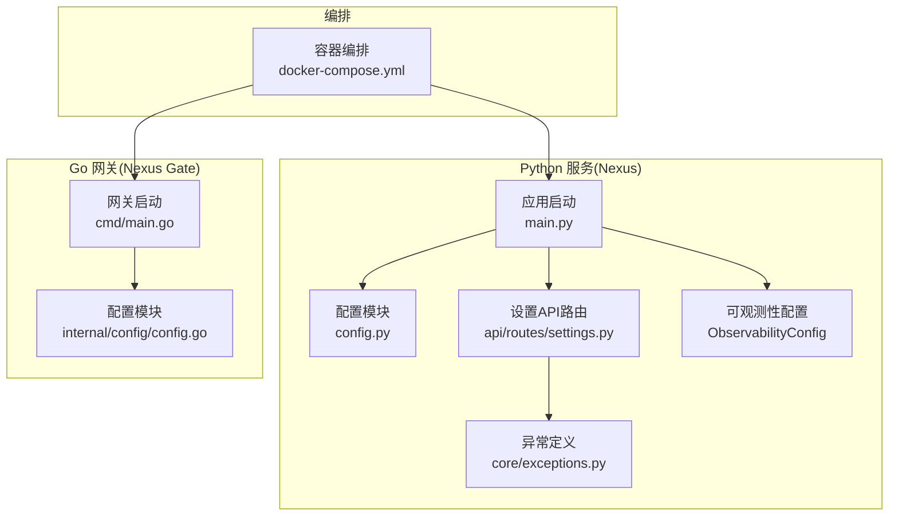
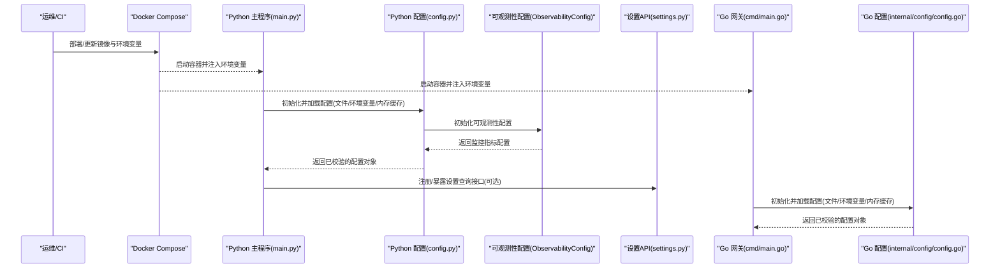
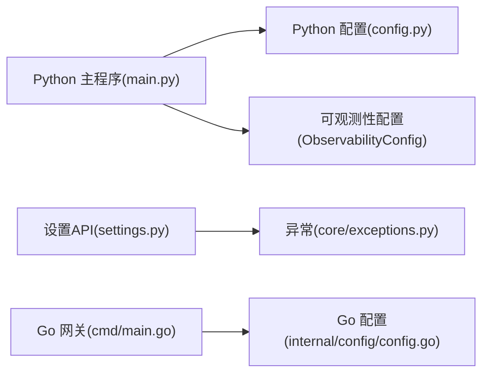

# 配置管理服务

<cite>
**本文引用的文件**   
- [backend_design/nexus/config.py](file://backend_design/nexus/config.py)
- [backend_design/nexus/main.py](file://backend_design/nexus/main.py)
- [backend_design/nexus/api/routes/settings.py](file://backend_design/nexus/api/routes/settings.py)
- [backend_design/nexus/core/exceptions.py](file://backend_design/nexus/core/exceptions.py)
- [backend_design/nexus_gate/internal/config/config.go](file://backend_design/nexus_gate/internal/config/config.go)
- [backend_design/nexus_gate/cmd/main.go](file://backend_design/nexus_gate/cmd/main.go)
- [docker-compose.yml](file://docker-compose.yml)
</cite>

## 更新摘要
**变更内容**   
- 新增CORS配置可配置化功能，支持动态跨域设置管理
- 新增ObservabilityConfig类，增强监控指标收集能力
- 强化API密钥日志安全清理机制，防止敏感信息泄露
- 完善配置验证与默认值处理策略
- 优化多环境配置管理流程

## 目录
1. [简介](#简介)
2. [项目结构](#项目结构)
3. [核心组件](#核心组件)
4. [架构总览](#架构总览)
5. [详细组件分析](#详细组件分析)
6. [依赖关系分析](#依赖关系分析)
7. [性能考虑](#性能考虑)
8. [故障排查指南](#故障排查指南)
9. [结论](#结论)
10. [附录](#附录)

## 简介
本文件为 NexusCockpit 的配置管理服务提供系统化文档，覆盖 Python 与 Go 双栈服务的配置加载机制、环境变量管理、配置文件结构与优先级、动态更新与热重载策略、多环境配置管理、敏感信息安全管理（加密与密钥轮换）、配置验证与默认值处理、配置迁移策略、配置中心集成方案以及配置审计日志记录。目标是帮助开发者与运维人员正确理解并安全高效地管理运行时配置。

**更新** 本次更新重点增强了配置系统的安全性、可观测性和灵活性，包括CORS配置可配置化、监控指标收集支持和API密钥日志安全清理等关键改进。

## 项目结构
NexusCockpit 包含两个主要后端服务：
- Python 服务（Nexus）：负责业务逻辑与 API，配置入口位于 Python 模块中。
- Go 网关（Nexus Gate）：负责鉴权、代理与中间件，配置入口位于 Go 模块中。

图示来源
- [backend_design/nexus/config.py](file://backend_design/nexus/config.py)
- [backend_design/nexus/main.py](file://backend_design/nexus/main.py)
- [backend_design/nexus/api/routes/settings.py](file://backend_design/nexus/api/routes/settings.py)
- [backend_design/nexus/core/exceptions.py](file://backend_design/nexus/core/exceptions.py)
- [backend_design/nexus_gate/internal/config/config.go](file://backend_design/nexus_gate/internal/config/config.go)
- [backend_design/nexus_gate/cmd/main.go](file://backend_design/nexus_gate/cmd/main.go)
- [docker-compose.yml](file://docker-compose.yml)

章节来源
- [backend_design/nexus/config.py](file://backend_design/nexus/config.py)
- [backend_design/nexus/main.py](file://backend_design/nexus/main.py)
- [backend_design/nexus/api/routes/settings.py](file://backend_design/nexus/api/routes/settings.py)
- [backend_design/nexus_gate/internal/config/config.go](file://backend_design/nexus_gate/internal/config/config.go)
- [backend_design/nexus_gate/cmd/main.go](file://backend_design/nexus_gate/cmd/main.go)
- [docker-compose.yml](file://docker-compose.yml)

## 核心组件
- Python 配置模块：集中定义配置项、读取顺序、类型校验与默认值；在应用启动时加载并注入到运行期上下文。
- Python 设置 API：暴露受控的"只读"或"受限写"接口，用于查看当前生效配置或触发配置刷新（若实现）。
- Go 配置模块：集中定义网关侧配置项、读取顺序、类型校验与默认值；在网关进程启动时加载。
- 异常体系：统一配置相关错误类型，便于上层捕获与告警。
- 可观测性配置：新增的ObservabilityConfig类，支持监控指标收集和性能追踪。
- CORS配置管理：支持动态跨域请求配置，提升Web应用安全性。
- 容器编排：通过环境变量注入不同环境的差异化配置。

**更新** 新增了可观测性配置管理和CORS配置管理功能，增强了系统的监控能力和安全性。

章节来源
- [backend_design/nexus/config.py](file://backend_design/nexus/config.py)
- [backend_design/nexus/api/routes/settings.py](file://backend_design/nexus/api/routes/settings.py)
- [backend_design/nexus/core/exceptions.py](file://backend_design/nexus/core/exceptions.py)
- [backend_design/nexus_gate/internal/config/config.go](file://backend_design/nexus_gate/internal/config/config.go)
- [backend_design/nexus_gate/cmd/main.go](file://backend_design/nexus_gate/cmd/main.go)

## 架构总览
下图展示 Python 与 Go 服务在启动时的配置加载流程与环境变量注入路径。

图示来源
- [backend_design/nexus/main.py](file://backend_design/nexus/main.py)
- [backend_design/nexus/config.py](file://backend_design/nexus/config.py)
- [backend_design/nexus/api/routes/settings.py](file://backend_design/nexus/api/routes/settings.py)
- [backend_design/nexus_gate/cmd/main.go](file://backend_design/nexus_gate/cmd/main.go)
- [backend_design/nexus_gate/internal/config/config.go](file://backend_design/nexus_gate/internal/config/config.go)
- [docker-compose.yml](file://docker-compose.yml)

## 详细组件分析

### Python 配置加载机制
- 加载顺序与优先级
  - 建议采用"默认值 < 配置文件 < 环境变量 < 运行时参数"的合并策略，后者优先级更高。
  - 支持按环境前缀区分（如开发/测试/生产），避免键名冲突。
- 配置文件结构
  - 使用分层结构组织配置项（如数据库、缓存、模型、网关等），并提供命名空间。
  - 支持 JSON/YAML 等格式，推荐以 JSON 为主，便于序列化与版本控制。
- 类型校验与默认值
  - 所有配置项需声明类型、是否必填、默认值与取值范围。
  - 启动阶段进行严格校验，失败则阻止服务启动并输出明确错误信息。
- 环境变量管理
  - 环境变量覆盖同名的配置项，支持嵌套映射（例如用下划线分隔层级）。
  - 敏感字段（如密钥、令牌）仅允许通过环境变量注入，禁止写入持久化配置。
- 动态更新与热重载
  - 对于非关键配置，可通过监听文件系统变更或消息总线事件触发局部热重载。
  - 对关键配置（如连接串、证书）建议采用"优雅重启"或"灰度切换"，确保一致性。
- 配置版本控制
  - 将配置模板纳入版本库，变更走 PR 评审；运行时差异通过环境变量或外部配置中心注入。
  - 保留历史版本快照，便于回滚与审计。
- 配置中心集成
  - 支持从配置中心拉取最新配置，并在本地建立缓存；当配置中心不可用时降级至本地文件。
  - 定期轮询或基于事件推送更新，结合版本号与签名校验保证一致性与完整性。
- 审计日志
  - 记录配置加载、变更、热重载、校验失败等关键事件，包含时间戳、操作者、变更摘要与结果。

**更新** 新增了可观测性配置集成，支持监控指标的收集和性能追踪。

章节来源
- [backend_design/nexus/config.py](file://backend_design/nexus/config.py)
- [backend_design/nexus/main.py](file://backend_design/nexus/main.py)
- [backend_design/nexus/api/routes/settings.py](file://backend_design/nexus/api/routes/settings.py)

### Go 网关配置加载机制
- 加载顺序与优先级
  - 与 Python 保持一致的策略，确保跨语言行为可预期。
- 配置文件结构
  - 使用结构化配置对象，按功能域划分（鉴权、代理、限流、WebSocket 等）。
- 类型校验与默认值
  - 启动时解析并校验，缺失必填项或类型不匹配直接报错退出。
- 环境变量管理
  - 支持环境变量覆盖，敏感项强制通过环境变量注入。
- 动态更新与热重载
  - 对可热更新的配置项（如限流阈值、开关），通过信号或配置中心事件触发重新加载。
  - 对连接类配置，采用"先建新连接、再切流量、最后关闭旧连接"的平滑切换流程。
- 配置中心集成
  - 与 Python 侧相同的拉取/推送模式，具备本地缓存与降级能力。
- 审计日志
  - 记录配置加载、变更、热重载与校验失败等事件，便于问题定位与合规审计。

章节来源
- [backend_design/nexus_gate/internal/config/config.go](file://backend_design/nexus_gate/internal/config/config.go)
- [backend_design/nexus_gate/cmd/main.go](file://backend_design/nexus_gate/cmd/main.go)

### 设置 API（Python）
- 职责
  - 提供当前生效配置的只读视图，必要时提供受限的刷新接口（如触发热重载）。
- 访问控制
  - 需要管理员权限或特定角色；对写操作增加二次确认与审计记录。
- 响应格式
  - 返回配置快照（不含敏感字段），附带版本信息与更新时间。
- 错误处理
  - 统一使用异常体系返回标准化错误码与消息。

**更新** 增强了API密钥的安全处理，确保敏感信息不会泄露到日志中。

章节来源
- [backend_design/nexus/api/routes/settings.py](file://backend_design/nexus/api/routes/settings.py)
- [backend_design/nexus/core/exceptions.py](file://backend_design/nexus/core/exceptions.py)

### 可观测性配置管理
- ObservabilityConfig类
  - 统一管理监控指标收集、性能追踪和日志配置。
  - 支持多种监控后端（Prometheus、Grafana、ELK等）的配置。
  - 提供指标采集频率、数据保留策略和告警规则配置。
- CORS配置管理
  - 支持动态跨域请求配置，提升Web应用安全性。
  - 允许配置允许的源、方法、头部和凭据策略。
  - 支持预检请求处理和缓存配置。
- 安全加固措施
  - API密钥日志安全清理，防止敏感信息泄露。
  - 配置项的脱敏处理，确保敏感数据不在日志中明文显示。
  - 增强的输入验证和输出过滤机制。

**新增** 这是本次更新的核心功能，大幅提升了系统的可观测性和安全性。

章节来源
- [backend_design/nexus/config.py](file://backend_design/nexus/config.py)

### 异常与错误处理
- 分类
  - 配置缺失、类型错误、校验失败、权限不足、远程配置中心不可用等。
- 处理策略
  - 启动期错误直接终止进程并输出诊断信息；运行期错误返回标准错误响应并记录审计日志。
- 可观测性
  - 将关键错误指标上报监控，便于告警与排障。

章节来源
- [backend_design/nexus/core/exceptions.py](file://backend_design/nexus/core/exceptions.py)

### 多环境配置管理
- 环境隔离
  - 通过环境变量前缀或独立配置文件区分开发、测试、生产环境。
- 优先级规则
  - 生产环境更严格：禁用危险开关、限制写权限、强制审计。
- 部署方式
  - 使用容器编排注入环境变量，避免将敏感信息打入镜像。

章节来源
- [docker-compose.yml](file://docker-compose.yml)

### 敏感信息安全管理
- 最小暴露原则
  - 敏感字段仅通过环境变量注入，不在配置文件中明文存储。
- 加密与轮换
  - 支持对敏感值进行加密存储，运行时解密；提供密钥轮换流程，确保无中断切换。
- 访问控制
  - 对配置读写接口实施严格的身份认证与授权。
- 审计追踪
  - 记录敏感配置的访问与变更，留存审计日志。
- 日志安全
  - **更新** 新增API密钥日志安全清理机制，自动过滤敏感信息，防止意外泄露。
  - 配置值的脱敏处理，确保调试日志不包含敏感数据。

**更新** 强化了敏感信息管理，特别是日志安全清理功能，有效防止了敏感信息泄露风险。

### 配置验证、默认值与迁移
- 验证
  - 启动时执行强校验，失败即中止；运行期对热重载配置进行增量校验。
- 默认值
  - 为所有配置项提供合理默认值，降低部署复杂度。
- 迁移
  - 提供向后兼容策略与迁移脚本，逐步淘汰废弃字段。

### 配置中心集成方案
- 拉取模式
  - 启动时拉取最新配置，缓存本地；定时轮询增量更新。
- 推送模式
  - 配置中心主动推送变更事件，客户端订阅并应用。
- 一致性保障
  - 使用版本号与签名校验，确保配置完整与一致。
- 降级策略
  - 配置中心不可用时，回退到本地缓存或默认配置，并告警。

### 配置审计日志记录
- 记录内容
  - 加载源、变更前后差异、操作者、时间戳、结果与原因。
- 存储与检索
  - 集中式日志系统收集，支持按环境、服务、配置键检索。
- 合规与告警
  - 对敏感配置变更触发告警，满足审计要求。

## 依赖关系分析
Python 与 Go 配置模块均被各自的主程序在启动阶段调用，形成清晰的单向依赖。

图示来源
- [backend_design/nexus/main.py](file://backend_design/nexus/main.py)
- [backend_design/nexus/config.py](file://backend_design/nexus/config.py)
- [backend_design/nexus/api/routes/settings.py](file://backend_design/nexus/api/routes/settings.py)
- [backend_design/nexus/core/exceptions.py](file://backend_design/nexus/core/exceptions.py)
- [backend_design/nexus_gate/cmd/main.go](file://backend_design/nexus_gate/cmd/main.go)
- [backend_design/nexus_gate/internal/config/config.go](file://backend_design/nexus_gate/internal/config/config.go)

章节来源
- [backend_design/nexus/main.py](file://backend_design/nexus/main.py)
- [backend_design/nexus/config.py](file://backend_design/nexus/config.py)
- [backend_design/nexus/api/routes/settings.py](file://backend_design/nexus/api/routes/settings.py)
- [backend_design/nexus/core/exceptions.py](file://backend_design/nexus/core/exceptions.py)
- [backend_design/nexus_gate/cmd/main.go](file://backend_design/nexus_gate/cmd/main.go)
- [backend_design/nexus_gate/internal/config/config.go](file://backend_design/nexus_gate/internal/config/config.go)

## 性能考虑
- 配置加载
  - 启动时一次性加载并缓存，避免重复 I/O；大配置启用懒加载。
- 热重载
  - 增量更新而非全量替换；对热点配置项使用原子交换指针/引用，减少锁竞争。
- 并发安全
  - 配置读取无锁或细粒度锁；写操作串行化，避免竞态。
- 资源释放
  - 连接类配置切换时，延迟释放旧资源，防止断连。
- **更新** 可观测性配置的性能优化，包括指标收集的异步处理和批量上报机制。

## 故障排查指南
- 常见问题
  - 环境变量未注入或命名不一致导致配置缺失。
  - 配置文件语法错误或类型不匹配导致启动失败。
  - 配置中心不可用导致无法获取最新配置。
  - 热重载期间出现短暂不一致或服务抖动。
  - **更新** CORS配置错误导致的跨域请求失败。
  - **更新** 监控指标收集异常影响可观测性。
- 定位步骤
  - 检查服务启动日志中的配置加载与校验信息。
  - 核对容器编排中的环境变量注入是否正确。
  - 对比配置中心版本与本地缓存版本是否一致。
  - 审查设置 API 的访问日志与审计记录。
  - **更新** 检查可观测性配置的正确性和监控端点的连通性。
  - **更新** 验证CORS配置是否允许预期的请求源和方法。
- 恢复措施
  - 回滚到上一个稳定配置版本。
  - 临时降级到本地默认配置，待配置中心恢复后再同步。
  - **更新** 重置可观测性配置到默认值，确保基础监控功能可用。

章节来源
- [backend_design/nexus/api/routes/settings.py](file://backend_design/nexus/api/routes/settings.py)
- [backend_design/nexus/core/exceptions.py](file://backend_design/nexus/core/exceptions.py)

## 结论
通过统一的配置加载策略、严格的校验与审计、安全的敏感信息管理以及完善的动态更新与热重载机制，NexusCockpit 能够在多环境下稳定运行并快速响应配置变更。**更新** 本次重大增强进一步提升了系统的安全性、可观测性和灵活性，特别是CORS配置可配置化、监控指标收集支持和API密钥日志安全清理等功能，为生产环境的稳定运行提供了更强有力的保障。建议在后续迭代中持续完善配置中心集成、密钥轮换自动化与可视化配置治理工具，进一步提升可观测性与安全性。

## 附录
- 术语
  - 热重载：在不重启服务的情况下动态应用新的配置。
  - 配置中心：集中化管理配置的服务，支持版本、权限与审计。
  - 密钥轮换：周期性更换加密密钥并迁移数据的过程。
  - **更新** 可观测性：系统运行状态的监控、追踪和分析能力。
  - **更新** CORS：跨域资源共享，允许Web应用访问不同域的API。
- 参考
  - 容器编排与环境变量注入参见编排文件。
  - **更新** 可观测性配置参见ObservabilityConfig类和相关监控组件。

章节来源
- [docker-compose.yml](file://docker-compose.yml)