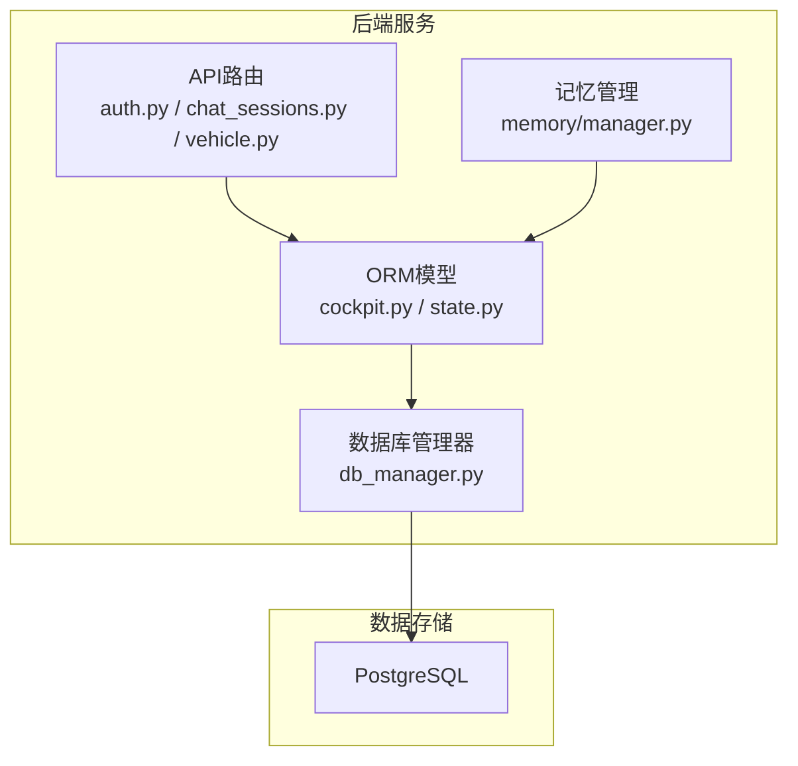
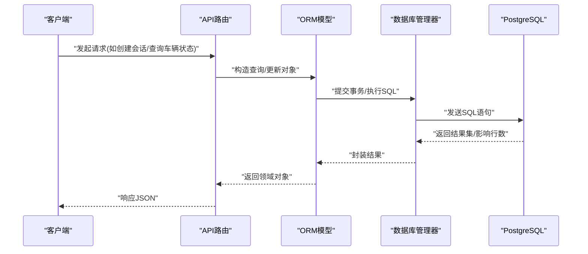
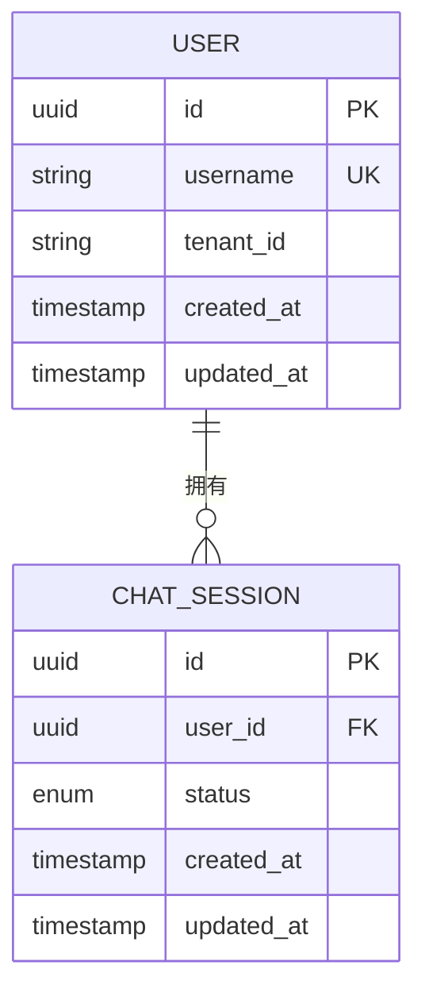
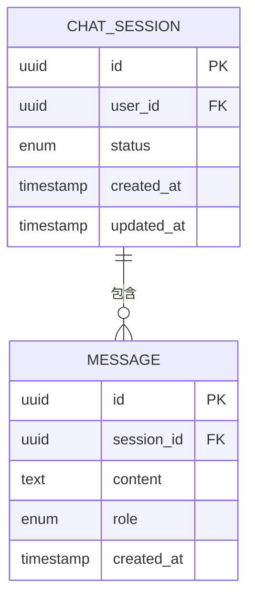
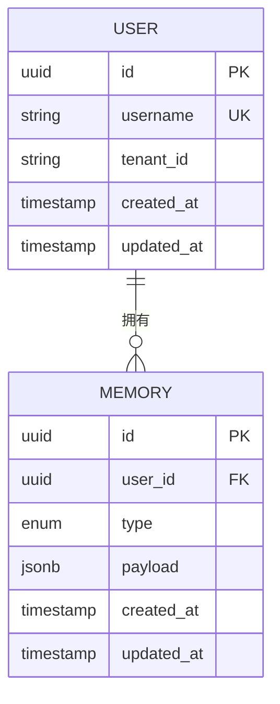
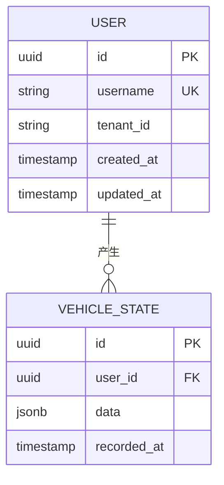
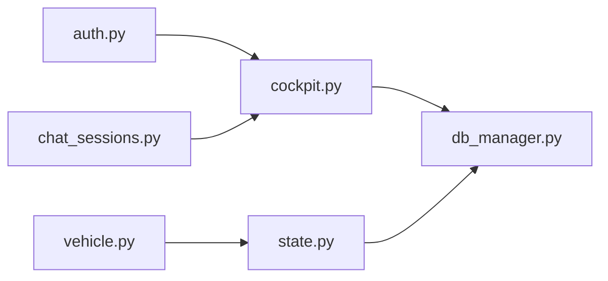

# 关系型数据模型

<cite>
**本文引用的文件**   
- [backend_design/nexus/core/db_manager.py](file://backend_design/nexus/core/db_manager.py)
- [backend_design/nexus/models/cockpit.py](file://backend_design/nexus/models/cockpit.py)
- [backend_design/nexus/models/state.py](file://backend_design/nexus/models/state.py)
- [backend_design/nexus/api/routes/auth.py](file://backend_design/nexus/api/routes/auth.py)
- [backend_design/nexus/api/routes/chat_sessions.py](file://backend_design/nexus/api/routes/chat_sessions.py)
- [backend_design/nexus/api/routes/vehicle.py](file://backend_design/nexus/api/routes/vehicle.py)
- [backend_design/nexus/memory/manager.py](file://backend_design/nexus/memory/manager.py)
- [backend_design/scripts/v2.1_migration.sql](file://backend_design/scripts/v2.1_migration.sql)
- [backend_design/tests/test_v21.py](file://backend_design/tests/test_v21.py)
</cite>

## 目录
1. [简介](#简介)
2. [项目结构](#项目结构)
3. [核心组件](#核心组件)
4. [架构总览](#架构总览)
5. [详细组件分析](#详细组件分析)
6. [依赖分析](#依赖分析)
7. [性能考虑](#性能考虑)
8. [故障排查指南](#故障排查指南)
9. [结论](#结论)
10. [附录](#附录)

## 简介
本文件面向NexusCockpit系统的关系型数据模型，聚焦PostgreSQL数据库的表结构设计、实体与关联、完整性约束与索引策略、迁移与版本管理、数据访问最佳实践，以及数据安全与权限控制（含行级安全与脱敏）。文档以代码仓库中的ORM模型定义、数据库连接管理、API路由及迁移脚本为依据，提供从概念到落地的完整说明。

## 项目结构
与关系型数据相关的后端实现主要位于以下位置：
- ORM模型定义：models/cockpit.py、models/state.py
- 数据库连接与事务管理：core/db_manager.py
- 会话与认证相关API：api/routes/auth.py、api/routes/chat_sessions.py
- 车辆状态读写入口：api/routes/vehicle.py
- 记忆持久化入口：memory/manager.py
- 迁移脚本与测试：scripts/v2.1_migration.sql、tests/test_v21.py

图表来源
- [backend_design/nexus/api/routes/auth.py](file://backend_design/nexus/api/routes/auth.py)
- [backend_design/nexus/api/routes/chat_sessions.py](file://backend_design/nexus/api/routes/chat_sessions.py)
- [backend_design/nexus/api/routes/vehicle.py](file://backend_design/nexus/api/routes/vehicle.py)
- [backend_design/nexus/models/cockpit.py](file://backend_design/nexus/models/cockpit.py)
- [backend_design/nexus/models/state.py](file://backend_design/nexus/models/state.py)
- [backend_design/nexus/core/db_manager.py](file://backend_design/nexus/core/db_manager.py)
- [backend_design/nexus/memory/manager.py](file://backend_design/nexus/memory/manager.py)

章节来源
- [backend_design/nexus/models/cockpit.py](file://backend_design/nexus/models/cockpit.py)
- [backend_design/nexus/models/state.py](file://backend_design/nexus/models/state.py)
- [backend_design/nexus/core/db_manager.py](file://backend_design/nexus/core/db_manager.py)
- [backend_design/nexus/api/routes/auth.py](file://backend_design/nexus/api/routes/auth.py)
- [backend_design/nexus/api/routes/chat_sessions.py](file://backend_design/nexus/api/routes/chat_sessions.py)
- [backend_design/nexus/api/routes/vehicle.py](file://backend_design/nexus/api/routes/vehicle.py)
- [backend_design/nexus/memory/manager.py](file://backend_design/nexus/memory/manager.py)

## 核心组件
本节概述与关系型数据直接相关的核心模块职责与交互方式：
- ORM模型层：集中定义用户、会话、车辆状态、记忆等实体的字段、类型与约束，作为数据访问的统一契约。
- 数据库管理层：封装连接池、事务边界、重试与错误处理，为上层提供一致的SQL执行上下文。
- API路由层：将HTTP请求映射到业务逻辑，并通过ORM进行数据读写。
- 记忆管理：负责记忆的抽取、冲突解决与持久化，通常通过ORM写入关系型存储或向量库。

章节来源
- [backend_design/nexus/models/cockpit.py](file://backend_design/nexus/models/cockpit.py)
- [backend_design/nexus/models/state.py](file://backend_design/nexus/models/state.py)
- [backend_design/nexus/core/db_manager.py](file://backend_design/nexus/core/db_manager.py)
- [backend_design/nexus/memory/manager.py](file://backend_design/nexus/memory/manager.py)

## 架构总览
下图展示从API到数据库的数据流路径，体现“路由→模型→DB管理器→PostgreSQL”的分层调用关系。

图表来源
- [backend_design/nexus/api/routes/auth.py](file://backend_design/nexus/api/routes/auth.py)
- [backend_design/nexus/api/routes/chat_sessions.py](file://backend_design/nexus/api/routes/chat_sessions.py)
- [backend_design/nexus/api/routes/vehicle.py](file://backend_design/nexus/api/routes/vehicle.py)
- [backend_design/nexus/models/cockpit.py](file://backend_design/nexus/models/cockpit.py)
- [backend_design/nexus/models/state.py](file://backend_design/nexus/models/state.py)
- [backend_design/nexus/core/db_manager.py](file://backend_design/nexus/core/db_manager.py)

## 详细组件分析

### 实体与表设计概览
基于ORM模型定义，系统包含但不限于以下核心实体：
- 用户（User）：身份标识、认证信息、租户隔离键等。
- 会话（ChatSession）：对话会话元数据、状态、时间戳等。
- 车辆状态（VehicleState）：车辆实时/历史状态快照。
- 记忆（Memory）：用户偏好、习惯、健康记录等结构化记忆条目。

这些实体在关系型数据库中对应表结构，具备主键、外键、唯一约束与必要的复合索引，以满足查询性能与一致性要求。

章节来源
- [backend_design/nexus/models/cockpit.py](file://backend_design/nexus/models/cockpit.py)
- [backend_design/nexus/models/state.py](file://backend_design/nexus/models/state.py)

### 用户与会话的关系（一对多）
- 关系描述：一个用户可拥有多个会话；每个会话属于一个用户。
- 实现方式：会话表包含用户ID外键，指向用户表主键。
- 约束与索引：
  - 会话表的用户ID列建立外键约束，确保引用完整性。
  - 针对用户ID建立索引，加速按用户检索会话列表。
- 典型查询：
  - 获取某用户的所有会话（按时间倒序分页）。
  - 删除用户时级联清理其会话（根据业务策略选择RESTRICT或CASCADE）。

图表来源
- [backend_design/nexus/models/cockpit.py](file://backend_design/nexus/models/cockpit.py)
- [backend_design/nexus/models/state.py](file://backend_design/nexus/models/state.py)

章节来源
- [backend_design/nexus/models/cockpit.py](file://backend_design/nexus/models/cockpit.py)
- [backend_design/nexus/models/state.py](file://backend_design/nexus/models/state.py)

### 会话与消息/片段的关系（一对多）
- 关系描述：一个会话包含多条消息或片段；每条消息归属于一个会话。
- 实现方式：消息表包含会话ID外键，指向会话表主键。
- 约束与索引：
  - 会话ID外键约束保证消息与会话的一致性。
  - 针对会话ID与时间戳建立复合索引，优化会话内消息的时间范围查询。
- 典型查询：
  - 获取某会话的消息列表（按时间排序分页）。
  - 统计会话消息数量与最近更新时间。

图表来源
- [backend_design/nexus/models/cockpit.py](file://backend_design/nexus/models/cockpit.py)
- [backend_design/nexus/models/state.py](file://backend_design/nexus/models/state.py)

章节来源
- [backend_design/nexus/models/cockpit.py](file://backend_design/nexus/models/cockpit.py)
- [backend_design/nexus/models/state.py](file://backend_design/nexus/models/state.py)

### 用户与记忆的关系（一对多）
- 关系描述：一个用户可拥有多条记忆；每条记忆归属一个用户。
- 实现方式：记忆表包含用户ID外键，指向用户表主键。
- 约束与索引：
  - 用户ID外键约束保障引用完整性。
  - 针对用户ID与记忆类型建立复合索引，支持按用户和类别快速检索。
- 典型查询：
  - 获取用户的某类记忆（如偏好、健康）。
  - 合并或覆盖同类型的旧记忆（依据冲突解决策略）。

图表来源
- [backend_design/nexus/models/cockpit.py](file://backend_design/nexus/models/cockpit.py)
- [backend_design/nexus/models/state.py](file://backend_design/nexus/models/state.py)

章节来源
- [backend_design/nexus/models/cockpit.py](file://backend_design/nexus/models/cockpit.py)
- [backend_design/nexus/models/state.py](file://backend_design/nexus/models/state.py)

### 用户与车辆状态的关系（一对多）
- 关系描述：一个用户可拥有多个车辆状态记录；每条状态记录归属一个用户。
- 实现方式：车辆状态表包含用户ID外键，指向用户表主键。
- 约束与索引：
  - 用户ID外键约束确保状态归属正确。
  - 针对用户ID与时间戳建立复合索引，支持按用户查询历史状态。
- 典型查询：
  - 获取某用户在指定时间窗口的车辆状态序列。
  - 聚合计算关键指标（如能耗、里程）。

图表来源
- [backend_design/nexus/models/cockpit.py](file://backend_design/nexus/models/cockpit.py)
- [backend_design/nexus/models/state.py](file://backend_design/nexus/models/state.py)

章节来源
- [backend_design/nexus/models/cockpit.py](file://backend_design/nexus/models/cockpit.py)
- [backend_design/nexus/models/state.py](file://backend_design/nexus/models/state.py)

### 数据迁移与版本管理
- 增量迁移：使用SQL脚本对数据库结构进行增量变更，例如新增表、添加列、创建索引、修改约束等。
- 回滚机制：为每次迁移准备对应的回滚脚本，确保在失败或需要撤销时能恢复到上一版本。
- 版本追踪：通过迁移版本号或元数据表记录已应用的迁移，避免重复执行。
- 测试验证：在测试环境中执行迁移并运行集成测试，确保结构与数据一致性。

章节来源
- [backend_design/scripts/v2.1_migration.sql](file://backend_design/scripts/v2.1_migration.sql)
- [backend_design/tests/test_v21.py](file://backend_design/tests/test_v21.py)

### 数据访问模式与ORM规范
- 连接与事务：
  - 使用数据库管理器统一获取连接与事务上下文，确保同一请求内的多次写操作在同一事务中。
  - 明确事务边界，避免长事务导致锁竞争。
- 查询优化：
  - 优先使用索引列过滤与排序，减少全表扫描。
  - 分页查询采用游标或基于主键的范围条件，避免深度分页性能问题。
  - 复杂查询尽量拆分为多次简单查询，结合应用层组装，降低数据库压力。
- 批量操作：
  - 批量插入/更新使用批量接口，减少往返开销。
  - 注意批量大小与内存占用平衡。
- 异常处理：
  - 捕获数据库异常并进行分类处理（超时、死锁、约束冲突等），必要时进行重试或降级。

章节来源
- [backend_design/nexus/core/db_manager.py](file://backend_design/nexus/core/db_manager.py)
- [backend_design/nexus/models/cockpit.py](file://backend_design/nexus/models/cockpit.py)
- [backend_design/nexus/models/state.py](file://backend_design/nexus/models/state.py)

### 数据安全与权限控制
- 行级安全策略（RLS）：
  - 在用户表与租户上下文中，启用行级安全，限制每行数据的可见性，确保用户仅能访问自身数据。
  - 结合会话中的租户ID与用户ID动态评估访问权限。
- 数据脱敏：
  - 对外暴露敏感字段（如手机号、邮箱）时，在服务层进行脱敏处理，避免原始数据泄露。
  - 日志与监控中避免记录敏感信息。
- 审计与合规：
  - 记录关键数据变更的审计日志，包括操作人、时间、变更内容摘要。
  - 定期审查权限配置与数据访问模式，确保符合合规要求。

章节来源
- [backend_design/nexus/core/db_manager.py](file://backend_design/nexus/core/db_manager.py)
- [backend_design/nexus/models/cockpit.py](file://backend_design/nexus/models/cockpit.py)
- [backend_design/nexus/models/state.py](file://backend_design/nexus/models/state.py)

## 依赖分析
下图展示API路由、ORM模型与数据库管理器之间的依赖关系，帮助理解数据访问链路。

图表来源
- [backend_design/nexus/api/routes/auth.py](file://backend_design/nexus/api/routes/auth.py)
- [backend_design/nexus/api/routes/chat_sessions.py](file://backend_design/nexus/api/routes/chat_sessions.py)
- [backend_design/nexus/api/routes/vehicle.py](file://backend_design/nexus/api/routes/vehicle.py)
- [backend_design/nexus/models/cockpit.py](file://backend_design/nexus/models/cockpit.py)
- [backend_design/nexus/models/state.py](file://backend_design/nexus/models/state.py)
- [backend_design/nexus/core/db_manager.py](file://backend_design/nexus/core/db_manager.py)

章节来源
- [backend_design/nexus/api/routes/auth.py](file://backend_design/nexus/api/routes/auth.py)
- [backend_design/nexus/api/routes/chat_sessions.py](file://backend_design/nexus/api/routes/chat_sessions.py)
- [backend_design/nexus/api/routes/vehicle.py](file://backend_design/nexus/api/routes/vehicle.py)
- [backend_design/nexus/models/cockpit.py](file://backend_design/nexus/models/cockpit.py)
- [backend_design/nexus/models/state.py](file://backend_design/nexus/models/state.py)
- [backend_design/nexus/core/db_manager.py](file://backend_design/nexus/core/db_manager.py)

## 性能考虑
- 索引策略：
  - 为高频查询列建立单列索引，如用户ID、会话ID、时间戳。
  - 针对复合查询条件建立复合索引，如（用户ID, 时间戳）、（会话ID, 角色）。
- 分区与归档：
  - 对大表（如车辆状态、消息）按时间分区，提升查询与维护效率。
  - 冷数据归档至低成本存储，保持热表规模可控。
- 缓存与预取：
  - 热点数据（如用户基本信息、常用记忆）引入缓存层，减轻数据库压力。
  - 合理预加载关联数据，减少N+1查询问题。
- 连接池与并发：
  - 调整连接池大小与超时参数，匹配负载特征。
  - 避免在事务中进行外部I/O，缩短事务持有时间。

[本节为通用性能建议，不直接分析具体文件]

## 故障排查指南
- 常见错误定位：
  - 外键约束冲突：检查父表是否存在对应记录，确认级联策略是否符合预期。
  - 唯一约束冲突：排查并发写入是否生成重复键，必要时增加去重逻辑。
  - 死锁与超时：分析事务粒度与锁顺序，拆分长事务，优化索引以减少锁竞争。
- 诊断工具：
  - 启用慢查询日志，定位低效SQL。
  - 使用EXPLAIN/ANALYZE分析执行计划，识别缺失索引或不当扫描。
- 回滚与恢复：
  - 执行迁移前备份关键表，准备回滚脚本。
  - 在测试环境充分验证后再应用到生产。

章节来源
- [backend_design/nexus/core/db_manager.py](file://backend_design/nexus/core/db_manager.py)
- [backend_design/scripts/v2.1_migration.sql](file://backend_design/scripts/v2.1_migration.sql)
- [backend_design/tests/test_v21.py](file://backend_design/tests/test_v21.py)

## 结论
NexusCockpit的关系型数据模型围绕用户、会话、车辆状态与记忆四大核心实体构建，采用清晰的一对多关系与严格的完整性约束，配合合理的索引与分区策略，满足高并发与可扩展需求。通过统一的数据库管理与事务控制，结合行级安全与数据脱敏，系统在数据一致性与安全性方面具备良好基础。建议在后续迭代中持续完善迁移版本管理、审计与监控能力，进一步提升运维与合规水平。

[本节为总结性内容，不直接分析具体文件]

## 附录
- 术语说明：
  - RLS：行级安全（Row-Level Security），用于细粒度数据访问控制。
  - ORM：对象关系映射，用于在代码与数据库之间建立抽象层。
- 参考路径：
  - 模型定义：[backend_design/nexus/models/cockpit.py](file://backend_design/nexus/models/cockpit.py)、[backend_design/nexus/models/state.py](file://backend_design/nexus/models/state.py)
  - 数据库管理：[backend_design/nexus/core/db_manager.py](file://backend_design/nexus/core/db_manager.py)
  - API路由：[backend_design/nexus/api/routes/auth.py](file://backend_design/nexus/api/routes/auth.py)、[backend_design/nexus/api/routes/chat_sessions.py](file://backend_design/nexus/api/routes/chat_sessions.py)、[backend_design/nexus/api/routes/vehicle.py](file://backend_design/nexus/api/routes/vehicle.py)
  - 记忆管理：[backend_design/nexus/memory/manager.py](file://backend_design/nexus/memory/manager.py)
  - 迁移与测试：[backend_design/scripts/v2.1_migration.sql](file://backend_design/scripts/v2.1_migration.sql)、[backend_design/tests/test_v21.py](file://backend_design/tests/test_v21.py)