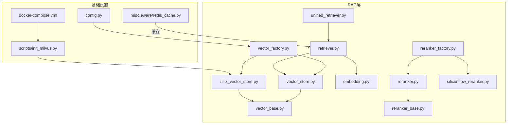
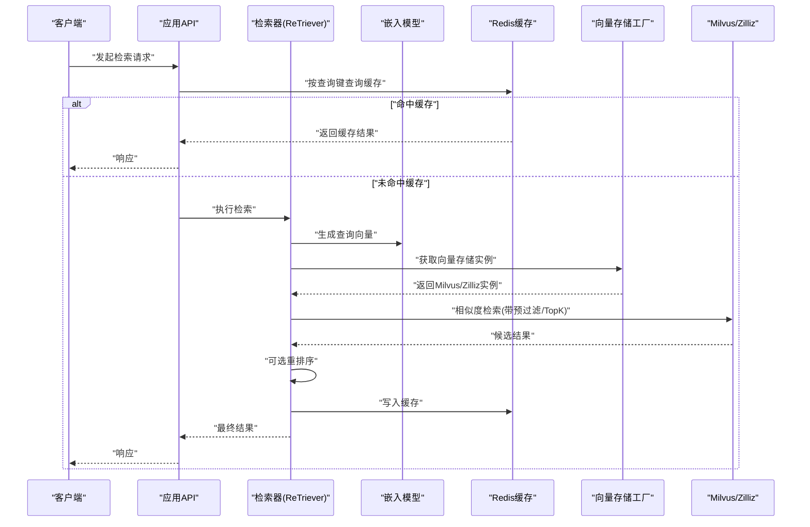
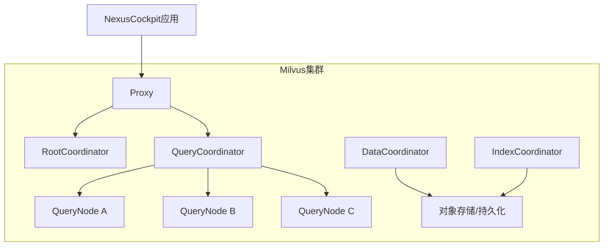
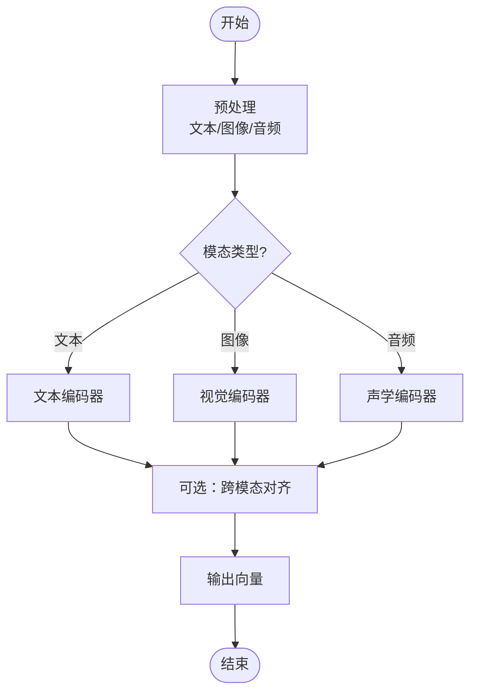
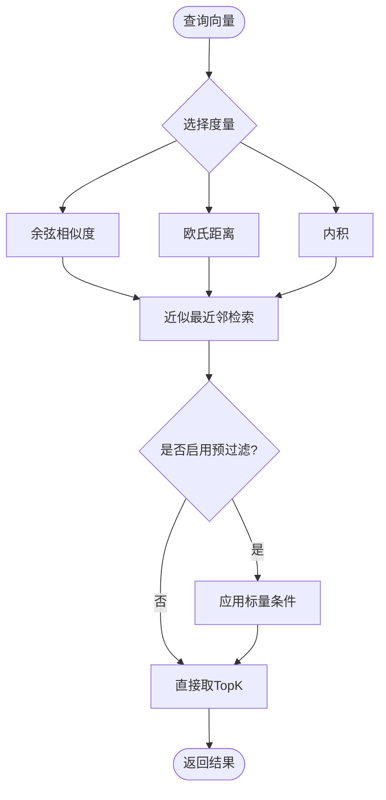
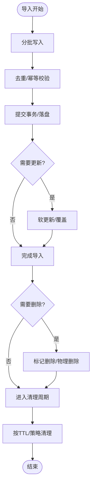
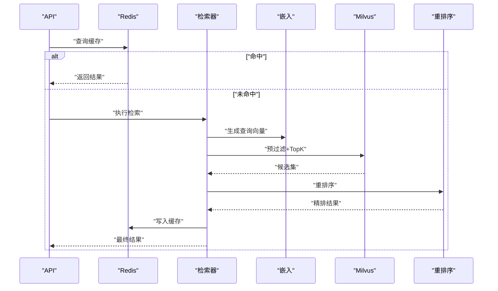
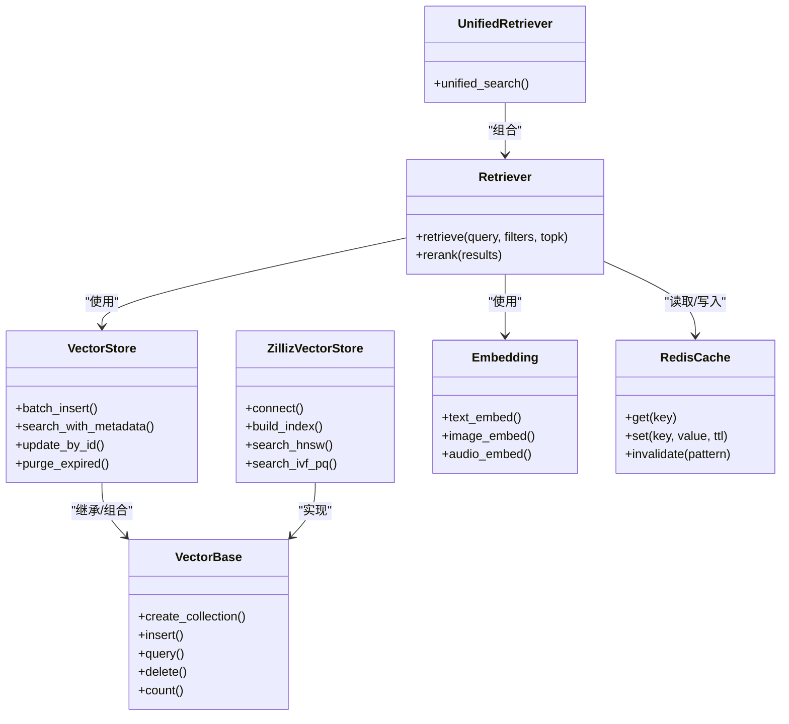

# 向量数据库架构

<cite>
**本文引用的文件**   
- [backend_design/nexus/rag/vector_store.py](file://backend_design/nexus/rag/vector_store.py)
- [backend_design/nexus/rag/vector_base.py](file://backend_design/nexus/rag/vector_base.py)
- [backend_design/nexus/rag/vector_factory.py](file://backend_design/nexus/rag/vector_factory.py)
- [backend_design/nexus/rag/zilliz_vector_store.py](file://backend_design/nexus/rag/zilliz_vector_store.py)
- [backend_design/nexus/rag/embedding.py](file://backend_design/nexus/rag/embedding.py)
- [backend_design/nexus/rag/retriever.py](file://backend_design/nexus/rag/retriever.py)
- [backend_design/nexus/rag/unified_retriever.py](file://backend_design/nexus/rag/unified_retriever.py)
- [backend_design/nexus/rag/reranker.py](file://backend_design/nexus/rag/reranker.py)
- [backend_design/nexus/rag/reranker_base.py](file://backend_design/nexus/rag/reranker_base.py)
- [backend_design/nexus/rag/reranker_factory.py](file://backend_design/nexus/rag/reranker_factory.py)
- [backend_design/nexus/rag/siliconflow_reranker.py](file://backend_design/nexus/rag/siliconflow_reranker.py)
- [backend_design/scripts/init_milvus.py](file://backend_design/scripts/init_milvus.py)
- [backend_design/nexus/middleware/redis_cache.py](file://backend_design/nexus/middleware/redis_cache.py)
- [backend_design/nexus/config.py](file://backend_design/nexus/config.py)
- [docker-compose.yml](file://docker-compose.yml)
</cite>

## 目录
1. [简介](#简介)
2. [项目结构](#项目结构)
3. [核心组件](#核心组件)
4. [架构总览](#架构总览)
5. [详细组件分析](#详细组件分析)
6. [依赖关系分析](#依赖关系分析)
7. [性能考虑](#性能考虑)
8. [故障排查指南](#故障排查指南)
9. [结论](#结论)
10. [附录](#附录)

## 简介
本文件面向NexusCockpit系统的向量数据库架构，聚焦Milvus（含Zilliz Cloud）的部署与集群配置、分片与副本策略、负载均衡；阐述文本、图像、音频等多模态嵌入生成流程；说明相似度计算与检索算法；给出索引类型选择建议（HNSW、IVF、PQ等）；覆盖向量数据生命周期管理（导入、更新、删除、清理）；并提供检索优化技术（预过滤、重排序、缓存）。

## 项目结构
与向量数据库相关的代码主要位于RAG模块与初始化脚本中：
- RAG抽象与实现：vector_base、vector_store、vector_factory、zilliz_vector_store
- 嵌入与检索：embedding、retriever、unified_retriever
- 重排序：reranker、reranker_base、reranker_factory、siliconflow_reranker
- 中间件缓存：redis_cache
- 配置与启动：config、init_milvus、docker-compose

图表来源
- [backend_design/nexus/rag/vector_factory.py](file://backend_design/nexus/rag/vector_factory.py)
- [backend_design/nexus/rag/vector_store.py](file://backend_design/nexus/rag/vector_store.py)
- [backend_design/nexus/rag/vector_base.py](file://backend_design/nexus/rag/vector_base.py)
- [backend_design/nexus/rag/zilliz_vector_store.py](file://backend_design/nexus/rag/zilliz_vector_store.py)
- [backend_design/nexus/rag/embedding.py](file://backend_design/nexus/rag/embedding.py)
- [backend_design/nexus/rag/retriever.py](file://backend_design/nexus/rag/retriever.py)
- [backend_design/nexus/rag/unified_retriever.py](file://backend_design/nexus/rag/unified_retriever.py)
- [backend_design/nexus/rag/reranker.py](file://backend_design/nexus/rag/reranker.py)
- [backend_design/nexus/rag/reranker_base.py](file://backend_design/nexus/rag/reranker_base.py)
- [backend_design/nexus/rag/reranker_factory.py](file://backend_design/nexus/rag/reranker_factory.py)
- [backend_design/nexus/rag/siliconflow_reranker.py](file://backend_design/nexus/rag/siliconflow_reranker.py)
- [backend_design/nexus/middleware/redis_cache.py](file://backend_design/nexus/middleware/redis_cache.py)
- [backend_design/nexus/config.py](file://backend_design/nexus/config.py)
- [backend_design/scripts/init_milvus.py](file://backend_design/scripts/init_milvus.py)
- [docker-compose.yml](file://docker-compose.yml)

章节来源
- [backend_design/nexus/rag/vector_store.py](file://backend_design/nexus/rag/vector_store.py)
- [backend_design/nexus/rag/vector_base.py](file://backend_design/nexus/rag/vector_base.py)
- [backend_design/nexus/rag/vector_factory.py](file://backend_design/nexus/rag/vector_factory.py)
- [backend_design/nexus/rag/zilliz_vector_store.py](file://backend_design/nexus/rag/zilliz_vector_store.py)
- [backend_design/nexus/rag/embedding.py](file://backend_design/nexus/rag/embedding.py)
- [backend_design/nexus/rag/retriever.py](file://backend_design/nexus/rag/retriever.py)
- [backend_design/nexus/rag/unified_retriever.py](file://backend_design/nexus/rag/unified_retriever.py)
- [backend_design/nexus/rag/reranker.py](file://backend_design/nexus/rag/reranker.py)
- [backend_design/nexus/rag/reranker_base.py](file://backend_design/nexus/rag/reranker_base.py)
- [backend_design/nexus/rag/reranker_factory.py](file://backend_design/nexus/rag/reranker_factory.py)
- [backend_design/nexus/rag/siliconflow_reranker.py](file://backend_design/nexus/rag/siliconflow_reranker.py)
- [backend_design/nexus/middleware/redis_cache.py](file://backend_design/nexus/middleware/redis_cache.py)
- [backend_design/nexus/config.py](file://backend_design/nexus/config.py)
- [backend_design/scripts/init_milvus.py](file://backend_design/scripts/init_milvus.py)
- [docker-compose.yml](file://docker-compose.yml)

## 核心组件
- 向量存储抽象与工厂
  - vector_base：定义统一的集合操作接口（创建集合、插入、查询、删除、统计等），屏蔽底层差异。
  - vector_store：通用封装，提供批量写入、分页查询、元数据字段映射等能力。
  - vector_factory：根据配置动态选择具体实现（如本地或Zilliz/Milvus）。
  - zilliz_vector_store：基于Milvus/Zilliz的具体实现，负责连接、集合管理、索引与查询参数构造。
- 嵌入与检索
  - embedding：多模态嵌入生成入口，支持文本、图像、音频向量化。
  - retriever：检索编排器，串联“嵌入→检索→可选重排序”的流程。
  - unified_retriever：统一检索入口，聚合多种数据源与策略。
- 重排序
  - reranker_base / reranker / reranker_factory：重排序抽象与工厂，支持多种后端。
  - siliconflow_reranker：基于SiliconFlow的重排序实现。
- 缓存与配置
  - redis_cache：对高频检索结果进行缓存，降低延迟与下游压力。
  - config：集中管理Milvus/Zilliz连接、集合、索引等配置项。
- 初始化与部署
  - init_milvus：在Milvus/Zilliz上创建集合、设置索引与分区策略。
  - docker-compose：编排Milvus服务及依赖。

章节来源
- [backend_design/nexus/rag/vector_base.py](file://backend_design/nexus/rag/vector_base.py)
- [backend_design/nexus/rag/vector_store.py](file://backend_design/nexus/rag/vector_store.py)
- [backend_design/nexus/rag/vector_factory.py](file://backend_design/nexus/rag/vector_factory.py)
- [backend_design/nexus/rag/zilliz_vector_store.py](file://backend_design/nexus/rag/zilliz_vector_store.py)
- [backend_design/nexus/rag/embedding.py](file://backend_design/nexus/rag/embedding.py)
- [backend_design/nexus/rag/retriever.py](file://backend_design/nexus/rag/retriever.py)
- [backend_design/nexus/rag/unified_retriever.py](file://backend_design/nexus/rag/unified_retriever.py)
- [backend_design/nexus/rag/reranker.py](file://backend_design/nexus/rag/reranker.py)
- [backend_design/nexus/rag/reranker_base.py](file://backend_design/nexus/rag/reranker_base.py)
- [backend_design/nexus/rag/reranker_factory.py](file://backend_design/nexus/rag/reranker_factory.py)
- [backend_design/nexus/rag/siliconflow_reranker.py](file://backend_design/nexus/rag/siliconflow_reranker.py)
- [backend_design/nexus/middleware/redis_cache.py](file://backend_design/nexus/middleware/redis_cache.py)
- [backend_design/nexus/config.py](file://backend_design/nexus/config.py)
- [backend_design/scripts/init_milvus.py](file://backend_design/scripts/init_milvus.py)
- [docker-compose.yml](file://docker-compose.yml)

## 架构总览
下图展示从请求到向量检索与重排序的整体流程，以及Milvus集群的关键角色。

图表来源
- [backend_design/nexus/rag/retriever.py](file://backend_design/nexus/rag/retriever.py)
- [backend_design/nexus/rag/unified_retriever.py](file://backend_design/nexus/rag/unified_retriever.py)
- [backend_design/nexus/rag/embedding.py](file://backend_design/nexus/rag/embedding.py)
- [backend_design/nexus/rag/vector_factory.py](file://backend_design/nexus/rag/vector_factory.py)
- [backend_design/nexus/rag/zilliz_vector_store.py](file://backend_design/nexus/rag/zilliz_vector_store.py)
- [backend_design/nexus/middleware/redis_cache.py](file://backend_design/nexus/middleware/redis_cache.py)

## 详细组件分析

### Milvus/Zilliz 部署与集群架构
- 部署方式
  - 通过docker-compose编排Milvus服务，便于本地与测试环境快速拉起。
  - 生产可切换至Zilliz Cloud，保持接口一致。
- 集合与索引初始化
  - 使用init_milvus脚本在Milvus/Zilliz上创建集合、定义字段与索引，确保与代码中的schema一致。
- 分片与副本
  - 分片策略：依据集合维度与数据规模合理设置partition_key与shard_num，使写入与查询均匀分布。
  - 副本管理：为高可用与读扩展，配置合理的副本数；结合读写分离与只读节点提升吞吐。
- 负载均衡
  - 客户端侧：通过连接池与重试机制分散请求。
  - 服务端：Milvus内部将查询路由至对应分片与副本，配合资源组与队列控制负载。

图表来源
- [docker-compose.yml](file://docker-compose.yml)
- [backend_design/scripts/init_milvus.py](file://backend_design/scripts/init_milvus.py)
- [backend_design/nexus/rag/zilliz_vector_store.py](file://backend_design/nexus/rag/zilliz_vector_store.py)

章节来源
- [docker-compose.yml](file://docker-compose.yml)
- [backend_design/scripts/init_milvus.py](file://backend_design/scripts/init_milvus.py)
- [backend_design/nexus/rag/zilliz_vector_store.py](file://backend_design/nexus/rag/zilliz_vector_store.py)

### 向量嵌入生成流程（文本/图像/音频）
- 文本向量化
  - 输入预处理（清洗、截断、语言检测）→ 调用文本编码器 → 输出固定维度向量。
- 图像向量化
  - 图像解码与归一化 → 视觉编码器 → 输出向量；必要时做特征对齐。
- 音频向量化
  - 音频采样率统一与降噪 → 语音/声学编码器 → 输出向量；可与说话人信息解耦。
- 多模态对齐
  - 若需跨模态检索，采用共享空间或投影层对齐不同模态向量。

章节来源
- [backend_design/nexus/rag/embedding.py](file://backend_design/nexus/rag/embedding.py)

### 相似度计算与检索算法
- 相似度度量
  - 余弦相似度：适用于归一化向量，关注方向一致性。
  - 欧氏距离：衡量绝对距离，适合低维或已标准化数据。
  - 内积匹配：在高维稀疏场景下表现稳定，常与L2范数归一化配合。
- 检索流程
  - 构建查询向量 → 指定度量与TopK → 执行近似最近邻搜索 → 返回候选集。
- 预过滤
  - 在检索前利用标量字段（如租户ID、时间范围、标签）缩小候选集，显著降低计算量。

章节来源
- [backend_design/nexus/rag/retriever.py](file://backend_design/nexus/rag/retriever.py)
- [backend_design/nexus/rag/unified_retriever.py](file://backend_design/nexus/rag/unified_retriever.py)

### 索引类型选择与性能特征
- HNSW
  - 适用：低延迟、高召回的在线检索；适合中小到中等规模数据集。
  - 特征：构建与查询开销较高，调参包括efConstruction、M、ef。
- IVF/IVF_PQ
  - 适用：大规模离线入库与在线检索平衡；内存受限场景。
  - 特征：聚类+量化压缩，nlist与nprobe影响召回与速度。
- PQ/SQ
  - 适用：极致压缩与吞吐优先；精度略有牺牲。
  - 特征：适合海量数据与成本敏感场景。
- 选择建议
  - 实时交互优先：HNSW
  - 大规模混合负载：IVF_PQ
  - 极致吞吐与低成本：SQ/PQ

章节来源
- [backend_design/nexus/rag/zilliz_vector_store.py](file://backend_design/nexus/rag/zilliz_vector_store.py)
- [backend_design/scripts/init_milvus.py](file://backend_design/scripts/init_milvus.py)

### 向量数据生命周期管理
- 导入
  - 批量写入：分批次提交，避免单次过大；结合幂等键与去重策略。
  - 并发写入：按租户或时间分区并行写入，提高吞吐。
- 更新
  - 软更新：以新记录覆盖旧记录，保留审计轨迹；或使用唯一键替换。
- 删除
  - 逻辑删除：标记字段置无效；物理删除：定期清理过期数据。
- 清理
  - 定时任务：按TTL或保留策略清理历史数据；释放索引与存储空间。

章节来源
- [backend_design/nexus/rag/vector_store.py](file://backend_design/nexus/rag/vector_store.py)
- [backend_design/nexus/rag/vector_base.py](file://backend_design/nexus/rag/vector_base.py)

### 检索优化技术
- 预过滤
  - 使用标量字段（租户、时间、标签）提前裁剪候选集，减少向量计算。
- 重排序
  - 粗排（向量检索）→ 精排（Cross-Encoder/外部重排序服务），提升相关性。
- 缓存策略
  - Redis缓存热点查询结果，设置合理TTL与失效策略；区分会话级与全局级缓存。
- 批处理与异步
  - 批量嵌入与检索，合并请求；异步写入与索引构建，降低主路径延迟。

图表来源
- [backend_design/nexus/rag/retriever.py](file://backend_design/nexus/rag/retriever.py)
- [backend_design/nexus/rag/unified_retriever.py](file://backend_design/nexus/rag/unified_retriever.py)
- [backend_design/nexus/rag/reranker.py](file://backend_design/nexus/rag/reranker.py)
- [backend_design/nexus/rag/reranker_base.py](file://backend_design/nexus/rag/reranker_base.py)
- [backend_design/nexus/rag/reranker_factory.py](file://backend_design/nexus/rag/reranker_factory.py)
- [backend_design/nexus/rag/siliconflow_reranker.py](file://backend_design/nexus/rag/siliconflow_reranker.py)
- [backend_design/nexus/middleware/redis_cache.py](file://backend_design/nexus/middleware/redis_cache.py)

## 依赖关系分析
- 组件耦合
  - vector_factory与具体store实现松耦合，便于切换Milvus/Zilliz。
  - retrieter依赖embedding与reranker，职责清晰。
  - redis_cache作为横切关注点，降低重复计算。
- 外部依赖
  - Milvus/Zilliz SDK、Redis、外部重排序服务（如SiliconFlow）。

图表来源
- [backend_design/nexus/rag/vector_base.py](file://backend_design/nexus/rag/vector_base.py)
- [backend_design/nexus/rag/vector_store.py](file://backend_design/nexus/rag/vector_store.py)
- [backend_design/nexus/rag/zilliz_vector_store.py](file://backend_design/nexus/rag/zilliz_vector_store.py)
- [backend_design/nexus/rag/embedding.py](file://backend_design/nexus/rag/embedding.py)
- [backend_design/nexus/rag/retriever.py](file://backend_design/nexus/rag/retriever.py)
- [backend_design/nexus/rag/unified_retriever.py](file://backend_design/nexus/rag/unified_retriever.py)
- [backend_design/nexus/middleware/redis_cache.py](file://backend_design/nexus/middleware/redis_cache.py)

章节来源
- [backend_design/nexus/rag/vector_base.py](file://backend_design/nexus/rag/vector_base.py)
- [backend_design/nexus/rag/vector_store.py](file://backend_design/nexus/rag/vector_store.py)
- [backend_design/nexus/rag/zilliz_vector_store.py](file://backend_design/nexus/rag/zilliz_vector_store.py)
- [backend_design/nexus/rag/embedding.py](file://backend_design/nexus/rag/embedding.py)
- [backend_design/nexus/rag/retriever.py](file://backend_design/nexus/rag/retriever.py)
- [backend_design/nexus/rag/unified_retriever.py](file://backend_design/nexus/rag/unified_retriever.py)
- [backend_design/nexus/middleware/redis_cache.py](file://backend_design/nexus/middleware/redis_cache.py)

## 性能考虑
- 索引与参数
  - HNSW：调整M、efConstruction、ef以提升召回与延迟平衡。
  - IVF_PQ：调节nlist、nprobe、pq_code_dim以平衡内存与速度。
- 写入与索引构建
  - 分批写入、后台构建索引，避免阻塞在线查询。
- 缓存命中率
  - 设计稳定的缓存键（包含过滤条件与TopK），合理TTL与失效策略。
- 资源隔离
  - 使用资源组隔离不同租户或业务线，防止热点干扰。

[本节为通用指导，不直接分析具体文件]

## 故障排查指南
- 连接与权限
  - 检查Milvus/Zilliz连接参数、网络可达性与鉴权配置。
- 集合与索引
  - 确认集合schema与索引类型一致；重建索引后验证查询效果。
- 性能问题
  - 监控CPU/内存/IO；观察缓存命中率与重排序耗时；评估TopK与nprobe设置。
- 数据一致性
  - 核对幂等键与去重逻辑；检查软/硬删除策略是否生效。

章节来源
- [backend_design/nexus/rag/zilliz_vector_store.py](file://backend_design/nexus/rag/zilliz_vector_store.py)
- [backend_design/nexus/rag/vector_store.py](file://backend_design/nexus/rag/vector_store.py)
- [backend_design/nexus/middleware/redis_cache.py](file://backend_design/nexus/middleware/redis_cache.py)

## 结论
本架构通过抽象层与工厂模式解耦向量存储实现，结合多模态嵌入、预过滤与重排序，形成高性能、可扩展的检索链路。Milvus/Zilliz集群的分片与副本策略保障高可用与吞吐，配合缓存与生命周期管理，满足生产环境的稳定性与成本要求。

[本节为总结性内容，不直接分析具体文件]

## 附录
- 配置要点
  - 连接参数、集合名、索引类型、度量函数、TopK、预过滤字段等应在配置中心统一管理。
- 初始化清单
  - 使用init_milvus脚本完成集合与索引初始化；在CI/CD中纳入验证步骤。

章节来源
- [backend_design/nexus/config.py](file://backend_design/nexus/config.py)
- [backend_design/scripts/init_milvus.py](file://backend_design/scripts/init_milvus.py)