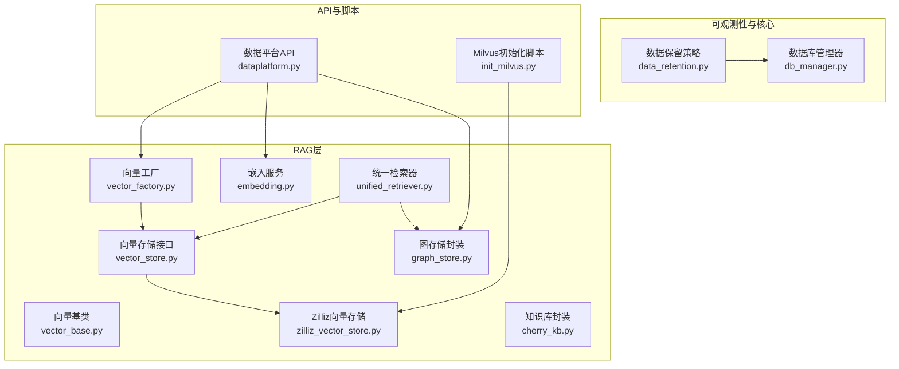
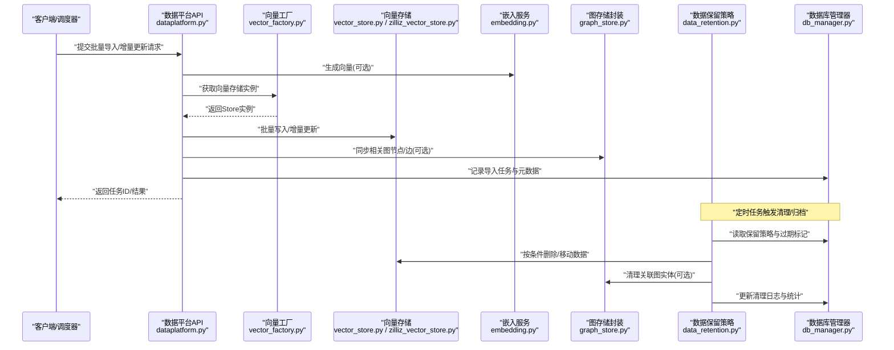
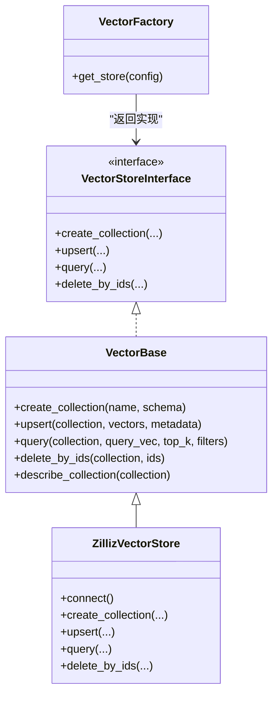
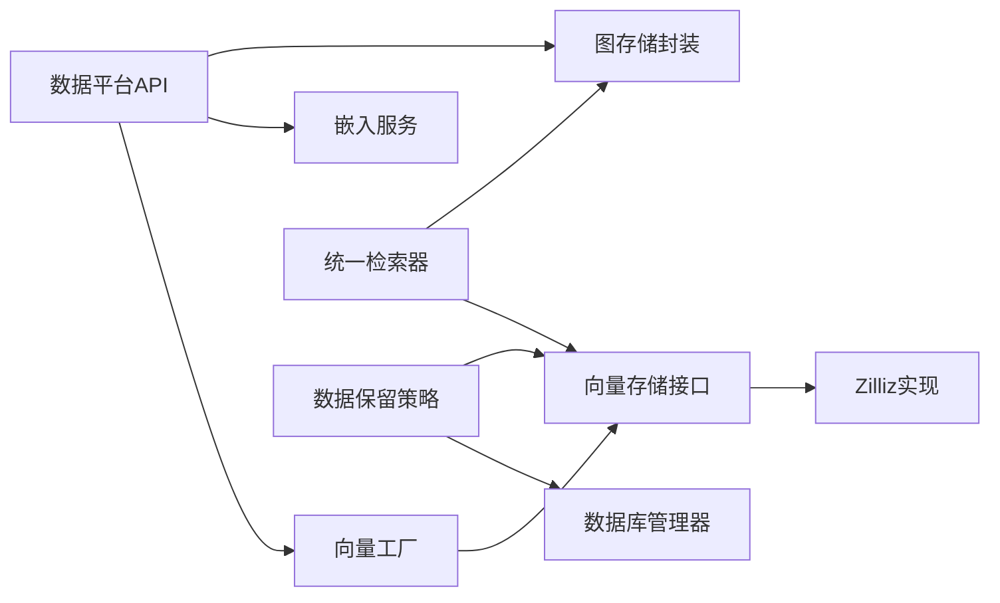
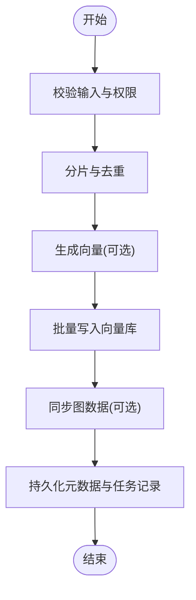
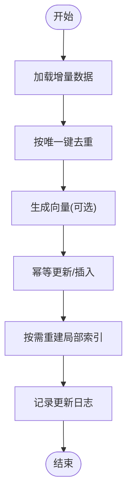
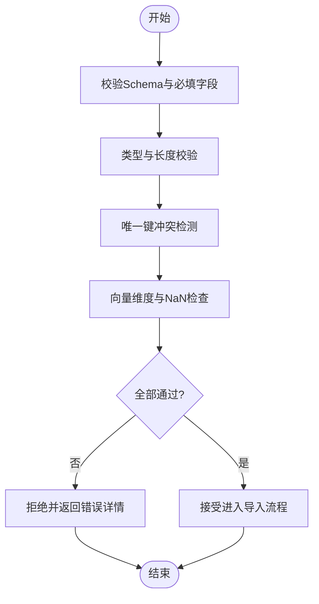
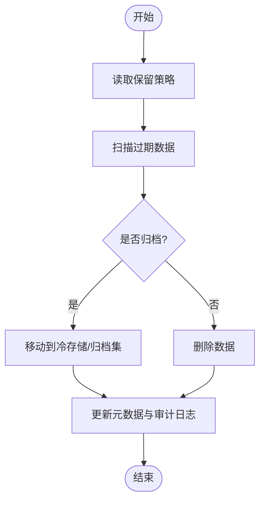

# 向量数据生命周期管理

<cite>
**本文引用的文件**   
- [backend_design/nexus/rag/vector_base.py](file://backend_design/nexus/rag/vector_base.py)
- [backend_design/nexus/rag/vector_store.py](file://backend_design/nexus/rag/vector_store.py)
- [backend_design/nexus/rag/vector_factory.py](file://backend_design/nexus/rag/vector_factory.py)
- [backend_design/nexus/rag/zilliz_vector_store.py](file://backend_design/nexus/rag/zilliz_vector_store.py)
- [backend_design/nexus/rag/embedding.py](file://backend_design/nexus/rag/embedding.py)
- [backend_design/nexus/rag/unified_retriever.py](file://backend_design/nexus/rag/unified_retriever.py)
- [backend_design/nexus/rag/graph_store.py](file://backend_design/nexus/rag/graph_store.py)
- [backend_design/nexus/rag/cherry_kb.py](file://backend_design/nexus/rag/cherry_kb.py)
- [backend_design/nexus/observability/data_retention.py](file://backend_design/nexus/observability/data_retention.py)
- [backend_design/nexus/core/db_manager.py](file://backend_design/nexus/core/db_manager.py)
- [backend_design/nexus/api/routes/dataplatform.py](file://backend_design/nexus/api/routes/dataplatform.py)
- [backend_design/scripts/init_milvus.py](file://backend_design/scripts/init_milvus.py)
</cite>

## 目录
1. [引言](#引言)
2. [项目结构](#项目结构)
3. [核心组件](#核心组件)
4. [架构总览](#架构总览)
5. [详细组件分析](#详细组件分析)
6. [依赖关系分析](#依赖关系分析)
7. [性能考虑](#性能考虑)
8. [故障排查指南](#故障排查指南)
9. [结论](#结论)
10. [附录](#附录)

## 引言
本文件面向NexusCockpit系统的向量数据生命周期管理，覆盖从导入、存储、检索到清理归档与备份恢复的全链路。重点包括：
- 批量导入、增量更新与数据验证流程
- 向量存储结构与元数据管理策略
- 过期数据删除与冷热分离机制
- 备份与恢复方案（含灾难恢复与迁移）
- 数据质量监控与异常检测

## 项目结构
与向量数据生命周期相关的代码主要位于后端RAG模块与可观测性模块中，关键路径如下：
- RAG层：向量抽象、具体实现、工厂、嵌入、统一检索、图存储与知识库封装
- 可观测性：数据保留策略
- 核心：数据库连接管理
- API：数据平台接口（用于触发导入/更新等任务）
- 脚本：Milvus初始化

图表来源
- [backend_design/nexus/rag/vector_base.py](file://backend_design/nexus/rag/vector_base.py)
- [backend_design/nexus/rag/vector_store.py](file://backend_design/nexus/rag/vector_store.py)
- [backend_design/nexus/rag/vector_factory.py](file://backend_design/nexus/rag/vector_factory.py)
- [backend_design/nexus/rag/zilliz_vector_store.py](file://backend_design/nexus/rag/zilliz_vector_store.py)
- [backend_design/nexus/rag/embedding.py](file://backend_design/nexus/rag/embedding.py)
- [backend_design/nexus/rag/unified_retriever.py](file://backend_design/nexus/rag/unified_retriever.py)
- [backend_design/nexus/rag/graph_store.py](file://backend_design/nexus/rag/graph_store.py)
- [backend_design/nexus/rag/cherry_kb.py](file://backend_design/nexus/rag/cherry_kb.py)
- [backend_design/nexus/observability/data_retention.py](file://backend_design/nexus/observability/data_retention.py)
- [backend_design/nexus/core/db_manager.py](file://backend_design/nexus/core/db_manager.py)
- [backend_design/nexus/api/routes/dataplatform.py](file://backend_design/nexus/api/routes/dataplatform.py)
- [backend_design/scripts/init_milvus.py](file://backend_design/scripts/init_milvus.py)

章节来源
- [backend_design/nexus/rag/vector_base.py](file://backend_design/nexus/rag/vector_base.py)
- [backend_design/nexus/rag/vector_store.py](file://backend_design/nexus/rag/vector_store.py)
- [backend_design/nexus/rag/vector_factory.py](file://backend_design/nexus/rag/vector_factory.py)
- [backend_design/nexus/rag/zilliz_vector_store.py](file://backend_design/nexus/rag/zilliz_vector_store.py)
- [backend_design/nexus/rag/embedding.py](file://backend_design/nexus/rag/embedding.py)
- [backend_design/nexus/rag/unified_retriever.py](file://backend_design/nexus/rag/unified_retriever.py)
- [backend_design/nexus/rag/graph_store.py](file://backend_design/nexus/rag/graph_store.py)
- [backend_design/nexus/rag/cherry_kb.py](file://backend_design/nexus/rag/cherry_kb.py)
- [backend_design/nexus/observability/data_retention.py](file://backend_design/nexus/observability/data_retention.py)
- [backend_design/nexus/core/db_manager.py](file://backend_design/nexus/core/db_manager.py)
- [backend_design/nexus/api/routes/dataplatform.py](file://backend_design/nexus/api/routes/dataplatform.py)
- [backend_design/scripts/init_milvus.py](file://backend_design/scripts/init_milvus.py)

## 核心组件
- 向量抽象与实现
  - 向量基类定义统一的写入、查询、删除与集合管理能力
  - 向量存储接口规范了集合级操作契约
  - 工厂根据配置选择具体向量库实现（如Zilliz/Milvus）
  - Zilliz向量存储提供具体的Milvus客户端交互能力
- 嵌入服务
  - 将文本转换为向量表示，供写入与检索使用
- 统一检索器
  - 聚合向量与图检索结果，支持重排序与融合
- 图存储与知识库封装
  - 图存储封装Neo4j等图数据库的读写
  - 知识库封装对知识文档的分块、索引与版本管理
- 数据保留策略
  - 基于时间窗口与策略规则的数据清理与归档
- 数据库管理器
  - 负责持久化元数据（如集合信息、索引状态、任务记录）
- 数据平台API
  - 暴露导入、更新、查询、清理等入口
- Milvus初始化脚本
  - 创建集合、索引与必要的元数据表

章节来源
- [backend_design/nexus/rag/vector_base.py](file://backend_design/nexus/rag/vector_base.py)
- [backend_design/nexus/rag/vector_store.py](file://backend_design/nexus/rag/vector_store.py)
- [backend_design/nexus/rag/vector_factory.py](file://backend_design/nexus/rag/vector_factory.py)
- [backend_design/nexus/rag/zilliz_vector_store.py](file://backend_design/nexus/rag/zilliz_vector_store.py)
- [backend_design/nexus/rag/embedding.py](file://backend_design/nexus/rag/embedding.py)
- [backend_design/nexus/rag/unified_retriever.py](file://backend_design/nexus/rag/unified_retriever.py)
- [backend_design/nexus/rag/graph_store.py](file://backend_design/nexus/rag/graph_store.py)
- [backend_design/nexus/rag/cherry_kb.py](file://backend_design/nexus/rag/cherry_kb.py)
- [backend_design/nexus/observability/data_retention.py](file://backend_design/nexus/observability/data_retention.py)
- [backend_design/nexus/core/db_manager.py](file://backend_design/nexus/core/db_manager.py)
- [backend_design/nexus/api/routes/dataplatform.py](file://backend_design/nexus/api/routes/dataplatform.py)
- [backend_design/scripts/init_milvus.py](file://backend_design/scripts/init_milvus.py)

## 架构总览
下图展示了向量数据从导入到检索、清理与备份恢复的整体流程，以及各组件之间的调用关系。

图表来源
- [backend_design/nexus/api/routes/dataplatform.py](file://backend_design/nexus/api/routes/dataplatform.py)
- [backend_design/nexus/rag/vector_factory.py](file://backend_design/nexus/rag/vector_factory.py)
- [backend_design/nexus/rag/vector_store.py](file://backend_design/nexus/rag/vector_store.py)
- [backend_design/nexus/rag/zilliz_vector_store.py](file://backend_design/nexus/rag/zilliz_vector_store.py)
- [backend_design/nexus/rag/embedding.py](file://backend_design/nexus/rag/embedding.py)
- [backend_design/nexus/rag/graph_store.py](file://backend_design/nexus/rag/graph_store.py)
- [backend_design/nexus/observability/data_retention.py](file://backend_design/nexus/observability/data_retention.py)
- [backend_design/nexus/core/db_manager.py](file://backend_design/nexus/core/db_manager.py)

## 详细组件分析

### 向量抽象与实现
- 设计要点
  - 通过基类与接口统一集合、写入、查询、删除等操作契约
  - 工厂模式屏蔽底层差异，便于切换不同向量库
  - Zilliz实现聚焦Milvus客户端封装，处理连接、集合与索引
- 复杂度与优化
  - 批量写入采用分片与并发控制，降低单次请求压力
  - 查询时结合过滤字段与预取索引提升召回效率
- 错误处理
  - 连接失败重试、幂等写入、事务回滚（若底层支持）

图表来源
- [backend_design/nexus/rag/vector_base.py](file://backend_design/nexus/rag/vector_base.py)
- [backend_design/nexus/rag/vector_store.py](file://backend_design/nexus/rag/vector_store.py)
- [backend_design/nexus/rag/vector_factory.py](file://backend_design/nexus/rag/vector_factory.py)
- [backend_design/nexus/rag/zilliz_vector_store.py](file://backend_design/nexus/rag/zilliz_vector_store.py)

章节来源
- [backend_design/nexus/rag/vector_base.py](file://backend_design/nexus/rag/vector_base.py)
- [backend_design/nexus/rag/vector_store.py](file://backend_design/nexus/rag/vector_store.py)
- [backend_design/nexus/rag/vector_factory.py](file://backend_design/nexus/rag/vector_factory.py)
- [backend_design/nexus/rag/zilliz_vector_store.py](file://backend_design/nexus/rag/zilliz_vector_store.py)

### 嵌入服务
- 职责
  - 将原始文本切分为片段并生成向量
  - 维护模型版本与维度一致性
- 性能
  - 批量化推理、缓存已计算片段以减少重复开销
- 校验
  - 输出维度校验、空值与异常文本过滤

章节来源
- [backend_design/nexus/rag/embedding.py](file://backend_design/nexus/rag/embedding.py)

### 统一检索器
- 职责
  - 组合向量检索与图检索结果，进行重排与去重
  - 支持多路召回与权重融合
- 指标
  - 记录召回率、延迟与命中率，用于质量监控

章节来源
- [backend_design/nexus/rag/unified_retriever.py](file://backend_design/nexus/rag/unified_retriever.py)

### 图存储与知识库封装
- 图存储封装
  - 提供节点/边的增删改查与批量操作
  - 与向量数据建立关联（如文档ID映射）
- 知识库封装
  - 文档分块、版本管理与索引重建
  - 支持增量更新与冲突合并

章节来源
- [backend_design/nexus/rag/graph_store.py](file://backend_design/nexus/rag/graph_store.py)
- [backend_design/nexus/rag/cherry_kb.py](file://backend_design/nexus/rag/cherry_kb.py)

### 数据保留策略
- 策略项
  - 时间窗口（TTL）、标签/分区、冷热分层
- 执行流程
  - 扫描过期数据 -> 删除或移动到冷存储 -> 更新元数据与日志
- 幂等与审计
  - 记录每次清理的任务ID、影响范围与耗时

章节来源
- [backend_design/nexus/observability/data_retention.py](file://backend_design/nexus/observability/data_retention.py)

### 数据库管理器
- 职责
  - 管理元数据表（集合、索引、任务、审计日志）
  - 提供事务与连接池能力
- 与清理/备份集成
  - 为保留策略与备份恢复提供持久化支撑

章节来源
- [backend_design/nexus/core/db_manager.py](file://backend_design/nexus/core/db_manager.py)

### 数据平台API
- 功能
  - 批量导入、增量更新、查询、清理任务触发
  - 返回任务ID与进度查询接口
- 安全与限流
  - 鉴权、速率限制与参数校验

章节来源
- [backend_design/nexus/api/routes/dataplatform.py](file://backend_design/nexus/api/routes/dataplatform.py)

### Milvus初始化脚本
- 作用
  - 创建集合、索引与必要元数据表
  - 校验环境连通性与权限
- 适用场景
  - 首次部署、环境重建与迁移后初始化

章节来源
- [backend_design/scripts/init_milvus.py](file://backend_design/scripts/init_milvus.py)

## 依赖关系分析
- 组件耦合
  - API依赖工厂与嵌入服务；工厂返回具体向量存储实现
  - 统一检索器同时依赖向量存储与图存储
  - 数据保留策略依赖数据库管理器与向量存储
- 外部依赖
  - Milvus/Zilliz作为向量库
  - Neo4j作为图数据库
  - 关系型数据库用于元数据与任务持久化

图表来源
- [backend_design/nexus/api/routes/dataplatform.py](file://backend_design/nexus/api/routes/dataplatform.py)
- [backend_design/nexus/rag/vector_factory.py](file://backend_design/nexus/rag/vector_factory.py)
- [backend_design/nexus/rag/vector_store.py](file://backend_design/nexus/rag/vector_store.py)
- [backend_design/nexus/rag/zilliz_vector_store.py](file://backend_design/nexus/rag/zilliz_vector_store.py)
- [backend_design/nexus/rag/embedding.py](file://backend_design/nexus/rag/embedding.py)
- [backend_design/nexus/rag/unified_retriever.py](file://backend_design/nexus/rag/unified_retriever.py)
- [backend_design/nexus/rag/graph_store.py](file://backend_design/nexus/rag/graph_store.py)
- [backend_design/nexus/observability/data_retention.py](file://backend_design/nexus/observability/data_retention.py)
- [backend_design/nexus/core/db_manager.py](file://backend_design/nexus/core/db_manager.py)

章节来源
- [backend_design/nexus/api/routes/dataplatform.py](file://backend_design/nexus/api/routes/dataplatform.py)
- [backend_design/nexus/rag/vector_factory.py](file://backend_design/nexus/rag/vector_factory.py)
- [backend_design/nexus/rag/vector_store.py](file://backend_design/nexus/rag/vector_store.py)
- [backend_design/nexus/rag/zilliz_vector_store.py](file://backend_design/nexus/rag/zilliz_vector_store.py)
- [backend_design/nexus/rag/embedding.py](file://backend_design/nexus/rag/embedding.py)
- [backend_design/nexus/rag/unified_retriever.py](file://backend_design/nexus/rag/unified_retriever.py)
- [backend_design/nexus/rag/graph_store.py](file://backend_design/nexus/rag/graph_store.py)
- [backend_design/nexus/observability/data_retention.py](file://backend_design/nexus/observability/data_retention.py)
- [backend_design/nexus/core/db_manager.py](file://backend_design/nexus/core/db_manager.py)

## 性能考虑
- 批量导入
  - 分片写入与并发控制，避免单点瓶颈
  - 预建索引与合适的chunk大小
- 增量更新
  - 基于唯一键的幂等更新，减少全量重建
- 检索优化
  - 多路召回+重排序，控制top_k与过滤条件
- 资源隔离
  - 读写分离、连接池与超时控制
- 监控
  - 记录QPS、P99延迟、错误率与内存占用

[本节为通用指导，不直接分析具体文件]

## 故障排查指南
- 常见问题
  - 连接失败：检查Milvus/Neo4j/数据库连通性与认证
  - 索引未生效：确认集合创建与索引构建顺序
  - 数据不一致：核对元数据与向量库中的ID映射
- 定位步骤
  - 查看任务日志与清理审计记录
  - 检查数据库管理器的事务与锁状态
  - 使用初始化脚本校验环境
- 恢复建议
  - 回滚到最近一次成功快照
  - 重新构建索引与元数据映射

章节来源
- [backend_design/nexus/observability/data_retention.py](file://backend_design/nexus/observability/data_retention.py)
- [backend_design/nexus/core/db_manager.py](file://backend_design/nexus/core/db_manager.py)
- [backend_design/scripts/init_milvus.py](file://backend_design/scripts/init_milvus.py)

## 结论
通过统一的向量抽象、工厂与具体实现，NexusCockpit实现了可扩展的向量数据生命周期管理。配合嵌入服务、统一检索器、图存储与知识库封装，系统能够高效完成导入、检索与更新。数据保留策略与数据库管理器为清理归档与备份恢复提供了基础保障。建议在大规模场景下强化监控与自动化运维，确保稳定性与可观测性。

[本节为总结，不直接分析具体文件]

## 附录

### 导入流程（批量导入）

图表来源
- [backend_design/nexus/api/routes/dataplatform.py](file://backend_design/nexus/api/routes/dataplatform.py)
- [backend_design/nexus/rag/embedding.py](file://backend_design/nexus/rag/embedding.py)
- [backend_design/nexus/rag/vector_factory.py](file://backend_design/nexus/rag/vector_factory.py)
- [backend_design/nexus/rag/vector_store.py](file://backend_design/nexus/rag/vector_store.py)
- [backend_design/nexus/rag/zilliz_vector_store.py](file://backend_design/nexus/rag/zilliz_vector_store.py)
- [backend_design/nexus/rag/graph_store.py](file://backend_design/nexus/rag/graph_store.py)
- [backend_design/nexus/core/db_manager.py](file://backend_design/nexus/core/db_manager.py)

章节来源
- [backend_design/nexus/api/routes/dataplatform.py](file://backend_design/nexus/api/routes/dataplatform.py)
- [backend_design/nexus/rag/embedding.py](file://backend_design/nexus/rag/embedding.py)
- [backend_design/nexus/rag/vector_factory.py](file://backend_design/nexus/rag/vector_factory.py)
- [backend_design/nexus/rag/vector_store.py](file://backend_design/nexus/rag/vector_store.py)
- [backend_design/nexus/rag/zilliz_vector_store.py](file://backend_design/nexus/rag/zilliz_vector_store.py)
- [backend_design/nexus/rag/graph_store.py](file://backend_design/nexus/rag/graph_store.py)
- [backend_design/nexus/core/db_manager.py](file://backend_design/nexus/core/db_manager.py)

### 增量更新流程

图表来源
- [backend_design/nexus/api/routes/dataplatform.py](file://backend_design/nexus/api/routes/dataplatform.py)
- [backend_design/nexus/rag/vector_store.py](file://backend_design/nexus/rag/vector_store.py)
- [backend_design/nexus/rag/zilliz_vector_store.py](file://backend_design/nexus/rag/zilliz_vector_store.py)
- [backend_design/nexus/core/db_manager.py](file://backend_design/nexus/core/db_manager.py)

章节来源
- [backend_design/nexus/api/routes/dataplatform.py](file://backend_design/nexus/api/routes/dataplatform.py)
- [backend_design/nexus/rag/vector_store.py](file://backend_design/nexus/rag/vector_store.py)
- [backend_design/nexus/rag/zilliz_vector_store.py](file://backend_design/nexus/rag/zilliz_vector_store.py)
- [backend_design/nexus/core/db_manager.py](file://backend_design/nexus/core/db_manager.py)

### 数据验证流程

图表来源
- [backend_design/nexus/api/routes/dataplatform.py](file://backend_design/nexus/api/routes/dataplatform.py)
- [backend_design/nexus/rag/embedding.py](file://backend_design/nexus/rag/embedding.py)

章节来源
- [backend_design/nexus/api/routes/dataplatform.py](file://backend_design/nexus/api/routes/dataplatform.py)
- [backend_design/nexus/rag/embedding.py](file://backend_design/nexus/rag/embedding.py)

### 清理与归档机制

图表来源
- [backend_design/nexus/observability/data_retention.py](file://backend_design/nexus/observability/data_retention.py)
- [backend_design/nexus/rag/vector_store.py](file://backend_design/nexus/rag/vector_store.py)
- [backend_design/nexus/core/db_manager.py](file://backend_design/nexus/core/db_manager.py)

章节来源
- [backend_design/nexus/observability/data_retention.py](file://backend_design/nexus/observability/data_retention.py)
- [backend_design/nexus/rag/vector_store.py](file://backend_design/nexus/rag/vector_store.py)
- [backend_design/nexus/core/db_manager.py](file://backend_design/nexus/core/db_manager.py)

### 备份与恢复方案
- 备份
  - 向量库快照（Milvus/Zilliz）
  - 元数据导出（数据库管理器）
  - 图数据导出（Neo4j）
- 恢复
  - 先恢复元数据与图数据，再恢复向量快照
  - 重建索引与校验一致性
- 灾难恢复
  - 跨地域复制与定期演练
- 数据迁移
  - 使用初始化脚本与环境校验工具

章节来源
- [backend_design/nexus/core/db_manager.py](file://backend_design/nexus/core/db_manager.py)
- [backend_design/scripts/init_milvus.py](file://backend_design/scripts/init_milvus.py)

### 数据质量监控与异常检测
- 指标
  - 导入成功率、增量更新延迟、检索命中率、错误率
- 异常检测
  - 向量分布漂移、缺失值比例、重复率阈值告警
- 可视化
  - 结合监控面板展示趋势与热点

章节来源
- [backend_design/nexus/rag/unified_retriever.py](file://backend_design/nexus/rag/unified_retriever.py)
- [backend_design/nexus/observability/data_retention.py](file://backend_design/nexus/observability/data_retention.py)