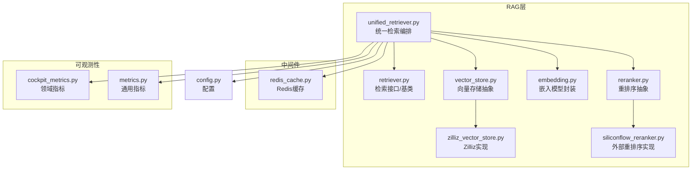
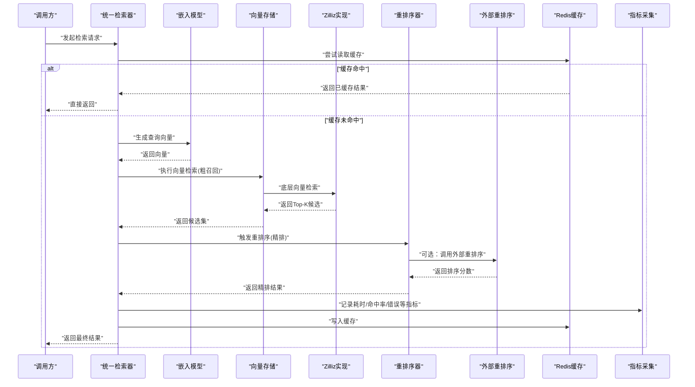
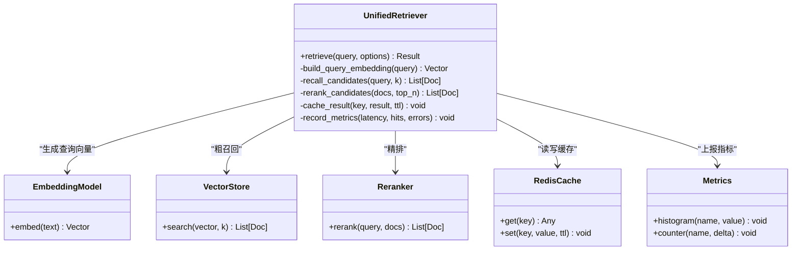
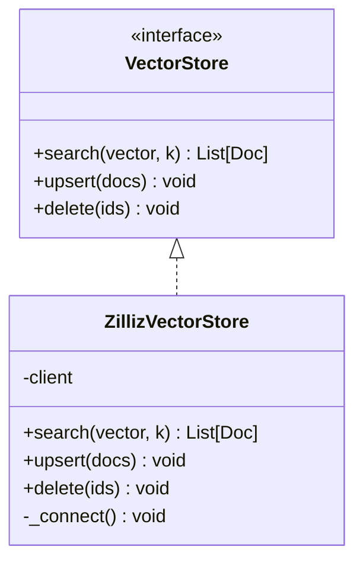
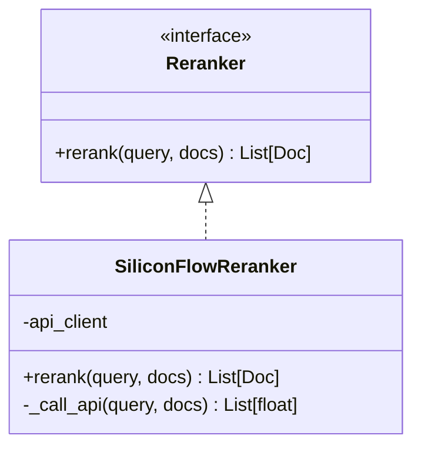
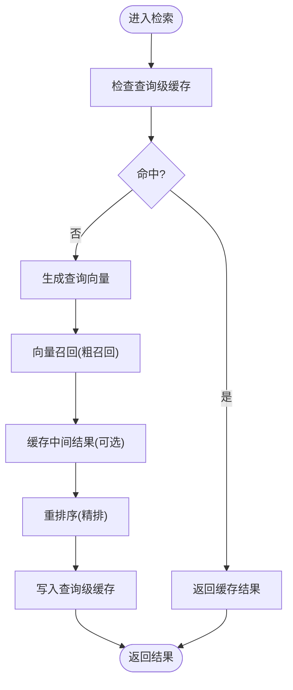
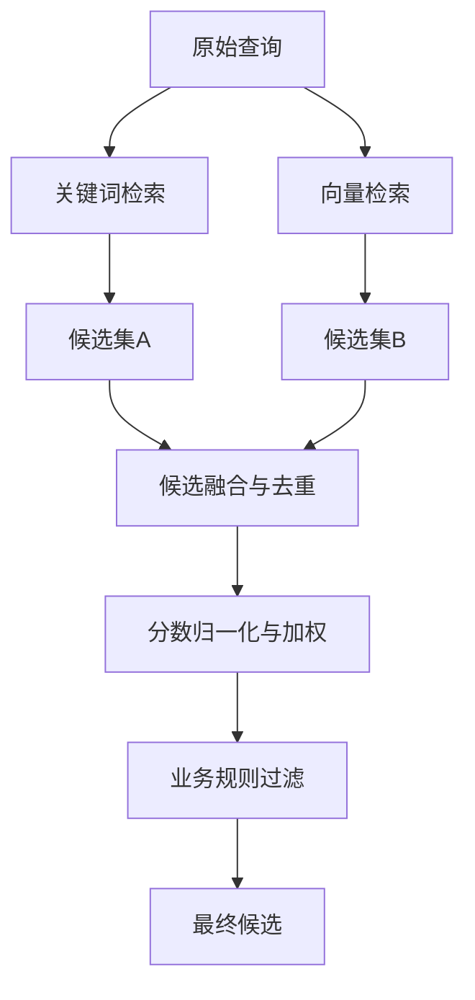
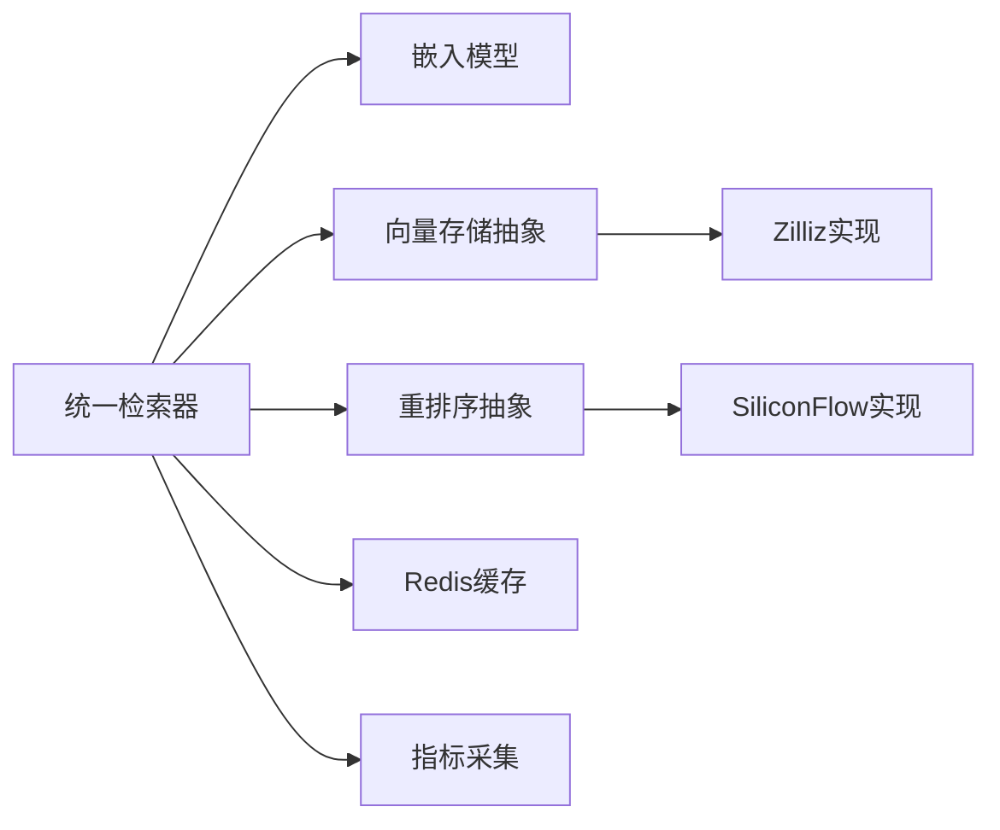

# 向量检索优化

<cite>
**本文引用的文件**   
- [backend_design/nexus/rag/unified_retriever.py](file://backend_design/nexus/rag/unified_retriever.py)
- [backend_design/nexus/rag/retriever.py](file://backend_design/nexus/rag/retriever.py)
- [backend_design/nexus/rag/vector_store.py](file://backend_design/nexus/rag/vector_store.py)
- [backend_design/nexus/rag/zilliz_vector_store.py](file://backend_design/nexus/rag/zilliz_vector_store.py)
- [backend_design/nexus/rag/reranker.py](file://backend_design/nexus/rag/reranker.py)
- [backend_design/nexus/rag/siliconflow_reranker.py](file://backend_design/nexus/rag/siliconflow_reranker.py)
- [backend_design/nexus/rag/embedding.py](file://backend_design/nexus/rag/embedding.py)
- [backend_design/nexus/middleware/redis_cache.py](file://backend_design/nexus/middleware/redis_cache.py)
- [backend_design/nexus/observability/cockpit_metrics.py](file://backend_design/nexus/observability/cockpit_metrics.py)
- [backend_design/nexus/observability/metrics.py](file://backend_design/nexus/observability/metrics.py)
- [backend_design/nexus/config.py](file://backend_design/nexus/config.py)
</cite>

## 目录
1. [简介](#简介)
2. [项目结构](#项目结构)
3. [核心组件](#核心组件)
4. [架构总览](#架构总览)
5. [详细组件分析](#详细组件分析)
6. [依赖分析](#依赖分析)
7. [性能考虑](#性能考虑)
8. [故障排查指南](#故障排查指南)
9. [结论](#结论)
10. [附录](#附录)

## 简介
本文件面向NexusCockpit系统的向量检索优化，聚焦多级检索架构（粗召回与精排）、重排序算法（语义相似度与业务规则）、缓存与预计算、监控指标与调优方法，以及混合检索策略（关键词搜索与向量相似度匹配）。文档以代码级实现为依据，提供架构图、流程图和时序图，帮助读者快速理解并落地优化方案。

## 项目结构
与向量检索相关的核心模块位于 backend_design/nexus/rag 下，包含统一检索器、向量存储抽象与具体实现、重排序器抽象与具体实现、嵌入模型封装等；同时结合中间件层的Redis缓存与可观测性层的指标采集，形成端到端的检索链路。

图表来源
- [backend_design/nexus/rag/unified_retriever.py](file://backend_design/nexus/rag/unified_retriever.py)
- [backend_design/nexus/rag/retriever.py](file://backend_design/nexus/rag/retriever.py)
- [backend_design/nexus/rag/vector_store.py](file://backend_design/nexus/rag/vector_store.py)
- [backend_design/nexus/rag/zilliz_vector_store.py](file://backend_design/nexus/rag/zilliz_vector_store.py)
- [backend_design/nexus/rag/reranker.py](file://backend_design/nexus/rag/reranker.py)
- [backend_design/nexus/rag/siliconflow_reranker.py](file://backend_design/nexus/rag/siliconflow_reranker.py)
- [backend_design/nexus/rag/embedding.py](file://backend_design/nexus/rag/embedding.py)
- [backend_design/nexus/middleware/redis_cache.py](file://backend_design/nexus/middleware/redis_cache.py)
- [backend_design/nexus/observability/cockpit_metrics.py](file://backend_design/nexus/observability/cockpit_metrics.py)
- [backend_design/nexus/observability/metrics.py](file://backend_design/nexus/observability/metrics.py)
- [backend_design/nexus/config.py](file://backend_design/nexus/config.py)

章节来源
- [backend_design/nexus/rag/unified_retriever.py](file://backend_design/nexus/rag/unified_retriever.py)
- [backend_design/nexus/rag/vector_store.py](file://backend_design/nexus/rag/vector_store.py)
- [backend_design/nexus/rag/zilliz_vector_store.py](file://backend_design/nexus/rag/zilliz_vector_store.py)
- [backend_design/nexus/rag/reranker.py](file://backend_design/nexus/rag/reranker.py)
- [backend_design/nexus/rag/siliconflow_reranker.py](file://backend_design/nexus/rag/siliconflow_reranker.py)
- [backend_design/nexus/rag/embedding.py](file://backend_design/nexus/rag/embedding.py)
- [backend_design/nexus/middleware/redis_cache.py](file://backend_design/nexus/middleware/redis_cache.py)
- [backend_design/nexus/observability/cockpit_metrics.py](file://backend_design/nexus/observability/cockpit_metrics.py)
- [backend_design/nexus/observability/metrics.py](file://backend_design/nexus/observability/metrics.py)
- [backend_design/nexus/config.py](file://backend_design/nexus/config.py)

## 核心组件
- 统一检索器：负责串联“查询预处理→多路召回→候选合并→重排序→结果组装”的完整流程，支持开关与参数化配置。
- 向量存储抽象与实现：定义统一的向量检索接口，并提供基于Zilliz的具体实现，屏蔽底层差异。
- 重排序器抽象与实现：定义重排序接口，提供本地或外部服务（如SiliconFlow）的重排序能力。
- 嵌入模型封装：对文本向量化进行封装，便于替换不同Embedding后端。
- Redis缓存：在检索前后提供结果与中间态缓存，降低重复请求延迟。
- 指标与配置：为检索链路埋点统计，并通过配置驱动行为切换。

章节来源
- [backend_design/nexus/rag/unified_retriever.py](file://backend_design/nexus/rag/unified_retriever.py)
- [backend_design/nexus/rag/vector_store.py](file://backend_design/nexus/rag/vector_store.py)
- [backend_design/nexus/rag/zilliz_vector_store.py](file://backend_design/nexus/rag/zilliz_vector_store.py)
- [backend_design/nexus/rag/reranker.py](file://backend_design/nexus/rag/reranker.py)
- [backend_design/nexus/rag/siliconflow_reranker.py](file://backend_design/nexus/rag/siliconflow_reranker.py)
- [backend_design/nexus/rag/embedding.py](file://backend_design/nexus/rag/embedding.py)
- [backend_design/nexus/middleware/redis_cache.py](file://backend_design/nexus/middleware/redis_cache.py)
- [backend_design/nexus/observability/cockpit_metrics.py](file://backend_design/nexus/observability/cockpit_metrics.py)
- [backend_design/nexus/observability/metrics.py](file://backend_design/nexus/observability/metrics.py)
- [backend_design/nexus/config.py](file://backend_design/nexus/config.py)

## 架构总览
下图展示从用户查询到最终结果的端到端流程，包括多级召回、重排序、缓存命中与指标上报。

图表来源
- [backend_design/nexus/rag/unified_retriever.py](file://backend_design/nexus/rag/unified_retriever.py)
- [backend_design/nexus/rag/embedding.py](file://backend_design/nexus/rag/embedding.py)
- [backend_design/nexus/rag/vector_store.py](file://backend_design/nexus/rag/vector_store.py)
- [backend_design/nexus/rag/zilliz_vector_store.py](file://backend_design/nexus/rag/zilliz_vector_store.py)
- [backend_design/nexus/rag/reranker.py](file://backend_design/nexus/rag/reranker.py)
- [backend_design/nexus/rag/siliconflow_reranker.py](file://backend_design/nexus/rag/siliconflow_reranker.py)
- [backend_design/nexus/middleware/redis_cache.py](file://backend_design/nexus/middleware/redis_cache.py)
- [backend_design/nexus/observability/cockpit_metrics.py](file://backend_design/nexus/observability/cockpit_metrics.py)
- [backend_design/nexus/observability/metrics.py](file://backend_design/nexus/observability/metrics.py)

## 详细组件分析

### 统一检索器（多级检索编排）
- 职责：协调嵌入、召回、重排序、缓存与指标上报；支持多路召回与结果融合。
- 关键流程：
  - 查询预处理与分词（用于关键词分支）
  - 向量生成（用于语义分支）
  - 粗召回：通过向量存储接口获取Top-K候选
  - 精排：调用重排序器对候选进行打分与排序
  - 结果组装与去重
  - 缓存写入与指标上报
- 可配置项：召回数量、精排数量、是否启用外部重排序、缓存TTL等。

图表来源
- [backend_design/nexus/rag/unified_retriever.py](file://backend_design/nexus/rag/unified_retriever.py)
- [backend_design/nexus/rag/embedding.py](file://backend_design/nexus/rag/embedding.py)
- [backend_design/nexus/rag/vector_store.py](file://backend_design/nexus/rag/vector_store.py)
- [backend_design/nexus/rag/reranker.py](file://backend_design/nexus/rag/reranker.py)
- [backend_design/nexus/middleware/redis_cache.py](file://backend_design/nexus/middleware/redis_cache.py)
- [backend_design/nexus/observability/metrics.py](file://backend_design/nexus/observability/metrics.py)

章节来源
- [backend_design/nexus/rag/unified_retriever.py](file://backend_design/nexus/rag/unified_retriever.py)

### 向量存储抽象与Zilliz实现
- 抽象层：定义统一的向量检索接口，屏蔽不同后端差异。
- Zilliz实现：对接Zilliz集群，提供高吞吐、低延迟的近似最近邻搜索。
- 关键能力：
  - 向量索引构建与维护
  - 批量插入与更新
  - 过滤条件与元数据检索
  - 连接池与重试机制

图表来源
- [backend_design/nexus/rag/vector_store.py](file://backend_design/nexus/rag/vector_store.py)
- [backend_design/nexus/rag/zilliz_vector_store.py](file://backend_design/nexus/rag/zilliz_vector_store.py)

章节来源
- [backend_design/nexus/rag/vector_store.py](file://backend_design/nexus/rag/vector_store.py)
- [backend_design/nexus/rag/zilliz_vector_store.py](file://backend_design/nexus/rag/zilliz_vector_store.py)

### 重排序器抽象与外部实现
- 抽象层：定义rerank接口，输入查询与候选文档，输出排序后的文档列表。
- SiliconFlow实现：通过外部服务进行更精细的语义相关性打分，适合对精度要求高的场景。
- 适用策略：
  - 纯语义重排序：仅使用模型打分
  - 混合重排序：将语义分数与业务规则分数加权融合

图表来源
- [backend_design/nexus/rag/reranker.py](file://backend_design/nexus/rag/reranker.py)
- [backend_design/nexus/rag/siliconflow_reranker.py](file://backend_design/nexus/rag/siliconflow_reranker.py)

章节来源
- [backend_design/nexus/rag/reranker.py](file://backend_design/nexus/rag/reranker.py)
- [backend_design/nexus/rag/siliconflow_reranker.py](file://backend_design/nexus/rag/siliconflow_reranker.py)

### 嵌入模型封装
- 职责：对文本进行向量化，屏蔽不同Embedding后端差异。
- 关键点：
  - 批处理与并发控制
  - 异常重试与降级
  - 维度对齐与归一化

章节来源
- [backend_design/nexus/rag/embedding.py](file://backend_design/nexus/rag/embedding.py)

### 缓存机制与预计算优化
- 缓存位置：
  - 查询级缓存：相同查询的直接命中，减少下游开销
  - 中间态缓存：嵌入向量或召回候选的短期缓存
- TTL策略：根据内容更新频率与热点程度设置合理过期时间
- 预计算：
  - 热门查询的向量与候选预生成
  - 离线构建常用查询模板与索引映射

图表来源
- [backend_design/nexus/middleware/redis_cache.py](file://backend_design/nexus/middleware/redis_cache.py)
- [backend_design/nexus/rag/unified_retriever.py](file://backend_design/nexus/rag/unified_retriever.py)

章节来源
- [backend_design/nexus/middleware/redis_cache.py](file://backend_design/nexus/middleware/redis_cache.py)

### 混合检索策略（关键词+向量）
- 思路：并行执行关键词检索与向量检索，分别得到候选集合，再进行融合与重排序。
- 融合方式：
  - 去重与优先级策略
  - 分数归一化与加权融合
  - 业务规则过滤（如时效性、权限、地域）
- 优势：兼顾精确匹配与语义泛化，提升召回质量与稳定性。

[本节为概念性说明，不直接分析具体文件，故无“章节来源”]

## 依赖分析
- 组件耦合：
  - 统一检索器强依赖嵌入、向量存储、重排序、缓存与指标模块
  - 向量存储抽象解耦了底层实现，便于替换与扩展
  - 重排序器抽象允许本地与外部服务并存
- 外部依赖：
  - Zilliz：高性能向量数据库
  - Redis：分布式缓存
  - SiliconFlow：外部重排序服务
- 潜在风险：
  - 外部服务不可用时的降级策略
  - 缓存一致性与时序问题
  - 指标上报失败对主流程的影响

图表来源
- [backend_design/nexus/rag/unified_retriever.py](file://backend_design/nexus/rag/unified_retriever.py)
- [backend_design/nexus/rag/vector_store.py](file://backend_design/nexus/rag/vector_store.py)
- [backend_design/nexus/rag/zilliz_vector_store.py](file://backend_design/nexus/rag/zilliz_vector_store.py)
- [backend_design/nexus/rag/reranker.py](file://backend_design/nexus/rag/reranker.py)
- [backend_design/nexus/rag/siliconflow_reranker.py](file://backend_design/nexus/rag/siliconflow_reranker.py)
- [backend_design/nexus/middleware/redis_cache.py](file://backend_design/nexus/middleware/redis_cache.py)
- [backend_design/nexus/observability/metrics.py](file://backend_design/nexus/observability/metrics.py)

章节来源
- [backend_design/nexus/rag/unified_retriever.py](file://backend_design/nexus/rag/unified_retriever.py)
- [backend_design/nexus/rag/vector_store.py](file://backend_design/nexus/rag/vector_store.py)
- [backend_design/nexus/rag/zilliz_vector_store.py](file://backend_design/nexus/rag/zilliz_vector_store.py)
- [backend_design/nexus/rag/reranker.py](file://backend_design/nexus/rag/reranker.py)
- [backend_design/nexus/rag/siliconflow_reranker.py](file://backend_design/nexus/rag/siliconflow_reranker.py)
- [backend_design/nexus/middleware/redis_cache.py](file://backend_design/nexus/middleware/redis_cache.py)
- [backend_design/nexus/observability/metrics.py](file://backend_design/nexus/observability/metrics.py)

## 性能考虑
- 多级检索设计：
  - 粗召回阶段追求高召回率与大候选集
  - 精排阶段追求高精度与小候选集
- 缓存策略：
  - 热点查询优先命中，显著降低P99延迟
  - 中间态缓存避免重复计算
- 并发与批处理：
  - 嵌入与重排序采用批处理与并发控制
- 资源隔离：
  - 外部重排序服务独立部署，避免阻塞主流程
- 监控与告警：
  - 关键路径埋点，覆盖延迟、吞吐、错误率与缓存命中率

[本节为通用指导，不直接分析具体文件，故无“章节来源”]

## 故障排查指南
- 常见问题定位：
  - 向量检索超时：检查Zilliz连接与索引状态
  - 重排序失败：检查外部服务健康与重试策略
  - 缓存不一致：核对TTL与键空间命名规范
- 指标与日志：
  - 关注检索链路各阶段的耗时分布
  - 记录错误码与堆栈，便于快速定位
- 回滚与降级：
  - 外部重排序不可用时自动降级为本地策略
  - 缓存不可用时跳过缓存直连后端

章节来源
- [backend_design/nexus/observability/cockpit_metrics.py](file://backend_design/nexus/observability/cockpit_metrics.py)
- [backend_design/nexus/observability/metrics.py](file://backend_design/nexus/observability/metrics.py)

## 结论
通过多级检索架构、重排序优化、缓存与预计算、以及混合检索策略，NexusCockpit在保持高召回的同时显著提升排序质量与系统性能。配合完善的监控与降级策略，可在复杂业务场景下稳定运行并持续演进。

[本节为总结性内容，不直接分析具体文件，故无“章节来源”]

## 附录
- 配置要点：
  - 召回数量与精排数量的平衡
  - 缓存TTL与预热策略
  - 外部服务超时与重试阈值
- 最佳实践：
  - 定期评估召回质量与排序效果
  - 针对热点查询进行预计算与索引优化
  - 建立灰度发布与A/B测试机制

[本节为补充信息，不直接分析具体文件，故无“章节来源”]