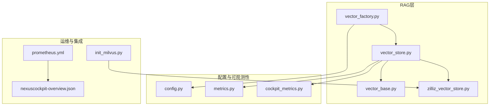
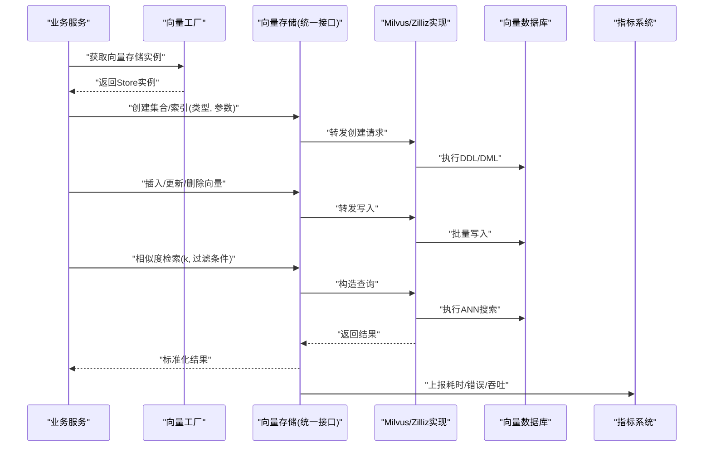
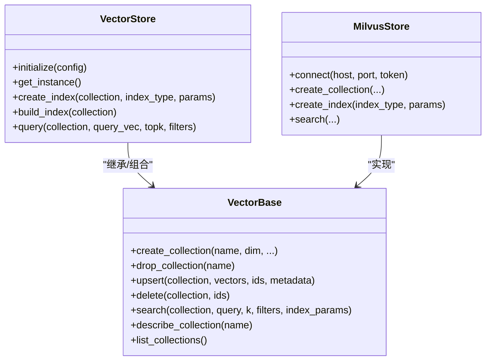
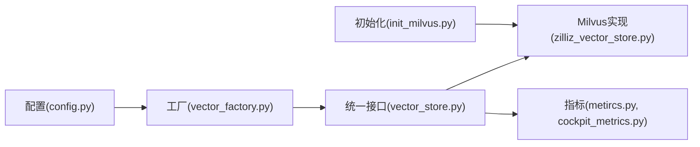
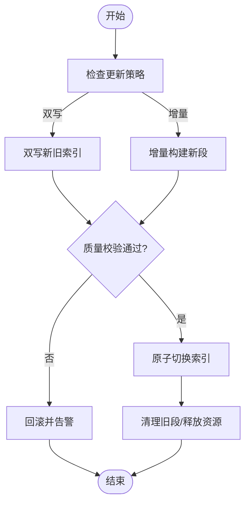
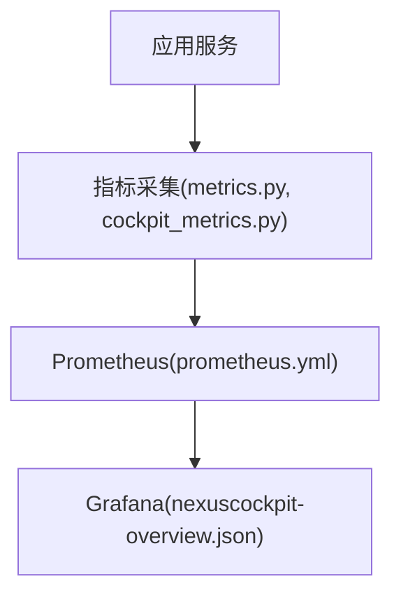

# 向量索引策略

<cite>
**本文引用的文件**
- [backend_design/nexus/rag/vector_base.py](file://backend_design/nexus/rag/vector_base.py)
- [backend_design/nexus/rag/vector_store.py](file://backend_design/nexus/rag/vector_store.py)
- [backend_design/nexus/rag/vector_factory.py](file://backend_design/nexus/rag/vector_factory.py)
- [backend_design/nexus/rag/zilliz_vector_store.py](file://backend_design/nexus/rag/zilliz_vector_store.py)
- [backend_design/nexus/config.py](file://backend_design/nexus/config.py)
- [backend_design/nexus/observability/metrics.py](file://backend_design/nexus/observability/metrics.py)
- [backend_design/nexus/observability/cockpit_metrics.py](file://backend_design/nexus/observability/cockpit_metrics.py)
- [config/prometheus/prometheus.yml](file://config/prometheus/prometheus.yml)
- [config/grafana/provisioning/dashboards/nexuscockpit-overview.json](file://config/grafana/provisioning/dashboards/nexuscockpit-overview.json)
- [scripts/init_milvus.py](file://scripts/init_milvus.py)
</cite>

## 目录
1. [简介](#简介)
2. [项目结构](#项目结构)
3. [核心组件](#核心组件)
4. [架构总览](#架构总览)
5. [详细组件分析](#详细组件分析)
6. [依赖关系分析](#依赖关系分析)
7. [性能与参数调优](#性能与参数调优)
8. [动态更新与增量构建](#动态更新与增量构建)
9. [监控与性能分析](#监控与性能分析)
10. [大规模分片与分布式部署](#大规模分片与分布式部署)
11. [故障排查指南](#故障排查指南)
12. [结论](#结论)

## 简介
本文件面向NexusCockpit系统的向量检索能力，聚焦于向量索引策略的设计与实践。内容涵盖：
- HNSW、IVF、PQ等主流索引类型的原理与适用场景
- 构建时间、查询性能与内存占用的平衡方法
- 动态索引更新与增量索引构建方案
- 索引监控与性能分析工具的使用
- 大规模向量数据的分片与分布式部署策略

## 项目结构
与向量索引相关的代码主要位于RAG模块与可观测性模块中，并通过配置与脚本进行初始化与运维。

图表来源
- [backend_design/nexus/rag/vector_factory.py](file://backend_design/nexus/rag/vector_factory.py)
- [backend_design/nexus/rag/vector_base.py](file://backend_design/nexus/rag/vector_base.py)
- [backend_design/nexus/rag/vector_store.py](file://backend_design/nexus/rag/vector_store.py)
- [backend_design/nexus/rag/zilliz_vector_store.py](file://backend_design/nexus/rag/zilliz_vector_store.py)
- [backend_design/nexus/config.py](file://backend_design/nexus/config.py)
- [backend_design/nexus/observability/metrics.py](file://backend_design/nexus/observability/metrics.py)
- [backend_design/nexus/observability/cockpit_metrics.py](file://backend_design/nexus/observability/cockpit_metrics.py)
- [config/prometheus/prometheus.yml](file://config/prometheus/prometheus.yml)
- [config/grafana/provisioning/dashboards/nexuscockpit-overview.json](file://config/grafana/provisioning/dashboards/nexuscockpit-overview.json)
- [scripts/init_milvus.py](file://scripts/init_milvus.py)

章节来源
- [backend_design/nexus/rag/vector_factory.py](file://backend_design/nexus/rag/vector_factory.py)
- [backend_design/nexus/rag/vector_base.py](file://backend_design/nexus/rag/vector_base.py)
- [backend_design/nexus/rag/vector_store.py](file://backend_design/nexus/rag/vector_store.py)
- [backend_design/nexus/rag/zilliz_vector_store.py](file://backend_design/nexus/rag/zilliz_vector_store.py)
- [backend_design/nexus/config.py](file://backend_design/nexus/config.py)
- [backend_design/nexus/observability/metrics.py](file://backend_design/nexus/observability/metrics.py)
- [backend_design/nexus/observability/cockpit_metrics.py](file://backend_design/nexus/observability/cockpit_metrics.py)
- [config/prometheus/prometheus.yml](file://config/prometheus/prometheus.yml)
- [config/grafana/provisioning/dashboards/nexuscockpit-overview.json](file://config/grafana/provisioning/dashboards/nexuscockpit-overview.json)
- [scripts/init_milvus.py](file://scripts/init_milvus.py)

## 核心组件
- 抽象基类与统一接口：定义统一的向量存储接口（创建集合、插入、删除、查询、统计等），屏蔽底层实现差异。
- 工厂模式：根据配置选择具体向量存储实现（如Zilliz/Milvus）。
- 具体实现：针对Milvus/Zilliz的适配层，封装集合管理、索引创建、查询与元数据操作。
- 配置中心：集中管理连接参数、集合名、维度、索引类型与参数等。
- 可观测性：暴露指标与日志，便于监控索引构建与查询性能。

章节来源
- [backend_design/nexus/rag/vector_base.py](file://backend_design/nexus/rag/vector_base.py)
- [backend_design/nexus/rag/vector_store.py](file://backend_design/nexus/rag/vector_store.py)
- [backend_design/nexus/rag/vector_factory.py](file://backend_design/nexus/rag/vector_factory.py)
- [backend_design/nexus/rag/zilliz_vector_store.py](file://backend_design/nexus/rag/zilliz_vector_store.py)
- [backend_design/nexus/config.py](file://backend_design/nexus/config.py)
- [backend_design/nexus/observability/metrics.py](file://backend_design/nexus/observability/metrics.py)
- [backend_design/nexus/observability/cockpit_metrics.py](file://backend_design/nexus/observability/cockpit_metrics.py)

## 架构总览
下图展示了从应用调用到向量存储的完整链路，包括索引类型选择、参数注入与指标上报。

图表来源
- [backend_design/nexus/rag/vector_factory.py](file://backend_design/nexus/rag/vector_factory.py)
- [backend_design/nexus/rag/vector_store.py](file://backend_design/nexus/rag/vector_store.py)
- [backend_design/nexus/rag/zilliz_vector_store.py](file://backend_design/nexus/rag/zilliz_vector_store.py)
- [backend_design/nexus/observability/metrics.py](file://backend_design/nexus/observability/metrics.py)

## 详细组件分析

### 组件A：向量存储抽象与工厂
- 职责
  - 定义统一的向量存储接口，包含集合生命周期管理、索引管理、CRUD与检索。
  - 通过工厂按配置选择具体实现，支持多后端扩展。
- 设计要点
  - 接口隔离：将“集合/索引”与“数据读写”解耦，便于测试与替换。
  - 配置驱动：索引类型与参数来自配置，避免硬编码。
  - 可观测性：在关键路径埋点，记录构建/查询耗时、错误率与吞吐。

图表来源
- [backend_design/nexus/rag/vector_base.py](file://backend_design/nexus/rag/vector_base.py)
- [backend_design/nexus/rag/vector_store.py](file://backend_design/nexus/rag/vector_store.py)
- [backend_design/nexus/rag/zilliz_vector_store.py](file://backend_design/nexus/rag/zilliz_vector_store.py)

章节来源
- [backend_design/nexus/rag/vector_base.py](file://backend_design/nexus/rag/vector_base.py)
- [backend_design/nexus/rag/vector_store.py](file://backend_design/nexus/rag/vector_store.py)
- [backend_design/nexus/rag/vector_factory.py](file://backend_design/nexus/rag/vector_factory.py)
- [backend_design/nexus/rag/zilliz_vector_store.py](file://backend_design/nexus/rag/zilliz_vector_store.py)

### 组件B：Milvus/Zilliz适配层
- 职责
  - 对接Milvus/Zilliz API，完成集合创建、索引创建、数据写入与检索。
  - 处理连接池、重试、超时与错误码映射。
- 关键点
  - 索引类型与参数由上层传入，适配层负责转换为底层API所需格式。
  - 提供批量写入与分页查询，提升吞吐并降低网络开销。

章节来源
- [backend_design/nexus/rag/zilliz_vector_store.py](file://backend_design/nexus/rag/zilliz_vector_store.py)

### 组件C：配置与初始化
- 职责
  - 集中管理向量库连接、集合命名规范、默认索引类型与参数。
  - 提供初始化脚本，用于环境准备与集合/索引预创建。
- 关键点
  - 通过环境变量或配置文件注入，便于不同环境差异化部署。
  - 初始化脚本支持幂等执行，保障重复运行安全。

章节来源
- [backend_design/nexus/config.py](file://backend_design/nexus/config.py)
- [scripts/init_milvus.py](file://scripts/init_milvus.py)

## 依赖关系分析
- 耦合度
  - 工厂与具体实现松耦合，新增后端只需实现统一接口。
  - 配置与实现分离，变更索引策略无需修改业务逻辑。
- 外部依赖
  - 向量数据库客户端SDK（Milvus/Zilliz）
  - 指标采集与可视化（Prometheus/Grafana）

图表来源
- [backend_design/nexus/config.py](file://backend_design/nexus/config.py)
- [backend_design/nexus/rag/vector_factory.py](file://backend_design/nexus/rag/vector_factory.py)
- [backend_design/nexus/rag/vector_store.py](file://backend_design/nexus/rag/vector_store.py)
- [backend_design/nexus/rag/zilliz_vector_store.py](file://backend_design/nexus/rag/zilliz_vector_store.py)
- [backend_design/nexus/observability/metrics.py](file://backend_design/nexus/observability/metrics.py)
- [backend_design/nexus/observability/cockpit_metrics.py](file://backend_design/nexus/observability/cockpit_metrics.py)
- [scripts/init_milvus.py](file://scripts/init_milvus.py)

## 性能与参数调优
本节聚焦HNSW、IVF、PQ三类索引的原理、适用场景与参数调优思路，并结合系统内配置与指标进行优化。

- HNSW（Hierarchical Navigable Small World）
  - 原理：基于多层图结构的近似最近邻搜索，通过高层稀疏导航快速定位候选区域，再在低层精细搜索。
  - 适用场景：对延迟敏感、数据规模中等、需要高召回率的在线检索。
  - 关键参数
    - M：每节点最大边数，影响构建时间与查询精度。
    - efConstruction：构建时搜索深度，越大越精确但构建更慢。
    - ef：查询时搜索深度，越大召回越高但延迟增加。
  - 调优建议
    - 先固定M与efConstruction，以目标构建时间为上限调整efConstruction。
    - 在离线集上评估不同ef下的召回/延迟曲线，选取满足SLA的点。
    - 关注内存占用随M与数据量增长的趋势，必要时降维或采用PQ。

- IVF（Inverted File Index）
  - 原理：先将向量聚类为多个簇，查询时仅搜索最相近的若干簇，再进行局部精确或近似搜索。
  - 适用场景：超大规模数据集，追求较高吞吐与可控内存。
  - 关键参数
    - nlist：簇数量，越大召回越高但构建与查询成本上升。
    - nprobe：查询时探测的簇数量，越大召回越高但延迟增加。
  - 调优建议
    - 使用KMeans或自适应聚类算法确定nlist初始值。
    - 以nprobe为杠杆调节召回/延迟，结合业务阈值选择。
    - 配合PQ进一步压缩向量，降低内存与IO。

- PQ（Product Quantization）
  - 原理：将高维向量分解为子空间并进行量化，用码本距离近似真实距离，显著压缩存储与加速计算。
  - 适用场景：海量数据、内存受限、对精度有一定容忍度的检索。
  - 关键参数
    - m：子空间个数，越大精度越高但计算量增大。
    - nbits：每个子空间的比特数，越小压缩比越高但精度下降。
  - 调优建议
    - 先用IVF粗筛，再用PQ精排，形成IVF+PQ混合索引。
    - 在离线集上扫描m与nbits的组合，绘制召回/延迟/内存三维权衡面。
    - 对热点数据保留原始向量或使用更高精度子空间分配。

- 构建时间、查询性能与内存占用的平衡
  - 构建阶段
    - 优先批量化写入，减少锁竞争与重建次数。
    - 合理设置nlist/efConstruction/M，使构建时间在窗口期内完成。
  - 查询阶段
    - 以P95/P99延迟为目标，结合召回率约束选择ef/nprobe。
    - 引入缓存与去重，降低重复查询压力。
  - 内存占用
    - 控制图索引边密度与簇数量；对冷数据采用更低精度或归档。
    - 监控堆外内存与磁盘IO，避免频繁换页。

章节来源
- [backend_design/nexus/config.py](file://backend_design/nexus/config.py)
- [backend_design/nexus/observability/metrics.py](file://backend_design/nexus/observability/metrics.py)
- [backend_design/nexus/observability/cockpit_metrics.py](file://backend_design/nexus/observability/cockpit_metrics.py)

## 动态更新与增量构建
- 设计原则
  - 原子性：索引更新与数据写入需具备事务性或最终一致性保障。
  - 幂等性：支持重试与重复提交不产生副作用。
  - 可回滚：失败时可快速回退至上一稳定版本。
- 推荐方案
  - 双写切换：新索引与旧索引并行维护，达到阈值后原子切换。
  - 增量合并：定期将增量段与主段合并，触发后台重建任务。
  - 冷热分层：热数据走HNSW保证低延迟，冷数据走IVF/PQ节省资源。
- 流程示意

[此图为概念流程图，未直接映射具体源码文件]

## 监控与性能分析
- 指标体系
  - 构建指标：构建时长、吞吐、失败率、内存峰值、磁盘IO。
  - 查询指标：P50/P95/P99延迟、QPS、召回率、错误率。
  - 资源指标：CPU、内存、GC、线程池、连接池。
- 采集与展示
  - Prometheus抓取后端指标，Grafana提供仪表盘与告警规则。
  - 关键面板：索引构建进度、查询延迟分布、错误率趋势、资源水位。
- 使用建议
  - 为每次索引构建与查询埋点，关联traceID以便问题定位。
  - 设置阈值告警，如P99延迟突增、构建失败率升高、内存持续高位。

图表来源
- [backend_design/nexus/observability/metrics.py](file://backend_design/nexus/observability/metrics.py)
- [backend_design/nexus/observability/cockpit_metrics.py](file://backend_design/nexus/observability/cockpit_metrics.py)
- [config/prometheus/prometheus.yml](file://config/prometheus/prometheus.yml)
- [config/grafana/provisioning/dashboards/nexuscockpit-overview.json](file://config/grafana/provisioning/dashboards/nexuscockpit-overview.json)

章节来源
- [backend_design/nexus/observability/metrics.py](file://backend_design/nexus/observability/metrics.py)
- [backend_design/nexus/observability/cockpit_metrics.py](file://backend_design/nexus/observability/cockpit_metrics.py)
- [config/prometheus/prometheus.yml](file://config/prometheus/prometheus.yml)
- [config/grafana/provisioning/dashboards/nexuscockpit-overview.json](file://config/grafana/provisioning/dashboards/nexuscockpit-overview.json)

## 大规模分片与分布式部署
- 分片策略
  - 按租户/业务域划分集合，避免跨域干扰。
  - 按向量ID哈希分片，保证均匀分布与可扩展性。
  - 冷热数据分区，热数据副本数更高，冷数据压缩存储。
- 分布式部署
  - 无状态服务横向扩展，结合负载均衡分发查询。
  - 向量数据库集群化部署，启用副本与容灾。
  - 索引构建任务异步化，避免阻塞在线服务。
- 容量规划
  - 估算向量总量×维度×精度系数，预留30%~50%冗余。
  - 根据QPS与延迟目标，规划CPU核数与内存大小。
  - 监控磁盘IO与网络带宽，避免成为瓶颈。

[本节为通用指导，不直接分析具体源码文件]

## 故障排查指南
- 常见问题
  - 连接失败：检查认证、网络连通性与端口开放。
  - 构建缓慢：确认批次大小、索引参数与资源配额。
  - 查询延迟高：调整ef/nprobe，检查热点与锁竞争。
  - 内存溢出：降低M或nlist，启用PQ，扩容内存。
- 定位步骤
  - 查看指标面板，定位异常时段与相关服务。
  - 拉取对应traceID的日志，核对参数与错误栈。
  - 复现实验：缩小数据集验证参数敏感性。
- 恢复措施
  - 降级：临时降低并发或切换至保守索引参数。
  - 回滚：切回上一稳定索引版本。
  - 扩容：临时增加资源或分片，缓解压力。

章节来源
- [backend_design/nexus/observability/metrics.py](file://backend_design/nexus/observability/metrics.py)
- [backend_design/nexus/observability/cockpit_metrics.py](file://backend_design/nexus/observability/cockpit_metrics.py)

## 结论
通过统一的向量存储抽象与工厂模式，NexusCockpit能够灵活选择HNSW、IVF、PQ等索引类型，并在构建时间、查询性能与内存占用之间取得平衡。结合可观测性与自动化运维，可实现动态更新与增量构建，支撑大规模分片与分布式部署。建议在上线前进行充分的离线评测与压测，建立完善的监控与告警体系，确保线上稳定性与性能达标。