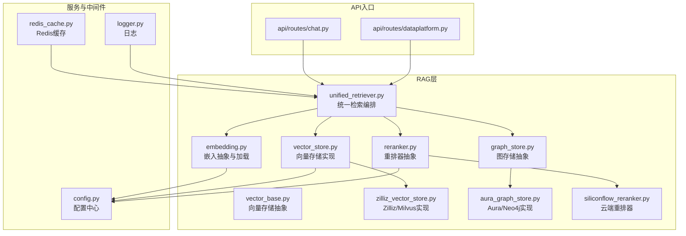
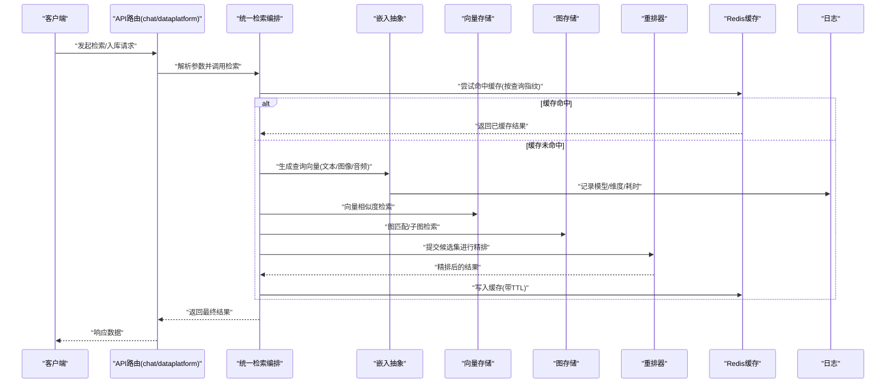
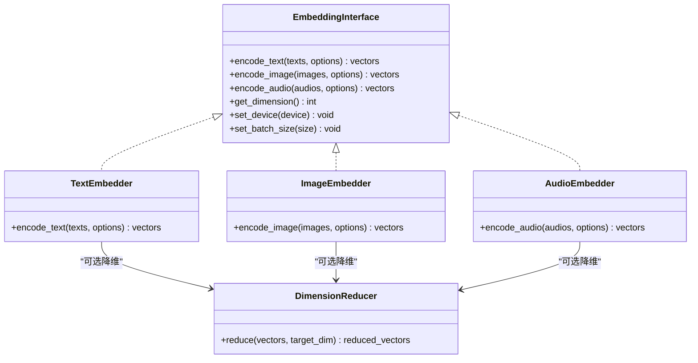
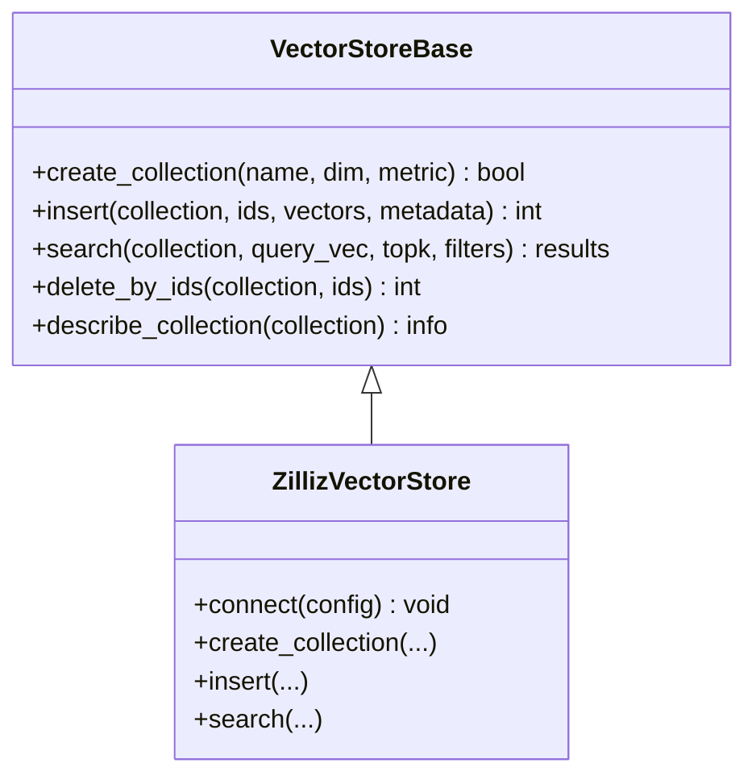
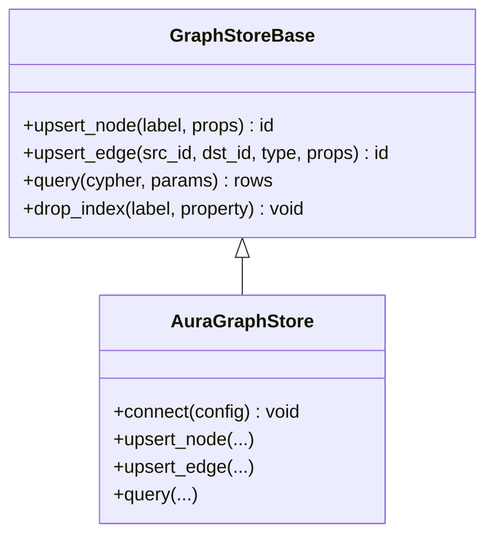
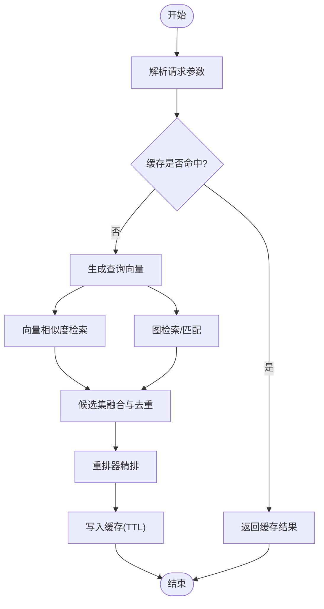
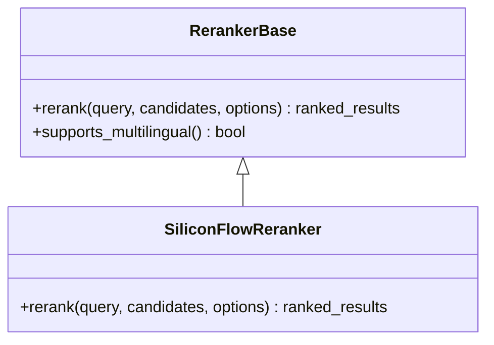
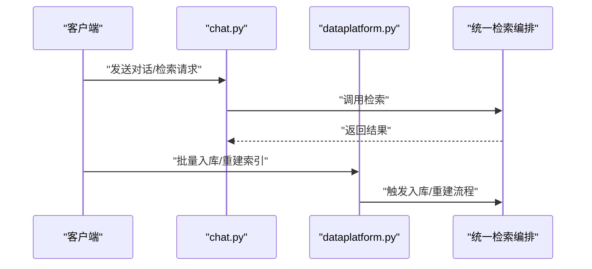
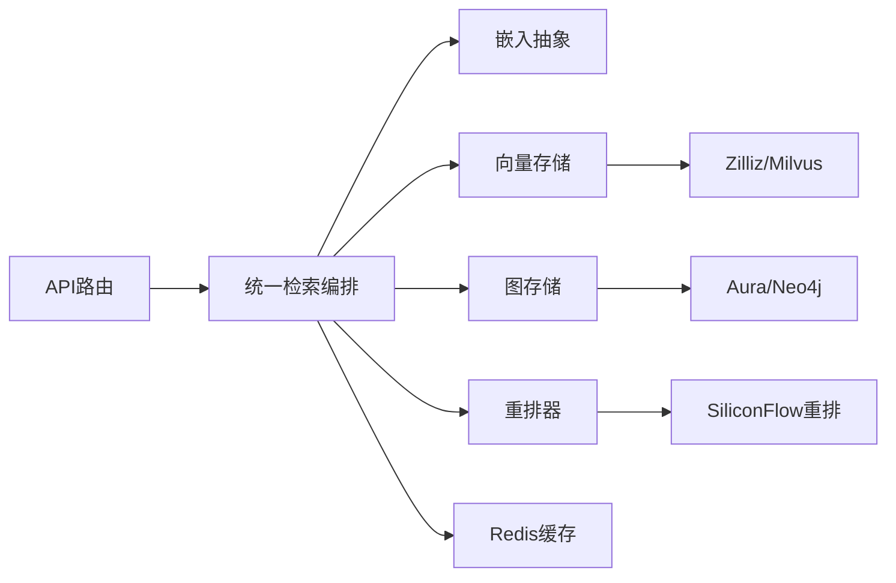

# 嵌入生成系统

<cite>
**本文引用的文件**   
- [backend_design/nexus/rag/embedding.py](file://backend_design/nexus/rag/embedding.py)
- [backend_design/nexus/rag/vector_base.py](file://backend_design/nexus/rag/vector_base.py)
- [backend_design/nexus/rag/vector_store.py](file://backend_design/nexus/rag/vector_store.py)
- [backend_design/nexus/rag/zilliz_vector_store.py](file://backend_design/nexus/rag/zilliz_vector_store.py)
- [backend_design/nexus/rag/graph_store.py](file://backend_design/nexus/rag/graph_store.py)
- [backend_design/nexus/rag/aura_graph_store.py](file://backend_design/nexus/rag/aura_graph_store.py)
- [backend_design/nexus/rag/unified_retriever.py](file://backend_design/nexus/rag/unified_retriever.py)
- [backend_design/nexus/rag/reranker.py](file://backend_design/nexus/rag/reranker.py)
- [backend_design/nexus/rag/siliconflow_reranker.py](file://backend_design/nexus/rag/siliconflow_reranker.py)
- [backend_design/nexus/config.py](file://backend_design/nexus/config.py)
- [backend_design/nexus/middleware/redis_cache.py](file://backend_design/nexus/middleware/redis_cache.py)
- [backend_design/nexus/core/logger.py](file://backend_design/nexus/core/logger.py)
- [backend_design/nexus/api/routes/chat.py](file://backend_design/nexus/api/routes/chat.py)
- [backend_design/nexus/api/routes/dataplatform.py](file://backend_design/nexus/api/routes/dataplatform.py)
- [models/reranker/bge-reranker-v2-m3/configuration.json](file://models/reranker/bge-reranker-v2-m3/configuration.json)
</cite>

## 目录
1. [简介](#简介)
2. [项目结构](#项目结构)
3. [核心组件](#核心组件)
4. [架构总览](#架构总览)
5. [详细组件分析](#详细组件分析)
6. [依赖关系分析](#依赖关系分析)
7. [性能考虑](#性能考虑)
8. [故障排查指南](#故障排查指南)
9. [结论](#结论)
10. [附录](#附录)

## 简介
本文件面向NexusCockpit系统的“嵌入生成与检索”子系统，聚焦文本、图像与音频数据的向量化处理流程、模型选择策略、维度配置与优化、批量与缓存机制，以及多语言支持与领域适配。文档以代码级实现为依据，提供架构图、流程图与调用序列图，帮助读者快速理解并高效使用该系统。

## 项目结构
嵌入相关能力集中在后端RAG模块中，围绕“统一嵌入接口 + 向量存储 + 检索编排 + 重排器”的层次化设计组织：
- 嵌入抽象与工厂：定义统一的嵌入接口与加载策略
- 向量存储抽象与实现：封装Milvus/Zilliz等向量数据库
- 图存储抽象与实现：封装Neo4j/Aura等图数据库（用于知识图谱）
- 检索编排：统一召回与融合
- 重排器：对召回结果进行精排
- 配置与日志：集中式配置与可观测性

图表来源
- [backend_design/nexus/rag/embedding.py](file://backend_design/nexus/rag/embedding.py)
- [backend_design/nexus/rag/vector_base.py](file://backend_design/nexus/rag/vector_base.py)
- [backend_design/nexus/rag/vector_store.py](file://backend_design/nexus/rag/vector_store.py)
- [backend_design/nexus/rag/zilliz_vector_store.py](file://backend_design/nexus/rag/zilliz_vector_store.py)
- [backend_design/nexus/rag/graph_store.py](file://backend_design/nexus/rag/graph_store.py)
- [backend_design/nexus/rag/aura_graph_store.py](file://backend_design/nexus/rag/aura_graph_store.py)
- [backend_design/nexus/rag/unified_retriever.py](file://backend_design/nexus/rag/unified_retriever.py)
- [backend_design/nexus/rag/reranker.py](file://backend_design/nexus/rag/reranker.py)
- [backend_design/nexus/rag/siliconflow_reranker.py](file://backend_design/nexus/rag/siliconflow_reranker.py)
- [backend_design/nexus/config.py](file://backend_design/nexus/config.py)
- [backend_design/nexus/middleware/redis_cache.py](file://backend_design/nexus/middleware/redis_cache.py)
- [backend_design/nexus/core/logger.py](file://backend_design/nexus/core/logger.py)
- [backend_design/nexus/api/routes/chat.py](file://backend_design/nexus/api/routes/chat.py)
- [backend_design/nexus/api/routes/dataplatform.py](file://backend_design/nexus/api/routes/dataplatform.py)

章节来源
- [backend_design/nexus/rag/embedding.py](file://backend_design/nexus/rag/embedding.py)
- [backend_design/nexus/rag/vector_base.py](file://backend_design/nexus/rag/vector_base.py)
- [backend_design/nexus/rag/vector_store.py](file://backend_design/nexus/rag/vector_store.py)
- [backend_design/nexus/rag/zilliz_vector_store.py](file://backend_design/nexus/rag/zilliz_vector_store.py)
- [backend_design/nexus/rag/graph_store.py](file://backend_design/nexus/rag/graph_store.py)
- [backend_design/nexus/rag/aura_graph_store.py](file://backend_design/nexus/rag/aura_graph_store.py)
- [backend_design/nexus/rag/unified_retriever.py](file://backend_design/nexus/rag/unified_retriever.py)
- [backend_design/nexus/rag/reranker.py](file://backend_design/nexus/rag/reranker.py)
- [backend_design/nexus/rag/siliconflow_reranker.py](file://backend_design/nexus/rag/siliconflow_reranker.py)
- [backend_design/nexus/config.py](file://backend_design/nexus/config.py)
- [backend_design/nexus/middleware/redis_cache.py](file://backend_design/nexus/middleware/redis_cache.py)
- [backend_design/nexus/core/logger.py](file://backend_design/nexus/core/logger.py)
- [backend_design/nexus/api/routes/chat.py](file://backend_design/nexus/api/routes/chat.py)
- [backend_design/nexus/api/routes/dataplatform.py](file://backend_design/nexus/api/routes/dataplatform.py)

## 核心组件
- 嵌入抽象与加载
  - 提供统一的嵌入接口，支持文本、图像、音频等多模态输入；通过配置选择开源或本地模型，并暴露维度、设备、批大小等参数。
- 向量存储抽象与实现
  - 抽象出集合管理、索引构建、插入/更新、相似度检索等通用操作；具体实现对接Milvus/Zilliz等。
- 图存储抽象与实现
  - 抽象出节点/边增删改查与图查询；具体实现对接Neo4j/Aura。
- 统一检索编排
  - 将文本/图像/音频查询转换为向量，执行向量与图混合召回，合并排序后交由重排器精排。
- 重排器抽象与实现
  - 抽象跨源重排接口；提供云端重排器实现（如SiliconFlow），并可扩展本地重排器。
- 配置与缓存
  - 集中式配置项控制模型、维度、批量、超时、重试、缓存键等；Redis用于高频嵌入/检索结果的缓存。

章节来源
- [backend_design/nexus/rag/embedding.py](file://backend_design/nexus/rag/embedding.py)
- [backend_design/nexus/rag/vector_base.py](file://backend_design/nexus/rag/vector_base.py)
- [backend_design/nexus/rag/vector_store.py](file://backend_design/nexus/rag/vector_store.py)
- [backend_design/nexus/rag/zilliz_vector_store.py](file://backend_design/nexus/rag/zilliz_vector_store.py)
- [backend_design/nexus/rag/graph_store.py](file://backend_design/nexus/rag/graph_store.py)
- [backend_design/nexus/rag/aura_graph_store.py](file://backend_design/nexus/rag/aura_graph_store.py)
- [backend_design/nexus/rag/unified_retriever.py](file://backend_design/nexus/rag/unified_retriever.py)
- [backend_design/nexus/rag/reranker.py](file://backend_design/nexus/rag/reranker.py)
- [backend_design/nexus/rag/siliconflow_reranker.py](file://backend_design/nexus/rag/siliconflow_reranker.py)
- [backend_design/nexus/config.py](file://backend_design/nexus/config.py)
- [backend_design/nexus/middleware/redis_cache.py](file://backend_design/nexus/middleware/redis_cache.py)

## 架构总览
下图展示从API到嵌入生成、向量/图检索、重排的端到端流程，以及缓存与配置的参与点。

图表来源
- [backend_design/nexus/api/routes/chat.py](file://backend_design/nexus/api/routes/chat.py)
- [backend_design/nexus/api/routes/dataplatform.py](file://backend_design/nexus/api/routes/dataplatform.py)
- [backend_design/nexus/rag/unified_retriever.py](file://backend_design/nexus/rag/unified_retriever.py)
- [backend_design/nexus/rag/embedding.py](file://backend_design/nexus/rag/embedding.py)
- [backend_design/nexus/rag/vector_store.py](file://backend_design/nexus/rag/vector_store.py)
- [backend_design/nexus/rag/zilliz_vector_store.py](file://backend_design/nexus/rag/zilliz_vector_store.py)
- [backend_design/nexus/rag/graph_store.py](file://backend_design/nexus/rag/graph_store.py)
- [backend_design/nexus/rag/aura_graph_store.py](file://backend_design/nexus/rag/aura_graph_store.py)
- [backend_design/nexus/rag/reranker.py](file://backend_design/nexus/rag/reranker.py)
- [backend_design/nexus/rag/siliconflow_reranker.py](file://backend_design/nexus/rag/siliconflow_reranker.py)
- [backend_design/nexus/middleware/redis_cache.py](file://backend_design/nexus/middleware/redis_cache.py)
- [backend_design/nexus/core/logger.py](file://backend_design/nexus/core/logger.py)

## 详细组件分析

### 嵌入抽象与多模态处理
- 目标
  - 为文本、图像、音频提供统一的嵌入接口，屏蔽底层模型差异，暴露维度、设备、批大小、归一化等关键参数。
- 多模态预处理要点
  - 文本：清洗、分词/分句、截断/填充、语言检测与对齐。
  - 图像：解码、缩放、裁剪、标准化、通道顺序调整。
  - 音频：采样率重采样、静音切除、分片、特征提取（如梅尔频谱）。
- 模型选择策略
  - 开源/本地：优先本地部署以降低延迟与成本，支持热切换。
  - 云端：在本地不可用时回退至云端服务，具备熔断与降级。
- 维度与压缩
  - 输出维度由模型决定；可通过配置启用降维（如PCA/线性投影）以满足存储与检索性能要求。
- 批量与并发
  - 支持批内并行与批间流水线，结合GPU/CPU设备自动调度。

图表来源
- [backend_design/nexus/rag/embedding.py](file://backend_design/nexus/rag/embedding.py)

章节来源
- [backend_design/nexus/rag/embedding.py](file://backend_design/nexus/rag/embedding.py)

### 向量存储抽象与实现
- 目标
  - 抽象集合生命周期、索引类型、插入/更新、相似度检索、分页与过滤等通用能力。
- 典型实现
  - Milvus/Zilliz：高性能向量检索，支持标量字段过滤、动态索引、分区表等。
- 关键配置
  - 集合名、维度、索引类型（HNSW/IVF_FLAT等）、度量方式（余弦/内积/L2）、连接信息、重试与超时。

图表来源
- [backend_design/nexus/rag/vector_base.py](file://backend_design/nexus/rag/vector_base.py)
- [backend_design/nexus/rag/vector_store.py](file://backend_design/nexus/rag/vector_store.py)
- [backend_design/nexus/rag/zilliz_vector_store.py](file://backend_design/nexus/rag/zilliz_vector_store.py)

章节来源
- [backend_design/nexus/rag/vector_base.py](file://backend_design/nexus/rag/vector_base.py)
- [backend_design/nexus/rag/vector_store.py](file://backend_design/nexus/rag/vector_store.py)
- [backend_design/nexus/rag/zilliz_vector_store.py](file://backend_design/nexus/rag/zilliz_vector_store.py)

### 图存储抽象与实现
- 目标
  - 抽象节点/边CRUD与图查询，支撑知识图谱检索与实体对齐。
- 典型实现
  - Neo4j/Aura：支持Cypher查询、事务、索引与约束。

图表来源
- [backend_design/nexus/rag/graph_store.py](file://backend_design/nexus/rag/graph_store.py)
- [backend_design/nexus/rag/aura_graph_store.py](file://backend_design/nexus/rag/aura_graph_store.py)

章节来源
- [backend_design/nexus/rag/graph_store.py](file://backend_design/nexus/rag/graph_store.py)
- [backend_design/nexus/rag/aura_graph_store.py](file://backend_design/nexus/rag/aura_graph_store.py)

### 统一检索编排
- 目标
  - 将多模态查询转为向量，并行执行向量与图检索，融合候选集并按相关性排序，最后交给重排器精排。
- 关键流程
  - 参数校验 -> 缓存命中检查 -> 生成查询向量 -> 向量检索 -> 图检索 -> 候选融合 -> 重排 -> 写缓存 -> 返回。

图表来源
- [backend_design/nexus/rag/unified_retriever.py](file://backend_design/nexus/rag/unified_retriever.py)
- [backend_design/nexus/rag/embedding.py](file://backend_design/nexus/rag/embedding.py)
- [backend_design/nexus/rag/vector_store.py](file://backend_design/nexus/rag/vector_store.py)
- [backend_design/nexus/rag/graph_store.py](file://backend_design/nexus/rag/graph_store.py)
- [backend_design/nexus/rag/reranker.py](file://backend_design/nexus/rag/reranker.py)
- [backend_design/nexus/middleware/redis_cache.py](file://backend_design/nexus/middleware/redis_cache.py)

章节来源
- [backend_design/nexus/rag/unified_retriever.py](file://backend_design/nexus/rag/unified_retriever.py)

### 重排器抽象与实现
- 目标
  - 对召回候选进行二次打分与排序，提升最终相关性。
- 典型实现
  - SiliconFlow重排器：基于云端服务的高精度重排，支持多语言与长上下文。
- 配置要点
  - 模型ID、最大长度、温度/TopK、超时、重试次数、失败回退策略。

图表来源
- [backend_design/nexus/rag/reranker.py](file://backend_design/nexus/rag/reranker.py)
- [backend_design/nexus/rag/siliconflow_reranker.py](file://backend_design/nexus/rag/siliconflow_reranker.py)
- [models/reranker/bge-reranker-v2-m3/configuration.json](file://models/reranker/bge-reranker-v2-m3/configuration.json)

章节来源
- [backend_design/nexus/rag/reranker.py](file://backend_design/nexus/rag/reranker.py)
- [backend_design/nexus/rag/siliconflow_reranker.py](file://backend_design/nexus/rag/siliconflow_reranker.py)
- [models/reranker/bge-reranker-v2-m3/configuration.json](file://models/reranker/bge-reranker-v2-m3/configuration.json)

### API集成点
- 聊天对话
  - 接收用户消息，触发检索与重排，返回答案与引用来源。
- 数据平台
  - 提供批量入库、索引重建、统计与监控接口。

图表来源
- [backend_design/nexus/api/routes/chat.py](file://backend_design/nexus/api/routes/chat.py)
- [backend_design/nexus/api/routes/dataplatform.py](file://backend_design/nexus/api/routes/dataplatform.py)
- [backend_design/nexus/rag/unified_retriever.py](file://backend_design/nexus/rag/unified_retriever.py)

章节来源
- [backend_design/nexus/api/routes/chat.py](file://backend_design/nexus/api/routes/chat.py)
- [backend_design/nexus/api/routes/dataplatform.py](file://backend_design/nexus/api/routes/dataplatform.py)

## 依赖关系分析
- 组件耦合
  - 统一检索编排对嵌入、向量存储、图存储、重排器存在强依赖；通过抽象降低耦合度。
- 外部依赖
  - 向量数据库（Milvus/Zilliz）、图数据库（Neo4j/Aura）、缓存（Redis）、云端重排服务。
- 潜在循环依赖
  - 当前分层清晰，未见循环导入；建议保持单向依赖：API -> 编排 -> 各存储/嵌入/重排。

图表来源
- [backend_design/nexus/api/routes/chat.py](file://backend_design/nexus/api/routes/chat.py)
- [backend_design/nexus/api/routes/dataplatform.py](file://backend_design/nexus/api/routes/dataplatform.py)
- [backend_design/nexus/rag/unified_retriever.py](file://backend_design/nexus/rag/unified_retriever.py)
- [backend_design/nexus/rag/embedding.py](file://backend_design/nexus/rag/embedding.py)
- [backend_design/nexus/rag/vector_store.py](file://backend_design/nexus/rag/vector_store.py)
- [backend_design/nexus/rag/zilliz_vector_store.py](file://backend_design/nexus/rag/zilliz_vector_store.py)
- [backend_design/nexus/rag/graph_store.py](file://backend_design/nexus/rag/graph_store.py)
- [backend_design/nexus/rag/aura_graph_store.py](file://backend_design/nexus/rag/aura_graph_store.py)
- [backend_design/nexus/rag/reranker.py](file://backend_design/nexus/rag/reranker.py)
- [backend_design/nexus/rag/siliconflow_reranker.py](file://backend_design/nexus/rag/siliconflow_reranker.py)
- [backend_design/nexus/middleware/redis_cache.py](file://backend_design/nexus/middleware/redis_cache.py)

章节来源
- [backend_design/nexus/rag/unified_retriever.py](file://backend_design/nexus/rag/unified_retriever.py)
- [backend_design/nexus/rag/vector_store.py](file://backend_design/nexus/rag/vector_store.py)
- [backend_design/nexus/rag/zilliz_vector_store.py](file://backend_design/nexus/rag/zilliz_vector_store.py)
- [backend_design/nexus/rag/graph_store.py](file://backend_design/nexus/rag/graph_store.py)
- [backend_design/nexus/rag/aura_graph_store.py](file://backend_design/nexus/rag/aura_graph_store.py)
- [backend_design/nexus/rag/reranker.py](file://backend_design/nexus/rag/reranker.py)
- [backend_design/nexus/rag/siliconflow_reranker.py](file://backend_design/nexus/rag/siliconflow_reranker.py)
- [backend_design/nexus/middleware/redis_cache.py](file://backend_design/nexus/middleware/redis_cache.py)

## 性能考虑
- 批量处理
  - 嵌入阶段采用批内并行与批间流水线，合理设置批大小与设备内存上限，避免OOM。
- 缓存机制
  - 对高频查询与稳定知识库结果进行缓存，按查询指纹与版本哈希生成键，设置合理TTL。
- 索引与度量
  - 根据数据规模与延迟SLA选择合适的索引类型与度量方式；必要时开启预取与异步写入。
- 降维与压缩
  - 在满足召回质量的前提下，对高维向量进行降维以减少存储与计算开销。
- 超时与重试
  - 对远程服务（重排、向量库）设置超时与重试，配合熔断与降级策略保障可用性。

[本节为通用性能指导，不直接分析具体文件]

## 故障排查指南
- 常见问题定位
  - 模型加载失败：检查配置项、设备可用性与权限；查看日志中的错误堆栈。
  - 向量检索超时：检查向量库连接、索引状态与网络状况；适当增大超时与重试。
  - 重排失败：确认云端服务可用性、密钥与配额；启用回退策略返回原始排序。
  - 缓存异常：检查Redis连通性与键空间占用；清理过期键与热点键。
- 日志与可观测性
  - 在关键路径埋点记录耗时、错误码与资源使用，便于问题复现与容量规划。

章节来源
- [backend_design/nexus/core/logger.py](file://backend_design/nexus/core/logger.py)
- [backend_design/nexus/middleware/redis_cache.py](file://backend_design/nexus/middleware/redis_cache.py)

## 结论
本嵌入生成与检索系统通过统一抽象与分层设计，实现了文本、图像、音频的多模态向量化与检索编排，结合向量与图双路召回及重排精排，兼顾了准确性与性能。通过配置化的模型选择、维度与批量策略，以及缓存与降级机制，系统在稳定性与可扩展性方面具备良好的工程实践基础。

## 附录
- 多语言支持与领域适配
  - 多语言：选择支持多语种的嵌入与重排模型，并在预处理阶段进行语言检测与对齐。
  - 领域适配：针对垂直领域数据微调或选择领域预训练模型，结合本地知识库持续迭代。
- 配置参考
  - 模型名称/路径、设备、批大小、维度、索引类型、度量方式、超时与重试、缓存TTL等均可通过配置中心统一管理。

章节来源
- [backend_design/nexus/config.py](file://backend_design/nexus/config.py)