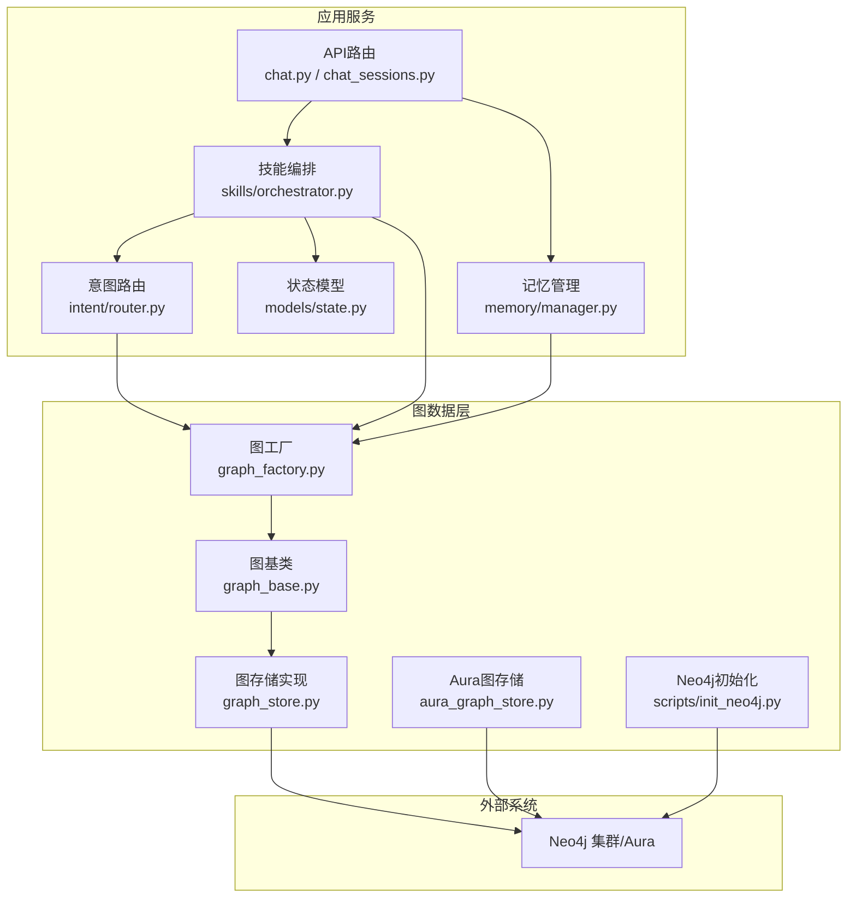
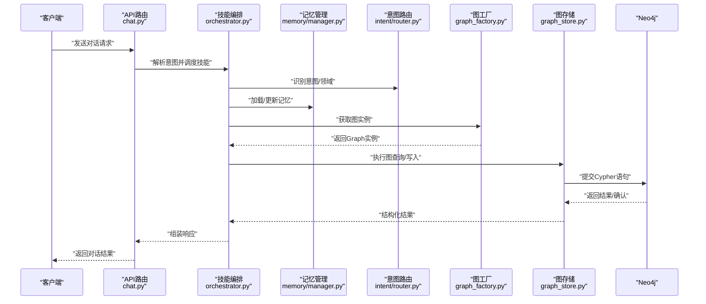
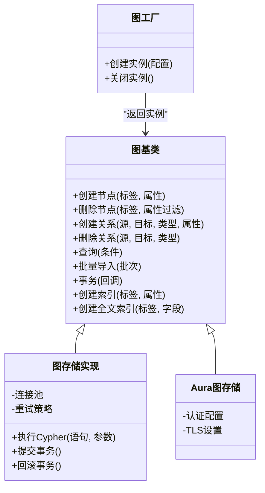
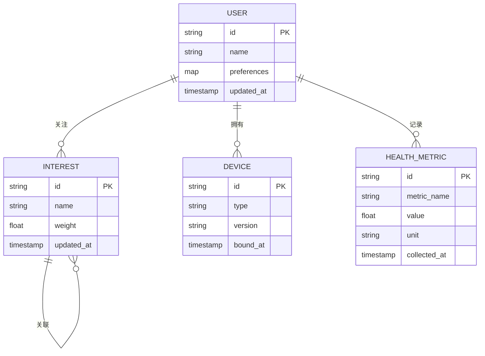
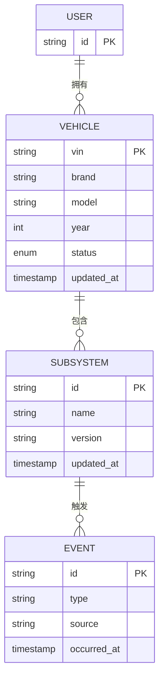
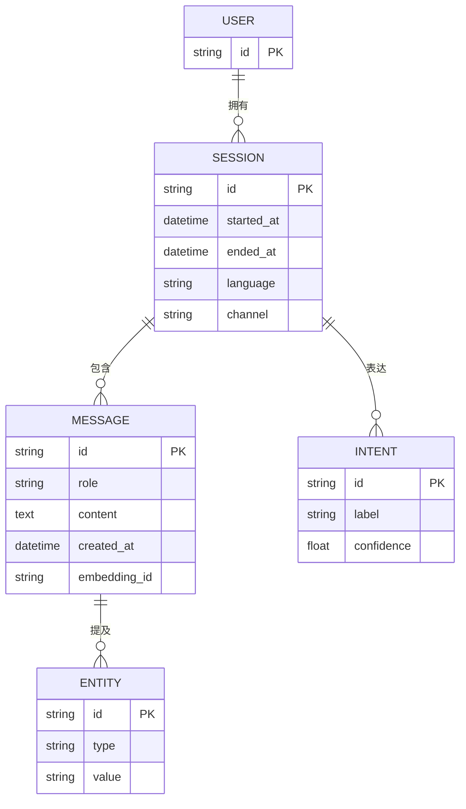
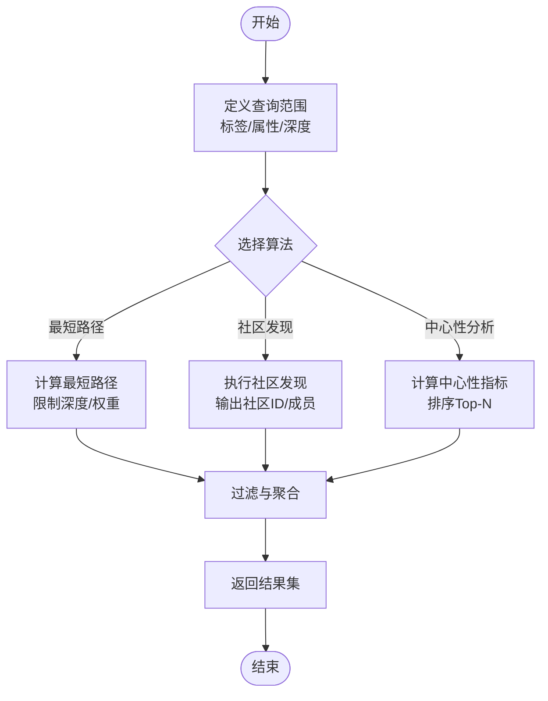
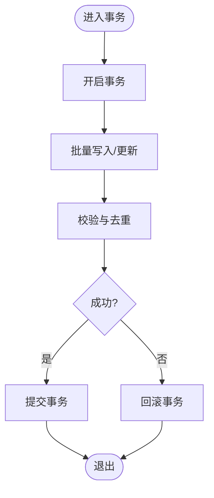
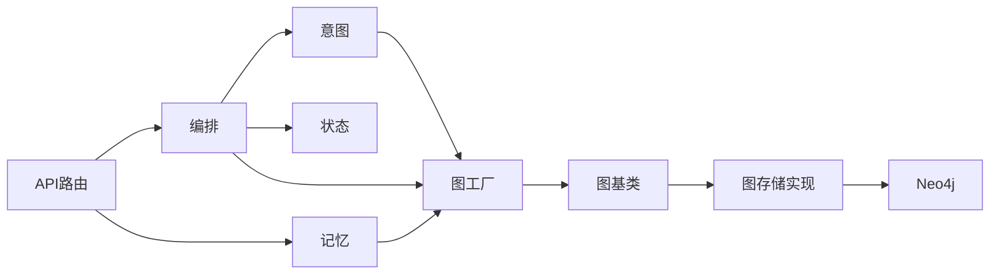

# 图数据库设计

<cite>
**本文引用的文件**   
- [backend_design/nexus/rag/graph_base.py](file://backend_design/nexus/rag/graph_base.py)
- [backend_design/nexus/rag/graph_store.py](file://backend_design/nexus/rag/graph_store.py)
- [backend_design/nexus/rag/aura_graph_store.py](file://backend_design/nexus/rag/aura_graph_store.py)
- [backend_design/nexus/rag/graph_factory.py](file://backend_design/nexus/rag/graph_factory.py)
- [scripts/init_neo4j.py](file://scripts/init_neo4j.py)
- [backend_design/nexus/core/db_manager.py](file://backend_design/nexus/core/db_manager.py)
- [backend_design/nexus/config.py](file://backend_design/nexus/config.py)
- [backend_design/nexus/api/routes/chat.py](file://backend_design/nexus/api/routes/chat.py)
- [backend_design/nexus/api/routes/chat_sessions.py](file://backend_design/nexus/api/routes/chat_sessions.py)
- [backend_design/nexus/skills/orchestrator.py](file://backend_design/nexus/skills/orchestrator.py)
- [backend_design/nexus/memory/manager.py](file://backend_design/nexus/memory/manager.py)
- [backend_design/nexus/intent/router.py](file://backend_design/nexus/intent/router.py)
- [backend_design/nexus/models/state.py](file://backend_design/nexus/models/state.py)
</cite>

## 目录
1. [引言](#引言)
2. [项目结构](#项目结构)
3. [核心组件](#核心组件)
4. [架构总览](#架构总览)
5. [详细组件分析](#详细组件分析)
6. [依赖关系分析](#依赖关系分析)
7. [性能考虑](#性能考虑)
8. [故障排查指南](#故障排查指南)
9. [结论](#结论)
10. [附录](#附录)

## 引言
本设计文档面向NexusCockpit系统的图数据库层，聚焦于Neo4j的节点与关系建模、图遍历与路径查询、增删改查与事务一致性、索引与查询优化、可视化方案以及性能调优与扩展策略。文档结合仓库中已有的RAG图存储抽象与初始化脚本，给出用户知识图谱、车辆关系图、对话历史图的构建方法，并补充可落地的算法实现建议与运维实践。

## 项目结构
与图数据库相关的关键位置：
- RAG图存储抽象与工厂：定义统一的图接口、具体实现（含AuraDB）与创建入口
- Neo4j初始化脚本：提供图结构与索引的初始化能力
- 业务集成点：会话路由、技能编排、记忆管理、状态模型等模块对图数据的读写调用
- 配置与通用数据库管理：连接参数、统一错误处理与重试策略

图表来源
- [backend_design/nexus/api/routes/chat.py](file://backend_design/nexus/api/routes/chat.py)
- [backend_design/nexus/api/routes/chat_sessions.py](file://backend_design/nexus/api/routes/chat_sessions.py)
- [backend_design/nexus/skills/orchestrator.py](file://backend_design/nexus/skills/orchestrator.py)
- [backend_design/nexus/memory/manager.py](file://backend_design/nexus/memory/manager.py)
- [backend_design/nexus/intent/router.py](file://backend_design/nexus/intent/router.py)
- [backend_design/nexus/models/state.py](file://backend_design/nexus/models/state.py)
- [backend_design/nexus/rag/graph_factory.py](file://backend_design/nexus/rag/graph_factory.py)
- [backend_design/nexus/rag/graph_base.py](file://backend_design/nexus/rag/graph_base.py)
- [backend_design/nexus/rag/graph_store.py](file://backend_design/nexus/rag/graph_store.py)
- [backend_design/nexus/rag/aura_graph_store.py](file://backend_design/nexus/rag/aura_graph_store.py)
- [scripts/init_neo4j.py](file://scripts/init_neo4j.py)

章节来源
- [backend_design/nexus/rag/graph_base.py](file://backend_design/nexus/rag/graph_base.py)
- [backend_design/nexus/rag/graph_store.py](file://backend_design/nexus/rag/graph_store.py)
- [backend_design/nexus/rag/aura_graph_store.py](file://backend_design/nexus/rag/aura_graph_store.py)
- [backend_design/nexus/rag/graph_factory.py](file://backend_design/nexus/rag/graph_factory.py)
- [scripts/init_neo4j.py](file://scripts/init_neo4j.py)
- [backend_design/nexus/core/db_manager.py](file://backend_design/nexus/core/db_manager.py)
- [backend_design/nexus/config.py](file://backend_design/nexus/config.py)
- [backend_design/nexus/api/routes/chat.py](file://backend_design/nexus/api/routes/chat.py)
- [backend_design/nexus/api/routes/chat_sessions.py](file://backend_design/nexus/api/routes/chat_sessions.py)
- [backend_design/nexus/skills/orchestrator.py](file://backend_design/nexus/skills/orchestrator.py)
- [backend_design/nexus/memory/manager.py](file://backend_design/nexus/memory/manager.py)
- [backend_design/nexus/intent/router.py](file://backend_design/nexus/intent/router.py)
- [backend_design/nexus/models/state.py](file://backend_design/nexus/models/state.py)

## 核心组件
- 图存储抽象与实现
  - 图基类：定义统一的CRUD、事务、批量操作、索引管理等接口契约
  - 图存储实现：基于驱动的具体实现，封装连接池、重试、错误映射
  - Aura图存储：面向云托管Neo4j（Aura）的适配实现，包含认证与网络策略
  - 图工厂：根据配置选择具体实现并返回可用实例
- 初始化脚本
  - 负责在Neo4j中创建标签、唯一约束、属性索引、全文索引等
- 业务集成点
  - 会话路由与聊天接口：写入对话历史、检索上下文
  - 技能编排：读取用户画像、偏好、车辆信息以生成个性化响应
  - 记忆管理：持久化短期/长期记忆到图结构
  - 意图路由：基于图关系的快速决策与跳转
  - 状态模型：将运行时状态映射为图节点/属性，便于回溯与可视化

章节来源
- [backend_design/nexus/rag/graph_base.py](file://backend_design/nexus/rag/graph_base.py)
- [backend_design/nexus/rag/graph_store.py](file://backend_design/nexus/rag/graph_store.py)
- [backend_design/nexus/rag/aura_graph_store.py](file://backend_design/nexus/rag/aura_graph_store.py)
- [backend_design/nexus/rag/graph_factory.py](file://backend_design/nexus/rag/graph_factory.py)
- [scripts/init_neo4j.py](file://scripts/init_neo4j.py)
- [backend_design/nexus/api/routes/chat.py](file://backend_design/nexus/api/routes/chat.py)
- [backend_design/nexus/api/routes/chat_sessions.py](file://backend_design/nexus/api/routes/chat_sessions.py)
- [backend_design/nexus/skills/orchestrator.py](file://backend_design/nexus/skills/orchestrator.py)
- [backend_design/nexus/memory/manager.py](file://backend_design/nexus/memory/manager.py)
- [backend_design/nexus/intent/router.py](file://backend_design/nexus/intent/router.py)
- [backend_design/nexus/models/state.py](file://backend_design/nexus/models/state.py)

## 架构总览
下图展示从API到图层的调用链路与关键职责划分。

图表来源
- [backend_design/nexus/api/routes/chat.py](file://backend_design/nexus/api/routes/chat.py)
- [backend_design/nexus/skills/orchestrator.py](file://backend_design/nexus/skills/orchestrator.py)
- [backend_design/nexus/memory/manager.py](file://backend_design/nexus/memory/manager.py)
- [backend_design/nexus/intent/router.py](file://backend_design/nexus/intent/router.py)
- [backend_design/nexus/rag/graph_factory.py](file://backend_design/nexus/rag/graph_factory.py)
- [backend_design/nexus/rag/graph_store.py](file://backend_design/nexus/rag/graph_store.py)

## 详细组件分析

### 图存储抽象与实现
- 图基类
  - 职责：定义统一的图操作接口，包括节点/关系增删改查、批量导入、事务边界、索引管理、查询执行等
  - 设计要点：通过抽象隔离底层驱动差异，便于替换实现（本地Neo4j或Aura）
- 图存储实现
  - 职责：封装连接池、重试、错误映射、事务控制；提供批量写入与分页查询
  - 设计要点：对超时、限流、断线重连进行统一处理，保证上层稳定性
- Aura图存储
  - 职责：针对云托管Neo4j的认证、TLS、网络白名单等适配
  - 设计要点：与标准实现保持一致的接口，屏蔽云平台差异
- 图工厂
  - 职责：依据配置动态创建具体图存储实例，支持多租户/多库切换
  - 设计要点：集中管理生命周期与资源清理

图表来源
- [backend_design/nexus/rag/graph_base.py](file://backend_design/nexus/rag/graph_base.py)
- [backend_design/nexus/rag/graph_store.py](file://backend_design/nexus/rag/graph_store.py)
- [backend_design/nexus/rag/aura_graph_store.py](file://backend_design/nexus/rag/aura_graph_store.py)
- [backend_design/nexus/rag/graph_factory.py](file://backend_design/nexus/rag/graph_factory.py)

章节来源
- [backend_design/nexus/rag/graph_base.py](file://backend_design/nexus/rag/graph_base.py)
- [backend_design/nexus/rag/graph_store.py](file://backend_design/nexus/rag/graph_store.py)
- [backend_design/nexus/rag/aura_graph_store.py](file://backend_design/nexus/rag/aura_graph_store.py)
- [backend_design/nexus/rag/graph_factory.py](file://backend_design/nexus/rag/graph_factory.py)

### 用户知识图谱建模
- 节点设计
  - 用户：标识、基础信息、偏好、权限、时间戳
  - 兴趣/习惯：主题、强度、更新时间
  - 设备/终端：类型、版本、绑定关系
  - 健康指标：指标名、数值、单位、采集时间
- 关系设计
  - 用户-拥有-设备
  - 用户-关注-兴趣
  - 用户-记录-健康指标
  - 兴趣-关联-兴趣（同义词/上下位）
- 典型查询
  - 最短路径：用户到某兴趣的最短关联路径
  - 社区发现：基于兴趣/设备的聚类，识别相似用户群
  - 中心性分析：识别高影响力兴趣或设备类型

章节来源
- [backend_design/nexus/skills/orchestrator.py](file://backend_design/nexus/skills/orchestrator.py)
- [backend_design/nexus/memory/manager.py](file://backend_design/nexus/memory/manager.py)
- [backend_design/nexus/intent/router.py](file://backend_design/nexus/intent/router.py)
- [backend_design/nexus/models/state.py](file://backend_design/nexus/models/state.py)

### 车辆关系图建模
- 节点设计
  - 车辆：VIN、品牌、型号、年份、状态
  - 子系统：空调、媒体、导航、座椅、车窗、状态
  - 事件：事件类型、时间、来源
- 关系设计
  - 车辆-包含-子系统
  - 子系统-触发-事件
  - 用户-拥有-车辆
- 典型查询
  - 车辆-子系统-事件链路追踪
  - 最近活跃子系统Top-N
  - 异常传播路径（事件级联）

章节来源
- [backend_design/nexus/skills/orchestrator.py](file://backend_design/nexus/skills/orchestrator.py)
- [backend_design/nexus/models/state.py](file://backend_design/nexus/models/state.py)

### 对话历史图建模
- 节点设计
  - 会话：会话ID、开始/结束时间、语言、渠道
  - 消息：角色、内容、时间戳、嵌入向量ID（可选）
  - 实体：人名、地点、时间等抽取实体
  - 意图：意图类别、置信度
- 关系设计
  - 会话-包含-消息
  - 消息-提及-实体
  - 会话-属于-用户
  - 消息-表达-意图
- 典型查询
  - 按用户/时间窗口检索对话片段
  - 实体共现与话题演化
  - 意图分布与趋势

章节来源
- [backend_design/nexus/api/routes/chat.py](file://backend_design/nexus/api/routes/chat.py)
- [backend_design/nexus/api/routes/chat_sessions.py](file://backend_design/nexus/api/routes/chat_sessions.py)
- [backend_design/nexus/memory/manager.py](file://backend_design/nexus/memory/manager.py)

### 图遍历算法与路径查询
- 最短路径查找
  - 场景：用户到兴趣、车辆到异常事件的溯源
  - 实现要点：限制深度、权重边、去重与剪枝
- 社区发现
  - 场景：相似用户群体、子系统耦合度分析
  - 实现要点：基于连通分量或启发式聚类，输出社区ID与成员列表
- 中心性分析
  - 场景：识别关键兴趣、高频子系统、重要实体
  - 实现要点：度中心性、介数中心性、接近中心性，按标签过滤

[此图为概念流程，不直接映射具体源码文件]

### 图数据增删改查与事务一致性
- 批量导入
  - 策略：分批写入、幂等键、冲突合并、失败重试
  - 工具：使用图存储实现的批量接口，配合事务边界
- 增量更新
  - 策略：基于时间戳/版本号更新，避免全量覆盖
  - 工具：原子更新与Upsert语义
- 事务一致性
  - 策略：跨节点/关系写入包裹在同一事务；失败自动回滚
  - 工具：图基类的事务回调封装

[此图为概念流程，不直接映射具体源码文件]

### 索引策略与查询优化
- 属性索引
  - 用途：精确匹配与范围查询加速
  - 配置：在初始化脚本中为常用属性创建索引
- 标签索引
  - 用途：按标签筛选节点集合
  - 配置：为高频标签建立索引
- 全文搜索
  - 用途：对话内容、实体值模糊检索
  - 配置：创建全文索引，结合前缀/分词策略
- 查询优化
  - 策略：限制返回规模、选择性谓词前置、避免全图扫描

章节来源
- [scripts/init_neo4j.py](file://scripts/init_neo4j.py)

### 图数据可视化方案
- 前端展示库集成
  - 推荐：基于WebGL的高性能渲染库，支持大规模节点/关系绘制
  - 交互：缩放、拖拽、点击展开邻居、路径高亮
- 交互式图表实现
  - 数据格式：标准化节点/边JSON，附带样式与分组信息
  - 缓存：对热点子图进行前端缓存，减少重复请求
  - 渐进加载：按需加载深层邻居，提升首屏体验

[本节为概念性说明，不直接分析具体源码文件]

## 依赖关系分析
- 组件耦合
  - API路由依赖编排与记忆模块，间接依赖图工厂与图存储
  - 编排模块依赖意图路由与状态模型，组合图查询结果形成响应
- 外部依赖
  - Neo4j驱动与网络策略（TLS、认证）
  - 配置中心与环境变量注入

图表来源
- [backend_design/nexus/api/routes/chat.py](file://backend_design/nexus/api/routes/chat.py)
- [backend_design/nexus/api/routes/chat_sessions.py](file://backend_design/nexus/api/routes/chat_sessions.py)
- [backend_design/nexus/skills/orchestrator.py](file://backend_design/nexus/skills/orchestrator.py)
- [backend_design/nexus/memory/manager.py](file://backend_design/nexus/memory/manager.py)
- [backend_design/nexus/intent/router.py](file://backend_design/nexus/intent/router.py)
- [backend_design/nexus/models/state.py](file://backend_design/nexus/models/state.py)
- [backend_design/nexus/rag/graph_factory.py](file://backend_design/nexus/rag/graph_factory.py)
- [backend_design/nexus/rag/graph_base.py](file://backend_design/nexus/rag/graph_base.py)
- [backend_design/nexus/rag/graph_store.py](file://backend_design/nexus/rag/graph_store.py)

章节来源
- [backend_design/nexus/core/db_manager.py](file://backend_design/nexus/core/db_manager.py)
- [backend_design/nexus/config.py](file://backend_design/nexus/config.py)

## 性能考虑
- 连接与并发
  - 合理设置连接池大小，避免过多连接导致Neo4j压力过大
  - 对热点查询引入缓存层（如Redis），降低图查询频率
- 批处理与事务
  - 批量写入时控制批次大小，平衡吞吐与内存占用
  - 大事务拆分为多个小事务，降低锁竞争与回滚成本
- 索引与查询
  - 优先使用选择性高的谓词，减少中间结果集
  - 为高频查询路径建立复合索引或视图
- 监控与告警
  - 暴露图查询耗时、失败率、队列长度等指标
  - 对慢查询进行采样与归因

[本节为通用指导，不直接分析具体源码文件]

## 故障排查指南
- 常见问题
  - 连接失败：检查认证、TLS、网络白名单与端口可达性
  - 查询超时：定位慢查询，优化索引与谓词顺序
  - 事务冲突：拆分事务、增加重试与退避策略
- 诊断步骤
  - 查看日志中的错误码与堆栈
  - 抓取最近失败的Cypher语句与参数
  - 对比索引与统计信息，评估数据倾斜
- 恢复策略
  - 启用幂等写入与去重键
  - 对关键数据进行快照与增量备份

章节来源
- [backend_design/nexus/core/db_manager.py](file://backend_design/nexus/core/db_manager.py)
- [backend_design/nexus/config.py](file://backend_design/nexus/config.py)

## 结论
本设计围绕Neo4j为用户知识图谱、车辆关系图与对话历史图提供了清晰的节点/关系建模方案，并结合现有RAG图存储抽象与初始化脚本，给出了遍历算法、事务一致性、索引优化与可视化的落地建议。通过合理的批处理、事务拆分与索引策略，可在保证一致性的同时提升吞吐与稳定性。后续可根据业务增长逐步引入读写分离与分片策略，以满足更高规模的图数据需求。

## 附录
- 术语表
  - 图存储：封装图数据库操作的抽象层
  - 事务：一组原子操作的执行单元
  - 索引：用于加速查询的数据结构
- 参考实现路径
  - 图基类与实现：见“核心组件”章节
  - 初始化脚本：见“索引策略与查询优化”章节
  - 业务集成点：见“架构总览”与“依赖关系分析”章节