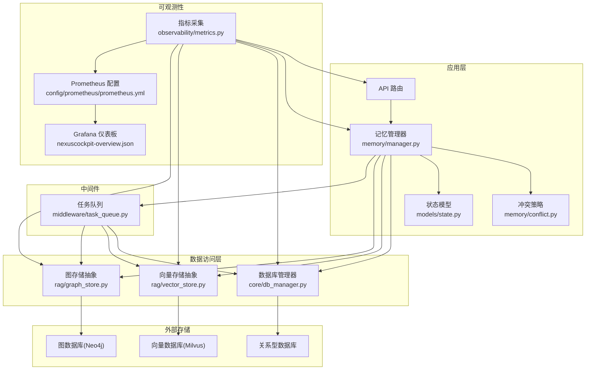
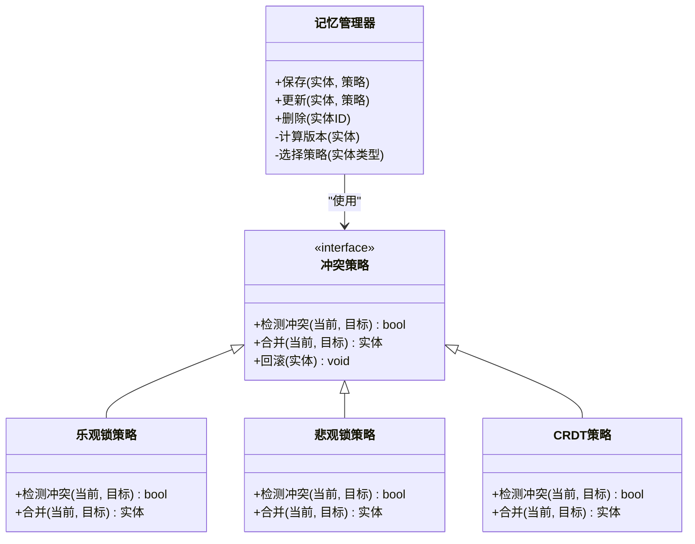
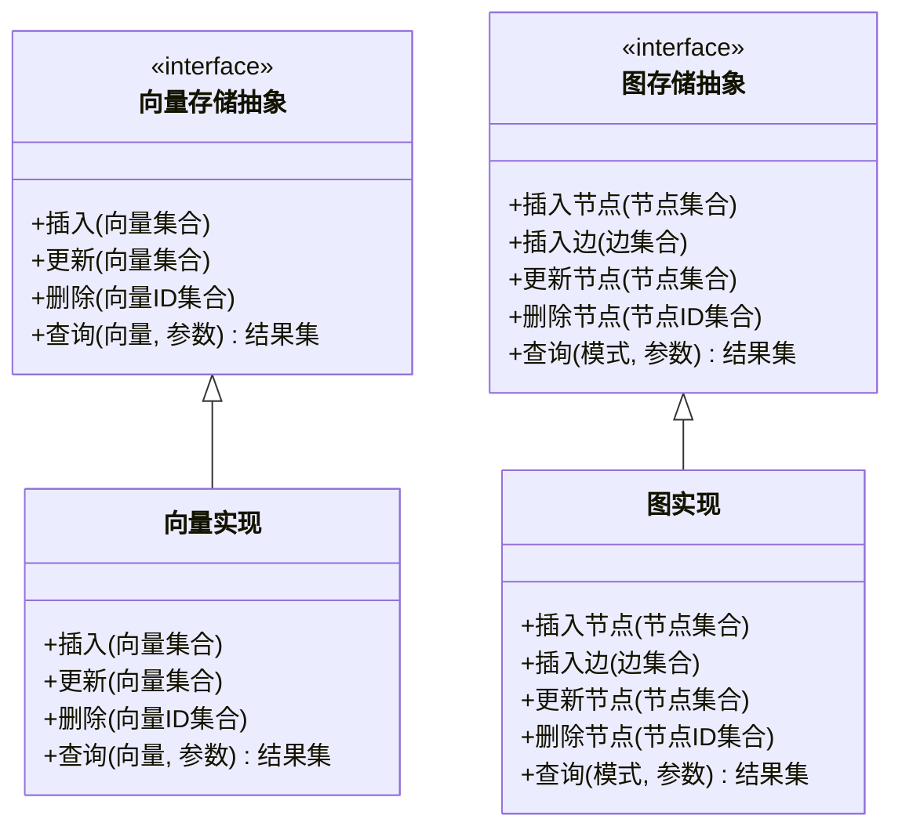
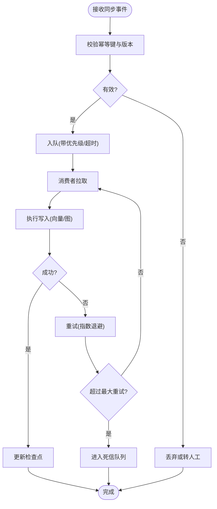
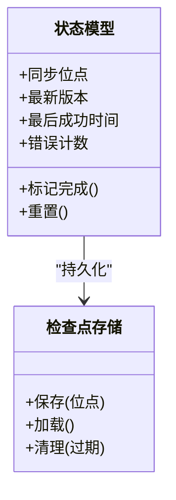
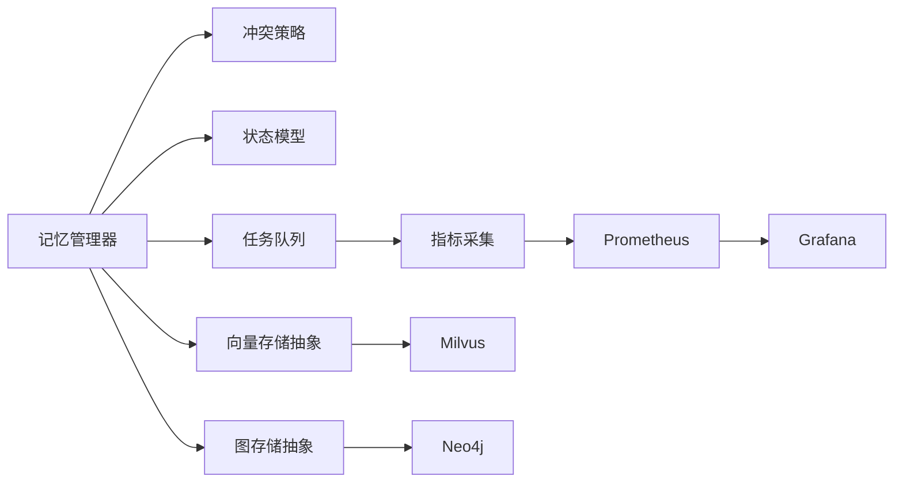

# 数据同步机制

<cite>
**本文引用的文件**   
- [backend_design/nexus/core/db_manager.py](file://backend_design/nexus/core/db_manager.py)
- [backend_design/nexus/memory/manager.py](file://backend_design/nexus/memory/manager.py)
- [backend_design/nexus/memory/conflict.py](file://backend_design/nexus/memory/conflict.py)
- [backend_design/nexus/rag/vector_store.py](file://backend_design/nexus/rag/vector_store.py)
- [backend_design/nexus/rag/graph_store.py](file://backend_design/nexus/rag/graph_store.py)
- [backend_design/nexus/middleware/task_queue.py](file://backend_design/nexus/middleware/task_queue.py)
- [backend_design/nexus/observability/metrics.py](file://backend_design/nexus/observability/metrics.py)
- [backend_design/nexus/config.py](file://backend_design/nexus/config.py)
- [backend_design/nexus/models/state.py](file://backend_design/nexus/models/state.py)
- [backend_design/scripts/init_milvus.py](file://backend_design/scripts/init_milvus.py)
- [backend_design/scripts/init_neo4j.py](file://backend_design/scripts/init_neo4j.py)
- [config/prometheus/prometheus.yml](file://config/prometheus/prometheus.yml)
- [config/grafana/provisioning/dashboards/nexuscockpit-overview.json](file://config/grafana/provisioning/dashboards/nexuscockpit-overview.json)
</cite>

## 目录
1. [简介](#简介)
2. [项目结构](#项目结构)
3. [核心组件](#核心组件)
4. [架构总览](#架构总览)
5. [详细组件分析](#详细组件分析)
6. [依赖关系分析](#依赖关系分析)
7. [性能考量](#性能考量)
8. [故障排查指南](#故障排查指南)
9. [结论](#结论)
10. [附录](#附录)

## 简介
本文件面向NexusCockpit系统的数据同步机制，聚焦多数据库间的一致性保障与事件驱动同步实现。内容覆盖：
- 关系型数据库、向量数据库、图数据库之间的数据一致性策略
- 基于CDC、消息队列与事件溯源的事件驱动同步架构
- 冲突检测与解决（乐观锁、悲观锁、CRDT）的应用场景
- 增量与全量同步的选择标准与权衡
- 同步监控与告警（延迟、重试、人工干预）
- 测试与验证方法（一致性校验、回归测试）

## 项目结构
与数据同步相关的代码主要分布在以下模块：
- 数据访问层：db_manager.py
- 记忆与状态管理：memory/manager.py、memory/conflict.py、models/state.py
- 检索增强生成（RAG）存储抽象与实现：rag/vector_store.py、rag/graph_store.py
- 任务与异步处理：middleware/task_queue.py
- 可观测性指标：observability/metrics.py
- 配置项：config.py
- 初始化脚本：scripts/init_milvus.py、scripts/init_neo4j.py
- 监控与可视化：config/prometheus/prometheus.yml、config/grafana/provisioning/dashboards/nexuscockpit-overview.json



图表来源
- [backend_design/nexus/core/db_manager.py](file://backend_design/nexus/core/db_manager.py)
- [backend_design/nexus/memory/manager.py](file://backend_design/nexus/memory/manager.py)
- [backend_design/nexus/memory/conflict.py](file://backend_design/nexus/memory/conflict.py)
- [backend_design/nexus/rag/vector_store.py](file://backend_design/nexus/rag/vector_store.py)
- [backend_design/nexus/rag/graph_store.py](file://backend_design/nexus/rag/graph_store.py)
- [backend_design/nexus/middleware/task_queue.py](file://backend_design/nexus/middleware/task_queue.py)
- [backend_design/nexus/observability/metrics.py](file://backend_design/nexus/observability/metrics.py)
- [config/prometheus/prometheus.yml](file://config/prometheus/prometheus.yml)
- [config/grafana/provisioning/dashboards/nexuscockpit-overview.json](file://config/grafana/provisioning/dashboards/nexuscockpit-overview.json)

章节来源
- [backend_design/nexus/core/db_manager.py](file://backend_design/nexus/core/db_manager.py)
- [backend_design/nexus/memory/manager.py](file://backend_design/nexus/memory/manager.py)
- [backend_design/nexus/memory/conflict.py](file://backend_design/nexus/memory/conflict.py)
- [backend_design/nexus/rag/vector_store.py](file://backend_design/nexus/rag/vector_store.py)
- [backend_design/nexus/rag/graph_store.py](file://backend_design/nexus/rag/graph_store.py)
- [backend_design/nexus/middleware/task_queue.py](file://backend_design/nexus/middleware/task_queue.py)
- [backend_design/nexus/observability/metrics.py](file://backend_design/nexus/observability/metrics.py)
- [backend_design/nexus/config.py](file://backend_design/nexus/config.py)
- [backend_design/nexus/models/state.py](file://backend_design/nexus/models/state.py)
- [backend_design/scripts/init_milvus.py](file://backend_design/scripts/init_milvus.py)
- [backend_design/scripts/init_neo4j.py](file://backend_design/scripts/init_neo4j.py)
- [config/prometheus/prometheus.yml](file://config/prometheus/prometheus.yml)
- [config/grafana/provisioning/dashboards/nexuscockpit-overview.json](file://config/grafana/provisioning/dashboards/nexuscockpit-overview.json)

## 核心组件
- 数据库管理器（DB Manager）
  - 职责：封装对关系型数据库的读写、事务边界、连接池与错误重试；为上层提供一致的数据访问接口。
  - 关键点：在写入主库后触发后续同步任务；记录关键操作指标。
- 记忆管理器（Memory Manager）
  - 职责：协调关系型、向量、图三类存储的写入顺序与一致性；维护版本/时间戳等元信息；调用冲突策略进行合并或回滚。
  - 关键点：以“写主存（RDB）→ 发布事件 → 异步落盘（向量/图）”的模式保证最终一致性。
- 冲突策略（Conflict Resolver）
  - 职责：提供乐观锁、悲观锁、CRDT等策略的接入点；根据业务语义选择合适策略。
- 存储抽象（Vector Store / Graph Store）
  - 职责：定义统一的写入/更新/删除接口；屏蔽底层Milvus/Neo4j差异；暴露幂等键与版本字段。
- 任务队列（Task Queue）
  - 职责：承载增量同步任务；支持重试、退避、死信队列与监控埋点。
- 指标与可观测性（Metrics）
  - 职责：采集同步延迟、失败率、重试次数、队列积压等指标；对接Prometheus/Grafana。

章节来源
- [backend_design/nexus/core/db_manager.py](file://backend_design/nexus/core/db_manager.py)
- [backend_design/nexus/memory/manager.py](file://backend_design/nexus/memory/manager.py)
- [backend_design/nexus/memory/conflict.py](file://backend_design/nexus/memory/conflict.py)
- [backend_design/nexus/rag/vector_store.py](file://backend_design/nexus/rag/vector_store.py)
- [backend_design/nexus/rag/graph_store.py](file://backend_design/nexus/rag/graph_store.py)
- [backend_design/nexus/middleware/task_queue.py](file://backend_design/nexus/middleware/task_queue.py)
- [backend_design/nexus/observability/metrics.py](file://backend_design/nexus/observability/metrics.py)

## 架构总览
整体采用“事件驱动 + 最终一致性”的架构：
- 主数据源为关系型数据库，所有变更先持久化到RDB。
- 通过CDC捕获RDB变更，转换为领域事件并投递至消息队列。
- 消费者按序消费事件，分别写入向量数据库与图数据库，确保幂等与去重。
- 使用检查点（checkpoint）与版本字段保证断点续传与重复消费安全。
- 指标与告警贯穿全流程，便于定位瓶颈与异常。

```mermaid
sequenceDiagram
participant Client as "客户端"
participant API as "API 服务"
participant DB as "关系型数据库"
participant CDC as "CDC 监听器"
participant MQ as "消息队列"
participant Worker as "同步工作者"
participant VStore as "向量存储"
participant GStore as "图存储"
participant Obs as "指标采集"
Client->>API : "提交数据变更"
API->>DB : "写入主库(事务)"
DB-->>API : "返回成功"
API-->>Client : "响应成功"
CDC->>DB : "读取变更日志"
CDC->>MQ : "投递事件(幂等键+版本)"
MQ-->>Worker : "拉取事件"
Worker->>VStore : "增量写入/更新(幂等)"
Worker->>GStore : "增量写入/更新(幂等)"
Worker->>Obs : "上报延迟/失败/重试"
Note over Worker,VStore,GStore : "最终一致性达成"
```

图表来源
- [backend_design/nexus/core/db_manager.py](file://backend_design/nexus/core/db_manager.py)
- [backend_design/nexus/memory/manager.py](file://backend_design/nexus/memory/manager.py)
- [backend_design/nexus/rag/vector_store.py](file://backend_design/nexus/rag/vector_store.py)
- [backend_design/nexus/rag/graph_store.py](file://backend_design/nexus/rag/graph_store.py)
- [backend_design/nexus/middleware/task_queue.py](file://backend_design/nexus/middleware/task_queue.py)
- [backend_design/nexus/observability/metrics.py](file://backend_design/nexus/observability/metrics.py)

## 详细组件分析

### 组件A：记忆管理器与冲突策略
- 设计要点
  - 统一入口：对外暴露“保存/更新/删除”记忆的统一接口，内部协调RDB、向量、图三端。
  - 版本控制：每条记录携带版本号/时间戳，用于冲突检测与幂等写入。
  - 策略选择：根据实体类型与并发特征选择乐观锁、悲观锁或CRDT。
- 类关系示意



图表来源
- [backend_design/nexus/memory/manager.py](file://backend_design/nexus/memory/manager.py)
- [backend_design/nexus/memory/conflict.py](file://backend_design/nexus/memory/conflict.py)

章节来源
- [backend_design/nexus/memory/manager.py](file://backend_design/nexus/memory/manager.py)
- [backend_design/nexus/memory/conflict.py](file://backend_design/nexus/memory/conflict.py)

### 组件B：向量与图存储抽象
- 设计要点
  - 统一接口：定义增删改查与批量操作的抽象，屏蔽底层差异。
  - 幂等键：要求每个文档/节点具备唯一标识，避免重复写入。
  - 索引与分片：向量化与图遍历的性能优化由具体实现负责。
- 类关系示意



图表来源
- [backend_design/nexus/rag/vector_store.py](file://backend_design/nexus/rag/vector_store.py)
- [backend_design/nexus/rag/graph_store.py](file://backend_design/nexus/rag/graph_store.py)

章节来源
- [backend_design/nexus/rag/vector_store.py](file://backend_design/nexus/rag/vector_store.py)
- [backend_design/nexus/rag/graph_store.py](file://backend_design/nexus/rag/graph_store.py)

### 组件C：任务队列与重试
- 设计要点
  - 任务模型：包含幂等键、版本号、重试次数、超时、优先级等。
  - 重试与退避：指数退避、最大重试次数、死信队列。
  - 监控埋点：任务入队/出队耗时、失败原因分布、堆积长度。
- 流程图



图表来源
- [backend_design/nexus/middleware/task_queue.py](file://backend_design/nexus/middleware/task_queue.py)
- [backend_design/nexus/observability/metrics.py](file://backend_design/nexus/observability/metrics.py)

章节来源
- [backend_design/nexus/middleware/task_queue.py](file://backend_design/nexus/middleware/task_queue.py)
- [backend_design/nexus/observability/metrics.py](file://backend_design/nexus/observability/metrics.py)

### 组件D：状态与检查点
- 设计要点
  - 状态模型：记录各存储的同步位点、版本、最后成功时间等。
  - 检查点：持久化消费位点，支持重启恢复与断点续传。
- 类关系示意



图表来源
- [backend_design/nexus/models/state.py](file://backend_design/nexus/models/state.py)

章节来源
- [backend_design/nexus/models/state.py](file://backend_design/nexus/models/state.py)

## 依赖关系分析
- 耦合与内聚
  - 记忆管理器对内聚了冲突策略与状态模型，降低上层复杂度。
  - 存储抽象将RDB、向量、图解耦，便于替换实现。
- 直接/间接依赖
  - 任务队列依赖指标采集；存储实现依赖各自SDK；CDC与消息队列为外部依赖。
- 循环依赖
  - 通过接口与事件解耦，避免循环引用。
- 外部集成点
  - Milvus（向量）、Neo4j（图）、关系型数据库、消息队列、Prometheus/Grafana。



图表来源
- [backend_design/nexus/memory/manager.py](file://backend_design/nexus/memory/manager.py)
- [backend_design/nexus/memory/conflict.py](file://backend_design/nexus/memory/conflict.py)
- [backend_design/nexus/models/state.py](file://backend_design/nexus/models/state.py)
- [backend_design/nexus/rag/vector_store.py](file://backend_design/nexus/rag/vector_store.py)
- [backend_design/nexus/rag/graph_store.py](file://backend_design/nexus/rag/graph_store.py)
- [backend_design/nexus/middleware/task_queue.py](file://backend_design/nexus/middleware/task_queue.py)
- [backend_design/nexus/observability/metrics.py](file://backend_design/nexus/observability/metrics.py)
- [config/prometheus/prometheus.yml](file://config/prometheus/prometheus.yml)
- [config/grafana/provisioning/dashboards/nexuscockpit-overview.json](file://config/grafana/provisioning/dashboards/nexuscockpit-overview.json)

章节来源
- [backend_design/nexus/memory/manager.py](file://backend_design/nexus/memory/manager.py)
- [backend_design/nexus/memory/conflict.py](file://backend_design/nexus/memory/conflict.py)
- [backend_design/nexus/models/state.py](file://backend_design/nexus/models/state.py)
- [backend_design/nexus/rag/vector_store.py](file://backend_design/nexus/rag/vector_store.py)
- [backend_design/nexus/rag/graph_store.py](file://backend_design/nexus/rag/graph_store.py)
- [backend_design/nexus/middleware/task_queue.py](file://backend_design/nexus/middleware/task_queue.py)
- [backend_design/nexus/observability/metrics.py](file://backend_design/nexus/observability/metrics.py)
- [config/prometheus/prometheus.yml](file://config/prometheus/prometheus.yml)
- [config/grafana/provisioning/dashboards/nexuscockpit-overview.json](file://config/grafana/provisioning/dashboards/nexuscockpit-overview.json)

## 性能考量
- 写入路径
  - 主库写入优先，异步落盘向量/图，降低请求尾延迟。
  - 批量写入与流式处理结合，减少网络往返。
- 索引与分片
  - 向量维度与相似度算法需与查询负载匹配；图数据库按需构建索引。
- 背压与限流
  - 队列容量上限、消费者并行度、速率限制，防止雪崩。
- 资源隔离
  - 不同存储的写入通道隔离，避免相互影响。
- 缓存与热点
  - 热点实体可短期缓存，但需考虑失效策略与一致性窗口。

[本节为通用指导，不直接分析具体文件]

## 故障排查指南
- 常见问题
  - 同步延迟升高：检查队列堆积、消费者CPU/IO、下游存储慢查询。
  - 重复写入：确认幂等键与版本字段是否正确设置。
  - 数据不一致：核对检查点位点、重试次数与死信队列。
- 定位手段
  - 查看指标面板（延迟、失败率、重试、堆积）。
  - 追踪事件链路（幂等键、版本号、时间戳）。
  - 回放死信任务进行复现。
- 恢复流程
  - 修正配置/数据后，从最近检查点恢复消费。
  - 必要时执行补偿任务或全量重建。

章节来源
- [backend_design/nexus/observability/metrics.py](file://backend_design/nexus/observability/metrics.py)
- [backend_design/nexus/middleware/task_queue.py](file://backend_design/nexus/middleware/task_queue.py)
- [config/grafana/provisioning/dashboards/nexuscockpit-overview.json](file://config/grafana/provisioning/dashboards/nexuscockpit-overview.json)

## 结论
NexusCockpit采用事件驱动的异步同步架构，以关系型数据库为主数据源，通过CDC与消息队列将变更传播至向量与图数据库，配合幂等键、版本控制与检查点实现最终一致性。通过冲突策略与任务重试机制提升鲁棒性，并以指标与可视化保障可观测性。建议在大规模场景下结合增量/全量策略与资源隔离，持续优化延迟与吞吐。

[本节为总结，不直接分析具体文件]

## 附录

### 事件驱动同步与CDC说明
- CDC监听关系型数据库变更日志，解析为领域事件并投递至消息队列。
- 消费者按幂等键与版本进行去重与排序，确保有序与幂等。
- 事件溯源：关键变更事件持久化，支持审计与回溯。

章节来源
- [backend_design/nexus/core/db_manager.py](file://backend_design/nexus/core/db_manager.py)
- [backend_design/nexus/middleware/task_queue.py](file://backend_design/nexus/middleware/task_queue.py)

### 冲突检测与解决策略
- 乐观锁：适用于低冲突场景，通过版本号比较快速失败并重试。
- 悲观锁：适用于高冲突场景，写入前加锁，避免竞争。
- CRDT：适用于分布式无中心合并场景，如偏好、计数等可交换操作。

章节来源
- [backend_design/nexus/memory/conflict.py](file://backend_design/nexus/memory/conflict.py)

### 增量与全量同步选择标准
- 增量同步
  - 适用：高频小变更、实时性要求高、数据量大。
  - 注意：需保证事件有序与幂等。
- 全量同步
  - 适用：冷启动、数据修复、重大结构变更。
  - 注意：分批与限速，避免冲击下游。
- 评估维度
  - 数据量、变更频率、一致性窗口、下游容量、业务容忍度。

章节来源
- [backend_design/nexus/config.py](file://backend_design/nexus/config.py)
- [backend_design/nexus/models/state.py](file://backend_design/nexus/models/state.py)

### 监控与告警
- 指标
  - 同步延迟（P50/P95/P99）、失败率、重试次数、队列长度、存储写入耗时。
- 告警规则
  - 延迟阈值、失败率突增、死信队列增长、存储不可用。
- 可视化
  - Prometheus抓取指标，Grafana展示概览与详情。

章节来源
- [backend_design/nexus/observability/metrics.py](file://backend_design/nexus/observability/metrics.py)
- [config/prometheus/prometheus.yml](file://config/prometheus/prometheus.yml)
- [config/grafana/provisioning/dashboards/nexuscockpit-overview.json](file://config/grafana/provisioning/dashboards/nexuscockpit-overview.json)

### 测试与验证方法
- 一致性校验
  - 抽样比对RDB与向量/图的关键字段与数量。
  - 端到端回放：从检查点回放事件，验证最终状态。
- 回归测试
  - 模拟冲突、重试、死信、存储降级等场景。
- 初始化脚本
  - 使用脚本初始化Milvus/Neo4j环境，便于本地复现。

章节来源
- [backend_design/scripts/init_milvus.py](file://backend_design/scripts/init_milvus.py)
- [backend_design/scripts/init_neo4j.py](file://backend_design/scripts/init_neo4j.py)