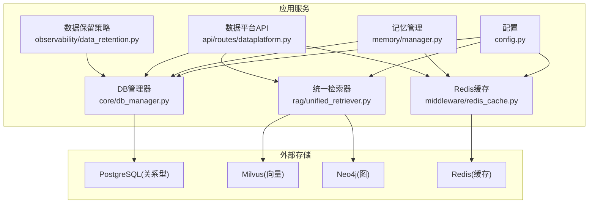
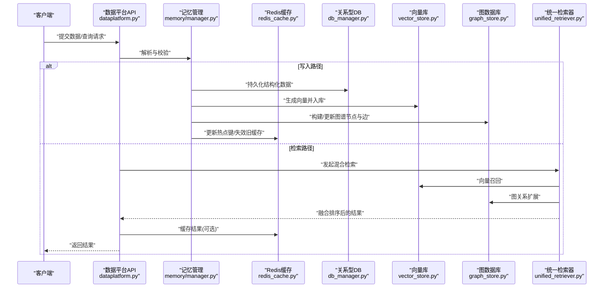
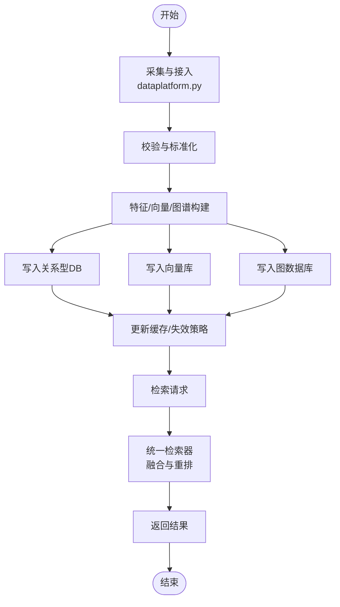
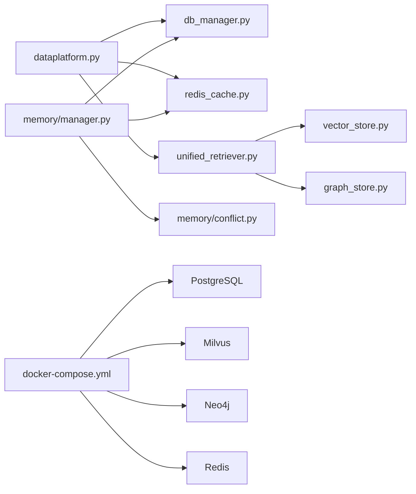

# 数据架构

<cite>
**本文引用的文件**   
- [backend_design/nexus/config.py](file://backend_design/nexus/config.py)
- [backend_design/nexus/core/db_manager.py](file://backend_design/nexus/core/db_manager.py)
- [backend_design/nexus/middleware/redis_cache.py](file://backend_design/nexus/middleware/redis_cache.py)
- [backend_design/nexus/memory/manager.py](file://backend_design/nexus/memory/manager.py)
- [backend_design/nexus/memory/conflict.py](file://backend_design/nexus/memory/conflict.py)
- [backend_design/nexus/rag/vector_store.py](file://backend_design/nexus/rag/vector_store.py)
- [backend_design/nexus/rag/zilliz_vector_store.py](file://backend_design/nexus/rag/zilliz_vector_store.py)
- [backend_design/nexus/rag/graph_store.py](file://backend_design/nexus/rag/graph_store.py)
- [backend_design/nexus/rag/aura_graph_store.py](file://backend_design/nexus/rag/aura_graph_store.py)
- [backend_design/nexus/rag/unified_retriever.py](file://backend_design/nexus/rag/unified_retriever.py)
- [backend_design/nexus/api/routes/dataplatform.py](file://backend_design/nexus/api/routes/dataplatform.py)
- [backend_design/nexus/observability/data_retention.py](file://backend_design/nexus/observability/data_retention.py)
- [backend_design/scripts/init_milvus.py](file://backend_design/scripts/init_milvus.py)
- [backend_design/scripts/init_neo4j.py](file://backend_design/scripts/init_neo4j.py)
- [docker-compose.yml](file://docker-compose.yml)
</cite>

## 目录
1. [引言](#引言)
2. [项目结构](#项目结构)
3. [核心组件](#核心组件)
4. [架构总览](#架构总览)
5. [详细组件分析](#详细组件分析)
6. [依赖关系分析](#依赖关系分析)
7. [性能考量](#性能考量)
8. [故障排查指南](#故障排查指南)
9. [结论](#结论)
10. [附录](#附录)

## 引言
本数据架构文档面向NexusCockpit系统，聚焦多模态数据存储策略与数据流设计。系统采用“关系型数据库(PostgreSQL)+向量数据库(Milvus)+图数据库(Neo4j)+缓存(Redis)”的多库协同方案，以支撑对话、知识检索、车辆控制与个性化记忆等场景。文档覆盖：
- 存储选型与使用场景
- 一致性模型权衡（强一致、最终一致、分区容忍）
- 数据采集、处理、存储与检索的端到端链路
- 主从复制、增量同步与冲突解决策略
- 备份与灾难恢复方案
- 数据安全与隐私保护设计

## 项目结构
后端代码位于 backend_design/nexus 下，数据相关能力主要分布在以下模块：
- 配置与连接管理：config.py、core/db_manager.py
- 缓存中间件：middleware/redis_cache.py
- 记忆与冲突：memory/manager.py、memory/conflict.py
- RAG检索层：rag/*（向量、图、统一检索器）
- 数据平台API：api/routes/dataplatform.py
- 可观测性与生命周期：observability/data_retention.py
- 初始化脚本：scripts/init_milvus.py、scripts/init_neo4j.py
- 容器编排：docker-compose.yml

图表来源
- [backend_design/nexus/config.py](file://backend_design/nexus/config.py)
- [backend_design/nexus/core/db_manager.py](file://backend_design/nexus/core/db_manager.py)
- [backend_design/nexus/middleware/redis_cache.py](file://backend_design/nexus/middleware/redis_cache.py)
- [backend_design/nexus/memory/manager.py](file://backend_design/nexus/memory/manager.py)
- [backend_design/nexus/rag/unified_retriever.py](file://backend_design/nexus/rag/unified_retriever.py)
- [backend_design/nexus/api/routes/dataplatform.py](file://backend_design/nexus/api/routes/dataplatform.py)
- [backend_design/nexus/observability/data_retention.py](file://backend_design/nexus/observability/data_retention.py)

章节来源
- [backend_design/nexus/config.py](file://backend_design/nexus/config.py)
- [backend_design/nexus/core/db_manager.py](file://backend_design/nexus/core/db_manager.py)
- [backend_design/nexus/middleware/redis_cache.py](file://backend_design/nexus/middleware/redis_cache.py)
- [backend_design/nexus/memory/manager.py](file://backend_design/nexus/memory/manager.py)
- [backend_design/nexus/rag/unified_retriever.py](file://backend_design/nexus/rag/unified_retriever.py)
- [backend_design/nexus/api/routes/dataplatform.py](file://backend_design/nexus/api/routes/dataplatform.py)
- [backend_design/nexus/observability/data_retention.py](file://backend_design/nexus/observability/data_retention.py)
- [docker-compose.yml](file://docker-compose.yml)

## 核心组件
- 配置中心(config.py)
  - 集中管理各存储的连接参数、超时、重试与特性开关，为DB、Redis、向量与图存储提供统一入口。
- 关系型数据库管理器(core/db_manager.py)
  - 封装连接池、事务边界、SQL执行与错误重试；承载用户、会话、技能状态、偏好等结构化数据。
- Redis缓存(middleware/redis_cache.py)
  - 提供会话上下文、热点结果、限流计数、分布式锁等能力，降低数据库压力并提升响应时延。
- 记忆管理(memory/manager.py, memory/conflict.py)
  - 负责长期记忆的读写、更新与冲突合并；结合缓存加速读取，持久化到关系型或图/向量存储。
- 检索层(rag/*)
  - 向量检索(vector_store.py, zilliz_vector_store.py)：面向语义相似度召回，用于RAG片段匹配。
  - 图检索(graph_store.py, aura_graph_store.py)：面向实体关系推理，用于复杂查询与路径发现。
  - 统一检索器(unified_retriever.py)：融合向量与图结果，进行重排与去重，输出最终候选集。
- 数据平台API(api/routes/dataplatform.py)
  - 暴露数据导入、导出、索引重建、元数据管理等接口，驱动批量与增量任务。
- 数据保留策略(observability/data_retention.py)
  - 定义数据生命周期、归档与清理策略，配合定时任务实现合规与成本优化。

章节来源
- [backend_design/nexus/config.py](file://backend_design/nexus/config.py)
- [backend_design/nexus/core/db_manager.py](file://backend_design/nexus/core/db_manager.py)
- [backend_design/nexus/middleware/redis_cache.py](file://backend_design/nexus/middleware/redis_cache.py)
- [backend_design/nexus/memory/manager.py](file://backend_design/nexus/memory/manager.py)
- [backend_design/nexus/memory/conflict.py](file://backend_design/nexus/memory/conflict.py)
- [backend_design/nexus/rag/vector_store.py](file://backend_design/nexus/rag/vector_store.py)
- [backend_design/nexus/rag/zilliz_vector_store.py](file://backend_design/nexus/rag/zilliz_vector_store.py)
- [backend_design/nexus/rag/graph_store.py](file://backend_design/nexus/rag/graph_store.py)
- [backend_design/nexus/rag/aura_graph_store.py](file://backend_design/nexus/rag/aura_graph_store.py)
- [backend_design/nexus/rag/unified_retriever.py](file://backend_design/nexus/rag/unified_retriever.py)
- [backend_design/nexus/api/routes/dataplatform.py](file://backend_design/nexus/api/routes/dataplatform.py)
- [backend_design/nexus/observability/data_retention.py](file://backend_design/nexus/observability/data_retention.py)

## 架构总览
下图展示多模态数据在系统中的流转：采集→预处理→写入多库→缓存→检索→返回。

图表来源
- [backend_design/nexus/api/routes/dataplatform.py](file://backend_design/nexus/api/routes/dataplatform.py)
- [backend_design/nexus/memory/manager.py](file://backend_design/nexus/memory/manager.py)
- [backend_design/nexus/middleware/redis_cache.py](file://backend_design/nexus/middleware/redis_cache.py)
- [backend_design/nexus/core/db_manager.py](file://backend_design/nexus/core/db_manager.py)
- [backend_design/nexus/rag/vector_store.py](file://backend_design/nexus/rag/vector_store.py)
- [backend_design/nexus/rag/graph_store.py](file://backend_design/nexus/rag/graph_store.py)
- [backend_design/nexus/rag/unified_retriever.py](file://backend_design/nexus/rag/unified_retriever.py)

## 详细组件分析

### 多模态存储选型与使用场景
- PostgreSQL(关系型)
  - 用途：用户、会话、权限、技能状态、业务元数据等强一致需求的数据。
  - 特点：ACID事务、复杂查询、JSONB支持灵活字段。
- Milvus(向量)
  - 用途：文本/语音/图像等多模态嵌入的相似度检索，支撑RAG召回。
  - 特点：高维向量索引、近似最近邻搜索、可扩展集群。
- Neo4j(图)
  - 用途：实体关系建模、路径推理、知识图谱问答与推荐。
  - 特点：原生图存储、Cypher查询、高效邻居遍历。
- Redis(缓存)
  - 用途：会话上下文、热点结果、限流计数、分布式锁、短期记忆。
  - 特点：低延迟、原子操作、丰富的数据结构。

章节来源
- [backend_design/nexus/config.py](file://backend_design/nexus/config.py)
- [backend_design/nexus/core/db_manager.py](file://backend_design/nexus/core/db_manager.py)
- [backend_design/nexus/middleware/redis_cache.py](file://backend_design/nexus/middleware/redis_cache.py)
- [backend_design/nexus/rag/vector_store.py](file://backend_design/nexus/rag/vector_store.py)
- [backend_design/nexus/rag/zilliz_vector_store.py](file://backend_design/nexus/rag/zilliz_vector_store.py)
- [backend_design/nexus/rag/graph_store.py](file://backend_design/nexus/rag/graph_store.py)
- [backend_design/nexus/rag/aura_graph_store.py](file://backend_design/nexus/rag/aura_graph_store.py)

### 一致性模型与权衡
- 强一致性
  - 适用：账户余额、权限变更、关键会话状态等。
  - 机制：通过关系型数据库事务保证；写路径串行化或两阶段提交。
- 最终一致性
  - 适用：向量索引、图索引、统计指标、日志与审计。
  - 机制：异步写入+补偿任务；允许短暂不一致但具备自愈能力。
- 分区容忍性
  - 适用：跨地域部署、网络抖动场景。
  - 机制：分片/副本、幂等写入、冲突检测与合并。

章节来源
- [backend_design/nexus/core/db_manager.py](file://backend_design/nexus/core/db_manager.py)
- [backend_design/nexus/memory/conflict.py](file://backend_design/nexus/memory/conflict.py)

### 数据流架构：采集-处理-存储-检索
- 采集
  - 来源：用户输入、设备遥测、第三方数据源。
  - 入口：数据平台API(dataplatform.py)。
- 处理
  - 清洗、标准化、特征提取、向量化、图谱构建。
  - 记忆管理(memory/manager.py)协调多库写入与缓存更新。
- 存储
  - 结构化数据→PostgreSQL；向量→Milvus；关系→Neo4j；热数据→Redis。
- 检索
  - 统一检索器(unified_retriever.py)融合向量与图结果，重排后返回。

图表来源
- [backend_design/nexus/api/routes/dataplatform.py](file://backend_design/nexus/api/routes/dataplatform.py)
- [backend_design/nexus/memory/manager.py](file://backend_design/nexus/memory/manager.py)
- [backend_design/nexus/rag/unified_retriever.py](file://backend_design/nexus/rag/unified_retriever.py)

### 数据同步机制
- 主从复制
  - 关系型：基于PostgreSQL主从复制，读扩展与容灾。
  - 向量/图：按各自生态的主从/副本模式配置。
- 增量同步
  - 基于时间戳/版本号/变更事件(CDC)的增量拉取或推送。
  - 记忆管理结合冲突检测(memory/conflict.py)进行合并。
- 冲突解决
  - 策略：最后写入胜出(LWW)、业务规则合并、人工仲裁。
  - 幂等：所有写入接口需支持幂等，避免重复导致数据漂移。

章节来源
- [backend_design/nexus/memory/manager.py](file://backend_design/nexus/memory/manager.py)
- [backend_design/nexus/memory/conflict.py](file://backend_design/nexus/memory/conflict.py)

### 备份与灾难恢复
- 定期备份
  - 关系型：逻辑/物理备份快照，保留周期按合规要求配置。
  - 向量/图：按厂商工具进行快照或导出。
- 异地容灾
  - 跨区域复制与独立可用区部署，确保单点故障不影响整体可用性。
- 恢复流程
  - 演练：定期恢复演练验证RTO/RPO。
  - 回滚：版本化迁移脚本与回滚策略。

章节来源
- [backend_design/nexus/observability/data_retention.py](file://backend_design/nexus/observability/data_retention.py)
- [docker-compose.yml](file://docker-compose.yml)

### 数据安全与隐私保护
- 传输加密
  - 全链路TLS，网关与服务间mTLS。
- 静态加密
  - 磁盘级加密与敏感字段加密存储。
- 访问控制
  - RBAC/ABAC，最小权限原则，租户隔离。
- 审计日志
  - 关键操作留痕，不可篡改，集中收集与分析。

章节来源
- [backend_design/nexus/config.py](file://backend_design/nexus/config.py)
- [backend_design/nexus/api/routes/dataplatform.py](file://backend_design/nexus/api/routes/dataplatform.py)

## 依赖关系分析
- 组件耦合
  - dataplatform.py 依赖 db_manager.py、redis_cache.py、unified_retriever.py。
  - unified_retriever.py 依赖 vector_store.py、graph_store.py。
  - memory/manager.py 依赖 db_manager.py、redis_cache.py 及冲突模块。
- 外部依赖
  - docker-compose.yml 编排PG、Milvus、Neo4j、Redis等服务。
  - init_milvus.py、init_neo4j.py 提供初始化与校验脚本。

图表来源
- [backend_design/nexus/api/routes/dataplatform.py](file://backend_design/nexus/api/routes/dataplatform.py)
- [backend_design/nexus/core/db_manager.py](file://backend_design/nexus/core/db_manager.py)
- [backend_design/nexus/middleware/redis_cache.py](file://backend_design/nexus/middleware/redis_cache.py)
- [backend_design/nexus/rag/unified_retriever.py](file://backend_design/nexus/rag/unified_retriever.py)
- [backend_design/nexus/rag/vector_store.py](file://backend_design/nexus/rag/vector_store.py)
- [backend_design/nexus/rag/graph_store.py](file://backend_design/nexus/rag/graph_store.py)
- [backend_design/nexus/memory/manager.py](file://backend_design/nexus/memory/manager.py)
- [backend_design/nexus/memory/conflict.py](file://backend_design/nexus/memory/conflict.py)
- [docker-compose.yml](file://docker-compose.yml)

章节来源
- [backend_design/nexus/api/routes/dataplatform.py](file://backend_design/nexus/api/routes/dataplatform.py)
- [backend_design/nexus/core/db_manager.py](file://backend_design/nexus/core/db_manager.py)
- [backend_design/nexus/middleware/redis_cache.py](file://backend_design/nexus/middleware/redis_cache.py)
- [backend_design/nexus/rag/unified_retriever.py](file://backend_design/nexus/rag/unified_retriever.py)
- [backend_design/nexus/rag/vector_store.py](file://backend_design/nexus/rag/vector_store.py)
- [backend_design/nexus/rag/graph_store.py](file://backend_design/nexus/rag/graph_store.py)
- [backend_design/nexus/memory/manager.py](file://backend_design/nexus/memory/manager.py)
- [backend_design/nexus/memory/conflict.py](file://backend_design/nexus/memory/conflict.py)
- [docker-compose.yml](file://docker-compose.yml)

## 性能考量
- 缓存命中优先
  - 热点数据走Redis，减少DB与向量/图库压力。
- 批量与异步
  - 批量写入与异步索引构建，削峰填谷。
- 索引与分片
  - 合理设置向量维度与索引类型；图数据库按需创建索引；关系型表分区与复合索引。
- 连接池与超时
  - 根据QPS与RT调优连接池大小、超时与重试退避。
- 降级与熔断
  - 非关键路径失败快速失败，保障核心链路可用。

[本节为通用指导，不直接分析具体文件]

## 故障排查指南
- 常见问题定位
  - 连接失败：检查配置与网络连通性。
  - 索引异常：核对向量维度、数据类型与索引参数。
  - 缓存不一致：确认失效策略与并发写入幂等性。
  - 图查询慢：检查节点度分布与必要索引。
- 诊断手段
  - 启用可观测性指标与日志，追踪端到端耗时。
  - 使用初始化脚本校验环境健康。

章节来源
- [backend_design/nexus/config.py](file://backend_design/nexus/config.py)
- [backend_design/nexus/core/db_manager.py](file://backend_design/nexus/core/db_manager.py)
- [backend_design/nexus/middleware/redis_cache.py](file://backend_design/nexus/middleware/redis_cache.py)
- [backend_design/nexus/rag/vector_store.py](file://backend_design/nexus/rag/vector_store.py)
- [backend_design/nexus/rag/graph_store.py](file://backend_design/nexus/rag/graph_store.py)
- [backend_design/scripts/init_milvus.py](file://backend_design/scripts/init_milvus.py)
- [backend_design/scripts/init_neo4j.py](file://backend_design/scripts/init_neo4j.py)

## 结论
NexusCockpit采用多库协同的数据架构，兼顾强一致与高性能检索。通过统一的配置与检索层，系统在可扩展性、可靠性与安全性方面形成闭环。建议在生产环境完善监控告警、定期演练恢复流程，并持续优化索引与缓存策略。

[本节为总结性内容，不直接分析具体文件]

## 附录
- 初始化与环境准备
  - 向量库初始化脚本：init_milvus.py
  - 图数据库初始化脚本：init_neo4j.py
  - 容器编排：docker-compose.yml

章节来源
- [backend_design/scripts/init_milvus.py](file://backend_design/scripts/init_milvus.py)
- [backend_design/scripts/init_neo4j.py](file://backend_design/scripts/init_neo4j.py)
- [docker-compose.yml](file://docker-compose.yml)