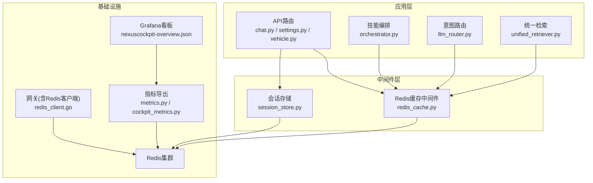
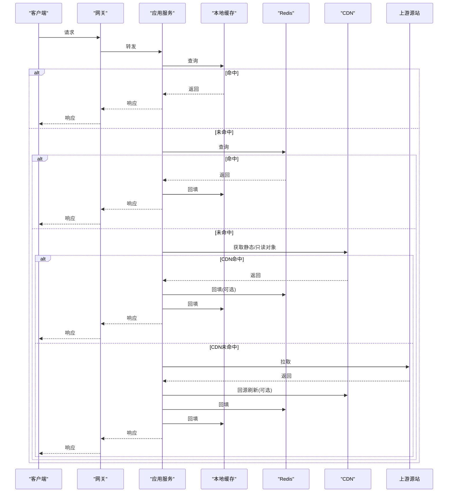
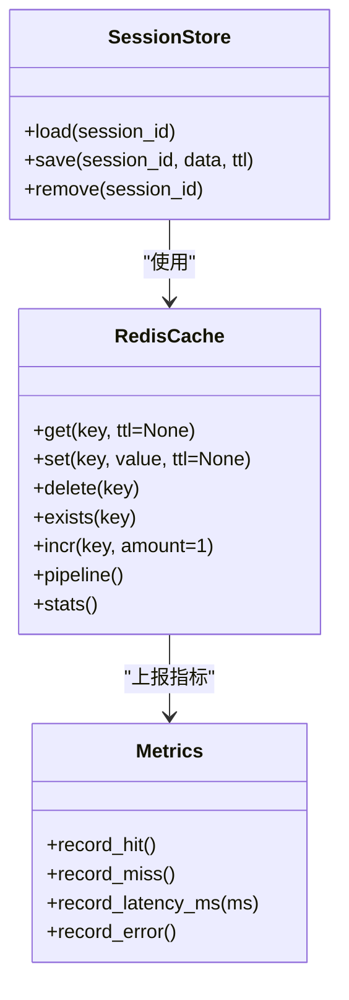
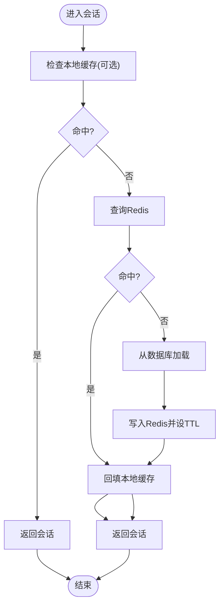
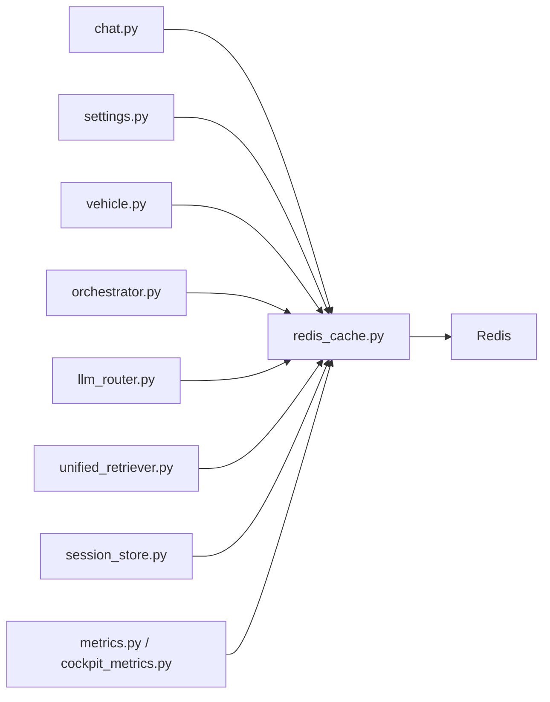

# 缓存策略设计

<cite>
**本文引用的文件**   
- [backend_design/nexus/middleware/redis_cache.py](file://backend_design/nexus/middleware/redis_cache.py)
- [backend_design/nexus/middleware/session_store.py](file://backend_design/nexus/middleware/session_store.py)
- [backend_design/nexus/core/circuit_breaker.py](file://backend_design/nexus/core/circuit_breaker.py)
- [backend_design/nexus/observability/cockpit_metrics.py](file://backend_design/nexus/observability/cockpit_metrics.py)
- [backend_design/nexus/observability/metrics.py](file://backend_design/nexus/observability/metrics.py)
- [backend_design/nexus/api/routes/chat.py](file://backend_design/nexus/api/routes/chat.py)
- [backend_design/nexus/api/routes/settings.py](file://backend_design/nexus/api/routes/settings.py)
- [backend_design/nexus/api/routes/vehicle.py](file://backend_design/nexus/api/routes/vehicle.py)
- [backend_design/nexus/models/schemas.py](file://backend_design/nexus/models/schemas.py)
- [backend_design/nexus/models/state.py](file://backend_design/nexus/models/state.py)
- [backend_design/nexus/intent/llm_router.py](file://backend_design/nexus/intent/llm_router.py)
- [backend_design/nexus/skills/orchestrator.py](file://backend_design/nexus/skills/orchestrator.py)
- [backend_design/nexus/rag/unified_retriever.py](file://backend_design/nexus/rag/unified_retriever.py)
- [backend_design/nexus_gate/internal/handlers/redis_client.go](file://backend_design/nexus_gate/internal/handlers/redis_client.go)
- [config/grafana/provisioning/dashboards/nexuscockpit-overview.json](file://config/grafana/provisioning/dashboards/nexuscockpit-overview.json)
</cite>

## 目录
1. [引言](#引言)
2. [项目结构](#项目结构)
3. [核心组件](#核心组件)
4. [架构总览](#架构总览)
5. [详细组件分析](#详细组件分析)
6. [依赖分析](#依赖分析)
7. [性能考虑](#性能考虑)
8. [故障排查指南](#故障排查指南)
9. [结论](#结论)
10. [附录](#附录)

## 引言
本设计文档面向NexusCockpit系统的缓存策略，目标是构建一套“本地缓存 + 分布式缓存（Redis）+ CDN”的多层缓存体系，覆盖用户偏好、会话状态、车辆状态与AI响应等关键数据域。文档将阐述：
- 多层缓存协同机制与分层职责
- 缓存数据模型设计与命名规范
- 更新策略（写穿透、写回、懒加载）的适用场景与实现要点
- 失效机制（TTL、主动失效、一致性哈希）
- 监控指标与优化建议
- 降级与容错（雪崩防护、熔断）

## 项目结构
后端Python服务中已存在Redis中间件与会话存储模块；网关Go侧提供Redis客户端能力；可观测性模块暴露指标；API路由层涉及聊天、设置、车辆等热点接口；模型定义包含会话与状态结构。这些为多层缓存落地提供了基础。

图表来源
- [backend_design/nexus/middleware/redis_cache.py](file://backend_design/nexus/middleware/redis_cache.py)
- [backend_design/nexus/middleware/session_store.py](file://backend_design/nexus/middleware/session_store.py)
- [backend_design/nexus/observability/metrics.py](file://backend_design/nexus/observability/metrics.py)
- [backend_design/nexus/observability/cockpit_metrics.py](file://backend_design/nexus/observability/cockpit_metrics.py)
- [backend_design/nexus_gate/internal/handlers/redis_client.go](file://backend_design/nexus_gate/internal/handlers/redis_client.go)
- [config/grafana/provisioning/dashboards/nexuscockpit-overview.json](file://config/grafana/provisioning/dashboards/nexuscockpit-overview.json)

章节来源
- [backend_design/nexus/middleware/redis_cache.py](file://backend_design/nexus/middleware/redis_cache.py)
- [backend_design/nexus/middleware/session_store.py](file://backend_design/nexus/middleware/session_store.py)
- [backend_design/nexus/observability/metrics.py](file://backend_design/nexus/observability/metrics.py)
- [backend_design/nexus/observability/cockpit_metrics.py](file://backend_design/nexus/observability/cockpit_metrics.py)
- [backend_design/nexus_gate/internal/handlers/redis_client.go](file://backend_design/nexus_gate/internal/handlers/redis_client.go)
- [config/grafana/provisioning/dashboards/nexuscockpit-overview.json](file://config/grafana/provisioning/dashboards/nexuscockpit-overview.json)

## 核心组件
- Redis缓存中间件：封装统一的读写、序列化、TTL、键空间管理、统计与错误处理，供上层模块复用。
- 会话存储：基于Redis持久化会话状态，支持过期与清理。
- 网关Redis客户端：在网关层提供轻量访问能力，用于鉴权令牌、限流计数等。
- 指标与监控：暴露命中率、延迟、内存使用等指标，并接入Grafana展示。

章节来源
- [backend_design/nexus/middleware/redis_cache.py](file://backend_design/nexus/middleware/redis_cache.py)
- [backend_design/nexus/middleware/session_store.py](file://backend_design/nexus/middleware/session_store.py)
- [backend_design/nexus_gate/internal/handlers/redis_client.go](file://backend_design/nexus_gate/internal/handlers/redis_client.go)
- [backend_design/nexus/observability/metrics.py](file://backend_design/nexus/observability/metrics.py)
- [backend_design/nexus/observability/cockpit_metrics.py](file://backend_design/nexus/observability/cockpit_metrics.py)

## 架构总览
整体采用三层缓存协同：
- L1 本地缓存（进程内）：低延迟、高吞吐，适合读多写少且容忍短暂不一致的数据，如系统配置、热门知识片段、AI短响应。
- L2 分布式缓存（Redis）：跨实例共享，承载会话、用户偏好、车辆状态、AI长响应、RAG检索结果等。
- L3 CDN缓存：静态资源与只读大对象（如音频、图片、模板），通过边缘节点就近分发。

图表来源
- [backend_design/nexus/middleware/redis_cache.py](file://backend_design/nexus/middleware/redis_cache.py)
- [backend_design/nexus/middleware/session_store.py](file://backend_design/nexus/middleware/session_store.py)
- [backend_design/nexus_gate/internal/handlers/redis_client.go](file://backend_design/nexus_gate/internal/handlers/redis_client.go)

## 详细组件分析

### 组件一：Redis缓存中间件（L2）
- 职责
  - 统一键空间与命名规范（按域前缀隔离）
  - 序列化/反序列化（JSON/MessagePack）
  - TTL管理与批量操作
  - 统计埋点（命中/未命中、延迟、错误）
  - 错误重试与超时控制
- 典型用法
  - 作为装饰器或上下文管理器包裹热点函数
  - 显式调用get/set/delete/increment等原子操作
- 与上层集成
  - 会话存储、用户偏好、车辆状态、AI响应、RAG检索结果均通过该中间件存取

图表来源
- [backend_design/nexus/middleware/redis_cache.py](file://backend_design/nexus/middleware/redis_cache.py)
- [backend_design/nexus/middleware/session_store.py](file://backend_design/nexus/middleware/session_store.py)
- [backend_design/nexus/observability/metrics.py](file://backend_design/nexus/observability/metrics.py)

章节来源
- [backend_design/nexus/middleware/redis_cache.py](file://backend_design/nexus/middleware/redis_cache.py)
- [backend_design/nexus/middleware/session_store.py](file://backend_design/nexus/middleware/session_store.py)
- [backend_design/nexus/observability/metrics.py](file://backend_design/nexus/observability/metrics.py)

### 组件二：会话状态缓存（L2）
- 数据模型
  - 会话ID为键，值为会话上下文（用户标识、对话历史摘要、权限信息、设备指纹等）
  - TTL由会话生命周期决定，支持续期
- 更新策略
  - 懒加载：首次访问时从持久层加载并写入Redis
  - 写回：会话变更批量落盘后异步同步到Redis
- 失效机制
  - TTL到期自动失效
  - 登出或会话切换时主动删除
- 与网关协作
  - 网关侧通过Redis客户端校验令牌与速率限制

图表来源
- [backend_design/nexus/middleware/session_store.py](file://backend_design/nexus/middleware/session_store.py)
- [backend_design/nexus_gate/internal/handlers/redis_client.go](file://backend_design/nexus_gate/internal/handlers/redis_client.go)

章节来源
- [backend_design/nexus/middleware/session_store.py](file://backend_design/nexus/middleware/session_store.py)
- [backend_design/nexus_gate/internal/handlers/redis_client.go](file://backend_design/nexus_gate/internal/handlers/redis_client.go)

### 组件三：用户偏好缓存（L2）
- 数据模型
  - 键：user_pref:{tenant}:{user_id}:{scope}
  - 值：结构化偏好（语言、主题、音量、导航默认等）
- 更新策略
  - 写穿透：用户修改偏好后直接写Redis，并异步落库
  - 懒加载：读取时先查Redis，未命中再查库并回填
- 失效机制
  - TTL较长（小时级）
  - 用户切换租户或账号时主动失效对应键空间

章节来源
- [backend_design/nexus/middleware/redis_cache.py](file://backend_design/nexus/middleware/redis_cache.py)
- [backend_design/nexus/api/routes/settings.py](file://backend_design/nexus/api/routes/settings.py)

### 组件四：车辆状态缓存（L2）
- 数据模型
  - 键：vehicle_status:{vin}:{timestamp_bucket}
  - 值：压缩后的状态快照（电量、温度、门窗、媒体等）
- 更新策略
  - 写回：车端事件聚合后批量写入Redis，降低写入放大
  - 懒加载：前端轮询优先读Redis
- 失效机制
  - 短TTL（秒级）配合主动失效（触发事件后删除旧桶）

章节来源
- [backend_design/nexus/middleware/redis_cache.py](file://backend_design/nexus/middleware/redis_cache.py)
- [backend_design/nexus/api/routes/vehicle.py](file://backend_design/nexus/api/routes/vehicle.py)

### 组件五：AI响应缓存（L2/L3）
- 数据模型
  - 键：ai_resp:{intent_hash}:{user_id}:{params_digest}
  - 值：文本/结构化响应，必要时附带TTS音频URL
- 更新策略
  - 懒加载：相同意图与参数命中则直接返回
  - 写穿透：生成新响应后写入Redis，并可选择推送到CDN（音频/图片）
- 失效机制
  - 短TTL（分钟级）
  - 模型版本或提示词变更时主动失效相关键空间

章节来源
- [backend_design/nexus/middleware/redis_cache.py](file://backend_design/nexus/middleware/redis_cache.py)
- [backend_design/nexus/intent/llm_router.py](file://backend_design/nexus/intent/llm_router.py)
- [backend_design/nexus/skills/orchestrator.py](file://backend_design/nexus/skills/orchestrator.py)

### 组件六：RAG检索缓存（L2）
- 数据模型
  - 键：rag_result:{query_hash}:{top_k}:{embedding_model}
  - 值：检索到的片段列表及分数
- 更新策略
  - 懒加载：相同查询命中则直接返回
- 失效机制
  - 知识库增量更新后主动失效相关键空间

章节来源
- [backend_design/nexus/middleware/redis_cache.py](file://backend_design/nexus/middleware/redis_cache.py)
- [backend_design/nexus/rag/unified_retriever.py](file://backend_design/nexus/rag/unified_retriever.py)

### 组件七：网关Redis客户端（L2）
- 职责
  - 提供鉴权令牌校验、限流计数、黑名单等能力
  - 与后端Redis保持一致的键空间与TTL策略
- 与后端协作
  - 网关侧快速失败与短路，减少后端压力

章节来源
- [backend_design/nexus_gate/internal/handlers/redis_client.go](file://backend_design/nexus_gate/internal/handlers/redis_client.go)

## 依赖分析
- 模块耦合
  - API路由层依赖缓存中间件与会话存储
  - 技能编排与意图路由依赖缓存以加速决策路径
  - RAG检索依赖缓存以减少向量检索开销
- 外部依赖
  - Redis集群（主从/哨兵/集群模式）
  - CDN（静态资源与只读大对象）
  - 指标采集与可视化（Prometheus/Grafana）

图表来源
- [backend_design/nexus/api/routes/chat.py](file://backend_design/nexus/api/routes/chat.py)
- [backend_design/nexus/api/routes/settings.py](file://backend_design/nexus/api/routes/settings.py)
- [backend_design/nexus/api/routes/vehicle.py](file://backend_design/nexus/api/routes/vehicle.py)
- [backend_design/nexus/skills/orchestrator.py](file://backend_design/nexus/skills/orchestrator.py)
- [backend_design/nexus/intent/llm_router.py](file://backend_design/nexus/intent/llm_router.py)
- [backend_design/nexus/rag/unified_retriever.py](file://backend_design/nexus/rag/unified_retriever.py)
- [backend_design/nexus/middleware/redis_cache.py](file://backend_design/nexus/middleware/redis_cache.py)
- [backend_design/nexus/middleware/session_store.py](file://backend_design/nexus/middleware/session_store.py)
- [backend_design/nexus/observability/metrics.py](file://backend_design/nexus/observability/metrics.py)
- [backend_design/nexus/observability/cockpit_metrics.py](file://backend_design/nexus/observability/cockpit_metrics.py)

章节来源
- [backend_design/nexus/api/routes/chat.py](file://backend_design/nexus/api/routes/chat.py)
- [backend_design/nexus/api/routes/settings.py](file://backend_design/nexus/api/routes/settings.py)
- [backend_design/nexus/api/routes/vehicle.py](file://backend_design/nexus/api/routes/vehicle.py)
- [backend_design/nexus/skills/orchestrator.py](file://backend_design/nexus/skills/orchestrator.py)
- [backend_design/nexus/intent/llm_router.py](file://backend_design/nexus/intent/llm_router.py)
- [backend_design/nexus/rag/unified_retriever.py](file://backend_design/nexus/rag/unified_retriever.py)
- [backend_design/nexus/middleware/redis_cache.py](file://backend_design/nexus/middleware/redis_cache.py)
- [backend_design/nexus/middleware/session_store.py](file://backend_design/nexus/middleware/session_store.py)
- [backend_design/nexus/observability/metrics.py](file://backend_design/nexus/observability/metrics.py)
- [backend_design/nexus/observability/cockpit_metrics.py](file://backend_design/nexus/observability/cockpit_metrics.py)

## 性能考虑
- 命中率与延迟
  - 通过中间件埋点统计命中率、P50/P95/P99延迟，结合Grafana看板观察趋势
- 内存与容量
  - 合理设置TTL与最大键数量，避免热键过大导致内存抖动
- 并发与批处理
  - 使用Pipeline批量操作，减少网络往返
- 热点保护
  - 对极端热点键启用本地缓存（L1）与防抖/互斥重建，避免缓存击穿

章节来源
- [backend_design/nexus/observability/metrics.py](file://backend_design/nexus/observability/metrics.py)
- [backend_design/nexus/observability/cockpit_metrics.py](file://backend_design/nexus/observability/cockpit_metrics.py)
- [config/grafana/provisioning/dashboards/nexuscockpit-overview.json](file://config/grafana/provisioning/dashboards/nexuscockpit-overview.json)

## 故障排查指南
- 常见问题
  - 命中率骤降：检查键空间是否被误删、TTL是否过短、热点键是否缺少L1
  - 延迟升高：检查Redis连接池、Pipeline使用、序列化体积
  - 雪崩：确认TTL是否集中到期，是否引入随机抖动
  - 熔断触发：查看熔断器状态与错误率阈值
- 定位手段
  - 查看中间件统计与错误日志
  - 通过Grafana看板观察指标曲线
  - 在网关侧检查令牌与限流计数是否正常

章节来源
- [backend_design/nexus/core/circuit_breaker.py](file://backend_design/nexus/core/circuit_breaker.py)
- [backend_design/nexus/observability/metrics.py](file://backend_design/nexus/observability/metrics.py)
- [config/grafana/provisioning/dashboards/nexuscockpit-overview.json](file://config/grafana/provisioning/dashboards/nexuscockpit-overview.json)

## 结论
通过本地缓存、Redis与CDN的协同，NexusCockpit可在保证一致性的前提下显著提升性能与可用性。建议在生产环境逐步落地以下实践：
- 明确各域数据的TTL与更新策略
- 完善键空间命名与失效策略
- 建立完善的监控告警与压测基线
- 针对热点与异常路径实施熔断与降级

## 附录

### 数据模型与命名规范
- 用户偏好：user_pref:{tenant}:{user_id}:{scope}
- 会话状态：sess:{session_id}
- 车辆状态：vehicle_status:{vin}:{bucket}
- AI响应：ai_resp:{intent_hash}:{user_id}:{params_digest}
- RAG检索：rag_result:{query_hash}:{top_k}:{model}

章节来源
- [backend_design/nexus/models/schemas.py](file://backend_design/nexus/models/schemas.py)
- [backend_design/nexus/models/state.py](file://backend_design/nexus/models/state.py)

### 更新策略对照表
- 写穿透：适用于强一致要求较高的写路径（如用户偏好、令牌）
- 写回：适用于高频写、可聚合的场景（如车辆状态）
- 懒加载：适用于读多写少、计算昂贵或IO昂贵的场景（如AI响应、RAG结果）

[本节为概念性说明，不直接分析具体文件]

### 失效机制要点
- TTL过期：为不同域设定合理TTL，热点键加入随机抖动
- 主动失效：业务事件驱动（登出、配置变更、模型升级）
- 一致性哈希：在需要分片与扩容时，结合网关与应用层进行键路由与迁移

[本节为概念性说明，不直接分析具体文件]

### 监控与看板
- 指标维度：命中率、QPS、延迟分布、错误率、内存使用、键数量
- 看板：通过Grafana仪表盘集中展示

章节来源
- [config/grafana/provisioning/dashboards/nexuscockpit-overview.json](file://config/grafana/provisioning/dashboards/nexuscockpit-overview.json)