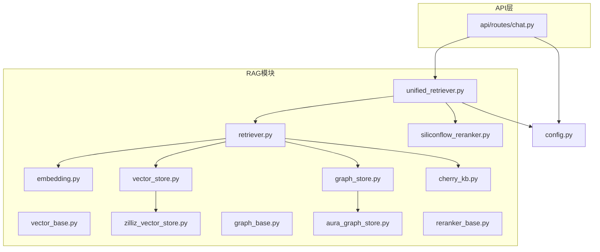
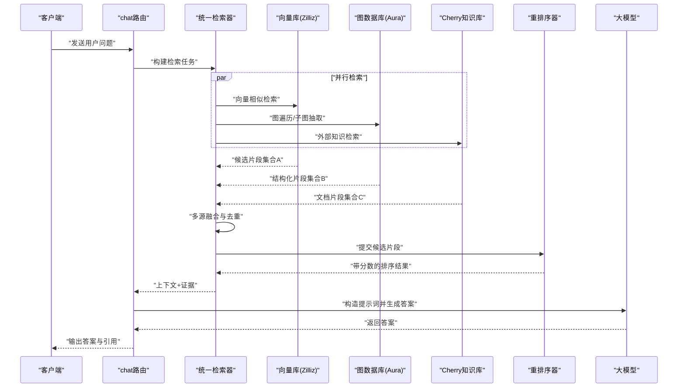
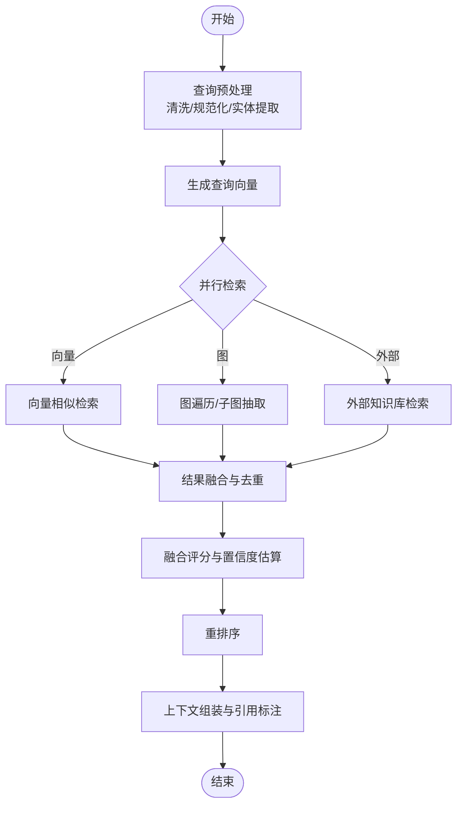
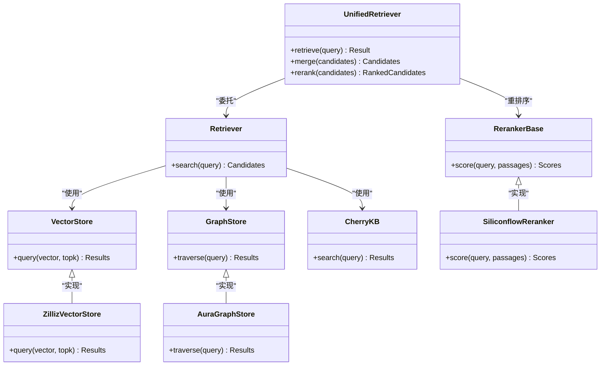

# RAG数据处理流程

<cite>
**本文引用的文件**   
- [backend_design/nexus/rag/__init__.py](file://backend_design/nexus/rag/__init__.py)
- [backend_design/nexus/rag/embedding.py](file://backend_design/nexus/rag/embedding.py)
- [backend_design/nexus/rag/vector_base.py](file://backend_design/nexus/rag/vector_base.py)
- [backend_design/nexus/rag/vector_store.py](file://backend_design/nexus/rag/vector_store.py)
- [backend_design/nexus/rag/zilliz_vector_store.py](file://backend_design/nexus/rag/zilliz_vector_store.py)
- [backend_design/nexus/rag/graph_base.py](file://backend_design/nexus/rag/graph_base.py)
- [backend_design/nexus/rag/graph_store.py](file://backend_design/nexus/rag/graph_store.py)
- [backend_design/nexus/rag/aura_graph_store.py](file://backend_design/nexus/rag/aura_graph_store.py)
- [backend_design/nexus/rag/retriever.py](file://backend_design/nexus/rag/retriever.py)
- [backend_design/nexus/rag/unified_retriever.py](file://backend_design/nexus/rag/unified_retriever.py)
- [backend_design/nexus/rag/reranker_base.py](file://backend_design/nexus/rag/reranker_base.py)
- [backend_design/nexus/rag/siliconflow_reranker.py](file://backend_design/nexus/rag/siliconflow_reranker.py)
- [backend_design/nexus/rag/cherry_kb.py](file://backend_design/nexus/rag/cherry_kb.py)
- [backend_design/nexus/api/routes/chat.py](file://backend_design/nexus/api/routes/chat.py)
- [backend_design/nexus/config.py](file://backend_design/nexus/config.py)
</cite>

## 目录
1. [简介](#简介)
2. [项目结构](#项目结构)
3. [核心组件](#核心组件)
4. [架构总览](#架构总览)
5. [详细组件分析](#详细组件分析)
6. [依赖关系分析](#依赖关系分析)
7. [性能考虑](#性能考虑)
8. [故障排查指南](#故障排查指南)
9. [结论](#结论)
10. [附录](#附录)

## 简介
本文件面向NexusCockpit的检索增强生成（RAG）数据流水线，系统化阐述从查询预处理到答案生成的全链路处理过程。重点覆盖：
- 向量嵌入生成与相似度计算
- 图数据库查询与遍历策略
- 多源结果融合、去重与置信度评估
- 重排序机制与最终答案生成
- 缓存、批量处理与索引优化等性能技巧
- 关键配置参数与实现示例路径

## 项目结构
RAG相关代码集中在 backend_design/nexus/rag 目录下，采用“接口抽象 + 工厂 + 具体实现”的分层组织方式：
- 嵌入与向量存储：embedding、vector_base、vector_store、zilliz_vector_store
- 图存储：graph_base、graph_store、aura_graph_store
- 检索编排：retriever、unified_retriever
- 重排序：reranker_base、siliconflow_reranker
- 外部知识库集成：cherry_kb
- API入口：api/routes/chat.py
- 配置：config.py

图表来源
- [backend_design/nexus/rag/embedding.py](file://backend_design/nexus/rag/embedding.py)
- [backend_design/nexus/rag/vector_base.py](file://backend_design/nexus/rag/vector_base.py)
- [backend_design/nexus/rag/vector_store.py](file://backend_design/nexus/rag/vector_store.py)
- [backend_design/nexus/rag/zilliz_vector_store.py](file://backend_design/nexus/rag/zilliz_vector_store.py)
- [backend_design/nexus/rag/graph_base.py](file://backend_design/nexus/rag/graph_base.py)
- [backend_design/nexus/rag/graph_store.py](file://backend_design/nexus/rag/graph_store.py)
- [backend_design/nexus/rag/aura_graph_store.py](file://backend_design/nexus/rag/aura_graph_store.py)
- [backend_design/nexus/rag/retriever.py](file://backend_design/nexus/rag/retriever.py)
- [backend_design/nexus/rag/unified_retriever.py](file://backend_design/nexus/rag/unified_retriever.py)
- [backend_design/nexus/rag/reranker_base.py](file://backend_design/nexus/rag/reranker_base.py)
- [backend_design/nexus/rag/siliconflow_reranker.py](file://backend_design/nexus/rag/siliconflow_reranker.py)
- [backend_design/nexus/rag/cherry_kb.py](file://backend_design/nexus/rag/cherry_kb.py)
- [backend_design/nexus/api/routes/chat.py](file://backend_design/nexus/api/routes/chat.py)
- [backend_design/nexus/config.py](file://backend_design/nexus/config.py)

章节来源
- [backend_design/nexus/rag/__init__.py](file://backend_design/nexus/rag/__init__.py)
- [backend_design/nexus/api/routes/chat.py](file://backend_design/nexus/api/routes/chat.py)
- [backend_design/nexus/config.py](file://backend_design/nexus/config.py)

## 核心组件
- 嵌入与向量化
  - embedding：负责将文本片段或查询转换为向量表示，支持多种后端与批量模式。
  - vector_base/vector_store：定义向量库通用接口与默认实现，屏蔽底层差异。
  - zilliz_vector_store：对接Zilliz/Milvus类向量数据库，提供高并发近似最近邻搜索。
- 图存储与遍历
  - graph_base/graph_store：定义图数据库通用接口与默认实现。
  - aura_graph_store：对接Aura图数据库，执行图遍历与子图抽取。
- 检索编排
  - retriever：基础检索器，封装向量检索与图检索流程。
  - unified_retriever：统一检索器，协调多源检索（向量、图、外部知识库），进行结果融合与初步评分。
- 重排序
  - reranker_base：重排序基类，定义统一打分接口。
  - siliconflow_reranker：基于SiliconFlow的重排序实现，对候选片段进行精细打分。
- 外部知识库
  - cherry_kb：对接Cherry知识库，作为补充信息源参与融合。
- API与配置
  - api/routes/chat.py：聊天接口调用统一检索器，组装上下文并触发答案生成。
  - config.py：集中管理RAG相关配置项（模型、阈值、超时、批大小等）。

章节来源
- [backend_design/nexus/rag/embedding.py](file://backend_design/nexus/rag/embedding.py)
- [backend_design/nexus/rag/vector_base.py](file://backend_design/nexus/rag/vector_base.py)
- [backend_design/nexus/rag/vector_store.py](file://backend_design/nexus/rag/vector_store.py)
- [backend_design/nexus/rag/zilliz_vector_store.py](file://backend_design/nexus/rag/zilliz_vector_store.py)
- [backend_design/nexus/rag/graph_base.py](file://backend_design/nexus/rag/graph_base.py)
- [backend_design/nexus/rag/graph_store.py](file://backend_design/nexus/rag/graph_store.py)
- [backend_design/nexus/rag/aura_graph_store.py](file://backend_design/nexus/rag/aura_graph_store.py)
- [backend_design/nexus/rag/retriever.py](file://backend_design/nexus/rag/retriever.py)
- [backend_design/nexus/rag/unified_retriever.py](file://backend_design/nexus/rag/unified_retriever.py)
- [backend_design/nexus/rag/reranker_base.py](file://backend_design/nexus/rag/reranker_base.py)
- [backend_design/nexus/rag/siliconflow_reranker.py](file://backend_design/nexus/rag/siliconflow_reranker.py)
- [backend_design/nexus/rag/cherry_kb.py](file://backend_design/nexus/rag/cherry_kb.py)
- [backend_design/nexus/api/routes/chat.py](file://backend_design/nexus/api/routes/chat.py)
- [backend_design/nexus/config.py](file://backend_design/nexus/config.py)

## 架构总览
下图展示一次典型RAG请求的全链路处理：从API进入，经统一检索器并行检索向量与图，再融合、重排序，最后由LLM生成答案。

图表来源
- [backend_design/nexus/api/routes/chat.py](file://backend_design/nexus/api/routes/chat.py)
- [backend_design/nexus/rag/unified_retriever.py](file://backend_design/nexus/rag/unified_retriever.py)
- [backend_design/nexus/rag/zilliz_vector_store.py](file://backend_design/nexus/rag/zilliz_vector_store.py)
- [backend_design/nexus/rag/aura_graph_store.py](file://backend_design/nexus/rag/aura_graph_store.py)
- [backend_design/nexus/rag/cherry_kb.py](file://backend_design/nexus/rag/cherry_kb.py)
- [backend_design/nexus/rag/siliconflow_reranker.py](file://backend_design/nexus/rag/siliconflow_reranker.py)

## 详细组件分析

### 查询预处理与嵌入生成
- 目标：将原始查询规范化为可检索的形式，并生成高质量向量。
- 关键点：
  - 查询清洗：去除噪声、标准化术语、提取实体与意图关键词。
  - 嵌入选择：根据领域与延迟要求选择合适的嵌入模型；必要时使用轻量模型做粗排，再用重排序精排。
  - 批量与缓存：对重复查询或短轮次对话进行缓存，避免重复计算。
- 参考实现路径：
  - [embedding.py](file://backend_design/nexus/rag/embedding.py)
  - [config.py](file://backend_design/nexus/config.py)

章节来源
- [backend_design/nexus/rag/embedding.py](file://backend_design/nexus/rag/embedding.py)
- [backend_design/nexus/config.py](file://backend_design/nexus/config.py)

### 向量检索与相似度计算
- 目标：在大规模语料中快速召回最相关的片段。
- 关键点：
  - 相似度度量：余弦相似度为主，结合归一化与阈值过滤。
  - 索引与分区：按租户/业务域划分集合，减少扫描范围。
  - 批量检索：合并相近查询，提升吞吐。
- 参考实现路径：
  - [vector_base.py](file://backend_design/nexus/rag/vector_base.py)
  - [vector_store.py](file://backend_design/nexus/rag/vector_store.py)
  - [zilliz_vector_store.py](file://backend_design/nexus/rag/zilliz_vector_store.py)

章节来源
- [backend_design/nexus/rag/vector_base.py](file://backend_design/nexus/rag/vector_base.py)
- [backend_design/nexus/rag/vector_store.py](file://backend_design/nexus/rag/vector_store.py)
- [backend_design/nexus/rag/zilliz_vector_store.py](file://backend_design/nexus/rag/zilliz_vector_store.py)

### 图数据库查询与遍历算法
- 目标：利用结构化知识（实体、关系、属性）进行精准定位与推理。
- 关键点：
  - 查询构建：将自然语言转为图查询（如Cypher），包含实体识别与关系约束。
  - 遍历策略：限定深度与分支因子，优先命中高权重边与节点。
  - 结果裁剪：仅保留与查询语义强相关的子图片段。
- 参考实现路径：
  - [graph_base.py](file://backend_design/nexus/rag/graph_base.py)
  - [graph_store.py](file://backend_design/nexus/rag/graph_store.py)
  - [aura_graph_store.py](file://backend_design/nexus/rag/aura_graph_store.py)

章节来源
- [backend_design/nexus/rag/graph_base.py](file://backend_design/nexus/rag/graph_base.py)
- [backend_design/nexus/rag/graph_store.py](file://backend_design/nexus/rag/graph_store.py)
- [backend_design/nexus/rag/aura_graph_store.py](file://backend_design/nexus/rag/aura_graph_store.py)

### 多源结果融合与去重
- 目标：整合向量、图、外部知识库的候选片段，消除冗余，形成统一候选集。
- 关键点：
  - 统一ID：为不同来源片段建立稳定标识，便于跨源去重。
  - 去重策略：基于内容指纹（如MinHash/SimHash）与语义哈希双重校验。
  - 融合评分：加权组合各源分数，考虑来源可信度、时效性与相关性。
- 参考实现路径：
  - [unified_retriever.py](file://backend_design/nexus/rag/unified_retriever.py)
  - [retriever.py](file://backend_design/nexus/rag/retriever.py)

章节来源
- [backend_design/nexus/rag/unified_retriever.py](file://backend_design/nexus/rag/unified_retriever.py)
- [backend_design/nexus/rag/retriever.py](file://backend_design/nexus/rag/retriever.py)

### 重排序与置信度评估
- 目标：对候选片段进行精细化排序，输出高质量上下文。
- 关键点：
  - 重排序模型：使用专用reranker对(query, passage)对打分，捕捉细粒度匹配信号。
  - 置信度：综合相似度、图结构强度、外部来源权威性与时间衰减，得到最终置信度。
  - 阈值控制：低于阈值的片段直接丢弃，降低噪声。
- 参考实现路径：
  - [reranker_base.py](file://backend_design/nexus/rag/reranker_base.py)
  - [siliconflow_reranker.py](file://backend_design/nexus/rag/siliconflow_reranker.py)

章节来源
- [backend_design/nexus/rag/reranker_base.py](file://backend_design/nexus/rag/reranker_base.py)
- [backend_design/nexus/rag/siliconflow_reranker.py](file://backend_design/nexus/rag/siliconflow_reranker.py)

### 答案生成与上下文组装
- 目标：将排序后的片段组织为LLM可读的上下文，驱动高质量回答。
- 关键点：
  - 上下文窗口：控制片段数量与长度，避免超出模型限制。
  - 引用标注：保留来源元数据，便于溯源与审计。
  - 失败回退：当无足够证据时，引导模型给出保守回答或澄清问题。
- 参考实现路径：
  - [api/routes/chat.py](file://backend_design/nexus/api/routes/chat.py)

章节来源
- [backend_design/nexus/api/routes/chat.py](file://backend_design/nexus/api/routes/chat.py)

### 外部知识库集成（Cherry）
- 目标：引入企业级知识库作为补充信息源，提高专业领域准确性。
- 关键点：
  - 检索策略：关键词+语义混合检索，结合权限与版本控制。
  - 结果对齐：与内部片段体系对齐，确保融合一致性。
- 参考实现路径：
  - [cherry_kb.py](file://backend_design/nexus/rag/cherry_kb.py)

章节来源
- [backend_design/nexus/rag/cherry_kb.py](file://backend_design/nexus/rag/cherry_kb.py)

### 统一检索器工作流（流程图）

图表来源
- [backend_design/nexus/rag/unified_retriever.py](file://backend_design/nexus/rag/unified_retriever.py)
- [backend_design/nexus/rag/retriever.py](file://backend_design/nexus/rag/retriever.py)
- [backend_design/nexus/rag/embedding.py](file://backend_design/nexus/rag/embedding.py)
- [backend_design/nexus/rag/zilliz_vector_store.py](file://backend_design/nexus/rag/zilliz_vector_store.py)
- [backend_design/nexus/rag/aura_graph_store.py](file://backend_design/nexus/rag/aura_graph_store.py)
- [backend_design/nexus/rag/cherry_kb.py](file://backend_design/nexus/rag/cherry_kb.py)
- [backend_design/nexus/rag/siliconflow_reranker.py](file://backend_design/nexus/rag/siliconflow_reranker.py)

## 依赖关系分析
RAG模块通过接口抽象解耦具体实现，统一检索器作为编排中心，聚合多源能力。

图表来源
- [backend_design/nexus/rag/unified_retriever.py](file://backend_design/nexus/rag/unified_retriever.py)
- [backend_design/nexus/rag/retriever.py](file://backend_design/nexus/rag/retriever.py)
- [backend_design/nexus/rag/vector_base.py](file://backend_design/nexus/rag/vector_base.py)
- [backend_design/nexus/rag/vector_store.py](file://backend_design/nexus/rag/vector_store.py)
- [backend_design/nexus/rag/zilliz_vector_store.py](file://backend_design/nexus/rag/zilliz_vector_store.py)
- [backend_design/nexus/rag/graph_base.py](file://backend_design/nexus/rag/graph_base.py)
- [backend_design/nexus/rag/graph_store.py](file://backend_design/nexus/rag/graph_store.py)
- [backend_design/nexus/rag/aura_graph_store.py](file://backend_design/nexus/rag/aura_graph_store.py)
- [backend_design/nexus/rag/cherry_kb.py](file://backend_design/nexus/rag/cherry_kb.py)
- [backend_design/nexus/rag/reranker_base.py](file://backend_design/nexus/rag/reranker_base.py)
- [backend_design/nexus/rag/siliconflow_reranker.py](file://backend_design/nexus/rag/siliconflow_reranker.py)

章节来源
- [backend_design/nexus/rag/unified_retriever.py](file://backend_design/nexus/rag/unified_retriever.py)
- [backend_design/nexus/rag/retriever.py](file://backend_design/nexus/rag/retriever.py)
- [backend_design/nexus/rag/vector_base.py](file://backend_design/nexus/rag/vector_base.py)
- [backend_design/nexus/rag/vector_store.py](file://backend_design/nexus/rag/vector_store.py)
- [backend_design/nexus/rag/zilliz_vector_store.py](file://backend_design/nexus/rag/zilliz_vector_store.py)
- [backend_design/nexus/rag/graph_base.py](file://backend_design/nexus/rag/graph_base.py)
- [backend_design/nexus/rag/graph_store.py](file://backend_design/nexus/rag/graph_store.py)
- [backend_design/nexus/rag/aura_graph_store.py](file://backend_design/nexus/rag/aura_graph_store.py)
- [backend_design/nexus/rag/cherry_kb.py](file://backend_design/nexus/rag/cherry_kb.py)
- [backend_design/nexus/rag/reranker_base.py](file://backend_design/nexus/rag/reranker_base.py)
- [backend_design/nexus/rag/siliconflow_reranker.py](file://backend_design/nexus/rag/siliconflow_reranker.py)

## 性能考虑
- 缓存策略
  - 查询向量缓存：对相同或高度相似的查询复用已计算的向量，减少嵌入开销。
  - 检索结果缓存：短期热点结果缓存，降低下游压力。
  - 参考路径：[unified_retriever.py](file://backend_design/nexus/rag/unified_retriever.py)、[config.py](file://backend_design/nexus/config.py)
- 批量处理
  - 批量嵌入：合并多个查询一次性生成向量，提升吞吐。
  - 批量检索：合并相似查询，减少网络往返。
  - 参考路径：[embedding.py](file://backend_design/nexus/rag/embedding.py)、[zilliz_vector_store.py](file://backend_design/nexus/rag/zilliz_vector_store.py)
- 索引优化
  - 向量索引：合理设置topK、距离度量与分区键，平衡精度与延迟。
  - 图索引：为高频实体与关系建立索引，缩短遍历路径。
  - 参考路径：[zilliz_vector_store.py](file://backend_design/nexus/rag/zilliz_vector_store.py)、[aura_graph_store.py](file://backend_design/nexus/rag/aura_graph_store.py)
- 超时与熔断
  - 为外部服务（图库、知识库、重排序）设置超时与重试策略，避免雪崩。
  - 参考路径：[config.py](file://backend_design/nexus/config.py)

章节来源
- [backend_design/nexus/rag/unified_retriever.py](file://backend_design/nexus/rag/unified_retriever.py)
- [backend_design/nexus/rag/embedding.py](file://backend_design/nexus/rag/embedding.py)
- [backend_design/nexus/rag/zilliz_vector_store.py](file://backend_design/nexus/rag/zilliz_vector_store.py)
- [backend_design/nexus/rag/aura_graph_store.py](file://backend_design/nexus/rag/aura_graph_store.py)
- [backend_design/nexus/config.py](file://backend_design/nexus/config.py)

## 故障排查指南
- 常见问题
  - 向量检索为空：检查嵌入维度、索引是否初始化、阈值是否过高。
  - 图遍历超时：限制遍历深度与分支因子，检查实体映射是否正确。
  - 重排序失败：确认模型加载与输入格式，降级为规则排序。
  - 外部知识库不可用：启用回退策略，仅使用向量与图结果。
- 建议日志与指标
  - 记录每阶段耗时、候选数、融合后数量、重排序分数分布。
  - 监控错误率与超时次数，设置告警阈值。
- 参考路径
  - [unified_retriever.py](file://backend_design/nexus/rag/unified_retriever.py)
  - [zilliz_vector_store.py](file://backend_design/nexus/rag/zilliz_vector_store.py)
  - [aura_graph_store.py](file://backend_design/nexus/rag/aura_graph_store.py)
  - [siliconflow_reranker.py](file://backend_design/nexus/rag/siliconflow_reranker.py)
  - [config.py](file://backend_design/nexus/config.py)

章节来源
- [backend_design/nexus/rag/unified_retriever.py](file://backend_design/nexus/rag/unified_retriever.py)
- [backend_design/nexus/rag/zilliz_vector_store.py](file://backend_design/nexus/rag/zilliz_vector_store.py)
- [backend_design/nexus/rag/aura_graph_store.py](file://backend_design/nexus/rag/aura_graph_store.py)
- [backend_design/nexus/rag/siliconflow_reranker.py](file://backend_design/nexus/rag/siliconflow_reranker.py)
- [backend_design/nexus/config.py](file://backend_design/nexus/config.py)

## 结论
NexusCockpit的RAG数据流水线以统一检索器为核心，串联向量检索、图遍历与外部知识库，通过融合、去重与重排序输出高质量上下文，最终驱动LLM生成准确且可溯源的答案。借助缓存、批量处理与索引优化，系统可在保证质量的同时满足低延迟与高吞吐的生产需求。

## 附录
- 关键配置参数（示例说明）
  - 嵌入模型与维度：用于生成查询与文档向量，需与向量库索引一致。
  - 相似度阈值：过滤低相关片段，避免噪声进入重排序。
  - 最大候选数与TopK：控制召回规模，影响延迟与精度。
  - 图遍历深度与分支因子：限制遍历范围，防止爆炸式增长。
  - 重排序模型与超时：保障重排序稳定性与响应时间。
  - 缓存开关与TTL：提升热点查询性能。
  - 参考路径：[config.py](file://backend_design/nexus/config.py)