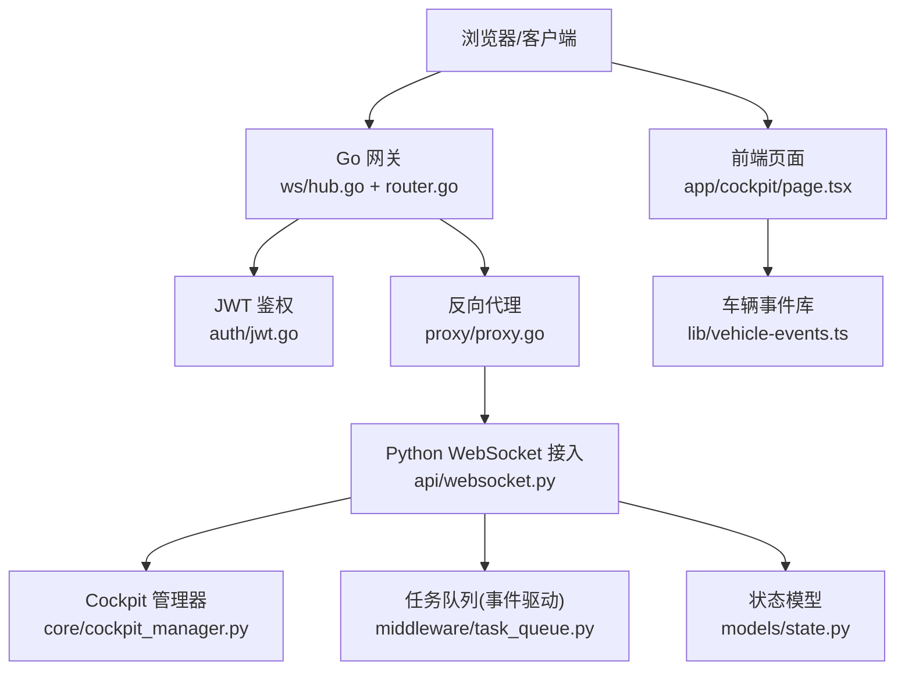
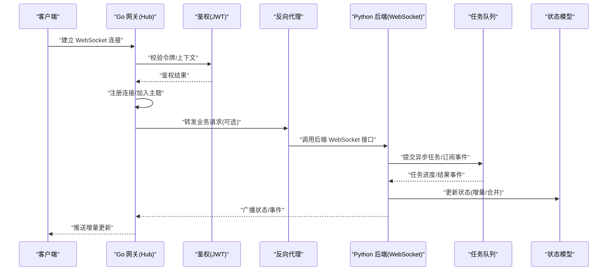
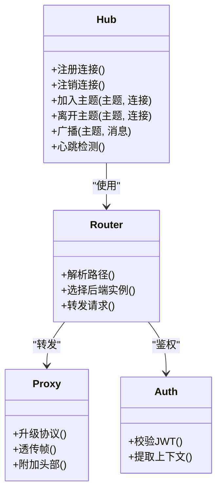
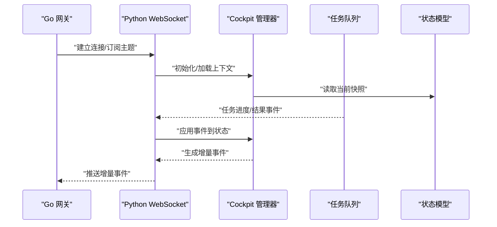
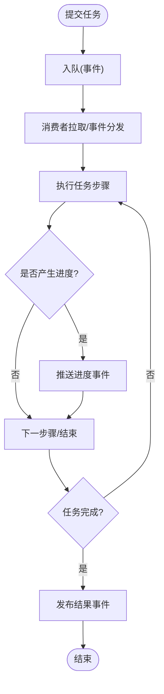
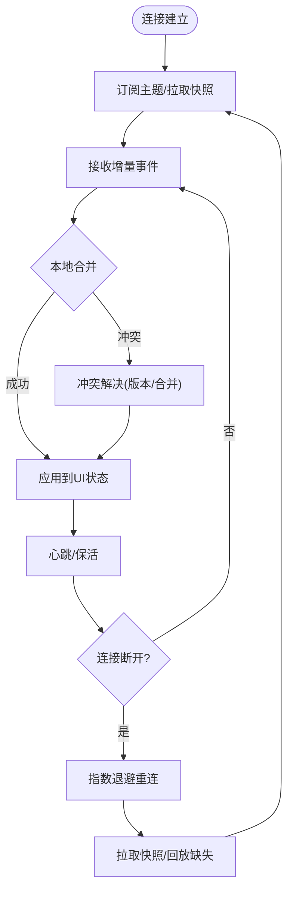
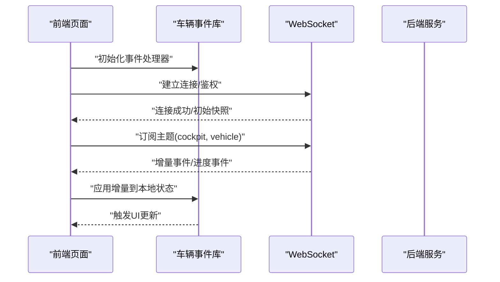
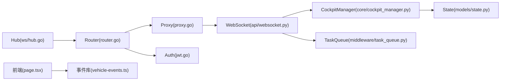

# 实时事件流处理

<cite>
**本文引用的文件**   
- [backend_design/nexus_gate/internal/ws/hub.go](file://backend_design/nexus_gate/internal/ws/hub.go)
- [backend_design/nexus_gate/internal/router/router.go](file://backend_design/nexus_gate/internal/router/router.go)
- [backend_design/nexus_gate/internal/proxy/proxy.go](file://backend_design/nexus_gate/internal/proxy/proxy.go)
- [backend_design/nexus_gate/internal/auth/jwt.go](file://backend_design/nexus_gate/internal/auth/jwt.go)
- [backend_design/nexus/api/websocket.py](file://backend_design/nexus/api/websocket.py)
- [backend_design/nexus/core/cockpit_manager.py](file://backend_design/nexus/core/cockpit_manager.py)
- [backend_design/nexus/middleware/task_queue.py](file://backend_design/nexus/middleware/task_queue.py)
- [backend_design/nexus/models/state.py](file://backend_design/nexus/models/state.py)
- [backend_design/nexus/models/schemas.py](file://backend_design/nexus/models/schemas.py)
- [frontend_design/src/lib/vehicle-events.ts](file://frontend_design/src/lib/vehicle-events.ts)
- [frontend_design/src/app/cockpit/page.tsx](file://frontend_design/src/app/cockpit/page.tsx)
</cite>

## 目录
1. [简介](#简介)
2. [项目结构](#项目结构)
3. [核心组件](#核心组件)
4. [架构总览](#架构总览)
5. [详细组件分析](#详细组件分析)
6. [依赖关系分析](#依赖关系分析)
7. [性能考虑](#性能考虑)
8. [故障排查指南](#故障排查指南)
9. [结论](#结论)
10. [附录](#附录)

## 简介
本文件面向 NexusCockpit 的实时事件流处理，聚焦基于 WebSocket 的实时通信与状态同步。内容涵盖：
- Go 网关的 WebSocket Hub 实现、消息路由与负载均衡策略
- Python 后端的 WebSocket 接入、任务队列的事件驱动模式、异步任务与进度反馈
- 前后端实时数据同步策略（增量更新、冲突解决、断线重连）
- 实时状态监控与前端集成示例

## 项目结构
本项目在“后端设计”目录下包含两个关键子系统：
- Go 网关（nexus_gate）：负责外部连接接入、鉴权、WebSocket Hub、消息路由与反向代理到后端服务
- Python 后端（nexus）：提供业务 API、WebSocket 接入、任务队列、状态模型与 Cockpit 管理逻辑

图表来源
- [backend_design/nexus_gate/internal/ws/hub.go](file://backend_design/nexus_gate/internal/ws/hub.go)
- [backend_design/nexus_gate/internal/router/router.go](file://backend_design/nexus_gate/internal/router/router.go)
- [backend_design/nexus_gate/internal/proxy/proxy.go](file://backend_design/nexus_gate/internal/proxy/proxy.go)
- [backend_design/nexus_gate/internal/auth/jwt.go](file://backend_design/nexus_gate/internal/auth/jwt.go)
- [backend_design/nexus/api/websocket.py](file://backend_design/nexus/api/websocket.py)
- [backend_design/nexus/core/cockpit_manager.py](file://backend_design/nexus/core/cockpit_manager.py)
- [backend_design/nexus/middleware/task_queue.py](file://backend_design/nexus/middleware/task_queue.py)
- [backend_design/nexus/models/state.py](file://backend_design/nexus/models/state.py)
- [frontend_design/src/app/cockpit/page.tsx](file://frontend_design/src/app/cockpit/page.tsx)
- [frontend_design/src/lib/vehicle-events.ts](file://frontend_design/src/lib/vehicle-events.ts)

章节来源
- [backend_design/nexus_gate/internal/ws/hub.go](file://backend_design/nexus_gate/internal/ws/hub.go)
- [backend_design/nexus_gate/internal/router/router.go](file://backend_design/nexus_gate/internal/router/router.go)
- [backend_design/nexus_gate/internal/proxy/proxy.go](file://backend_design/nexus_gate/internal/proxy/proxy.go)
- [backend_design/nexus_gate/internal/auth/jwt.go](file://backend_design/nexus_gate/internal/auth/jwt.go)
- [backend_design/nexus/api/websocket.py](file://backend_design/nexus/api/websocket.py)
- [backend_design/nexus/core/cockpit_manager.py](file://backend_design/nexus/core/cockpit_manager.py)
- [backend_design/nexus/middleware/task_queue.py](file://backend_design/nexus/middleware/task_queue.py)
- [backend_design/nexus/models/state.py](file://backend_design/nexus/models/state.py)
- [frontend_design/src/app/cockpit/page.tsx](file://frontend_design/src/app/cockpit/page.tsx)
- [frontend_design/src/lib/vehicle-events.ts](file://frontend_design/src/lib/vehicle-events.ts)

## 核心组件
- Go 网关 WebSocket Hub：维护连接集合、订阅/广播、按主题分发消息
- 路由与鉴权：对 WebSocket 升级请求进行鉴权与路径解析，决定转发目标
- 反向代理：将 WebSocket 流量透明转发至 Python 后端
- Python WebSocket 接入：接收/发送消息，协调 Cockpit 管理与任务队列
- 任务队列（事件驱动）：以事件为驱动调度异步任务，推送进度与结果
- 状态模型：定义 Cockpit 状态结构与变更语义，支撑增量同步与冲突解决
- 前端集成：建立 WS 连接、订阅主题、增量更新 UI、断线重连与幂等处理

章节来源
- [backend_design/nexus_gate/internal/ws/hub.go](file://backend_design/nexus_gate/internal/ws/hub.go)
- [backend_design/nexus_gate/internal/router/router.go](file://backend_design/nexus_gate/internal/router/router.go)
- [backend_design/nexus_gate/internal/proxy/proxy.go](file://backend_design/nexus_gate/internal/proxy/proxy.go)
- [backend_design/nexus_gate/internal/auth/jwt.go](file://backend_design/nexus_gate/internal/auth/jwt.go)
- [backend_design/nexus/api/websocket.py](file://backend_design/nexus/api/websocket.py)
- [backend_design/nexus/core/cockpit_manager.py](file://backend_design/nexus/core/cockpit_manager.py)
- [backend_design/nexus/middleware/task_queue.py](file://backend_design/nexus/middleware/task_queue.py)
- [backend_design/nexus/models/state.py](file://backend_design/nexus/models/state.py)
- [frontend_design/src/app/cockpit/page.tsx](file://frontend_design/src/app/cockpit/page.tsx)
- [frontend_design/src/lib/vehicle-events.ts](file://frontend_design/src/lib/vehicle-events.ts)

## 架构总览
整体采用“网关 Hub + 后端事件驱动”的分层架构：
- 客户端通过 WebSocket 连接到 Go 网关
- 网关完成鉴权后将连接注册到 Hub，并按主题路由消息
- 网关将需要深入处理的请求反向代理到 Python 后端
- Python 后端通过任务队列执行异步任务，并将状态变更与进度事件广播给相关订阅者
- 前端根据收到的增量事件更新界面，保持低延迟与高吞吐

图表来源
- [backend_design/nexus_gate/internal/ws/hub.go](file://backend_design/nexus_gate/internal/ws/hub.go)
- [backend_design/nexus_gate/internal/router/router.go](file://backend_design/nexus_gate/internal/router/router.go)
- [backend_design/nexus_gate/internal/proxy/proxy.go](file://backend_design/nexus_gate/internal/proxy/proxy.go)
- [backend_design/nexus_gate/internal/auth/jwt.go](file://backend_design/nexus_gate/internal/auth/jwt.go)
- [backend_design/nexus/api/websocket.py](file://backend_design/nexus/api/websocket.py)
- [backend_design/nexus/middleware/task_queue.py](file://backend_design/nexus/middleware/task_queue.py)
- [backend_design/nexus/models/state.py](file://backend_design/nexus/models/state.py)

## 详细组件分析

### Go 网关 WebSocket Hub 与路由
- Hub 职责
  - 连接生命周期管理：建立、心跳检测、关闭清理
  - 订阅/取消订阅：按主题维护连接集合
  - 消息广播：向指定主题或所有连接推送消息
  - 限流与背压：防止突发流量导致内存膨胀
- 路由与鉴权
  - 对 WebSocket 升级请求进行 JWT 校验与租户上下文注入
  - 根据路径/查询参数选择后端服务实例，支持简单轮询或一致性哈希
- 反向代理
  - 透传 WebSocket 帧，必要时附加鉴权头或追踪 ID

图表来源
- [backend_design/nexus_gate/internal/ws/hub.go](file://backend_design/nexus_gate/internal/ws/hub.go)
- [backend_design/nexus_gate/internal/router/router.go](file://backend_design/nexus_gate/internal/router/router.go)
- [backend_design/nexus_gate/internal/proxy/proxy.go](file://backend_design/nexus_gate/internal/proxy/proxy.go)
- [backend_design/nexus_gate/internal/auth/jwt.go](file://backend_design/nexus_gate/internal/auth/jwt.go)

章节来源
- [backend_design/nexus_gate/internal/ws/hub.go](file://backend_design/nexus_gate/internal/ws/hub.go)
- [backend_design/nexus_gate/internal/router/router.go](file://backend_design/nexus_gate/internal/router/router.go)
- [backend_design/nexus_gate/internal/proxy/proxy.go](file://backend_design/nexus_gate/internal/proxy/proxy.go)
- [backend_design/nexus_gate/internal/auth/jwt.go](file://backend_design/nexus_gate/internal/auth/jwt.go)

### Python 后端 WebSocket 接入与 Cockpit 管理
- WebSocket 接入
  - 处理连接建立、认证、主题订阅
  - 将业务事件转换为统一的消息格式并回推
- Cockpit 管理器
  - 聚合多源状态（车辆、环境、任务）
  - 计算差异并生成增量事件
  - 协调任务队列与状态持久化

图表来源
- [backend_design/nexus/api/websocket.py](file://backend_design/nexus/api/websocket.py)
- [backend_design/nexus/core/cockpit_manager.py](file://backend_design/nexus/core/cockpit_manager.py)
- [backend_design/nexus/middleware/task_queue.py](file://backend_design/nexus/middleware/task_queue.py)
- [backend_design/nexus/models/state.py](file://backend_design/nexus/models/state.py)

章节来源
- [backend_design/nexus/api/websocket.py](file://backend_design/nexus/api/websocket.py)
- [backend_design/nexus/core/cockpit_manager.py](file://backend_design/nexus/core/cockpit_manager.py)
- [backend_design/nexus/models/state.py](file://backend_design/nexus/models/state.py)

### 任务队列的事件驱动模式与进度反馈
- 事件驱动
  - 任务以事件形式入队，消费者监听事件并执行
  - 中间件负责序列化、重试、死信队列与指标上报
- 进度反馈
  - 任务阶段推进时产生进度事件，经 WebSocket 推送给订阅者
  - 前端可据此渲染进度条与阶段性提示

图表来源
- [backend_design/nexus/middleware/task_queue.py](file://backend_design/nexus/middleware/task_queue.py)
- [backend_design/nexus/api/websocket.py](file://backend_design/nexus/api/websocket.py)

章节来源
- [backend_design/nexus/middleware/task_queue.py](file://backend_design/nexus/middleware/task_queue.py)
- [backend_design/nexus/api/websocket.py](file://backend_design/nexus/api/websocket.py)

### 前后端实时数据同步策略
- 增量更新
  - 服务端计算字段级差异，仅推送变更字段与版本戳
  - 前端按版本顺序合并，避免乱序导致的覆盖问题
- 冲突解决
  - 采用“最后写入获胜(LWW)”或“操作合并(OT/CRDT)”策略
  - 对关键字段引入版本号与来源标识，确保幂等
- 断线重连
  - 前端指数退避重连，携带上次成功版本号
  - 服务端提供快照补全与缺失事件回放能力

章节来源
- [backend_design/nexus/models/state.py](file://backend_design/nexus/models/state.py)
- [backend_design/nexus/models/schemas.py](file://backend_design/nexus/models/schemas.py)
- [frontend_design/src/lib/vehicle-events.ts](file://frontend_design/src/lib/vehicle-events.ts)
- [frontend_design/src/app/cockpit/page.tsx](file://frontend_design/src/app/cockpit/page.tsx)

### 前端集成示例与实时监控
- 连接与订阅
  - 在页面初始化时建立 WebSocket 连接，订阅 Cockpit 与车辆事件主题
  - 使用统一的错误处理与重连机制
- 增量更新与渲染
  - 根据事件类型与字段路径更新局部状态，减少重绘
  - 对进度事件渲染进度条与阶段标签
- 监控面板
  - 展示连接数、消息吞吐、延迟分布、任务队列深度与失败率

图表来源
- [frontend_design/src/app/cockpit/page.tsx](file://frontend_design/src/app/cockpit/page.tsx)
- [frontend_design/src/lib/vehicle-events.ts](file://frontend_design/src/lib/vehicle-events.ts)

章节来源
- [frontend_design/src/app/cockpit/page.tsx](file://frontend_design/src/app/cockpit/page.tsx)
- [frontend_design/src/lib/vehicle-events.ts](file://frontend_design/src/lib/vehicle-events.ts)

## 依赖关系分析
- 耦合与内聚
  - Hub 与 Router 解耦清晰，Router 通过抽象选择后端实例，便于扩展
  - 后端 WebSocket 与任务队列通过事件总线松耦合，提升可测试性
- 外部依赖
  - JWT 鉴权、Redis/消息中间件（用于队列与缓存）、数据库（状态持久化）
- 潜在循环依赖
  - 避免 Hub 直接依赖具体业务模块，应通过接口/事件通道传递

图表来源
- [backend_design/nexus_gate/internal/ws/hub.go](file://backend_design/nexus_gate/internal/ws/hub.go)
- [backend_design/nexus_gate/internal/router/router.go](file://backend_design/nexus_gate/internal/router/router.go)
- [backend_design/nexus_gate/internal/proxy/proxy.go](file://backend_design/nexus_gate/internal/proxy/proxy.go)
- [backend_design/nexus_gate/internal/auth/jwt.go](file://backend_design/nexus_gate/internal/auth/jwt.go)
- [backend_design/nexus/api/websocket.py](file://backend_design/nexus/api/websocket.py)
- [backend_design/nexus/core/cockpit_manager.py](file://backend_design/nexus/core/cockpit_manager.py)
- [backend_design/nexus/middleware/task_queue.py](file://backend_design/nexus/middleware/task_queue.py)
- [backend_design/nexus/models/state.py](file://backend_design/nexus/models/state.py)
- [frontend_design/src/app/cockpit/page.tsx](file://frontend_design/src/app/cockpit/page.tsx)
- [frontend_design/src/lib/vehicle-events.ts](file://frontend_design/src/lib/vehicle-events.ts)

章节来源
- [backend_design/nexus_gate/internal/ws/hub.go](file://backend_design/nexus_gate/internal/ws/hub.go)
- [backend_design/nexus_gate/internal/router/router.go](file://backend_design/nexus_gate/internal/router/router.go)
- [backend_design/nexus_gate/internal/proxy/proxy.go](file://backend_design/nexus_gate/internal/proxy/proxy.go)
- [backend_design/nexus_gate/internal/auth/jwt.go](file://backend_design/nexus_gate/internal/auth/jwt.go)
- [backend_design/nexus/api/websocket.py](file://backend_design/nexus/api/websocket.py)
- [backend_design/nexus/core/cockpit_manager.py](file://backend_design/nexus/core/cockpit_manager.py)
- [backend_design/nexus/middleware/task_queue.py](file://backend_design/nexus/middleware/task_queue.py)
- [backend_design/nexus/models/state.py](file://backend_design/nexus/models/state.py)
- [frontend_design/src/app/cockpit/page.tsx](file://frontend_design/src/app/cockpit/page.tsx)
- [frontend_design/src/lib/vehicle-events.ts](file://frontend_design/src/lib/vehicle-events.ts)

## 性能考虑
- 连接与广播
  - 使用批量写与零拷贝优化，降低 GC 压力
  - 按主题分片广播，避免热点连接阻塞
- 任务队列
  - 合理设置并发度与批大小，结合背压控制
  - 对长耗时任务拆分阶段，及时推送进度
- 网络与存储
  - 启用压缩与二进制编码（如 Protobuf）减小负载
  - 状态快照与增量事件分离，缩短回放时间

[本节为通用指导，不直接分析具体文件]

## 故障排查指南
- 连接问题
  - 检查 JWT 鉴权与跨域配置
  - 确认网关到后端的反向代理链路健康
- 消息丢失或重复
  - 核对事件版本戳与幂等键
  - 检查任务队列重试与死信队列
- 性能退化
  - 观察 Hub 连接数与广播延迟
  - 监控任务队列积压与消费者消费速率
- 前端异常
  - 验证增量合并逻辑与冲突解决策略
  - 检查重连退避与快照补全流程

章节来源
- [backend_design/nexus_gate/internal/auth/jwt.go](file://backend_design/nexus_gate/internal/auth/jwt.go)
- [backend_design/nexus_gate/internal/proxy/proxy.go](file://backend_design/nexus_gate/internal/proxy/proxy.go)
- [backend_design/nexus/middleware/task_queue.py](file://backend_design/nexus/middleware/task_queue.py)
- [backend_design/nexus/models/state.py](file://backend_design/nexus/models/state.py)
- [frontend_design/src/lib/vehicle-events.ts](file://frontend_design/src/lib/vehicle-events.ts)

## 结论
NexusCockpit 的实时事件流以 Go 网关 Hub 为核心，结合 Python 后端的事件驱动任务队列，实现了低延迟、可扩展的实时通信与状态同步。通过增量更新、冲突解决与断线重连策略，保障了前后端数据一致性与用户体验。建议在生产环境中完善监控告警与容量规划，持续优化广播与队列吞吐。

[本节为总结，不直接分析具体文件]

## 附录
- 术语
  - Hub：连接与主题管理的中心组件
  - 增量事件：仅包含变更字段的状态更新
  - 幂等：同一事件多次处理不会产生副作用
- 最佳实践
  - 为每个事件分配唯一 ID 与版本号
  - 前端对事件进行去重与排序
  - 对关键路径增加超时与熔断保护

[本节为概念性补充，不直接分析具体文件]