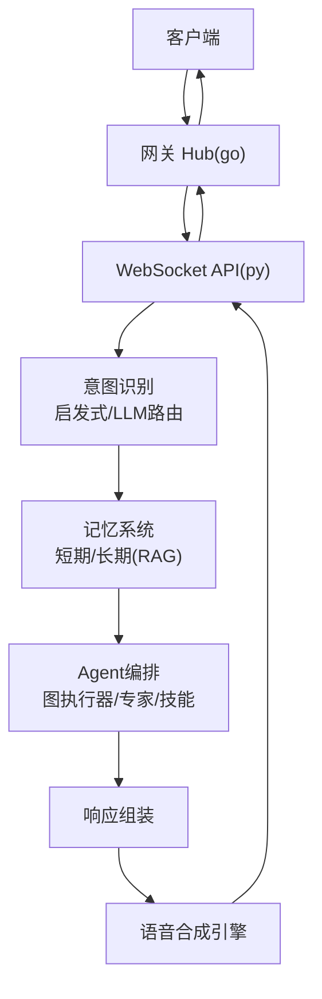
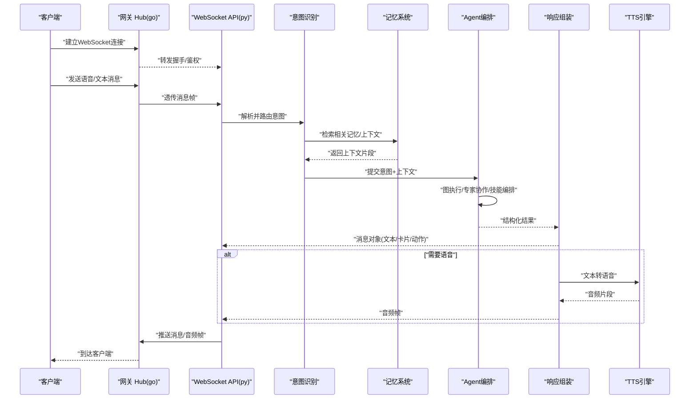
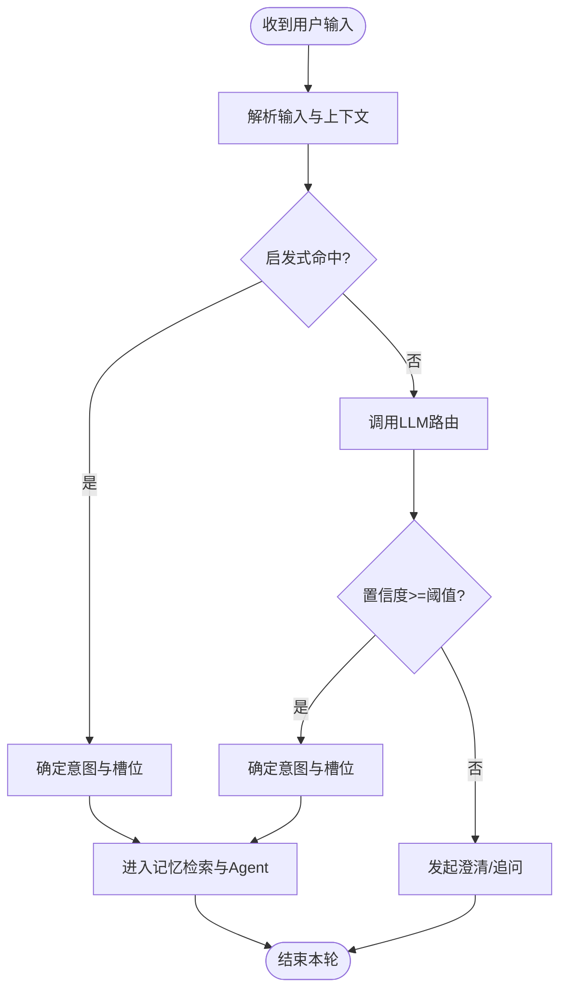
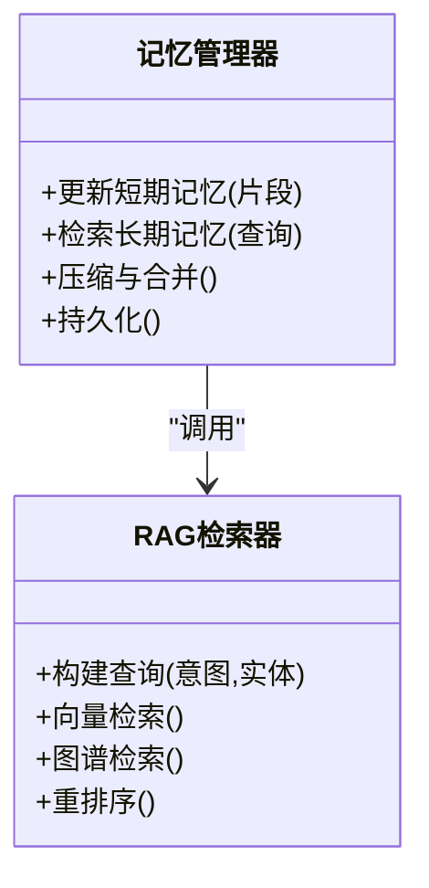
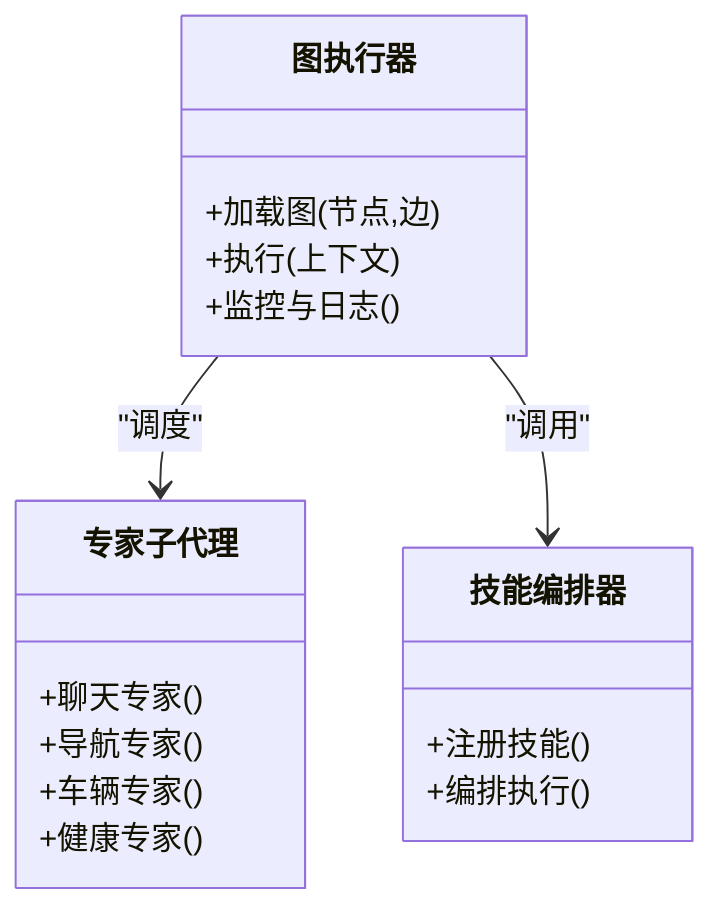
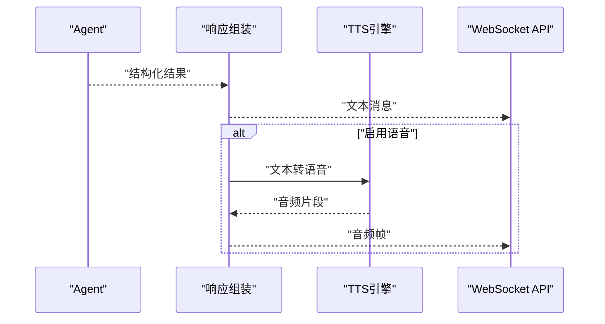
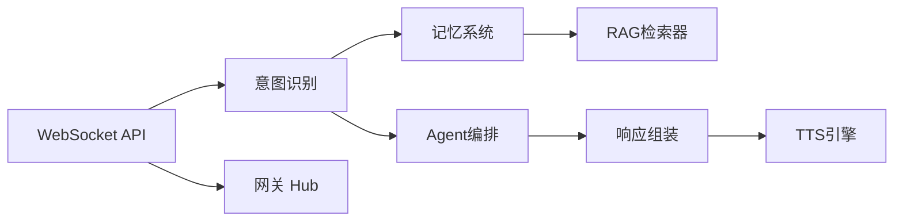

# 对话数据流

<cite>
**本文引用的文件**   
- [backend_design/nexus/api/websocket.py](file://backend_design/nexus/api/websocket.py)
- [backend_design/nexus/intent/router.py](file://backend_design/nexus/intent/router.py)
- [backend_design/nexus/intent/llm_router.py](file://backend_design/nexus/intent/llm_router.py)
- [backend_design/nexus/memory/manager.py](file://backend_design/nexus/memory/manager.py)
- [backend_design/nexus/agent/graph.py](file://backend_design/nexus/agent/graph.py)
- [backend_design/nexus/agent/responder.py](file://backend_design/nexus/agent/responder.py)
- [backend_design/nexus/tts/engine.py](file://backend_design/nexus/tts/engine.py)
- [backend_design/nexus/asr/engine.py](file://backend_design/nexus/asr/engine.py)
- [backend_design/nexus/middleware/session_store.py](file://backend_design/nexus/middleware/session_store.py)
- [backend_design/nexus/models/state.py](file://backend_design/nexus/models/state.py)
- [backend_design/nexus/core/cockpit_manager.py](file://backend_design/nexus/core/cockpit_manager.py)
- [backend_design/nexus/rag/unified_retriever.py](file://backend_design/nexus/rag/unified_retriever.py)
- [backend_design/nexus/skills/orchestrator.py](file://backend_design/nexus/skills/orchestrator.py)
- [backend_design/nexus_gate/internal/ws/hub.go](file://backend_design/nexus_gate/internal/ws/hub.go)
</cite>

## 目录
1. [简介](#简介)
2. [项目结构](#项目结构)
3. [核心组件](#核心组件)
4. [架构总览](#架构总览)
5. [详细组件分析](#详细组件分析)
6. [依赖分析](#依赖分析)
7. [性能考虑](#性能考虑)
8. [故障排查指南](#故障排查指南)
9. [结论](#结论)
10. [附录](#附录)

## 简介
本文件面向NexusCockpit的“对话数据流”，从WebSocket接入到最终语音输出，完整梳理用户请求的处理链路：消息接收→意图识别→记忆检索→Agent处理→响应生成→语音合成。文档重点说明每个环节的数据格式转换、状态管理与错误处理机制，并给出上下文维护、多轮对话同步与会话持久化的策略与实现要点。同时提供关键流程的图示与代码片段路径，便于快速定位与二次开发。

## 项目结构
围绕对话数据流的关键模块分布如下：
- 网关与WebSocket接入：Go侧网关Hub负责连接管理、鉴权与转发；Python侧API层暴露WebSocket端点，承载会话生命周期与路由分发。
- 意图识别：启发式规则与LLM路由组合，决定后续处理分支（闲聊、导航、车辆控制、健康等）。
- 记忆系统：会话级短期记忆与长期记忆（RAG）协同，支持压缩、冲突合并与检索。
- Agent编排：基于图结构的执行器，协调专家子代理、技能编排与工具调用。
- 响应与TTS：结构化响应组装、文本转语音与音频流回传。
- 中间件：会话存储、限流、缓存与任务队列，保障高可用与一致性。

图表来源
- [backend_design/nexus_gate/internal/ws/hub.go](file://backend_design/nexus_gate/internal/ws/hub.go)
- [backend_design/nexus/api/websocket.py](file://backend_design/nexus/api/websocket.py)
- [backend_design/nexus/intent/router.py](file://backend_design/nexus/intent/router.py)
- [backend_design/nexus/memory/manager.py](file://backend_design/nexus/memory/manager.py)
- [backend_design/nexus/agent/graph.py](file://backend_design/nexus/agent/graph.py)
- [backend_design/nexus/agent/responder.py](file://backend_design/nexus/agent/responder.py)
- [backend_design/nexus/tts/engine.py](file://backend_design/nexus/tts/engine.py)

章节来源
- [backend_design/nexus/api/websocket.py](file://backend_design/nexus/api/websocket.py)
- [backend_design/nexus_gate/internal/ws/hub.go](file://backend_design/nexus_gate/internal/ws/hub.go)

## 核心组件
- WebSocket接入与消息总线
  - Go网关Hub负责连接池、鉴权、心跳与消息转发。
  - Python API层定义WebSocket路由，解析协议帧，维护会话上下文，驱动意图识别与Agent执行。
- 意图识别
  - 启发式规则快速分流常见场景；复杂或模糊意图交由LLM路由进行语义理解与决策。
- 记忆系统
  - 短期记忆：会话窗口内的历史摘要与关键事实。
  - 长期记忆：通过RAG向量/图谱检索相关背景知识，结合压缩与冲突合并提升质量。
- Agent编排
  - 以图结构组织节点（规划、审查、确认、回复等），调度专家子代理与技能编排器，统一产出结构化结果。
- 响应与TTS
  - 将Agent输出转换为前端可渲染的消息对象，必要时触发TTS生成音频片段，按流式方式返回。
- 中间件与持久化
  - 会话存储、Redis缓存、任务队列与指标埋点贯穿全链路，确保幂等、可观测与容错。

章节来源
- [backend_design/nexus/api/websocket.py](file://backend_design/nexus/api/websocket.py)
- [backend_design/nexus/intent/router.py](file://backend_design/nexus/intent/router.py)
- [backend_design/nexus/intent/llm_router.py](file://backend_design/nexus/intent/llm_router.py)
- [backend_design/nexus/memory/manager.py](file://backend_design/nexus/memory/manager.py)
- [backend_design/nexus/agent/graph.py](file://backend_design/nexus/agent/graph.py)
- [backend_design/nexus/agent/responder.py](file://backend_design/nexus/agent/responder.py)
- [backend_design/nexus/tts/engine.py](file://backend_design/nexus/tts/engine.py)
- [backend_design/nexus/middleware/session_store.py](file://backend_design/nexus/middleware/session_store.py)
- [backend_design/nexus/models/state.py](file://backend_design/nexus/models/state.py)
- [backend_design/nexus/rag/unified_retriever.py](file://backend_design/nexus/rag/unified_retriever.py)
- [backend_design/nexus/skills/orchestrator.py](file://backend_design/nexus/skills/orchestrator.py)

## 架构总览
下图展示一次端到端对话请求在系统中的流转过程，包括网关、WS接口、意图、记忆、Agent、响应与TTS之间的交互顺序。

图表来源
- [backend_design/nexus_gate/internal/ws/hub.go](file://backend_design/nexus_gate/internal/ws/hub.go)
- [backend_design/nexus/api/websocket.py](file://backend_design/nexus/api/websocket.py)
- [backend_design/nexus/intent/router.py](file://backend_design/nexus/intent/router.py)
- [backend_design/nexus/memory/manager.py](file://backend_design/nexus/memory/manager.py)
- [backend_design/nexus/agent/graph.py](file://backend_design/nexus/agent/graph.py)
- [backend_design/nexus/agent/responder.py](file://backend_design/nexus/agent/responder.py)
- [backend_design/nexus/tts/engine.py](file://backend_design/nexus/tts/engine.py)

## 详细组件分析

### WebSocket消息处理
- 职责
  - 解析客户端消息（文本/语音/指令），校验权限与会话有效性。
  - 维护会话状态（会话ID、租户、用户标识、设备信息）。
  - 将消息投递至意图识别与后续处理管线，并将结果流式写回。
- 数据格式
  - 入站：统一消息帧（包含类型、会话ID、载荷、时间戳、签名等）。
  - 出站：事件流（文本片段、音频分片、进度、错误码与提示）。
- 状态管理
  - 会话上下文保存在内存与持久化存储中，支持断线重连恢复。
- 错误处理
  - 鉴权失败、会话不存在、消息格式异常、上游服务超时等均有明确错误码与重试策略。

章节来源
- [backend_design/nexus/api/websocket.py](file://backend_design/nexus/api/websocket.py)
- [backend_design/nexus/middleware/session_store.py](file://backend_design/nexus/middleware/session_store.py)
- [backend_design/nexus/models/state.py](file://backend_design/nexus/models/state.py)
- [backend_design/nexus/core/cockpit_manager.py](file://backend_design/nexus/core/cockpit_manager.py)

### 意图识别与路由
- 职责
  - 对输入进行意图分类与槽位抽取，选择最佳处理分支。
  - 简单场景使用启发式规则快速命中；复杂场景调用LLM路由进行推理。
- 数据格式
  - 输入：用户原始输入、会话上下文、领域词典。
  - 输出：意图标签、置信度、槽位、下一步动作建议。
- 决策逻辑
  - 阈值判定：高置信度直接路由；低置信度进入澄清或LLM路由。
  - 领域优先：车辆、导航、健康等垂直领域优先匹配。
- 错误处理
  - 规则库缺失、模型不可用、超时降级为默认闲聊或澄清。

图表来源
- [backend_design/nexus/intent/router.py](file://backend_design/nexus/intent/router.py)
- [backend_design/nexus/intent/llm_router.py](file://backend_design/nexus/intent/llm_router.py)

章节来源
- [backend_design/nexus/intent/router.py](file://backend_design/nexus/intent/router.py)
- [backend_design/nexus/intent/llm_router.py](file://backend_design/nexus/intent/llm_router.py)

### 记忆系统与RAG检索
- 职责
  - 短期记忆：维护最近N轮对话摘要与关键实体。
  - 长期记忆：通过RAG检索知识库（向量/图谱），增强回答准确性与个性化。
- 数据格式
  - 写入：结构化片段（主题、实体、时间、来源、权重）。
  - 读取：查询条件（意图、实体、时间窗），返回Top-K片段及相似度。
- 压缩与冲突
  - 定期压缩冗余片段，合并冲突事实，保留证据链与版本标记。
- 错误处理
  - 索引不可用、检索超时、空结果时回退到通用上下文或提示用户补充信息。

图表来源
- [backend_design/nexus/memory/manager.py](file://backend_design/nexus/memory/manager.py)
- [backend_design/nexus/rag/unified_retriever.py](file://backend_design/nexus/rag/unified_retriever.py)

章节来源
- [backend_design/nexus/memory/manager.py](file://backend_design/nexus/memory/manager.py)
- [backend_design/nexus/rag/unified_retriever.py](file://backend_design/nexus/rag/unified_retriever.py)

### Agent编排与执行
- 职责
  - 根据意图与上下文，规划执行步骤，调度专家子代理与技能编排器。
  - 统一收集工具调用结果，进行审查与确认，生成最终响应。
- 数据结构
  - 图节点：规划、检索、调用、审查、确认、回复等。
  - 边关系：条件跳转、并行扇出、聚合收敛。
- 错误处理
  - 节点失败重试、熔断降级、超时中断、人工确认兜底。

图表来源
- [backend_design/nexus/agent/graph.py](file://backend_design/nexus/agent/graph.py)
- [backend_design/nexus/skills/orchestrator.py](file://backend_design/nexus/skills/orchestrator.py)

章节来源
- [backend_design/nexus/agent/graph.py](file://backend_design/nexus/agent/graph.py)
- [backend_design/nexus/skills/orchestrator.py](file://backend_design/nexus/skills/orchestrator.py)

### 响应组装与TTS
- 职责
  - 将Agent结构化结果转换为前端消息对象（文本、卡片、动作、富媒体）。
  - 按需触发TTS，将文本转为音频片段，按流式推送。
- 数据格式
  - 文本消息：内容、样式、操作按钮。
  - 音频消息：编码格式、采样率、分片序号、时长。
- 错误处理
  - TTS不可用或超时：回退纯文本；音频丢包：客户端缓冲与重放。

图表来源
- [backend_design/nexus/agent/responder.py](file://backend_design/nexus/agent/responder.py)
- [backend_design/nexus/tts/engine.py](file://backend_design/nexus/tts/engine.py)
- [backend_design/nexus/api/websocket.py](file://backend_design/nexus/api/websocket.py)

章节来源
- [backend_design/nexus/agent/responder.py](file://backend_design/nexus/agent/responder.py)
- [backend_design/nexus/tts/engine.py](file://backend_design/nexus/tts/engine.py)

### ASR与语音输入
- 职责
  - 接收客户端语音流，进行实时或离线识别，输出文本供意图识别使用。
- 数据格式
  - 入站：PCM/Opus音频帧；出站：文本片段与置信度。
- 错误处理
  - 噪声过大、静音检测、识别超时等降级策略。

章节来源
- [backend_design/nexus/asr/engine.py](file://backend_design/nexus/asr/engine.py)

## 依赖分析
- 组件耦合
  - WebSocket API强依赖意图识别与记忆系统；意图识别可选依赖LLM路由；Agent编排依赖专家与技能编排器；响应与TTS相对独立。
- 外部依赖
  - 向量/图谱存储、TTS/ASR服务、Redis缓存、消息队列等。
- 潜在循环依赖
  - 通过接口抽象与事件总线解耦，避免直接循环导入。

图表来源
- [backend_design/nexus/api/websocket.py](file://backend_design/nexus/api/websocket.py)
- [backend_design/nexus/intent/router.py](file://backend_design/nexus/intent/router.py)
- [backend_design/nexus/memory/manager.py](file://backend_design/nexus/memory/manager.py)
- [backend_design/nexus/rag/unified_retriever.py](file://backend_design/nexus/rag/unified_retriever.py)
- [backend_design/nexus/agent/graph.py](file://backend_design/nexus/agent/graph.py)
- [backend_design/nexus/agent/responder.py](file://backend_design/nexus/agent/responder.py)
- [backend_design/nexus/tts/engine.py](file://backend_design/nexus/tts/engine.py)
- [backend_design/nexus_gate/internal/ws/hub.go](file://backend_design/nexus_gate/internal/ws/hub.go)

章节来源
- [backend_design/nexus/api/websocket.py](file://backend_design/nexus/api/websocket.py)
- [backend_design/nexus/intent/router.py](file://backend_design/nexus/intent/router.py)
- [backend_design/nexus/memory/manager.py](file://backend_design/nexus/memory/manager.py)
- [backend_design/nexus/rag/unified_retriever.py](file://backend_design/nexus/rag/unified_retriever.py)
- [backend_design/nexus/agent/graph.py](file://backend_design/nexus/agent/graph.py)
- [backend_design/nexus/agent/responder.py](file://backend_design/nexus/agent/responder.py)
- [backend_design/nexus/tts/engine.py](file://backend_design/nexus/tts/engine.py)
- [backend_design/nexus_gate/internal/ws/hub.go](file://backend_design/nexus_gate/internal/ws/hub.go)

## 性能考虑
- 流式处理
  - 文本与音频均按分片流式传输，降低首字延迟与带宽占用。
- 缓存与去重
  - 高频问答与工具结果缓存；重复请求去抖。
- 并发与批处理
  - 意图识别与RAG检索并行化；批量写入记忆与日志。
- 资源隔离
  - 不同领域专家与技能使用独立线程池/进程池，避免相互影响。
- 降级与熔断
  - 模型或服务不可用时快速降级，保证用户体验。

## 故障排查指南
- 常见问题
  - 连接断开：检查网关心跳与重连策略；确认鉴权令牌有效。
  - 意图误判：查看启发式规则命中情况与LLM路由置信度；调整阈值与领域词典。
  - 记忆检索为空：检查索引状态与查询条件；验证压缩与冲突合并是否过度裁剪。
  - Agent执行失败：定位具体节点错误码；查看重试与熔断配置。
  - TTS无音：确认音频编码与采样率；检查网络抖动与客户端缓冲。
- 诊断手段
  - 开启链路追踪与指标采集；导出关键节点耗时与错误分布。
  - 回放会话快照，对比记忆片段与检索结果。

章节来源
- [backend_design/nexus/core/cockpit_manager.py](file://backend_design/nexus/core/cockpit_manager.py)
- [backend_design/nexus/middleware/session_store.py](file://backend_design/nexus/middleware/session_store.py)
- [backend_design/nexus/models/state.py](file://backend_design/nexus/models/state.py)

## 结论
NexusCockpit的对话数据流以WebSocket为入口，通过意图识别与记忆系统增强理解能力，借助Agent编排完成复杂任务，最终以文本与语音双通道交付。整体设计强调模块化、可观测与高可用，具备较强的扩展性与工程落地性。建议在持续优化方向上关注检索质量、意图鲁棒性与端到端延迟。

## 附录
- 关键数据流转示例（以路径引用代替代码）
  - WebSocket消息处理入口：[websocket.py](file://backend_design/nexus/api/websocket.py)
  - 意图路由决策：[router.py](file://backend_design/nexus/intent/router.py)、[llm_router.py](file://backend_design/nexus/intent/llm_router.py)
  - 记忆检索与压缩：[memory/manager.py](file://backend_design/nexus/memory/manager.py)、[rag/unified_retriever.py](file://backend_design/nexus/rag/unified_retriever.py)
  - Agent图执行与专家调度：[agent/graph.py](file://backend_design/nexus/agent/graph.py)、[skills/orchestrator.py](file://backend_design/nexus/skills/orchestrator.py)
  - 响应组装与TTS：[agent/responder.py](file://backend_design/nexus/agent/responder.py)、[tts/engine.py](file://backend_design/nexus/tts/engine.py)
  - 会话持久化与状态：[middleware/session_store.py](file://backend_design/nexus/middleware/session_store.py)、[models/state.py](file://backend_design/nexus/models/state.py)
  - 网关连接管理：[hub.go](file://backend_design/nexus_gate/internal/ws/hub.go)
  - 语音输入ASR：[asr/engine.py](file://backend_design/nexus/asr/engine.py)