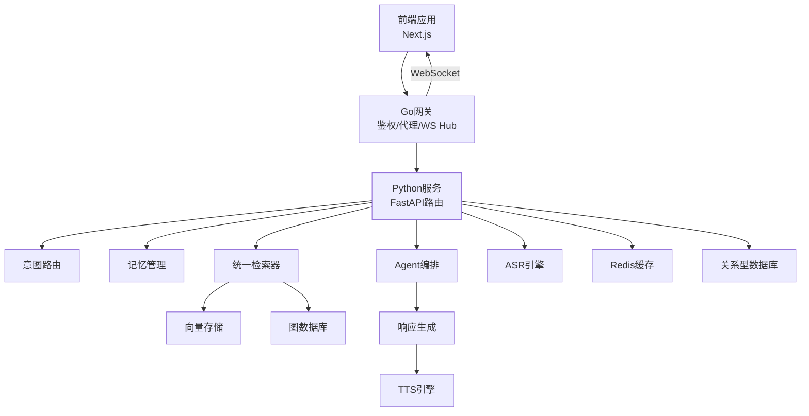
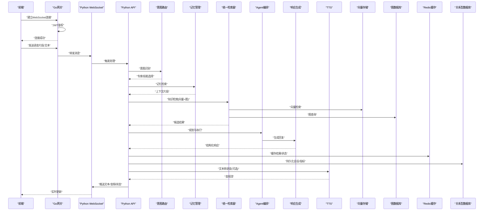
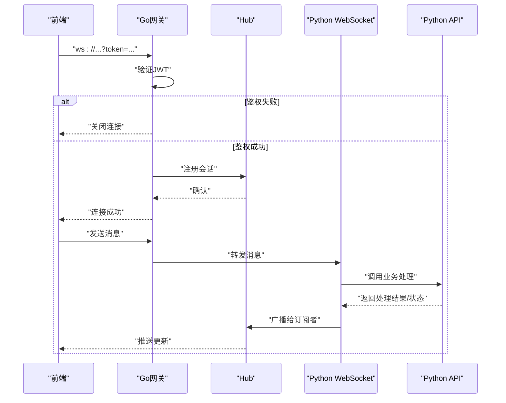
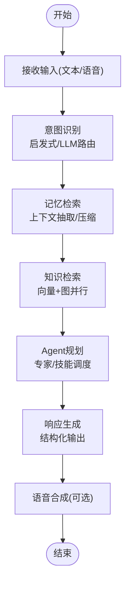
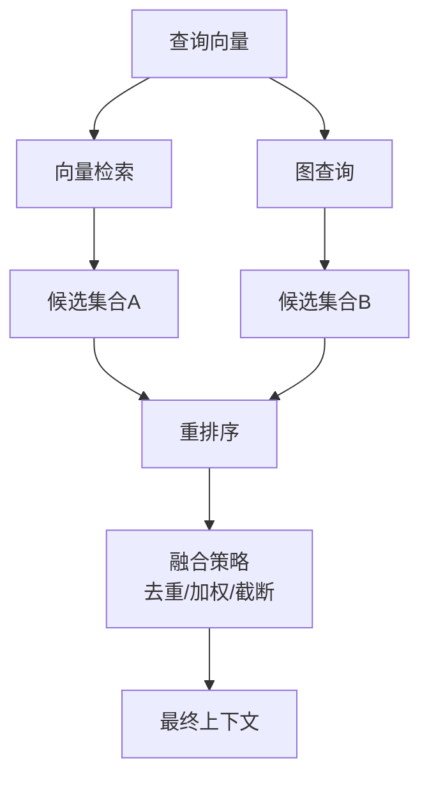
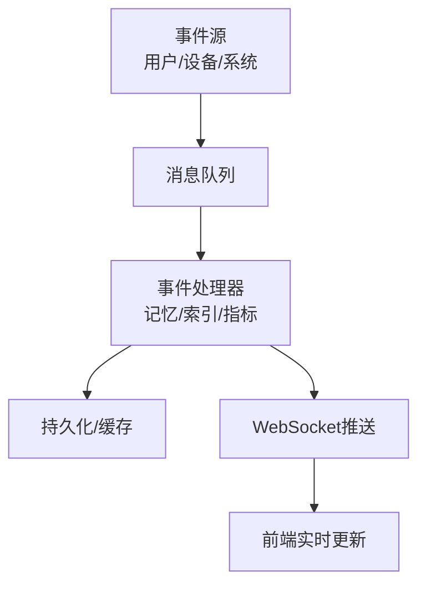
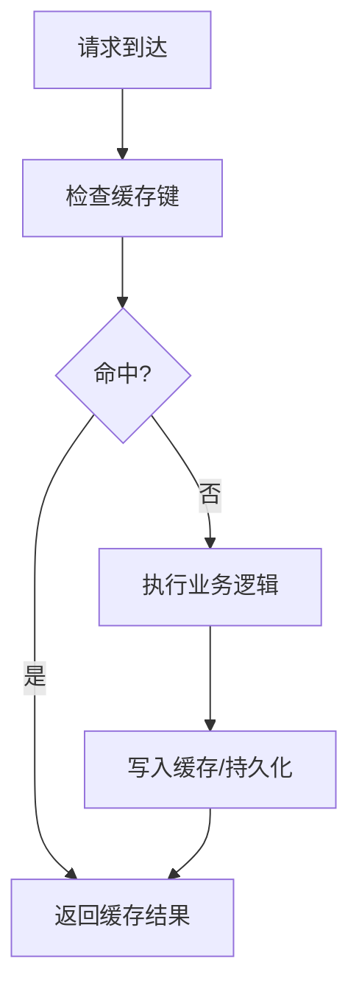
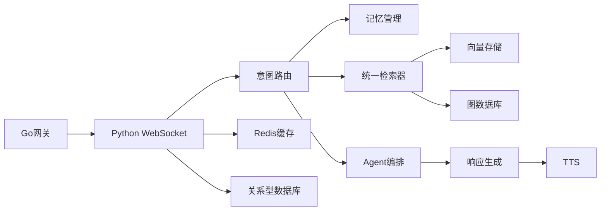

# 数据流架构

<cite>
**本文引用的文件**   
- [backend_design/nexus/main.py](file://backend_design/nexus/main.py)
- [backend_design/nexus/api/websocket.py](file://backend_design/nexus/api/websocket.py)
- [backend_design/nexus/intent/router.py](file://backend_design/nexus/intent/router.py)
- [backend_design/nexus/intent/llm_router.py](file://backend_design/nexus/intent/llm_router.py)
- [backend_design/nexus/memory/manager.py](file://backend_design/nexus/memory/manager.py)
- [backend_design/nexus/rag/unified_retriever.py](file://backend_design/nexus/rag/unified_retriever.py)
- [backend_design/nexus/rag/vector_store.py](file://backend_design/nexus/rag/vector_store.py)
- [backend_design/nexus/rag/graph_store.py](file://backend_design/nexus/rag/graph_store.py)
- [backend_design/nexus/rag/reranker_base.py](file://backend_design/nexus/rag/reranker_base.py)
- [backend_design/nexus/rag/siliconflow_reranker.py](file://backend_design/nexus/rag/siliconflow_reranker.py)
- [backend_design/nexus/agent/planner.py](file://backend_design/nexus/agent/planner.py)
- [backend_design/nexus/agent/responder.py](file://backend_design/nexus/agent/responder.py)
- [backend_design/nexus/asr/engine.py](file://backend_design/nexus/asr/engine.py)
- [backend_design/nexus/tts/engine.py](file://backend_design/nexus/tts/engine.py)
- [backend_design/nexus/middleware/session_store.py](file://backend_design/nexus/middleware/session_store.py)
- [backend_design/nexus/middleware/redis_cache.py](file://backend_design/nexus/middleware/redis_cache.py)
- [backend_design/nexus/core/db_manager.py](file://backend_design/nexus/core/db_manager.py)
- [backend_design/nexus/models/state.py](file://backend_design/nexus/models/state.py)
- [backend_design/nexus_gate/internal/ws/hub.go](file://backend_design/nexus_gate/internal/ws/hub.go)
- [backend_design/nexus_gate/internal/proxy/proxy.go](file://backend_design/nexus_gate/internal/proxy/proxy.go)
- [backend_design/nexus_gate/internal/auth/jwt.go](file://backend_design/nexus_gate/internal/auth/jwt.go)
</cite>

## 目录
1. [简介](#简介)
2. [项目结构](#项目结构)
3. [核心组件](#核心组件)
4. [架构总览](#架构总览)
5. [详细组件分析](#详细组件分析)
6. [依赖分析](#依赖分析)
7. [性能考虑](#性能考虑)
8. [故障排查指南](#故障排查指南)
9. [结论](#结论)
10. [附录](#附录)

## 简介
本文件面向NexusCockpit的数据流架构，聚焦以下目标：
- 描述前端到后端的数据流转：WebSocket连接建立、消息传递与状态同步。
- 解释Agent系统的数据流链路：意图识别→记忆检索→知识查询→响应生成→语音合成。
- 阐述RAG系统的数据处理流程：向量检索、图数据库查询、结果重排序与融合策略。
- 说明实时数据流处理：事件驱动架构与消息队列使用。
- 给出数据缓存策略、内存管理与持久化方案。
- 提供数据流图与时序图，展示关键业务流程的数据走向。

## 项目结构
后端采用Python服务（nexus）与Go网关（nexus_gate）协同：
- Go网关负责鉴权、反向代理与WebSocket Hub广播。
- Python服务承载业务逻辑：ASR/TTS、意图路由、记忆管理、RAG检索、Agent编排、API/WebSocket接口等。
- 中间件层提供会话存储、Redis缓存与任务队列能力。
- 模型与外部资源通过配置与脚本初始化。

图表来源
- [backend_design/nexus/main.py](file://backend_design/nexus/main.py)
- [backend_design/nexus_gate/internal/ws/hub.go](file://backend_design/nexus_gate/internal/ws/hub.go)
- [backend_design/nexus_gate/internal/proxy/proxy.go](file://backend_design/nexus_gate/internal/proxy/proxy.go)
- [backend_design/nexus/intent/router.py](file://backend_design/nexus/intent/router.py)
- [backend_design/nexus/memory/manager.py](file://backend_design/nexus/memory/manager.py)
- [backend_design/nexus/rag/unified_retriever.py](file://backend_design/nexus/rag/unified_retriever.py)
- [backend_design/nexus/rag/vector_store.py](file://backend_design/nexus/rag/vector_store.py)
- [backend_design/nexus/rag/graph_store.py](file://backend_design/nexus/rag/graph_store.py)
- [backend_design/nexus/agent/planner.py](file://backend_design/nexus/agent/planner.py)
- [backend_design/nexus/agent/responder.py](file://backend_design/nexus/agent/responder.py)
- [backend_design/nexus/asr/engine.py](file://backend_design/nexus/asr/engine.py)
- [backend_design/nexus/tts/engine.py](file://backend_design/nexus/tts/engine.py)
- [backend_design/nexus/middleware/redis_cache.py](file://backend_design/nexus/middleware/redis_cache.py)
- [backend_design/nexus/core/db_manager.py](file://backend_design/nexus/core/db_manager.py)

章节来源
- [backend_design/nexus/main.py](file://backend_design/nexus/main.py)
- [backend_design/nexus_gate/internal/ws/hub.go](file://backend_design/nexus_gate/internal/ws/hub.go)
- [backend_design/nexus_gate/internal/proxy/proxy.go](file://backend_design/nexus_gate/internal/proxy/proxy.go)

## 核心组件
- WebSocket网关与Hub：负责客户端连接、鉴权校验、消息转发与会话广播。
- 意图路由：基于启发式或LLM的意图分类与专家选择。
- 记忆管理：对话历史压缩、冲突合并与持久化。
- RAG统一检索器：聚合向量与图检索，执行重排序与融合。
- Agent编排：规划、子智能体监控、审查与回复生成。
- ASR/TTS：语音转文本与文本转语音。
- 中间件：会话存储、Redis缓存、任务队列。
- 数据访问：关系型数据库与对象存储。

章节来源
- [backend_design/nexus/api/websocket.py](file://backend_design/nexus/api/websocket.py)
- [backend_design/nexus/intent/router.py](file://backend_design/nexus/intent/router.py)
- [backend_design/nexus/intent/llm_router.py](file://backend_design/nexus/intent/llm_router.py)
- [backend_design/nexus/memory/manager.py](file://backend_design/nexus/memory/manager.py)
- [backend_design/nexus/rag/unified_retriever.py](file://backend_design/nexus/rag/unified_retriever.py)
- [backend_design/nexus/rag/vector_store.py](file://backend_design/nexus/rag/vector_store.py)
- [backend_design/nexus/rag/graph_store.py](file://backend_design/nexus/rag/graph_store.py)
- [backend_design/nexus/rag/reranker_base.py](file://backend_design/nexus/rag/reranker_base.py)
- [backend_design/nexus/rag/siliconflow_reranker.py](file://backend_design/nexus/rag/siliconflow_reranker.py)
- [backend_design/nexus/agent/planner.py](file://backend_design/nexus/agent/planner.py)
- [backend_design/nexus/agent/responder.py](file://backend_design/nexus/agent/responder.py)
- [backend_design/nexus/asr/engine.py](file://backend_design/nexus/asr/engine.py)
- [backend_design/nexus/tts/engine.py](file://backend_design/nexus/tts/engine.py)
- [backend_design/nexus/middleware/session_store.py](file://backend_design/nexus/middleware/session_store.py)
- [backend_design/nexus/middleware/redis_cache.py](file://backend_design/nexus/middleware/redis_cache.py)
- [backend_design/nexus/core/db_manager.py](file://backend_design/nexus/core/db_manager.py)

## 架构总览
整体数据流分为两条主线：
- 实时交互线：前端→Go网关→Python服务→Agent/RAG→返回结果→WebSocket推送。
- 离线/异步线：任务队列→批处理→持久化→缓存更新。

图表来源
- [backend_design/nexus_gate/internal/ws/hub.go](file://backend_design/nexus_gate/internal/ws/hub.go)
- [backend_design/nexus_gate/internal/auth/jwt.go](file://backend_design/nexus_gate/internal/auth/jwt.go)
- [backend_design/nexus/api/websocket.py](file://backend_design/nexus/api/websocket.py)
- [backend_design/nexus/intent/router.py](file://backend_design/nexus/intent/router.py)
- [backend_design/nexus/memory/manager.py](file://backend_design/nexus/memory/manager.py)
- [backend_design/nexus/rag/unified_retriever.py](file://backend_design/nexus/rag/unified_retriever.py)
- [backend_design/nexus/rag/vector_store.py](file://backend_design/nexus/rag/vector_store.py)
- [backend_design/nexus/rag/graph_store.py](file://backend_design/nexus/rag/graph_store.py)
- [backend_design/nexus/agent/planner.py](file://backend_design/nexus/agent/planner.py)
- [backend_design/nexus/agent/responder.py](file://backend_design/nexus/agent/responder.py)
- [backend_design/nexus/tts/engine.py](file://backend_design/nexus/tts/engine.py)
- [backend_design/nexus/middleware/redis_cache.py](file://backend_design/nexus/middleware/redis_cache.py)
- [backend_design/nexus/core/db_manager.py](file://backend_design/nexus/core/db_manager.py)

## 详细组件分析

### WebSocket连接与消息通道
- 连接建立：前端通过Go网关发起WebSocket握手；网关进行JWT鉴权并维护Hub会话表；通过后转发至Python服务的WebSocket处理器。
- 消息分发：网关将客户端消息按会话ID路由到对应Python处理器；Python侧根据消息类型（文本/语音/控制指令）进入不同处理分支。
- 状态同步：Python服务在处理过程中向Hub推送中间状态（如“正在思考”、“检索中”），最终推送完成态与结果（文本/音频）。

图表来源
- [backend_design/nexus_gate/internal/ws/hub.go](file://backend_design/nexus_gate/internal/ws/hub.go)
- [backend_design/nexus_gate/internal/auth/jwt.go](file://backend_design/nexus_gate/internal/auth/jwt.go)
- [backend_design/nexus/api/websocket.py](file://backend_design/nexus/api/websocket.py)

章节来源
- [backend_design/nexus_gate/internal/ws/hub.go](file://backend_design/nexus_gate/internal/ws/hub.go)
- [backend_design/nexus_gate/internal/auth/jwt.go](file://backend_design/nexus_gate/internal/auth/jwt.go)
- [backend_design/nexus/api/websocket.py](file://backend_design/nexus/api/websocket.py)

### Agent系统数据流：意图→记忆→知识→生成→语音
- 意图识别：接收用户输入，先走启发式规则快速分流，必要时调用LLM路由提升准确率。
- 记忆检索：从会话上下文中抽取相关片段，支持压缩与冲突合并，减少上下文噪声。
- 知识查询：通过统一检索器并行调用向量与图检索，得到候选集。
- 响应生成：由Agent编排决定执行路径，调用专家/技能，最终由响应器生成结构化输出。
- 语音合成：对文本结果进行TTS，生成音频流回推前端。

图表来源
- [backend_design/nexus/intent/router.py](file://backend_design/nexus/intent/router.py)
- [backend_design/nexus/intent/llm_router.py](file://backend_design/nexus/intent/llm_router.py)
- [backend_design/nexus/memory/manager.py](file://backend_design/nexus/memory/manager.py)
- [backend_design/nexus/rag/unified_retriever.py](file://backend_design/nexus/rag/unified_retriever.py)
- [backend_design/nexus/agent/planner.py](file://backend_design/nexus/agent/planner.py)
- [backend_design/nexus/agent/responder.py](file://backend_design/nexus/agent/responder.py)
- [backend_design/nexus/tts/engine.py](file://backend_design/nexus/tts/engine.py)

章节来源
- [backend_design/nexus/intent/router.py](file://backend_design/nexus/intent/router.py)
- [backend_design/nexus/intent/llm_router.py](file://backend_design/nexus/intent/llm_router.py)
- [backend_design/nexus/memory/manager.py](file://backend_design/nexus/memory/manager.py)
- [backend_design/nexus/rag/unified_retriever.py](file://backend_design/nexus/rag/unified_retriever.py)
- [backend_design/nexus/agent/planner.py](file://backend_design/nexus/agent/planner.py)
- [backend_design/nexus/agent/responder.py](file://backend_design/nexus/agent/responder.py)
- [backend_design/nexus/tts/engine.py](file://backend_design/nexus/tts/engine.py)

### RAG数据处理流程：向量检索、图查询、重排序与融合
- 向量检索：将查询嵌入后在向量库中进行相似度搜索，返回Top-K候选。
- 图查询：基于实体/关系进行图遍历或模式匹配，获取结构化知识。
- 重排序：对候选结果进行相关性打分与重排，支持外部reranker服务。
- 融合策略：将向量与图结果去重、加权融合，形成最终上下文。

图表来源
- [backend_design/nexus/rag/unified_retriever.py](file://backend_design/nexus/rag/unified_retriever.py)
- [backend_design/nexus/rag/vector_store.py](file://backend_design/nexus/rag/vector_store.py)
- [backend_design/nexus/rag/graph_store.py](file://backend_design/nexus/rag/graph_store.py)
- [backend_design/nexus/rag/reranker_base.py](file://backend_design/nexus/rag/reranker_base.py)
- [backend_design/nexus/rag/siliconflow_reranker.py](file://backend_design/nexus/rag/siliconflow_reranker.py)

章节来源
- [backend_design/nexus/rag/unified_retriever.py](file://backend_design/nexus/rag/unified_retriever.py)
- [backend_design/nexus/rag/vector_store.py](file://backend_design/nexus/rag/vector_store.py)
- [backend_design/nexus/rag/graph_store.py](file://backend_design/nexus/rag/graph_store.py)
- [backend_design/nexus/rag/reranker_base.py](file://backend_design/nexus/rag/reranker_base.py)
- [backend_design/nexus/rag/siliconflow_reranker.py](file://backend_design/nexus/rag/siliconflow_reranker.py)

### 实时数据流与事件驱动
- 事件源：用户输入、车辆遥测、系统告警等。
- 事件总线：通过中间件的任务队列进行解耦与削峰填谷。
- 消费者：记忆更新、索引构建、指标采集、通知推送等。
- 状态同步：处理进度与结果通过WebSocket推送至前端。

[此图为概念性流程图，不直接映射具体源码文件]

### 数据缓存、内存管理与持久化
- 缓存策略：热点会话上下文、检索结果、TTS音频片段写入Redis，设置过期时间与容量上限。
- 内存管理：大对象（音频/长上下文）采用分块与流式处理，避免一次性加载导致OOM。
- 持久化：会话元数据、日志与指标写入关系型数据库；媒体文件落盘或对象存储。

[此图为概念性流程图，不直接映射具体源码文件]

## 依赖分析
- 网关与服务耦合点：WebSocket协议、鉴权令牌格式、消息协议定义。
- 服务内部依赖：意图路由依赖记忆与RAG；RAG依赖向量与图存储；Agent编排依赖响应器与技能。
- 外部依赖：向量库、图数据库、Redis、关系型数据库、TTS/ASR模型。

图表来源
- [backend_design/nexus_gate/internal/ws/hub.go](file://backend_design/nexus_gate/internal/ws/hub.go)
- [backend_design/nexus/api/websocket.py](file://backend_design/nexus/api/websocket.py)
- [backend_design/nexus/intent/router.py](file://backend_design/nexus/intent/router.py)
- [backend_design/nexus/memory/manager.py](file://backend_design/nexus/memory/manager.py)
- [backend_design/nexus/rag/unified_retriever.py](file://backend_design/nexus/rag/unified_retriever.py)
- [backend_design/nexus/rag/vector_store.py](file://backend_design/nexus/rag/vector_store.py)
- [backend_design/nexus/rag/graph_store.py](file://backend_design/nexus/rag/graph_store.py)
- [backend_design/nexus/agent/planner.py](file://backend_design/nexus/agent/planner.py)
- [backend_design/nexus/agent/responder.py](file://backend_design/nexus/agent/responder.py)
- [backend_design/nexus/tts/engine.py](file://backend_design/nexus/tts/engine.py)
- [backend_design/nexus/middleware/redis_cache.py](file://backend_design/nexus/middleware/redis_cache.py)
- [backend_design/nexus/core/db_manager.py](file://backend_design/nexus/core/db_manager.py)

章节来源
- [backend_design/nexus/api/websocket.py](file://backend_design/nexus/api/websocket.py)
- [backend_design/nexus/intent/router.py](file://backend_design/nexus/intent/router.py)
- [backend_design/nexus/rag/unified_retriever.py](file://backend_design/nexus/rag/unified_retriever.py)
- [backend_design/nexus/agent/planner.py](file://backend_design/nexus/agent/planner.py)
- [backend_design/nexus/tts/engine.py](file://backend_design/nexus/tts/engine.py)
- [backend_design/nexus/middleware/redis_cache.py](file://backend_design/nexus/middleware/redis_cache.py)
- [backend_design/nexus/core/db_manager.py](file://backend_design/nexus/core/db_manager.py)

## 性能考虑
- 并发与吞吐：WebSocket Hub与Python服务均支持高并发；对耗时操作（RAG、TTS）采用异步与流式处理。
- 缓存命中率：合理设计缓存键与过期时间，降低重复计算与IO压力。
- 检索优化：向量检索Top-K与图查询深度需平衡召回率与延迟；重排序仅在必要场景启用。
- 内存峰值控制：音频与大上下文分块处理，避免堆溢出。
- 降级与熔断：外部服务不可用时回退到本地缓存或默认策略。

[本节为通用指导，无需源码引用]

## 故障排查指南
- 连接问题：检查网关JWT鉴权与证书配置；确认WebSocket握手是否成功。
- 消息丢失：核对Hub会话表与消息路由键；检查Python WebSocket处理器异常日志。
- 检索慢：查看向量与图数据库健康状态；调整Top-K与重排序开关。
- 语音问题：确认ASR/TTS模型可用性与音频编码格式；检查音频流传输错误。
- 缓存失效：验证Redis连通性与键空间；观察缓存命中率与淘汰策略。

章节来源
- [backend_design/nexus_gate/internal/auth/jwt.go](file://backend_design/nexus_gate/internal/auth/jwt.go)
- [backend_design/nexus_gate/internal/ws/hub.go](file://backend_design/nexus_gate/internal/ws/hub.go)
- [backend_design/nexus/api/websocket.py](file://backend_design/nexus/api/websocket.py)
- [backend_design/nexus/rag/unified_retriever.py](file://backend_design/nexus/rag/unified_retriever.py)
- [backend_design/nexus/asr/engine.py](file://backend_design/nexus/asr/engine.py)
- [backend_design/nexus/tts/engine.py](file://backend_design/nexus/tts/engine.py)
- [backend_design/nexus/middleware/redis_cache.py](file://backend_design/nexus/middleware/redis_cache.py)

## 结论
NexusCockpit的数据流以Go网关与Python服务为核心，结合WebSocket实现低延迟实时交互；Agent与RAG共同构成智能问答主链路；中间件与存储层保障可扩展性与可靠性。通过合理的缓存、流式处理与降级策略，系统在复杂场景下仍能保持良好体验。

[本节为总结性内容，无需源码引用]

## 附录
- 关键状态模型：会话状态、任务状态与指标上报字段定义可参考状态模型文件。
- 配置项：网关、服务、RAG、缓存与数据库的连接参数与超时策略建议集中管理。

章节来源
- [backend_design/nexus/models/state.py](file://backend_design/nexus/models/state.py)