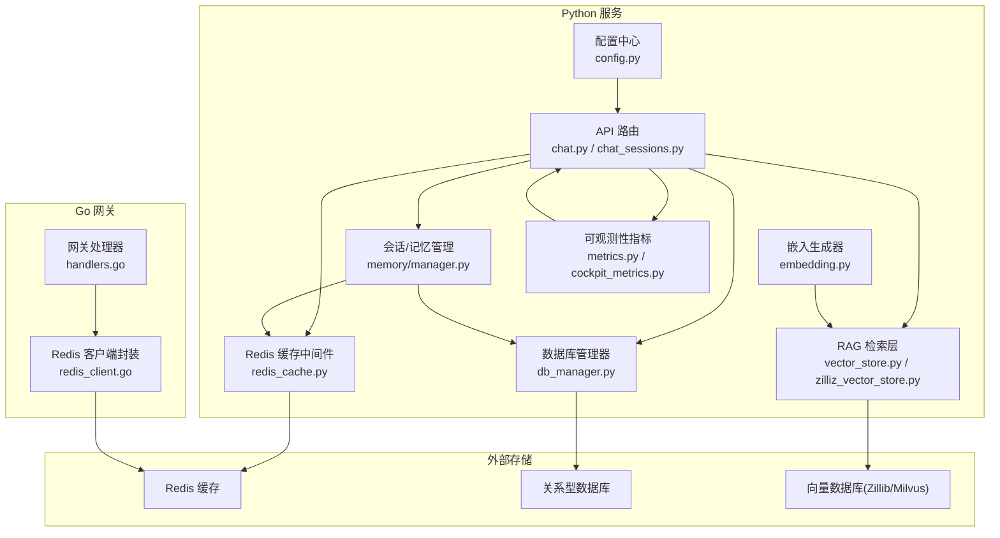
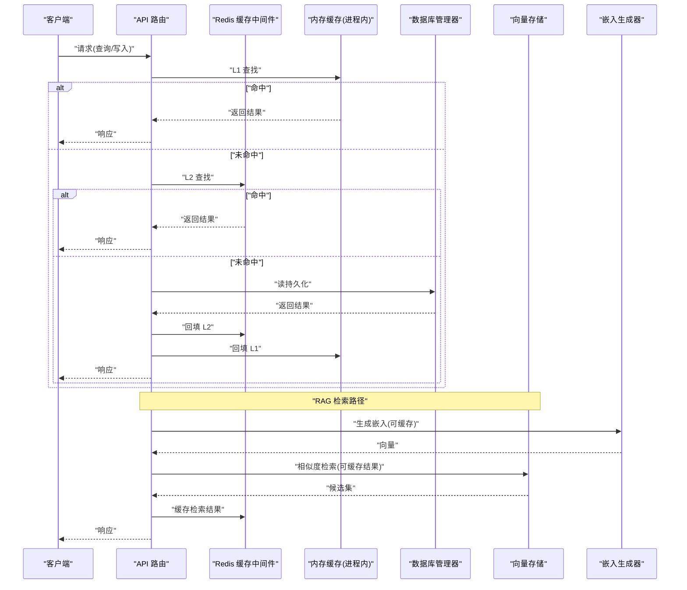
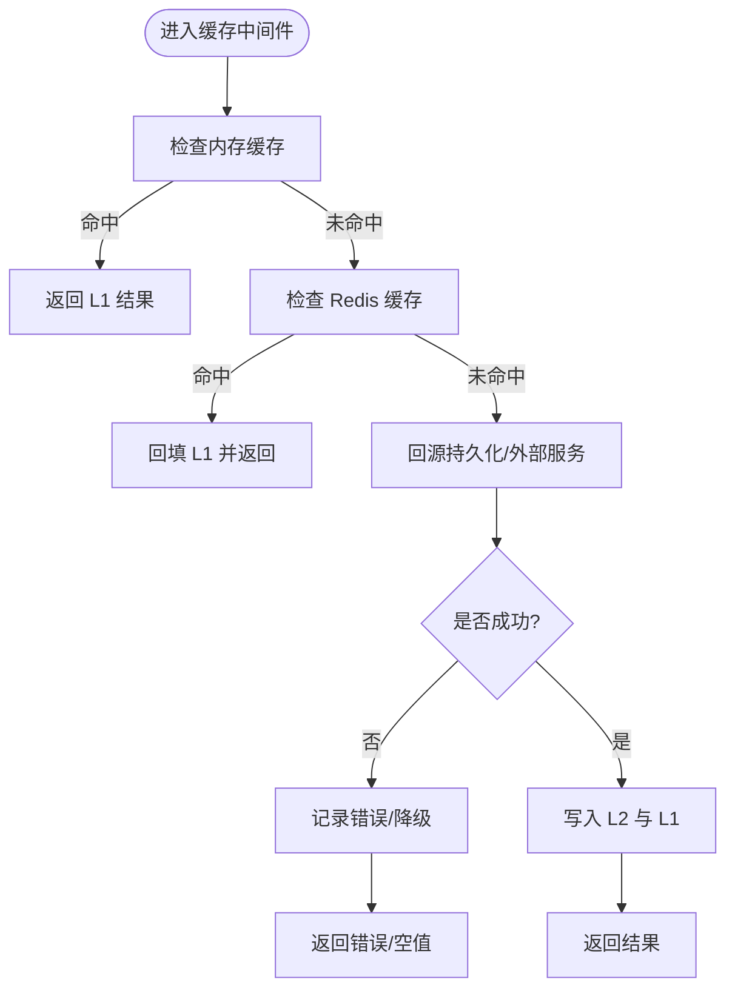
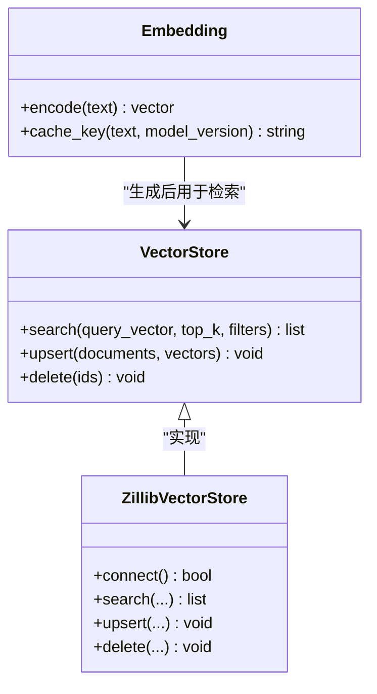
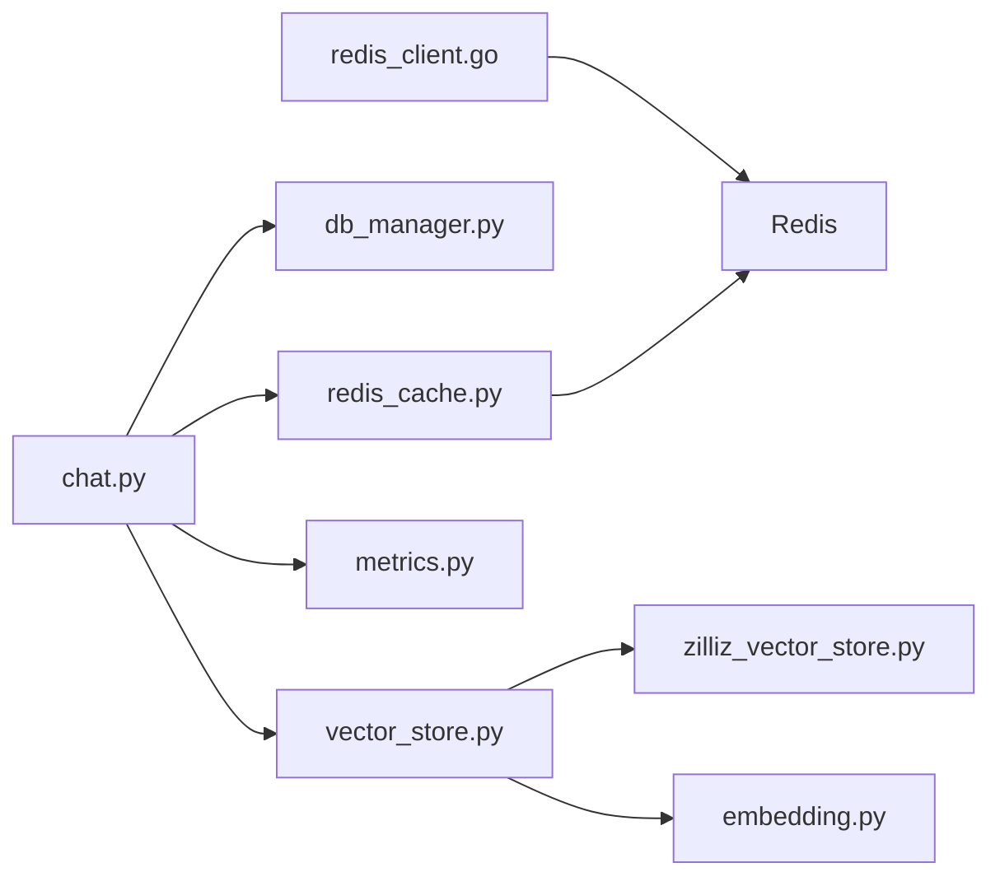

# 数据缓存策略

<cite>
**本文引用的文件**   
- [backend_design/nexus/middleware/redis_cache.py](file://backend_design/nexus/middleware/redis_cache.py)
- [backend_design/nexus/core/db_manager.py](file://backend_design/nexus/core/db_manager.py)
- [backend_design/nexus/rag/vector_store.py](file://backend_design/nexus/rag/vector_store.py)
- [backend_design/nexus/rag/zilliz_vector_store.py](file://backend_design/nexus/rag/zilliz_vector_store.py)
- [backend_design/nexus/rag/embedding.py](file://backend_design/nexus/rag/embedding.py)
- [backend_design/nexus/api/routes/chat.py](file://backend_design/nexus/api/routes/chat.py)
- [backend_design/nexus/api/routes/chat_sessions.py](file://backend_design/nexus/api/routes/chat_sessions.py)
- [backend_design/nexus/memory/manager.py](file://backend_design/nexus/memory/manager.py)
- [backend_design/nexus/models/state.py](file://backend_design/nexus/models/state.py)
- [backend_design/nexus/observability/cockpit_metrics.py](file://backend_design/nexus/observability/cockpit_metrics.py)
- [backend_design/nexus/observability/metrics.py](file://backend_design/nexus/observability/metrics.py)
- [backend_design/nexus/config.py](file://backend_design/nexus/config.py)
- [backend_design/nexus_gate/internal/handlers/redis_client.go](file://backend_design/nexus_gate/internal/handlers/redis_client.go)
</cite>

## 目录
1. [简介](#简介)
2. [项目结构](#项目结构)
3. [核心组件](#核心组件)
4. [架构总览](#架构总览)
5. [详细组件分析](#详细组件分析)
6. [依赖分析](#依赖分析)
7. [性能考虑](#性能考虑)
8. [故障排查指南](#故障排查指南)
9. [结论](#结论)
10. [附录](#附录)

## 简介
本文件为 NexusCockpit 的数据缓存策略文档，围绕多级缓存架构（内存缓存、Redis 缓存、数据库/向量库持久化）展开，覆盖对话历史、知识向量、用户偏好等关键数据类型的缓存策略与过期机制；同时给出缓存一致性保证、热数据预热、失效策略、向量嵌入缓存、搜索结果缓存、模型输出缓存的具体实现建议，并提供监控指标、命中率统计与容量规划建议。

## 项目结构
NexusCockpit 后端采用 Python 服务 + Go 网关的混合架构：
- Python 服务负责业务逻辑、RAG 检索、会话管理、中间件（含 Redis 缓存）、可观测性指标等。
- Go 网关提供鉴权、限流、WebSocket 转发，并复用 Redis 作为共享状态存储。

图表来源
- [backend_design/nexus/api/routes/chat.py](file://backend_design/nexus/api/routes/chat.py)
- [backend_design/nexus/api/routes/chat_sessions.py](file://backend_design/nexus/api/routes/chat_sessions.py)
- [backend_design/nexus/middleware/redis_cache.py](file://backend_design/nexus/middleware/redis_cache.py)
- [backend_design/nexus/core/db_manager.py](file://backend_design/nexus/core/db_manager.py)
- [backend_design/nexus/rag/vector_store.py](file://backend_design/nexus/rag/vector_store.py)
- [backend_design/nexus/rag/zilliz_vector_store.py](file://backend_design/nexus/rag/zilliz_vector_store.py)
- [backend_design/nexus/rag/embedding.py](file://backend_design/nexus/rag/embedding.py)
- [backend_design/nexus/memory/manager.py](file://backend_design/nexus/memory/manager.py)
- [backend_design/nexus/observability/metrics.py](file://backend_design/nexus/observability/metrics.py)
- [backend_design/nexus/observability/cockpit_metrics.py](file://backend_design/nexus/observability/cockpit_metrics.py)
- [backend_design/nexus/config.py](file://backend_design/nexus/config.py)
- [backend_design/nexus_gate/internal/handlers/redis_client.go](file://backend_design/nexus_gate/internal/handlers/redis_client.go)

章节来源
- [backend_design/nexus/api/routes/chat.py](file://backend_design/nexus/api/routes/chat.py)
- [backend_design/nexus/api/routes/chat_sessions.py](file://backend_design/nexus/api/routes/chat_sessions.py)
- [backend_design/nexus/middleware/redis_cache.py](file://backend_design/nexus/middleware/redis_cache.py)
- [backend_design/nexus/core/db_manager.py](file://backend_design/nexus/core/db_manager.py)
- [backend_design/nexus/rag/vector_store.py](file://backend_design/nexus/rag/vector_store.py)
- [backend_design/nexus/rag/zilliz_vector_store.py](file://backend_design/nexus/rag/zilliz_vector_store.py)
- [backend_design/nexus/rag/embedding.py](file://backend_design/nexus/rag/embedding.py)
- [backend_design/nexus/memory/manager.py](file://backend_design/nexus/memory/manager.py)
- [backend_design/nexus/observability/metrics.py](file://backend_design/nexus/observability/metrics.py)
- [backend_design/nexus/observability/cockpit_metrics.py](file://backend_design/nexus/observability/cockpit_metrics.py)
- [backend_design/nexus/config.py](file://backend_design/nexus/config.py)
- [backend_design/nexus_gate/internal/handlers/redis_client.go](file://backend_design/nexus_gate/internal/handlers/redis_client.go)

## 核心组件
- Redis 缓存中间件：提供统一的键空间、序列化、TTL 控制、读写穿透保护与回源策略。
- 数据库管理器：负责结构化数据的持久化与读取，作为最终一致性的权威源之一。
- RAG 向量存储：对接底层向量数据库，提供相似度检索接口；上层可叠加结果缓存。
- 嵌入生成器：对文本进行向量化，支持结果缓存以避免重复计算。
- 会话/记忆管理：维护对话上下文、短期记忆与长期记忆，结合内存与持久化存储。
- 可观测性指标：采集缓存命中/未命中、延迟、错误率等关键指标。
- 配置中心：集中管理缓存开关、TTL、容量上限、重试与熔断参数。

章节来源
- [backend_design/nexus/middleware/redis_cache.py](file://backend_design/nexus/middleware/redis_cache.py)
- [backend_design/nexus/core/db_manager.py](file://backend_design/nexus/core/db_manager.py)
- [backend_design/nexus/rag/vector_store.py](file://backend_design/nexus/rag/vector_store.py)
- [backend_design/nexus/rag/zilliz_vector_store.py](file://backend_design/nexus/rag/zilliz_vector_store.py)
- [backend_design/nexus/rag/embedding.py](file://backend_design/nexus/rag/embedding.py)
- [backend_design/nexus/memory/manager.py](file://backend_design/nexus/memory/manager.py)
- [backend_design/nexus/observability/metrics.py](file://backend_design/nexus/observability/metrics.py)
- [backend_design/nexus/observability/cockpit_metrics.py](file://backend_design/nexus/observability/cockpit_metrics.py)
- [backend_design/nexus/config.py](file://backend_design/nexus/config.py)

## 架构总览
多级缓存分层设计：
- L1 内存缓存：进程内字典/对象缓存，用于极热点数据（如当前会话上下文片段、最近 N 条消息摘要）。
- L2 Redis 缓存：跨实例共享缓存，承载高频读路径（对话历史分页、用户偏好、搜索结果、模型输出、向量嵌入）。
- L3 持久化层：关系型数据库与向量数据库，作为最终一致性来源与冷数据归档。

图表来源
- [backend_design/nexus/api/routes/chat.py](file://backend_design/nexus/api/routes/chat.py)
- [backend_design/nexus/middleware/redis_cache.py](file://backend_design/nexus/middleware/redis_cache.py)
- [backend_design/nexus/core/db_manager.py](file://backend_design/nexus/core/db_manager.py)
- [backend_design/nexus/rag/vector_store.py](file://backend_design/nexus/rag/vector_store.py)
- [backend_design/nexus/rag/embedding.py](file://backend_design/nexus/rag/embedding.py)

## 详细组件分析

### 组件一：Redis 缓存中间件
职责
- 统一键命名规范、序列化/反序列化、TTL 管理。
- 提供带穿透保护的读路径：先查 L1/L2，再回源 DB/外部服务，最后回填。
- 写路径支持更新与失效通知（发布/订阅或版本号）。

典型流程

图表来源
- [backend_design/nexus/middleware/redis_cache.py](file://backend_design/nexus/middleware/redis_cache.py)

章节来源
- [backend_design/nexus/middleware/redis_cache.py](file://backend_design/nexus/middleware/redis_cache.py)

### 组件二：数据库管理器
职责
- 提供事务、连接池、SQL 执行封装。
- 作为最终一致性权威源，配合缓存中间件完成“先写 DB，再删/改缓存”的一致性策略。

一致性要点
- 写路径优先落库，随后删除相关缓存键（Cache-Aside），避免脏读。
- 批量更新时采用版本戳或时间戳字段，辅助失效判断。

章节来源
- [backend_design/nexus/core/db_manager.py](file://backend_design/nexus/core/db_manager.py)

### 组件三：RAG 向量存储与嵌入缓存
职责
- 向量存储：封装相似度检索接口，支持多后端（Zillib/Milvus）。
- 嵌入生成：将文本转为向量，结果应缓存以减少重复计算。
- 检索结果缓存：对热门查询的 Top-K 结果进行短时缓存，降低向量库压力。

实现要点
- 嵌入键：基于输入文本哈希 + 模型版本 + 维度，避免模型升级导致不一致。
- 检索结果键：基于查询向量哈希 + 过滤条件 + Top-K + 排序策略。
- TTL 策略：嵌入较长（小时级），检索结果较短（分钟级），根据热度动态调整。

图表来源
- [backend_design/nexus/rag/vector_store.py](file://backend_design/nexus/rag/vector_store.py)
- [backend_design/nexus/rag/zilliz_vector_store.py](file://backend_design/nexus/rag/zilliz_vector_store.py)
- [backend_design/nexus/rag/embedding.py](file://backend_design/nexus/rag/embedding.py)

章节来源
- [backend_design/nexus/rag/vector_store.py](file://backend_design/nexus/rag/vector_store.py)
- [backend_design/nexus/rag/zilliz_vector_store.py](file://backend_design/nexus/rag/zilliz_vector_store.py)
- [backend_design/nexus/rag/embedding.py](file://backend_design/nexus/rag/embedding.py)

### 组件四：会话与记忆管理
职责
- 维护对话历史、短期记忆与长期记忆。
- 结合内存与 Redis 做分层缓存，支持滚动窗口与压缩摘要。

策略
- 近期消息：内存缓存（毫秒级访问）。
- 历史消息：Redis 分页缓存（按会话 ID 分片）。
- 长期记忆：数据库持久化，必要时预热到 Redis。

章节来源
- [backend_design/nexus/memory/manager.py](file://backend_design/nexus/memory/manager.py)
- [backend_design/nexus/models/state.py](file://backend_design/nexus/models/state.py)

### 组件五：API 路由中的缓存集成
职责
- 在聊天与会话相关接口中接入缓存中间件，确保读路径命中率高、写路径一致性。
- 对模型输出（LLM 回复）进行结果缓存，避免相同提示词重复调用。

章节来源
- [backend_design/nexus/api/routes/chat.py](file://backend_design/nexus/api/routes/chat.py)
- [backend_design/nexus/api/routes/chat_sessions.py](file://backend_design/nexus/api/routes/chat_sessions.py)

### 组件六：可观测性与指标
职责
- 采集缓存命中/未命中、延迟、错误率、容量使用率等指标。
- 暴露 Prometheus 格式，供 Grafana 可视化。

章节来源
- [backend_design/nexus/observability/metrics.py](file://backend_design/nexus/observability/metrics.py)
- [backend_design/nexus/observability/cockpit_metrics.py](file://backend_design/nexus/observability/cockpit_metrics.py)

### 组件七：配置中心
职责
- 集中管理缓存开关、TTL、容量上限、重试与熔断参数。
- 支持运行时热更新（通过配置监听或环境变量）。

章节来源
- [backend_design/nexus/config.py](file://backend_design/nexus/config.py)

## 依赖分析
- API 路由依赖缓存中间件、数据库管理器、RAG 层与指标模块。
- 缓存中间件依赖 Redis 客户端（Python SDK）与配置中心。
- RAG 层依赖向量存储实现与嵌入生成器。
- Go 网关通过独立 Redis 客户端与 Python 服务共享同一 Redis 实例，用于会话状态与限流计数。

图表来源
- [backend_design/nexus/api/routes/chat.py](file://backend_design/nexus/api/routes/chat.py)
- [backend_design/nexus/middleware/redis_cache.py](file://backend_design/nexus/middleware/redis_cache.py)
- [backend_design/nexus/core/db_manager.py](file://backend_design/nexus/core/db_manager.py)
- [backend_design/nexus/rag/vector_store.py](file://backend_design/nexus/rag/vector_store.py)
- [backend_design/nexus/rag/zilliz_vector_store.py](file://backend_design/nexus/rag/zilliz_vector_store.py)
- [backend_design/nexus/rag/embedding.py](file://backend_design/nexus/rag/embedding.py)
- [backend_design/nexus/observability/metrics.py](file://backend_design/nexus/observability/metrics.py)
- [backend_design/nexus_gate/internal/handlers/redis_client.go](file://backend_design/nexus_gate/internal/handlers/redis_client.go)

章节来源
- [backend_design/nexus/api/routes/chat.py](file://backend_design/nexus/api/routes/chat.py)
- [backend_design/nexus/middleware/redis_cache.py](file://backend_design/nexus/middleware/redis_cache.py)
- [backend_design/nexus/core/db_manager.py](file://backend_design/nexus/core/db_manager.py)
- [backend_design/nexus/rag/vector_store.py](file://backend_design/nexus/rag/vector_store.py)
- [backend_design/nexus/rag/zilliz_vector_store.py](file://backend_design/nexus/rag/zilliz_vector_store.py)
- [backend_design/nexus/rag/embedding.py](file://backend_design/nexus/rag/embedding.py)
- [backend_design/nexus/observability/metrics.py](file://backend_design/nexus/observability/metrics.py)
- [backend_design/nexus_gate/internal/handlers/redis_client.go](file://backend_design/nexus_gate/internal/handlers/redis_client.go)

## 性能考虑
- 命中率优化
  - 合理设置 TTL：嵌入较长、检索结果较短、模型输出中等。
  - 热点键隔离：按租户/用户/会话分片，避免单键过大。
  - 预取与预热：启动时加载高频知识条目与常用嵌入。
- 容量规划
  - Redis：估算键数量 × 平均大小 × 冗余系数（副本/集群），预留 20%-30% 缓冲。
  - 内存缓存：限制最大条目数与单条大小，防止 OOM。
  - 向量库：控制索引规模与查询 Top-K，避免高维长尾查询。
- 延迟与吞吐
  - 异步回填：大对象写入采用后台任务，避免阻塞主线程。
  - 批量操作：批量插入/删除减少网络往返。
  - 连接池：数据库与 Redis 连接池大小按 QPS 与并发调优。

[本节为通用指导，不直接分析具体文件]

## 故障排查指南
常见问题与定位步骤
- 缓存未命中率高
  - 检查 TTL 是否过短、键命名是否稳定、是否存在频繁重建。
  - 查看指标：缓存命中/未命中比率、P95/P99 延迟。
- 数据不一致
  - 确认写路径是否遵循“先写 DB，再删/改缓存”。
  - 检查并发写场景下的锁或版本号机制。
- 内存溢出
  - 检查内存缓存上限与淘汰策略。
  - 评估大对象序列化体积，考虑压缩或分块。
- 向量检索慢
  - 检查索引健康度、Top-K 与过滤条件复杂度。
  - 观察嵌入缓存命中率，避免重复编码。

章节来源
- [backend_design/nexus/observability/metrics.py](file://backend_design/nexus/observability/metrics.py)
- [backend_design/nexus/observability/cockpit_metrics.py](file://backend_design/nexus/observability/cockpit_metrics.py)
- [backend_design/nexus/middleware/redis_cache.py](file://backend_design/nexus/middleware/redis_cache.py)
- [backend_design/nexus/core/db_manager.py](file://backend_design/nexus/core/db_manager.py)
- [backend_design/nexus/rag/vector_store.py](file://backend_design/nexus/rag/vector_store.py)

## 结论
通过 L1 内存、L2 Redis、L3 持久化的多级缓存体系，NexusCockpit 能够在保证一致性的前提下显著提升读性能与系统弹性。结合嵌入缓存、检索结果缓存与模型输出缓存，可有效降低外部依赖压力。完善的指标与容量规划有助于持续优化命中率与稳定性。

[本节为总结性内容，不直接分析具体文件]

## 附录

### 数据类型与缓存策略对照表
- 对话历史
  - 层级：L1 近期消息、L2 历史分页、L3 持久化
  - TTL：近期分钟级、历史小时级、持久化永久
  - 一致性：追加写为主，删除旧分段，避免全量覆盖
- 知识向量
  - 层级：L2 嵌入缓存、L3 向量库
  - TTL：嵌入小时级、检索结果分钟级
  - 一致性：模型版本变更需清理嵌入缓存
- 用户偏好
  - 层级：L1 轻量偏好、L2 完整画像、L3 持久化
  - TTL：轻量分钟级、画像小时级
  - 一致性：写后删除缓存，避免脏读

[本节为概念性说明，不直接分析具体文件]

### 监控指标清单
- 缓存命中/未命中计数与比率
- 各层级延迟分布（P50/P90/P95/P99）
- 错误率与超时次数
- Redis 内存使用率与键数量
- 向量库查询耗时与失败率
- 嵌入生成耗时与缓存命中率

章节来源
- [backend_design/nexus/observability/metrics.py](file://backend_design/nexus/observability/metrics.py)
- [backend_design/nexus/observability/cockpit_metrics.py](file://backend_design/nexus/observability/cockpit_metrics.py)