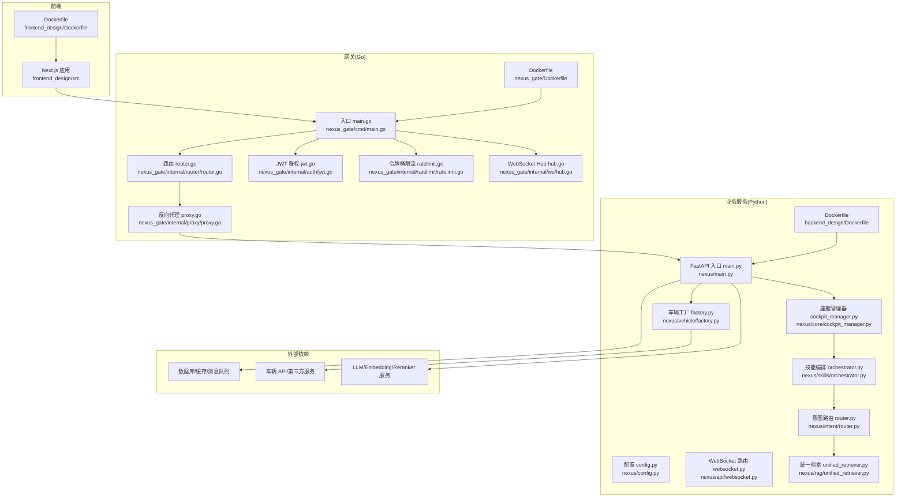
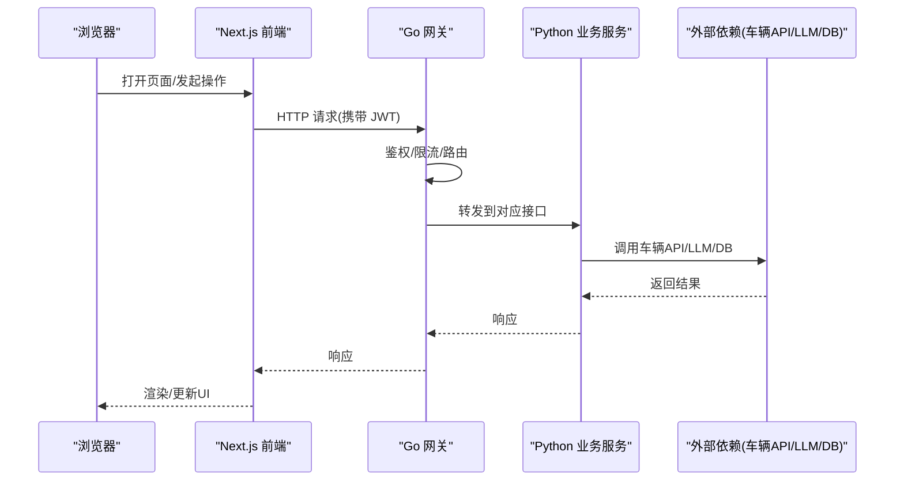
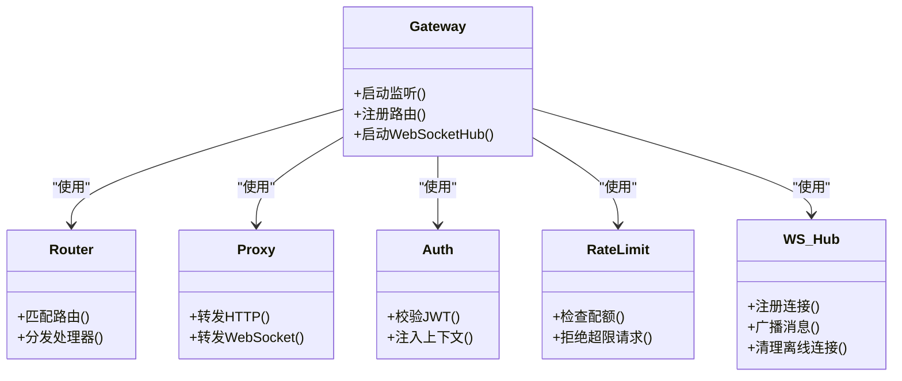
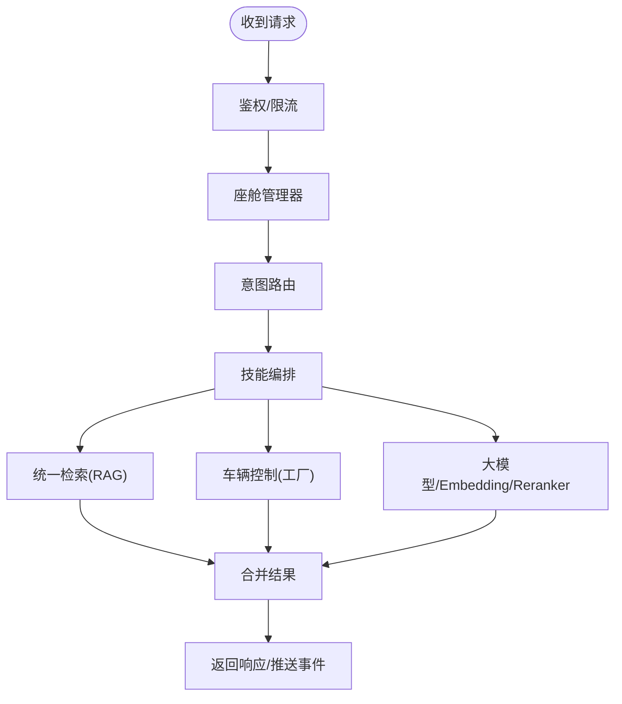
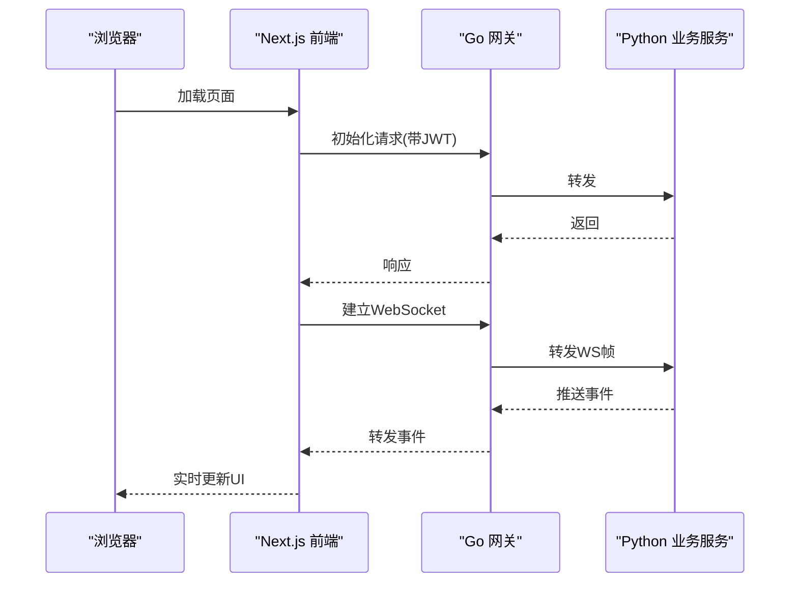
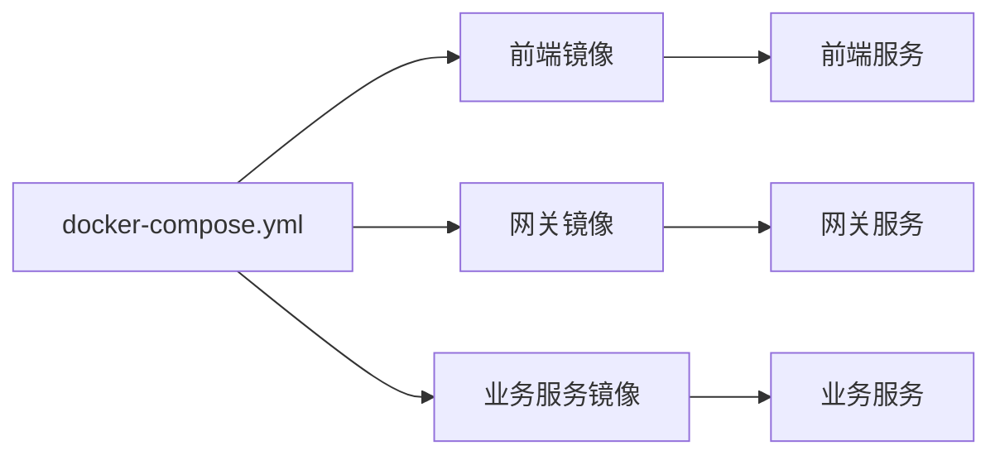
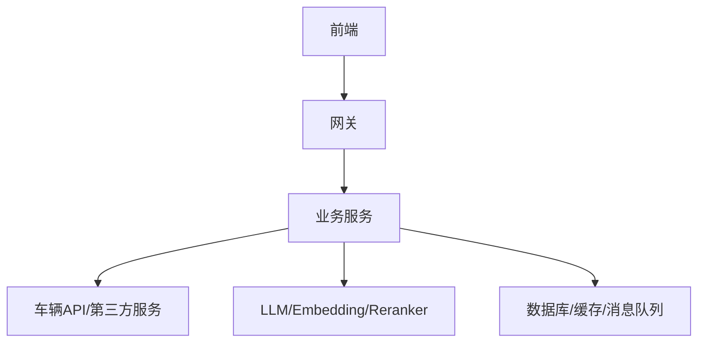

# 整体架构概览

<cite>
**本文引用的文件**   
- [docker-compose.yml](file://docker-compose.yml)
- [backend_design/nexus/main.py](file://backend_design/nexus/main.py)
- [backend_design/nexus/config.py](file://backend_design/nexus/config.py)
- [backend_design/nexus/api/websocket.py](file://backend_design/nexus/api/websocket.py)
- [backend_design/nexus/core/auth.py](file://backend_design/nexus/core/auth.py)
- [backend_design/nexus/core/cockpit_manager.py](file://backend_design/nexus/core/cockpit_manager.py)
- [backend_design/nexus/skills/orchestrator.py](file://backend_design/nexus/skills/orchestrator.py)
- [backend_design/nexus/intent/router.py](file://backend_design/nexus/intent/router.py)
- [backend_design/nexus/rag/unified_retriever.py](file://backend_design/nexus/rag/unified_retriever.py)
- [backend_design/nexus/vehicle/factory.py](file://backend_design/nexus/vehicle/factory.py)
- [backend_design/nexus/middleware/rate_limiter.py](file://backend_design/nexus/middleware/rate_limiter.py)
- [backend_design/nexus_gate/cmd/main.go](file://backend_design/nexus_gate/cmd/main.go)
- [backend_design/nexus_gate/internal/router/router.go](file://backend_design/nexus_gate/internal/router/router.go)
- [backend_design/nexus_gate/internal/proxy/proxy.go](file://backend_design/nexus_gate/internal/proxy/proxy.go)
- [backend_design/nexus_gate/internal/auth/jwt.go](file://backend_design/nexus_gate/internal/auth/jwt.go)
- [backend_design/nexus_gate/internal/ratelimit/ratelimit.go](file://backend_design/nexus_gate/internal/ratelimit/ratelimit.go)
- [backend_design/nexus_gate/internal/ws/hub.go](file://backend_design/nexus_gate/internal/ws/hub.go)
- [frontend_design/src/app/layout.tsx](file://frontend_design/src/app/layout.tsx)
- [frontend_design/src/lib/api.ts](file://frontend_design/src/lib/api.ts)
- [frontend_design/Dockerfile](file://frontend_design/Dockerfile)
- [backend_design/Dockerfile](file://backend_design/Dockerfile)
- [backend_design/nexus_gate/Dockerfile](file://backend_design/nexus_gate/Dockerfile)
</cite>

## 目录
1. [简介](#简介)
2. [项目结构](#项目结构)
3. [核心组件](#核心组件)
4. [架构总览](#架构总览)
5. [详细组件分析](#详细组件分析)
6. [依赖关系分析](#依赖关系分析)
7. [性能考量](#性能考量)
8. [故障排查指南](#故障排查指南)
9. [结论](#结论)
10. [附录](#附录)

## 简介
本文件为 NexusCockpit 系统的整体架构概览，面向技术与管理读者，帮助快速理解系统宏观设计与分层职责。系统采用前后端分离与微服务化思路：前端基于 Next.js 提供用户界面与实时交互；Go API 网关承担请求路由、鉴权与限流；Python 业务服务承载核心业务逻辑、AI 能力（ASR/TTS/RAG/Agent）与车辆控制集成；数据层包含关系型数据库、向量/图数据库与对象存储；部署通过 Docker Compose 编排容器化服务。

## 项目结构
仓库按“前端设计/后端设计/配置/模型/脚本”等维度组织，关键入口如下：
- 前端：Next.js 应用，位于 frontend_design/src，Dockerfile 用于构建镜像
- 网关：Go 实现，位于 backend_design/nexus_gate，含路由、代理、鉴权、限流与 WebSocket Hub
- 业务服务：Python FastAPI 应用，位于 backend_design/nexus，含 API、Agent、技能编排、RAG、车辆抽象、中间件与可观测性
- 部署：根目录 docker-compose.yml 统一编排各服务

图表来源
- [docker-compose.yml](file://docker-compose.yml)
- [frontend_design/Dockerfile](file://frontend_design/Dockerfile)
- [backend_design/nexus_gate/Dockerfile](file://backend_design/nexus_gate/Dockerfile)
- [backend_design/Dockerfile](file://backend_design/Dockerfile)
- [backend_design/nexus_gate/cmd/main.go](file://backend_design/nexus_gate/cmd/main.go)
- [backend_design/nexus_gate/internal/router/router.go](file://backend_design/nexus_gate/internal/router/router.go)
- [backend_design/nexus_gate/internal/proxy/proxy.go](file://backend_design/nexus_gate/internal/proxy/proxy.go)
- [backend_design/nexus_gate/internal/auth/jwt.go](file://backend_design/nexus_gate/internal/auth/jwt.go)
- [backend_design/nexus_gate/internal/ratelimit/ratelimit.go](file://backend_design/nexus_gate/internal/ratelimit/ratelimit.go)
- [backend_design/nexus_gate/internal/ws/hub.go](file://backend_design/nexus_gate/internal/ws/hub.go)
- [backend_design/nexus/main.py](file://backend_design/nexus/main.py)
- [backend_design/nexus/config.py](file://backend_design/nexus/config.py)
- [backend_design/nexus/api/websocket.py](file://backend_design/nexus/api/websocket.py)
- [backend_design/nexus/core/cockpit_manager.py](file://backend_design/nexus/core/cockpit_manager.py)
- [backend_design/nexus/skills/orchestrator.py](file://backend_design/nexus/skills/orchestrator.py)
- [backend_design/nexus/intent/router.py](file://backend_design/nexus/intent/router.py)
- [backend_design/nexus/rag/unified_retriever.py](file://backend_design/nexus/rag/unified_retriever.py)
- [backend_design/nexus/vehicle/factory.py](file://backend_design/nexus/vehicle/factory.py)

章节来源
- [docker-compose.yml](file://docker-compose.yml)
- [frontend_design/Dockerfile](file://frontend_design/Dockerfile)
- [backend_design/nexus_gate/Dockerfile](file://backend_design/nexus_gate/Dockerfile)
- [backend_design/Dockerfile](file://backend_design/Dockerfile)

## 核心组件
- 前端（Next.js）
  - 负责页面渲染、状态管理、语音采集与播放、地图与车辆面板展示、与网关的 HTTP/WebSocket 通信
  - 关键路径：布局与全局样式、API 客户端封装、TTS 播放、录音与语音识别 Hook
- 网关（Go）
  - 统一入口，提供静态资源转发、HTTP 反向代理、WebSocket 代理、JWT 鉴权、令牌桶限流、连接会话管理
- 业务服务（Python）
  - FastAPI 应用，暴露 REST/WS 接口；内部由座舱管理器协调 Agent、技能编排、意图路由、RAG 检索、车辆控制与 ASR/TTS 引擎
  - 中间件包括限流、Redis 缓存、会话存储、任务队列等
- 数据与外部依赖
  - 数据库/缓存/消息队列、向量与图数据库、对象存储、LLM/Embedding/Reranker 服务、车辆 API/第三方服务

章节来源
- [frontend_design/src/app/layout.tsx](file://frontend_design/src/app/layout.tsx)
- [frontend_design/src/lib/api.ts](file://frontend_design/src/lib/api.ts)
- [backend_design/nexus_gate/cmd/main.go](file://backend_design/nexus_gate/cmd/main.go)
- [backend_design/nexus_gate/internal/router/router.go](file://backend_design/nexus_gate/internal/router/router.go)
- [backend_design/nexus_gate/internal/proxy/proxy.go](file://backend_design/nexus_gate/internal/proxy/proxy.go)
- [backend_design/nexus_gate/internal/auth/jwt.go](file://backend_design/nexus_gate/internal/auth/jwt.go)
- [backend_design/nexus_gate/internal/ratelimit/ratelimit.go](file://backend_design/nexus_gate/internal/ratelimit/ratelimit.go)
- [backend_design/nexus_gate/internal/ws/hub.go](file://backend_design/nexus_gate/internal/ws/hub.go)
- [backend_design/nexus/main.py](file://backend_design/nexus/main.py)
- [backend_design/nexus/config.py](file://backend_design/nexus/config.py)
- [backend_design/nexus/api/websocket.py](file://backend_design/nexus/api/websocket.py)
- [backend_design/nexus/core/cockpit_manager.py](file://backend_design/nexus/core/cockpit_manager.py)
- [backend_design/nexus/skills/orchestrator.py](file://backend_design/nexus/skills/orchestrator.py)
- [backend_design/nexus/intent/router.py](file://backend_design/nexus/intent/router.py)
- [backend_design/nexus/rag/unified_retriever.py](file://backend_design/nexus/rag/unified_retriever.py)
- [backend_design/nexus/vehicle/factory.py](file://backend_design/nexus/vehicle/factory.py)

## 架构总览
NexusCockpit 采用“前端—网关—业务服务—数据/外部依赖”的分层架构。网关作为唯一对外入口，集中处理鉴权、限流与协议适配；业务服务聚焦领域能力与 AI 编排；前端专注体验与实时交互。

图表来源
- [frontend_design/src/lib/api.ts](file://frontend_design/src/lib/api.ts)
- [backend_design/nexus_gate/cmd/main.go](file://backend_design/nexus_gate/cmd/main.go)
- [backend_design/nexus_gate/internal/auth/jwt.go](file://backend_design/nexus_gate/internal/auth/jwt.go)
- [backend_design/nexus_gate/internal/ratelimit/ratelimit.go](file://backend_design/nexus_gate/internal/ratelimit/ratelimit.go)
- [backend_design/nexus_gate/internal/proxy/proxy.go](file://backend_design/nexus_gate/internal/proxy/proxy.go)
- [backend_design/nexus/main.py](file://backend_design/nexus/main.py)

## 详细组件分析

### 网关（Go）
- 职责
  - 统一入口、静态资源托管、HTTP 反向代理、WebSocket 代理
  - JWT 鉴权、令牌桶限流、连接与会话管理
- 关键模块
  - 入口与路由注册、反向代理转发、鉴权中间件、限流中间件、WebSocket Hub
- 交互流程
  - 请求进入后先经鉴权与限流，再根据路由转发至 Python 服务；WebSocket 连接由 Hub 维护并转发

图表来源
- [backend_design/nexus_gate/cmd/main.go](file://backend_design/nexus_gate/cmd/main.go)
- [backend_design/nexus_gate/internal/router/router.go](file://backend_design/nexus_gate/internal/router/router.go)
- [backend_design/nexus_gate/internal/proxy/proxy.go](file://backend_design/nexus_gate/internal/proxy/proxy.go)
- [backend_design/nexus_gate/internal/auth/jwt.go](file://backend_design/nexus_gate/internal/auth/jwt.go)
- [backend_design/nexus_gate/internal/ratelimit/ratelimit.go](file://backend_design/nexus_gate/internal/ratelimit/ratelimit.go)
- [backend_design/nexus_gate/internal/ws/hub.go](file://backend_design/nexus_gate/internal/ws/hub.go)

章节来源
- [backend_design/nexus_gate/cmd/main.go](file://backend_design/nexus_gate/cmd/main.go)
- [backend_design/nexus_gate/internal/router/router.go](file://backend_design/nexus_gate/internal/router/router.go)
- [backend_design/nexus_gate/internal/proxy/proxy.go](file://backend_design/nexus_gate/internal/proxy/proxy.go)
- [backend_design/nexus_gate/internal/auth/jwt.go](file://backend_design/nexus_gate/internal/auth/jwt.go)
- [backend_design/nexus_gate/internal/ratelimit/ratelimit.go](file://backend_design/nexus_gate/internal/ratelimit/ratelimit.go)
- [backend_design/nexus_gate/internal/ws/hub.go](file://backend_design/nexus_gate/internal/ws/hub.go)

### 业务服务（Python）
- 职责
  - 提供 REST/WS 接口；座舱管理器协调 Agent、技能编排、意图路由、RAG 检索、车辆控制与 ASR/TTS
- 关键模块
  - 入口与配置、WebSocket 路由、座舱管理器、技能编排器、意图路由、统一检索、车辆工厂、中间件（限流/缓存/会话/任务队列）
- 典型调用链
  - 接收请求 → 鉴权/限流 → 座舱管理器 → 意图路由 → 技能编排 → RAG/车辆/LLM → 返回

图表来源
- [backend_design/nexus/main.py](file://backend_design/nexus/main.py)
- [backend_design/nexus/config.py](file://backend_design/nexus/config.py)
- [backend_design/nexus/api/websocket.py](file://backend_design/nexus/api/websocket.py)
- [backend_design/nexus/core/cockpit_manager.py](file://backend_design/nexus/core/cockpit_manager.py)
- [backend_design/nexus/skills/orchestrator.py](file://backend_design/nexus/skills/orchestrator.py)
- [backend_design/nexus/intent/router.py](file://backend_design/nexus/intent/router.py)
- [backend_design/nexus/rag/unified_retriever.py](file://backend_design/nexus/rag/unified_retriever.py)
- [backend_design/nexus/vehicle/factory.py](file://backend_design/nexus/vehicle/factory.py)
- [backend_design/nexus/middleware/rate_limiter.py](file://backend_design/nexus/middleware/rate_limiter.py)

章节来源
- [backend_design/nexus/main.py](file://backend_design/nexus/main.py)
- [backend_design/nexus/config.py](file://backend_design/nexus/config.py)
- [backend_design/nexus/api/websocket.py](file://backend_design/nexus/api/websocket.py)
- [backend_design/nexus/core/cockpit_manager.py](file://backend_design/nexus/core/cockpit_manager.py)
- [backend_design/nexus/skills/orchestrator.py](file://backend_design/nexus/skills/orchestrator.py)
- [backend_design/nexus/intent/router.py](file://backend_design/nexus/intent/router.py)
- [backend_design/nexus/rag/unified_retriever.py](file://backend_design/nexus/rag/unified_retriever.py)
- [backend_design/nexus/vehicle/factory.py](file://backend_design/nexus/vehicle/factory.py)
- [backend_design/nexus/middleware/rate_limiter.py](file://backend_design/nexus/middleware/rate_limiter.py)

### 前端（Next.js）
- 职责
  - 页面与组件渲染、状态管理、语音采集与播放、与网关的 HTTP/WebSocket 通信
- 关键路径
  - 布局与全局样式、API 客户端封装、TTS 播放、录音与语音识别 Hook、车辆面板与地图
- 与网关交互
  - 通过 API 客户端访问网关，携带认证信息；WebSocket 用于实时事件推送

图表来源
- [frontend_design/src/app/layout.tsx](file://frontend_design/src/app/layout.tsx)
- [frontend_design/src/lib/api.ts](file://frontend_design/src/lib/api.ts)
- [backend_design/nexus_gate/cmd/main.go](file://backend_design/nexus_gate/cmd/main.go)
- [backend_design/nexus_gate/internal/ws/hub.go](file://backend_design/nexus_gate/internal/ws/hub.go)
- [backend_design/nexus/api/websocket.py](file://backend_design/nexus/api/websocket.py)

章节来源
- [frontend_design/src/app/layout.tsx](file://frontend_design/src/app/layout.tsx)
- [frontend_design/src/lib/api.ts](file://frontend_design/src/lib/api.ts)

### 容器化与编排
- 镜像构建
  - 前端与网关各自提供 Dockerfile，业务服务提供独立 Dockerfile
- 服务编排
  - docker-compose.yml 定义多服务网络、端口映射、环境变量与依赖关系，便于本地与生产环境一键拉起

图表来源
- [docker-compose.yml](file://docker-compose.yml)
- [frontend_design/Dockerfile](file://frontend_design/Dockerfile)
- [backend_design/nexus_gate/Dockerfile](file://backend_design/nexus_gate/Dockerfile)
- [backend_design/Dockerfile](file://backend_design/Dockerfile)

章节来源
- [docker-compose.yml](file://docker-compose.yml)
- [frontend_design/Dockerfile](file://frontend_design/Dockerfile)
- [backend_design/nexus_gate/Dockerfile](file://backend_design/nexus_gate/Dockerfile)
- [backend_design/Dockerfile](file://backend_design/Dockerfile)

## 依赖关系分析
- 组件耦合
  - 前端仅依赖网关；网关对业务服务无侵入式耦合，通过路由与代理解耦；业务服务通过工厂与抽象与外部依赖解耦
- 直接/间接依赖
  - 网关→业务服务→外部依赖（车辆API/LLM/DB）
  - 业务服务内部：座舱管理器→技能编排→意图路由→RAG/车辆/LLM
- 外部依赖
  - 车辆 API/第三方服务、LLM/Embedding/Reranker 服务、数据库/缓存/消息队列、对象存储

图表来源
- [backend_design/nexus/main.py](file://backend_design/nexus/main.py)
- [backend_design/nexus/vehicle/factory.py](file://backend_design/nexus/vehicle/factory.py)
- [backend_design/nexus/rag/unified_retriever.py](file://backend_design/nexus/rag/unified_retriever.py)
- [backend_design/nexus_gate/cmd/main.go](file://backend_design/nexus_gate/cmd/main.go)
- [frontend_design/src/lib/api.ts](file://frontend_design/src/lib/api.ts)

章节来源
- [backend_design/nexus/main.py](file://backend_design/nexus/main.py)
- [backend_design/nexus/vehicle/factory.py](file://backend_design/nexus/vehicle/factory.py)
- [backend_design/nexus/rag/unified_retriever.py](file://backend_design/nexus/rag/unified_retriever.py)
- [backend_design/nexus_gate/cmd/main.go](file://backend_design/nexus_gate/cmd/main.go)
- [frontend_design/src/lib/api.ts](file://frontend_design/src/lib/api.ts)

## 性能考量
- 网关侧
  - 令牌桶限流保护后端；WebSocket Hub 高效转发；反向代理减少跨域与TLS终止开销
- 业务服务侧
  - 中间件缓存与任务队列提升吞吐；RAG 检索与重排可结合缓存与异步批处理；车辆控制建议超时与重试策略
- 前端侧
  - 合理缓存与增量更新；语音流式处理与降噪；WebSocket 断线重连与背压控制

[本节为通用指导，不直接分析具体文件]

## 故障排查指南
- 鉴权失败
  - 检查 JWT 签名与过期时间、网关鉴权中间件日志
- 限流触发
  - 观察网关限流计数与阈值配置，必要时调整配额或扩容
- WebSocket 异常
  - 检查 Hub 连接数、心跳与重连逻辑、上游 WS 路由
- 业务超时/错误
  - 查看业务服务日志、外部依赖健康检查与熔断配置
- 前端问题
  - 确认 API 基础地址、证书与跨域设置、TTS 播放权限

章节来源
- [backend_design/nexus_gate/internal/auth/jwt.go](file://backend_design/nexus_gate/internal/auth/jwt.go)
- [backend_design/nexus_gate/internal/ratelimit/ratelimit.go](file://backend_design/nexus_gate/internal/ratelimit/ratelimit.go)
- [backend_design/nexus_gate/internal/ws/hub.go](file://backend_design/nexus_gate/internal/ws/hub.go)
- [backend_design/nexus/api/websocket.py](file://backend_design/nexus/api/websocket.py)
- [backend_design/nexus/middleware/rate_limiter.py](file://backend_design/nexus/middleware/rate_limiter.py)

## 结论
NexusCockpit 以“前端—网关—业务服务—数据/外部依赖”的分层架构实现高内聚、低耦合的系统设计。Go 网关提供高性能与安全边界，Python 业务服务聚焦 AI 与领域能力，前端专注于用户体验与实时交互。通过 Docker Compose 编排，系统具备良好的可移植性与可扩展性。后续可在可观测性、弹性伸缩与多租户隔离方面持续演进。

## 附录
- 技术选型理由与权衡
  - Go 网关：高并发、低延迟、内存安全，适合做统一入口与协议转换
  - Python 业务：丰富的 AI/ML 生态，便于集成 ASR/TTS/RAG/Agent
  - Next.js 前端：SSR/CSR 灵活、生态完善，利于快速迭代 UI 与交互
  - 容器化：镜像隔离与环境一致性，Compose 简化本地与测试环境
- 部署清单
  - 前端镜像、网关镜像、业务服务镜像；通过 docker-compose.yml 统一拉起

章节来源
- [docker-compose.yml](file://docker-compose.yml)
- [frontend_design/Dockerfile](file://frontend_design/Dockerfile)
- [backend_design/nexus_gate/Dockerfile](file://backend_design/nexus_gate/Dockerfile)
- [backend_design/Dockerfile](file://backend_design/Dockerfile)