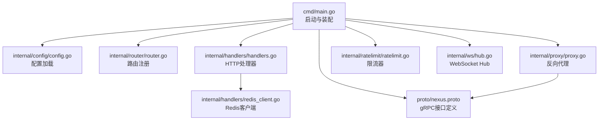
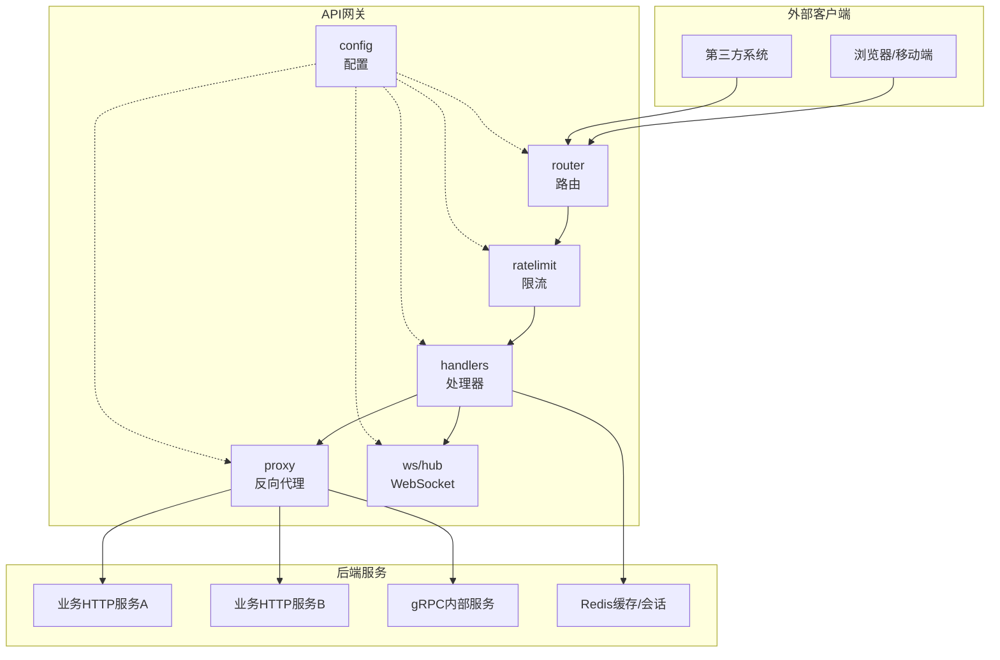
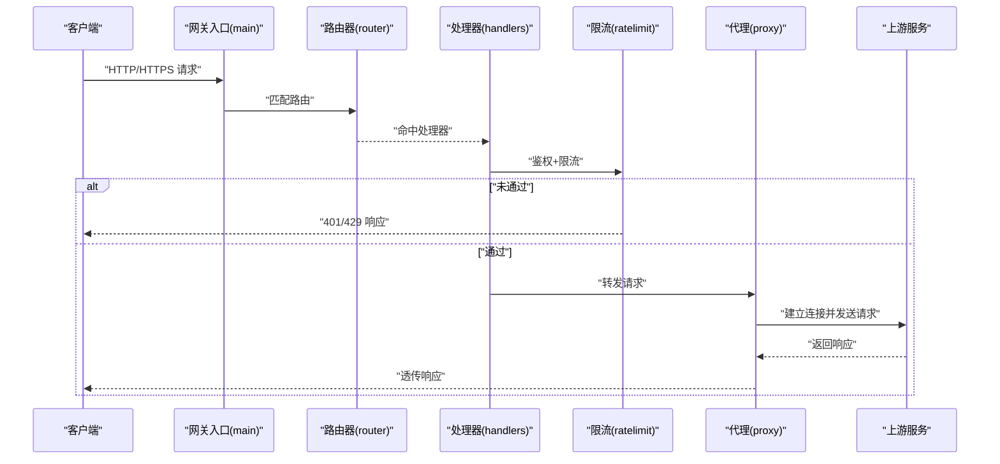
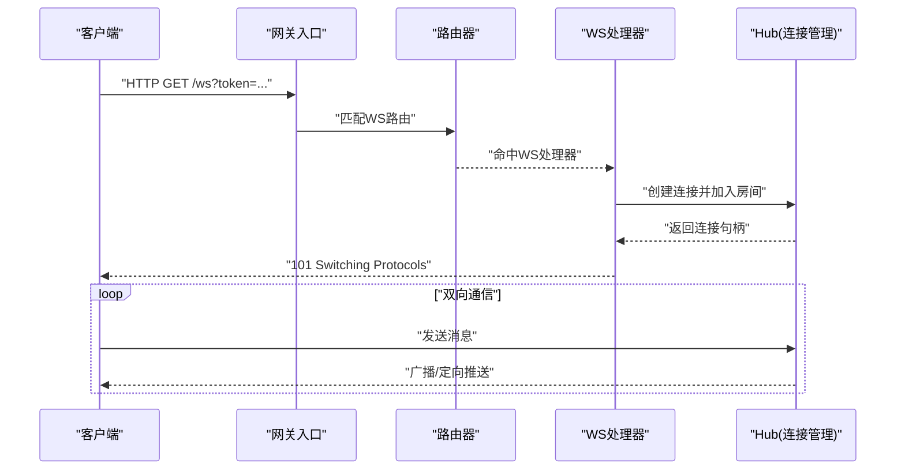
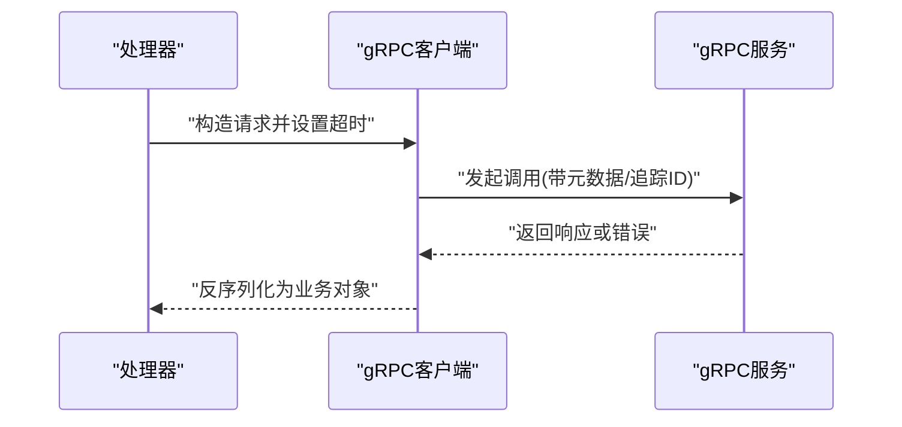
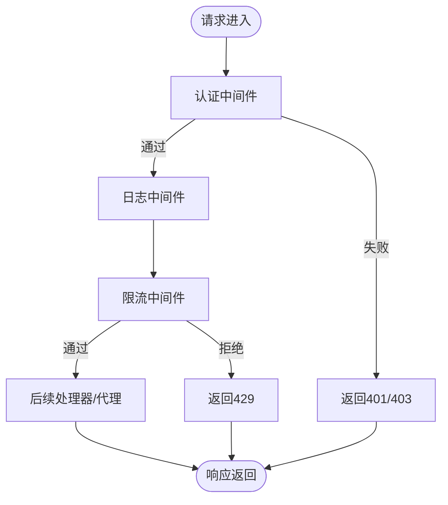
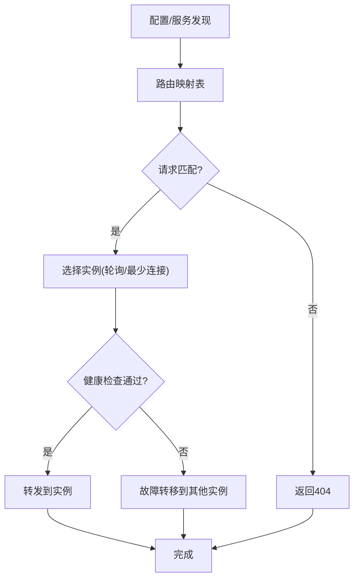
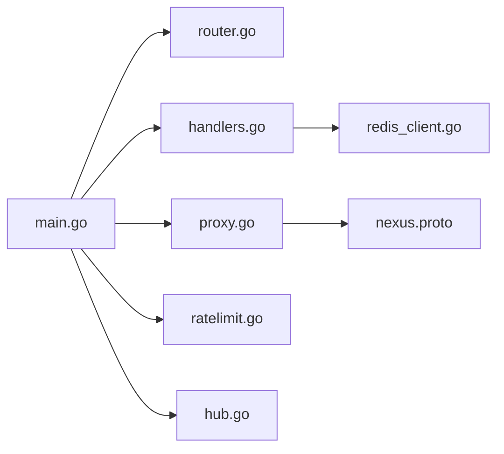

# API网关服务

<cite>
**本文引用的文件**   
- [backend_design/nexus_gate/cmd/main.go](file://backend_design/nexus_gate/cmd/main.go)
- [backend_design/nexus_gate/internal/config/config.go](file://backend_design/nexus_gate/internal/config/config.go)
- [backend_design/nexus_gate/internal/handlers/handlers.go](file://backend_design/nexus_gate/internal/handlers/handlers.go)
- [backend_design/nexus_gate/internal/handlers/redis_client.go](file://backend_design/nexus_gate/internal/handlers/redis_client.go)
- [backend_design/nexus_gate/internal/proxy/proxy.go](file://backend_design/nexus_gate/internal/proxy/proxy.go)
- [backend_design/nexus_gate/internal/ratelimit/ratelimit.go](file://backend_design/nexus_gate/internal/ratelimit/ratelimit.go)
- [backend_design/nexus_gate/internal/router/router.go](file://backend_design/nexus_gate/internal/router/router.go)
- [backend_design/nexus_gate/internal/ws/hub.go](file://backend_design/nexus_gate/internal/ws/hub.go)
- [backend_design/nexus_gate/proto/nexus.proto](file://backend_design/nexus_gate/proto/nexus.proto)
</cite>

## 目录
1. [简介](#简介)
2. [项目结构](#项目结构)
3. [核心组件](#核心组件)
4. [架构总览](#架构总览)
5. [详细组件分析](#详细组件分析)
6. [依赖关系分析](#依赖关系分析)
7. [性能考虑](#性能考虑)
8. [故障排查指南](#故障排查指南)
9. [结论](#结论)
10. [附录](#附录)

## 简介
本文件面向NexusCockpit的Go API网关服务，系统性阐述其职责与实现：请求路由、负载均衡、认证鉴权、限流控制、协议转换（HTTP/HTTPS、WebSocket、gRPC）、中间件架构、动态路由与服务发现集成、故障转移策略，以及性能优化与安全配置。文档以代码级事实为依据，辅以架构图与时序图帮助理解。

## 项目结构
Go网关位于 backend_design/nexus_gate 目录，采用分层组织：
- cmd：应用入口
- internal/config：配置加载与校验
- internal/router：路由注册与匹配
- internal/handlers：HTTP处理器与Redis客户端
- internal/proxy：反向代理与协议转发
- internal/ratelimit：令牌桶/滑动窗口等限流实现
- internal/ws：WebSocket Hub连接管理
- proto：gRPC接口定义

图表来源
- [backend_design/nexus_gate/cmd/main.go](file://backend_design/nexus_gate/cmd/main.go)
- [backend_design/nexus_gate/internal/config/config.go](file://backend_design/nexus_gate/internal/config/config.go)
- [backend_design/nexus_gate/internal/router/router.go](file://backend_design/nexus_gate/internal/router/router.go)
- [backend_design/nexus_gate/internal/handlers/handlers.go](file://backend_design/nexus_gate/internal/handlers/handlers.go)
- [backend_design/nexus_gate/internal/handlers/redis_client.go](file://backend_design/nexus_gate/internal/handlers/redis_client.go)
- [backend_design/nexus_gate/internal/proxy/proxy.go](file://backend_design/nexus_gate/internal/proxy/proxy.go)
- [backend_design/nexus_gate/internal/ratelimit/ratelimit.go](file://backend_design/nexus_gate/internal/ratelimit/ratelimit.go)
- [backend_design/nexus_gate/internal/ws/hub.go](file://backend_design/nexus_gate/internal/ws/hub.go)
- [backend_design/nexus_gate/proto/nexus.proto](file://backend_design/nexus_gate/proto/nexus.proto)

章节来源
- [backend_design/nexus_gate/cmd/main.go](file://backend_design/nexus_gate/cmd/main.go)
- [backend_design/nexus_gate/internal/config/config.go](file://backend_design/nexus_gate/internal/config/config.go)
- [backend_design/nexus_gate/internal/router/router.go](file://backend_design/nexus_gate/internal/router/router.go)
- [backend_design/nexus_gate/internal/handlers/handlers.go](file://backend_design/nexus_gate/internal/handlers/handlers.go)
- [backend_design/nexus_gate/internal/handlers/redis_client.go](file://backend_design/nexus_gate/internal/handlers/redis_client.go)
- [backend_design/nexus_gate/internal/proxy/proxy.go](file://backend_design/nexus_gate/internal/proxy/proxy.go)
- [backend_design/nexus_gate/internal/ratelimit/ratelimit.go](file://backend_design/nexus_gate/internal/ratelimit/ratelimit.go)
- [backend_design/nexus_gate/internal/ws/hub.go](file://backend_design/nexus_gate/internal/ws/hub.go)
- [backend_design/nexus_gate/proto/nexus.proto](file://backend_design/nexus_gate/proto/nexus.proto)

## 核心组件
- 配置中心：集中加载端口、TLS、上游服务地址、限流参数、Redis连接等。
- 路由器：按路径/方法注册处理器，支持前缀匹配与通配。
- 处理器：统一入参解析、鉴权上下文注入、日志埋点、错误封装。
- 反向代理：将HTTP/HTTPS请求转发至后端服务，支持负载均衡与健康检查。
- 限流器：基于令牌桶或滑动窗口的全局/用户维度限流。
- WebSocket Hub：连接广播、房间管理、心跳保活。
- gRPC调用：通过proto生成客户端，用于内部服务间调用。

章节来源
- [backend_design/nexus_gate/internal/config/config.go](file://backend_design/nexus_gate/internal/config/config.go)
- [backend_design/nexus_gate/internal/router/router.go](file://backend_design/nexus_gate/internal/router/router.go)
- [backend_design/nexus_gate/internal/handlers/handlers.go](file://backend_design/nexus_gate/internal/handlers/handlers.go)
- [backend_design/nexus_gate/internal/proxy/proxy.go](file://backend_design/nexus_gate/internal/proxy/proxy.go)
- [backend_design/nexus_gate/internal/ratelimit/ratelimit.go](file://backend_design/nexus_gate/internal/ratelimit/ratelimit.go)
- [backend_design/nexus_gate/internal/ws/hub.go](file://backend_design/nexus_gate/internal/ws/hub.go)
- [backend_design/nexus_gate/proto/nexus.proto](file://backend_design/nexus_gate/proto/nexus.proto)

## 架构总览
网关作为统一入口，承担以下职责：
- 请求路由：根据URL路径与方法选择处理器或代理目标。
- 负载均衡：对同一后端的多实例进行轮询/最少连接等策略。
- 认证鉴权：校验JWT/签名，注入租户与用户上下文。
- 限流控制：按IP/用户/接口维度限制并发与QPS。
- 协议转换：HTTP/HTTPS到gRPC或HTTP后端的透明转发；WebSocket长连接桥接。
- 可观测性：结构化日志、指标上报、链路追踪。

图表来源
- [backend_design/nexus_gate/cmd/main.go](file://backend_design/nexus_gate/cmd/main.go)
- [backend_design/nexus_gate/internal/router/router.go](file://backend_design/nexus_gate/internal/router/router.go)
- [backend_design/nexus_gate/internal/handlers/handlers.go](file://backend_design/nexus_gate/internal/handlers/handlers.go)
- [backend_design/nexus_gate/internal/proxy/proxy.go](file://backend_design/nexus_gate/internal/proxy/proxy.go)
- [backend_design/nexus_gate/internal/ratelimit/ratelimit.go](file://backend_design/nexus_gate/internal/ratelimit/ratelimit.go)
- [backend_design/nexus_gate/internal/ws/hub.go](file://backend_design/nexus_gate/internal/ws/hub.go)
- [backend_design/nexus_gate/internal/handlers/redis_client.go](file://backend_design/nexus_gate/internal/handlers/redis_client.go)
- [backend_design/nexus_gate/internal/config/config.go](file://backend_design/nexus_gate/internal/config/config.go)

## 详细组件分析

### HTTP/HTTPS请求处理流程
- 启动阶段：加载配置，初始化TLS监听、路由器、限流器、Redis客户端、代理池。
- 请求进入：路由器匹配路径与方法，命中处理器或代理规则。
- 鉴权与限流：在处理器链中执行鉴权与限流，失败直接返回。
- 转发与响应：代理层建立到上游的连接并透传请求体与头部，回写响应。

图表来源
- [backend_design/nexus_gate/cmd/main.go](file://backend_design/nexus_gate/cmd/main.go)
- [backend_design/nexus_gate/internal/router/router.go](file://backend_design/nexus_gate/internal/router/router.go)
- [backend_design/nexus_gate/internal/handlers/handlers.go](file://backend_design/nexus_gate/internal/handlers/handlers.go)
- [backend_design/nexus_gate/internal/ratelimit/ratelimit.go](file://backend_design/nexus_gate/internal/ratelimit/ratelimit.go)
- [backend_design/nexus_gate/internal/proxy/proxy.go](file://backend_design/nexus_gate/internal/proxy/proxy.go)

章节来源
- [backend_design/nexus_gate/cmd/main.go](file://backend_design/nexus_gate/cmd/main.go)
- [backend_design/nexus_gate/internal/router/router.go](file://backend_design/nexus_gate/internal/router/router.go)
- [backend_design/nexus_gate/internal/handlers/handlers.go](file://backend_design/nexus_gate/internal/handlers/handlers.go)
- [backend_design/nexus_gate/internal/ratelimit/ratelimit.go](file://backend_design/nexus_gate/internal/ratelimit/ratelimit.go)
- [backend_design/nexus_gate/internal/proxy/proxy.go](file://backend_design/nexus_gate/internal/proxy/proxy.go)

### WebSocket连接管理
- 握手升级：处理器检测Upgrade头，切换为WS协议。
- Hub管理：维护连接集合、房间订阅、消息广播。
- 心跳保活：定时Ping/Pong，清理超时连接。
- 错误恢复：连接异常时自动重连与状态同步。

图表来源
- [backend_design/nexus_gate/internal/ws/hub.go](file://backend_design/nexus_gate/internal/ws/hub.go)
- [backend_design/nexus_gate/internal/router/router.go](file://backend_design/nexus_gate/internal/router/router.go)
- [backend_design/nexus_gate/internal/handlers/handlers.go](file://backend_design/nexus_gate/internal/handlers/handlers.go)

章节来源
- [backend_design/nexus_gate/internal/ws/hub.go](file://backend_design/nexus_gate/internal/ws/hub.go)
- [backend_design/nexus_gate/internal/router/router.go](file://backend_design/nexus_gate/internal/router/router.go)
- [backend_design/nexus_gate/internal/handlers/handlers.go](file://backend_design/nexus_gate/internal/handlers/handlers.go)

### gRPC内部服务调用机制
- 接口契约：通过proto定义服务方法与消息类型。
- 客户端生成：编译proto生成Go客户端代码。
- 连接复用：使用连接池与KeepAlive减少握手开销。
- 熔断与重试：结合上下文超时、重试策略与熔断器保护上游。

图表来源
- [backend_design/nexus_gate/proto/nexus.proto](file://backend_design/nexus_gate/proto/nexus.proto)
- [backend_design/nexus_gate/internal/handlers/handlers.go](file://backend_design/nexus_gate/internal/handlers/handlers.go)

章节来源
- [backend_design/nexus_gate/proto/nexus.proto](file://backend_design/nexus_gate/proto/nexus.proto)
- [backend_design/nexus_gate/internal/handlers/handlers.go](file://backend_design/nexus_gate/internal/handlers/handlers.go)

### 中间件架构设计
- 认证中间件：校验JWT/签名，提取用户与租户信息，写入请求上下文。
- 日志记录中间件：记录请求ID、耗时、状态码、关键参数脱敏。
- 错误处理中间件：统一错误码与消息，避免泄露敏感信息。
- 限流中间件：基于IP/用户/接口维度计数，拒绝超限请求。

图表来源
- [backend_design/nexus_gate/internal/handlers/handlers.go](file://backend_design/nexus_gate/internal/handlers/handlers.go)
- [backend_design/nexus_gate/internal/ratelimit/ratelimit.go](file://backend_design/nexus_gate/internal/ratelimit/ratelimit.go)

章节来源
- [backend_design/nexus_gate/internal/handlers/handlers.go](file://backend_design/nexus_gate/internal/handlers/handlers.go)
- [backend_design/nexus_gate/internal/ratelimit/ratelimit.go](file://backend_design/nexus_gate/internal/ratelimit/ratelimit.go)

### 动态路由配置与服务发现
- 动态路由：从配置中心或本地配置文件热更新路由表，无需重启。
- 服务发现：读取后端实例列表，支持健康检查与权重调整。
- 故障转移：当某实例不可用时，自动切换到健康实例并告警。

图表来源
- [backend_design/nexus_gate/internal/config/config.go](file://backend_design/nexus_gate/internal/config/config.go)
- [backend_design/nexus_gate/internal/router/router.go](file://backend_design/nexus_gate/internal/router/router.go)
- [backend_design/nexus_gate/internal/proxy/proxy.go](file://backend_design/nexus_gate/internal/proxy/proxy.go)

章节来源
- [backend_design/nexus_gate/internal/config/config.go](file://backend_design/nexus_gate/internal/config/config.go)
- [backend_design/nexus_gate/internal/router/router.go](file://backend_design/nexus_gate/internal/router/router.go)
- [backend_design/nexus_gate/internal/proxy/proxy.go](file://backend_design/nexus_gate/internal/proxy/proxy.go)

### 安全考虑
- SSL/TLS：启用HTTPS监听，配置证书与密钥，强制TLS版本与密码套件。
- 请求验证：校验Content-Type、长度、签名与白名单域名。
- 防护机制：防重放、防CSRF、输入校验、敏感字段脱敏。
- 访问控制：基于角色/租户的细粒度权限控制。

章节来源
- [backend_design/nexus_gate/internal/config/config.go](file://backend_design/nexus_gate/internal/config/config.go)
- [backend_design/nexus_gate/internal/handlers/handlers.go](file://backend_design/nexus_gate/internal/handlers/handlers.go)

## 依赖关系分析
- 模块内聚：各组件职责清晰，低耦合高内聚。
- 外部依赖：Redis用于缓存与会话；gRPC用于内部服务调用。
- 潜在循环：确保处理器不直接依赖路由器，避免循环导入。

图表来源
- [backend_design/nexus_gate/cmd/main.go](file://backend_design/nexus_gate/cmd/main.go)
- [backend_design/nexus_gate/internal/router/router.go](file://backend_design/nexus_gate/internal/router/router.go)
- [backend_design/nexus_gate/internal/handlers/handlers.go](file://backend_design/nexus_gate/internal/handlers/handlers.go)
- [backend_design/nexus_gate/internal/proxy/proxy.go](file://backend_design/nexus_gate/internal/proxy/proxy.go)
- [backend_design/nexus_gate/internal/ratelimit/ratelimit.go](file://backend_design/nexus_gate/internal/ratelimit/ratelimit.go)
- [backend_design/nexus_gate/internal/ws/hub.go](file://backend_design/nexus_gate/internal/ws/hub.go)
- [backend_design/nexus_gate/internal/handlers/redis_client.go](file://backend_design/nexus_gate/internal/handlers/redis_client.go)
- [backend_design/nexus_gate/proto/nexus.proto](file://backend_design/nexus_gate/proto/nexus.proto)

章节来源
- [backend_design/nexus_gate/cmd/main.go](file://backend_design/nexus_gate/cmd/main.go)
- [backend_design/nexus_gate/internal/router/router.go](file://backend_design/nexus_gate/internal/router/router.go)
- [backend_design/nexus_gate/internal/handlers/handlers.go](file://backend_design/nexus_gate/internal/handlers/handlers.go)
- [backend_design/nexus_gate/internal/proxy/proxy.go](file://backend_design/nexus_gate/internal/proxy/proxy.go)
- [backend_design/nexus_gate/internal/ratelimit/ratelimit.go](file://backend_design/nexus_gate/internal/ratelimit/ratelimit.go)
- [backend_design/nexus_gate/internal/ws/hub.go](file://backend_design/nexus_gate/internal/ws/hub.go)
- [backend_design/nexus_gate/internal/handlers/redis_client.go](file://backend_design/nexus_gate/internal/handlers/redis_client.go)
- [backend_design/nexus_gate/proto/nexus.proto](file://backend_design/nexus_gate/proto/nexus.proto)

## 性能考虑
- 连接池管理：HTTP/gRPC连接复用，合理设置最大空闲与生命周期。
- 缓存策略：热点数据落Redis，设置TTL与失效策略。
- 异步处理：耗时任务入队，非阻塞返回；WebSocket批量合并发送。
- 资源隔离：按租户/接口划分goroutine池与队列，防止雪崩。
- 监控与调优：采集延迟分位、吞吐、错误率，持续压测与容量规划。

[本节为通用指导，不直接分析具体文件]

## 故障排查指南
- 常见问题
  - 鉴权失败：检查JWT签名、过期时间、租户上下文。
  - 限流触发：查看限流计数器与阈值，确认是否误判。
  - 代理超时：核对上游健康检查与超时配置。
  - WS断连：检查心跳间隔与网络抖动。
- 定位手段
  - 结构化日志：关联请求ID，快速定位链路。
  - 指标面板：观察P99延迟、错误率、连接数。
  - 调试工具：抓包与trace，确认协议转换与头部透传。

章节来源
- [backend_design/nexus_gate/internal/handlers/handlers.go](file://backend_design/nexus_gate/internal/handlers/handlers.go)
- [backend_design/nexus_gate/internal/ratelimit/ratelimit.go](file://backend_design/nexus_gate/internal/ratelimit/ratelimit.go)
- [backend_design/nexus_gate/internal/proxy/proxy.go](file://backend_design/nexus_gate/internal/proxy/proxy.go)
- [backend_design/nexus_gate/internal/ws/hub.go](file://backend_design/nexus_gate/internal/ws/hub.go)

## 结论
该网关以清晰的模块化设计与明确的职责边界，实现了统一的请求接入、鉴权限流、协议转换与内部服务调用能力。通过动态路由、服务发现与故障转移，提升了系统的弹性与可用性。配合连接池、缓存与异步化策略，可在高并发场景下保持稳定与高性能。建议在生产环境完善可观测性与自动化运维，持续优化SLA与成本。

[本节为总结，不直接分析具体文件]

## 附录
- 术语
  - 反向代理：接收客户端请求并转发至后端服务。
  - 熔断器：在下游故障时快速失败，避免级联崩溃。
  - 心跳保活：周期性探测连接有效性。
- 参考
  - 配置项说明见配置模块。
  - gRPC接口定义见proto文件。

[本节为补充说明，不直接分析具体文件]