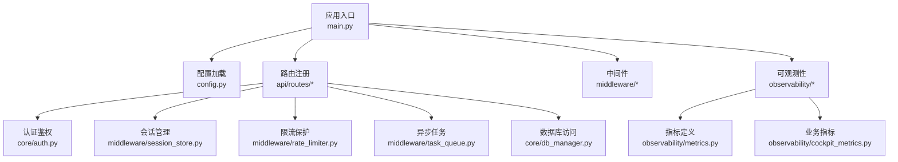
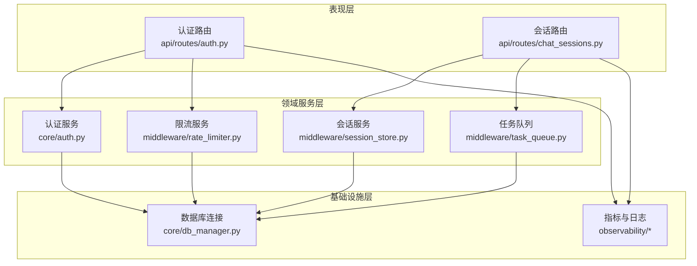
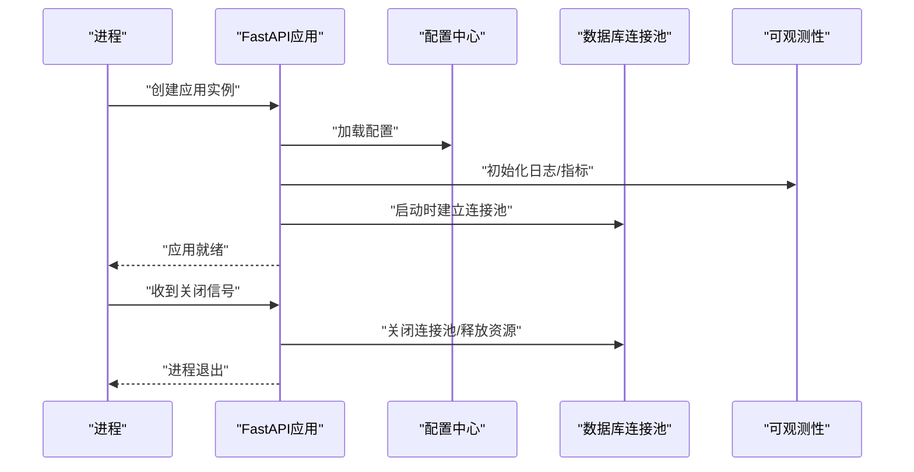
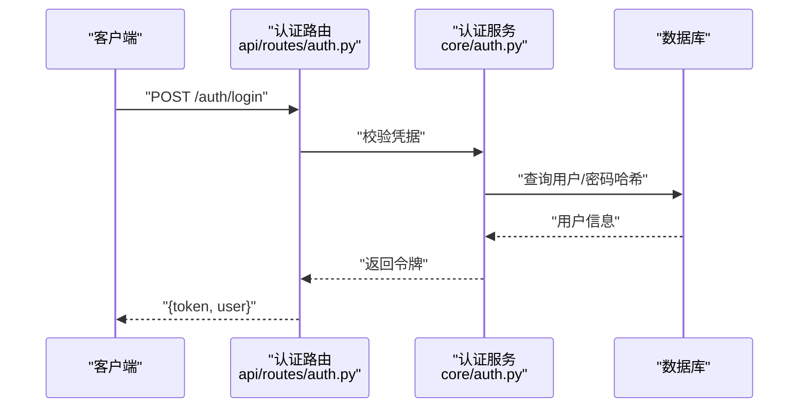
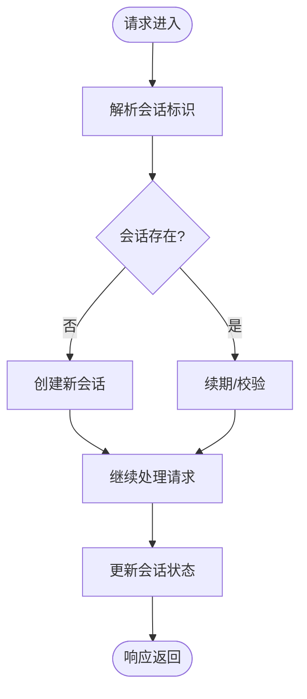
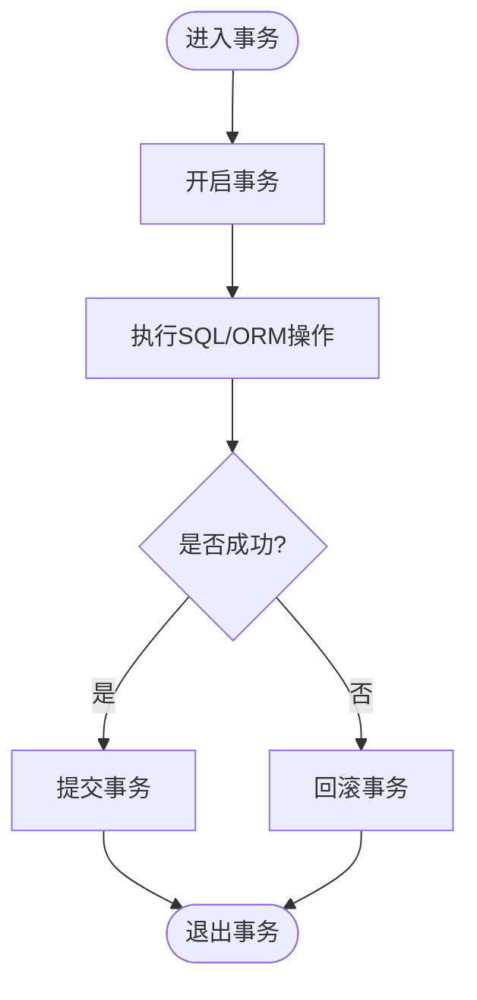
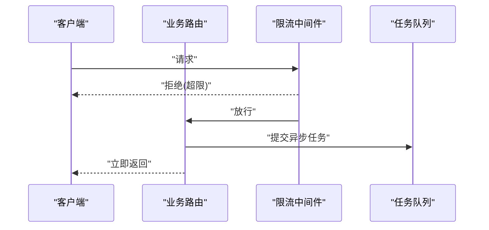
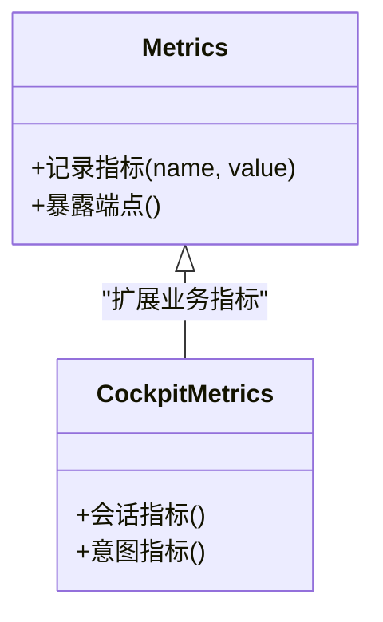
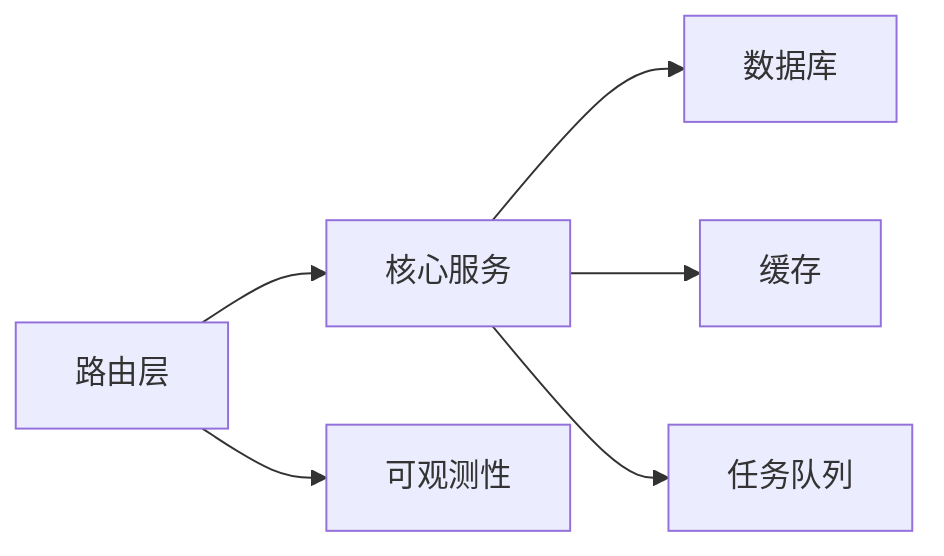

# 业务服务架构

<cite>
**本文引用的文件**   
- [backend_design/nexus/main.py](file://backend_design/nexus/main.py)
- [backend_design/nexus/config.py](file://backend_design/nexus/config.py)
- [backend_design/nexus/core/db_manager.py](file://backend_design/nexus/core/db_manager.py)
- [backend_design/nexus/core/auth.py](file://backend_design/nexus/core/auth.py)
- [backend_design/nexus/core/exceptions.py](file://backend_design/nexus/core/exceptions.py)
- [backend_design/nexus/core/logger.py](file://backend_design/nexus/core/logger.py)
- [backend_design/nexus/api/routes/auth.py](file://backend_design/nexus/api/routes/auth.py)
- [backend_design/nexus/api/routes/chat_sessions.py](file://backend_design/nexus/api/routes/chat_sessions.py)
- [backend_design/nexus/middleware/session_store.py](file://backend_design/nexus/middleware/session_store.py)
- [backend_design/nexus/middleware/rate_limiter.py](file://backend_design/nexus/middleware/rate_limiter.py)
- [backend_design/nexus/middleware/task_queue.py](file://backend_design/nexus/middleware/task_queue.py)
- [backend_design/nexus/observability/metrics.py](file://backend_design/nexus/observability/metrics.py)
- [backend_design/nexus/observability/cockpit_metrics.py](file://backend_design/nexus/observability/cockpit_metrics.py)
- [backend_design/pyproject.toml](file://backend_design/pyproject.toml)
- [docker-compose.yml](file://docker-compose.yml)
</cite>

## 目录
1. [简介](#简介)
2. [项目结构](#项目结构)
3. [核心组件](#核心组件)
4. [架构总览](#架构总览)
5. [详细组件分析](#详细组件分析)
6. [依赖关系分析](#依赖关系分析)
7. [性能考量](#性能考量)
8. [故障排查指南](#故障排查指南)
9. [结论](#结论)
10. [附录](#附录)

## 简介
本文件面向NexusCockpit的Python业务服务，聚焦FastAPI应用的整体架构设计。内容覆盖应用启动流程、依赖注入与模块化组织；用户管理、会话管理与权限控制等基础服务职责；数据库连接管理、事务处理与连接池配置；配置管理系统（环境变量、配置文件与环境隔离）；服务间通信机制（RESTful API暴露、内部模块调用、异步任务处理）；错误处理策略、日志记录与监控指标收集。文档旨在帮助开发者快速理解系统结构与关键实现路径，并提供可操作的排障建议。

## 项目结构
后端采用按领域与层次混合的组织方式：
- 入口与装配：应用初始化、路由注册、中间件挂载、生命周期钩子
- 核心能力：认证鉴权、异常体系、日志、数据库连接管理、租户上下文等
- API层：按功能域划分的路由模块，负责请求解析、参数校验与服务调用
- 中间件：会话存储、限流、任务队列等横切能力
- 可观测性：指标采集、业务指标封装
- 配置：集中式配置加载与环境变量映射

图表来源
- [backend_design/nexus/main.py](file://backend_design/nexus/main.py)
- [backend_design/nexus/config.py](file://backend_design/nexus/config.py)
- [backend_design/nexus/core/db_manager.py](file://backend_design/nexus/core/db_manager.py)
- [backend_design/nexus/core/auth.py](file://backend_design/nexus/core/auth.py)
- [backend_design/nexus/middleware/session_store.py](file://backend_design/nexus/middleware/session_store.py)
- [backend_design/nexus/middleware/rate_limiter.py](file://backend_design/nexus/middleware/rate_limiter.py)
- [backend_design/nexus/middleware/task_queue.py](file://backend_design/nexus/middleware/task_queue.py)
- [backend_design/nexus/observability/metrics.py](file://backend_design/nexus/observability/metrics.py)
- [backend_design/nexus/observability/cockpit_metrics.py](file://backend_design/nexus/observability/cockpit_metrics.py)

章节来源
- [backend_design/nexus/main.py](file://backend_design/nexus/main.py)
- [backend_design/nexus/config.py](file://backend_design/nexus/config.py)
- [backend_design/pyproject.toml](file://backend_design/pyproject.toml)
- [docker-compose.yml](file://docker-compose.yml)

## 核心组件
- 应用入口与装配
  - 负责创建FastAPI实例、注册路由、挂载中间件、设置生命周期钩子（启动/关闭）、集成可观测性与配置。
- 配置管理
  - 统一加载环境变量与配置文件，提供强类型配置对象，支持多环境隔离。
- 认证与授权
  - 基于JWT的认证流程、权限校验、令牌刷新与黑名单/过期策略。
- 会话管理
  - 会话创建、续期、销毁与持久化（如Redis），结合中间件在请求上下文中注入会话信息。
- 数据库连接与事务
  - 连接池配置、会话工厂、事务边界管理、重试与回滚策略。
- 中间件
  - 限流、缓存、任务队列等横切能力，保证稳定性与吞吐。
- 可观测性
  - 结构化日志、指标采集、业务指标封装，便于接入Prometheus/Grafana。

章节来源
- [backend_design/nexus/main.py](file://backend_design/nexus/main.py)
- [backend_design/nexus/config.py](file://backend_design/nexus/config.py)
- [backend_design/nexus/core/auth.py](file://backend_design/nexus/core/auth.py)
- [backend_design/nexus/middleware/session_store.py](file://backend_design/nexus/middleware/session_store.py)
- [backend_design/nexus/core/db_manager.py](file://backend_design/nexus/core/db_manager.py)
- [backend_design/nexus/middleware/rate_limiter.py](file://backend_design/nexus/middleware/rate_limiter.py)
- [backend_design/nexus/middleware/task_queue.py](file://backend_design/nexus/middleware/task_queue.py)
- [backend_design/nexus/observability/metrics.py](file://backend_design/nexus/observability/metrics.py)
- [backend_design/nexus/observability/cockpit_metrics.py](file://backend_design/nexus/observability/cockpit_metrics.py)

## 架构总览
整体采用分层+模块化设计：
- 表现层：FastAPI路由，负责HTTP协议处理、参数校验与响应序列化
- 领域服务层：用户、会话、权限、车辆、技能编排等
- 基础设施层：数据库、缓存、消息队列、外部服务客户端
- 横切关注点：中间件、可观测性、配置、异常与日志

图表来源
- [backend_design/nexus/api/routes/auth.py](file://backend_design/nexus/api/routes/auth.py)
- [backend_design/nexus/api/routes/chat_sessions.py](file://backend_design/nexus/api/routes/chat_sessions.py)
- [backend_design/nexus/core/auth.py](file://backend_design/nexus/core/auth.py)
- [backend_design/nexus/middleware/session_store.py](file://backend_design/nexus/middleware/session_store.py)
- [backend_design/nexus/middleware/rate_limiter.py](file://backend_design/nexus/middleware/rate_limiter.py)
- [backend_design/nexus/middleware/task_queue.py](file://backend_design/nexus/middleware/task_queue.py)
- [backend_design/nexus/core/db_manager.py](file://backend_design/nexus/core/db_manager.py)
- [backend_design/nexus/observability/metrics.py](file://backend_design/nexus/observability/metrics.py)
- [backend_design/nexus/observability/cockpit_metrics.py](file://backend_design/nexus/observability/cockpit_metrics.py)

## 详细组件分析

### 应用启动与依赖注入
- 启动流程
  - 创建FastAPI实例并加载全局配置
  - 注册路由与中间件
  - 初始化可观测性（日志、指标）
  - 启动时建立数据库连接池、预热必要资源；关闭时优雅释放
- 依赖注入
  - 通过FastAPI的依赖注入机制将配置、数据库会话、认证服务等作为依赖传入路由或中间件
  - 使用生命周期钩子管理长生命周期资源（连接池、缓存客户端、任务调度器）

图表来源
- [backend_design/nexus/main.py](file://backend_design/nexus/main.py)
- [backend_design/nexus/config.py](file://backend_design/nexus/config.py)
- [backend_design/nexus/core/db_manager.py](file://backend_design/nexus/core/db_manager.py)
- [backend_design/nexus/observability/metrics.py](file://backend_design/nexus/observability/metrics.py)

章节来源
- [backend_design/nexus/main.py](file://backend_design/nexus/main.py)
- [backend_design/nexus/config.py](file://backend_design/nexus/config.py)

### 认证与权限控制
- 职责
  - 登录/登出、令牌签发与校验、权限判定、刷新令牌
- 数据流
  - 客户端提交凭证 -> 认证服务验证 -> 生成/返回令牌 -> 后续请求携带令牌进行鉴权
- 安全要点
  - 令牌签名与有效期、敏感信息不落地、最小权限原则

图表来源
- [backend_design/nexus/api/routes/auth.py](file://backend_design/nexus/api/routes/auth.py)
- [backend_design/nexus/core/auth.py](file://backend_design/nexus/core/auth.py)
- [backend_design/nexus/core/db_manager.py](file://backend_design/nexus/core/db_manager.py)

章节来源
- [backend_design/nexus/api/routes/auth.py](file://backend_design/nexus/api/routes/auth.py)
- [backend_design/nexus/core/auth.py](file://backend_design/nexus/core/auth.py)

### 会话管理
- 职责
  - 会话创建、续期、销毁；与会话存储（如Redis）交互；在请求中注入会话上下文
- 中间件集成
  - 在请求进入前解析会话标识，加载会话状态；请求结束后更新/清理会话
- 一致性
  - 会话状态变更需考虑并发与失效策略，避免脏读

图表来源
- [backend_design/nexus/middleware/session_store.py](file://backend_design/nexus/middleware/session_store.py)
- [backend_design/nexus/api/routes/chat_sessions.py](file://backend_design/nexus/api/routes/chat_sessions.py)

章节来源
- [backend_design/nexus/middleware/session_store.py](file://backend_design/nexus/middleware/session_store.py)
- [backend_design/nexus/api/routes/chat_sessions.py](file://backend_design/nexus/api/routes/chat_sessions.py)

### 数据库连接与事务
- 连接池
  - 启动时初始化连接池，配置最大连接数、超时、空闲回收等
- 事务处理
  - 以函数装饰器或上下文管理器形式提供事务边界，自动提交/回滚
- 错误处理
  - 捕获数据库异常，转换为统一错误码，记录上下文以便排障

图表来源
- [backend_design/nexus/core/db_manager.py](file://backend_design/nexus/core/db_manager.py)

章节来源
- [backend_design/nexus/core/db_manager.py](file://backend_design/nexus/core/db_manager.py)

### 限流与任务队列
- 限流
  - 基于IP/用户维度的速率限制，防止滥用与雪崩
- 任务队列
  - 将耗时任务入队，后台消费者异步处理，提升接口响应时间

图表来源
- [backend_design/nexus/middleware/rate_limiter.py](file://backend_design/nexus/middleware/rate_limiter.py)
- [backend_design/nexus/middleware/task_queue.py](file://backend_design/nexus/middleware/task_queue.py)

章节来源
- [backend_design/nexus/middleware/rate_limiter.py](file://backend_design/nexus/middleware/rate_limiter.py)
- [backend_design/nexus/middleware/task_queue.py](file://backend_design/nexus/middleware/task_queue.py)

### 可观测性：日志与指标
- 日志
  - 结构化日志输出，包含请求ID、用户、耗时等上下文
- 指标
  - 通用指标（QPS、延迟、错误率）与业务指标（会话数、意图分发成功率等）
- 集成
  - 暴露Prometheus端点，配合Grafana可视化

图表来源
- [backend_design/nexus/observability/metrics.py](file://backend_design/nexus/observability/metrics.py)
- [backend_design/nexus/observability/cockpit_metrics.py](file://backend_design/nexus/observability/cockpit_metrics.py)

章节来源
- [backend_design/nexus/observability/metrics.py](file://backend_design/nexus/observability/metrics.py)
- [backend_design/nexus/observability/cockpit_metrics.py](file://backend_design/nexus/observability/cockpit_metrics.py)

## 依赖关系分析
- 模块耦合
  - 路由层依赖认证、会话、限流、任务队列等中间件与服务
  - 服务层依赖数据库连接与可观测性
- 外部依赖
  - 数据库、缓存、消息队列、外部LLM/ASR/TTS服务（根据业务需要）
- 循环依赖
  - 通过依赖注入与接口抽象避免直接循环导入

图表来源
- [backend_design/nexus/api/routes/auth.py](file://backend_design/nexus/api/routes/auth.py)
- [backend_design/nexus/api/routes/chat_sessions.py](file://backend_design/nexus/api/routes/chat_sessions.py)
- [backend_design/nexus/core/auth.py](file://backend_design/nexus/core/auth.py)
- [backend_design/nexus/middleware/session_store.py](file://backend_design/nexus/middleware/session_store.py)
- [backend_design/nexus/middleware/rate_limiter.py](file://backend_design/nexus/middleware/rate_limiter.py)
- [backend_design/nexus/middleware/task_queue.py](file://backend_design/nexus/middleware/task_queue.py)
- [backend_design/nexus/core/db_manager.py](file://backend_design/nexus/core/db_manager.py)
- [backend_design/nexus/observability/metrics.py](file://backend_design/nexus/observability/metrics.py)

章节来源
- [backend_design/nexus/api/routes/auth.py](file://backend_design/nexus/api/routes/auth.py)
- [backend_design/nexus/api/routes/chat_sessions.py](file://backend_design/nexus/api/routes/chat_sessions.py)
- [backend_design/nexus/core/auth.py](file://backend_design/nexus/core/auth.py)
- [backend_design/nexus/middleware/session_store.py](file://backend_design/nexus/middleware/session_store.py)
- [backend_design/nexus/middleware/rate_limiter.py](file://backend_design/nexus/middleware/rate_limiter.py)
- [backend_design/nexus/middleware/task_queue.py](file://backend_design/nexus/middleware/task_queue.py)
- [backend_design/nexus/core/db_manager.py](file://backend_design/nexus/core/db_manager.py)
- [backend_design/nexus/observability/metrics.py](file://backend_design/nexus/observability/metrics.py)

## 性能考量
- 连接池
  - 合理设置最大连接数与超时，避免连接泄漏与饥饿
- 异步任务
  - 将I/O密集与CPU密集任务拆分，利用队列削峰填谷
- 缓存
  - 热点数据缓存，减少数据库压力
- 限流
  - 针对高频接口实施细粒度限流，保障整体稳定性
- 指标
  - 采集关键路径延迟与错误率，定位瓶颈

[本节为通用指导，无需特定文件引用]

## 故障排查指南
- 常见错误
  - 认证失败：检查令牌签名、有效期、用户状态
  - 会话丢失：检查会话存储连通性与TTL配置
  - 数据库异常：查看连接池状态、慢查询与锁等待
  - 限流触发：确认阈值与白名单策略
- 日志与追踪
  - 启用结构化日志，关联请求ID，定位问题链路
- 指标告警
  - 对错误率、延迟P99、连接池使用率设置阈值告警

章节来源
- [backend_design/nexus/core/exceptions.py](file://backend_design/nexus/core/exceptions.py)
- [backend_design/nexus/core/logger.py](file://backend_design/nexus/core/logger.py)
- [backend_design/nexus/observability/metrics.py](file://backend_design/nexus/observability/metrics.py)

## 结论
本架构以FastAPI为核心，围绕认证、会话、权限、数据库、中间件与可观测性构建稳定可扩展的业务服务。通过清晰的模块边界与依赖注入，提升了可维护性与可测试性；借助限流、队列与连接池优化了性能与稳定性；完善的日志与指标体系支撑了生产环境的可观测与可运维。

[本节为总结性内容，无需特定文件引用]

## 附录
- 配置与环境
  - 环境变量与配置文件分离，支持开发/测试/生产多环境
  - 关键配置项包括数据库DSN、缓存地址、队列地址、JWT密钥、限流阈值、指标端口等
- 部署参考
  - 容器编排与依赖服务（数据库、缓存、队列）可通过编排文件统一管理

章节来源
- [backend_design/nexus/config.py](file://backend_design/nexus/config.py)
- [docker-compose.yml](file://docker-compose.yml)
- [backend_design/pyproject.toml](file://backend_design/pyproject.toml)