# 应用框架设计

<cite>
**本文引用的文件**   
- [backend_design/nexus/main.py](file://backend_design/nexus/main.py)
- [backend_design/nexus/config.py](file://backend_design/nexus/config.py)
- [backend_design/nexus/core/logger.py](file://backend_design/nexus/core/logger.py)
- [backend_design/nexus/core/exceptions.py](file://backend_design/nexus/core/exceptions.py)
- [backend_design/nexus/api/routes/__init__.py](file://backend_design/nexus/api/routes/__init__.py)
- [backend_design/nexus/api/routes/health.py](file://backend_design/nexus/api/routes/health.py)
- [backend_design/nexus/middleware/__init__.py](file://backend_design/nexus/middleware/__init__.py)
- [backend_design/nexus/middleware/rate_limiter.py](file://backend_design/nexus/middleware/rate_limiter.py)
- [backend_design/nexus/middleware/redis_cache.py](file://backend_design/nexus/middleware/redis_cache.py)
- [backend_design/nexus/middleware/session_store.py](file://backend_design/nexus/middleware/session_store.py)
- [backend_design/nexus/middleware/task_queue.py](file://backend_design/nexus/middleware/task_queue.py)
- [backend_design/nexus/observability/metrics.py](file://backend_design/nexus/observability/metrics.py)
- [backend_design/nexus/observability/cockpit_metrics.py](file://backend_design/nexus/observability/cockpit_metrics.py)
- [backend_design/pyproject.toml](file://backend_design/pyproject.toml)
- [docker-compose.yml](file://docker-compose.yml)
</cite>

## 目录
1. [简介](#简介)
2. [项目结构](#项目结构)
3. [核心组件](#核心组件)
4. [架构总览](#架构总览)
5. [详细组件分析](#详细组件分析)
6. [依赖关系分析](#依赖关系分析)
7. [性能考虑](#性能考虑)
8. [故障排查指南](#故障排查指南)
9. [结论](#结论)
10. [附录](#附录)（如有需要）

## 简介
本文件面向NexusCockpit后端的FastAPI应用框架，聚焦以下目标：
- 描述应用启动流程：依赖初始化、中间件注册与路由配置
- 解释模块化组织方式：蓝图划分、模块导入顺序与依赖注入机制
- 说明配置管理系统：环境变量加载、配置文件解析与环境隔离策略
- 描述应用生命周期管理：启动钩子、关闭钩子与健康检查端点
- 统一错误处理全局配置、日志记录初始化与监控指标注册
- 提供扩展点说明：自定义中间件开发、插件注册机制与服务发现集成

## 项目结构
后端采用按领域分层与功能域划分的组合式结构。关键目录与职责如下：
- backend_design/nexus/main.py：应用入口、生命周期钩子、中间件与路由装配
- backend_design/nexus/config.py：配置加载与环境变量解析
- backend_design/nexus/core/*：核心能力（认证、异常、日志、上下文等）
- backend_design/nexus/api/routes/*：REST API路由蓝图
- backend_design/nexus/middleware/*：通用中间件（限流、缓存、会话、任务队列等）
- backend_design/nexus/observability/*：可观测性（指标、Langfuse、数据保留等）
- backend_design/pyproject.toml：依赖与构建配置
- docker-compose.yml：服务编排与外部依赖（Redis、数据库等）

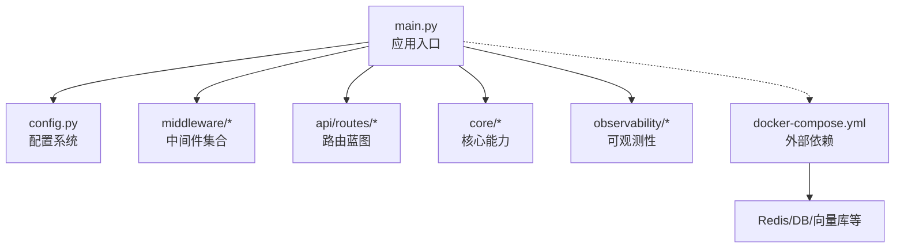

图表来源
- [backend_design/nexus/main.py](file://backend_design/nexus/main.py)
- [backend_design/nexus/config.py](file://backend_design/nexus/config.py)
- [backend_design/nexus/middleware/__init__.py](file://backend_design/nexus/middleware/__init__.py)
- [backend_design/nexus/api/routes/__init__.py](file://backend_design/nexus/api/routes/__init__.py)
- [backend_design/nexus/observability/metrics.py](file://backend_design/nexus/observability/metrics.py)
- [docker-compose.yml](file://docker-compose.yml)

章节来源
- [backend_design/nexus/main.py](file://backend_design/nexus/main.py)
- [backend_design/nexus/config.py](file://backend_design/nexus/config.py)
- [backend_design/pyproject.toml](file://backend_design/pyproject.toml)
- [docker-compose.yml](file://docker-compose.yml)

## 核心组件
- 应用入口与生命周期
  - 负责创建FastAPI实例、挂载中间件、注册路由、定义启动/关闭钩子、暴露健康检查端点
- 配置系统
  - 集中读取环境变量与配置文件，提供类型化访问接口，支持多环境隔离
- 中间件体系
  - 限流、缓存、会话存储、任务队列等横切能力，通过统一入口注册
- 路由蓝图
  - 按业务域拆分路由模块，统一挂载到主应用
- 可观测性
  - 指标采集、链路追踪、数据保留策略等
- 核心支撑
  - 日志、异常、认证、租户上下文、语音识别/合成等

章节来源
- [backend_design/nexus/main.py](file://backend_design/nexus/main.py)
- [backend_design/nexus/config.py](file://backend_design/nexus/config.py)
- [backend_design/nexus/middleware/__init__.py](file://backend_design/nexus/middleware/__init__.py)
- [backend_design/nexus/api/routes/__init__.py](file://backend_design/nexus/api/routes/__init__.py)
- [backend_design/nexus/observability/metrics.py](file://backend_design/nexus/observability/metrics.py)
- [backend_design/nexus/core/logger.py](file://backend_design/nexus/core/logger.py)
- [backend_design/nexus/core/exceptions.py](file://backend_design/nexus/core/exceptions.py)

## 架构总览
下图展示了从进程启动到请求处理的端到端路径，包括配置加载、中间件链、路由分发与可观测性埋点。

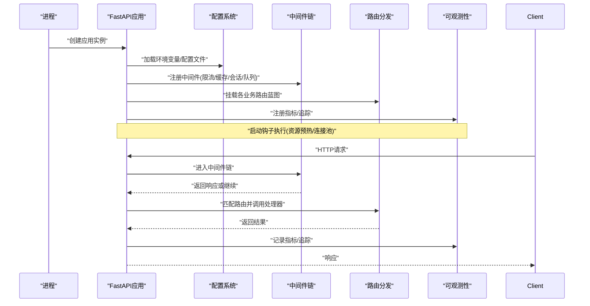

图表来源
- [backend_design/nexus/main.py](file://backend_design/nexus/main.py)
- [backend_design/nexus/config.py](file://backend_design/nexus/config.py)
- [backend_design/nexus/middleware/__init__.py](file://backend_design/nexus/middleware/__init__.py)
- [backend_design/nexus/api/routes/__init__.py](file://backend_design/nexus/api/routes/__init__.py)
- [backend_design/nexus/observability/metrics.py](file://backend_design/nexus/observability/metrics.py)

## 详细组件分析

### 应用启动流程（依赖初始化、中间件注册、路由配置）
- 依赖初始化
  - 在应用创建前后完成外部依赖的初始化与连接池准备（如Redis、数据库、向量库等），并通过启动钩子确保资源就绪
- 中间件注册
  - 统一在入口中按优先级注册中间件，典型顺序为：安全/跨域 -> 鉴权/租户 -> 限流 -> 缓存 -> 会话 -> 任务队列 -> 日志/追踪
- 路由配置
  - 将各业务域的路由蓝图挂载至主应用，建议按前缀或域名空间进行分组，便于治理与权限控制
- 健康检查
  - 提供健康检查端点，聚合各子系统状态（数据库、缓存、外部服务等）

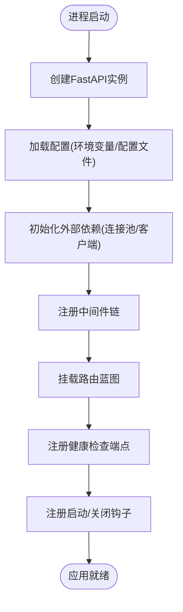

图表来源
- [backend_design/nexus/main.py](file://backend_design/nexus/main.py)
- [backend_design/nexus/config.py](file://backend_design/nexus/config.py)
- [backend_design/nexus/api/routes/health.py](file://backend_design/nexus/api/routes/health.py)

章节来源
- [backend_design/nexus/main.py](file://backend_design/nexus/main.py)
- [backend_design/nexus/api/routes/health.py](file://backend_design/nexus/api/routes/health.py)

### 模块化组织方式（蓝图划分、导入顺序、依赖注入）
- 蓝图划分
  - api/routes下按业务域拆分子模块（如auth、chat、vehicle、settings等），每个模块仅关注自身路由与处理器
  - middleware下按能力拆分（限流、缓存、会话、任务队列），通过统一入口聚合注册
- 导入顺序
  - 先导入配置与核心能力，再导入中间件，最后导入路由蓝图，避免循环依赖与重复初始化
- 依赖注入
  - 使用FastAPI的依赖注入机制，将共享服务（如配置、数据库连接、缓存客户端）以依赖形式注入到路由处理器与中间件中，提升可测试性与解耦度

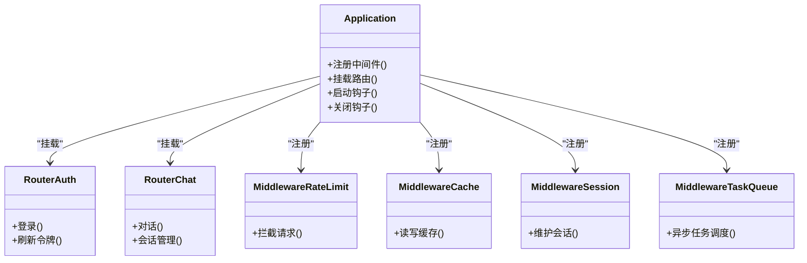

图表来源
- [backend_design/nexus/main.py](file://backend_design/nexus/main.py)
- [backend_design/nexus/api/routes/__init__.py](file://backend_design/nexus/api/routes/__init__.py)
- [backend_design/nexus/middleware/__init__.py](file://backend_design/nexus/middleware/__init__.py)

章节来源
- [backend_design/nexus/api/routes/__init__.py](file://backend_design/nexus/api/routes/__init__.py)
- [backend_design/nexus/middleware/__init__.py](file://backend_design/nexus/middleware/__init__.py)

### 配置管理系统（环境变量、配置文件、环境隔离）
- 环境变量加载
  - 优先从环境变量读取运行时参数，支持默认值与类型转换
- 配置文件解析
  - 支持YAML/JSON/TOML等格式，按环境选择不同配置文件
- 环境隔离策略
  - 通过环境标识（如dev/test/prod）切换配置集，实现数据库、缓存、第三方服务地址与凭据隔离
- 配置校验
  - 对必填项与取值范围进行校验，失败时快速失败并给出明确提示

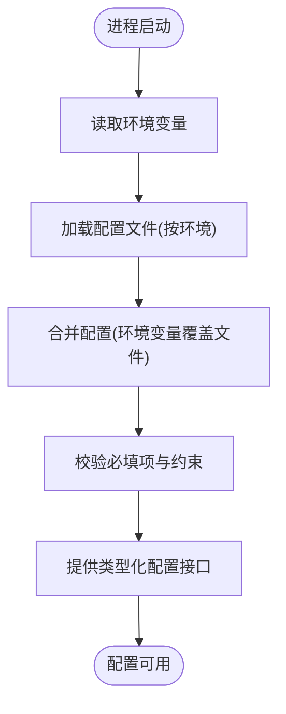

图表来源
- [backend_design/nexus/config.py](file://backend_design/nexus/config.py)

章节来源
- [backend_design/nexus/config.py](file://backend_design/nexus/config.py)

### 应用生命周期管理（启动钩子、关闭钩子、健康检查）
- 启动钩子
  - 用于预热模型、建立连接池、初始化缓存、注册指标等
- 关闭钩子
  - 用于优雅关闭、释放资源、持久化状态、上报指标等
- 健康检查端点
  - 聚合各子系统健康状态，供网关或编排平台探测

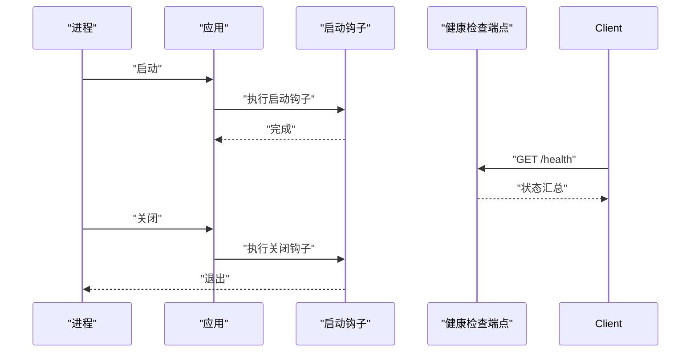

图表来源
- [backend_design/nexus/main.py](file://backend_design/nexus/main.py)
- [backend_design/nexus/api/routes/health.py](file://backend_design/nexus/api/routes/health.py)

章节来源
- [backend_design/nexus/main.py](file://backend_design/nexus/main.py)
- [backend_design/nexus/api/routes/health.py](file://backend_design/nexus/api/routes/health.py)

### 错误处理全局配置
- 全局异常映射
  - 将业务异常映射为统一的HTTP响应格式，包含错误码、消息与调试信息开关
- 未捕获异常兜底
  - 对未知异常返回标准化错误响应，避免泄露敏感信息
- 结构化错误日志
  - 记录请求ID、路径、方法、耗时与堆栈摘要，便于定位问题

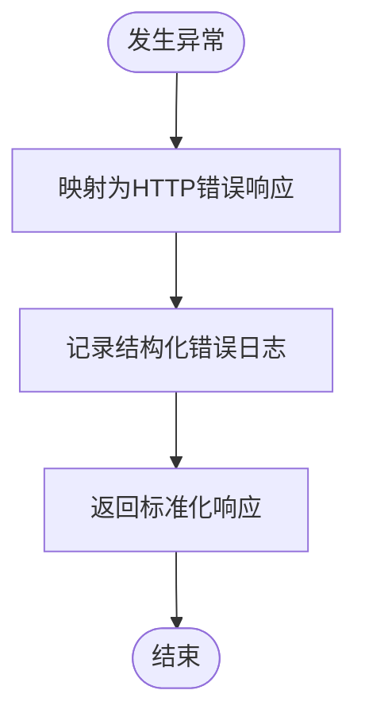

图表来源
- [backend_design/nexus/core/exceptions.py](file://backend_design/nexus/core/exceptions.py)

章节来源
- [backend_design/nexus/core/exceptions.py](file://backend_design/nexus/core/exceptions.py)

### 日志记录初始化
- 日志级别与输出
  - 根据环境设置日志级别，控制台与文件输出分离
- 结构化字段
  - 统一附加请求ID、用户标识、租户标识、耗时等字段
- 采样与轮转
  - 生产环境启用采样与日志轮转，降低IO开销

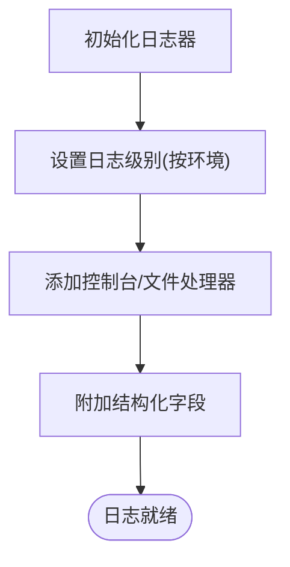

图表来源
- [backend_design/nexus/core/logger.py](file://backend_design/nexus/core/logger.py)

章节来源
- [backend_design/nexus/core/logger.py](file://backend_design/nexus/core/logger.py)

### 监控指标注册
- 指标类型
  - 请求计数、延迟分布、错误率、业务指标（对话轮次、技能调用次数等）
- 指标导出
  - 暴露Prometheus抓取端点，结合Grafana可视化
- 指标粒度
  - 支持按路由、方法、状态码、租户维度聚合

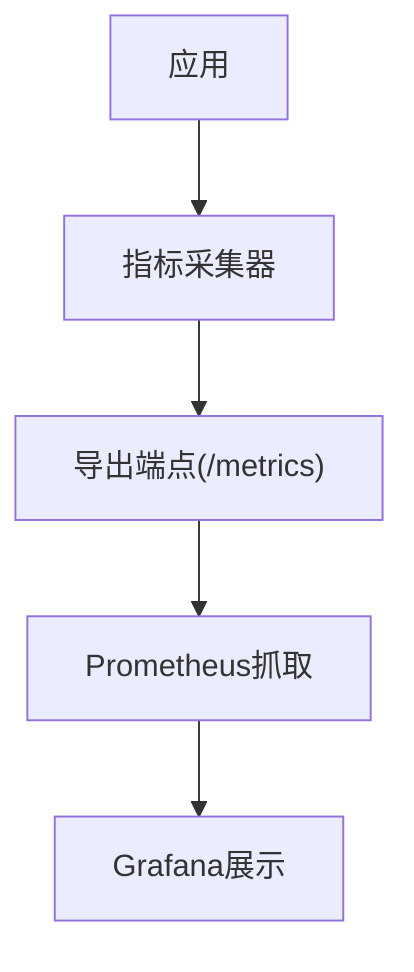

图表来源
- [backend_design/nexus/observability/metrics.py](file://backend_design/nexus/observability/metrics.py)
- [backend_design/nexus/observability/cockpit_metrics.py](file://backend_design/nexus/observability/cockpit_metrics.py)

章节来源
- [backend_design/nexus/observability/metrics.py](file://backend_design/nexus/observability/metrics.py)
- [backend_design/nexus/observability/cockpit_metrics.py](file://backend_design/nexus/observability/cockpit_metrics.py)

### 扩展点说明（自定义中间件、插件注册、服务发现）
- 自定义中间件开发
  - 遵循统一中间件接口，实现请求拦截、响应修改、异常处理与指标埋点
  - 在中间件入口中按优先级注册，确保与其他中间件的协作顺序正确
- 插件注册机制
  - 通过注册表模式收集与发现插件（如技能、意图路由、RAG检索器等），支持动态加载与热更新
- 服务发现集成
  - 基于配置或外部服务发现中心，动态获取下游服务地址与健康状态，配合熔断与重试策略

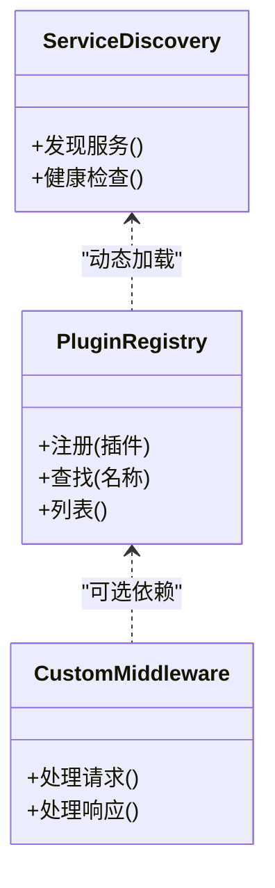

图表来源
- [backend_design/nexus/middleware/__init__.py](file://backend_design/nexus/middleware/__init__.py)
- [backend_design/nexus/skills/orchestrator.py](file://backend_design/nexus/skills/orchestrator.py)
- [backend_design/nexus/intent/router.py](file://backend_design/nexus/intent/router.py)

章节来源
- [backend_design/nexus/middleware/__init__.py](file://backend_design/nexus/middleware/__init__.py)
- [backend_design/nexus/skills/orchestrator.py](file://backend_design/nexus/skills/orchestrator.py)
- [backend_design/nexus/intent/router.py](file://backend_design/nexus/intent/router.py)

## 依赖关系分析
- 内部依赖
  - main.py依赖config、middleware、routes、observability与core模块
  - routes依赖core中的认证、异常、日志等能力
  - middleware依赖配置与外部依赖（如Redis）
- 外部依赖
  - Redis、数据库、向量库、LLM/TTS/ASR服务等，通过配置与连接池管理
- 潜在耦合点
  - 中间件顺序强相关，需严格约定；配置变更影响多个子系统，应集中管理

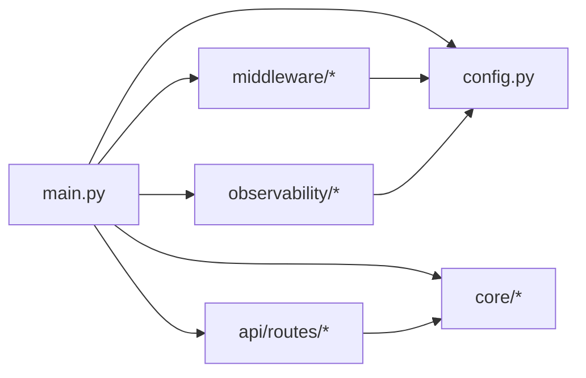

图表来源
- [backend_design/nexus/main.py](file://backend_design/nexus/main.py)
- [backend_design/nexus/config.py](file://backend_design/nexus/config.py)
- [backend_design/nexus/middleware/__init__.py](file://backend_design/nexus/middleware/__init__.py)
- [backend_design/nexus/api/routes/__init__.py](file://backend_design/nexus/api/routes/__init__.py)
- [backend_design/nexus/observability/metrics.py](file://backend_design/nexus/observability/metrics.py)

章节来源
- [backend_design/nexus/main.py](file://backend_design/nexus/main.py)
- [backend_design/nexus/config.py](file://backend_design/nexus/config.py)
- [backend_design/nexus/middleware/__init__.py](file://backend_design/nexus/middleware/__init__.py)
- [backend_design/nexus/api/routes/__init__.py](file://backend_design/nexus/api/routes/__init__.py)
- [backend_design/nexus/observability/metrics.py](file://backend_design/nexus/observability/metrics.py)

## 性能考虑
- 中间件顺序优化
  - 将无状态且高吞吐的中间件前置，减少不必要的计算与I/O
- 连接池与复用
  - 数据库、Redis、HTTP客户端均使用连接池，避免频繁握手
- 缓存策略
  - 热点数据多级缓存（内存+Redis），合理设置TTL与失效策略
- 异步与并发
  - 长耗时操作走异步任务队列，避免阻塞请求线程
- 指标与采样
  - 生产环境开启指标采样与日志采样，降低额外开销

[本节为通用指导，不直接分析具体文件]

## 故障排查指南
- 常见问题定位
  - 健康检查失败：检查各子系统依赖是否可达，查看健康端点返回详情
  - 限流触发：确认限流阈值与白名单配置，观察指标面板
  - 缓存异常：核对Redis连通性与键空间，检查序列化/反序列化
  - 会话丢失：验证会话存储后端与Cookie/Token策略
- 日志与指标
  - 使用结构化日志关键字段（请求ID、租户、用户）关联问题
  - 通过指标面板观察错误率、延迟与资源使用趋势
- 快速恢复
  - 重启受影响的子服务，必要时降级非关键功能

章节来源
- [backend_design/nexus/api/routes/health.py](file://backend_design/nexus/api/routes/health.py)
- [backend_design/nexus/middleware/rate_limiter.py](file://backend_design/nexus/middleware/rate_limiter.py)
- [backend_design/nexus/middleware/redis_cache.py](file://backend_design/nexus/middleware/redis_cache.py)
- [backend_design/nexus/middleware/session_store.py](file://backend_design/nexus/middleware/session_store.py)
- [backend_design/nexus/middleware/task_queue.py](file://backend_design/nexus/middleware/task_queue.py)

## 结论
本框架以FastAPI为核心，围绕配置、中间件、路由与可观测性形成清晰的模块化边界。通过严格的启动流程、统一的生命周期管理与可扩展的中间件/插件机制，既保证了系统的稳定性与可观测性，也为后续演进提供了良好的扩展点。

[本节为总结性内容，不直接分析具体文件]

## 附录
- 运行与部署
  - 使用docker-compose编排外部依赖，结合环境变量与配置文件实现多环境部署
- 依赖清单
  - 参考pyproject.toml了解核心依赖版本与特性

章节来源
- [docker-compose.yml](file://docker-compose.yml)
- [backend_design/pyproject.toml](file://backend_design/pyproject.toml)