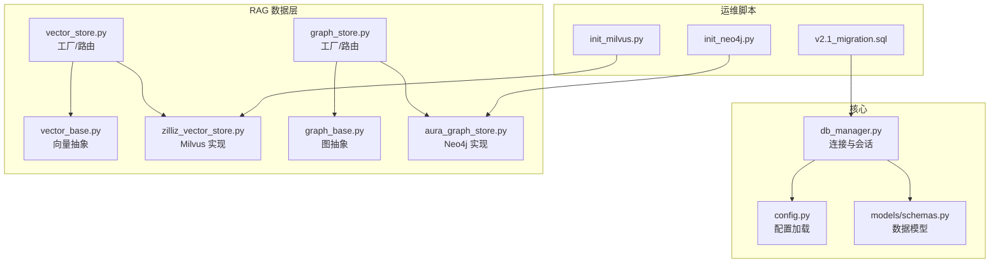
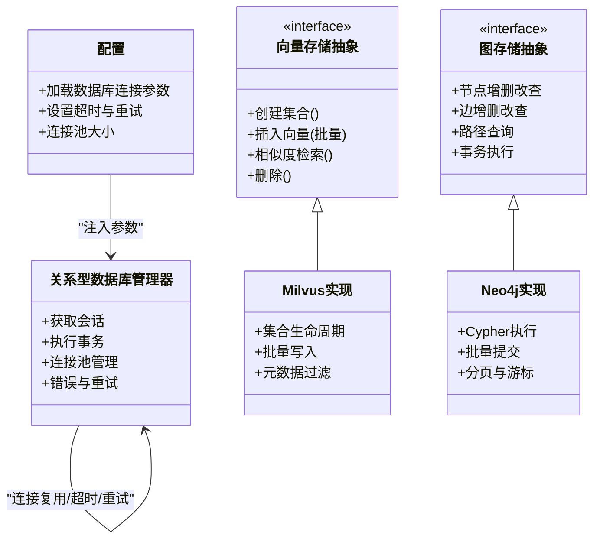
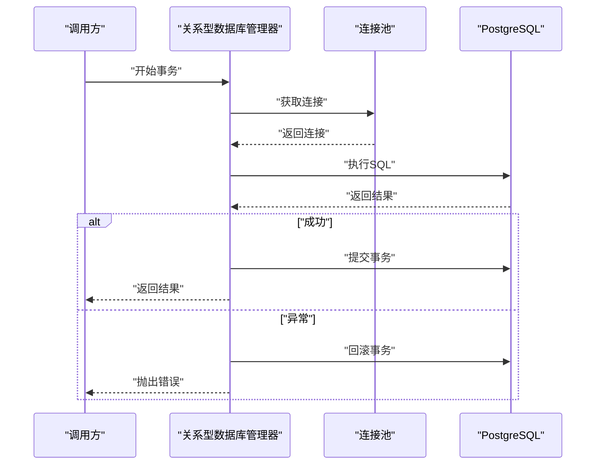
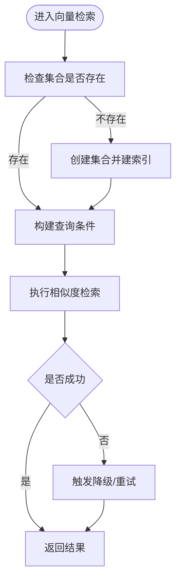
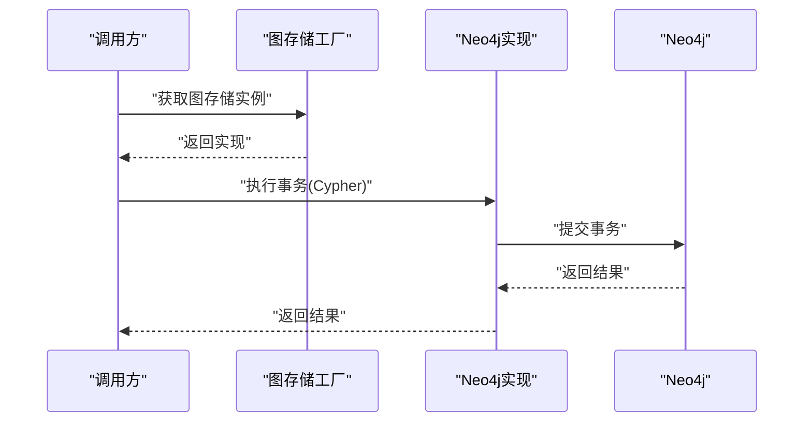
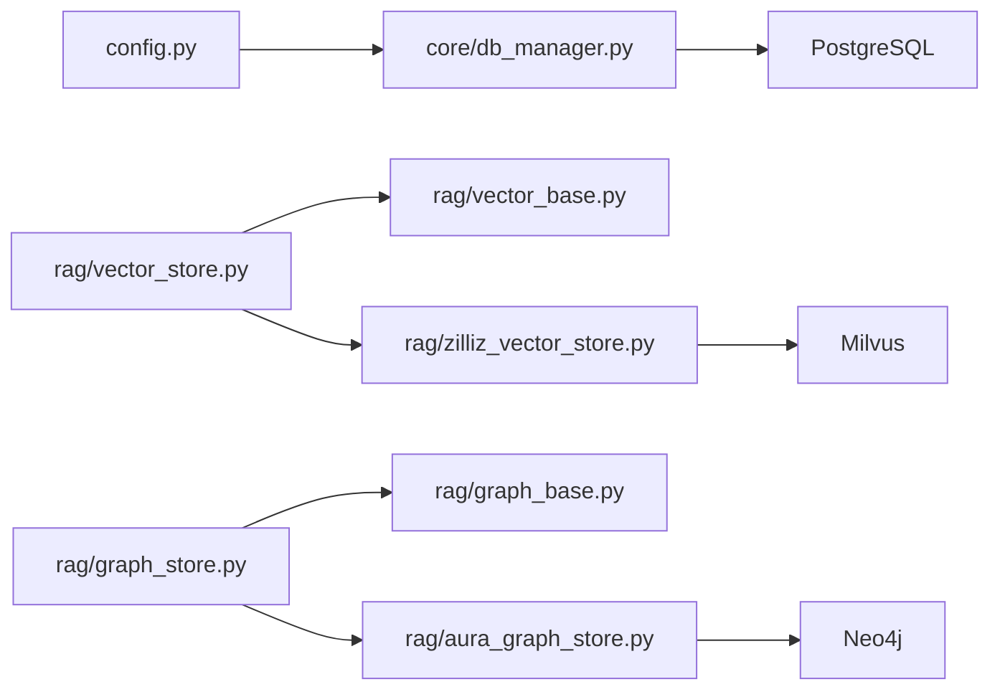

# 数据库管理

<cite>
**本文引用的文件**   
- [backend_design/nexus/core/db_manager.py](file://backend_design/nexus/core/db_manager.py)
- [backend_design/nexus/rag/vector_store.py](file://backend_design/nexus/rag/vector_store.py)
- [backend_design/nexus/rag/vector_base.py](file://backend_design/nexus/rag/vector_base.py)
- [backend_design/nexus/rag/zilliz_vector_store.py](file://backend_design/nexus/rag/zilliz_vector_store.py)
- [backend_design/nexus/rag/graph_store.py](file://backend_design/nexus/rag/graph_store.py)
- [backend_design/nexus/rag/graph_base.py](file://backend_design/nexus/rag/graph_base.py)
- [backend_design/nexus/rag/aura_graph_store.py](file://backend_design/nexus/rag/aura_graph_store.py)
- [backend_design/nexus/models/schemas.py](file://backend_design/nexus/models/schemas.py)
- [backend_design/nexus/config.py](file://backend_design/nexus/config.py)
- [backend_design/scripts/init_milvus.py](file://backend_design/scripts/init_milvus.py)
- [backend_design/scripts/init_neo4j.py](file://backend_design/scripts/init_neo4j.py)
- [backend_design/scripts/v2.1_migration.sql](file://backend_design/scripts/v2.1_migration.sql)
- [backend_design/tests/test_db.py](file://backend_design/tests/test_db.py)
</cite>

## 目录
1. [简介](#简介)
2. [项目结构](#项目结构)
3. [核心组件](#核心组件)
4. [架构总览](#架构总览)
5. [详细组件分析](#详细组件分析)
6. [依赖关系分析](#依赖关系分析)
7. [性能考虑](#性能考虑)
8. [故障排查指南](#故障排查指南)
9. [结论](#结论)
10. [附录](#附录)

## 简介
本文件为 NexusCockpit 的数据库管理层提供架构文档，重点覆盖以下方面：
- 多数据库统一抽象层：关系型数据库（PostgreSQL）、向量数据库（Milvus）与图数据库（Neo4j）的统一接口设计。
- 连接池管理策略：连接复用、超时配置与故障转移机制。
- 事务处理模式：分布式事务、补偿事务与最终一致性保证。
- 数据访问层设计：ORM 模型定义、查询构建器与批量操作优化。
- 迁移管理：版本控制与回滚策略。
- 性能优化：索引策略、查询优化与缓存策略。

## 项目结构
NexusCockpit 后端采用分层组织方式，数据库相关代码主要分布在 core 与 rag 两个子模块中：
- core.db_manager：负责关系型数据库（PostgreSQL）的连接、会话与基础事务能力。
- rag.vector_*：面向向量检索的统一抽象与 Milvus 实现。
- rag.graph_*：面向图检索的统一抽象与 Neo4j 实现。
- models.schemas：Pydantic 数据模型，作为 ORM 映射与 API 契约的基础。
- scripts.*：初始化脚本与迁移 SQL，用于环境准备与版本演进。

图表来源
- [backend_design/nexus/core/db_manager.py](file://backend_design/nexus/core/db_manager.py)
- [backend_design/nexus/config.py](file://backend_design/nexus/config.py)
- [backend_design/nexus/models/schemas.py](file://backend_design/nexus/models/schemas.py)
- [backend_design/nexus/rag/vector_base.py](file://backend_design/nexus/rag/vector_base.py)
- [backend_design/nexus/rag/vector_store.py](file://backend_design/nexus/rag/vector_store.py)
- [backend_design/nexus/rag/zilliz_vector_store.py](file://backend_design/nexus/rag/zilliz_vector_store.py)
- [backend_design/nexus/rag/graph_base.py](file://backend_design/nexus/rag/graph_base.py)
- [backend_design/nexus/rag/graph_store.py](file://backend_design/nexus/rag/graph_store.py)
- [backend_design/nexus/rag/aura_graph_store.py](file://backend_design/nexus/rag/aura_graph_store.py)
- [backend_design/scripts/init_milvus.py](file://backend_design/scripts/init_milvus.py)
- [backend_design/scripts/init_neo4j.py](file://backend_design/scripts/init_neo4j.py)
- [backend_design/scripts/v2.1_migration.sql](file://backend_design/scripts/v2.1_migration.sql)

章节来源
- [backend_design/nexus/core/db_manager.py](file://backend_design/nexus/core/db_manager.py)
- [backend_design/nexus/rag/vector_store.py](file://backend_design/nexus/rag/vector_store.py)
- [backend_design/nexus/rag/vector_base.py](file://backend_design/nexus/rag/vector_base.py)
- [backend_design/nexus/rag/zilliz_vector_store.py](file://backend_design/nexus/rag/zilliz_vector_store.py)
- [backend_design/nexus/rag/graph_store.py](file://backend_design/nexus/rag/graph_store.py)
- [backend_design/nexus/rag/graph_base.py](file://backend_design/nexus/rag/graph_base.py)
- [backend_design/nexus/rag/aura_graph_store.py](file://backend_design/nexus/rag/aura_graph_store.py)
- [backend_design/nexus/models/schemas.py](file://backend_design/nexus/models/schemas.py)
- [backend_design/nexus/config.py](file://backend_design/nexus/config.py)
- [backend_design/scripts/init_milvus.py](file://backend_design/scripts/init_milvus.py)
- [backend_design/scripts/init_neo4j.py](file://backend_design/scripts/init_neo4j.py)
- [backend_design/scripts/v2.1_migration.sql](file://backend_design/scripts/v2.1_migration.sql)

## 核心组件
- 关系型数据库管理器（db_manager）
  - 职责：建立并维护 PostgreSQL 连接池、提供会话上下文、封装常用事务边界与错误处理。
  - 关键特性：连接复用、超时控制、重试与熔断（结合核心电路断路器）。
- 向量存储抽象与实现（vector_base / vector_store / zilliz_vector_store）
  - 职责：统一向量检索接口（创建集合、写入向量、相似度检索、删除等），默认实现基于 Milvus。
  - 关键特性：集合生命周期管理、批量写入、元数据过滤、容错与降级。
- 图存储抽象与实现（graph_base / graph_store / aura_graph_store）
  - 职责：统一图检索接口（节点/边增删改查、路径查询、标签/属性过滤），默认实现基于 Neo4j。
  - 关键特性：事务性 Cypher 执行、批量提交、失败重试与结果分页。
- 数据模型（models/schemas.py）
  - 职责：以 Pydantic 模型描述实体与 DTO，作为 ORM 映射与 API 契约的基础。
- 配置（config.py）
  - 职责：集中加载数据库连接参数、超时、重试、连接池大小等运行时配置。
- 运维脚本（scripts/*）
  - 职责：初始化 Milvus 集合、Neo4j 图结构与约束、执行数据库迁移脚本。

章节来源
- [backend_design/nexus/core/db_manager.py](file://backend_design/nexus/core/db_manager.py)
- [backend_design/nexus/rag/vector_base.py](file://backend_design/nexus/rag/vector_base.py)
- [backend_design/nexus/rag/vector_store.py](file://backend_design/nexus/rag/vector_store.py)
- [backend_design/nexus/rag/zilliz_vector_store.py](file://backend_design/nexus/rag/zilliz_vector_store.py)
- [backend_design/nexus/rag/graph_base.py](file://backend_design/nexus/rag/graph_base.py)
- [backend_design/nexus/rag/graph_store.py](file://backend_design/nexus/rag/graph_store.py)
- [backend_design/nexus/rag/aura_graph_store.py](file://backend_design/nexus/rag/aura_graph_store.py)
- [backend_design/nexus/models/schemas.py](file://backend_design/nexus/models/schemas.py)
- [backend_design/nexus/config.py](file://backend_design/nexus/config.py)
- [backend_design/scripts/init_milvus.py](file://backend_design/scripts/init_milvus.py)
- [backend_design/scripts/init_neo4j.py](file://backend_design/scripts/init_neo4j.py)
- [backend_design/scripts/v2.1_migration.sql](file://backend_design/scripts/v2.1_migration.sql)

## 架构总览
下图展示了多数据库统一抽象层的整体架构：上层通过统一的工厂/路由选择具体实现，底层分别对接 PostgreSQL、Milvus 与 Neo4j。

图表来源
- [backend_design/nexus/core/db_manager.py](file://backend_design/nexus/core/db_manager.py)
- [backend_design/nexus/config.py](file://backend_design/nexus/config.py)
- [backend_design/nexus/rag/vector_base.py](file://backend_design/nexus/rag/vector_base.py)
- [backend_design/nexus/rag/zilliz_vector_store.py](file://backend_design/nexus/rag/zilliz_vector_store.py)
- [backend_design/nexus/rag/graph_base.py](file://backend_design/nexus/rag/graph_base.py)
- [backend_design/nexus/rag/aura_graph_store.py](file://backend_design/nexus/rag/aura_graph_store.py)

## 详细组件分析

### 关系型数据库管理器（PostgreSQL）
- 连接池与复用
  - 使用连接池对象统一管理连接，避免频繁创建销毁开销。
  - 会话级连接绑定，确保同一请求内复用同一连接。
- 超时与重试
  - 连接建立、查询执行均支持超时配置；对瞬态错误进行有限次重试。
- 事务边界
  - 提供显式事务上下文，支持嵌套事务（保存点）与异常回滚。
- 错误处理与熔断
  - 将连接异常转换为统一错误类型，结合电路断路器快速失败与恢复。

图表来源
- [backend_design/nexus/core/db_manager.py](file://backend_design/nexus/core/db_manager.py)

章节来源
- [backend_design/nexus/core/db_manager.py](file://backend_design/nexus/core/db_manager.py)

### 向量存储抽象与 Milvus 实现
- 统一接口
  - 集合创建/存在检查、批量插入、相似度检索、按元数据过滤、删除集合或条目。
- 批量写入优化
  - 分片批量提交，降低单次请求体积，提升吞吐。
- 容错与降级
  - 对网络抖动与部分失败进行重试；在不可用时返回空结果或走本地缓存。

图表来源
- [backend_design/nexus/rag/vector_base.py](file://backend_design/nexus/rag/vector_base.py)
- [backend_design/nexus/rag/zilliz_vector_store.py](file://backend_design/nexus/rag/zilliz_vector_store.py)

章节来源
- [backend_design/nexus/rag/vector_base.py](file://backend_design/nexus/rag/vector_base.py)
- [backend_design/nexus/rag/zilliz_vector_store.py](file://backend_design/nexus/rag/zilliz_vector_store.py)

### 图存储抽象与 Neo4j 实现
- 统一接口
  - 节点/边的增删改查、路径查询、标签与属性过滤、事务化 Cypher 执行。
- 批量与分页
  - 批量提交减少往返次数；长列表查询采用分页或游标。
- 事务与一致性
  - 单事务内保证原子性；跨服务场景采用补偿事务与最终一致性。

图表来源
- [backend_design/nexus/rag/graph_base.py](file://backend_design/nexus/rag/graph_base.py)
- [backend_design/nexus/rag/aura_graph_store.py](file://backend_design/nexus/rag/aura_graph_store.py)

章节来源
- [backend_design/nexus/rag/graph_base.py](file://backend_design/nexus/rag/graph_base.py)
- [backend_design/nexus/rag/aura_graph_store.py](file://backend_design/nexus/rag/aura_graph_store.py)

### 数据模型与 ORM 映射
- Pydantic 模型
  - 使用 Pydantic 定义强类型实体与 DTO，便于校验、序列化与文档生成。
- ORM 映射建议
  - 将 Pydantic 模型与 SQLAlchemy 模型解耦，通过转换层保持双向一致。
- 查询构建器
  - 基于表达式树构建动态查询，支持组合条件、排序与分页。

章节来源
- [backend_design/nexus/models/schemas.py](file://backend_design/nexus/models/schemas.py)

### 配置与连接参数
- 集中配置
  - 数据库地址、端口、用户名、密码、数据库名、SSL 开关等。
- 连接池与超时
  - 最大连接数、最小空闲连接、连接超时、查询超时、连接回收间隔。
- 重试与熔断
  - 重试次数、退避策略、熔断阈值与恢复时间。

章节来源
- [backend_design/nexus/config.py](file://backend_design/nexus/config.py)

### 初始化与迁移
- 初始化脚本
  - init_milvus.py：创建集合、维度、索引类型与元数据字段。
  - init_neo4j.py：创建节点标签、边类型、唯一约束与索引。
- 迁移管理
  - v2.1_migration.sql：DDL/DML 变更脚本，遵循版本号命名规范。
- 版本控制与回滚
  - 每个迁移脚本包含向上与向下（回滚）语句；发布前在预发环境验证。

章节来源
- [backend_design/scripts/init_milvus.py](file://backend_design/scripts/init_milvus.py)
- [backend_design/scripts/init_neo4j.py](file://backend_design/scripts/init_neo4j.py)
- [backend_design/scripts/v2.1_migration.sql](file://backend_design/scripts/v2.1_migration.sql)

## 依赖关系分析
- 耦合与内聚
  - db_manager 仅依赖配置与连接池库，内聚度高。
  - vector_store/graph_store 作为工厂/路由，低耦合地选择具体实现。
- 外部依赖
  - PostgreSQL 驱动、Milvus SDK、Neo4j Python Driver。
- 潜在循环依赖
  - 通过抽象层与工厂模式避免直接循环引用。

图表来源
- [backend_design/nexus/config.py](file://backend_design/nexus/config.py)
- [backend_design/nexus/core/db_manager.py](file://backend_design/nexus/core/db_manager.py)
- [backend_design/nexus/rag/vector_store.py](file://backend_design/nexus/rag/vector_store.py)
- [backend_design/nexus/rag/vector_base.py](file://backend_design/nexus/rag/vector_base.py)
- [backend_design/nexus/rag/zilliz_vector_store.py](file://backend_design/nexus/rag/zilliz_vector_store.py)
- [backend_design/nexus/rag/graph_store.py](file://backend_design/nexus/rag/graph_store.py)
- [backend_design/nexus/rag/graph_base.py](file://backend_design/nexus/rag/graph_base.py)
- [backend_design/nexus/rag/aura_graph_store.py](file://backend_design/nexus/rag/aura_graph_store.py)

## 性能考虑
- 索引策略
  - 关系型：为高频过滤与排序列建立合适索引，避免过度索引导致写放大。
  - 向量：根据查询模式选择 HNSW/IVF 等索引，平衡召回率与延迟。
  - 图：为常用标签与属性建立唯一约束与索引，缩短路径扫描范围。
- 查询优化
  - 限制返回字段、使用分页与游标、避免 SELECT *。
  - 批量操作合并多次往返，减少网络开销。
- 缓存策略
  - 热点数据使用 Redis 缓存，设置合理 TTL 与失效策略。
  - 向量检索结果可短期缓存，注意一致性窗口。
- 连接池调优
  - 根据并发与延迟目标调整最大连接数与超时；监控连接等待队列。
- 监控与观测
  - 暴露数据库指标（QPS、延迟、错误率、连接池使用率），结合告警阈值。

[本节为通用指导，不直接分析具体文件]

## 故障排查指南
- 常见问题定位
  - 连接失败：检查认证、网络连通性与 SSL 配置。
  - 查询超时：查看慢查询日志与索引命中情况。
  - 向量检索失败：确认集合存在、维度匹配与索引状态。
  - 图查询异常：检查 Cypher 语法、约束冲突与权限。
- 测试与验证
  - 使用集成测试脚本验证连接、事务与基本读写流程。

章节来源
- [backend_design/tests/test_db.py](file://backend_design/tests/test_db.py)

## 结论
NexusCockpit 的数据库管理层通过统一抽象层将关系型、向量与图数据库整合，配合连接池、超时与重试、事务与补偿机制，以及完善的迁移与监控体系，实现了高可用、可扩展且易维护的数据访问能力。后续可在查询构建器、批量写入与缓存策略上持续优化，进一步提升系统吞吐与稳定性。

## 附录
- 术语
  - 连接池：复用数据库连接的资源池。
  - 最终一致性：允许短暂不一致，但保证最终收敛到一致状态。
  - 补偿事务：通过反向操作撤销已提交的部分变更，达到业务一致性。
- 参考
  - 配置项说明见配置文件。
  - 初始化与迁移脚本见 scripts 目录。