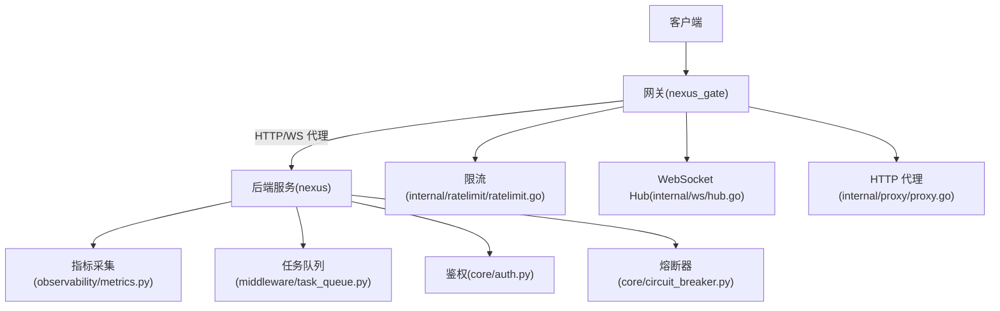
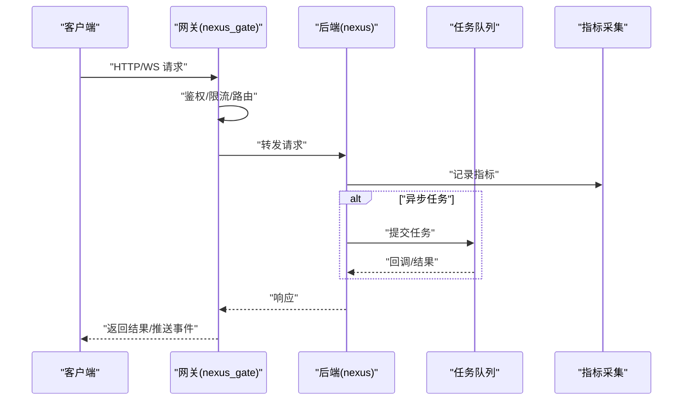
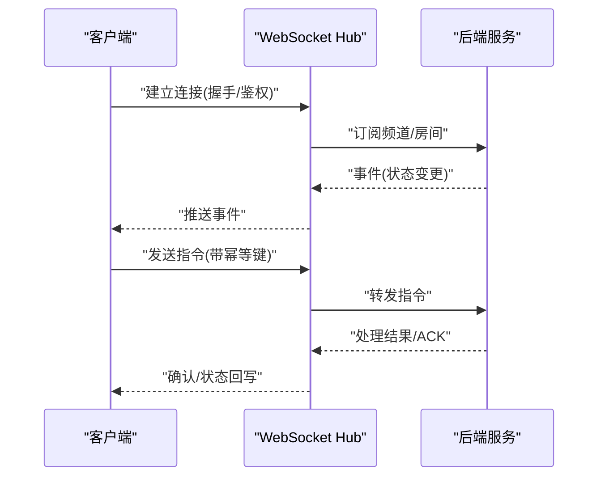
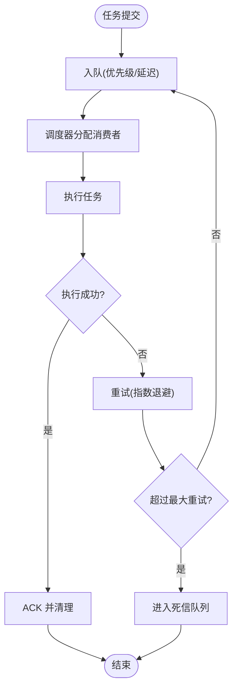
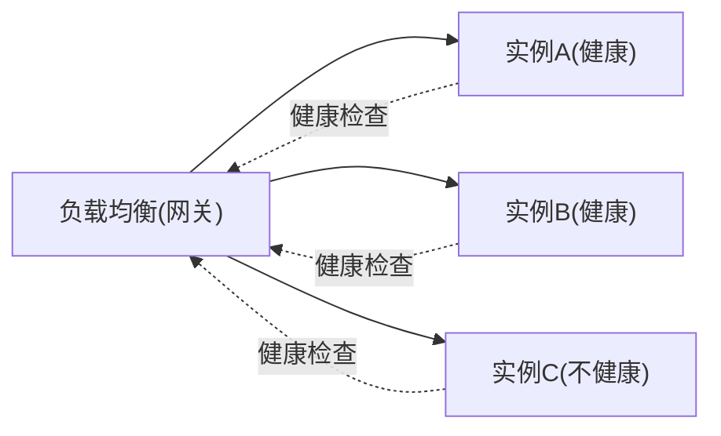
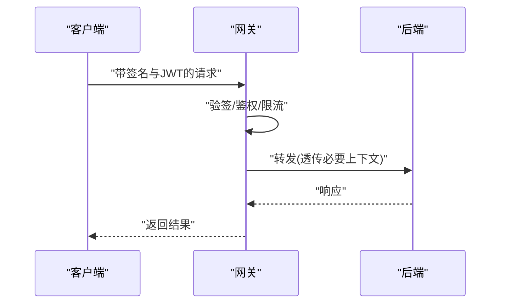
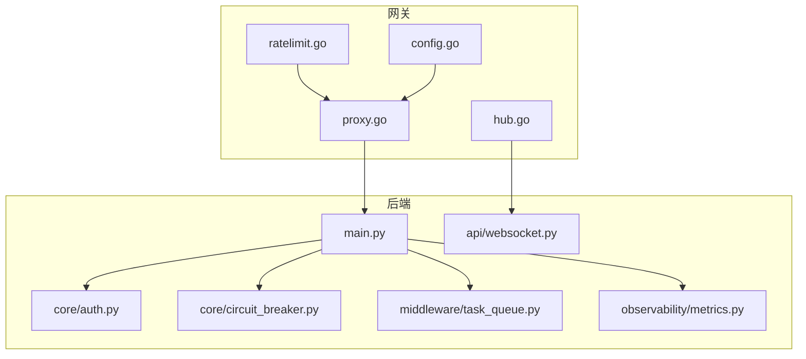

# 服务间通信

<cite>
**本文引用的文件**   
- [backend_design/nexus/main.py](file://backend_design/nexus/main.py)
- [backend_design/nexus/api/websocket.py](file://backend_design/nexus/api/websocket.py)
- [backend_design/nexus/core/auth.py](file://backend_design/nexus/core/auth.py)
- [backend_design/nexus/middleware/task_queue.py](file://backend_design/nexus/middleware/task_queue.py)
- [backend_design/nexus/core/circuit_breaker.py](file://backend_design/nexus/core/circuit_breaker.py)
- [backend_design/nexus/observability/metrics.py](file://backend_design/nexus/observability/metrics.py)
- [backend_design/nexus_gate/internal/proxy/proxy.go](file://backend_design/nexus_gate/internal/proxy/proxy.go)
- [backend_design/nexus_gate/internal/ws/hub.go](file://backend_design/nexus_gate/internal/ws/hub.go)
- [backend_design/nexus_gate/internal/ratelimit/ratelimit.go](file://backend_design/nexus_gate/internal/ratelimit/ratelimit.go)
- [backend_design/nexus_gate/internal/config/config.go](file://backend_design/nexus_gate/internal/config/config.go)
- [backend_design/nexus_gate/proto/nexus.proto](file://backend_design/nexus_gate/proto/nexus.proto)
</cite>

## 目录
1. [简介](#简介)
2. [项目结构](#项目结构)
3. [核心组件](#核心组件)
4. [架构总览](#架构总览)
5. [详细组件分析](#详细组件分析)
6. [依赖关系分析](#依赖关系分析)
7. [性能考虑](#性能考虑)
8. [故障排查指南](#故障排查指南)
9. [结论](#结论)
10. [附录](#附录)

## 简介
本文件聚焦于 NexusCockpit 的服务间通信机制，覆盖以下方面：
- RESTful API 设计规范：统一响应格式、错误码标准与版本管理策略
- WebSocket 实时通信架构：连接管理、消息路由与状态同步
- 异步任务处理系统：任务队列设计、工作进程管理与失败重试策略
- 服务发现与负载均衡：健康检查、故障转移与流量控制
- 通信安全机制：请求签名、数据加密与访问控制
- 性能优化指南：连接池配置、消息批处理与背压处理

## 项目结构
NexusCockpit 采用“网关 + 后端服务”的架构。Go 实现的网关负责鉴权、限流、代理与 WebSocket Hub；Python 后端提供业务 API、WebSocket 端点、异步任务与可观测性能力。

图示来源
- [backend_design/nexus/main.py](file://backend_design/nexus/main.py)
- [backend_design/nexus/api/websocket.py](file://backend_design/nexus/api/websocket.py)
- [backend_design/nexus/core/auth.py](file://backend_design/nexus/core/auth.py)
- [backend_design/nexus/middleware/task_queue.py](file://backend_design/nexus/middleware/task_queue.py)
- [backend_design/nexus/core/circuit_breaker.py](file://backend_design/nexus/core/circuit_breaker.py)
- [backend_design/nexus/observability/metrics.py](file://backend_design/nexus/observability/metrics.py)
- [backend_design/nexus_gate/internal/proxy/proxy.go](file://backend_design/nexus_gate/internal/proxy/proxy.go)
- [backend_design/nexus_gate/internal/ws/hub.go](file://backend_design/nexus_gate/internal/ws/hub.go)
- [backend_design/nexus_gate/internal/ratelimit/ratelimit.go](file://backend_design/nexus_gate/internal/ratelimit/ratelimit.go)

章节来源
- [backend_design/nexus/main.py](file://backend_design/nexus/main.py)
- [backend_design/nexus_gate/internal/proxy/proxy.go](file://backend_design/nexus_gate/internal/proxy/proxy.go)

## 核心组件
- 网关层（nexus_gate）
  - HTTP 代理：将外部请求转发到后端服务，支持路径重写与头部透传
  - WebSocket Hub：维护长连接、广播与房间级路由
  - 限流：基于令牌桶或滑动窗口实现全局与租户级限流
  - 配置中心：集中加载端口、上游地址、TLS 等参数
- 后端服务（nexus）
  - API 路由：RESTful 接口定义与中间件挂载
  - WebSocket 端点：服务端推送事件与双向消息
  - 鉴权：JWT 校验、权限上下文注入
  - 熔断器：对下游调用进行快速失败与恢复
  - 任务队列：异步任务入队、出队与重试
  - 指标：暴露关键指标用于监控与告警

章节来源
- [backend_design/nexus/api/websocket.py](file://backend_design/nexus/api/websocket.py)
- [backend_design/nexus/core/auth.py](file://backend_design/nexus/core/auth.py)
- [backend_design/nexus/middleware/task_queue.py](file://backend_design/nexus/middleware/task_queue.py)
- [backend_design/nexus/core/circuit_breaker.py](file://backend_design/nexus/core/circuit_breaker.py)
- [backend_design/nexus/observability/metrics.py](file://backend_design/nexus/observability/metrics.py)
- [backend_design/nexus_gate/internal/ws/hub.go](file://backend_design/nexus_gate/internal/ws/hub.go)
- [backend_design/nexus_gate/internal/ratelimit/ratelimit.go](file://backend_design/nexus_gate/internal/ratelimit/ratelimit.go)
- [backend_design/nexus_gate/internal/config/config.go](file://backend_design/nexus_gate/internal/config/config.go)

## 架构总览
整体通信链路如下：客户端通过网关接入，网关完成鉴权、限流与协议适配后，将请求转发至后端服务。后端服务在需要时调用下游服务并启用熔断保护，同时通过任务队列执行耗时操作，并通过 WebSocket 向客户端推送实时状态。

图示来源
- [backend_design/nexus_gate/internal/proxy/proxy.go](file://backend_design/nexus_gate/internal/proxy/proxy.go)
- [backend_design/nexus_gate/internal/ws/hub.go](file://backend_design/nexus_gate/internal/ws/hub.go)
- [backend_design/nexus_gate/internal/ratelimit/ratelimit.go](file://backend_design/nexus_gate/internal/ratelimit/ratelimit.go)
- [backend_design/nexus/main.py](file://backend_design/nexus/main.py)
- [backend_design/nexus/middleware/task_queue.py](file://backend_design/nexus/middleware/task_queue.py)
- [backend_design/nexus/observability/metrics.py](file://backend_design/nexus/observability/metrics.py)

## 详细组件分析

### RESTful API 设计规范
- 统一响应格式
  - 成功：包含数据体与元信息（如分页、追踪ID）
  - 失败：包含错误码、人类可读消息与可选详情
- 错误码标准
  - 使用分层错误码：网关层、业务层、第三方依赖层分别定义
  - 建议遵循 HTTP 语义，并在响应体中补充结构化错误信息
- 版本管理策略
  - URL 前缀版本化（例如 /v1/...），必要时在请求头携带兼容标记
  - 废弃策略：保留旧版本至少一个发布周期，并提供迁移指南

章节来源
- [backend_design/nexus/main.py](file://backend_design/nexus/main.py)

### WebSocket 实时通信架构
- 连接管理
  - 网关侧维护连接表与会话上下文，支持按租户/会话维度隔离
  - 心跳检测与断线重连策略由客户端配合实现
- 消息路由
  - 基于主题/房间的路由模型，支持点对点与广播
  - 网关 Hub 负责分发消息到目标连接集合
- 状态同步
  - 服务端主动推送状态变更事件，客户端增量更新本地状态
  - 幂等键与去重机制避免重复渲染

图示来源
- [backend_design/nexus_gate/internal/ws/hub.go](file://backend_design/nexus_gate/internal/ws/hub.go)
- [backend_design/nexus/api/websocket.py](file://backend_design/nexus/api/websocket.py)

章节来源
- [backend_design/nexus_gate/internal/ws/hub.go](file://backend_design/nexus_gate/internal/ws/hub.go)
- [backend_design/nexus/api/websocket.py](file://backend_design/nexus/api/websocket.py)

### 异步任务处理系统
- 任务队列设计
  - 支持优先级、延迟执行与死信队列
  - 任务载荷最小化，大对象走对象存储并传递引用
- 工作进程管理
  - 多进程/多线程消费者，按资源类型隔离
  - 动态扩缩容基于队列深度与 CPU/内存水位
- 失败重试策略
  - 指数退避+抖动，最大重试次数与超时控制
  - 幂等消费与去重键，保证最终一致性

图示来源
- [backend_design/nexus/middleware/task_queue.py](file://backend_design/nexus/middleware/task_queue.py)

章节来源
- [backend_design/nexus/middleware/task_queue.py](file://backend_design/nexus/middleware/task_queue.py)

### 服务发现与负载均衡
- 健康检查
  - 网关定期探测后端实例健康端点，剔除不健康节点
  - 结合熔断器状态进行综合判定
- 故障转移
  - 自动切换至可用实例，失败请求可重试一次
  - 灰度发布与蓝绿切换由网关路由规则控制
- 流量控制
  - 全局与租户级限流，突发流量削峰填谷
  - 基于权重与容量的动态分流

图示来源
- [backend_design/nexus_gate/internal/proxy/proxy.go](file://backend_design/nexus_gate/internal/proxy/proxy.go)
- [backend_design/nexus_gate/internal/ratelimit/ratelimit.go](file://backend_design/nexus_gate/internal/ratelimit/ratelimit.go)

章节来源
- [backend_design/nexus_gate/internal/proxy/proxy.go](file://backend_design/nexus_gate/internal/proxy/proxy.go)
- [backend_design/nexus_gate/internal/ratelimit/ratelimit.go](file://backend_design/nexus_gate/internal/ratelimit/ratelimit.go)

### 通信安全机制
- 请求签名
  - 客户端计算请求体与时间戳签名，网关验签防篡改
  - 签名算法与密钥轮换策略需纳入配置管理
- 数据加密
  - 全链路 TLS 传输，敏感字段应用层加密
  - 证书与密钥由配置中心统一管理
- 访问控制
  - JWT 鉴权与细粒度授权，网关注入用户上下文
  - 跨域与白名单策略在网关层统一管控

图示来源
- [backend_design/nexus_gate/internal/proxy/proxy.go](file://backend_design/nexus_gate/internal/proxy/proxy.go)
- [backend_design/nexus/core/auth.py](file://backend_design/nexus/core/auth.py)

章节来源
- [backend_design/nexus/core/auth.py](file://backend_design/nexus/core/auth.py)
- [backend_design/nexus_gate/internal/proxy/proxy.go](file://backend_design/nexus_gate/internal/proxy/proxy.go)

### 性能优化指南
- 连接池配置
  - HTTP/数据库/缓存连接池大小根据并发与延迟目标调优
  - 空闲连接回收与超时策略防止资源泄漏
- 消息批处理
  - 批量写入与聚合上报，降低 I/O 放大
  - 批大小与超时阈值联动，平衡吞吐与时延
- 背压处理
  - 队列满时拒绝新任务或降级返回
  - 消费者侧速率限制与自适应扩容

章节来源
- [backend_design/nexus/observability/metrics.py](file://backend_design/nexus/observability/metrics.py)

## 依赖关系分析
- 网关依赖
  - 代理模块负责转发与协议适配
  - 限流模块提供流量整形
  - WebSocket Hub 负责连接与消息分发
  - 配置模块集中管理运行时参数
- 后端依赖
  - 鉴权模块提供认证与上下文注入
  - 熔断器保护下游依赖
  - 任务队列支撑异步处理
  - 指标模块输出可观测性数据

图示来源
- [backend_design/nexus_gate/internal/proxy/proxy.go](file://backend_design/nexus_gate/internal/proxy/proxy.go)
- [backend_design/nexus_gate/internal/ratelimit/ratelimit.go](file://backend_design/nexus_gate/internal/ratelimit/ratelimit.go)
- [backend_design/nexus_gate/internal/ws/hub.go](file://backend_design/nexus_gate/internal/ws/hub.go)
- [backend_design/nexus_gate/internal/config/config.go](file://backend_design/nexus_gate/internal/config/config.go)
- [backend_design/nexus/main.py](file://backend_design/nexus/main.py)
- [backend_design/nexus/api/websocket.py](file://backend_design/nexus/api/websocket.py)
- [backend_design/nexus/core/auth.py](file://backend_design/nexus/core/auth.py)
- [backend_design/nexus/core/circuit_breaker.py](file://backend_design/nexus/core/circuit_breaker.py)
- [backend_design/nexus/middleware/task_queue.py](file://backend_design/nexus/middleware/task_queue.py)
- [backend_design/nexus/observability/metrics.py](file://backend_design/nexus/observability/metrics.py)

章节来源
- [backend_design/nexus_gate/internal/proxy/proxy.go](file://backend_design/nexus_gate/internal/proxy/proxy.go)
- [backend_design/nexus_gate/internal/ratelimit/ratelimit.go](file://backend_design/nexus_gate/internal/ratelimit/ratelimit.go)
- [backend_design/nexus_gate/internal/ws/hub.go](file://backend_design/nexus_gate/internal/ws/hub.go)
- [backend_design/nexus_gate/internal/config/config.go](file://backend_design/nexus_gate/internal/config/config.go)
- [backend_design/nexus/main.py](file://backend_design/nexus/main.py)
- [backend_design/nexus/api/websocket.py](file://backend_design/nexus/api/websocket.py)
- [backend_design/nexus/core/auth.py](file://backend_design/nexus/core/auth.py)
- [backend_design/nexus/core/circuit_breaker.py](file://backend_design/nexus/core/circuit_breaker.py)
- [backend_design/nexus/middleware/task_queue.py](file://backend_design/nexus/middleware/task_queue.py)
- [backend_design/nexus/observability/metrics.py](file://backend_design/nexus/observability/metrics.py)

## 性能考虑
- 连接池
  - 合理设置最大连接数与空闲超时，避免连接风暴
  - 针对热点接口单独配置连接池与超时
- 批处理
  - 日志与指标上报采用批量写入，减少网络往返
  - 任务合并与去重提升吞吐
- 背压
  - 队列容量上限与丢弃策略明确，保障系统稳定性
  - 消费者侧限速与自适应扩容，平滑峰值

[本节为通用指导，无需特定文件来源]

## 故障排查指南
- 常见问题定位
  - 鉴权失败：检查 JWT 签名、过期时间与权限范围
  - 限流触发：查看网关限流统计与租户配额
  - 熔断打开：观察下游错误率与延迟，等待恢复或手动复位
  - 任务堆积：检查队列深度、消费者数量与重试策略
- 可观测性
  - 通过指标接口获取关键指标（QPS、延迟、错误率、队列长度）
  - 结合日志与追踪 ID 进行端到端排障

章节来源
- [backend_design/nexus/core/auth.py](file://backend_design/nexus/core/auth.py)
- [backend_design/nexus_gate/internal/ratelimit/ratelimit.go](file://backend_design/nexus_gate/internal/ratelimit/ratelimit.go)
- [backend_design/nexus/core/circuit_breaker.py](file://backend_design/nexus/core/circuit_breaker.py)
- [backend_design/nexus/middleware/task_queue.py](file://backend_design/nexus/middleware/task_queue.py)
- [backend_design/nexus/observability/metrics.py](file://backend_design/nexus/observability/metrics.py)

## 结论
NexusCockpit 通过网关与后端服务的职责分离，实现了高内聚、低耦合的通信体系。网关承担鉴权、限流、代理与 WebSocket 路由，后端专注业务逻辑、异步任务与可观测性。统一的 API 规范、健壮的错误处理与完善的监控指标，共同保障了系统的可靠性与可扩展性。

[本节为总结性内容，无需特定文件来源]

## 附录
- 协议定义
  - gRPC/Protobuf 定义位于网关 proto 目录，用于内部服务间通信
- 配置项参考
  - 网关配置包括监听端口、上游地址、TLS、限流策略等

章节来源
- [backend_design/nexus_gate/proto/nexus.proto](file://backend_design/nexus_gate/proto/nexus.proto)
- [backend_design/nexus_gate/internal/config/config.go](file://backend_design/nexus_gate/internal/config/config.go)