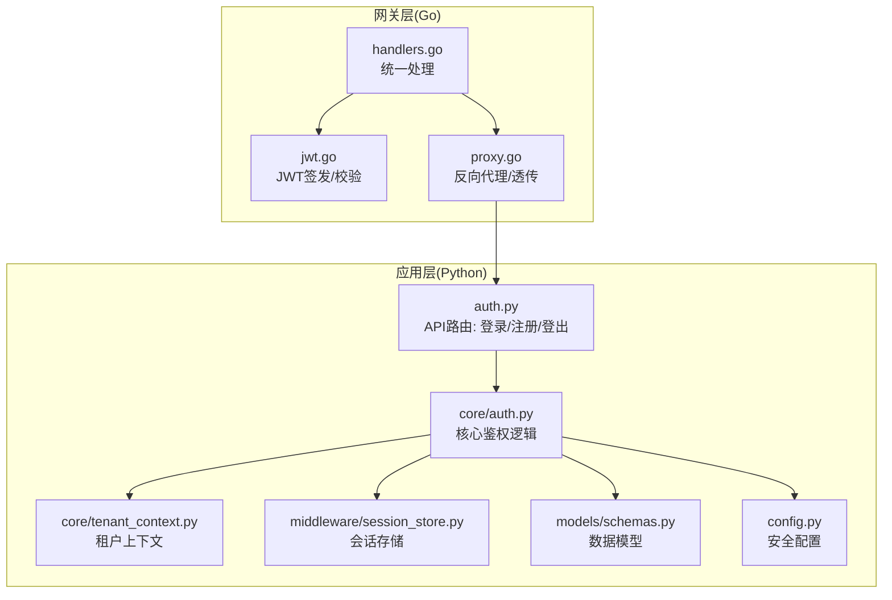
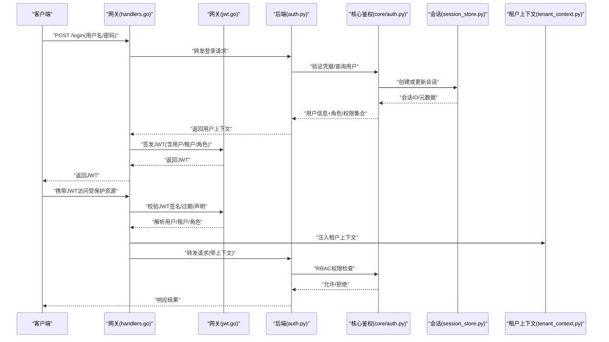
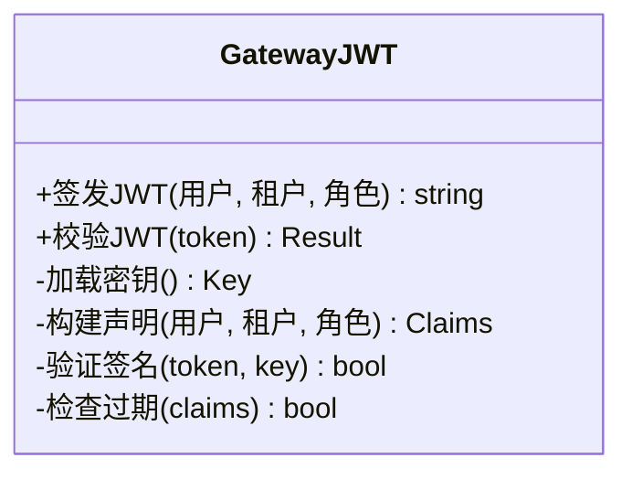
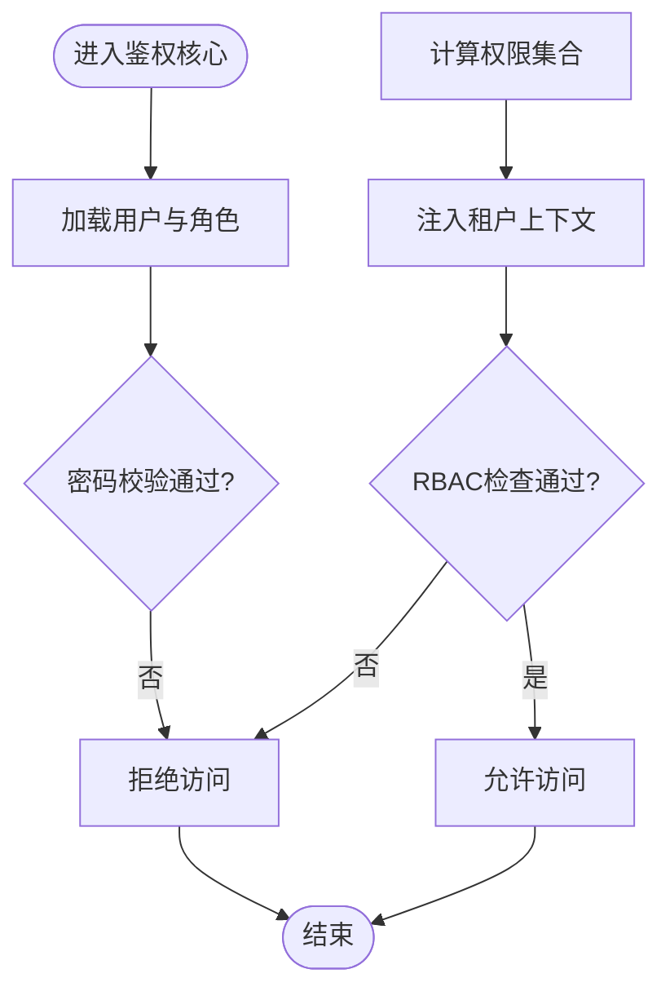
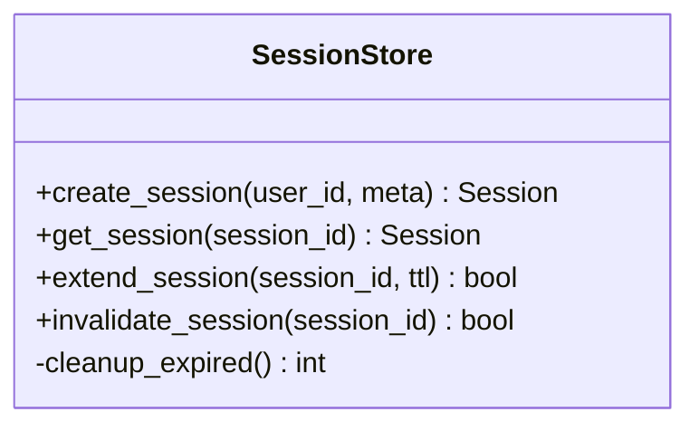
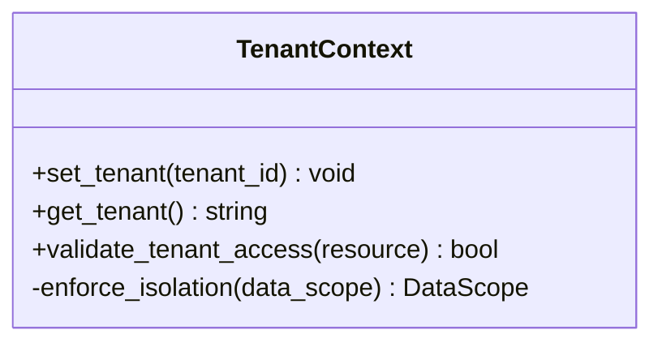
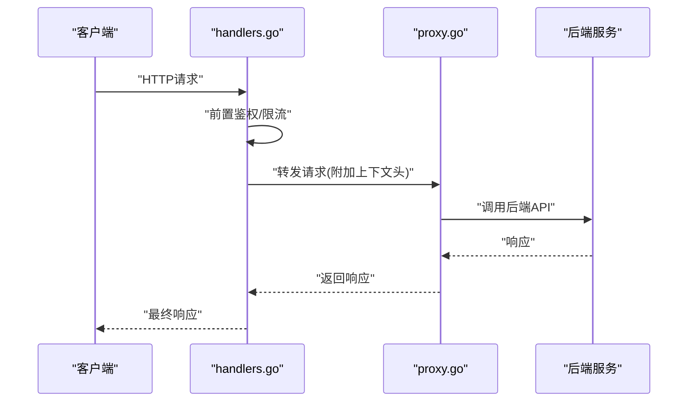
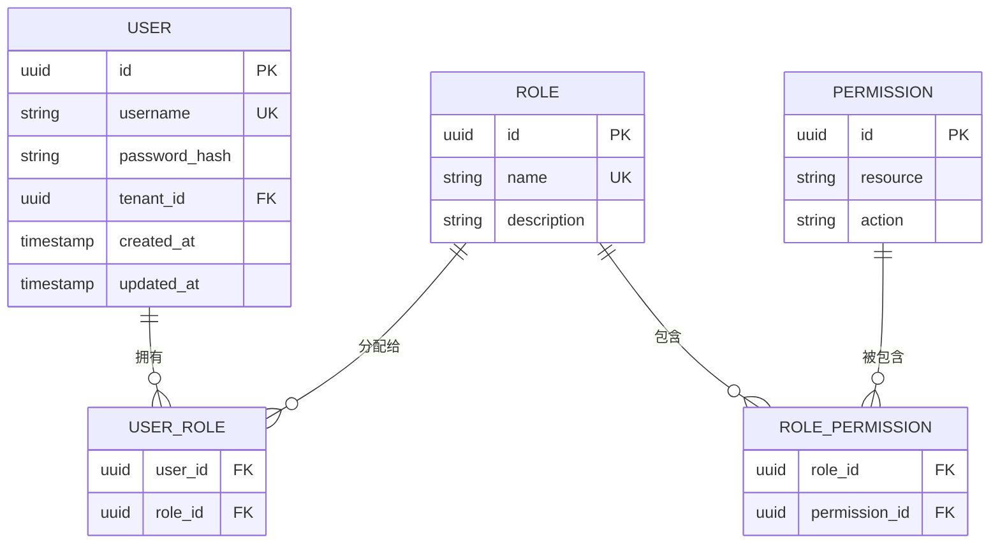
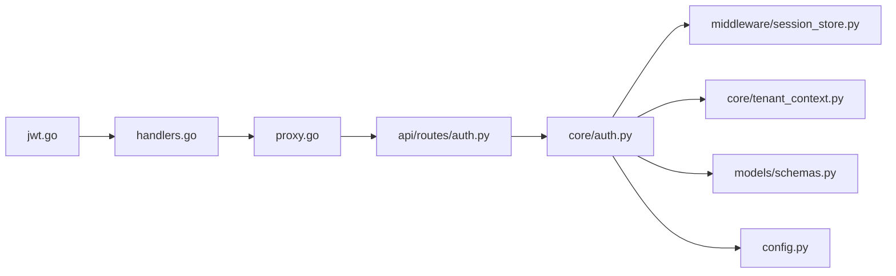

# 认证授权系统

<cite>
**本文引用的文件**   
- [backend_design/nexus/api/routes/auth.py](file://backend_design/nexus/api/routes/auth.py)
- [backend_design/nexus/core/auth.py](file://backend_design/nexus/core/auth.py)
- [backend_design/nexus/core/tenant_context.py](file://backend_design/nexus/core/tenant_context.py)
- [backend_design/nexus/middleware/session_store.py](file://backend_design/nexus/middleware/session_store.py)
- [backend_design/nexus_gate/internal/auth/jwt.go](file://backend_design/nexus_gate/internal/auth/jwt.go)
- [backend_design/nexus_gate/internal/handlers/handlers.go](file://backend_design/nexus_gate/internal/handlers/handlers.go)
- [backend_design/nexus_gate/internal/proxy/proxy.go](file://backend_design/nexus_gate/internal/proxy/proxy.go)
- [backend_design/nexus/models/schemas.py](file://backend_design/nexus/models/schemas.py)
- [backend_design/nexus/config.py](file://backend_design/nexus/config.py)
</cite>

## 目录
1. [简介](#简介)
2. [项目结构](#项目结构)
3. [核心组件](#核心组件)
4. [架构总览](#架构总览)
5. [详细组件分析](#详细组件分析)
6. [依赖关系分析](#依赖关系分析)
7. [性能考虑](#性能考虑)
8. [故障排查指南](#故障排查指南)
9. [结论](#结论)
10. [附录](#附录)

## 简介
本文件面向NexusCockpit的认证与授权子系统，系统性阐述多租户身份认证架构、JWT令牌生成与校验、用户会话管理、基于角色的访问控制（RBAC）、用户生命周期管理、跨服务认证机制与安全最佳实践，并给出扩展接口建议。文档同时提供架构图、时序图与流程图，帮助读者快速理解从网关到后端服务的完整鉴权链路。

## 项目结构
认证授权相关代码主要分布在以下位置：
- 网关层（Go）：负责入口鉴权、JWT签发/校验、请求转发与上下文透传
- 应用层（Python）：实现登录注册、会话存储、租户上下文注入、权限检查等
- 数据模型与配置：定义用户/角色/权限的数据结构与全局安全配置

图表来源
- [backend_design/nexus_gate/internal/handlers/handlers.go](file://backend_design/nexus_gate/internal/handlers/handlers.go)
- [backend_design/nexus_gate/internal/auth/jwt.go](file://backend_design/nexus_gate/internal/auth/jwt.go)
- [backend_design/nexus_gate/internal/proxy/proxy.go](file://backend_design/nexus_gate/internal/proxy/proxy.go)
- [backend_design/nexus/api/routes/auth.py](file://backend_design/nexus/api/routes/auth.py)
- [backend_design/nexus/core/auth.py](file://backend_design/nexus/core/auth.py)
- [backend_design/nexus/core/tenant_context.py](file://backend_design/nexus/core/tenant_context.py)
- [backend_design/nexus/middleware/session_store.py](file://backend_design/nexus/middleware/session_store.py)
- [backend_design/nexus/models/schemas.py](file://backend_design/nexus/models/schemas.py)
- [backend_design/nexus/config.py](file://backend_design/nexus/config.py)

章节来源
- [backend_design/nexus/api/routes/auth.py](file://backend_design/nexus/api/routes/auth.py)
- [backend_design/nexus/core/auth.py](file://backend_design/nexus/core/auth.py)
- [backend_design/nexus/core/tenant_context.py](file://backend_design/nexus/core/tenant_context.py)
- [backend_design/nexus/middleware/session_store.py](file://backend_design/nexus/middleware/session_store.py)
- [backend_design/nexus_gate/internal/auth/jwt.go](file://backend_design/nexus_gate/internal/auth/jwt.go)
- [backend_design/nexus_gate/internal/handlers/handlers.go](file://backend_design/nexus_gate/internal/handlers/handlers.go)
- [backend_design/nexus_gate/internal/proxy/proxy.go](file://backend_design/nexus_gate/internal/proxy/proxy.go)
- [backend_design/nexus/models/schemas.py](file://backend_design/nexus/models/schemas.py)
- [backend_design/nexus/config.py](file://backend_design/nexus/config.py)

## 核心组件
- 网关JWT模块：负责JWT令牌的签发、校验与必要声明注入，确保后续服务可信任地解析用户身份与租户信息
- 应用鉴权核心：封装登录、注册、登出、密码校验、权限判定、租户隔离等关键流程
- 会话存储中间件：提供无状态或有状态的会话管理能力，支持刷新、续期与失效
- 租户上下文：在请求处理链中注入当前租户标识，驱动数据与策略的多租户隔离
- 数据模型与配置：定义用户、角色、权限及令牌参数、加密算法、过期时间等安全基线

章节来源
- [backend_design/nexus_gate/internal/auth/jwt.go](file://backend_design/nexus_gate/internal/auth/jwt.go)
- [backend_design/nexus/core/auth.py](file://backend_design/nexus/core/auth.py)
- [backend_design/nexus/middleware/session_store.py](file://backend_design/nexus/middleware/session_store.py)
- [backend_design/nexus/core/tenant_context.py](file://backend_design/nexus/core/tenant_context.py)
- [backend_design/nexus/models/schemas.py](file://backend_design/nexus/models/schemas.py)
- [backend_design/nexus/config.py](file://backend_design/nexus/config.py)

## 架构总览
整体采用“网关集中鉴权 + 应用细粒度授权”的分层模式。客户端通过网关进行身份认证，获得JWT；网关将JWT与必要的上下文（如租户ID）透传到后端服务；后端服务在业务层执行RBAC权限校验与租户隔离。

图表来源
- [backend_design/nexus_gate/internal/handlers/handlers.go](file://backend_design/nexus_gate/internal/handlers/handlers.go)
- [backend_design/nexus_gate/internal/auth/jwt.go](file://backend_design/nexus_gate/internal/auth/jwt.go)
- [backend_design/nexus/api/routes/auth.py](file://backend_design/nexus/api/routes/auth.py)
- [backend_design/nexus/core/auth.py](file://backend_design/nexus/core/auth.py)
- [backend_design/nexus/middleware/session_store.py](file://backend_design/nexus/middleware/session_store.py)
- [backend_design/nexus/core/tenant_context.py](file://backend_design/nexus/core/tenant_context.py)

## 详细组件分析

### 组件A：网关JWT模块（Go）
职责
- 签发JWT：包含用户标识、租户标识、角色/权限摘要、签发时间、过期时间等
- 校验JWT：验证签名、有效期、必要声明完整性
- 错误处理：非法签名、过期、缺失声明等异常分支

图表来源
- [backend_design/nexus_gate/internal/auth/jwt.go](file://backend_design/nexus_gate/internal/auth/jwt.go)

章节来源
- [backend_design/nexus_gate/internal/auth/jwt.go](file://backend_design/nexus_gate/internal/auth/jwt.go)

### 组件B：应用鉴权核心（Python）
职责
- 登录/注册/登出：对接会话存储与用户数据模型
- 密码校验：使用安全的哈希算法比对
- RBAC权限检查：基于角色与资源/动作的匹配规则
- 租户隔离：结合租户上下文限制数据访问范围

图表来源
- [backend_design/nexus/core/auth.py](file://backend_design/nexus/core/auth.py)
- [backend_design/nexus/middleware/session_store.py](file://backend_design/nexus/middleware/session_store.py)
- [backend_design/nexus/core/tenant_context.py](file://backend_design/nexus/core/tenant_context.py)
- [backend_design/nexus/models/schemas.py](file://backend_design/nexus/models/schemas.py)

章节来源
- [backend_design/nexus/core/auth.py](file://backend_design/nexus/core/auth.py)
- [backend_design/nexus/middleware/session_store.py](file://backend_design/nexus/middleware/session_store.py)
- [backend_design/nexus/core/tenant_context.py](file://backend_design/nexus/core/tenant_context.py)
- [backend_design/nexus/models/schemas.py](file://backend_design/nexus/models/schemas.py)

### 组件C：会话存储中间件（Python）
职责
- 会话创建/续期/销毁：支持有状态会话的生命周期管理
- 并发安全：保证同一用户在多设备/多端的一致性
- 失效策略：超时清理、主动注销、批量失效

图表来源
- [backend_design/nexus/middleware/session_store.py](file://backend_design/nexus/middleware/session_store.py)

章节来源
- [backend_design/nexus/middleware/session_store.py](file://backend_design/nexus/middleware/session_store.py)

### 组件D：租户上下文（Python）
职责
- 在请求处理链中注入当前租户标识
- 为数据访问与策略引擎提供租户边界
- 与JWT声明联动，确保跨服务一致性

图表来源
- [backend_design/nexus/core/tenant_context.py](file://backend_design/nexus/core/tenant_context.py)

章节来源
- [backend_design/nexus/core/tenant_context.py](file://backend_design/nexus/core/tenant_context.py)

### 组件E：网关处理器与代理（Go）
职责
- 统一入口处理：路由分发、鉴权前置拦截
- 反向代理：将已认证的请求转发至后端服务，并透传上下文头
- 错误聚合：统一返回鉴权失败信息

图表来源
- [backend_design/nexus_gate/internal/handlers/handlers.go](file://backend_design/nexus_gate/internal/handlers/handlers.go)
- [backend_design/nexus_gate/internal/proxy/proxy.go](file://backend_design/nexus_gate/internal/proxy/proxy.go)

章节来源
- [backend_design/nexus_gate/internal/handlers/handlers.go](file://backend_design/nexus_gate/internal/handlers/handlers.go)
- [backend_design/nexus_gate/internal/proxy/proxy.go](file://backend_design/nexus_gate/internal/proxy/proxy.go)

### 组件F：数据模型与配置（Python）
职责
- 定义用户、角色、权限等实体结构
- 集中管理安全配置：令牌算法、过期时间、密码策略、会话TTL等

图表来源
- [backend_design/nexus/models/schemas.py](file://backend_design/nexus/models/schemas.py)
- [backend_design/nexus/config.py](file://backend_design/nexus/config.py)

章节来源
- [backend_design/nexus/models/schemas.py](file://backend_design/nexus/models/schemas.py)
- [backend_design/nexus/config.py](file://backend_design/nexus/config.py)

## 依赖关系分析
- 网关对JWT模块强依赖，用于统一签发与校验
- 应用层鉴权核心依赖会话存储与租户上下文，完成细粒度授权与隔离
- 数据模型与配置贯穿全链路，作为策略与结构的单一事实源

图表来源
- [backend_design/nexus_gate/internal/auth/jwt.go](file://backend_design/nexus_gate/internal/auth/jwt.go)
- [backend_design/nexus_gate/internal/handlers/handlers.go](file://backend_design/nexus_gate/internal/handlers/handlers.go)
- [backend_design/nexus_gate/internal/proxy/proxy.go](file://backend_design/nexus_gate/internal/proxy/proxy.go)
- [backend_design/nexus/api/routes/auth.py](file://backend_design/nexus/api/routes/auth.py)
- [backend_design/nexus/core/auth.py](file://backend_design/nexus/core/auth.py)
- [backend_design/nexus/middleware/session_store.py](file://backend_design/nexus/middleware/session_store.py)
- [backend_design/nexus/core/tenant_context.py](file://backend_design/nexus/core/tenant_context.py)
- [backend_design/nexus/models/schemas.py](file://backend_design/nexus/models/schemas.py)
- [backend_design/nexus/config.py](file://backend_design/nexus/config.py)

章节来源
- [backend_design/nexus_gate/internal/auth/jwt.go](file://backend_design/nexus_gate/internal/auth/jwt.go)
- [backend_design/nexus_gate/internal/handlers/handlers.go](file://backend_design/nexus_gate/internal/handlers/handlers.go)
- [backend_design/nexus_gate/internal/proxy/proxy.go](file://backend_design/nexus_gate/internal/proxy/proxy.go)
- [backend_design/nexus/api/routes/auth.py](file://backend_design/nexus/api/routes/auth.py)
- [backend_design/nexus/core/auth.py](file://backend_design/nexus/core/auth.py)
- [backend_design/nexus/middleware/session_store.py](file://backend_design/nexus/middleware/session_store.py)
- [backend_design/nexus/core/tenant_context.py](file://backend_design/nexus/core/tenant_context.py)
- [backend_design/nexus/models/schemas.py](file://backend_design/nexus/models/schemas.py)
- [backend_design/nexus/config.py](file://backend_design/nexus/config.py)

## 性能考虑
- 网关侧JWT校验应缓存公钥/密钥材料，避免频繁I/O
- 会话存储建议使用高性能键值存储，合理设置TTL与过期清理策略
- RBAC权限计算可引入本地缓存与预计算，减少重复判定开销
- 租户上下文注入应在网关层完成，降低后端负担
- 对高频鉴权路径启用连接池与异步化，提升吞吐

[本节为通用指导，不直接分析具体文件]

## 故障排查指南
- 登录失败
  - 检查凭据校验与密码哈希算法是否一致
  - 确认会话创建成功且未立即失效
- 令牌无效
  - 核对JWT签名算法与密钥配置
  - 检查令牌过期时间与时钟同步
- 权限不足
  - 验证用户-角色-权限映射是否正确
  - 确认RBAC规则与资源/动作命名约定一致
- 租户越界
  - 检查租户上下文注入是否生效
  - 确认数据访问层按租户过滤

章节来源
- [backend_design/nexus_gate/internal/auth/jwt.go](file://backend_design/nexus_gate/internal/auth/jwt.go)
- [backend_design/nexus/core/auth.py](file://backend_design/nexus/core/auth.py)
- [backend_design/nexus/middleware/session_store.py](file://backend_design/nexus/middleware/session_store.py)
- [backend_design/nexus/core/tenant_context.py](file://backend_design/nexus/core/tenant_context.py)

## 结论
本认证授权体系以网关集中鉴权与应用细粒度授权相结合，实现了多租户隔离、RBAC权限控制与跨服务可信传递。通过合理的会话管理与安全配置，系统在安全性与性能之间取得平衡。未来可在多因素认证、审计日志与动态策略方面进一步增强。

[本节为总结性内容，不直接分析具体文件]

## 附录

### 安全最佳实践清单
- 密码策略
  - 强制复杂度与长度要求
  - 使用抗暴力破解的哈希算法与盐值
- 会话安全
  - 设置合理的TTL与滑动续期
  - 支持主动注销与批量失效
- 防重放攻击
  - 在关键操作引入一次性令牌或时间戳+签名
- 审计日志
  - 记录登录、登出、权限变更与敏感操作
  - 关联租户与用户标识，便于追踪

[本节为通用指导，不直接分析具体文件]

### 扩展接口建议
- 自定义认证提供者
  - 在应用鉴权核心中抽象认证适配器，支持LDAP、OAuth2、企业SSO等
- 多因素认证（MFA）
  - 在登录流程中插入二次验证步骤，支持TOTP、短信/邮件验证码
- 动态权限策略
  - 引入外部策略引擎，支持运行时更新权限规则

[本节为概念性建议，不直接分析具体文件]