# 服务间通信

<cite>
**本文引用的文件**   
- [backend_design/nexus/main.py](file://backend_design/nexus/main.py)
- [backend_design/nexus/api/websocket.py](file://backend_design/nexus/api/websocket.py)
- [backend_design/nexus/middleware/session_store.py](file://backend_design/nexus/middleware/session_store.py)
- [backend_design/nexus/middleware/redis_cache.py](file://backend_design/nexus/middleware/redis_cache.py)
- [backend_design/nexus/core/auth.py](file://backend_design/nexus/core/auth.py)
- [backend_design/nexus/core/circuit_breaker.py](file://backend_design/nexus/core/circuit_breaker.py)
- [backend_design/nexus/config.py](file://backend_design/nexus/config.py)
- [backend_design/nexus_gate/cmd/main.go](file://backend_design/nexus_gate/cmd/main.go)
- [backend_design/nexus_gate/internal/proxy/proxy.go](file://backend_design/nexus_gate/internal/proxy/proxy.go)
- [backend_design/nexus_gate/internal/handlers/handlers.go](file://backend_design/nexus_gate/internal/handlers/handlers.go)
- [backend_design/nexus_gate/internal/ws/hub.go](file://backend_design/nexus_gate/internal/ws/hub.go)
- [backend_design/nexus_gate/proto/nexus.proto](file://backend_design/nexus_gate/proto/nexus.proto)
- [backend_design/nexus_gate/internal/ratelimit/ratelimit.go](file://backend_design/nexus_gate/internal/ratelimit/ratelimit.go)
</cite>

## 目录
1. [简介](#简介)
2. [项目结构](#项目结构)
3. [核心组件](#核心组件)
4. [架构总览](#架构总览)
5. [详细组件分析](#详细组件分析)
6. [依赖分析](#依赖分析)
7. [性能考虑](#性能考虑)
8. [故障排查指南](#故障排查指南)
9. [结论](#结论)
10. [附录](#附录)

## 简介
本文件面向NexusCockpit系统的“服务间通信”主题，系统性梳理并说明以下能力：
- 同步HTTP RESTful API调用（网关到后端、外部系统到网关）
- 异步消息队列通信（任务与事件驱动）
- 实时WebSocket双向通信（前端与网关/后端）
- gRPC协议在内部服务间的应用（protobuf定义、接口设计、序列化机制）
- 事件驱动架构（发布订阅、路由、可靠性保证）
- 分布式会话管理（Redis存储、跨实例同步、失效处理）
- 安全策略（身份认证、数据加密、访问控制）
- 性能优化（连接复用、批量处理、超时与熔断）

## 项目结构
NexusCockpit采用前后端分离与多语言微服务组合：
- Go实现的网关nexus-gate负责鉴权、限流、反向代理、WebSocket转发以及gRPC客户端。
- Python实现的后端nexus提供REST API、WebSocket服务端、中间件（会话、缓存、任务队列）、核心逻辑（认证、熔断等）。
- 配置与可观测性通过独立配置文件与脚本管理。

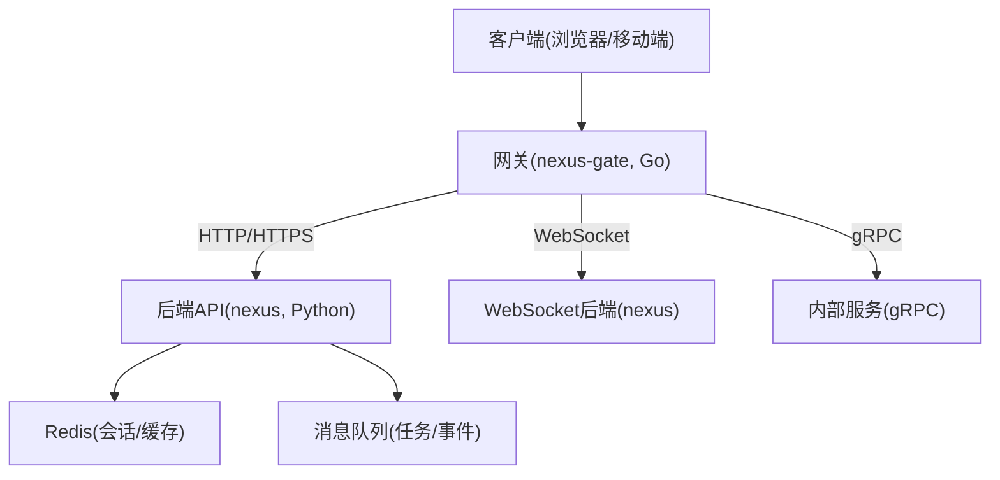

图表来源
- [backend_design/nexus_gate/cmd/main.go:1-200](file://backend_design/nexus_gate/cmd/main.go#L1-200)
- [backend_design/nexus/main.py:1-200](file://backend_design/nexus/main.py#L1-200)

章节来源
- [backend_design/nexus/main.py:1-200](file://backend_design/nexus/main.py#L1-200)
- [backend_design/nexus_gate/cmd/main.go:1-200](file://backend_design/nexus_gate/cmd/main.go#L1-200)

## 核心组件
- 网关层（Go）
  - HTTP反向代理与路由分发
  - WebSocket代理与会话保持
  - 鉴权与限流
  - gRPC客户端封装
- 后端服务（Python）
  - REST API路由与业务编排
  - WebSocket服务端与房间/频道管理
  - 中间件：分布式会话、Redis缓存、任务队列
  - 核心：认证、熔断器、日志、上下文
- 基础设施
  - Redis：会话与缓存
  - 消息队列：异步任务与事件总线
  - 配置中心与环境变量

章节来源
- [backend_design/nexus_gate/internal/proxy/proxy.go:1-200](file://backend_design/nexus_gate/internal/proxy/proxy.go#L1-200)
- [backend_design/nexus_gate/internal/ws/hub.go:1-200](file://backend_design/nexus_gate/internal/ws/hub.go#L1-200)
- [backend_design/nexus/api/websocket.py:1-200](file://backend_design/nexus/api/websocket.py#L1-200)
- [backend_design/nexus/middleware/session_store.py:1-200](file://backend_design/nexus/middleware/session_store.py#L1-200)
- [backend_design/nexus/middleware/redis_cache.py:1-200](file://backend_design/nexus/middleware/redis_cache.py#L1-200)
- [backend_design/nexus/core/circuit_breaker.py:1-200](file://backend_design/nexus/core/circuit_breaker.py#L1-200)

## 架构总览
下图展示请求从客户端进入网关，经鉴权与限流后，按协议类型分发至后端或内部gRPC服务；同时支持WebSocket长连接与异步任务处理。

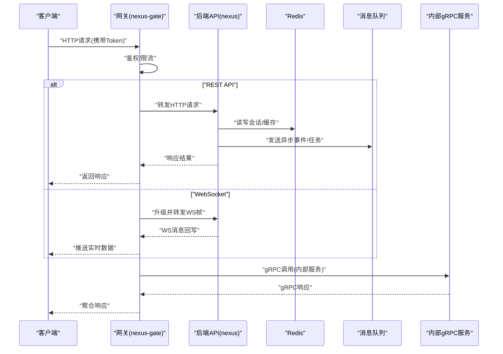

图表来源
- [backend_design/nexus_gate/internal/handlers/handlers.go:1-200](file://backend_design/nexus_gate/internal/handlers/handlers.go#L1-200)
- [backend_design/nexus/api/websocket.py:1-200](file://backend_design/nexus/api/websocket.py#L1-200)
- [backend_design/nexus/middleware/session_store.py:1-200](file://backend_design/nexus/middleware/session_store.py#L1-200)
- [backend_design/nexus/middleware/redis_cache.py:1-200](file://backend_design/nexus/middleware/redis_cache.py#L1-200)
- [backend_design/nexus_gate/proto/nexus.proto:1-200](file://backend_design/nexus_gate/proto/nexus.proto#L1-200)

## 详细组件分析

### 同步HTTP RESTful API
- 入口与路由
  - 网关接收HTTP请求，进行鉴权与限流，随后根据路径将请求转发至后端对应路由。
  - 后端使用FastAPI路由组织REST接口，统一错误码与响应体结构。
- 鉴权与上下文
  - 网关校验JWT令牌，注入用户上下文；后端二次校验并解析租户/权限信息。
- 错误与重试
  - 网关对下游异常进行统一包装；后端结合熔断器避免雪崩。
- 典型流程

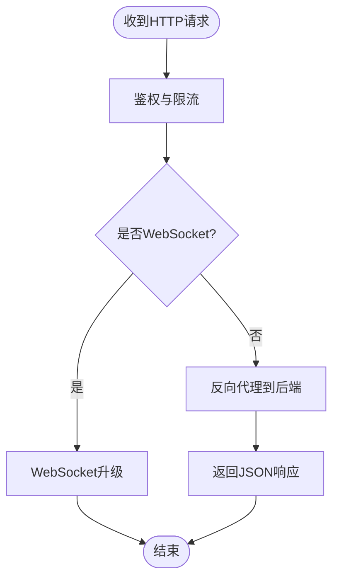

图表来源
- [backend_design/nexus_gate/internal/handlers/handlers.go:1-200](file://backend_design/nexus_gate/internal/handlers/handlers.go#L1-200)
- [backend_design/nexus/main.py:1-200](file://backend_design/nexus/main.py#L1-200)

章节来源
- [backend_design/nexus_gate/internal/handlers/handlers.go:1-200](file://backend_design/nexus_gate/internal/handlers/handlers.go#L1-200)
- [backend_design/nexus/main.py:1-200](file://backend_design/nexus/main.py#L1-200)

### 异步消息队列通信
- 用途
  - 将耗时操作（如语音转写、TTS合成、数据分析）放入队列，由消费者异步处理。
- 模式
  - 生产者-消费者模型，支持持久化与重试；关键事件采用幂等键避免重复处理。
- 可靠性
  - 至少一次投递+消费端去重；失败入死信队列以便人工干预。
- 典型流程

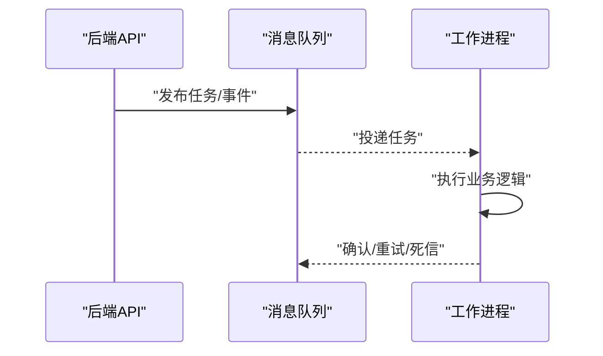

[本节为概念性流程，不直接映射具体源码文件]

### 实时WebSocket双向通信
- 网关侧
  - 维护Hub，负责连接注册、广播与路由到指定房间/频道。
- 后端侧
  - 提供WebSocket端点，处理鉴权、频道订阅、消息编解码与状态同步。
- 典型流程

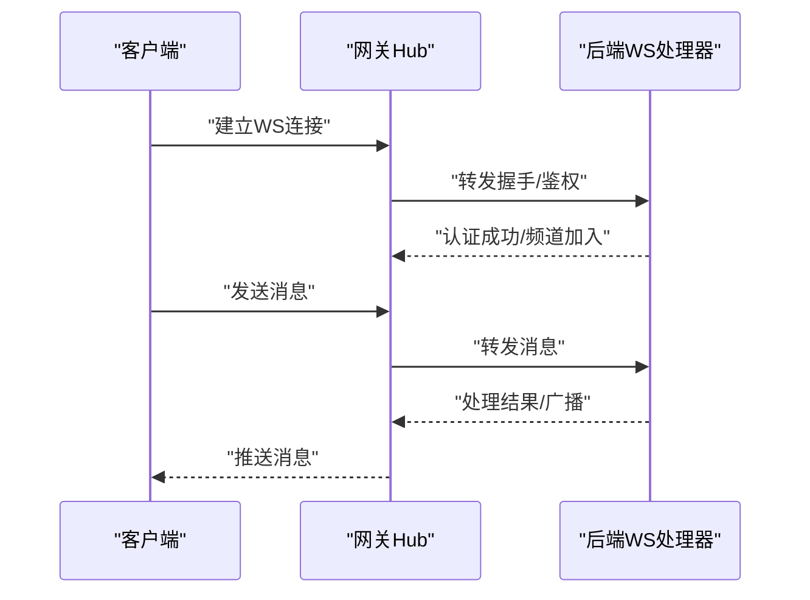

图表来源
- [backend_design/nexus_gate/internal/ws/hub.go:1-200](file://backend_design/nexus_gate/internal/ws/hub.go#L1-200)
- [backend_design/nexus/api/websocket.py:1-200](file://backend_design/nexus/api/websocket.py#L1-200)

章节来源
- [backend_design/nexus_gate/internal/ws/hub.go:1-200](file://backend_design/nexus_gate/internal/ws/hub.go#L1-200)
- [backend_design/nexus/api/websocket.py:1-200](file://backend_design/nexus/api/websocket.py#L1-200)

### gRPC协议在内部服务间的应用
- 协议定义
  - 使用protobuf定义服务接口与消息结构，确保强类型与向后兼容。
- 服务接口设计
  - 网关作为gRPC客户端，调用内部服务（如设备控制、遥测、知识库检索）。
- 序列化机制
  - 二进制编码，高效传输；配合压缩减少带宽占用。
- 典型交互

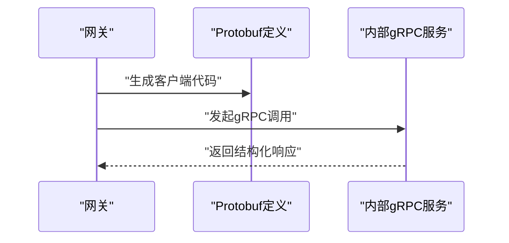

图表来源
- [backend_design/nexus_gate/proto/nexus.proto:1-200](file://backend_design/nexus_gate/proto/nexus.proto#L1-200)
- [backend_design/nexus_gate/cmd/main.go:1-200](file://backend_design/nexus_gate/cmd/main.go#L1-200)

章节来源
- [backend_design/nexus_gate/proto/nexus.proto:1-200](file://backend_design/nexus_gate/proto/nexus.proto#L1-200)
- [backend_design/nexus_gate/cmd/main.go:1-200](file://backend_design/nexus_gate/cmd/main.go#L1-200)

### 事件驱动架构（发布订阅、路由与可靠性）
- 发布订阅
  - 后端将领域事件写入消息队列，多个订阅者按需消费。
- 消息路由
  - 基于事件类型/租户ID/优先级进行路由，支持分片与分区。
- 可靠性保证
  - 持久化、重试、幂等键、补偿事务与死信队列。
- 流程图

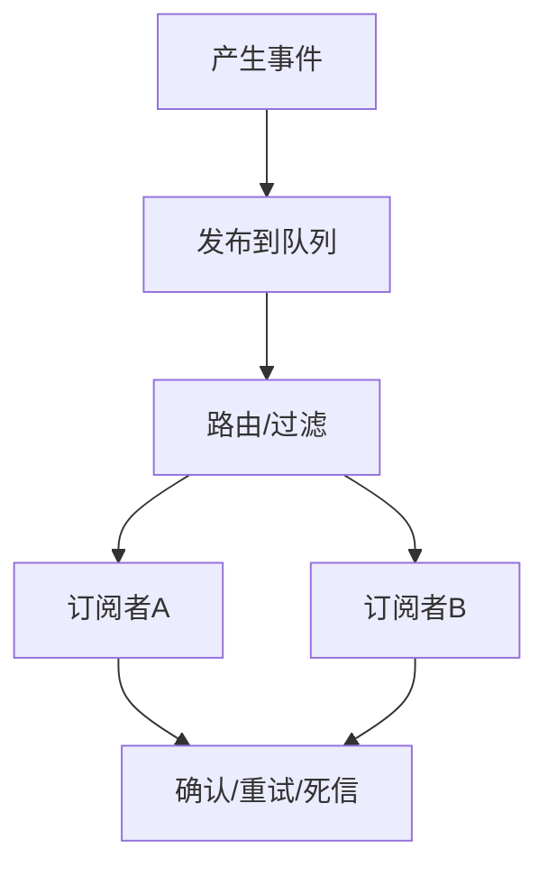

[本节为概念性流程，不直接映射具体源码文件]

### 分布式会话管理（Redis存储、同步与失效）
- 存储与共享
  - 会话数据集中存储于Redis，多实例共享同一会话源。
- 同步与一致性
  - 写扩散更新，读就近读取；热点会话加本地缓存与过期时间。
- 失效与清理
  - TTL自动过期；后台定时任务清理脏数据；登出主动删除。
- 流程图

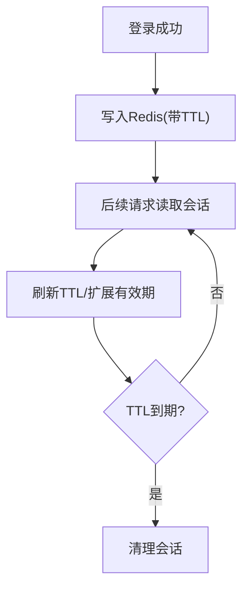

图表来源
- [backend_design/nexus/middleware/session_store.py:1-200](file://backend_design/nexus/middleware/session_store.py#L1-200)
- [backend_design/nexus/middleware/redis_cache.py:1-200](file://backend_design/nexus/middleware/redis_cache.py#L1-200)

章节来源
- [backend_design/nexus/middleware/session_store.py:1-200](file://backend_design/nexus/middleware/session_store.py#L1-200)
- [backend_design/nexus/middleware/redis_cache.py:1-200](file://backend_design/nexus/middleware/redis_cache.py#L1-200)

### 通信安全保障（认证、加密与访问控制）
- 身份认证
  - JWT令牌在网关校验，后端二次验证；支持短期令牌与刷新机制。
- 数据加密
  - 全链路TLS；敏感字段应用层加密；密钥轮换策略。
- 访问控制
  - 基于角色的访问控制（RBAC）与租户隔离；细粒度资源授权。
- 流程图

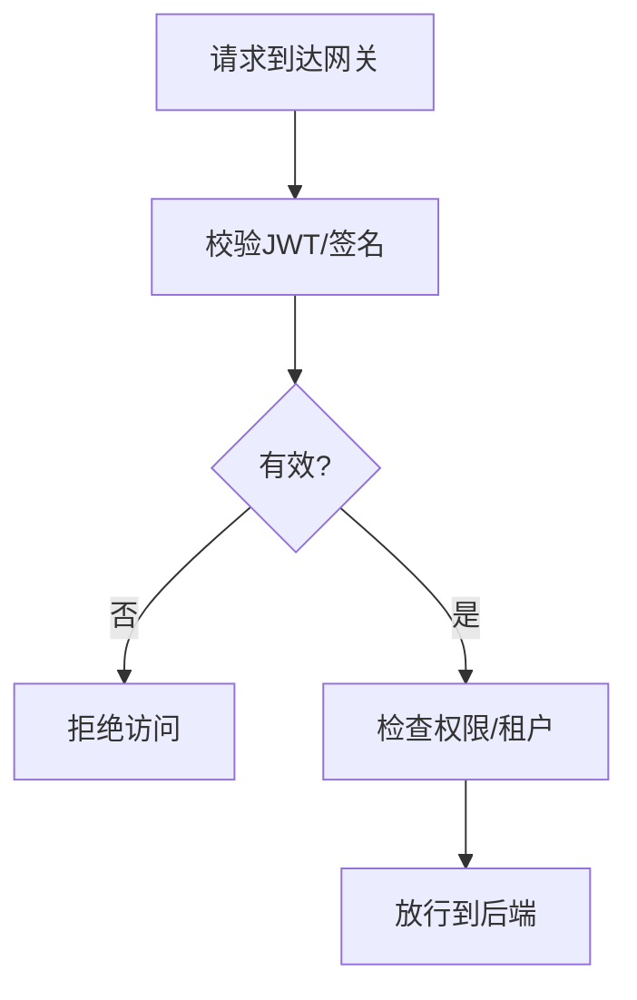

图表来源
- [backend_design/nexus_gate/internal/handlers/handlers.go:1-200](file://backend_design/nexus_gate/internal/handlers/handlers.go#L1-200)
- [backend_design/nexus/core/auth.py:1-200](file://backend_design/nexus/core/auth.py#L1-200)

章节来源
- [backend_design/nexus_gate/internal/handlers/handlers.go:1-200](file://backend_design/nexus_gate/internal/handlers/handlers.go#L1-200)
- [backend_design/nexus/core/auth.py:1-200](file://backend_design/nexus/core/auth.py#L1-200)

### 性能优化策略（连接复用、批量处理与超时控制）
- 连接复用
  - HTTP/2与gRPC连接池复用，减少握手开销。
- 批量处理
  - 批量写入Redis/队列，合并小请求降低放大效应。
- 超时与熔断
  - 多层超时（网关/后端/下游）；熔断器快速失败与降级。
- 流程图

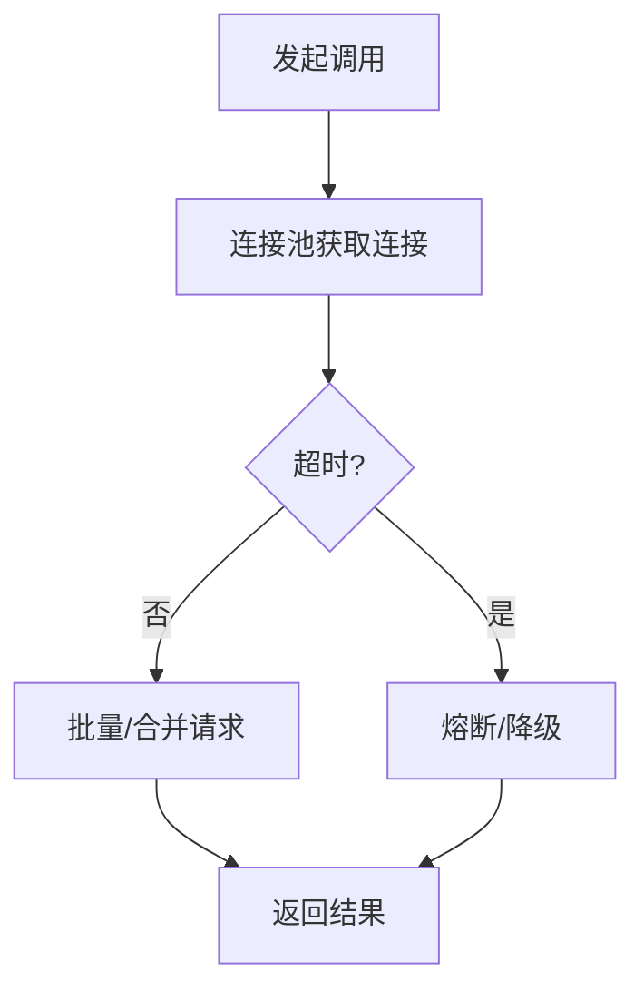

图表来源
- [backend_design/nexus/core/circuit_breaker.py:1-200](file://backend_design/nexus/core/circuit_breaker.py#L1-200)
- [backend_design/nexus_gate/internal/ratelimit/ratelimit.go:1-200](file://backend_design/nexus_gate/internal/ratelimit/ratelimit.go#L1-200)

章节来源
- [backend_design/nexus/core/circuit_breaker.py:1-200](file://backend_design/nexus/core/circuit_breaker.py#L1-200)
- [backend_design/nexus_gate/internal/ratelimit/ratelimit.go:1-200](file://backend_design/nexus_gate/internal/ratelimit/ratelimit.go#L1-200)

## 依赖分析
- 组件耦合
  - 网关依赖鉴权、限流、代理与WebSocket Hub；后端依赖会话、缓存、任务队列与核心逻辑。
- 外部依赖
  - Redis用于会话与缓存；消息队列用于异步；gRPC用于内部服务通信。
- 潜在循环依赖
  - 网关与后端单向依赖；后端内部模块通过接口解耦，避免循环。

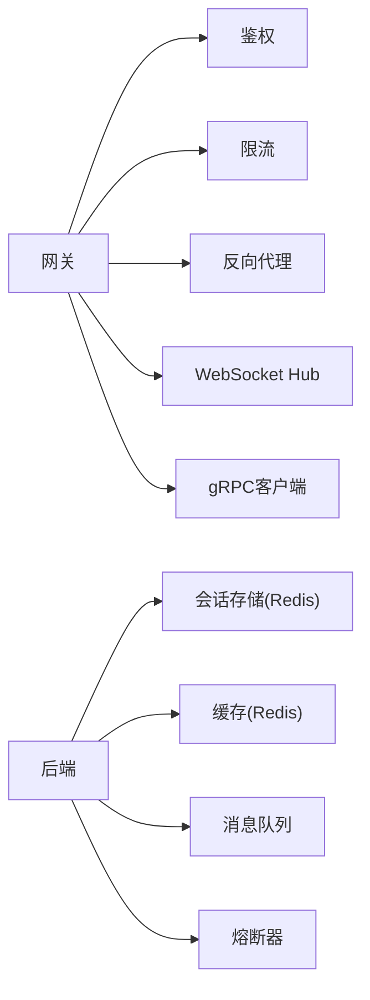

图表来源
- [backend_design/nexus_gate/cmd/main.go:1-200](file://backend_design/nexus_gate/cmd/main.go#L1-200)
- [backend_design/nexus/main.py:1-200](file://backend_design/nexus/main.py#L1-200)

章节来源
- [backend_design/nexus_gate/cmd/main.go:1-200](file://backend_design/nexus_gate/cmd/main.go#L1-200)
- [backend_design/nexus/main.py:1-200](file://backend_design/nexus/main.py#L1-200)

## 性能考虑
- 连接复用与长连接
  - 使用HTTP/2与gRPC连接池；WebSocket保持长连接，减少频繁握手。
- 批量与批处理
  - 对Redis与队列的写入进行批量合并；对上游聚合请求进行批处理。
- 超时与重试
  - 合理设置网关/后端/下游超时；指数退避重试，避免风暴。
- 熔断与降级
  - 熔断器保护下游；降级返回缓存或默认值，保障可用性。
- 容量规划
  - 基于峰值QPS评估连接数与内存占用；水平扩展无状态节点。

[本节为通用指导，不直接分析具体文件]

## 故障排查指南
- 常见问题定位
  - 鉴权失败：检查JWT签发/校验参数、时钟同步、密钥版本。
  - 会话丢失：核对Redis连通性与TTL策略，确认多实例共享配置。
  - WebSocket断连：检查网关Hub心跳、后端WS处理器存活与健康检查。
  - gRPC调用失败：查看证书、端口、服务发现与超时配置。
- 诊断手段
  - 启用详细日志与指标上报；追踪请求ID贯穿网关与后端。
  - 使用健康检查与就绪探针，观察熔断器状态与队列积压。
- 恢复策略
  - 快速回滚配置；隔离故障节点；对死信队列进行人工复核与重放。

章节来源
- [backend_design/nexus/core/auth.py:1-200](file://backend_design/nexus/core/auth.py#L1-200)
- [backend_design/nexus/middleware/session_store.py:1-200](file://backend_design/nexus/middleware/session_store.py#L1-200)
- [backend_design/nexus/api/websocket.py:1-200](file://backend_design/nexus/api/websocket.py#L1-200)
- [backend_design/nexus/core/circuit_breaker.py:1-200](file://backend_design/nexus/core/circuit_breaker.py#L1-200)

## 结论
NexusCockpit在服务间通信方面采用“网关统一入口 + 多协议适配 + 异步与实时并行”的架构：
- 同步HTTP与gRPC满足高吞吐与低延迟的内部调用需求；
- 异步消息队列提升系统弹性与可扩展性；
- WebSocket提供实时双向通道；
- 以Redis为中心的分布式会话与缓存保障一致性与高性能；
- 通过鉴权、TLS与RBAC构建安全基线；
- 借助连接复用、批量处理、超时与熔断实现稳定与高效。

[本节为总结性内容，不直接分析具体文件]

## 附录
- 配置要点
  - 环境变量与配置文件集中管理，区分开发/测试/生产环境。
- 参考实现位置
  - 网关主入口、代理与限流、WebSocket Hub、gRPC定义与客户端初始化。
  - 后端主入口、WebSocket端点、会话与缓存中间件、熔断器与认证模块。

章节来源
- [backend_design/nexus/config.py:1-200](file://backend_design/nexus/config.py#L1-200)
- [backend_design/nexus_gate/cmd/main.go:1-200](file://backend_design/nexus_gate/cmd/main.go#L1-200)
- [backend_design/nexus_gate/internal/proxy/proxy.go:1-200](file://backend_design/nexus_gate/internal/proxy/proxy.go#L1-200)
- [backend_design/nexus_gate/internal/ratelimit/ratelimit.go:1-200](file://backend_design/nexus_gate/internal/ratelimit/ratelimit.go#L1-200)
- [backend_design/nexus/main.py:1-200](file://backend_design/nexus/main.py#L1-200)