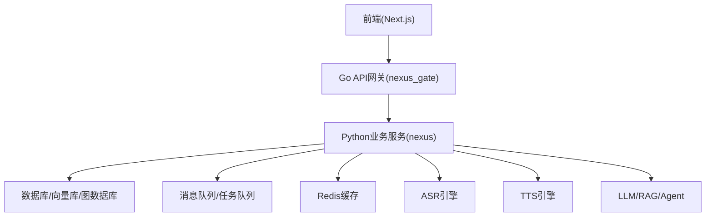
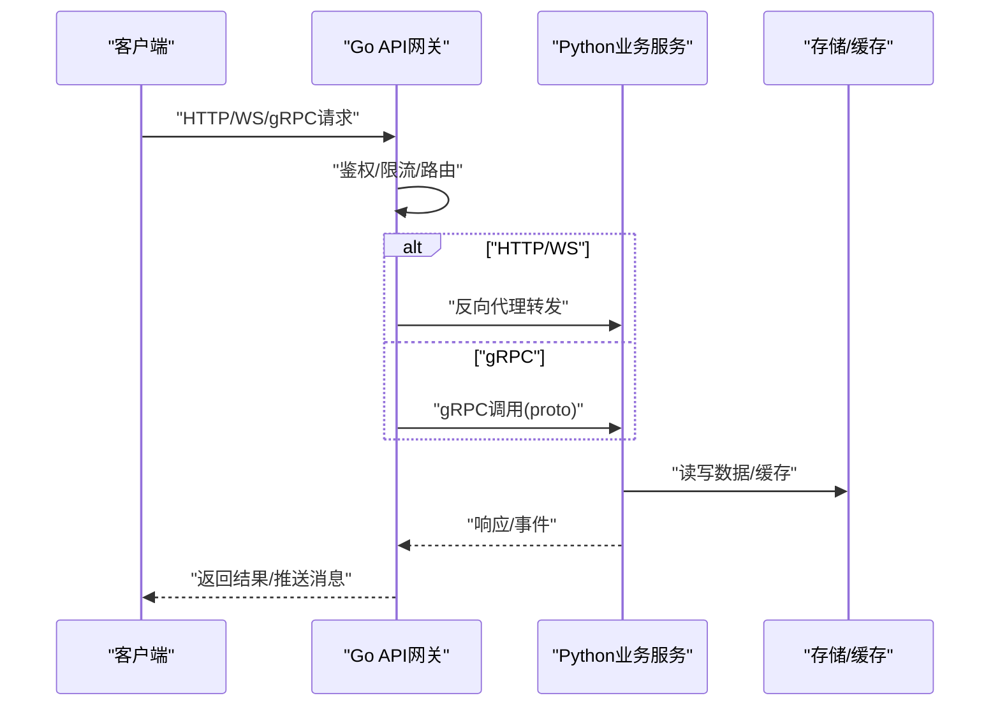
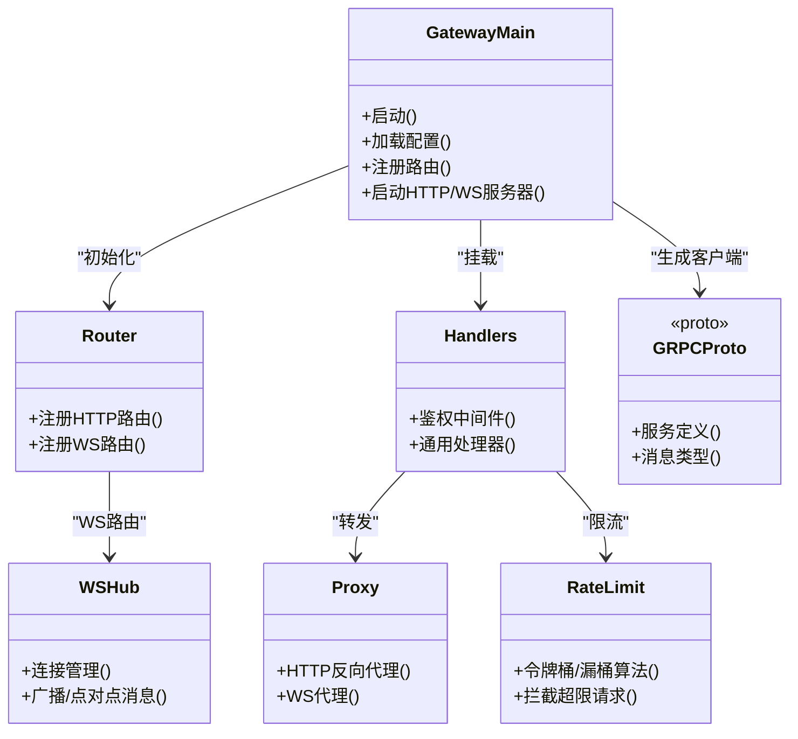
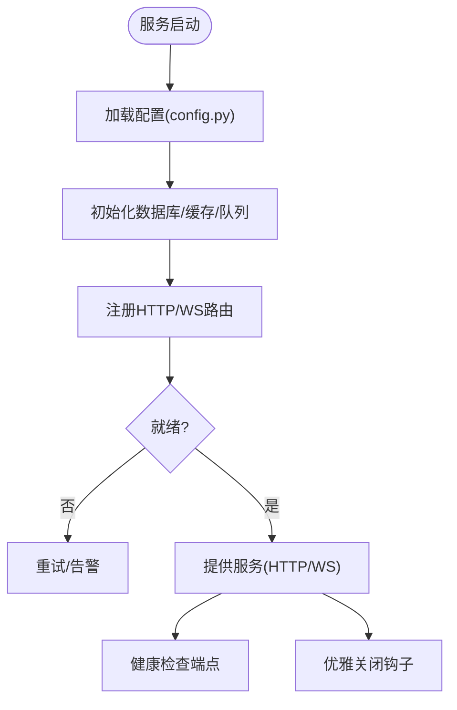
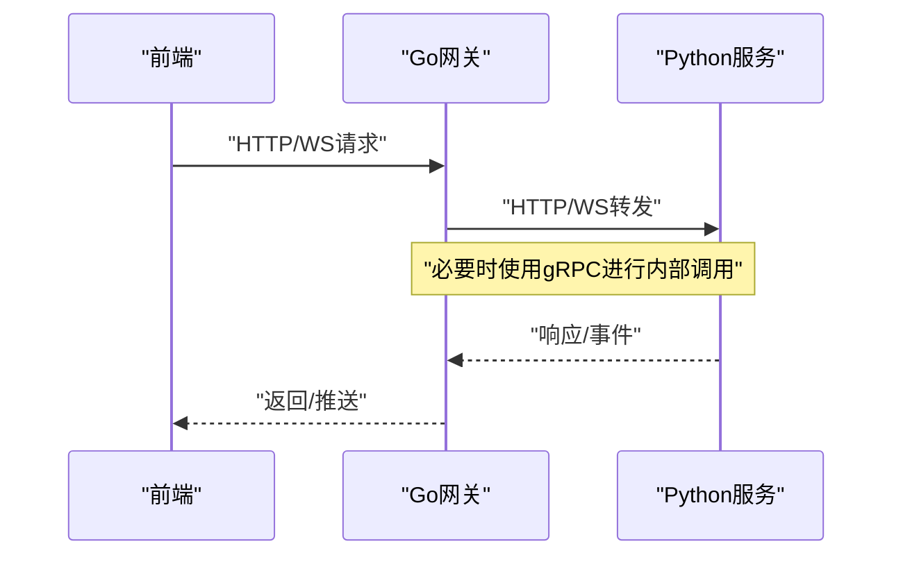
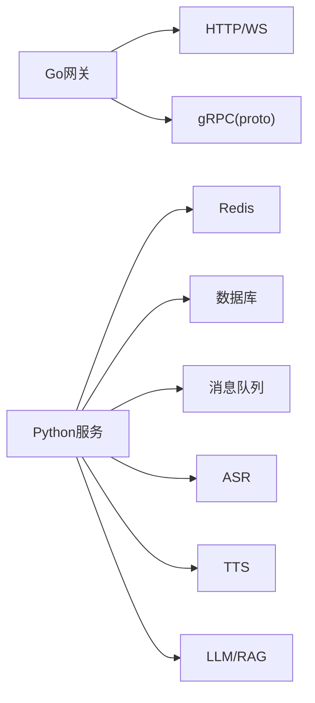

# 核心服务架构

<cite>
**本文引用的文件**   
- [backend_design/nexus_gate/cmd/main.go](file://backend_design/nexus_gate/cmd/main.go)
- [backend_design/nexus_gate/internal/config/config.go](file://backend_design/nexus_gate/internal/config/config.go)
- [backend_design/nexus_gate/internal/handlers/handlers.go](file://backend_design/nexus_gate/internal/handlers/handlers.go)
- [backend_design/nexus_gate/internal/proxy/proxy.go](file://backend_design/nexus_gate/internal/proxy/proxy.go)
- [backend_design/nexus_gate/internal/ratelimit/ratelimit.go](file://backend_design/nexus_gate/internal/ratelimit/ratelimit.go)
- [backend_design/nexus_gate/internal/router/router.go](file://backend_design/nexus_gate/internal/router/router.go)
- [backend_design/nexus_gate/internal/ws/hub.go](file://backend_design/nexus_gate/internal/ws/hub.go)
- [backend_design/nexus_gate/proto/nexus.proto](file://backend_design/nexus_gate/proto/nexus.proto)
- [backend_design/nexus/main.py](file://backend_design/nexus/main.py)
- [backend_design/nexus/config.py](file://backend_design/nexus/config.py)
- [backend_design/nexus/api/websocket.py](file://backend_design/nexus/api/websocket.py)
- [backend_design/nexus/core/cockpit_manager.py](file://backend_design/nexus/core/cockpit_manager.py)
- [backend_design/nexus/core/circuit_breaker.py](file://backend_design/nexus/core/circuit_breaker.py)
- [backend_design/nexus/middleware/session_store.py](file://backend_design/nexus/middleware/session_store.py)
- [backend_design/nexus/middleware/redis_cache.py](file://backend_design/nexus/middleware/redis_cache.py)
- [docker-compose.yml](file://docker-compose.yml)
</cite>

## 目录
1. [简介](#简介)
2. [项目结构](#项目结构)
3. [核心组件](#核心组件)
4. [架构总览](#架构总览)
5. [详细组件分析](#详细组件分析)
6. [依赖关系分析](#依赖关系分析)
7. [性能与扩展性](#性能与扩展性)
8. [故障排查指南](#故障排查指南)
9. [结论](#结论)
10. [附录](#附录)

## 简介
本文件面向NexusCockpit系统的核心服务架构，聚焦微服务划分、Go API网关与Python业务服务的职责边界、服务间通信模式（HTTP RESTful、WebSocket实时通信、gRPC内部调用）、服务注册与发现、负载均衡与故障转移、配置管理（集中式、动态更新、环境变量）、服务生命周期（启动顺序、健康检查、优雅关闭、版本兼容）以及水平/垂直扩展策略。文档以仓库现有实现为依据，辅以可视化图示帮助理解。

## 项目结构
系统采用“前端 + Go API网关 + Python业务服务”的三层形态：
- 前端：Next.js应用，通过API网关访问后端能力。
- Go API网关：统一入口，负责鉴权、限流、路由转发、WebSocket代理、gRPC客户端等。
- Python业务服务：提供REST API、WebSocket、RAG/Agent/车辆控制等业务逻辑，并集成中间件（会话、缓存、队列）。

[本节为概念性概述，不直接分析具体文件]

## 核心组件
- Go API网关（nexus_gate）
  - 入口与路由：cmd/main.go、internal/router/router.go
  - 配置加载：internal/config/config.go
  - 请求处理与反向代理：internal/handlers/handlers.go、internal/proxy/proxy.go
  - 限流：internal/ratelimit/ratelimit.go
  - WebSocket Hub：internal/ws/hub.go
  - gRPC协议定义：proto/nexus.proto
- Python业务服务（nexus）
  - 主进程与生命周期：main.py
  - 配置管理：config.py
  - WebSocket端点：api/websocket.py
  - 核心编排：core/cockpit_manager.py
  - 熔断器：core/circuit_breaker.py
  - 中间件：session_store.py、redis_cache.py

**章节来源**
- [backend_design/nexus_gate/cmd/main.go](file://backend_design/nexus_gate/cmd/main.go)
- [backend_design/nexus_gate/internal/router/router.go](file://backend_design/nexus_gate/internal/router/router.go)
- [backend_design/nexus_gate/internal/config/config.go](file://backend_design/nexus_gate/internal/config/config.go)
- [backend_design/nexus_gate/internal/handlers/handlers.go](file://backend_design/nexus_gate/internal/handlers/handlers.go)
- [backend_design/nexus_gate/internal/proxy/proxy.go](file://backend_design/nexus_gate/internal/proxy/proxy.go)
- [backend_design/nexus_gate/internal/ratelimit/ratelimit.go](file://backend_design/nexus_gate/internal/ratelimit/ratelimit.go)
- [backend_design/nexus_gate/internal/ws/hub.go](file://backend_design/nexus_gate/internal/ws/hub.go)
- [backend_design/nexus_gate/proto/nexus.proto](file://backend_design/nexus_gate/proto/nexus.proto)
- [backend_design/nexus/main.py](file://backend_design/nexus/main.py)
- [backend_design/nexus/config.py](file://backend_design/nexus/config.py)
- [backend_design/nexus/api/websocket.py](file://backend_design/nexus/api/websocket.py)
- [backend_design/nexus/core/cockpit_manager.py](file://backend_design/nexus/core/cockpit_manager.py)
- [backend_design/nexus/core/circuit_breaker.py](file://backend_design/nexus/core/circuit_breaker.py)
- [backend_design/nexus/middleware/session_store.py](file://backend_design/nexus/middleware/session_store.py)
- [backend_design/nexus/middleware/redis_cache.py](file://backend_design/nexus/middleware/redis_cache.py)

## 架构总览
整体采用“网关+业务服务”的微服务形态。Go网关承担流量治理与协议转换，Python服务承载复杂AI与业务编排。服务间通信包括：
- HTTP RESTful：前端到网关、网关到Python服务
- WebSocket：前端到网关、网关到Python服务（或直连）
- gRPC：网关作为gRPC客户端调用Python侧gRPC服务（由proto定义）

**图表来源**
- [backend_design/nexus_gate/cmd/main.go](file://backend_design/nexus_gate/cmd/main.go)
- [backend_design/nexus_gate/internal/router/router.go](file://backend_design/nexus_gate/internal/router/router.go)
- [backend_design/nexus_gate/internal/handlers/handlers.go](file://backend_design/nexus_gate/internal/handlers/handlers.go)
- [backend_design/nexus_gate/internal/proxy/proxy.go](file://backend_design/nexus_gate/internal/proxy/proxy.go)
- [backend_design/nexus_gate/internal/ws/hub.go](file://backend_design/nexus_gate/internal/ws/hub.go)
- [backend_design/nexus_gate/proto/nexus.proto](file://backend_design/nexus_gate/proto/nexus.proto)
- [backend_design/nexus/main.py](file://backend_design/nexus/main.py)
- [backend_design/nexus/api/websocket.py](file://backend_design/nexus/api/websocket.py)

## 详细组件分析

### Go API网关（nexus_gate）
- 职责
  - 统一入口与路由分发
  - 鉴权校验、令牌解析
  - 限流与防护
  - HTTP/WS反向代理
  - gRPC客户端（基于proto）
- 关键模块
  - 入口与启动：cmd/main.go
  - 配置：internal/config/config.go
  - 路由：internal/router/router.go
  - 处理器与代理：internal/handlers/handlers.go、internal/proxy/proxy.go
  - 限流：internal/ratelimit/ratelimit.go
  - WebSocket：internal/ws/hub.go
  - gRPC协议：proto/nexus.proto

**图表来源**
- [backend_design/nexus_gate/cmd/main.go](file://backend_design/nexus_gate/cmd/main.go)
- [backend_design/nexus_gate/internal/router/router.go](file://backend_design/nexus_gate/internal/router/router.go)
- [backend_design/nexus_gate/internal/handlers/handlers.go](file://backend_design/nexus_gate/internal/handlers/handlers.go)
- [backend_design/nexus_gate/internal/proxy/proxy.go](file://backend_design/nexus_gate/internal/proxy/proxy.go)
- [backend_design/nexus_gate/internal/ratelimit/ratelimit.go](file://backend_design/nexus_gate/internal/ratelimit/ratelimit.go)
- [backend_design/nexus_gate/internal/ws/hub.go](file://backend_design/nexus_gate/internal/ws/hub.go)
- [backend_design/nexus_gate/proto/nexus.proto](file://backend_design/nexus_gate/proto/nexus.proto)

**章节来源**
- [backend_design/nexus_gate/cmd/main.go](file://backend_design/nexus_gate/cmd/main.go)
- [backend_design/nexus_gate/internal/config/config.go](file://backend_design/nexus_gate/internal/config/config.go)
- [backend_design/nexus_gate/internal/router/router.go](file://backend_design/nexus_gate/internal/router/router.go)
- [backend_design/nexus_gate/internal/handlers/handlers.go](file://backend_design/nexus_gate/internal/handlers/handlers.go)
- [backend_design/nexus_gate/internal/proxy/proxy.go](file://backend_design/nexus_gate/internal/proxy/proxy.go)
- [backend_design/nexus_gate/internal/ratelimit/ratelimit.go](file://backend_design/nexus_gate/internal/ratelimit/ratelimit.go)
- [backend_design/nexus_gate/internal/ws/hub.go](file://backend_design/nexus_gate/internal/ws/hub.go)
- [backend_design/nexus_gate/proto/nexus.proto](file://backend_design/nexus_gate/proto/nexus.proto)

### Python业务服务（nexus）
- 职责
  - 提供REST API与WebSocket接口
  - 编排Agent/RAG/ASR/TTS/车辆控制等能力
  - 会话与状态管理、缓存与持久化
  - 可观测性与指标上报
- 关键模块
  - 主进程：main.py
  - 配置：config.py
  - WebSocket：api/websocket.py
  - 核心编排：core/cockpit_manager.py
  - 熔断器：core/circuit_breaker.py
  - 中间件：session_store.py、redis_cache.py

**图表来源**
- [backend_design/nexus/main.py](file://backend_design/nexus/main.py)
- [backend_design/nexus/config.py](file://backend_design/nexus/config.py)
- [backend_design/nexus/api/websocket.py](file://backend_design/nexus/api/websocket.py)
- [backend_design/nexus/core/cockpit_manager.py](file://backend_design/nexus/core/cockpit_manager.py)
- [backend_design/nexus/core/circuit_breaker.py](file://backend_design/nexus/core/circuit_breaker.py)
- [backend_design/nexus/middleware/session_store.py](file://backend_design/nexus/middleware/session_store.py)
- [backend_design/nexus/middleware/redis_cache.py](file://backend_design/nexus/middleware/redis_cache.py)

**章节来源**
- [backend_design/nexus/main.py](file://backend_design/nexus/main.py)
- [backend_design/nexus/config.py](file://backend_design/nexus/config.py)
- [backend_design/nexus/api/websocket.py](file://backend_design/nexus/api/websocket.py)
- [backend_design/nexus/core/cockpit_manager.py](file://backend_design/nexus/core/cockpit_manager.py)
- [backend_design/nexus/core/circuit_breaker.py](file://backend_design/nexus/core/circuit_breaker.py)
- [backend_design/nexus/middleware/session_store.py](file://backend_design/nexus/middleware/session_store.py)
- [backend_design/nexus/middleware/redis_cache.py](file://backend_design/nexus/middleware/redis_cache.py)

### 服务间通信模式
- HTTP RESTful
  - 前端→网关→Python服务；网关进行鉴权、限流、转发。
- WebSocket
  - 前端→网关→Python服务；网关维护连接与消息转发。
- gRPC内部调用
  - 网关作为gRPC客户端，依据proto定义调用Python侧gRPC服务，适合高性能内部调用。

**图表来源**
- [backend_design/nexus_gate/internal/handlers/handlers.go](file://backend_design/nexus_gate/internal/handlers/handlers.go)
- [backend_design/nexus_gate/internal/proxy/proxy.go](file://backend_design/nexus_gate/internal/proxy/proxy.go)
- [backend_design/nexus_gate/internal/ws/hub.go](file://backend_design/nexus_gate/internal/ws/hub.go)
- [backend_design/nexus_gate/proto/nexus.proto](file://backend_design/nexus_gate/proto/nexus.proto)
- [backend_design/nexus/api/websocket.py](file://backend_design/nexus/api/websocket.py)

**章节来源**
- [backend_design/nexus_gate/internal/handlers/handlers.go](file://backend_design/nexus_gate/internal/handlers/handlers.go)
- [backend_design/nexus_gate/internal/proxy/proxy.go](file://backend_design/nexus_gate/internal/proxy/proxy.go)
- [backend_design/nexus_gate/internal/ws/hub.go](file://backend_design/nexus_gate/internal/ws/hub.go)
- [backend_design/nexus_gate/proto/nexus.proto](file://backend_design/nexus_gate/proto/nexus.proto)
- [backend_design/nexus/api/websocket.py](file://backend_design/nexus/api/websocket.py)

### 服务注册与发现、负载均衡与故障转移
- 服务注册与发现
  - 当前仓库未包含显式的注册中心代码。可通过容器编排（如docker-compose）与服务名解析完成本地开发环境的服务定位；生产环境建议引入服务注册与发现组件（例如Consul、etcd、Kubernetes Service），并在网关中实现基于服务名的动态路由。
- 负载均衡
  - 网关层可实现轮询/加权/一致性哈希等策略；结合上游多实例部署，配合外部负载均衡器（Nginx/Ingress）实现横向扩展。
- 故障转移
  - 网关层对下游失败进行重试、超时与熔断；Python服务侧通过熔断器保护外部依赖，避免雪崩。

[本节为概念性说明，未直接分析具体文件]

### 配置管理架构
- 集中式配置
  - Go网关与Python服务均具备独立配置加载逻辑，支持从配置文件与环境变量读取。
- 动态配置更新
  - 可在配置加载后监听配置变更事件，热重载路由/限流阈值/代理目标等。
- 环境变量管理
  - 通过环境变量覆盖默认配置，便于不同环境（dev/staging/prod）差异化部署。

**章节来源**
- [backend_design/nexus_gate/internal/config/config.go](file://backend_design/nexus_gate/internal/config/config.go)
- [backend_design/nexus/config.py](file://backend_design/nexus/config.py)

### 服务生命周期管理
- 启动顺序
  - 先加载配置，再初始化中间件与依赖（数据库、缓存、队列），最后注册路由并启动服务。
- 健康检查
  - 暴露健康检查端点，供网关或编排平台探测。
- 优雅关闭
  - 捕获终止信号，停止接收新请求，等待在途请求完成后再退出。
- 版本兼容性
  - 通过API版本前缀或gRPC proto版本演进策略保证向后兼容。

**章节来源**
- [backend_design/nexus/main.py](file://backend_design/nexus/main.py)
- [backend_design/nexus_gate/cmd/main.go](file://backend_design/nexus_gate/cmd/main.go)

### 服务扩展性设计
- 水平扩展
  - 无状态网关与业务服务多副本部署，结合外部负载均衡器或服务网格实现流量分发。
- 垂直扩展
  - 针对CPU/内存密集型组件（ASR/TTS/LLM）提升单机资源或拆分独立服务。
- 弹性伸缩
  - 基于指标（QPS、延迟、错误率）触发扩缩容；结合熔断与降级保障稳定性。

[本节为概念性说明，未直接分析具体文件]

## 依赖关系分析
- 组件耦合
  - 网关与业务服务通过HTTP/WS/gRPC松耦合交互；中间件与外部依赖（Redis、数据库）解耦。
- 外部依赖
  - Redis缓存、数据库、消息队列、ASR/TTS/LLM等。
- 潜在循环依赖
  - 网关不应反向依赖业务服务内部实现；业务服务仅依赖公共接口与协议定义。

**图表来源**
- [backend_design/nexus_gate/internal/proxy/proxy.go](file://backend_design/nexus_gate/internal/proxy/proxy.go)
- [backend_design/nexus_gate/internal/ws/hub.go](file://backend_design/nexus_gate/internal/ws/hub.go)
- [backend_design/nexus_gate/proto/nexus.proto](file://backend_design/nexus_gate/proto/nexus.proto)
- [backend_design/nexus/middleware/redis_cache.py](file://backend_design/nexus/middleware/redis_cache.py)
- [backend_design/nexus/middleware/session_store.py](file://backend_design/nexus/middleware/session_store.py)

**章节来源**
- [backend_design/nexus_gate/internal/proxy/proxy.go](file://backend_design/nexus_gate/internal/proxy/proxy.go)
- [backend_design/nexus_gate/internal/ws/hub.go](file://backend_design/nexus_gate/internal/ws/hub.go)
- [backend_design/nexus_gate/proto/nexus.proto](file://backend_design/nexus_gate/proto/nexus.proto)
- [backend_design/nexus/middleware/redis_cache.py](file://backend_design/nexus/middleware/redis_cache.py)
- [backend_design/nexus/middleware/session_store.py](file://backend_design/nexus/middleware/session_store.py)

## 性能与扩展性
- 网关性能
  - 高并发低延迟的反向代理与WS转发；合理设置超时、连接池与缓冲。
- 限流与熔断
  - 网关层限流保护上游；服务层熔断保护外部依赖，避免级联故障。
- 缓存与异步
  - 热点数据缓存、读写分离；耗时任务入队异步处理。
- 水平扩展
  - 多副本部署+负载均衡；按功能域拆分为更细粒度服务。
- 垂直扩展
  - 针对模型推理与音视频编解码提升CPU/GPU资源。

[本节为通用指导，不直接分析具体文件]

## 故障排查指南
- 常见问题
  - 网关无法转发：检查路由、代理目标地址、网络连通性与证书。
  - WebSocket断连：检查Hub连接表、心跳与超时配置。
  - 限流误伤：调整限流阈值与白名单。
  - 下游异常：查看熔断器状态与重试策略。
- 诊断手段
  - 启用日志与指标采集；利用健康检查端点验证服务可用性。
  - 使用压测脚本验证容量与瓶颈。

**章节来源**
- [backend_design/nexus_gate/internal/ratelimit/ratelimit.go](file://backend_design/nexus_gate/internal/ratelimit/ratelimit.go)
- [backend_design/nexus_gate/internal/ws/hub.go](file://backend_design/nexus_gate/internal/ws/hub.go)
- [backend_design/nexus/core/circuit_breaker.py](file://backend_design/nexus/core/circuit_breaker.py)

## 结论
NexusCockpit采用Go网关与Python业务服务协同的微服务架构，通过HTTP/WS/gRPC实现灵活通信，结合限流、熔断与缓存等机制保障稳定性与可扩展性。建议在后续迭代中完善服务注册与发现、动态配置热更新与健康检查标准化，进一步提升运维效率与系统韧性。

[本节为总结性内容，不直接分析具体文件]

## 附录
- 部署参考
  - 使用docker-compose编排本地开发环境，快速拉起网关与业务服务及依赖。

**章节来源**
- [docker-compose.yml](file://docker-compose.yml)