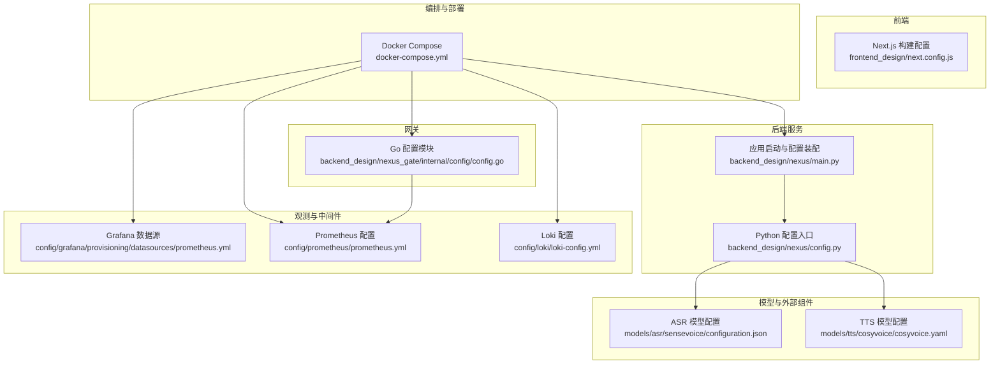
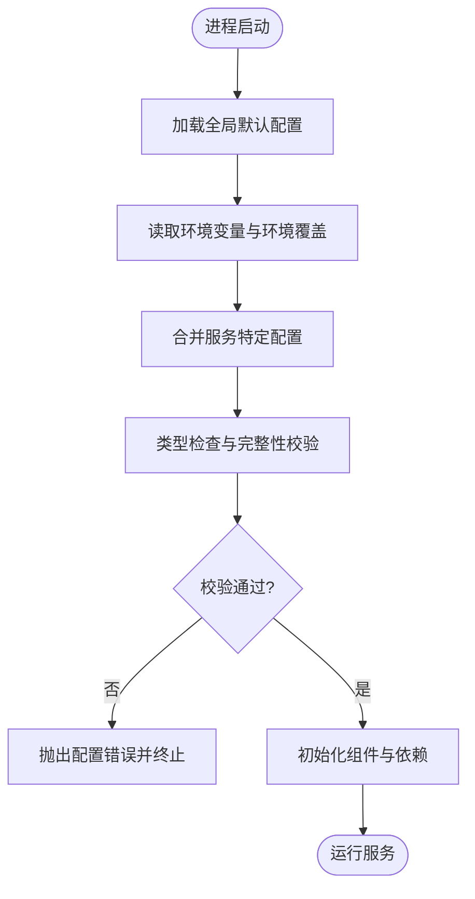
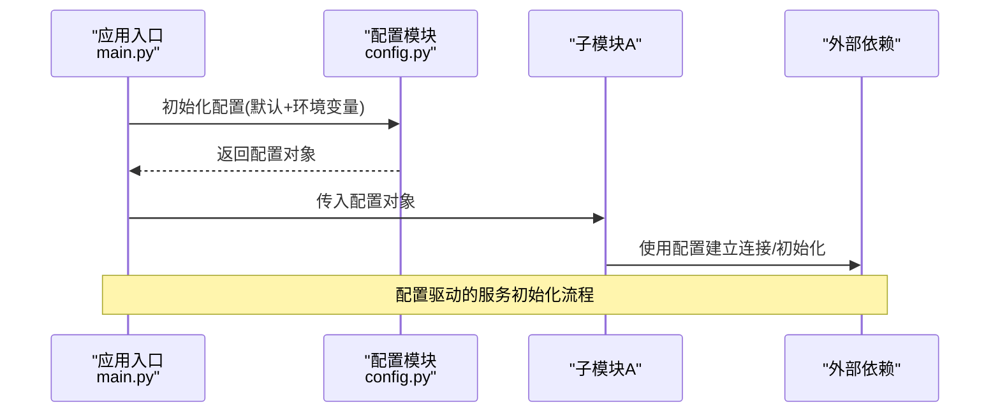
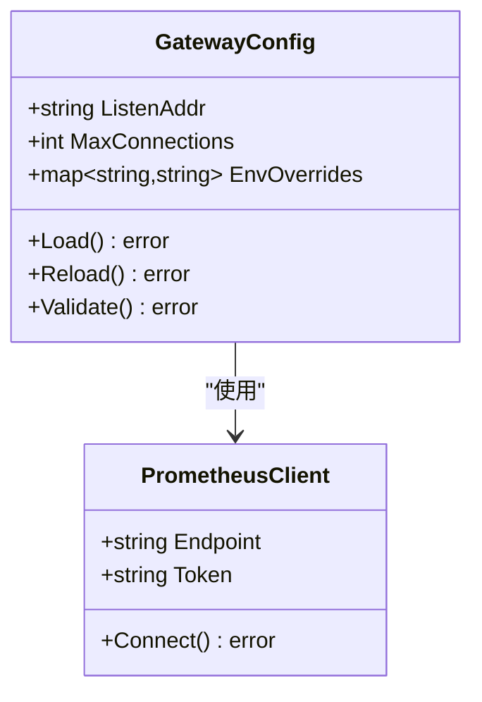
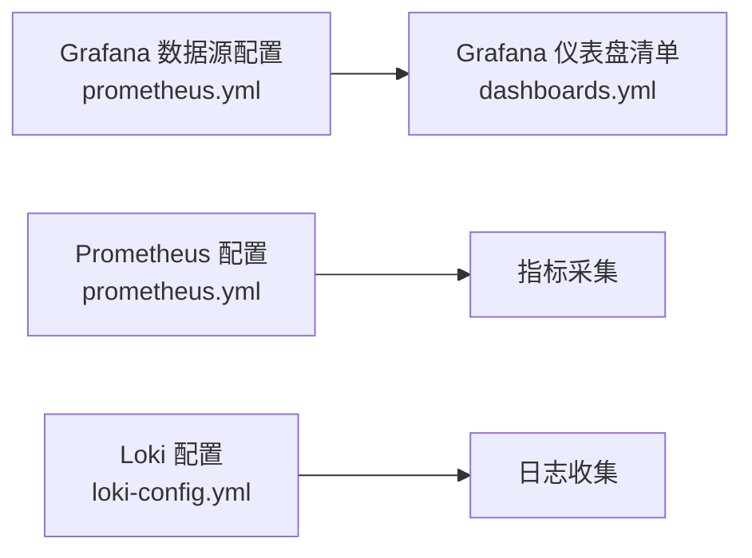
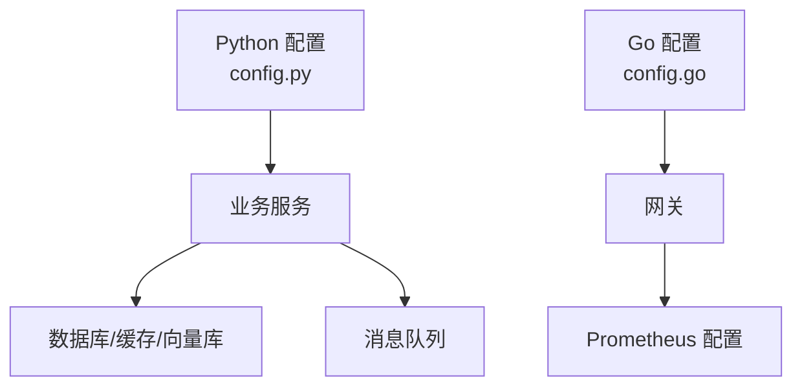

# 配置管理

<cite>
**本文引用的文件**   
- [backend_design/nexus/config.py](file://backend_design/nexus/config.py)
- [backend_design/nexus/main.py](file://backend_design/nexus/main.py)
- [backend_design/nexus_gate/internal/config/config.go](file://backend_design/nexus_gate/internal/config/config.go)
- [docker-compose.yml](file://docker-compose.yml)
- [config/grafana/provisioning/dashboards/dashboards.yml](file://config/grafana/provisioning/dashboards/dashboards.yml)
- [config/grafana/provisioning/datasources/prometheus.yml](file://config/grafana/provisioning/datasources/prometheus.yml)
- [config/loki/loki-config.yml](file://config/loki/loki-config.yml)
- [config/prometheus/prometheus.yml](file://config/prometheus/prometheus.yml)
- [frontend_design/next.config.js](file://frontend_design/next.config.js)
- [models/asr/sensevoice/configuration.json](file://models/asr/sensevoice/configuration.json)
- [models/tts/cosyvoice/cosyvoice.yaml](file://models/tts/cosyvoice/cosyvoice.yaml)
</cite>

## 目录
1. [简介](#简介)
2. [项目结构](#项目结构)
3. [核心组件](#核心组件)
4. [架构总览](#架构总览)
5. [详细组件分析](#详细组件分析)
6. [依赖关系分析](#依赖关系分析)
7. [性能考虑](#性能考虑)
8. [故障排查指南](#故障排查指南)
9. [结论](#结论)
10. [附录](#附录)

## 简介
本文件面向 NexusCockpit 系统的配置管理，聚焦分层配置体系、配置中心设计理念与实现要点、容器化配置传递、多环境策略、配置验证机制以及审计与变更追踪。文档以仓库现有实现为依据，结合通用最佳实践给出可落地的架构建议与图示说明，帮助读者快速理解并扩展系统配置能力。

## 项目结构
NexusCockpit 的配置分布在多个层次：
- 后端服务（Python）：应用级配置入口与加载逻辑
- 网关（Go）：独立配置模块与环境变量注入
- 中间件与观测组件：通过挂载配置文件进行初始化
- 前端：构建期环境变量注入
- 模型与第三方组件：各自携带配置清单

图表来源
- [backend_design/nexus/config.py](file://backend_design/nexus/config.py)
- [backend_design/nexus/main.py](file://backend_design/nexus/main.py)
- [backend_design/nexus_gate/internal/config/config.go](file://backend_design/nexus_gate/internal/config/config.go)
- [config/grafana/provisioning/datasources/prometheus.yml](file://config/grafana/provisioning/datasources/prometheus.yml)
- [config/prometheus/prometheus.yml](file://config/prometheus/prometheus.yml)
- [config/loki/loki-config.yml](file://config/loki/loki-config.yml)
- [frontend_design/next.config.js](file://frontend_design/next.config.js)
- [models/asr/sensevoice/configuration.json](file://models/asr/sensevoice/configuration.json)
- [models/tts/cosyvoice/cosyvoice.yaml](file://models/tts/cosyvoice/cosyvoice.yaml)
- [docker-compose.yml](file://docker-compose.yml)

章节来源
- [backend_design/nexus/config.py](file://backend_design/nexus/config.py)
- [backend_design/nexus/main.py](file://backend_design/nexus/main.py)
- [backend_design/nexus_gate/internal/config/config.go](file://backend_design/nexus_gate/internal/config/config.go)
- [docker-compose.yml](file://docker-compose.yml)
- [config/grafana/provisioning/datasources/prometheus.yml](file://config/grafana/provisioning/datasources/prometheus.yml)
- [config/prometheus/prometheus.yml](file://config/prometheus/prometheus.yml)
- [config/loki/loki-config.yml](file://config/loki/loki-config.yml)
- [frontend_design/next.config.js](file://frontend_design/next.config.js)
- [models/asr/sensevoice/configuration.json](file://models/asr/sensevoice/configuration.json)
- [models/tts/cosyvoice/cosyvoice.yaml](file://models/tts/cosyvoice/cosyvoice.yaml)

## 核心组件
- Python 应用配置入口：负责读取环境变量、合并默认值、暴露统一配置对象给业务模块使用。
- Go 网关配置模块：独立于 Python 服务，提供类型安全的配置解析与校验。
- 观测组件配置：通过挂载配置文件完成 Prometheus、Grafana、Loki 的初始化。
- 前端构建配置：在构建期注入环境变量，生成静态资源。
- 模型配置：各模型自带配置清单，由上层服务按需加载。

章节来源
- [backend_design/nexus/config.py](file://backend_design/nexus/config.py)
- [backend_design/nexus_gate/internal/config/config.go](file://backend_design/nexus_gate/internal/config/config.go)
- [config/grafana/provisioning/datasources/prometheus.yml](file://config/grafana/provisioning/datasources/prometheus.yml)
- [config/prometheus/prometheus.yml](file://config/prometheus/prometheus.yml)
- [config/loki/loki-config.yml](file://config/loki/loki-config.yml)
- [frontend_design/next.config.js](file://frontend_design/next.config.js)
- [models/asr/sensevoice/configuration.json](file://models/asr/sensevoice/configuration.json)
- [models/tts/cosyvoice/cosyvoice.yaml](file://models/tts/cosyvoice/cosyvoice.yaml)

## 架构总览
分层配置体系采用“全局默认 → 环境覆盖 → 服务特定”的优先级合并策略，并通过容器编排将环境变量与配置文件注入到运行时。

[此图为概念性流程，不直接映射具体源码文件]

## 详细组件分析

### Python 应用配置层
- 职责
  - 定义默认配置项与类型约束
  - 从环境变量读取覆盖值
  - 提供统一的配置访问接口
  - 在应用启动时完成关键依赖的参数装配
- 设计要点
  - 分层合并：默认值 < 环境变量 < 服务特定覆盖
  - 类型安全：对数值、布尔、列表等字段进行类型转换与校验
  - 最小权限：仅暴露必要配置键，避免泄露敏感信息
- 与主程序集成
  - 应用入口在启动阶段加载配置，并将配置注入到各子系统

图表来源
- [backend_design/nexus/main.py](file://backend_design/nexus/main.py)
- [backend_design/nexus/config.py](file://backend_design/nexus/config.py)

章节来源
- [backend_design/nexus/config.py](file://backend_design/nexus/config.py)
- [backend_design/nexus/main.py](file://backend_design/nexus/main.py)

### Go 网关配置层
- 职责
  - 解析 YAML/JSON/环境变量等多来源配置
  - 提供强类型配置结构与校验
  - 支持热重载（基于文件系统或配置中心事件）
- 设计要点
  - 配置结构体与校验规则集中维护
  - 支持按环境选择不同配置片段
  - 与 Prometheus 等监控组件对接时，优先使用环境变量注入敏感参数

图表来源
- [backend_design/nexus_gate/internal/config/config.go](file://backend_design/nexus_gate/internal/config/config.go)
- [config/prometheus/prometheus.yml](file://config/prometheus/prometheus.yml)

章节来源
- [backend_design/nexus_gate/internal/config/config.go](file://backend_design/nexus_gate/internal/config/config.go)
- [config/prometheus/prometheus.yml](file://config/prometheus/prometheus.yml)

### 观测与中间件配置
- Grafana 数据源与仪表盘
  - 通过 provision 目录挂载配置文件，声明数据源与仪表盘清单
- Prometheus
  - 采集目标与抓取间隔通过配置文件声明
- Loki
  - 日志存储与索引路径通过配置文件声明

图表来源
- [config/grafana/provisioning/datasources/prometheus.yml](file://config/grafana/provisioning/datasources/prometheus.yml)
- [config/grafana/provisioning/dashboards/dashboards.yml](file://config/grafana/provisioning/dashboards/dashboards.yml)
- [config/prometheus/prometheus.yml](file://config/prometheus/prometheus.yml)
- [config/loki/loki-config.yml](file://config/loki/loki-config.yml)

章节来源
- [config/grafana/provisioning/datasources/prometheus.yml](file://config/grafana/provisioning/datasources/prometheus.yml)
- [config/grafana/provisioning/dashboards/dashboards.yml](file://config/grafana/provisioning/dashboards/dashboards.yml)
- [config/prometheus/prometheus.yml](file://config/prometheus/prometheus.yml)
- [config/loki/loki-config.yml](file://config/loki/loki-config.yml)

### 前端构建期配置
- Next.js 构建配置中可通过环境变量注入前端可见的配置项
- 注意区分构建期与运行期变量，避免将敏感信息打入镜像

章节来源
- [frontend_design/next.config.js](file://frontend_design/next.config.js)

### 模型与外部组件配置
- ASR/TTS 等模型自带配置清单，通常由上层服务在初始化时加载
- 建议将模型路径、采样率、并发数等关键参数纳入统一配置管理

章节来源
- [models/asr/sensevoice/configuration.json](file://models/asr/sensevoice/configuration.json)
- [models/tts/cosyvoice/cosyvoice.yaml](file://models/tts/cosyvoice/cosyvoice.yaml)

## 依赖关系分析
- 配置来源耦合度
  - Python 服务依赖环境变量与本地配置文件
  - Go 网关依赖自身配置模块与外部监控组件配置
  - 观测组件通过挂载配置文件完成初始化
- 潜在循环依赖
  - 配置模块应避免反向依赖业务模块，保持单向依赖
- 外部依赖
  - 数据库、缓存、消息队列、向量库等通过配置注入连接参数

图表来源
- [backend_design/nexus/config.py](file://backend_design/nexus/config.py)
- [backend_design/nexus_gate/internal/config/config.go](file://backend_design/nexus_gate/internal/config/config.go)
- [config/prometheus/prometheus.yml](file://config/prometheus/prometheus.yml)

章节来源
- [backend_design/nexus/config.py](file://backend_design/nexus/config.py)
- [backend_design/nexus_gate/internal/config/config.go](file://backend_design/nexus_gate/internal/config/config.go)
- [config/prometheus/prometheus.yml](file://config/prometheus/prometheus.yml)

## 性能考虑
- 配置加载时机
  - 启动时一次性加载并缓存，避免频繁 I/O
- 热重载策略
  - 对非敏感配置可采用文件监听或配置中心事件触发增量更新
  - 对敏感配置（密钥、证书）建议重启或隔离更新
- 校验成本
  - 将复杂校验拆分为懒校验与预检，减少启动耗时

[本节为通用指导，不直接分析具体文件]

## 故障排查指南
- 常见错误定位
  - 环境变量缺失或类型不匹配导致启动失败
  - 配置文件语法错误或路径不可达
  - 端口冲突或网络不可达
- 排查步骤
  - 检查容器环境变量是否注入正确
  - 确认挂载的配置文件存在且可读
  - 查看服务日志中的配置加载与校验错误信息
- 回滚策略
  - 保留上一版本配置快照，出现异常时快速回滚
  - 使用配置中心版本标签切换至稳定版本

章节来源
- [docker-compose.yml](file://docker-compose.yml)

## 结论
NexusCockpit 的配置管理遵循分层合并、类型安全与最小暴露原则，结合容器化编排实现多环境差异化配置。建议在现有基础上完善配置中心集成、热重载与审计追踪能力，进一步提升可运维性与安全性。

[本节为总结性内容，不直接分析具体文件]

## 附录

### 分层配置优先级与合并策略
- 优先级顺序
  - 全局默认配置 < 环境配置 < 服务特定配置
- 合并策略
  - 深合并：嵌套对象逐层合并，避免覆盖整段配置
  - 白名单：仅允许覆盖受控键，防止误改
  - 冲突处理：后者优先，记录差异日志

[本节为概念性说明，不直接分析具体文件]

### 配置中心设计与实现要点
- 功能特性
  - 热重载：基于文件监听或配置中心推送事件
  - 版本管理：每次变更生成版本号，支持一键回滚
  - 灰度发布：按服务实例或租户维度下发配置
- 安全与审计
  - 变更审批流与操作留痕
  - 敏感字段加密存储与动态解密

[本节为概念性说明，不直接分析具体文件]

### 容器化配置管理
- Docker 环境变量传递
  - 通过 docker-compose 或编排平台注入环境变量
- 配置映射
  - 将配置文件挂载到容器指定路径
- 密钥管理
  - 使用密钥管理服务或编排平台的 Secret 机制注入敏感信息

章节来源
- [docker-compose.yml](file://docker-compose.yml)

### 多环境配置策略
- 开发环境
  - 开启调试开关、放宽限流策略、启用详细日志
- 测试环境
  - 模拟外部依赖、固定随机种子、关闭不必要功能
- 生产环境
  - 严格校验、最小权限、关闭调试输出、启用告警

[本节为概念性说明，不直接分析具体文件]

### 配置验证机制
- 类型检查
  - 对数值、布尔、枚举、列表等字段进行类型转换与范围校验
- 默认值设置
  - 为可选字段提供合理默认值，降低配置负担
- 完整性校验
  - 必填字段检查、依赖关系校验、连通性探测

[本节为概念性说明，不直接分析具体文件]

### 配置审计与变更追踪
- 变更记录
  - 记录变更人、时间、原因、影响范围
- 可追溯性
  - 关联配置版本与服务实例，便于问题回溯
- 安全控制
  - 变更审批、权限控制、敏感字段脱敏展示

[本节为概念性说明，不直接分析具体文件]