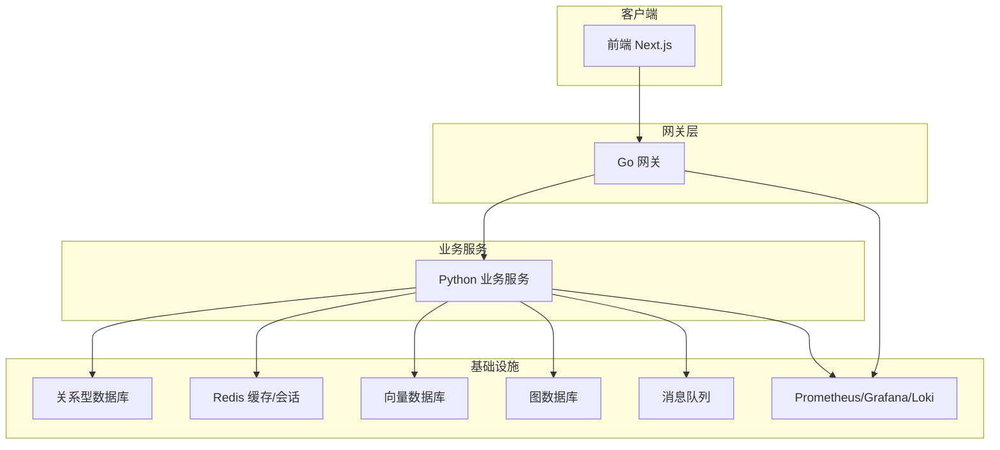
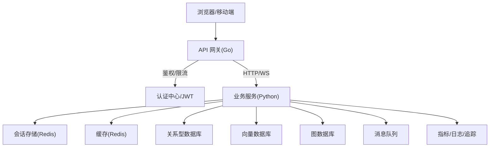
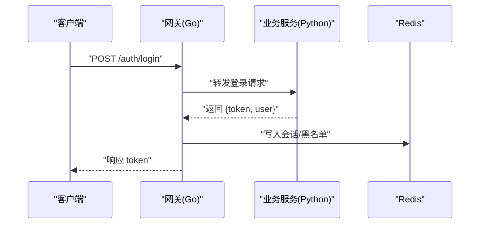
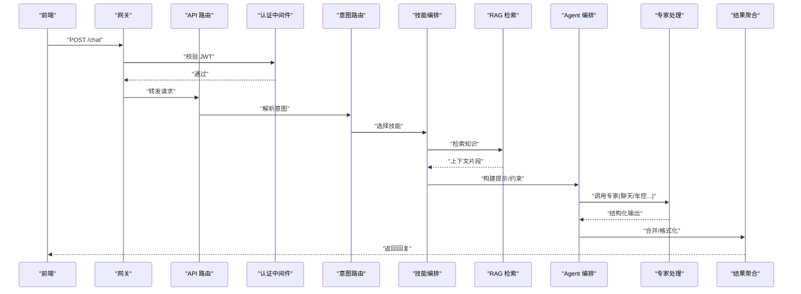
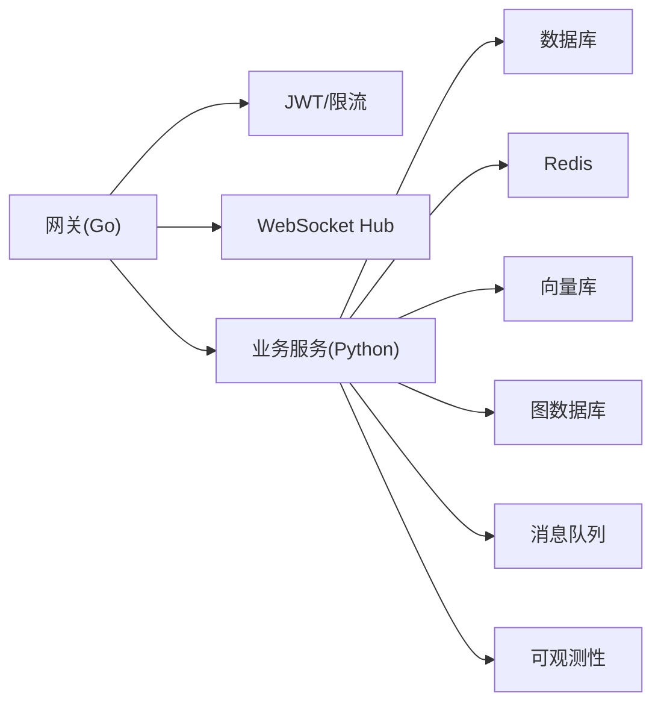

# 系统架构设计

<cite>
**本文引用的文件**   
- [backend_design/nexus/main.py](file://backend_design/nexus/main.py)
- [backend_design/nexus/config.py](file://backend_design/nexus/config.py)
- [backend_design/nexus/api/routes/auth.py](file://backend_design/nexus/api/routes/auth.py)
- [backend_design/nexus/core/auth.py](file://backend_design/nexus/core/auth.py)
- [backend_design/nexus/middleware/session_store.py](file://backend_design/nexus/middleware/session_store.py)
- [backend_design/nexus/middleware/redis_cache.py](file://backend_design/nexus/middleware/redis_cache.py)
- [backend_design/nexus/core/db_manager.py](file://backend_design/nexus/core/db_manager.py)
- [backend_design/nexus/models/state.py](file://backend_design/nexus/models/state.py)
- [backend_design/nexus/memory/manager.py](file://backend_design/nexus/memory/manager.py)
- [backend_design/nexus/intent/router.py](file://backend_design/nexus/intent/router.py)
- [backend_design/nexus/intent/llm_router.py](file://backend_design/nexus/intent/llm_router.py)
- [backend_design/nexus/skills/orchestrator.py](file://backend_design/nexus/skills/orchestrator.py)
- [backend_design/nexus/rag/unified_retriever.py](file://backend_design/nexus/rag/unified_retriever.py)
- [backend_design/nexus/rag/vector_store.py](file://backend_design/nexus/rag/vector_store.py)
- [backend_design/nexus/rag/graph_store.py](file://backend_design/nexus/rag/graph_store.py)
- [backend_design/nexus/agent/responder.py](file://backend_design/nexus/agent/responder.py)
- [backend_design/nexus/agent/reviewer.py](file://backend_design/nexus/agent/reviewer.py)
- [backend_design/nexus/agent/experts/chat_expert.py](file://backend_design/nexus/agent/experts/chat_expert.py)
- [backend_design/nexus/agent/experts/vehicle_expert.py](file://backend_design/nexus/agent/experts/vehicle_expert.py)
- [backend_design/nexus/vehicle/factory.py](file://backend_design/nexus/vehicle/factory.py)
- [backend_design/nexus/vehicle/http.py](file://backend_design/nexus/vehicle/http.py)
- [backend_design/nexus/vehicle/mcp.py](file://backend_design/nexus/vehicle/mcp.py)
- [backend_design/nexus/asr/engine.py](file://backend_design/nexus/asr/engine.py)
- [backend_design/nexus/tts/engine.py](file://backend_design/nexus/tts/engine.py)
- [backend_design/nexus/observability/metrics.py](file://backend_design/nexus/observability/metrics.py)
- [backend_design/nexus_gate/cmd/main.go](file://backend_design/nexus_gate/cmd/main.go)
- [backend_design/nexus_gate/internal/proxy/proxy.go](file://backend_design/nexus_gate/internal/proxy/proxy.go)
- [backend_design/nexus_gate/internal/handlers/handlers.go](file://backend_design/nexus_gate/internal/handlers/handlers.go)
- [backend_design/nexus_gate/internal/ratelimit/ratelimit.go](file://backend_design/nexus_gate/internal/ratelimit/ratelimit.go)
- [backend_design/nexus_gate/internal/ws/hub.go](file://backend_design/nexus_gate/internal/ws/hub.go)
- [backend_design/nexus_gate/internal/auth/jwt.go](file://backend_design/nexus_gate/internal/auth/jwt.go)
- [docker-compose.yml](file://docker-compose.yml)
- [config/prometheus/prometheus.yml](file://config/prometheus/prometheus.yml)
- [config/grafana/provisioning/dashboards/nexuscockpit-overview.json](file://config/grafana/provisioning/dashboards/nexuscockpit-overview.json)
- [frontend_design/src/lib/api.ts](file://frontend_design/src/lib/api.ts)
- [frontend_design/src/stores/auth-store.ts](file://frontend_design/src/stores/auth-store.ts)
</cite>

## 目录
1. [引言](#引言)
2. [项目结构](#项目结构)
3. [核心组件](#核心组件)
4. [架构总览](#架构总览)
5. [详细组件分析](#详细组件分析)
6. [依赖关系分析](#依赖关系分析)
7. [性能与扩展性](#性能与扩展性)
8. [故障排查指南](#故障排查指南)
9. [结论](#结论)
10. [附录](#附录)

## 引言
本文件为 NexusCockpit 系统的全面架构设计文档，面向技术与管理读者。文档围绕微服务架构模式、前后端分离、API 网关层等关键决策展开，解释 Python + Go 的技术选型权衡、容器化部署策略，并给出系统上下文图与组件架构图、数据流与通信模式、基础设施与安全架构、部署拓扑与高可用高并发扩展方案。

## 项目结构
NexusCockpit 采用前后端分离与多语言微服务组合：
- 前端：Next.js（TypeScript），提供管理控制台、聊天界面、车辆控制面板等页面，通过 REST/WebSocket 与后端交互。
- 网关：Go 实现的 API 网关，负责路由转发、鉴权、限流、WebSocket 代理。
- 业务服务：Python 实现的核心服务，包含意图识别、技能编排、RAG 检索、Agent 编排、ASR/TTS、会话与记忆管理等。
- 基础设施：Docker Compose 编排，集成数据库、向量库、图数据库、缓存、消息队列、可观测性栈等。

图表来源
- [docker-compose.yml](file://docker-compose.yml)
- [backend_design/nexus/main.py](file://backend_design/nexus/main.py)
- [backend_design/nexus_gate/cmd/main.go](file://backend_design/nexus_gate/cmd/main.go)

章节来源
- [docker-compose.yml](file://docker-compose.yml)
- [backend_design/nexus/main.py](file://backend_design/nexus/main.py)
- [backend_design/nexus_gate/cmd/main.go](file://backend_design/nexus_gate/cmd/main.go)

## 核心组件
- API 网关（Go）
  - 职责：统一入口、静态/动态路由、鉴权校验、请求限流、WebSocket 代理、可观测性埋点。
  - 关键点：基于配置的路由表；JWT 校验；Redis 令牌存储；速率限制器；Hub 管理长连接。
- 业务服务（Python）
  - 职责：HTTP/WebSocket 接口、认证与会话、意图路由、技能编排、RAG 检索、Agent 编排、ASR/TTS、记忆与状态、可观测性。
  - 关键点：模块化分层（api/core/middleware/models/agent/skills/rag/asr/tts/observability）；配置驱动；中间件可扩展。
- 前端（Next.js）
  - 职责：用户界面、状态管理、语音采集与播放、与网关/后端交互。
  - 关键点：REST/WebSocket 调用封装；本地鉴权态管理；音频录制与 TTS 播放。

章节来源
- [backend_design/nexus_gate/cmd/main.go](file://backend_design/nexus_gate/cmd/main.go)
- [backend_design/nexus_gate/internal/proxy/proxy.go](file://backend_design/nexus_gate/internal/proxy/proxy.go)
- [backend_design/nexus_gate/internal/handlers/handlers.go](file://backend_design/nexus_gate/internal/handlers/handlers.go)
- [backend_design/nexus_gate/internal/ratelimit/ratelimit.go](file://backend_design/nexus_gate/internal/ratelimit/ratelimit.go)
- [backend_design/nexus_gate/internal/ws/hub.go](file://backend_design/nexus_gate/internal/ws/hub.go)
- [backend_design/nexus_gate/internal/auth/jwt.go](file://backend_design/nexus_gate/internal/auth/jwt.go)
- [backend_design/nexus/main.py](file://backend_design/nexus/main.py)
- [backend_design/nexus/config.py](file://backend_design/nexus/config.py)
- [frontend_design/src/lib/api.ts](file://frontend_design/src/lib/api.ts)
- [frontend_design/src/stores/auth-store.ts](file://frontend_design/src/stores/auth-store.ts)

## 架构总览
整体采用“前端 + API 网关 + 业务微服务 + 基础设施”的分层架构。网关作为唯一对外入口，承载安全与流量治理；业务服务按领域拆分模块，内部以进程内协作为主，必要时通过消息队列或外部服务进行异步解耦。

图表来源
- [backend_design/nexus_gate/cmd/main.go](file://backend_design/nexus_gate/cmd/main.go)
- [backend_design/nexus/main.py](file://backend_design/nexus/main.py)
- [docker-compose.yml](file://docker-compose.yml)

## 详细组件分析

### API 网关（Go）
- 功能要点
  - 路由分发：根据路径与方法将请求转发至后端服务。
  - 鉴权：解析并校验 JWT，支持白名单与黑名单策略。
  - 限流：基于 Redis 的令牌桶/滑动窗口算法对 IP/用户维度限流。
  - WebSocket：维护 Hub 连接池，转发 WS 帧到后端。
  - 可观测性：记录访问日志、错误码分布、延迟分位。
- 关键流程（登录鉴权）

图表来源
- [backend_design/nexus_gate/cmd/main.go](file://backend_design/nexus_gate/cmd/main.go)
- [backend_design/nexus_gate/internal/handlers/handlers.go](file://backend_design/nexus_gate/internal/handlers/handlers.go)
- [backend_design/nexus_gate/internal/auth/jwt.go](file://backend_design/nexus_gate/internal/auth/jwt.go)
- [backend_design/nexus_gate/internal/ratelimit/ratelimit.go](file://backend_design/nexus_gate/internal/ratelimit/ratelimit.go)
- [backend_design/nexus_gate/internal/ws/hub.go](file://backend_design/nexus_gate/internal/ws/hub.go)

章节来源
- [backend_design/nexus_gate/cmd/main.go](file://backend_design/nexus_gate/cmd/main.go)
- [backend_design/nexus_gate/internal/proxy/proxy.go](file://backend_design/nexus_gate/internal/proxy/proxy.go)
- [backend_design/nexus_gate/internal/handlers/handlers.go](file://backend_design/nexus_gate/internal/handlers/handlers.go)
- [backend_design/nexus_gate/internal/ratelimit/ratelimit.go](file://backend_design/nexus_gate/internal/ratelimit/ratelimit.go)
- [backend_design/nexus_gate/internal/ws/hub.go](file://backend_design/nexus_gate/internal/ws/hub.go)
- [backend_design/nexus_gate/internal/auth/jwt.go](file://backend_design/nexus_gate/internal/auth/jwt.go)

### 业务服务（Python）
- 分层与职责
  - API 层：定义 HTTP/WebSocket 路由与参数校验。
  - 核心层：认证、异常、日志、租户上下文、SSL 修复等通用能力。
  - 中间件层：会话存储、Redis 缓存、任务队列、熔断器等。
  - 模型层：领域模型与状态机。
  - Agent 层：专家路由、审查者、应答生成。
  - 技能层：车控、健康、习惯、提醒、特殊场景等。
  - RAG 层：统一检索、向量/图检索、重排。
  - ASR/TTS：语音识别与合成引擎。
  - 可观测性：指标、Langfuse 追踪、数据保留策略。
- 关键流程（聊天对话）

图表来源
- [backend_design/nexus/api/routes/auth.py](file://backend_design/nexus/api/routes/auth.py)
- [backend_design/nexus/core/auth.py](file://backend_design/nexus/core/auth.py)
- [backend_design/nexus/intent/router.py](file://backend_design/nexus/intent/router.py)
- [backend_design/nexus/intent/llm_router.py](file://backend_design/nexus/intent/llm_router.py)
- [backend_design/nexus/skills/orchestrator.py](file://backend_design/nexus/skills/orchestrator.py)
- [backend_design/nexus/rag/unified_retriever.py](file://backend_design/nexus/rag/unified_retriever.py)
- [backend_design/nexus/agent/responder.py](file://backend_design/nexus/agent/responder.py)
- [backend_design/nexus/agent/reviewer.py](file://backend_design/nexus/agent/reviewer.py)
- [backend_design/nexus/agent/experts/chat_expert.py](file://backend_design/nexus/agent/experts/chat_expert.py)
- [backend_design/nexus/agent/experts/vehicle_expert.py](file://backend_design/nexus/agent/experts/vehicle_expert.py)

章节来源
- [backend_design/nexus/main.py](file://backend_design/nexus/main.py)
- [backend_design/nexus/config.py](file://backend_design/nexus/config.py)
- [backend_design/nexus/core/auth.py](file://backend_design/nexus/core/auth.py)
- [backend_design/nexus/middleware/session_store.py](file://backend_design/nexus/middleware/session_store.py)
- [backend_design/nexus/middleware/redis_cache.py](file://backend_design/nexus/middleware/redis_cache.py)
- [backend_design/nexus/core/db_manager.py](file://backend_design/nexus/core/db_manager.py)
- [backend_design/nexus/models/state.py](file://backend_design/nexus/models/state.py)
- [backend_design/nexus/memory/manager.py](file://backend_design/nexus/memory/manager.py)
- [backend_design/nexus/intent/router.py](file://backend_design/nexus/intent/router.py)
- [backend_design/nexus/intent/llm_router.py](file://backend_design/nexus/intent/llm_router.py)
- [backend_design/nexus/skills/orchestrator.py](file://backend_design/nexus/skills/orchestrator.py)
- [backend_design/nexus/rag/unified_retriever.py](file://backend_design/nexus/rag/unified_retriever.py)
- [backend_design/nexus/rag/vector_store.py](file://backend_design/nexus/rag/vector_store.py)
- [backend_design/nexus/rag/graph_store.py](file://backend_design/nexus/rag/graph_store.py)
- [backend_design/nexus/agent/responder.py](file://backend_design/nexus/agent/responder.py)
- [backend_design/nexus/agent/reviewer.py](file://backend_design/nexus/agent/reviewer.py)
- [backend_design/nexus/agent/experts/chat_expert.py](file://backend_design/nexus/agent/experts/chat_expert.py)
- [backend_design/nexus/agent/experts/vehicle_expert.py](file://backend_design/nexus/agent/experts/vehicle_expert.py)

### 前端（Next.js）
- 职责
  - 页面与组件：聊天、仪表盘、车辆控制、设置、管理员面板等。
  - 状态与网络：全局状态管理、REST/WebSocket 封装、音频录制与播放。
- 与网关/后端交互
  - 统一 API 客户端，携带鉴权头；WebSocket 用于实时消息与语音流。
  - 本地保存会话与权限信息，配合网关 JWT 校验。

章节来源
- [frontend_design/src/lib/api.ts](file://frontend_design/src/lib/api.ts)
- [frontend_design/src/stores/auth-store.ts](file://frontend_design/src/stores/auth-store.ts)

### 语音链路（ASR/TTS）
- 语音识别（ASR）
  - 接收前端上传的音频流，转写为文本，供意图识别使用。
- 语音合成（TTS）
  - 将文本回复合成为音频流，回传给前端播放。
- 与网关协作
  - 通过 WebSocket 双向传输音频帧，降低延迟。

章节来源
- [backend_design/nexus/asr/engine.py](file://backend_design/nexus/asr/engine.py)
- [backend_design/nexus/tts/engine.py](file://backend_design/nexus/tts/engine.py)
- [backend_design/nexus_gate/internal/ws/hub.go](file://backend_design/nexus_gate/internal/ws/hub.go)

### 车辆控制与外部系统集成
- 设备抽象
  - 工厂模式创建不同协议适配器（HTTP/MCP）。
- 指令下发
  - 通过 HTTP 或 MCP 协议向车载系统发送控制指令，并处理回执。
- 安全与重试
  - 失败重试、超时控制、熔断保护。

章节来源
- [backend_design/nexus/vehicle/factory.py](file://backend_design/nexus/vehicle/factory.py)
- [backend_design/nexus/vehicle/http.py](file://backend_design/nexus/vehicle/http.py)
- [backend_design/nexus/vehicle/mcp.py](file://backend_design/nexus/vehicle/mcp.py)

## 依赖关系分析
- 组件耦合
  - 网关与业务服务松耦合，通过 HTTP/WebSocket 通信；鉴权与限流在网关侧集中实现。
  - 业务服务内部通过中间件与模块划分降低耦合；RAG/Agent/技能层清晰分层。
- 外部依赖
  - 数据库、向量库、图数据库、Redis、消息队列、可观测性平台。
- 潜在循环依赖
  - 通过接口抽象与事件总线避免直接循环引用。

图表来源
- [backend_design/nexus_gate/cmd/main.go](file://backend_design/nexus_gate/cmd/main.go)
- [backend_design/nexus/main.py](file://backend_design/nexus/main.py)
- [docker-compose.yml](file://docker-compose.yml)

章节来源
- [backend_design/nexus_gate/cmd/main.go](file://backend_design/nexus_gate/cmd/main.go)
- [backend_design/nexus/main.py](file://backend_design/nexus/main.py)
- [docker-compose.yml](file://docker-compose.yml)

## 性能与扩展性
- 水平扩展
  - 网关与业务服务无状态化，支持多副本横向扩展；会话与缓存下沉至 Redis。
- 异步与削峰
  - 通过消息队列处理耗时任务（如批量数据处理、离线训练、索引重建）。
- 缓存策略
  - 热点数据多级缓存（内存+Redis），RAG 检索结果缓存，减少下游压力。
- 连接复用与批处理
  - 数据库连接池、HTTP 客户端连接复用；向量/图查询批量化。
- 可观测性与弹性
  - Prometheus 指标、Grafana 看板、Loki 日志；结合 HPA 自动扩缩容。

[本节为通用指导，不直接分析具体文件]

## 故障排查指南
- 常见问题定位
  - 鉴权失败：检查 JWT 签名、过期时间、网关黑名单。
  - 限流触发：查看网关限流统计与 Redis 计数器。
  - WebSocket 断连：检查 Hub 心跳、后端 WS 路由与跨域配置。
  - 数据库慢查询：通过慢查询日志与索引优化。
  - RAG 检索质量：调整检索阈值、重排策略与知识库更新频率。
- 监控与告警
  - 指标：QPS、P95/P99 延迟、错误率、资源使用率。
  - 日志：结构化日志、TraceID 贯穿全链路。
  - 看板：Grafana 预置仪表盘快速定位问题。

章节来源
- [backend_design/nexus_gate/internal/ratelimit/ratelimit.go](file://backend_design/nexus_gate/internal/ratelimit/ratelimit.go)
- [backend_design/nexus_gate/internal/ws/hub.go](file://backend_design/nexus_gate/internal/ws/hub.go)
- [backend_design/nexus/observability/metrics.py](file://backend_design/nexus/observability/metrics.py)
- [config/prometheus/prometheus.yml](file://config/prometheus/prometheus.yml)
- [config/grafana/provisioning/dashboards/nexuscockpit-overview.json](file://config/grafana/provisioning/dashboards/nexuscockpit-overview.json)

## 结论
NexusCockpit 采用“前端 + Go 网关 + Python 业务服务 + 基础设施”的分层架构，兼顾高性能与易扩展。通过明确的边界与契约，系统在认证授权、限流、缓存、检索与智能体编排等方面形成稳定闭环。容器化与可观测性保障交付与运维效率，为高可用与高并发场景奠定基础。

[本节为总结性内容，不直接分析具体文件]

## 附录

### 技术选型与权衡
- Python + Go 组合
  - Go：高并发网关、低延迟转发、强类型与编译期安全，适合做统一入口与流量治理。
  - Python：丰富的 AI/ML 生态、快速原型与迭代，适合复杂业务逻辑与智能体编排。
- 容器化部署
  - 一致的运行环境、快速扩缩容、灰度发布与回滚，提升交付稳定性。
- 前后端分离
  - 独立演进与部署，前端专注体验，后端专注能力，利于团队协作与规模化。

[本节为概念性说明，不直接分析具体文件]

### 安全架构设计
- 认证与授权
  - JWT 签发与校验、会话存储于 Redis、网关侧黑名单与白名单策略。
- 数据安全
  - 敏感配置加密、传输层 TLS、最小权限原则访问数据库与外部服务。
- 网络安全
  - 网关层限流与防刷、WAF 接入、域名与证书管理、跨域策略控制。
- 审计与合规
  - 操作日志留存、敏感字段脱敏、访问审计与告警。

章节来源
- [backend_design/nexus_gate/internal/auth/jwt.go](file://backend_design/nexus_gate/internal/auth/jwt.go)
- [backend_design/nexus/core/auth.py](file://backend_design/nexus/core/auth.py)
- [backend_design/nexus/middleware/session_store.py](file://backend_design/nexus/middleware/session_store.py)
- [backend_design/nexus/middleware/redis_cache.py](file://backend_design/nexus/middleware/redis_cache.py)

### 部署拓扑与高可用
- 多副本部署
  - 网关与业务服务多实例，负载均衡分发；数据库主从/集群、Redis 哨兵/集群。
- 故障转移
  - 健康检查与自动重启、优雅下线、幂等与重试机制。
- 容量规划
  - CPU/内存/IO 基线评估，峰值压测与弹性扩容策略。

章节来源
- [docker-compose.yml](file://docker-compose.yml)

### 数据流与通信模式
- 同步：REST 用于常规 CRUD 与配置管理。
- 异步：消息队列用于离线任务与事件驱动。
- 实时：WebSocket 用于聊天、语音流与实时状态推送。

章节来源
- [backend_design/nexus/api/routes/auth.py](file://backend_design/nexus/api/routes/auth.py)
- [backend_design/nexus_gate/internal/ws/hub.go](file://backend_design/nexus_gate/internal/ws/hub.go)
- [backend_design/nexus/middleware/task_queue.py](file://backend_design/nexus/middleware/task_queue.py)