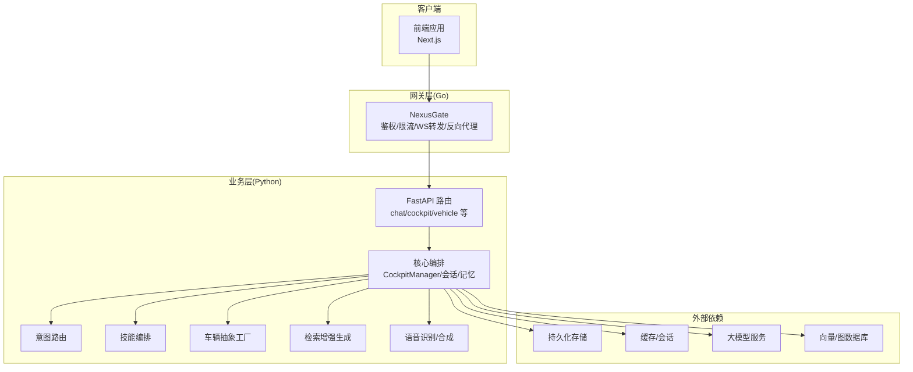
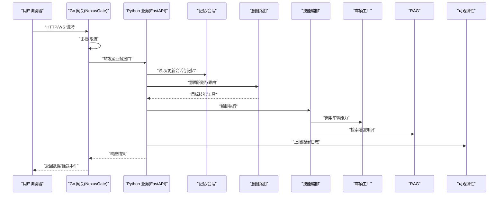
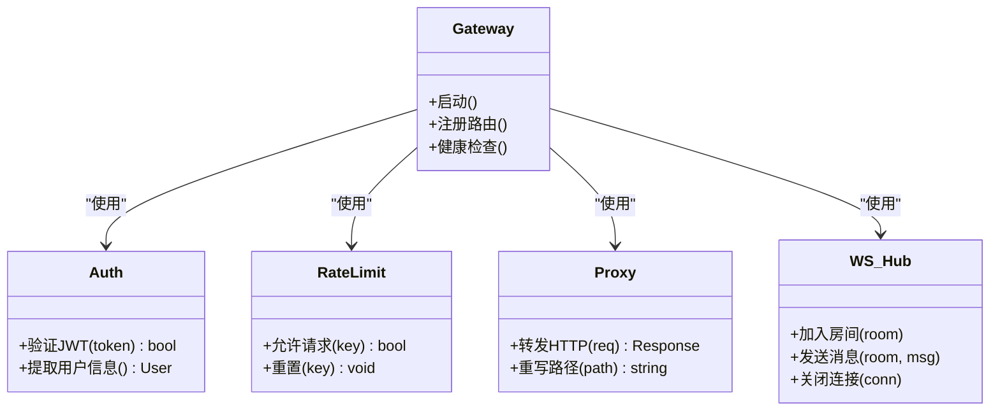
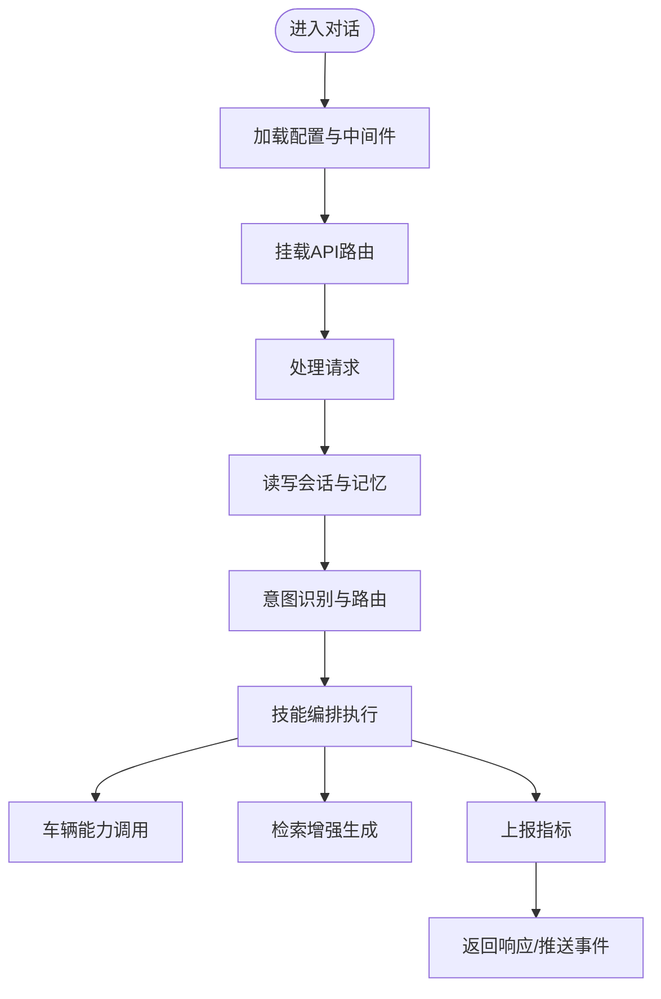
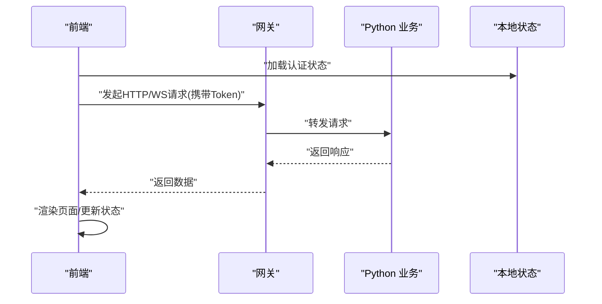
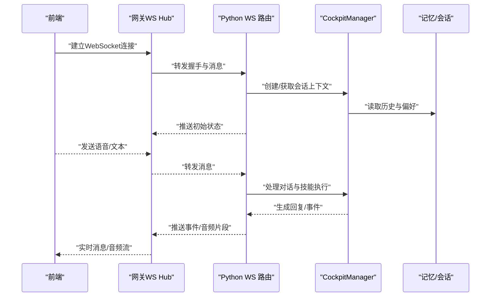
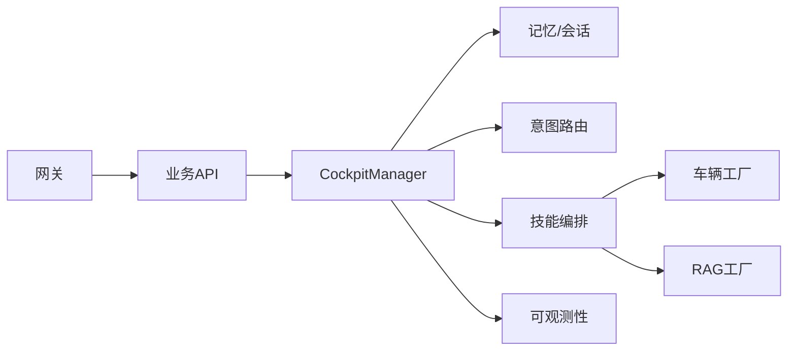

# 系统架构设计

<cite>
**本文引用的文件**   
- [README.md](file://README.md)
- [docker-compose.yml](file://docker-compose.yml)
- [backend_design/nexus/main.py](file://backend_design/nexus/main.py)
- [backend_design/nexus/config.py](file://backend_design/nexus/config.py)
- [backend_design/nexus/core/cockpit_manager.py](file://backend_design/nexus/core/cockpit_manager.py)
- [backend_design/nexus/api/routes/chat.py](file://backend_design/nexus/api/routes/chat.py)
- [backend_design/nexus/api/websocket.py](file://backend_design/nexus/api/websocket.py)
- [backend_design/nexus/middleware/session_store.py](file://backend_design/nexus/middleware/session_store.py)
- [backend_design/nexus/memory/manager.py](file://backend_design/nexus/memory/manager.py)
- [backend_design/nexus/intent/router.py](file://backend_design/nexus/intent/router.py)
- [backend_design/nexus/skills/orchestrator.py](file://backend_design/nexus/skills/orchestrator.py)
- [backend_design/nexus/vehicle/factory.py](file://backend_design/nexus/vehicle/factory.py)
- [backend_design/nexus/rag/graph_factory.py](file://backend_design/nexus/rag/graph_factory.py)
- [backend_design/nexus/observability/metrics.py](file://backend_design/nexus/observability/metrics.py)
- [backend_design/nexus_gate/cmd/main.go](file://backend_design/nexus_gate/cmd/main.go)
- [backend_design/nexus_gate/internal/proxy/proxy.go](file://backend_design/nexus_gate/internal/proxy/proxy.go)
- [backend_design/nexus_gate/internal/auth/jwt.go](file://backend_design/nexus_gate/internal/auth/jwt.go)
- [backend_design/nexus_gate/internal/ratelimit/ratelimit.go](file://backend_design/nexus_gate/internal/ratelimit/ratelimit.go)
- [backend_design/nexus_gate/internal/ws/hub.go](file://backend_design/nexus_gate/internal/ws/hub.go)
- [frontend_design/src/app/layout.tsx](file://frontend_design/src/app/layout.tsx)
- [frontend_design/src/app/page.tsx](file://frontend_design/src/app/page.tsx)
- [frontend_design/src/lib/api.ts](file://frontend_design/src/lib/api.ts)
- [frontend_design/src/stores/auth-store.ts](file://frontend_design/src/stores/auth-store.ts)
- [config/prometheus/prometheus.yml](file://config/prometheus/prometheus.yml)
- [config/grafana/provisioning/dashboards/nexuscockpit-overview.json](file://config/grafana/provisioning/dashboards/nexuscockpit-overview.json)
</cite>

## 目录
1. [引言](#引言)
2. [项目结构](#项目结构)
3. [核心组件](#核心组件)
4. [架构总览](#架构总览)
5. [详细组件分析](#详细组件分析)
6. [依赖关系分析](#依赖关系分析)
7. [性能与可扩展性](#性能与可扩展性)
8. [安全、监控与灾难恢复](#安全监控与灾难恢复)
9. [部署拓扑与基础设施](#部署拓扑与基础设施)
10. [故障排查指南](#故障排查指南)
11. [结论](#结论)
12. [附录：技术栈与兼容性](#附录技术栈与兼容性)

## 引言
本文件为 NexusCockpit 系统的全面架构设计文档，面向产品、研发与运维人员。文档覆盖高层系统设计、架构模式与边界、微服务职责划分（Go 网关层、Python 业务层、前端应用）、组件交互与数据流、集成模式、技术决策与权衡、约束条件、基础设施需求、可扩展性与部署拓扑，并给出系统上下文图与组件分解图。同时涵盖安全性、可观测性与灾难恢复等横切关注点，以及技术栈与第三方依赖的版本兼容说明。

## 项目结构
仓库采用多语言分层组织：
- Go 网关层：负责鉴权、限流、协议转换、WebSocket 转发与反向代理。
- Python 业务层：提供对话、车辆控制、记忆、意图路由、RAG、技能编排、ASR/TTS 等能力。
- Next.js 前端：管理控制台、聊天界面、仪表盘、车辆控制面板等。
- 配置与可观测性：Prometheus/Grafana 采集与可视化。
- 容器编排：docker-compose 统一编排各组件。

图表来源
- [backend_design/nexus_gate/cmd/main.go:1-200](file://backend_design/nexus_gate/cmd/main.go#L1-L200)
- [backend_design/nexus/main.py:1-200](file://backend_design/nexus/main.py#L1-L200)
- [frontend_design/src/app/layout.tsx:1-200](file://frontend_design/src/app/layout.tsx#L1-L200)

章节来源
- [README.md](file://README.md)
- [docker-compose.yml](file://docker-compose.yml)

## 核心组件
- Go 网关层
  - 职责：统一入口、JWT 鉴权、请求限流、WebSocket Hub、HTTP 反向代理到后端。
  - 关键模块：认证、限流、代理、WS Hub。
- Python 业务层
  - 职责：对话流程编排、意图识别与路由、技能执行、车辆控制、记忆与状态、RAG 检索、ASR/TTS 处理、中间件（会话、缓存、任务队列）。
  - 关键模块：CockpitManager、会话/记忆、意图路由、技能编排、车辆工厂、RAG 工厂、可观测性指标。
- 前端应用
  - 职责：页面路由、UI 组件、状态管理、与网关的 HTTP/WebSocket 通信、TTS 播放与录音。
  - 关键模块：布局与路由、API 封装、认证状态、聊天与车辆面板。

章节来源
- [backend_design/nexus_gate/cmd/main.go:1-200](file://backend_design/nexus_gate/cmd/main.go#L1-L200)
- [backend_design/nexus/main.py:1-200](file://backend_design/nexus/main.py#L1-L200)
- [frontend_design/src/app/layout.tsx:1-200](file://frontend_design/src/app/layout.tsx#L1-L200)

## 架构总览
系统采用“网关 + 业务微服务 + 前端”的分层架构，结合事件驱动与异步处理，支持实时语音与长连接。

图表来源
- [backend_design/nexus_gate/cmd/main.go:1-200](file://backend_design/nexus_gate/cmd/main.go#L1-L200)
- [backend_design/nexus/api/routes/chat.py:1-200](file://backend_design/nexus/api/routes/chat.py#L1-L200)
- [backend_design/nexus/core/cockpit_manager.py:1-200](file://backend_design/nexus/core/cockpit_manager.py#L1-L200)
- [backend_design/nexus/intent/router.py:1-200](file://backend_design/nexus/intent/router.py#L1-L200)
- [backend_design/nexus/skills/orchestrator.py:1-200](file://backend_design/nexus/skills/orchestrator.py#L1-L200)
- [backend_design/nexus/vehicle/factory.py:1-200](file://backend_design/nexus/vehicle/factory.py#L1-L200)
- [backend_design/nexus/rag/graph_factory.py:1-200](file://backend_design/nexus/rag/graph_factory.py#L1-L200)
- [backend_design/nexus/observability/metrics.py:1-200](file://backend_design/nexus/observability/metrics.py#L1-L200)

## 详细组件分析

### Go 网关层（NexusGate）
- 入口与路由：集中注册 HTTP 与 WebSocket 路由，统一暴露对外端口。
- 鉴权：解析 JWT，校验签名与过期时间，注入用户上下文。
- 限流：基于令牌桶或滑动窗口限制 QPS，保护下游服务。
- 反向代理：将业务路径转发至 Python 服务，必要时进行路径重写与头透传。
- WebSocket：Hub 维护连接集合，实现消息广播与房间隔离。

图表来源
- [backend_design/nexus_gate/cmd/main.go:1-200](file://backend_design/nexus_gate/cmd/main.go#L1-L200)
- [backend_design/nexus_gate/internal/auth/jwt.go:1-200](file://backend_design/nexus_gate/internal/auth/jwt.go#L1-L200)
- [backend_design/nexus_gate/internal/ratelimit/ratelimit.go:1-200](file://backend_design/nexus_gate/internal/ratelimit/ratelimit.go#L1-L200)
- [backend_design/nexus_gate/internal/proxy/proxy.go:1-200](file://backend_design/nexus_gate/internal/proxy/proxy.go#L1-L200)
- [backend_design/nexus_gate/internal/ws/hub.go:1-200](file://backend_design/nexus_gate/internal/ws/hub.go#L1-L200)

章节来源
- [backend_design/nexus_gate/cmd/main.go:1-200](file://backend_design/nexus_gate/cmd/main.go#L1-L200)
- [backend_design/nexus_gate/internal/auth/jwt.go:1-200](file://backend_design/nexus_gate/internal/auth/jwt.go#L1-L200)
- [backend_design/nexus_gate/internal/ratelimit/ratelimit.go:1-200](file://backend_design/nexus_gate/internal/ratelimit/ratelimit.go#L1-L200)
- [backend_design/nexus_gate/internal/proxy/proxy.go:1-200](file://backend_design/nexus_gate/internal/proxy/proxy.go#L1-L200)
- [backend_design/nexus_gate/internal/ws/hub.go:1-200](file://backend_design/nexus_gate/internal/ws/hub.go#L1-L200)

### Python 业务层（Nexus）
- 应用入口与配置：加载配置、初始化中间件、挂载路由、启动服务。
- CockpitManager：对话生命周期管理、状态机、跨模块协调。
- 会话与记忆：会话存储、冲突合并、压缩与持久化。
- 意图路由：启发式规则与大模型路由混合策略。
- 技能编排：按意图选择并执行具体技能（导航、媒体、座椅、车窗等）。
- 车辆抽象工厂：统一车辆接口，适配不同厂商或模拟实现。
- RAG：图/向量检索、重排序、知识库接入。
- 可观测性：指标采集、数据保留策略、Langfuse 追踪。

图表来源
- [backend_design/nexus/main.py:1-200](file://backend_design/nexus/main.py#L1-L200)
- [backend_design/nexus/core/cockpit_manager.py:1-200](file://backend_design/nexus/core/cockpit_manager.py#L1-L200)
- [backend_design/nexus/middleware/session_store.py:1-200](file://backend_design/nexus/middleware/session_store.py#L1-L200)
- [backend_design/nexus/memory/manager.py:1-200](file://backend_design/nexus/memory/manager.py#L1-L200)
- [backend_design/nexus/intent/router.py:1-200](file://backend_design/nexus/intent/router.py#L1-L200)
- [backend_design/nexus/skills/orchestrator.py:1-200](file://backend_design/nexus/skills/orchestrator.py#L1-L200)
- [backend_design/nexus/vehicle/factory.py:1-200](file://backend_design/nexus/vehicle/factory.py#L1-L200)
- [backend_design/nexus/rag/graph_factory.py:1-200](file://backend_design/nexus/rag/graph_factory.py#L1-L200)
- [backend_design/nexus/observability/metrics.py:1-200](file://backend_design/nexus/observability/metrics.py#L1-L200)

章节来源
- [backend_design/nexus/main.py:1-200](file://backend_design/nexus/main.py#L1-L200)
- [backend_design/nexus/config.py:1-200](file://backend_design/nexus/config.py#L1-L200)
- [backend_design/nexus/core/cockpit_manager.py:1-200](file://backend_design/nexus/core/cockpit_manager.py#L1-L200)
- [backend_design/nexus/middleware/session_store.py:1-200](file://backend_design/nexus/middleware/session_store.py#L1-L200)
- [backend_design/nexus/memory/manager.py:1-200](file://backend_design/nexus/memory/manager.py#L1-L200)
- [backend_design/nexus/intent/router.py:1-200](file://backend_design/nexus/intent/router.py#L1-L200)
- [backend_design/nexus/skills/orchestrator.py:1-200](file://backend_design/nexus/skills/orchestrator.py#L1-L200)
- [backend_design/nexus/vehicle/factory.py:1-200](file://backend_design/nexus/vehicle/factory.py#L1-L200)
- [backend_design/nexus/rag/graph_factory.py:1-200](file://backend_design/nexus/rag/graph_factory.py#L1-L200)
- [backend_design/nexus/observability/metrics.py:1-200](file://backend_design/nexus/observability/metrics.py#L1-L200)

### 前端应用（Next.js）
- 布局与路由：全局布局、页面级路由、侧边栏与主题。
- API 封装：统一请求拦截、错误处理、重试与超时。
- 认证状态：本地存储 Token、刷新与登出逻辑。
- 聊天与车辆面板：实时消息、语音输入输出、车辆状态展示与控制。

图表来源
- [frontend_design/src/app/layout.tsx:1-200](file://frontend_design/src/app/layout.tsx#L1-L200)
- [frontend_design/src/app/page.tsx:1-200](file://frontend_design/src/app/page.tsx#L1-L200)
- [frontend_design/src/lib/api.ts:1-200](file://frontend_design/src/lib/api.ts#L1-L200)
- [frontend_design/src/stores/auth-store.ts:1-200](file://frontend_design/src/stores/auth-store.ts#L1-L200)

章节来源
- [frontend_design/src/app/layout.tsx:1-200](file://frontend_design/src/app/layout.tsx#L1-L200)
- [frontend_design/src/app/page.tsx:1-200](file://frontend_design/src/app/page.tsx#L1-L200)
- [frontend_design/src/lib/api.ts:1-200](file://frontend_design/src/lib/api.ts#L1-L200)
- [frontend_design/src/stores/auth-store.ts:1-200](file://frontend_design/src/stores/auth-store.ts#L1-L200)

### 实时对话与 WebSocket 链路

图表来源
- [backend_design/nexus/api/websocket.py:1-200](file://backend_design/nexus/api/websocket.py#L1-L200)
- [backend_design/nexus/core/cockpit_manager.py:1-200](file://backend_design/nexus/core/cockpit_manager.py#L1-L200)
- [backend_design/nexus/middleware/session_store.py:1-200](file://backend_design/nexus/middleware/session_store.py#L1-L200)
- [backend_design/nexus_gate/internal/ws/hub.go:1-200](file://backend_design/nexus_gate/internal/ws/hub.go#L1-L200)

章节来源
- [backend_design/nexus/api/websocket.py:1-200](file://backend_design/nexus/api/websocket.py#L1-L200)
- [backend_design/nexus/core/cockpit_manager.py:1-200](file://backend_design/nexus/core/cockpit_manager.py#L1-L200)
- [backend_design/nexus/middleware/session_store.py:1-200](file://backend_design/nexus/middleware/session_store.py#L1-L200)
- [backend_design/nexus_gate/internal/ws/hub.go:1-200](file://backend_design/nexus_gate/internal/ws/hub.go#L1-L200)

## 依赖关系分析
- 组件耦合
  - 网关与业务：通过 HTTP/WS 解耦，网关不感知业务语义。
  - 业务内部：CockpitManager 作为编排中心，依赖记忆、意图、技能、车辆、RAG 等子模块，保持高内聚低耦合。
- 外部依赖
  - 存储：关系型/时序/图/向量数据库。
  - 缓存与会话：Redis 或同类键值存储。
  - 大模型与语音：LLM、ASR/TTS 服务。
- 潜在循环依赖
  - 通过工厂与接口抽象避免直接耦合；如车辆工厂、RAG 工厂、技能注册表。

图表来源
- [backend_design/nexus/core/cockpit_manager.py:1-200](file://backend_design/nexus/core/cockpit_manager.py#L1-L200)
- [backend_design/nexus/vehicle/factory.py:1-200](file://backend_design/nexus/vehicle/factory.py#L1-L200)
- [backend_design/nexus/rag/graph_factory.py:1-200](file://backend_design/nexus/rag/graph_factory.py#L1-L200)
- [backend_design/nexus/observability/metrics.py:1-200](file://backend_design/nexus/observability/metrics.py#L1-L200)

章节来源
- [backend_design/nexus/core/cockpit_manager.py:1-200](file://backend_design/nexus/core/cockpit_manager.py#L1-L200)
- [backend_design/nexus/vehicle/factory.py:1-200](file://backend_design/nexus/vehicle/factory.py#L1-L200)
- [backend_design/nexus/rag/graph_factory.py:1-200](file://backend_design/nexus/rag/graph_factory.py#L1-L200)
- [backend_design/nexus/observability/metrics.py:1-200](file://backend_design/nexus/observability/metrics.py#L1-L200)

## 性能与可扩展性
- 水平扩展
  - 网关无状态，可多副本部署，配合负载均衡。
  - Python 服务无状态化会话（外置 Redis），便于横向扩容。
- 异步与批处理
  - 长耗时任务（RAG、LLM 调用、TTS）采用异步队列与回调机制。
- 缓存与预取
  - 热点知识与车辆状态缓存，降低延迟与下游压力。
- 资源隔离
  - 按租户或场景隔离进程/线程池，避免相互影响。
- 弹性与降级
  - 熔断与回退策略，保障核心对话可用。

[本节为通用指导，无需特定文件引用]

## 安全、监控与灾难恢复
- 安全
  - JWT 鉴权在网关层完成，禁止业务层重复校验。
  - 传输加密（TLS）与最小权限原则。
  - 敏感配置与密钥通过环境变量或密钥管理服务注入。
- 监控与可观测性
  - Prometheus 抓取指标，Grafana 可视化。
  - 结构化日志与分布式追踪（Langfuse）。
- 灾难恢复
  - 数据备份与快照（数据库、向量/图库）。
  - 多可用区部署与自动故障转移。
  - 灰度发布与快速回滚策略。

章节来源
- [backend_design/nexus_gate/internal/auth/jwt.go:1-200](file://backend_design/nexus_gate/internal/auth/jwt.go#L1-L200)
- [backend_design/nexus/observability/metrics.py:1-200](file://backend_design/nexus/observability/metrics.py#L1-L200)
- [config/prometheus/prometheus.yml:1-200](file://config/prometheus/prometheus.yml#L1-L200)
- [config/grafana/provisioning/dashboards/nexuscockpit-overview.json:1-200](file://config/grafana/provisioning/dashboards/nexuscockpit-overview.json#L1-L200)

## 部署拓扑与基础设施
- 容器编排
  - docker-compose 定义网关、业务、前端、监控等服务的启动顺序与网络。
- 环境要求
  - 操作系统：Linux 主流发行版。
  - 运行时：Go 1.x、Python 3.x、Node.js LTS。
  - 依赖：Redis、PostgreSQL/MySQL、Neo4j/Milvus、对象存储。
- 网络与安全
  - Ingress/LoadBalancer 暴露网关端口。
  - 内部服务间 mTLS 可选。
- 容量规划
  - 根据并发与吞吐估算 CPU/内存/带宽，预留 30% 冗余。

章节来源
- [docker-compose.yml](file://docker-compose.yml)

## 故障排查指南
- 常见问题定位
  - 鉴权失败：检查 JWT 签名、过期时间与网关配置。
  - 限流触发：查看网关限流计数与阈值设置。
  - WebSocket 断连：检查 Hub 连接数、心跳与上游服务健康。
  - 对话异常：查看 CockpitManager 日志、意图路由命中与技能执行结果。
  - 记忆写入失败：检查会话存储与持久化服务连通性。
- 诊断手段
  - 指标看板：QPS、延迟、错误率、资源使用。
  - 日志聚合：按会话 ID 与租户维度检索。
  - 链路追踪：端到端耗时与瓶颈定位。

章节来源
- [backend_design/nexus_gate/internal/auth/jwt.go:1-200](file://backend_design/nexus_gate/internal/auth/jwt.go#L1-L200)
- [backend_design/nexus_gate/internal/ratelimit/ratelimit.go:1-200](file://backend_design/nexus_gate/internal/ratelimit/ratelimit.go#L1-L200)
- [backend_design/nexus_gate/internal/ws/hub.go:1-200](file://backend_design/nexus_gate/internal/ws/hub.go#L1-L200)
- [backend_design/nexus/core/cockpit_manager.py:1-200](file://backend_design/nexus/core/cockpit_manager.py#L1-L200)
- [backend_design/nexus/middleware/session_store.py:1-200](file://backend_design/nexus/middleware/session_store.py#L1-L200)
- [backend_design/nexus/observability/metrics.py:1-200](file://backend_design/nexus/observability/metrics.py#L1-L200)

## 结论
NexusCockpit 以网关与业务解耦为核心，结合意图路由与技能编排，形成可扩展的智能座舱平台。通过统一的鉴权、限流与可观测性体系，保障系统在复杂场景下的稳定性与可维护性。未来可在多租户隔离、边缘计算与模型自适应方面持续演进。

[本节为总结，无需特定文件引用]

## 附录：技术栈与兼容性
- 后端
  - Go 网关：稳定版本建议 1.21+，依赖 gRPC/HTTP/WS 生态。
  - Python 业务：Python 3.10+，FastAPI、Pydantic、SQLAlchemy、Redis、Neo4j/Milvus SDK。
- 前端
  - Next.js 13+，TypeScript，TailwindCSS，状态管理与音频处理库。
- 可观测性
  - Prometheus 2.x，Grafana 9+，日志聚合 Loki。
- 第三方依赖
  - 大模型、ASR/TTS、向量/图数据库需遵循各自版本矩阵与许可证。
- 兼容性策略
  - 向后兼容 API 契约，渐进升级。
  - 依赖锁定与镜像固化，确保构建一致性。

章节来源
- [backend_design/nexus_gate/go.mod:1-200](file://backend_design/nexus_gate/go.mod#L1-L200)
- [backend_design/pyproject.toml:1-200](file://backend_design/pyproject.toml#L1-L200)
- [frontend_design/package.json:1-200](file://frontend_design/package.json#L1-L200)
- [config/prometheus/prometheus.yml:1-200](file://config/prometheus/prometheus.yml#L1-L200)
- [config/grafana/provisioning/dashboards/nexuscockpit-overview.json:1-200](file://config/grafana/provisioning/dashboards/nexuscockpit-overview.json#L1-L200)