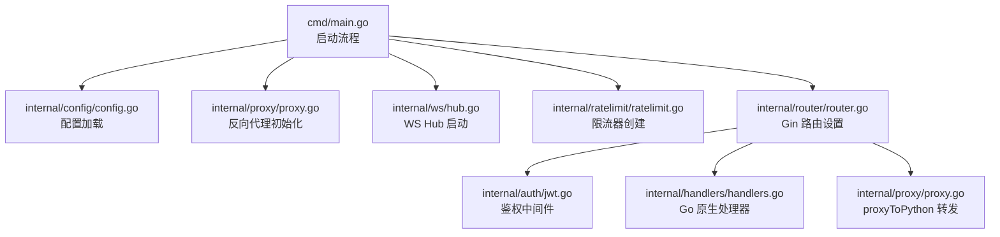
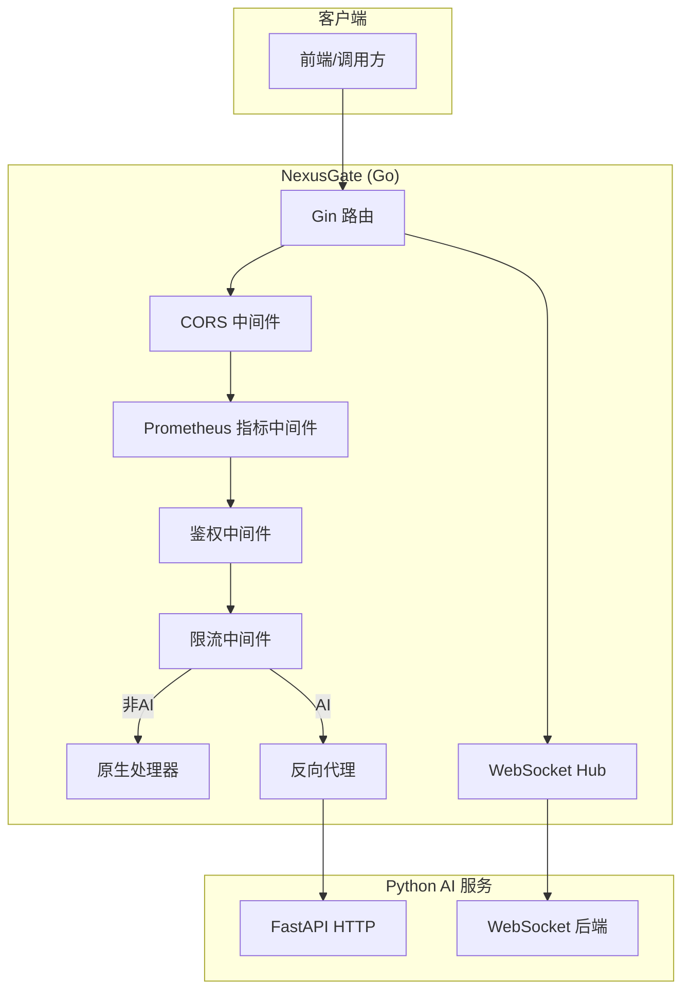
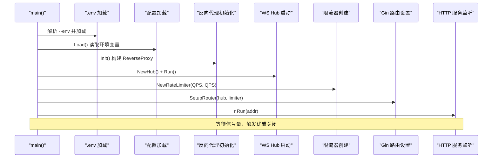
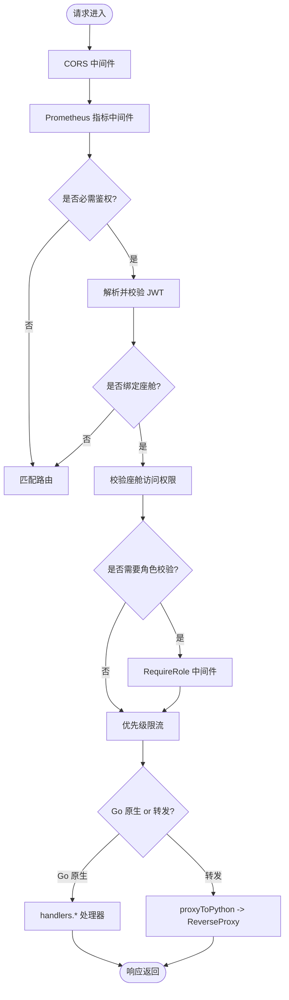
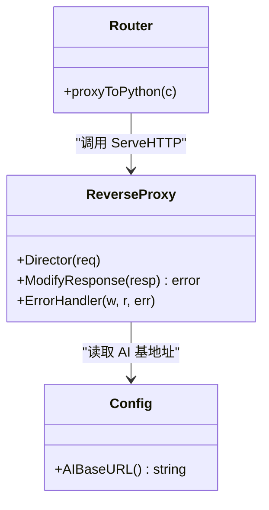
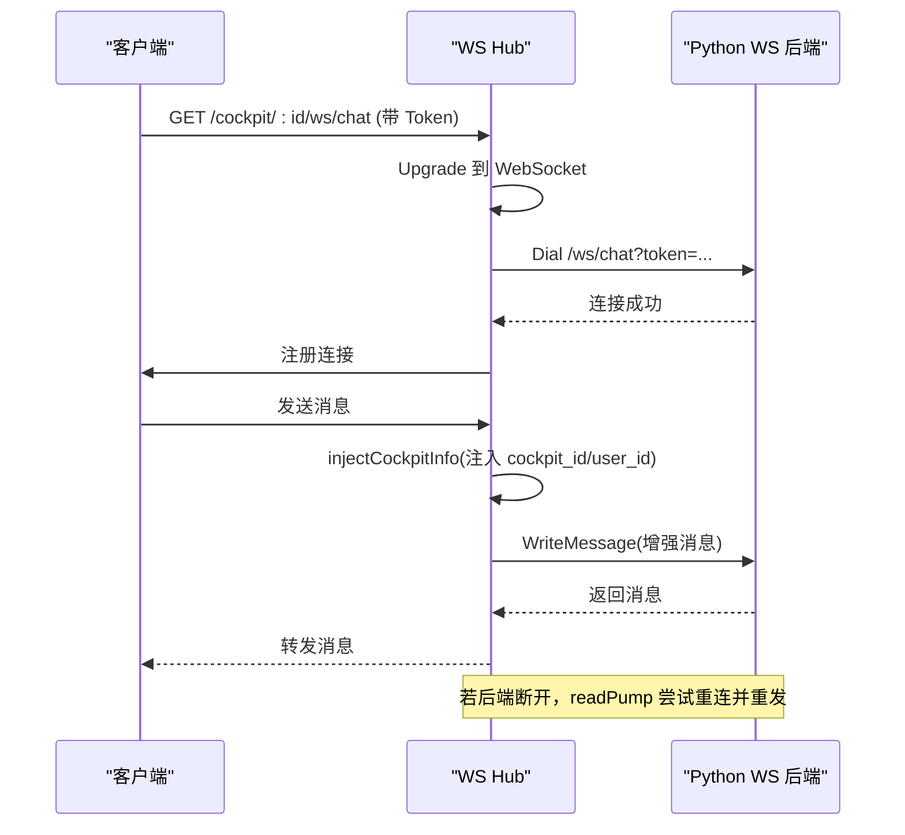
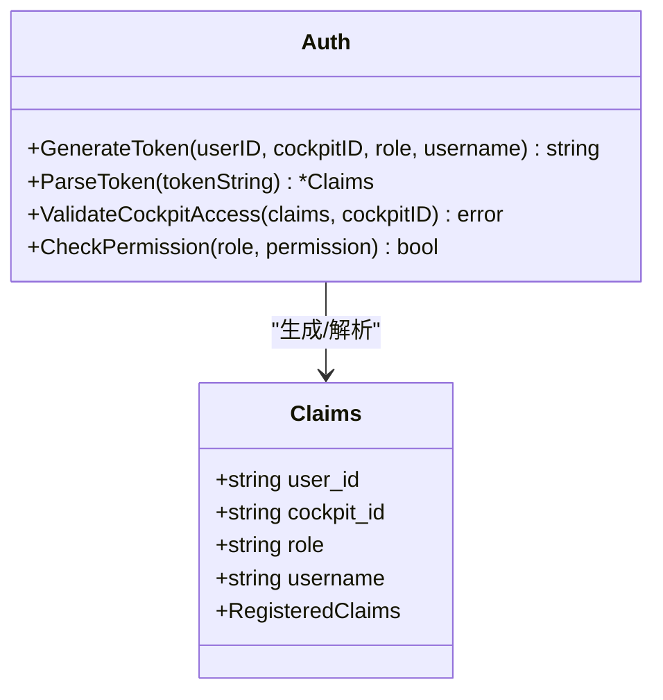
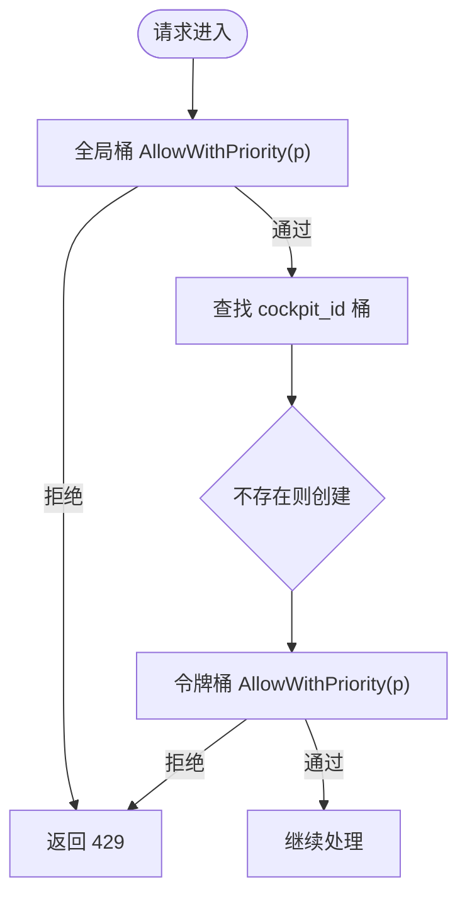
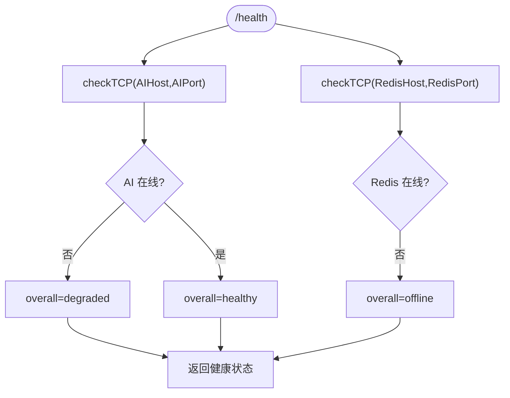
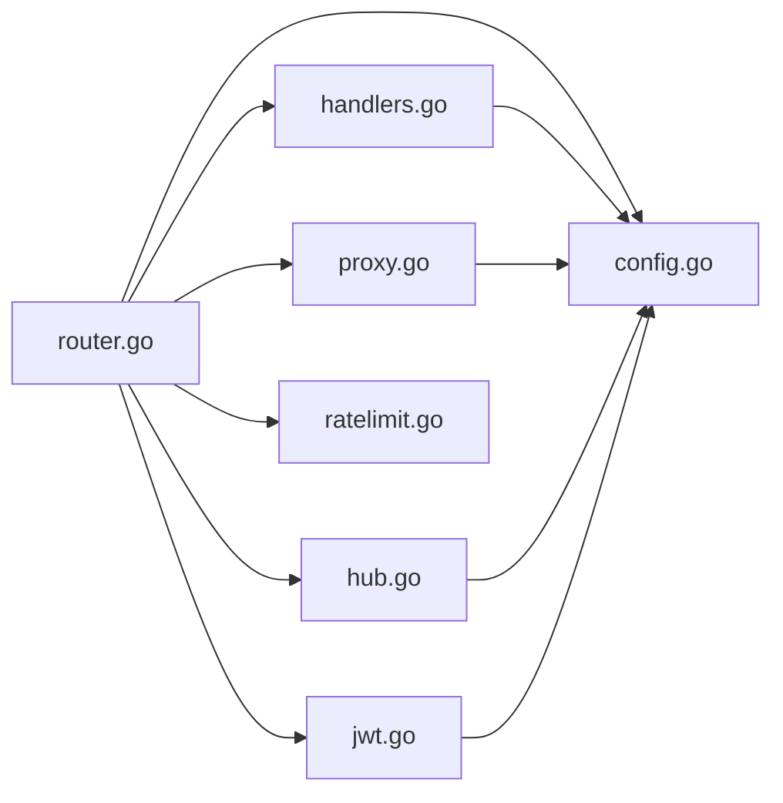

# Go网关核心

<cite>
**本文引用的文件列表**
- [cmd/main.go](file://backend_design/nexus_gate/cmd/main.go)
- [internal/config/config.go](file://backend_design/nexus_gate/internal/config/config.go)
- [internal/router/router.go](file://backend_design/nexus_gate/internal/router/router.go)
- [internal/proxy/proxy.go](file://backend_design/nexus_gate/internal/proxy/proxy.go)
- [internal/auth/jwt.go](file://backend_design/nexus_gate/internal/auth/jwt.go)
- [internal/ratelimit/ratelimit.go](file://backend_design/nexus_gate/internal/ratelimit/ratelimit.go)
- [internal/ws/hub.go](file://backend_design/nexus_gate/internal/ws/hub.go)
- [internal/handlers/handlers.go](file://backend_design/nexus_gate/internal/handlers/handlers.go)
</cite>

## 目录
1. [简介](#简介)
2. [项目结构](#项目结构)
3. [核心组件](#核心组件)
4. [架构总览](#架构总览)
5. [详细组件分析](#详细组件分析)
6. [依赖关系分析](#依赖关系分析)
7. [性能考量](#性能考量)
8. [故障排查指南](#故障排查指南)
9. [结论](#结论)

## 简介
本技术文档聚焦于 NexusGate（Go 并发网关）的架构与实现，涵盖高并发 HTTP 服务器、请求路由机制、反向代理配置、启动流程、Gin 中间件链式处理、WebSocket Hub 管理、限流策略与 Prometheus 指标采集等。目标是帮助读者快速理解并掌握该网关的核心设计思想与落地细节。

## 项目结构
NexusGate 采用按功能域划分的包组织方式：
- cmd：应用入口与启动流程
- internal/config：配置加载与环境变量解析
- internal/router：Gin 路由注册与中间件编排
- internal/proxy：反向代理到 Python AI 服务
- internal/auth：JWT 签发/校验与 RBAC 权限控制
- internal/ratelimit：优先级令牌桶限流器
- internal/ws：WebSocket Hub 连接管理与消息转发
- internal/handlers：Go 原生处理的非 AI 接口（健康检查、中间件状态、数据中台概览等）

图表来源
- [cmd/main.go:30-87](file://backend_design/nexus_gate/cmd/main.go#L30-L87)
- [internal/config/config.go:63-102](file://backend_design/nexus_gate/internal/config/config.go#L63-L102)
- [internal/proxy/proxy.go:24-52](file://backend_design/nexus_gate/internal/proxy/proxy.go#L24-L52)
- [internal/ws/hub.go:54-108](file://backend_design/nexus_gate/internal/ws/hub.go#L54-L108)
- [internal/ratelimit/ratelimit.go:120-128](file://backend_design/nexus_gate/internal/ratelimit/ratelimit.go#L120-L128)
- [internal/router/router.go:56-199](file://backend_design/nexus_gate/internal/router/router.go#L56-L199)

章节来源
- [cmd/main.go:30-87](file://backend_design/nexus_gate/cmd/main.go#L30-L87)
- [internal/config/config.go:63-102](file://backend_design/nexus_gate/internal/config/config.go#L63-L102)
- [internal/router/router.go:56-199](file://backend_design/nexus_gate/internal/router/router.go#L56-L199)
- [internal/proxy/proxy.go:24-52](file://backend_design/nexus_gate/internal/proxy/proxy.go#L24-L52)
- [internal/ws/hub.go:54-108](file://backend_design/nexus_gate/internal/ws/hub.go#L54-L108)
- [internal/ratelimit/ratelimit.go:120-128](file://backend_design/nexus_gate/internal/ratelimit/ratelimit.go#L120-L128)
- [internal/handlers/handlers.go:98-206](file://backend_design/nexus_gate/internal/handlers/handlers.go#L98-L206)

## 核心组件
- 启动流程与生命周期管理：命令行参数解析、.env 加载、配置读取、反向代理初始化、WS Hub 后台运行、限流器创建、Gin 路由设置、HTTP 服务监听与优雅关闭。
- 配置系统：从环境变量或 .env 文件加载，提供默认值与便捷方法（如 AI 基地址拼接）。
- 路由与中间件：CORS、Prometheus 指标、可选/强制鉴权、角色校验、优先级限流、路径级转发。
- 反向代理：基于标准库 httputil.ReverseProxy，注入上游头、统一错误响应。
- 鉴权与授权：JWT 签发与校验、座舱访问校验、RBAC 角色权限映射。
- 限流器：每座舱独立令牌桶 + 全局限流，支持高/普通/低三级优先级配额。
- WebSocket Hub：连接注册/注销、广播、后端连接转发、心跳保活、自动重连。
- 原生处理器：健康检查、中间件连通性探测、数据中台概览与告警、座舱列表。

章节来源
- [cmd/main.go:30-87](file://backend_design/nexus_gate/cmd/main.go#L30-L87)
- [internal/config/config.go:63-102](file://backend_design/nexus_gate/internal/config/config.go#L63-L102)
- [internal/router/router.go:56-199](file://backend_design/nexus_gate/internal/router/router.go#L56-L199)
- [internal/proxy/proxy.go:24-52](file://backend_design/nexus_gate/internal/proxy/proxy.go#L24-L52)
- [internal/auth/jwt.go:28-85](file://backend_design/nexus_gate/internal/auth/jwt.go#L28-L85)
- [internal/ratelimit/ratelimit.go:120-178](file://backend_design/nexus_gate/internal/ratelimit/ratelimit.go#L120-L178)
- [internal/ws/hub.go:137-177](file://backend_design/nexus_gate/internal/ws/hub.go#L137-L177)
- [internal/handlers/handlers.go:444-481](file://backend_design/nexus_gate/internal/handlers/handlers.go#L444-L481)

## 架构总览
NexusGate 作为前置网关，承担以下职责：
- 统一入口：对外暴露 HTTP 与 WebSocket 端点
- 鉴权与限流：JWT 鉴权、座舱级优先级限流
- 路由分发：非 AI 请求由 Go 原生处理；AI 相关请求反向代理至 Python FastAPI
- 可观测性：Prometheus 指标采集、健康检查与中间件状态探测
- 实时通信：WebSocket Hub 管理多路连接，透传至 Python AI 后端

图表来源
- [internal/router/router.go:56-199](file://backend_design/nexus_gate/internal/router/router.go#L56-L199)
- [internal/proxy/proxy.go:24-52](file://backend_design/nexus_gate/internal/proxy/proxy.go#L24-L52)
- [internal/ws/hub.go:137-177](file://backend_design/nexus_gate/internal/ws/hub.go#L137-L177)
- [internal/handlers/handlers.go:444-481](file://backend_design/nexus_gate/internal/handlers/handlers.go#L444-L481)

## 详细组件分析

### 启动流程与生命周期
- 命令行参数：--env 指定 .env 文件路径
- .env 加载：逐行解析 KEY=VALUE，支持引号包裹值，写入进程环境变量
- 配置加载：从环境变量读取各项配置，提供默认值与便捷方法
- 反向代理初始化：根据配置构建目标地址，设置 Director 与 ErrorHandler
- WS Hub 启动：后台协程运行，负责连接注册/注销与广播
- 限流器创建：容量与速率来自配置，支持全局与座舱级限流
- Gin 路由设置：注册中间件链与各路由组
- HTTP 服务监听：在 goroutine 中启动，主协程等待 SIGINT/SIGTERM 信号后退出

图表来源
- [cmd/main.go:30-87](file://backend_design/nexus_gate/cmd/main.go#L30-L87)
- [internal/config/config.go:63-102](file://backend_design/nexus_gate/internal/config/config.go#L63-L102)
- [internal/proxy/proxy.go:24-52](file://backend_design/nexus_gate/internal/proxy/proxy.go#L24-L52)
- [internal/ws/hub.go:54-108](file://backend_design/nexus_gate/internal/ws/hub.go#L54-L108)
- [internal/ratelimit/ratelimit.go:120-128](file://backend_design/nexus_gate/internal/ratelimit/ratelimit.go#L120-L128)
- [internal/router/router.go:56-199](file://backend_design/nexus_gate/internal/router/router.go#L56-L199)

章节来源
- [cmd/main.go:30-87](file://backend_design/nexus_gate/cmd/main.go#L30-L87)
- [internal/config/config.go:63-102](file://backend_design/nexus_gate/internal/config/config.go#L63-L102)

### Gin 路由与中间件链式处理
- 模式选择：根据 GateMode 切换 Release/Debug 模式
- CORS 中间件：动态设置允许来源与方法，OPTIONS 直接返回 204
- Prometheus 中间件：记录请求总数、耗时直方图，标签包含 method/path/status/cockpit_id
- 鉴权中间件：
  - AuthMiddleware：必须携带有效 Token，校验座舱访问权限，将 claims 注入上下文
  - OptionalAuthMiddleware：无 Token 时降级为匿名用户，便于查看类接口
- 角色校验中间件：RequireRole 限制特定角色访问
- 限流中间件：根据路径推断优先级，结合座舱 ID 进行令牌桶判断
- 路由分组：
  - /metrics：Prometheus 指标端点
  - /health：增强版健康检查
  - /auth/token：Token 签发
  - /dataplatform/*：部分 Go 原生处理，部分转发 Python
  - /middleware/*：中间件连通性检查
  - /settings/*：受保护的管理接口，写操作需管理员角色
  - /cockpit/:cockpit_id/*：需要 JWT 鉴权与限流，AI 相关接口转发 Python
  - /cockpit/:cockpit_id/ws/chat：WebSocket 会话
  - /dataplatform/ws/realtime：数据中台实时推送

图表来源
- [internal/router/router.go:56-199](file://backend_design/nexus_gate/internal/router/router.go#L56-L199)
- [internal/auth/jwt.go:49-85](file://backend_design/nexus_gate/internal/auth/jwt.go#L49-L85)
- [internal/ratelimit/ratelimit.go:135-157](file://backend_design/nexus_gate/internal/ratelimit/ratelimit.go#L135-L157)
- [internal/proxy/proxy.go:24-52](file://backend_design/nexus_gate/internal/proxy/proxy.go#L24-L52)
- [internal/handlers/handlers.go:98-206](file://backend_design/nexus_gate/internal/handlers/handlers.go#L98-L206)

章节来源
- [internal/router/router.go:56-199](file://backend_design/nexus_gate/internal/router/router.go#L56-L199)
- [internal/auth/jwt.go:49-85](file://backend_design/nexus_gate/internal/auth/jwt.go#L49-L85)
- [internal/ratelimit/ratelimit.go:135-157](file://backend_design/nexus_gate/internal/ratelimit/ratelimit.go#L135-L157)
- [internal/proxy/proxy.go:24-52](file://backend_design/nexus_gate/internal/proxy/proxy.go#L24-L52)
- [internal/handlers/handlers.go:98-206](file://backend_design/nexus_gate/internal/handlers/handlers.go#L98-L206)

### 反向代理实现原理
- 目标地址：从配置获取 AIHost/AIPort，拼接为 http://host:port
- Director 定制：保留原始 Host，注入 X-Forwarded-By/X-Forwarded-Host 等标识头
- ModifyResponse：为响应添加 X-Served-By 标记
- ErrorHandler：当 Python 服务不可用时返回 502 与统一 JSON 错误体
- 请求头注入：在 proxyToPython 中将 cockpit_id/user_id/role 注入到上游请求头

图表来源
- [internal/proxy/proxy.go:24-52](file://backend_design/nexus_gate/internal/proxy/proxy.go#L24-L52)
- [internal/router/router.go:202-236](file://backend_design/nexus_gate/internal/router/router.go#L202-L236)
- [internal/config/config.go:99-102](file://backend_design/nexus_gate/internal/config/config.go#L99-L102)

章节来源
- [internal/proxy/proxy.go:24-52](file://backend_design/nexus_gate/internal/proxy/proxy.go#L24-L52)
- [internal/router/router.go:202-236](file://backend_design/nexus_gate/internal/router/router.go#L202-L236)
- [internal/config/config.go:99-102](file://backend_design/nexus_gate/internal/config/config.go#L99-L102)

### WebSocket Hub 与消息转发
- 连接升级：使用 upgrader 完成 HTTP→WS 升级
- 认证传递：从 Authorization 头或 query token 提取 JWT，用于连接 Python 后端
- 后端连接：Dialer 建立到 Python /ws/chat?token=... 的连接，握手超时 5s
- 读写泵：
  - writePump：定时 Ping 保活，发送队列满则关闭连接
  - readPump：读取客户端消息，注入 cockpit_id/user_id 后转发后端；失败时尝试重连
  - backendReadPump：读取后端消息并回传给客户端
- Hub 管理：register/unregister/broadcast 通道驱动，按 cockpit_id 维度维护连接集合

图表来源
- [internal/ws/hub.go:137-177](file://backend_design/nexus_gate/internal/ws/hub.go#L137-L177)
- [internal/ws/hub.go:205-232](file://backend_design/nexus_gate/internal/ws/hub.go#L205-L232)
- [internal/ws/hub.go:260-310](file://backend_design/nexus_gate/internal/ws/hub.go#L260-L310)
- [internal/ws/hub.go:312-336](file://backend_design/nexus_gate/internal/ws/hub.go#L312-L336)

章节来源
- [internal/ws/hub.go:137-177](file://backend_design/nexus_gate/internal/ws/hub.go#L137-L177)
- [internal/ws/hub.go:205-232](file://backend_design/nexus_gate/internal/ws/hub.go#L205-L232)
- [internal/ws/hub.go:260-310](file://backend_design/nexus_gate/internal/ws/hub.go#L260-L310)
- [internal/ws/hub.go:312-336](file://backend_design/nexus_gate/internal/ws/hub.go#L312-L336)

### 鉴权与授权（JWT + RBAC）
- Claims 结构：包含 user_id、cockpit_id、role、username 及标准过期时间
- 签发：HS256 签名，过期时间由配置决定
- 校验：去除 Bearer 前缀，验证签名与有效期，返回 Claims
- 座舱访问校验：super_admin 可访问所有座舱，其他用户仅能访问绑定的 cockpit_id
- 角色权限映射：不同角色拥有不同权限集，供后续扩展细粒度控制

图表来源
- [internal/auth/jwt.go:19-85](file://backend_design/nexus_gate/internal/auth/jwt.go#L19-L85)

章节来源
- [internal/auth/jwt.go:19-85](file://backend_design/nexus_gate/internal/auth/jwt.go#L19-L85)
- [internal/router/router.go:290-386](file://backend_design/nexus_gate/internal/router/router.go#L290-L386)

### 优先级令牌桶限流
- 优先级定义：高（车控/ASR/TTS）、普通（对话）、低（状态查询）
- 配额策略：高可用全部令牌，普通最多 80%，低最多 50%
- 限流器结构：每个座舱一个令牌桶，另有一个全局桶（容量与速率为座舱上限×3）
- 决策流程：先过全局桶，再查对应座舱桶，按优先级阈值判断是否放行

图表来源
- [internal/ratelimit/ratelimit.go:120-178](file://backend_design/nexus_gate/internal/ratelimit/ratelimit.go#L120-L178)
- [internal/router/router.go:388-424](file://backend_design/nexus_gate/internal/router/router.go#L388-L424)

章节来源
- [internal/ratelimit/ratelimit.go:120-178](file://backend_design/nexus_gate/internal/ratelimit/ratelimit.go#L120-L178)
- [internal/router/router.go:388-424](file://backend_design/nexus_gate/internal/router/router.go#L388-L424)

### 原生处理器与健康检查
- 健康检查：探测 Python AI 与 Redis 连通性，返回整体健康状态（healthy/degraded/offline）
- 中间件状态：TCP 拨号检测 Redis/MySQL/Milvus/Neo4j/RabbitMQ 端口连通性与延迟
- 数据中台概览：聚合各座舱统计（聊天数、车控指令数、缓存命中率、平均延迟、告警数）
- 座舱列表：按配置生成默认座舱元信息

图表来源
- [internal/handlers/handlers.go:444-481](file://backend_design/nexus_gate/internal/handlers/handlers.go#L444-L481)
- [internal/handlers/handlers.go:98-206](file://backend_design/nexus_gate/internal/handlers/handlers.go#L98-L206)

章节来源
- [internal/handlers/handlers.go:444-481](file://backend_design/nexus_gate/internal/handlers/handlers.go#L444-L481)
- [internal/handlers/handlers.go:98-206](file://backend_design/nexus_gate/internal/handlers/handlers.go#L98-L206)

## 依赖关系分析
- 模块耦合：
  - router 依赖 config、auth、handlers、proxy、ratelimit、ws
  - handlers 依赖 config
  - proxy 依赖 config
  - ws 依赖 config
  - auth 依赖 config
  - ratelimit 自包含
- 外部依赖：
  - Gin 框架（HTTP 路由与中间件）
  - Gorilla WebSocket（WS 连接）
  - Prometheus client（指标采集）
  - golang-jwt（JWT 签发与校验）
  - net/http/httputil（反向代理）

图表来源
- [internal/router/router.go:12-28](file://backend_design/nexus_gate/internal/router/router.go#L12-L28)
- [internal/handlers/handlers.go:20-32](file://backend_design/nexus_gate/internal/handlers/handlers.go#L20-32)
- [internal/proxy/proxy.go:13-19](file://backend_design/nexus_gate/internal/proxy/proxy.go#L13-19)
- [internal/ws/hub.go:8-19](file://backend_design/nexus_gate/internal/ws/hub.go#L8-19)
- [internal/auth/jwt.go:8-17](file://backend_design/nexus_gate/internal/auth/jwt.go#L8-17)

章节来源
- [internal/router/router.go:12-28](file://backend_design/nexus_gate/internal/router/router.go#L12-L28)
- [internal/handlers/handlers.go:20-32](file://backend_design/nexus_gate/internal/handlers/handlers.go#L20-32)
- [internal/proxy/proxy.go:13-19](file://backend_design/nexus_gate/internal/proxy/proxy.go#L13-19)
- [internal/ws/hub.go:8-19](file://backend_design/nexus_gate/internal/ws/hub.go#L8-19)
- [internal/auth/jwt.go:8-17](file://backend_design/nexus_gate/internal/auth/jwt.go#L8-17)

## 性能考量
- 高并发模型：Goroutine-per-request + 非阻塞通道（WS Hub），避免锁竞争热点
- 指标采样：Prometheus Histogram 使用默认分桶，注意 path 基数控制（已截断 FullPath）
- 限流策略：优先级配额保障关键路径吞吐，全局桶防止雪崩
- 反向代理：单主机代理，减少连接复用开销；建议在生产环境启用 HTTP Keep-Alive 与连接池优化
- WebSocket：
  - 读/写超时与写死线降低资源占用
  - 发送缓冲满时主动关闭连接，避免内存泄漏
  - 后端断线自动重连，提升可用性
- 健康检查：TCP 拨号超时固定 3s，避免长时间阻塞

[本节为通用性能指导，不直接分析具体文件]

## 故障排查指南
- 启动阶段
  - 确认 --env 路径正确且 .env 格式合法（KEY=VALUE，支持引号）
  - 检查环境变量是否覆盖默认值（如 NEXUS_GATE_PORT、NEXUS_AI_HOST、NEXUS_AI_PORT）
- 鉴权问题
  - 401 MISSING_TOKEN：未携带 Authorization 头
  - 401 INVALID_TOKEN：签名错误或过期
  - 403 ACCESS_DENIED：用户无权访问目标 cockpit_id
- 限流问题
  - 429 RATE_LIMITED：超过优先级配额，检查 QPS 配置与路径优先级
- 反向代理异常
  - 502 AI_SERVICE_UNAVAILABLE：Python 服务不可用或网络不通
  - 检查 Director 注入的头是否正确（X-Cockpit-Id、X-User-Id、X-User-Role）
- WebSocket 异常
  - 连接失败：检查 Python WS 端点与 token 传递
  - 频繁断开：关注 writePump 的写死线与 send 缓冲溢出日志
- 健康与中间件状态
  - /health 返回 degraded/offline：检查 Python AI 与 Redis 连通性
  - /middleware/* 显示 offline：核对各中间件主机与端口配置

章节来源
- [internal/router/router.go:290-386](file://backend_design/nexus_gate/internal/router/router.go#L290-L386)
- [internal/proxy/proxy.go:46-52](file://backend_design/nexus_gate/internal/proxy/proxy.go#L46-L52)
- [internal/ws/hub.go:180-203](file://backend_design/nexus_gate/internal/ws/hub.go#L180-L203)
- [internal/handlers/handlers.go:444-481](file://backend_design/nexus_gate/internal/handlers/handlers.go#L444-L481)

## 结论
NexusGate 以 Go 的高并发优势为核心，结合 Gin 中间件链、优先级限流与 WebSocket Hub，构建了稳定高效的网关层。其清晰的职责划分与可扩展的中间件体系，使得非 AI 请求在 Go 侧高效处理，AI 相关请求平滑转发至 Python 后端。配合 Prometheus 指标与健康检查，可实现生产环境的可观测性与稳定性保障。