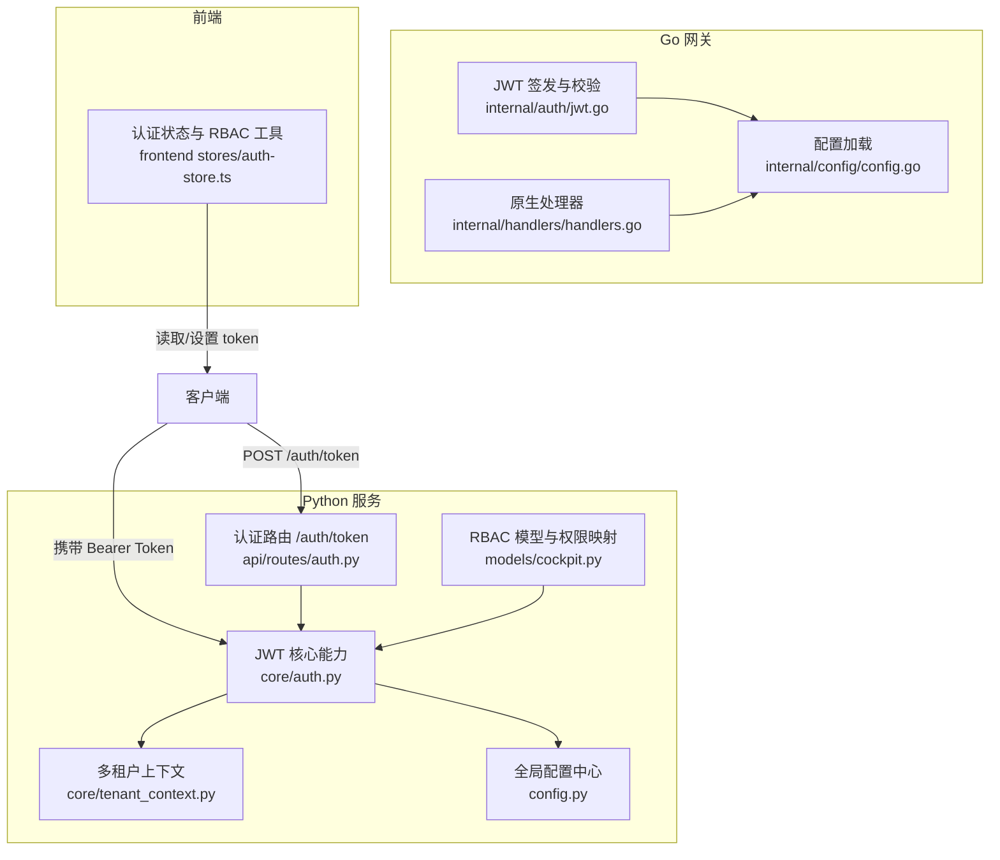
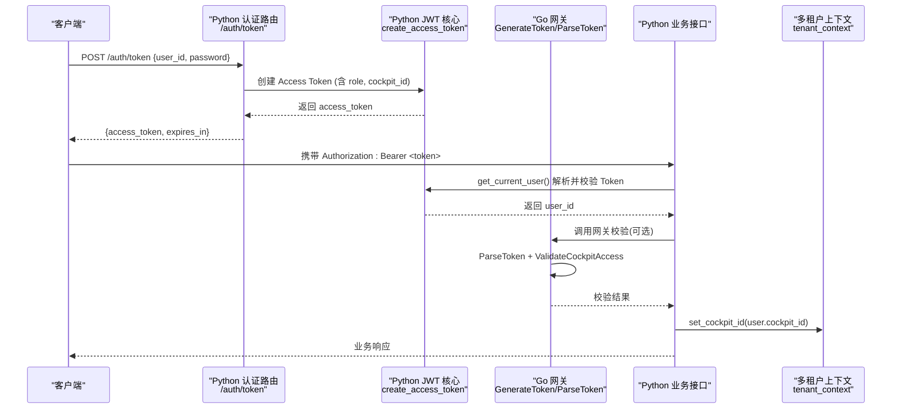
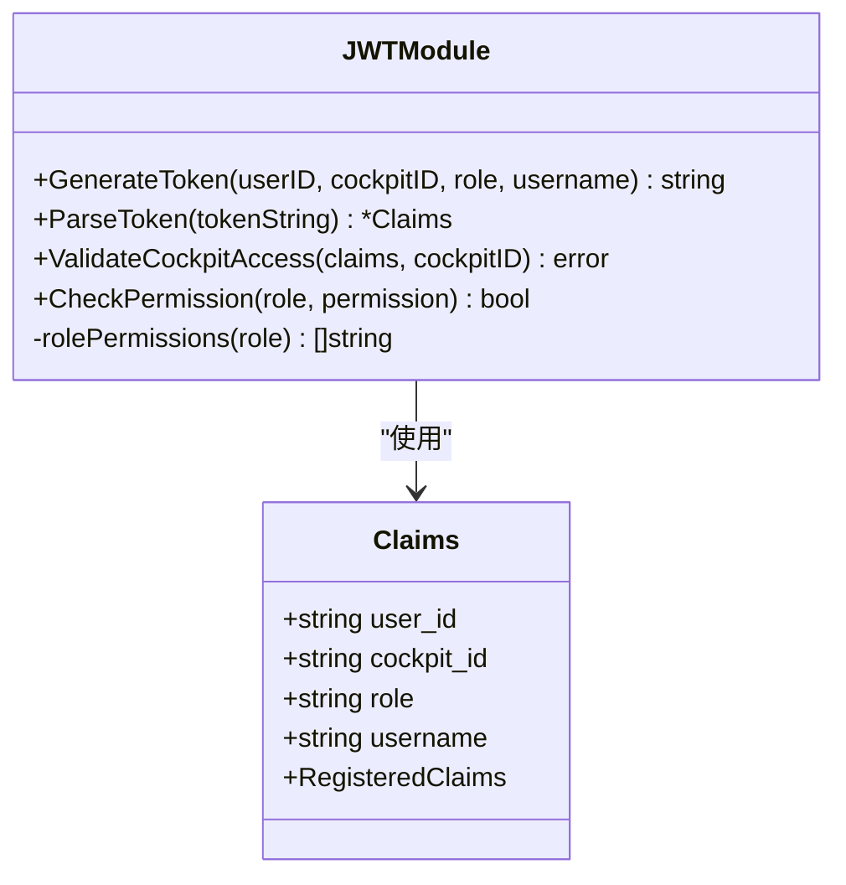
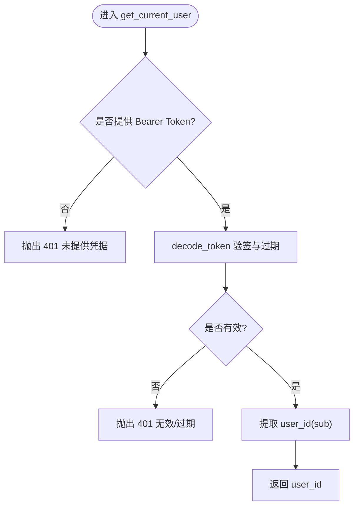
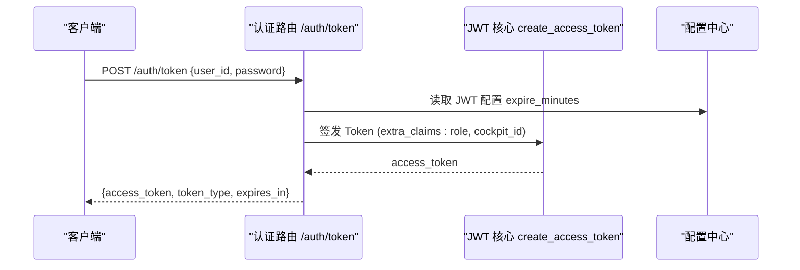
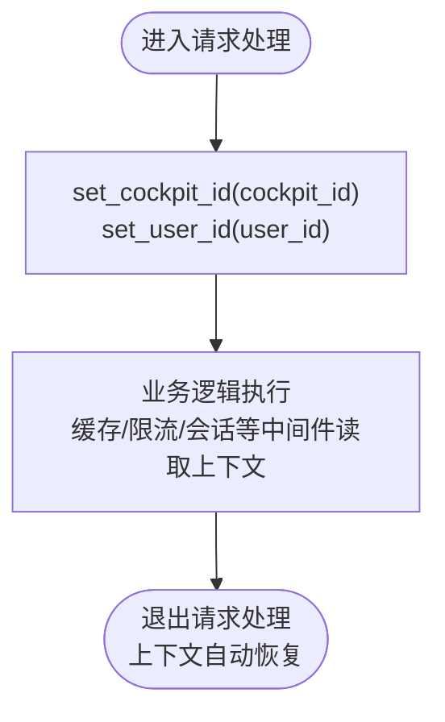
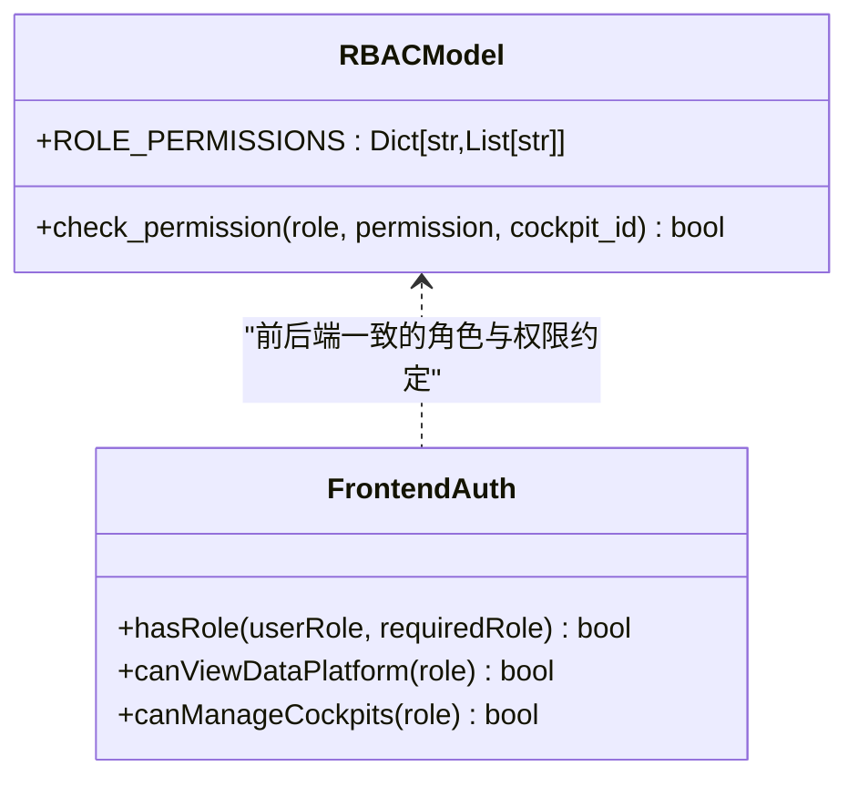
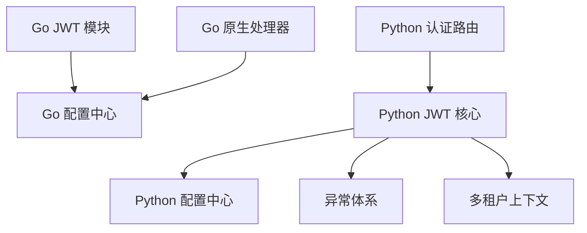

# JWT鉴权机制

<cite>
**本文引用的文件**   
- [jwt.go](file://backend_design/nexus_gate/internal/auth/jwt.go)
- [auth.py](file://backend_design/nexus/api/routes/auth.py)
- [auth.py（核心）](file://backend_design/nexus/core/auth.py)
- [tenant_context.py](file://backend_design/nexus/core/tenant_context.py)
- [config.py](file://backend_design/nexus/config.py)
- [config.go](file://backend_design/nexus_gate/internal/config/config.go)
- [handlers.go](file://backend_design/nexus_gate/internal/handlers/handlers.go)
- [cockpit.py](file://backend_design/nexus/models/cockpit.py)
- [schemas.py](file://backend_design/nexus/models/schemas.py)
- [auth-store.ts](file://frontend_design/src/stores/auth-store.ts)
</cite>

## 目录
1. [简介](#简介)
2. [项目结构](#项目结构)
3. [核心组件](#核心组件)
4. [架构总览](#架构总览)
5. [详细组件分析](#详细组件分析)
6. [依赖关系分析](#依赖关系分析)
7. [性能与可扩展性](#性能与可扩展性)
8. [故障排查指南](#故障排查指南)
9. [结论](#结论)
10. [附录](#附录)

## 简介
本技术文档围绕 NexusCockpit 的 JWT 鉴权机制，系统性说明令牌的签发、解析与校验流程；深入解释 cockpit_id 的座舱级权限控制与多租户隔离；描述令牌生命周期管理（过期时间、刷新策略、黑名单处理现状与建议）；阐述鉴权中间件在请求拦截、权限验证与错误处理方面的实现；并给出安全最佳实践与常见漏洞防护方案。

## 项目结构
本项目采用“Go 网关 + Python AI 服务”的双语言架构：
- Go 网关负责非 AI 请求的原生处理、健康检查、数据中台统计、以及 JWT 签发与 RBAC 校验。
- Python 服务提供 AI 相关接口，并在 FastAPI 层通过依赖注入完成 Bearer Token 校验与用户上下文提取。

图表来源
- [jwt.go:1-125](file://backend_design/nexus_gate/internal/auth/jwt.go#L1-L125)
- [config.go:1-131](file://backend_design/nexus_gate/internal/config/config.go#L1-L131)
- [handlers.go:1-531](file://backend_design/nexus_gate/internal/handlers/handlers.go#L1-L531)
- [auth.py:1-109](file://backend_design/nexus/api/routes/auth.py#L1-L109)
- [auth.py（核心）:1-141](file://backend_design/nexus/core/auth.py#L1-L141)
- [tenant_context.py:1-106](file://backend_design/nexus/core/tenant_context.py#L1-L106)
- [config.py:277-293](file://backend_design/nexus/config.py#L277-L293)
- [cockpit.py:169-215](file://backend_design/nexus/models/cockpit.py#L169-L215)
- [auth-store.ts:1-222](file://frontend_design/src/stores/auth-store.ts#L1-L222)

章节来源
- [jwt.go:1-125](file://backend_design/nexus_gate/internal/auth/jwt.go#L1-L125)
- [config.go:1-131](file://backend_design/nexus_gate/internal/config/config.go#L1-L131)
- [handlers.go:1-531](file://backend_design/nexus_gate/internal/handlers/handlers.go#L1-L531)
- [auth.py:1-109](file://backend_design/nexus/api/routes/auth.py#L1-L109)
- [auth.py（核心）:1-141](file://backend_design/nexus/core/auth.py#L1-L141)
- [tenant_context.py:1-106](file://backend_design/nexus/core/tenant_context.py#L1-L106)
- [config.py:277-293](file://backend_design/nexus/config.py#L277-L293)
- [cockpit.py:169-215](file://backend_design/nexus/models/cockpit.py#L169-L215)
- [auth-store.ts:1-222](file://frontend_design/src/stores/auth-store.ts#L1-L222)

## 核心组件
- Go 网关侧 JWT 能力
  - Claims 载荷包含 user_id、cockpit_id、role、username 及标准注册声明。
  - GenerateToken 使用 HS256 签名，签发时写入 issuer、issued_at、expires_at。
  - ParseToken 支持去除 Bearer 前缀、算法白名单校验、密钥从配置读取。
  - ValidateCockpitAccess 实现座舱级访问控制：super_admin 可跨座舱，其他角色仅能访问绑定座舱。
  - CheckPermission 基于角色到权限集合的映射进行细粒度权限判断。

- Python 服务侧 JWT 能力
  - create_access_token 生成 Access Token，支持自定义过期时长与额外 claims（如 role、cockpit_id）。
  - decode_token 解码并校验签名与过期时间，抛出统一 AuthError。
  - get_current_user 作为 FastAPI 依赖，自动从 Authorization 头提取 Bearer Token 并返回 user_id。
  - get_optional_user 用于可选认证的接口场景。

- 多租户上下文
  - 使用 contextvars 在协程级别传递 cockpit_id 与 user_id，为缓存、限流等中间件提供隔离键前缀。

- 配置中心
  - Python 侧 JWTConfig 定义 secret_key、algorithm、expire_minutes。
  - Go 侧 Config 定义 JWTSecret、JWTExpireHours 等。

- RBAC 模型
  - 角色与权限映射集中维护，支持 :own 变体权限语义。

章节来源
- [jwt.go:19-125](file://backend_design/nexus_gate/internal/auth/jwt.go#L19-L125)
- [auth.py（核心）:36-141](file://backend_design/nexus/core/auth.py#L36-L141)
- [tenant_context.py:1-106](file://backend_design/nexus/core/tenant_context.py#L1-L106)
- [config.py:277-293](file://backend_design/nexus/config.py#L277-L293)
- [config.go:17-89](file://backend_design/nexus_gate/internal/config/config.go#L17-L89)
- [cockpit.py:169-215](file://backend_design/nexus/models/cockpit.py#L169-L215)

## 架构总览
下图展示从登录到受保护资源访问的端到端流程，包括 Go 网关与 Python 服务的协作、JWT 签发与校验、以及 cockpit_id 的权限控制。

图表来源
- [auth.py:46-75](file://backend_design/nexus/api/routes/auth.py#L46-L75)
- [auth.py（核心）:36-123](file://backend_design/nexus/core/auth.py#L36-L123)
- [jwt.go:28-85](file://backend_design/nexus_gate/internal/auth/jwt.go#L28-L85)
- [tenant_context.py:29-44](file://backend_design/nexus/core/tenant_context.py#L29-L44)

## 详细组件分析

### 组件A：Go 网关 JWT 模块
- 职责
  - 签发：GenerateToken 根据配置生成 HS256 签名的 JWT，写入标准声明与业务字段。
  - 解析：ParseToken 去除 Bearer 前缀、校验算法、使用配置的密钥验签。
  - 座舱访问控制：ValidateCockpitAccess 限制非 super_admin 访问其未绑定的座舱。
  - 权限检查：CheckPermission 基于角色到权限列表的映射进行判定。

- 数据结构与复杂度
  - Claims 结构体包含基础信息与 RegisteredClaims，解析与序列化开销低。
  - 权限匹配为线性扫描，角色数量与权限规模较小时性能可接受。

- 依赖链
  - 依赖配置中心获取 JWTSecret、JWTExpireHours。
  - 被网关路由或业务处理器调用以完成鉴权。

图表来源
- [jwt.go:19-125](file://backend_design/nexus_gate/internal/auth/jwt.go#L19-L125)

章节来源
- [jwt.go:19-125](file://backend_design/nexus_gate/internal/auth/jwt.go#L19-L125)

### 组件B：Python 服务 JWT 核心
- 职责
  - create_access_token：按配置生成 Access Token，支持 extra_claims 注入 role、cockpit_id。
  - decode_token：验签与过期校验，异常转换为 AuthError。
  - get_current_user：FastAPI 依赖，自动从 Authorization 头提取并校验 Bearer Token，返回 user_id。
  - get_optional_user：可选认证，失败返回 None。

- 错误处理
  - 将 jwt.ExpiredSignatureError 与 InvalidTokenError 统一封装为 AuthError，便于上层 HTTPException 转换。

图表来源
- [auth.py（核心）:86-123](file://backend_design/nexus/core/auth.py#L86-L123)
- [auth.py（核心）:65-84](file://backend_design/nexus/core/auth.py#L65-L84)

章节来源
- [auth.py（核心）:36-141](file://backend_design/nexus/core/auth.py#L36-L141)

### 组件C：认证路由与响应模型
- 职责
  - /auth/token：接收 user_id 与 password，开发模式直接签发 Token，生产环境应接入数据库校验密码与查询角色。
  - /auth/me：验证当前用户身份。
  - /auth/change-password：修改密码（开发模式直接成功）。

- 响应模型
  - TokenResponse 包含 access_token、token_type、expires_in。

图表来源
- [auth.py:46-75](file://backend_design/nexus/api/routes/auth.py#L46-L75)
- [auth.py（核心）:36-62](file://backend_design/nexus/core/auth.py#L36-L62)
- [config.py:277-293](file://backend_design/nexus/config.py#L277-L293)

章节来源
- [auth.py:1-109](file://backend_design/nexus/api/routes/auth.py#L1-L109)
- [schemas.py:1-88](file://backend_design/nexus/models/schemas.py#L1-L88)

### 组件D：多租户上下文与 cockpit_id 隔离
- 设计要点
  - 使用 contextvars 在协程级别保存 cockpit_id 与 user_id，确保异步并发安全。
  - CockpitContext 提供 with/async with 作用域式设置与恢复。
  - get_cache_prefix 生成 Redis key 前缀，配合缓存中间件实现座舱级隔离。

- 典型用法
  - 在鉴权后设置 cockpit_id，后续所有中间件与业务逻辑均可通过 get_cockpit_id() 获取当前上下文。

图表来源
- [tenant_context.py:29-44](file://backend_design/nexus/core/tenant_context.py#L29-L44)
- [tenant_context.py:74-106](file://backend_design/nexus/core/tenant_context.py#L74-L106)

章节来源
- [tenant_context.py:1-106](file://backend_design/nexus/core/tenant_context.py#L1-L106)

### 组件E：RBAC 权限模型与前端权限工具
- 后端 RBAC
  - ROLE_PERMISSIONS 集中定义角色到权限集合的映射，check_permission 支持 :own 变体。
- 前端权限工具
  - hasRole、canViewDataPlatform、canManageCockpits 等函数基于角色层级进行 UI 与操作控制。

图表来源
- [cockpit.py:169-215](file://backend_design/nexus/models/cockpit.py#L169-L215)
- [auth-store.ts:186-222](file://frontend_design/src/stores/auth-store.ts#L186-L222)

章节来源
- [cockpit.py:169-215](file://backend_design/nexus/models/cockpit.py#L169-L215)
- [auth-store.ts:1-222](file://frontend_design/src/stores/auth-store.ts#L1-L222)

## 依赖关系分析
- Go 网关
  - JWT 模块依赖配置中心读取 JWTSecret、JWTExpireHours。
  - 原生处理器依赖配置中心获取中间件地址与端口，进行健康检查与数据聚合。

- Python 服务
  - 认证路由依赖 JWT 核心与配置中心。
  - JWT 核心依赖配置中心与异常体系。
  - 多租户上下文独立于外部依赖，提供协程安全的上下文变量。

图表来源
- [jwt.go:1-125](file://backend_design/nexus_gate/internal/auth/jwt.go#L1-L125)
- [config.go:1-131](file://backend_design/nexus_gate/internal/config/config.go#L1-L131)
- [handlers.go:1-531](file://backend_design/nexus_gate/internal/handlers/handlers.go#L1-L531)
- [auth.py:1-109](file://backend_design/nexus/api/routes/auth.py#L1-L109)
- [auth.py（核心）:1-141](file://backend_design/nexus/core/auth.py#L1-L141)
- [tenant_context.py:1-106](file://backend_design/nexus/core/tenant_context.py#L1-L106)

章节来源
- [jwt.go:1-125](file://backend_design/nexus_gate/internal/auth/jwt.go#L1-L125)
- [config.go:1-131](file://backend_design/nexus_gate/internal/config/config.go#L1-L131)
- [handlers.go:1-531](file://backend_design/nexus_gate/internal/handlers/handlers.go#L1-L531)
- [auth.py:1-109](file://backend_design/nexus/api/routes/auth.py#L1-L109)
- [auth.py（核心）:1-141](file://backend_design/nexus/core/auth.py#L1-L141)
- [tenant_context.py:1-106](file://backend_design/nexus/core/tenant_context.py#L1-L106)

## 性能与可扩展性
- 令牌签发与解析
  - HS256 签名计算开销低，适合高吞吐场景。
  - 建议在生产环境使用强随机密钥，避免弱密钥导致的安全风险。

- 权限校验
  - 角色到权限的线性匹配在小规模下性能良好；若角色与权限规模增长，可考虑索引化或位图优化。

- 多租户隔离
  - 基于 contextvars 的上下文传递无额外 I/O 开销，适合高并发异步场景。
  - 结合 Redis key 前缀实现缓存与限流的座舱级隔离，避免跨租户数据泄漏。

[本节为通用性能讨论，不直接分析具体文件]

## 故障排查指南
- 常见问题
  - 未提供 Bearer Token：get_current_user 会返回 401 并提示在 Authorization 头携带 Bearer Token。
  - Token 无效或过期：decode_token 捕获 jwt 异常并转换为 AuthError，最终由 FastAPI 返回 401。
  - 座舱访问拒绝：ValidateCockpitAccess 在非 super_admin 且 cockpit_id 不匹配时返回错误。

- 定位步骤
  - 确认客户端是否正确设置 Authorization: Bearer <token>。
  - 核对服务端 JWT 配置（secret_key、algorithm、expire_minutes）是否与签发端一致。
  - 检查 cockpit_id 是否与用户绑定一致，必要时调整角色或座舱绑定。

章节来源
- [auth.py（核心）:86-123](file://backend_design/nexus/core/auth.py#L86-L123)
- [jwt.go:49-85](file://backend_design/nexus_gate/internal/auth/jwt.go#L49-L85)

## 结论
NexusCockpit 的 JWT 鉴权机制在 Go 网关与 Python 服务两端协同工作，实现了统一的令牌签发、解析与校验，并通过 cockpit_id 与 RBAC 模型达成座舱级权限控制与多租户隔离。当前实现已覆盖基本的鉴权与错误处理，建议在后续迭代中补充 Refresh Token 与黑名单机制，进一步提升安全性与可用性。

[本节为总结性内容，不直接分析具体文件]

## 附录

### 令牌生命周期管理
- 过期时间
  - Python 侧通过 expire_minutes 控制 Access Token 有效期。
  - Go 侧通过 JWTExpireHours 控制有效期。
- 刷新机制
  - 当前代码未实现 Refresh Token；建议引入短期 Access Token 与长期 Refresh Token，并提供刷新接口。
- 黑名单处理
  - 当前未实现黑名单；建议基于 Redis 存储已注销或强制失效的 Token 标识，并在鉴权时检查。

[本节为概念性说明，不直接分析具体文件]

### 安全最佳实践与漏洞防护
- 密钥管理
  - 生产环境必须更换默认弱密钥，建议使用环境变量或密钥管理服务注入。
- 算法白名单
  - 严格限定 HS256，防止 alg 篡改攻击。
- 最小权限原则
  - 合理分配角色与权限，避免过度授权。
- 输入校验
  - 对 user_id、password 等敏感参数进行长度与格式校验。
- 传输安全
  - 全站启用 HTTPS，防止 Token 泄露。
- 防重放与防篡改
  - 结合请求签名或一次性 nonce 提升安全性。

[本节为通用安全建议，不直接分析具体文件]