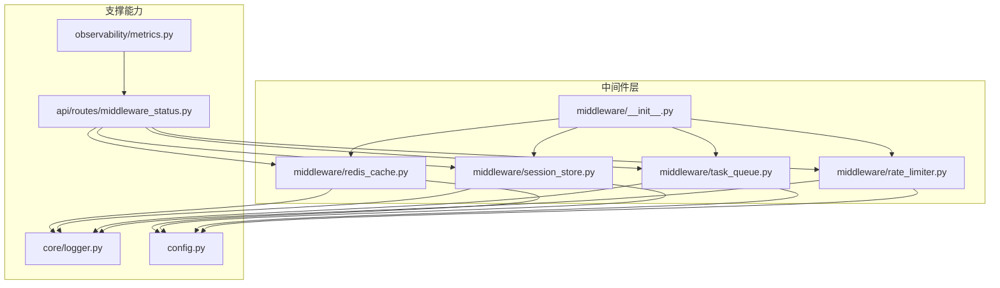
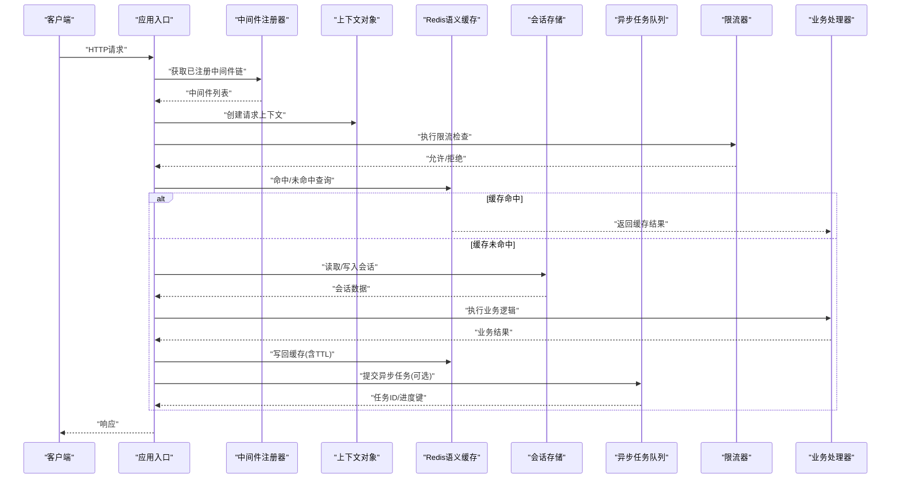
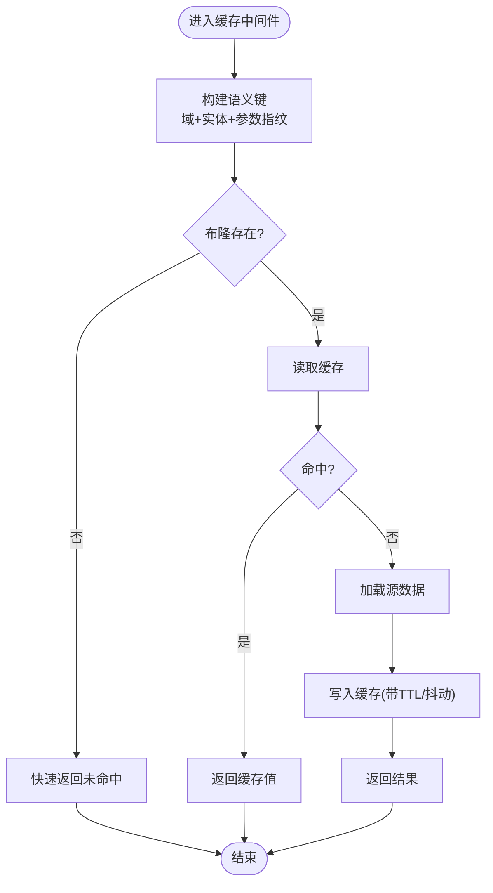
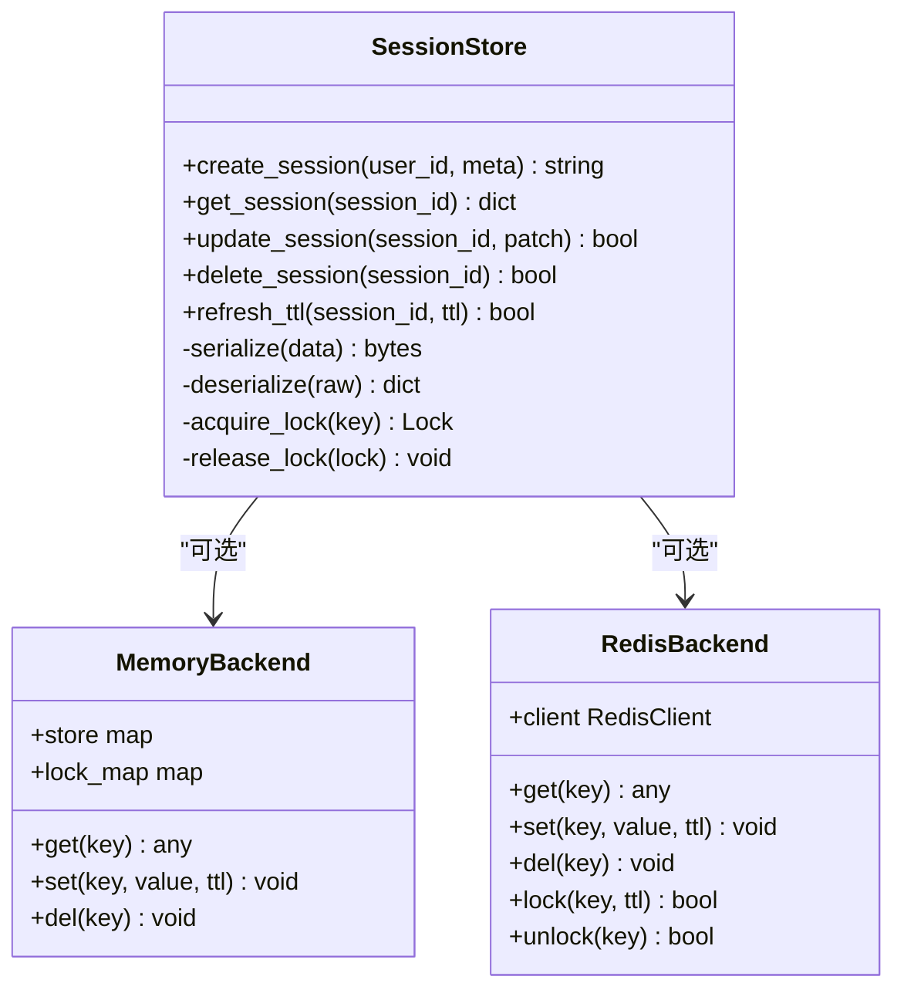
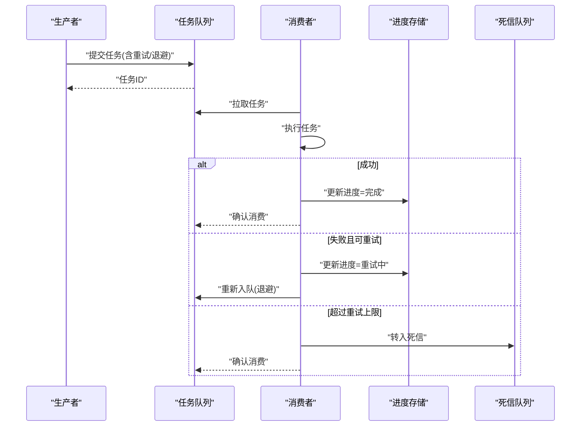
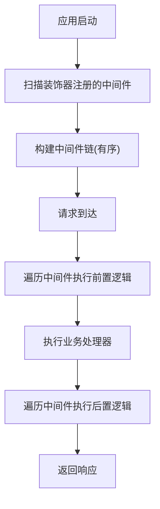
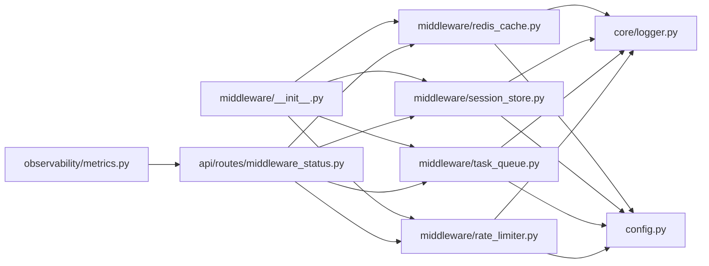

# Python中间件

<cite>
**本文引用的文件**   
- [backend_design/nexus/middleware/__init__.py](file://backend_design/nexus/middleware/__init__.py)
- [backend_design/nexus/middleware/redis_cache.py](file://backend_design/nexus/middleware/redis_cache.py)
- [backend_design/nexus/middleware/session_store.py](file://backend_design/nexus/middleware/session_store.py)
- [backend_design/nexus/middleware/task_queue.py](file://backend_design/nexus/middleware/task_queue.py)
- [backend_design/nexus/middleware/rate_limiter.py](file://backend_design/nexus/middleware/rate_limiter.py)
- [backend_design/nexus/core/logger.py](file://backend_design/nexus/core/logger.py)
- [backend_design/nexus/config.py](file://backend_design/nexus/config.py)
- [backend_design/nexus/api/routes/middleware_status.py](file://backend_design/nexus/api/routes/middleware_status.py)
- [backend_design/nexus/observability/metrics.py](file://backend_design/nexus/observability/metrics.py)
</cite>

## 目录
1. [简介](#简介)
2. [项目结构](#项目结构)
3. [核心组件](#核心组件)
4. [架构总览](#架构总览)
5. [详细组件分析](#详细组件分析)
6. [依赖关系分析](#依赖关系分析)
7. [性能考虑](#性能考虑)
8. [故障排查指南](#故障排查指南)
9. [结论](#结论)
10. [附录](#附录)

## 简介
本技术文档聚焦于Python中间件系统，围绕以下目标展开：
- Redis语义缓存：键设计、过期策略、穿透防护与一致性保障。
- 会话存储中间件：生命周期管理、序列化、并发安全。
- 异步任务队列：调度、失败重试、进度跟踪。
- 中间件注册与调用机制：装饰器模式、上下文传递。
- 性能调优与监控指标：关键指标定义与观测建议。

## 项目结构
中间件位于后端模块的 middleware 子包中，配套日志、配置、可观测性与API状态路由共同构成完整的中间件生态。

图表来源
- [backend_design/nexus/middleware/__init__.py](file://backend_design/nexus/middleware/__init__.py)
- [backend_design/nexus/middleware/redis_cache.py](file://backend_design/nexus/middleware/redis_cache.py)
- [backend_design/nexus/middleware/session_store.py](file://backend_design/nexus/middleware/session_store.py)
- [backend_design/nexus/middleware/task_queue.py](file://backend_design/nexus/middleware/task_queue.py)
- [backend_design/nexus/middleware/rate_limiter.py](file://backend_design/nexus/middleware/rate_limiter.py)
- [backend_design/nexus/core/logger.py](file://backend_design/nexus/core/logger.py)
- [backend_design/nexus/config.py](file://backend_design/nexus/config.py)
- [backend_design/nexus/observability/metrics.py](file://backend_design/nexus/observability/metrics.py)
- [backend_design/nexus/api/routes/middleware_status.py](file://backend_design/nexus/api/routes/middleware_status.py)

章节来源
- [backend_design/nexus/middleware/__init__.py](file://backend_design/nexus/middleware/__init__.py)
- [backend_design/nexus/middleware/redis_cache.py](file://backend_design/nexus/middleware/redis_cache.py)
- [backend_design/nexus/middleware/session_store.py](file://backend_design/nexus/middleware/session_store.py)
- [backend_design/nexus/middleware/task_queue.py](file://backend_design/nexus/middleware/task_queue.py)
- [backend_design/nexus/middleware/rate_limiter.py](file://backend_design/nexus/middleware/rate_limiter.py)
- [backend_design/nexus/core/logger.py](file://backend_design/nexus/core/logger.py)
- [backend_design/nexus/config.py](file://backend_design/nexus/config.py)
- [backend_design/nexus/observability/metrics.py](file://backend_design/nexus/observability/metrics.py)
- [backend_design/nexus/api/routes/middleware_status.py](file://backend_design/nexus/api/routes/middleware_status.py)

## 核心组件
- Redis语义缓存中间件：提供基于Redis的语义级缓存能力，支持键空间隔离、TTL控制、空值缓存与布隆过滤器防穿透。
- 会话存储中间件：面向请求上下文的会话读写封装，支持多后端（内存/Redis）与序列化策略，保证并发安全。
- 异步任务队列中间件：轻量任务编排，支持延迟执行、失败重试、指数退避与进度上报。
- 限流中间件：基于滑动窗口或令牌桶的速率限制，保护下游服务。
- 中间件注册与调用：通过装饰器将中间件挂载到应用管线，统一上下文传递与生命周期钩子。
- 可观测性：统一的日志、指标与中间件健康检查接口。

章节来源
- [backend_design/nexus/middleware/redis_cache.py](file://backend_design/nexus/middleware/redis_cache.py)
- [backend_design/nexus/middleware/session_store.py](file://backend_design/nexus/middleware/session_store.py)
- [backend_design/nexus/middleware/task_queue.py](file://backend_design/nexus/middleware/task_queue.py)
- [backend_design/nexus/middleware/rate_limiter.py](file://backend_design/nexus/middleware/rate_limiter.py)
- [backend_design/nexus/middleware/__init__.py](file://backend_design/nexus/middleware/__init__.py)
- [backend_design/nexus/observability/metrics.py](file://backend_design/nexus/observability/metrics.py)

## 架构总览
中间件以“装饰器+上下文”的方式接入请求处理链路，各中间件按注册顺序依次执行，形成横切能力。

图表来源
- [backend_design/nexus/middleware/__init__.py](file://backend_design/nexus/middleware/__init__.py)
- [backend_design/nexus/middleware/redis_cache.py](file://backend_design/nexus/middleware/redis_cache.py)
- [backend_design/nexus/middleware/session_store.py](file://backend_design/nexus/middleware/session_store.py)
- [backend_design/nexus/middleware/task_queue.py](file://backend_design/nexus/middleware/task_queue.py)
- [backend_design/nexus/middleware/rate_limiter.py](file://backend_design/nexus/middleware/rate_limiter.py)

## 详细组件分析

### Redis语义缓存中间件
- 功能要点
  - 语义键设计：按资源域、实体标识、参数指纹组合生成稳定键，避免热点冲突。
  - 过期策略：支持固定TTL与惰性失效；对热点键采用随机抖动降低雪崩风险。
  - 穿透防护：空值缓存与布隆过滤器双保险，减少无效请求落库。
  - 一致性：先删后写或版本号比较，结合短TTL兜底。
  - 降级：Redis不可用时直接透传至下游。
- 关键流程
  - 读路径：计算键→判断布隆→查缓存→未命中则查源→回填缓存。
  - 写路径：更新源→删除旧缓存或增量更新→记录指标。
- 复杂度与性能
  - 时间复杂度：O(1) 哈希键查找；布隆过滤近似O(k)。
  - 空间复杂度：与缓存条目数线性相关；布隆占用可控。
- 错误处理
  - 网络异常、序列化失败、键过长等边界情况均有兜底与告警。

图表来源
- [backend_design/nexus/middleware/redis_cache.py](file://backend_design/nexus/middleware/redis_cache.py)

章节来源
- [backend_design/nexus/middleware/redis_cache.py](file://backend_design/nexus/middleware/redis_cache.py)

### 会话存储中间件
- 功能要点
  - 生命周期：创建、刷新、销毁；支持自动续期与超时清理。
  - 序列化：JSON/MessagePack可选，兼容跨语言场景。
  - 并发安全：基于锁或原子操作保证同一会话的串行化写入。
  - 存储后端：内存字典或Redis，可按租户/用户维度隔离。
- 关键流程
  - 请求开始：解析会话ID→加载会话→注入上下文。
  - 请求结束：合并变更→持久化→更新最后访问时间。
- 复杂度与性能
  - 读路径O(1)，写路径受序列化与I/O影响；热点会话需本地小缓存。
- 错误处理
  - 序列化失败、存储不可用、会话损坏恢复策略。

图表来源
- [backend_design/nexus/middleware/session_store.py](file://backend_design/nexus/middleware/session_store.py)

章节来源
- [backend_design/nexus/middleware/session_store.py](file://backend_design/nexus/middleware/session_store.py)

### 异步任务队列中间件
- 功能要点
  - 任务模型：类型、参数、优先级、重试次数、退避策略、回调。
  - 调度：延迟执行、周期任务、死信队列。
  - 进度跟踪：通过进度键上报阶段与百分比。
  - 失败重试：指数退避、最大重试上限、幂等键去重。
- 关键流程
  - 提交任务→入队→消费者拉取→执行→成功/失败→重试或归档。
- 复杂度与性能
  - 入队/出队O(1)；重试与退避增加CPU开销但提升鲁棒性。
- 错误处理
  - 任务执行异常、消息丢失、重复消费防护。

图表来源
- [backend_design/nexus/middleware/task_queue.py](file://backend_design/nexus/middleware/task_queue.py)

章节来源
- [backend_design/nexus/middleware/task_queue.py](file://backend_design/nexus/middleware/task_queue.py)

### 限流中间件
- 功能要点
  - 算法：滑动窗口/令牌桶，支持全局与IP/用户维度。
  - 配置：阈值、窗口大小、惩罚策略。
  - 降级：限流器不可用时放行并告警。
- 关键流程
  - 校验配额→允许/拒绝→记录指标。

章节来源
- [backend_design/nexus/middleware/rate_limiter.py](file://backend_design/nexus/middleware/rate_limiter.py)

### 中间件注册与调用机制
- 装饰器模式
  - 使用装饰器声明式注册中间件，内部维护有序链表。
  - 每个中间件实现统一的“前置-后置”钩子，便于埋点与度量。
- 上下文传递
  - 请求上下文对象贯穿全链路，携带租户、用户、追踪ID、中间件状态等。
- 调用顺序
  - 注册顺序即执行顺序，可通过权重或命名约定调整。

图表来源
- [backend_design/nexus/middleware/__init__.py](file://backend_design/nexus/middleware/__init__.py)

章节来源
- [backend_design/nexus/middleware/__init__.py](file://backend_design/nexus/middleware/__init__.py)

## 依赖关系分析
- 内聚与耦合
  - 中间件之间低耦合，通过上下文与配置解耦。
  - 对外部依赖（Redis、日志、指标）抽象清晰，便于替换与测试。
- 外部集成点
  - Redis用于缓存与会话、任务进度。
  - 日志与指标用于可观测性。
- 潜在循环依赖
  - 中间件不互相导入，避免循环依赖。

图表来源
- [backend_design/nexus/middleware/__init__.py](file://backend_design/nexus/middleware/__init__.py)
- [backend_design/nexus/middleware/redis_cache.py](file://backend_design/nexus/middleware/redis_cache.py)
- [backend_design/nexus/middleware/session_store.py](file://backend_design/nexus/middleware/session_store.py)
- [backend_design/nexus/middleware/task_queue.py](file://backend_design/nexus/middleware/task_queue.py)
- [backend_design/nexus/middleware/rate_limiter.py](file://backend_design/nexus/middleware/rate_limiter.py)
- [backend_design/nexus/core/logger.py](file://backend_design/nexus/core/logger.py)
- [backend_design/nexus/config.py](file://backend_design/nexus/config.py)
- [backend_design/nexus/observability/metrics.py](file://backend_design/nexus/observability/metrics.py)
- [backend_design/nexus/api/routes/middleware_status.py](file://backend_design/nexus/api/routes/middleware_status.py)

章节来源
- [backend_design/nexus/middleware/__init__.py](file://backend_design/nexus/middleware/__init__.py)
- [backend_design/nexus/middleware/redis_cache.py](file://backend_design/nexus/middleware/redis_cache.py)
- [backend_design/nexus/middleware/session_store.py](file://backend_design/nexus/middleware/session_store.py)
- [backend_design/nexus/middleware/task_queue.py](file://backend_design/nexus/middleware/task_queue.py)
- [backend_design/nexus/middleware/rate_limiter.py](file://backend_design/nexus/middleware/rate_limiter.py)
- [backend_design/nexus/core/logger.py](file://backend_design/nexus/core/logger.py)
- [backend_design/nexus/config.py](file://backend_design/nexus/config.py)
- [backend_design/nexus/observability/metrics.py](file://backend_design/nexus/observability/metrics.py)
- [backend_design/nexus/api/routes/middleware_status.py](file://backend_design/nexus/api/routes/middleware_status.py)

## 性能考虑
- 缓存
  - 合理设置TTL与随机抖动，避免雪崩。
  - 大对象分片与压缩，减少带宽与内存占用。
  - 热点键本地二级缓存，降低远端访问。
- 会话
  - 选择高效序列化格式；仅持久化必要字段。
  - 使用原子操作与短事务减少锁竞争。
- 任务队列
  - 批量拉取与批处理，提高吞吐。
  - 退避策略与最大重试上限平衡可靠性与资源。
- 限流
  - 滑动窗口聚合统计，降低计数器更新频率。
- 可观测性
  - 采样与分级日志，避免IO瓶颈。
  - 指标打点尽量无阻塞，必要时异步上报。

[本节为通用指导，无需特定文件引用]

## 故障排查指南
- 常见问题定位
  - 缓存命中率低：检查键设计与参数规范化；观察布隆误判率。
  - 会话丢失：核对序列化版本与后端可用性；检查TTL刷新是否生效。
  - 任务堆积：查看消费者数量、重试退避与死信队列长度。
  - 限流过严：调整阈值与维度，关注被拒请求比例。
- 诊断工具
  - 中间件健康检查接口：汇总各中间件状态与关键指标。
  - 日志与指标：结合追踪ID串联请求链路。

章节来源
- [backend_design/nexus/api/routes/middleware_status.py](file://backend_design/nexus/api/routes/middleware_status.py)
- [backend_design/nexus/core/logger.py](file://backend_design/nexus/core/logger.py)
- [backend_design/nexus/observability/metrics.py](file://backend_design/nexus/observability/metrics.py)

## 结论
该中间件体系以装饰器与上下文为核心，将缓存、会话、任务与限流等横切能力模块化，具备高内聚、低耦合与良好可观测性。通过合理的键设计、过期策略、穿透防护与重试退避，系统在可用性与性能间取得平衡。配合健康检查与指标采集，便于在生产环境持续优化。

[本节为总结性内容，无需特定文件引用]

## 附录
- 术语
  - 语义缓存：基于业务语义而非URL的缓存策略。
  - 布隆过滤器：概率型数据结构，用于快速判断元素是否存在。
  - 指数退避：重试间隔随失败次数呈指数增长。
- 最佳实践
  - 所有中间件必须幂等与可重试。
  - 敏感信息不落盘，必要时加密存储。
  - 配置项集中管理，支持热更新。

[本节为概念性内容，无需特定文件引用]