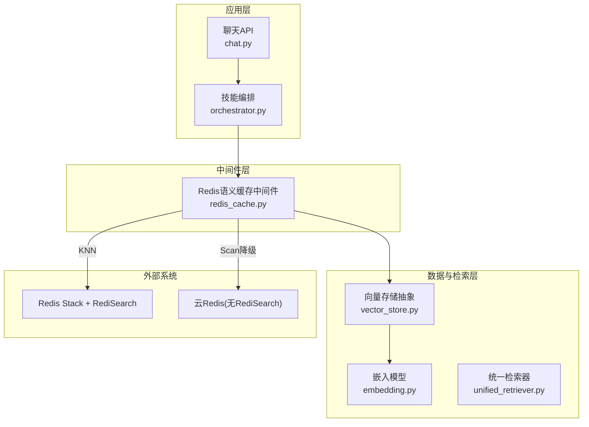
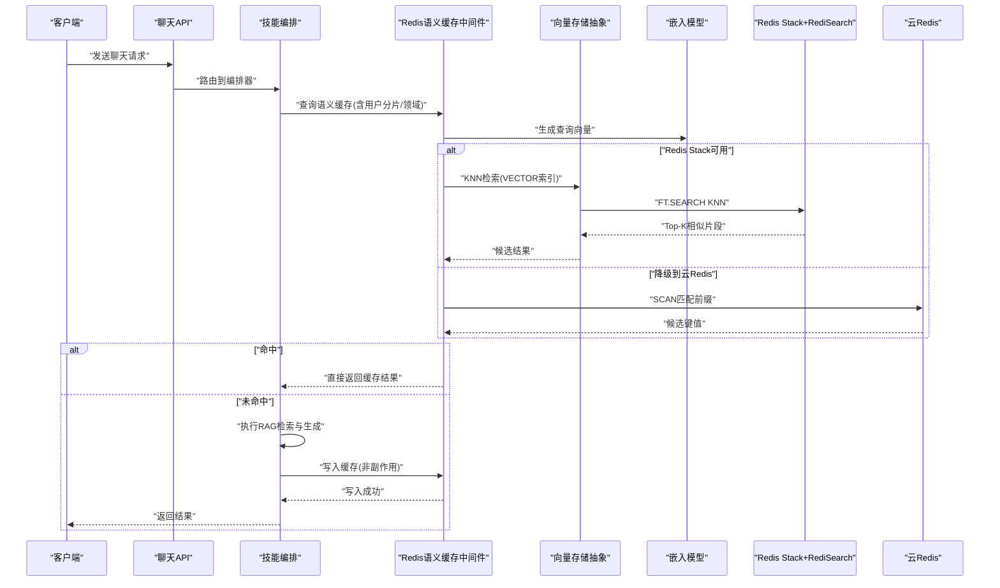
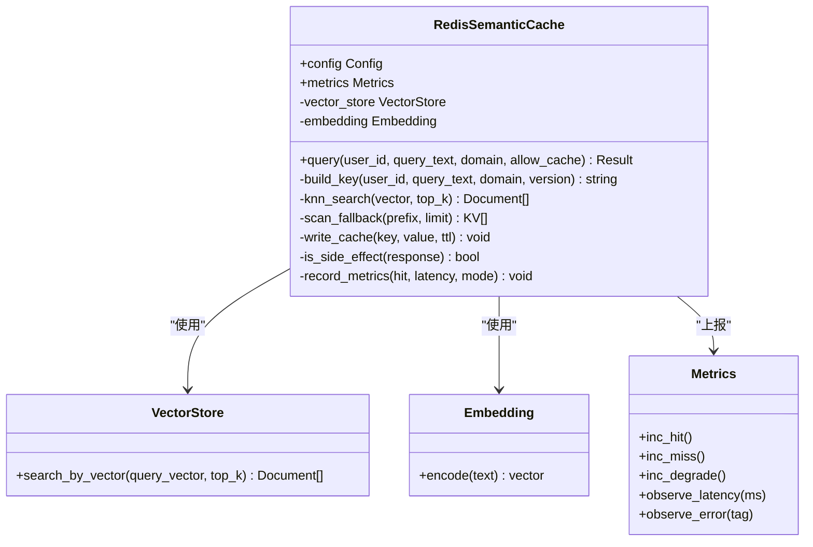
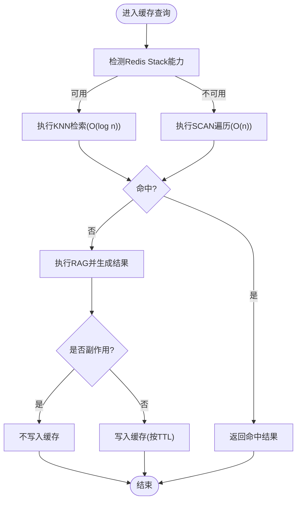
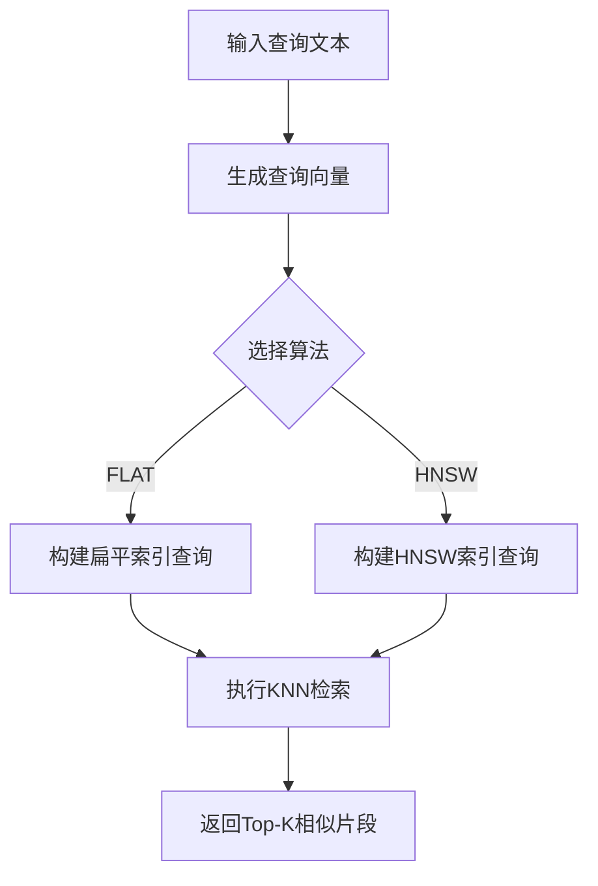
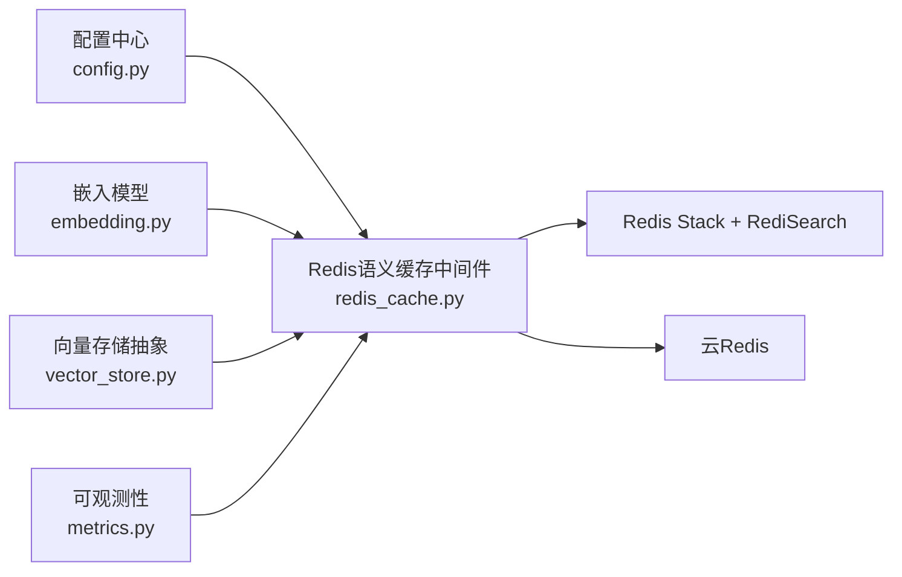

# Redis语义缓存

<cite>
**本文引用的文件**   
- [backend_design/nexus/middleware/redis_cache.py](file://backend_design/nexus/middleware/redis_cache.py)
- [backend_design/nexus/config.py](file://backend_design/nexus/config.py)
- [backend_design/nexus/core/personalization.py](file://backend_design/nexus/core/personalization.py)
- [backend_design/nexus/api/routes/chat.py](file://backend_design/nexus/api/routes/chat.py)
- [backend_design/nexus/observability/metrics.py](file://backend_design/nexus/observability/metrics.py)
- [backend_design/nexus/rag/vector_store.py](file://backend_design/nexus/rag/vector_store.py)
- [backend_design/nexus/rag/embedding.py](file://backend_design/nexus/rag/embedding.py)
- [backend_design/nexus/rag/unified_retriever.py](file://backend_design/nexus/rag/unified_retriever.py)
- [backend_design/nexus/skills/orchestrator.py](file://backend_design/nexus/skills/orchestrator.py)
- [backend_design/nexus/skills/vehicle/__init__.py](file://backend_design/nexus/skills/vehicle/__init__.py)
</cite>

## 目录
1. [简介](#简介)
2. [项目结构](#项目结构)
3. [核心组件](#核心组件)
4. [架构总览](#架构总览)
5. [详细组件分析](#详细组件分析)
6. [依赖关系分析](#依赖关系分析)
7. [性能考量](#性能考量)
8. [故障排查指南](#故障排查指南)
9. [结论](#结论)
10. [附录](#附录)

## 简介
本技术文档聚焦于Redis语义缓存中间件，重点阐述v2.0基于Redis Stack RediSearch的KNN向量检索实现。内容涵盖：
- VECTOR索引设计与FLAT/HNSW算法选择
- 余弦相似度计算与查询流程
- 缓存键设计策略、用户分片隔离机制
- TTL分级策略（闲聊1h、知识库24h）
- 安全设计中的副作用隔离机制（车控指令等副作用响应永不写入缓存）
- 双模式降级策略（Redis Stack环境使用KNN检索O(log n)，云Redis环境降级为scan遍历O(n)）
- 缓存命中率统计、性能监控指标与故障恢复机制
- 配置参数说明与使用示例

## 项目结构
语义缓存位于后端中间件层，与RAG检索、技能编排、API路由和可观测性模块紧密协作。整体组织遵循分层与按功能域划分相结合的原则：
- 中间件层：提供统一的语义缓存能力
- RAG层：负责向量化、检索与重排
- 技能编排：协调业务逻辑并决定是否落盘缓存
- API路由：暴露接口并接入中间件
- 可观测性：采集命中/未命中、延迟、错误等指标

图表来源
- [backend_design/nexus/api/routes/chat.py](file://backend_design/nexus/api/routes/chat.py)
- [backend_design/nexus/skills/orchestrator.py](file://backend_design/nexus/skills/orchestrator.py)
- [backend_design/nexus/middleware/redis_cache.py](file://backend_design/nexus/middleware/redis_cache.py)
- [backend_design/nexus/rag/vector_store.py](file://backend_design/nexus/rag/vector_store.py)
- [backend_design/nexus/rag/embedding.py](file://backend_design/nexus/rag/embedding.py)
- [backend_design/nexus/rag/unified_retriever.py](file://backend_design/nexus/rag/unified_retriever.py)

章节来源
- [backend_design/nexus/middleware/redis_cache.py](file://backend_design/nexus/middleware/redis_cache.py)
- [backend_design/nexus/config.py](file://backend_design/nexus/config.py)
- [backend_design/nexus/api/routes/chat.py](file://backend_design/nexus/api/routes/chat.py)
- [backend_design/nexus/skills/orchestrator.py](file://backend_design/nexus/skills/orchestrator.py)
- [backend_design/nexus/rag/vector_store.py](file://backend_design/nexus/rag/vector_store.py)
- [backend_design/nexus/rag/embedding.py](file://backend_design/nexus/rag/embedding.py)
- [backend_design/nexus/rag/unified_retriever.py](file://backend_design/nexus/rag/unified_retriever.py)

## 核心组件
- Redis语义缓存中间件：封装KNN检索、TTL管理、用户分片、降级策略与指标上报
- 向量存储抽象：屏蔽底层差异，向上提供一致的向量检索接口
- 嵌入模型：将文本转换为向量，供KNN检索使用
- 统一检索器：在RAG链路中组合向量检索与重排
- 配置中心：集中管理Redis连接、索引参数、TTL策略、降级开关等
- 可观测性：记录命中率、延迟、错误、降级次数等指标

章节来源
- [backend_design/nexus/middleware/redis_cache.py](file://backend_design/nexus/middleware/redis_cache.py)
- [backend_design/nexus/rag/vector_store.py](file://backend_design/nexus/rag/vector_store.py)
- [backend_design/nexus/rag/embedding.py](file://backend_design/nexus/rag/embedding.py)
- [backend_design/nexus/rag/unified_retriever.py](file://backend_design/nexus/rag/unified_retriever.py)
- [backend_design/nexus/config.py](file://backend_design/nexus/config.py)
- [backend_design/nexus/observability/metrics.py](file://backend_design/nexus/observability/metrics.py)

## 架构总览
语义缓存作为请求路径上的关键中间件，承担“先查后写”的职责：
- 入参：用户上下文、查询文本、领域标签（闲聊/知识库）、是否允许缓存
- 处理：生成缓存键→尝试KNN检索→命中则返回；未命中则走RAG→结果写入缓存→返回
- 降级：若Redis Stack不可用或无RediSearch，自动切换至scan遍历
- 安全：副作用响应（如车控指令）禁止写入缓存

图表来源
- [backend_design/nexus/api/routes/chat.py](file://backend_design/nexus/api/routes/chat.py)
- [backend_design/nexus/skills/orchestrator.py](file://backend_design/nexus/skills/orchestrator.py)
- [backend_design/nexus/middleware/redis_cache.py](file://backend_design/nexus/middleware/redis_cache.py)
- [backend_design/nexus/rag/vector_store.py](file://backend_design/nexus/rag/vector_store.py)
- [backend_design/nexus/rag/embedding.py](file://backend_design/nexus/rag/embedding.py)

## 详细组件分析

### 组件A：Redis语义缓存中间件
职责与特性：
- 缓存键设计：包含用户标识、领域标签、查询指纹、版本哈希，确保跨会话复用且避免冲突
- 用户分片隔离：通过命名空间或Key前缀实现多租户/多用户隔离
- TTL分级：闲聊类1小时，知识库类24小时，支持按领域动态调整
- 安全隔离：副作用标记的响应（如车控指令）不写入缓存
- 双模式降级：优先使用Redis Stack的KNN检索；不可用时回退到scan遍历
- 指标上报：命中/未命中、延迟、错误、降级次数、KNN耗时等

图表来源
- [backend_design/nexus/middleware/redis_cache.py](file://backend_design/nexus/middleware/redis_cache.py)
- [backend_design/nexus/rag/vector_store.py](file://backend_design/nexus/rag/vector_store.py)
- [backend_design/nexus/rag/embedding.py](file://backend_design/nexus/rag/embedding.py)
- [backend_design/nexus/observability/metrics.py](file://backend_design/nexus/observability/metrics.py)

章节来源
- [backend_design/nexus/middleware/redis_cache.py](file://backend_design/nexus/middleware/redis_cache.py)
- [backend_design/nexus/observability/metrics.py](file://backend_design/nexus/observability/metrics.py)

#### 缓存键设计策略
- 组成要素：用户ID、领域标签（闲聊/知识库）、查询指纹（归一化后的摘要）、版本号/模型哈希
- 目的：保证相同语义在不同会话间可复用，同时避免不同用户/领域/模型版本之间的污染
- 扩展：支持按业务线增加额外维度（如渠道、设备类型）

章节来源
- [backend_design/nexus/middleware/redis_cache.py](file://backend_design/nexus/middleware/redis_cache.py)

#### 用户分片隔离机制
- 通过命名空间或Key前缀对用户进行隔离，避免跨用户数据泄露
- 结合领域标签进一步缩小检索范围，提升命中率与安全性

章节来源
- [backend_design/nexus/middleware/redis_cache.py](file://backend_design/nexus/middleware/redis_cache.py)

#### TTL分级策略
- 闲聊类：1小时，适合高频短生命周期对话
- 知识库类：24小时，适合相对稳定的知识问答
- 支持按领域或业务规则动态调整TTL

章节来源
- [backend_design/nexus/middleware/redis_cache.py](file://backend_design/nexus/middleware/redis_cache.py)

#### 安全设计：副作用隔离
- 副作用判定：对响应内容进行标记或规则判断（如包含车控指令、状态变更等）
- 策略：任何被判定为副作用的响应绝不写入缓存，防止误用与扩散
- 覆盖范围：包括车辆控制、媒体播放、导航设置等可能改变外部状态的调用

章节来源
- [backend_design/nexus/middleware/redis_cache.py](file://backend_design/nexus/middleware/redis_cache.py)
- [backend_design/nexus/skills/vehicle/__init__.py](file://backend_design/nexus/skills/vehicle/__init__.py)

#### 双模式降级策略
- 主模式：Redis Stack + RediSearch，使用VECTOR索引进行KNN检索，复杂度近似O(log n)
- 降级模式：云Redis（无RediSearch），采用SCAN遍历匹配前缀，复杂度O(n)
- 切换条件：检测Redis Stack能力或索引可用性，失败时自动降级

图表来源
- [backend_design/nexus/middleware/redis_cache.py](file://backend_design/nexus/middleware/redis_cache.py)

章节来源
- [backend_design/nexus/middleware/redis_cache.py](file://backend_design/nexus/middleware/redis_cache.py)

### 组件B：向量存储抽象与RediSearch集成
- 向量索引设计：定义字段、向量维度、距离度量（余弦相似度）
- 算法选择：
  - FLAT：精确搜索，适合小规模或低延迟要求场景
  - HNSW：近似搜索，适合大规模高吞吐场景
- 查询流程：生成查询向量→构建KNN过滤条件→返回Top-K片段

图表来源
- [backend_design/nexus/rag/vector_store.py](file://backend_design/nexus/rag/vector_store.py)
- [backend_design/nexus/rag/embedding.py](file://backend_design/nexus/rag/embedding.py)

章节来源
- [backend_design/nexus/rag/vector_store.py](file://backend_design/nexus/rag/vector_store.py)
- [backend_design/nexus/rag/embedding.py](file://backend_design/nexus/rag/embedding.py)

### 组件C：统一检索器与编排
- 统一检索器：整合向量检索与重排，提供一致的上层接口
- 编排器：协调缓存、RAG、技能调用，决定是否写入缓存以及TTL策略

章节来源
- [backend_design/nexus/rag/unified_retriever.py](file://backend_design/nexus/rag/unified_retriever.py)
- [backend_design/nexus/skills/orchestrator.py](file://backend_design/nexus/skills/orchestrator.py)

## 依赖关系分析
- 中间件依赖：
  - 配置中心：读取Redis连接、索引参数、TTL策略、降级开关
  - 向量存储抽象：屏蔽底层差异，提供KNN/Scan两种检索方式
  - 嵌入模型：将文本转为向量
  - 可观测性：上报命中/未命中、延迟、错误、降级等指标
- 外部依赖：
  - Redis Stack + RediSearch：提供VECTOR索引与KNN检索
  - 云Redis：无RediSearch时的降级目标

图表来源
- [backend_design/nexus/config.py](file://backend_design/nexus/config.py)
- [backend_design/nexus/middleware/redis_cache.py](file://backend_design/nexus/middleware/redis_cache.py)
- [backend_design/nexus/rag/vector_store.py](file://backend_design/nexus/rag/vector_store.py)
- [backend_design/nexus/rag/embedding.py](file://backend_design/nexus/rag/embedding.py)
- [backend_design/nexus/observability/metrics.py](file://backend_design/nexus/observability/metrics.py)

章节来源
- [backend_design/nexus/config.py](file://backend_design/nexus/config.py)
- [backend_design/nexus/middleware/redis_cache.py](file://backend_design/nexus/middleware/redis_cache.py)
- [backend_design/nexus/rag/vector_store.py](file://backend_design/nexus/rag/vector_store.py)
- [backend_design/nexus/rag/embedding.py](file://backend_design/nexus/rag/embedding.py)
- [backend_design/nexus/observability/metrics.py](file://backend_design/nexus/observability/metrics.py)

## 性能考量
- 主模式KNN检索：利用RediSearch的VECTOR索引，近似O(log n)，在高并发下具备良好吞吐
- 降级模式Scan遍历：O(n)，适用于小数据集或临时降级场景，需限制扫描范围与超时
- 向量维度与距离度量：选择合适的嵌入维度与余弦相似度，平衡精度与延迟
- 索引算法选择：
  - FLAT：精确但较慢，适合小规模
  - HNSW：近似但更快，适合大规模
- TTL策略：合理设置TTL可减少内存占用并提高命中率
- 指标监控：关注命中率、P95/P99延迟、错误率、降级次数

[本节为通用性能指导，无需特定文件引用]

## 故障排查指南
常见问题与定位方法：
- 无法连接Redis：检查连接参数、网络连通性与认证信息
- RediSearch不可用：确认Redis Stack版本与插件加载情况，必要时触发降级
- 索引缺失或损坏：重建VECTOR索引，验证字段与维度一致性
- 命中率偏低：优化查询指纹、调整TTL、改进嵌入质量
- 副作用响应被缓存：检查副作用判定规则，确保车控指令等不被缓存
- 指标异常：核对埋点位置与上报通道，确认Prometheus/Grafana配置

章节来源
- [backend_design/nexus/middleware/redis_cache.py](file://backend_design/nexus/middleware/redis_cache.py)
- [backend_design/nexus/observability/metrics.py](file://backend_design/nexus/observability/metrics.py)

## 结论
Redis语义缓存中间件通过KNN向量检索与双模式降级策略，在保证高命中率的同时兼顾稳定性与安全性。合理的键设计、用户分片隔离与TTL分级提升了复用效率与资源利用率；副作用隔离确保了车控指令等敏感操作的安全性。配合完善的指标监控与故障恢复机制，可在生产环境中稳定运行。

[本节为总结性内容，无需特定文件引用]

## 附录

### 配置参数说明
- Redis连接：主机、端口、密码、数据库编号
- RediSearch能力检测：是否启用KNN检索、索引名称、向量维度、距离度量
- 算法选择：FLAT/HNSW参数（M、efConstruction、efRuntime等）
- TTL策略：闲聊1小时、知识库24小时，支持按领域覆盖
- 降级开关：当RediSearch不可用时自动切换到scan遍历
- 指标上报：开启/关闭、采样率、标签维度

章节来源
- [backend_design/nexus/config.py](file://backend_design/nexus/config.py)
- [backend_design/nexus/middleware/redis_cache.py](file://backend_design/nexus/middleware/redis_cache.py)

### 使用示例
- 在API路由中接入语义缓存中间件，传入用户ID、查询文本、领域标签与是否允许缓存
- 在编排器中根据业务规则决定是否写入缓存及TTL策略
- 在RAG链路中使用统一检索器获取候选片段并进行重排

章节来源
- [backend_design/nexus/api/routes/chat.py](file://backend_design/nexus/api/routes/chat.py)
- [backend_design/nexus/skills/orchestrator.py](file://backend_design/nexus/skills/orchestrator.py)
- [backend_design/nexus/rag/unified_retriever.py](file://backend_design/nexus/rag/unified_retriever.py)