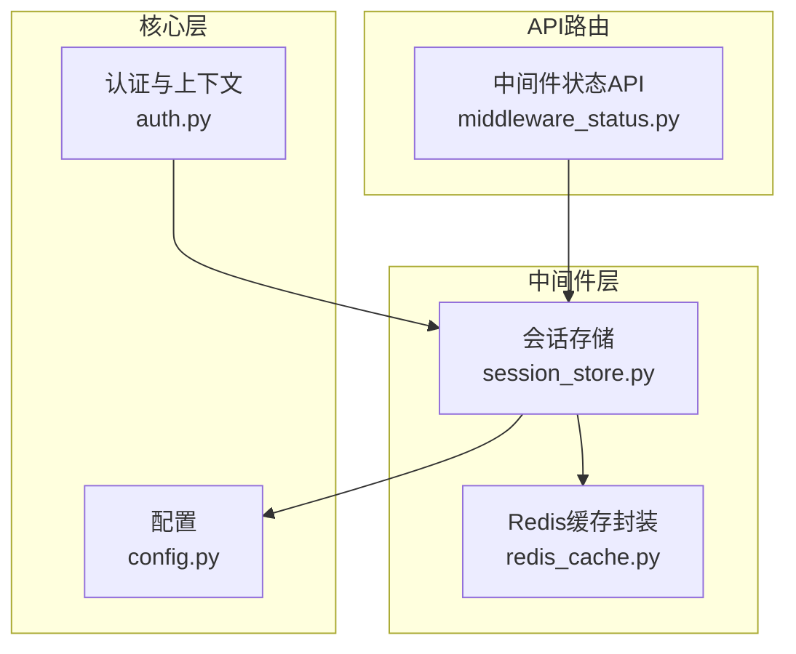
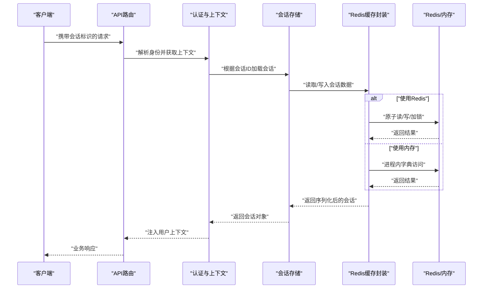
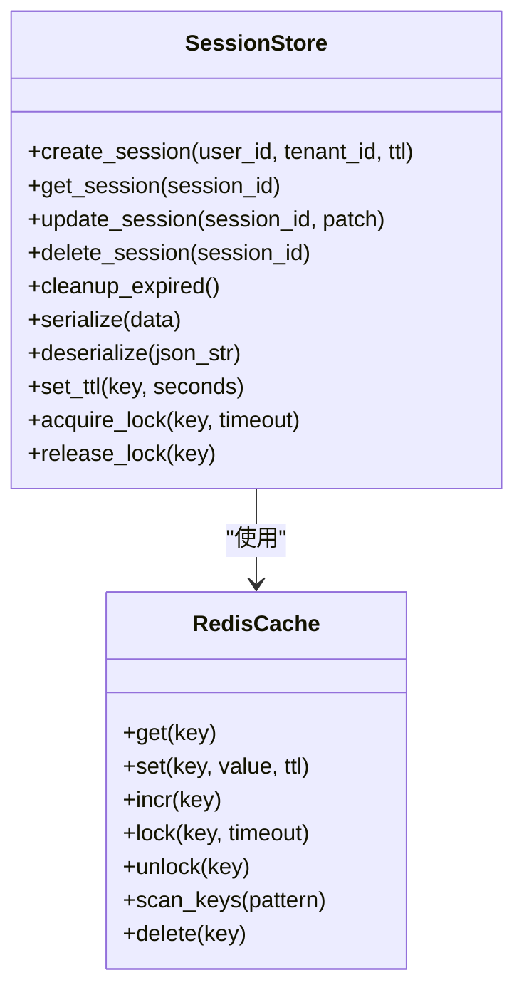
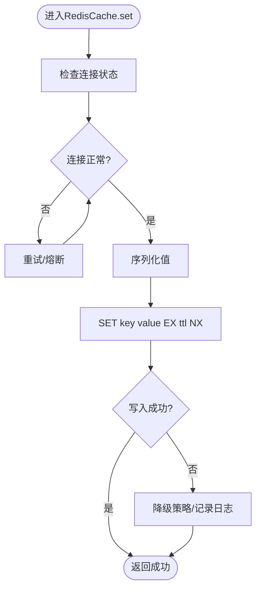
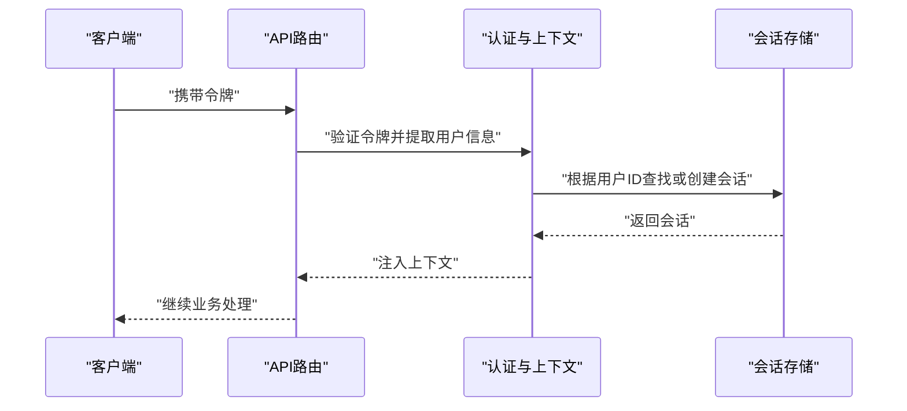
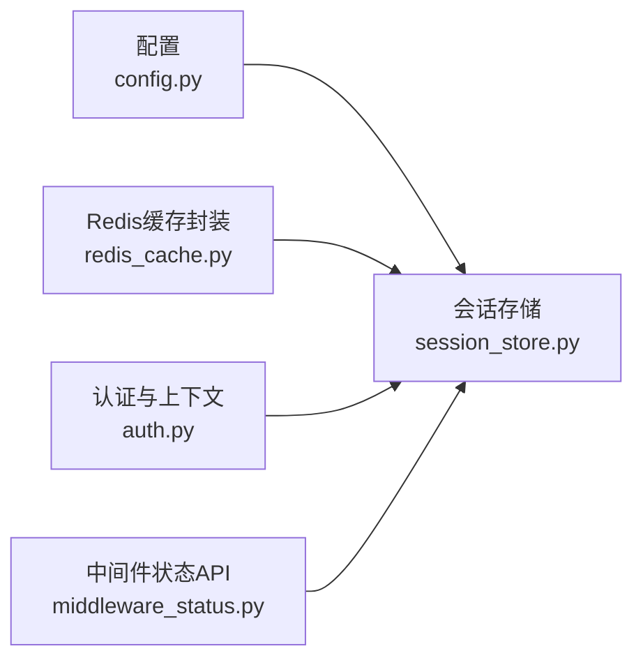

# 会话存储中间件

<cite>
**本文引用的文件**   
- [session_store.py](file://backend_design/nexus/middleware/session_store.py)
- [redis_cache.py](file://backend_design/nexus/middleware/redis_cache.py)
- [auth.py](file://backend_design/nexus/core/auth.py)
- [config.py](file://backend_design/nexus/config.py)
- [middleware_status.py](file://backend_design/nexus/api/routes/middleware_status.py)
</cite>

## 目录
1. [简介](#简介)
2. [项目结构](#项目结构)
3. [核心组件](#核心组件)
4. [架构总览](#架构总览)
5. [详细组件分析](#详细组件分析)
6. [依赖关系分析](#依赖关系分析)
7. [性能考虑](#性能考虑)
8. [故障排查指南](#故障排查指南)
9. [结论](#结论)
10. [附录](#附录)

## 简介
本技术文档聚焦于“会话存储中间件”，围绕以下目标展开：
- 会话生命周期管理：创建、更新、过期清理
- 数据序列化策略：Python对象与JSON的互转
- 并发安全保证：分布式锁、原子操作、竞态条件防护
- 数据存储结构：用户信息、权限状态、临时数据
- 持久化策略：内存存储与Redis持久化切换
- 清理策略与内存泄漏防护
- 性能优化建议
- API接口说明与错误处理机制

## 项目结构
与会话存储相关的代码主要位于后端中间件层，核心文件包括：
- 会话存储实现：session_store.py
- Redis缓存封装：redis_cache.py
- 认证与上下文：auth.py
- 配置项：config.py
- 中间件状态查询API：middleware_status.py

图表来源
- [session_store.py](file://backend_design/nexus/middleware/session_store.py)
- [redis_cache.py](file://backend_design/nexus/middleware/redis_cache.py)
- [auth.py](file://backend_design/nexus/core/auth.py)
- [config.py](file://backend_design/nexus/config.py)
- [middleware_status.py](file://backend_design/nexus/api/routes/middleware_status.py)

章节来源
- [session_store.py](file://backend_design/nexus/middleware/session_store.py)
- [redis_cache.py](file://backend_design/nexus/middleware/redis_cache.py)
- [auth.py](file://backend_design/nexus/core/auth.py)
- [config.py](file://backend_design/nexus/config.py)
- [middleware_status.py](file://backend_design/nexus/api/routes/middleware_status.py)

## 核心组件
- 会话存储（SessionStore）
  - 职责：提供会话的创建、读取、更新、删除、过期清理等能力；负责序列化/反序列化；在内存与Redis之间切换。
  - 关键特性：并发安全、TTL管理、键空间前缀隔离、统计指标。
- Redis缓存封装（RedisCache）
  - 职责：对Redis进行统一封装，提供原子性读写、事务、分布式锁、批量操作等。
  - 关键特性：连接池、重试与超时控制、Lua脚本支持。
- 认证与上下文（Auth）
  - 职责：解析请求中的身份凭证，建立用户上下文，驱动会话加载或创建。
- 配置（Config）
  - 职责：集中管理会话存储模式（内存/Redis）、TTL、键前缀、锁超时等参数。
- 中间件状态API（MiddlewareStatus）
  - 职责：暴露会话存储健康检查、统计信息、清理任务状态等查询接口。

章节来源
- [session_store.py](file://backend_design/nexus/middleware/session_store.py)
- [redis_cache.py](file://backend_design/nexus/middleware/redis_cache.py)
- [auth.py](file://backend_design/nexus/core/auth.py)
- [config.py](file://backend_design/nexus/config.py)
- [middleware_status.py](file://backend_design/nexus/api/routes/middleware_status.py)

## 架构总览
整体架构采用“应用层 -> 认证层 -> 会话存储中间件 -> 持久化层”的分层设计。会话存储中间件屏蔽底层存储差异，向上提供一致API；通过配置可无缝切换内存与Redis两种后端。

图表来源
- [session_store.py](file://backend_design/nexus/middleware/session_store.py)
- [redis_cache.py](file://backend_design/nexus/middleware/redis_cache.py)
- [auth.py](file://backend_design/nexus/core/auth.py)
- [middleware_status.py](file://backend_design/nexus/api/routes/middleware_status.py)

## 详细组件分析

### 会话存储（SessionStore）
- 会话生命周期
  - 创建：生成唯一会话ID，初始化默认字段（用户信息、权限状态、临时数据），设置TTL并持久化。
  - 更新：增量合并变更，刷新TTL，确保幂等写入。
  - 读取：按会话ID检索，若不存在则按需创建或返回空。
  - 删除：显式销毁会话，释放资源。
  - 过期清理：基于TTL自动失效；可选后台任务扫描并主动清理过期键。
- 数据序列化策略
  - Python对象到JSON：内置序列化工具将复杂类型转换为JSON兼容结构；反序列化时恢复为Python对象。
  - 失败回退：当序列化异常时，记录告警并降级为最小可用结构，避免阻塞主流程。
- 并发安全保证
  - 内存模式：使用线程安全容器与读写锁保护共享状态。
  - Redis模式：通过分布式锁与原子操作（如INCR/DECR、SETNX、Lua脚本）防止竞态条件。
- 存储结构
  - 用户信息：用户标识、显示名、租户信息等。
  - 权限状态：角色、权限集合、最近一次鉴权时间。
  - 临时数据：页面级缓存、表单草稿、短期工作区。
- 持久化策略
  - 内存存储：适合单机开发测试，启动即建表，关闭即清空。
  - Redis持久化：生产环境推荐，具备跨进程共享与TTL能力。
- 清理策略与内存泄漏防护
  - TTL驱动：所有会话键均带过期时间。
  - 主动清理：定时任务扫描过期键并删除，避免僵尸会话堆积。
  - 容量上限：限制最大会话数与单会话大小，超限触发淘汰策略。
- 性能优化建议
  - 批量操作：合并多次小写为批量写入。
  - 压缩传输：对大对象启用压缩以减少网络开销。
  - 热点键保护：针对高频会话采用本地缓存+异步落盘。

图表来源
- [session_store.py](file://backend_design/nexus/middleware/session_store.py)
- [redis_cache.py](file://backend_design/nexus/middleware/redis_cache.py)

章节来源
- [session_store.py](file://backend_design/nexus/middleware/session_store.py)
- [redis_cache.py](file://backend_design/nexus/middleware/redis_cache.py)

### Redis缓存封装（RedisCache）
- 功能要点
  - 原子操作：自增、自减、存在性判断、条件写入。
  - 分布式锁：基于SETNX或RedLock思想实现，支持超时与重试。
  - 批量与扫描：SCAN迭代键空间，避免KEYS阻塞。
  - Lua脚本：保证复杂逻辑的原子性与一致性。
- 错误处理
  - 连接异常：指数退避重试，熔断保护。
  - 超时异常：快速失败并回退到内存路径（若允许）。
- 监控与可观测性
  - 暴露命中率、延迟、错误率等指标。
  - 健康检查：PING连通性检测。

图表来源
- [redis_cache.py](file://backend_design/nexus/middleware/redis_cache.py)

章节来源
- [redis_cache.py](file://backend_design/nexus/middleware/redis_cache.py)

### 认证与上下文（Auth）
- 职责
  - 从请求头或令牌中解析用户身份与租户信息。
  - 驱动会话加载：若会话不存在则创建，否则更新活跃时间。
  - 将用户上下文注入后续处理链路。
- 与会话存储协作
  - 调用会话存储的读取/更新接口，确保会话与用户绑定。
  - 在鉴权失败时拒绝访问并返回明确错误码。

图表来源
- [auth.py](file://backend_design/nexus/core/auth.py)
- [session_store.py](file://backend_design/nexus/middleware/session_store.py)

章节来源
- [auth.py](file://backend_design/nexus/core/auth.py)
- [session_store.py](file://backend_design/nexus/middleware/session_store.py)

### 配置（Config）
- 关键配置项
  - 存储模式：memory/redis
  - Redis连接：host、port、db、密码、连接池大小
  - 会话TTL：默认过期秒数
  - 键前缀：用于命名空间隔离
  - 锁超时：分布式锁默认超时
  - 清理间隔：后台清理任务周期
- 动态生效
  - 支持热重载部分配置（如TTL、清理间隔），无需重启服务。

章节来源
- [config.py](file://backend_design/nexus/config.py)

### 中间件状态API（MiddlewareStatus）
- 能力
  - 健康检查：Redis连通性、内存占用、会话总数、过期数量。
  - 统计信息：读写次数、命中率、错误计数。
  - 清理任务状态：上次执行时间、耗时、失败次数。
- 用途
  - 运维监控、告警阈值、容量规划。

章节来源
- [middleware_status.py](file://backend_design/nexus/api/routes/middleware_status.py)

## 依赖关系分析
- 模块耦合
  - 会话存储依赖Redis缓存封装与配置模块。
  - 认证模块依赖会话存储以维护用户会话。
  - API路由依赖会话存储与认证模块完成鉴权与会话管理。
- 外部依赖
  - Redis：分布式存储与锁能力。
  - JSON库：序列化/反序列化。
  - 线程/协程库：并发安全与异步清理任务。

图表来源
- [config.py](file://backend_design/nexus/config.py)
- [session_store.py](file://backend_design/nexus/middleware/session_store.py)
- [redis_cache.py](file://backend_design/nexus/middleware/redis_cache.py)
- [auth.py](file://backend_design/nexus/core/auth.py)
- [middleware_status.py](file://backend_design/nexus/api/routes/middleware_status.py)

章节来源
- [config.py](file://backend_design/nexus/config.py)
- [session_store.py](file://backend_design/nexus/middleware/session_store.py)
- [redis_cache.py](file://backend_design/nexus/middleware/redis_cache.py)
- [auth.py](file://backend_design/nexus/core/auth.py)
- [middleware_status.py](file://backend_design/nexus/api/routes/middleware_status.py)

## 性能考虑
- 读写路径优化
  - 合并写入：减少频繁的小写操作，采用批量提交。
  - 热点缓存：对高频会话增加本地二级缓存，降低Redis压力。
  - 压缩传输：对大对象启用压缩，平衡CPU与带宽。
- 过期与清理
  - TTL优先：尽量依赖存储层TTL，减少主动扫描成本。
  - 渐进清理：后台任务分片扫描，避免长事务阻塞。
- 并发与锁
  - 细粒度锁：仅对冲突字段加锁，缩短持锁时间。
  - 无锁路径：对只读场景避免不必要的锁竞争。
- 监控与调优
  - 指标采集：QPS、P99延迟、错误率、锁等待时长。
  - 容量规划：根据峰值QPS与平均会话大小评估Redis内存与连接池。

[本节为通用性能指导，不直接分析具体文件]

## 故障排查指南
- 常见问题
  - 会话丢失：检查TTL是否过短、清理任务是否误删、Redis持久化是否开启。
  - 读写超时：检查Redis连接池、网络延迟、慢查询。
  - 锁竞争：观察锁等待时长，调整锁粒度与超时。
  - 序列化异常：确认对象类型是否支持JSON转换，必要时自定义编码器。
- 定位步骤
  - 查看中间件状态API的健康与统计信息。
  - 核对配置项（TTL、前缀、锁超时）。
  - 抓取错误日志与指标，定位异常点。
- 恢复策略
  - 快速回滚：切换到内存模式或降级为只读。
  - 重建索引：清理脏数据后重建会话映射。

章节来源
- [middleware_status.py](file://backend_design/nexus/api/routes/middleware_status.py)
- [redis_cache.py](file://backend_design/nexus/middleware/redis_cache.py)
- [session_store.py](file://backend_design/nexus/middleware/session_store.py)

## 结论
会话存储中间件通过统一的抽象层屏蔽了内存与Redis的差异，提供了完整的会话生命周期管理、序列化/反序列化、并发安全与清理策略。在生产环境中推荐使用Redis作为持久化后端，并结合监控与告警保障稳定性与性能。

[本节为总结性内容，不直接分析具体文件]

## 附录

### API接口说明（会话存储）
- 创建会话
  - 输入：用户标识、租户标识、初始TTL
  - 输出：会话ID、创建时间、默认数据结构
  - 错误：重复创建、参数校验失败
- 读取会话
  - 输入：会话ID
  - 输出：会话数据（用户信息、权限状态、临时数据）
  - 错误：会话不存在、序列化异常
- 更新会话
  - 输入：会话ID、增量补丁
  - 输出：更新后的会话数据
  - 错误：并发冲突、字段非法
- 删除会话
  - 输入：会话ID
  - 输出：删除结果
  - 错误：会话不存在
- 清理过期
  - 输入：扫描范围、批次大小
  - 输出：清理数量、耗时
  - 错误：扫描中断、存储不可用

章节来源
- [session_store.py](file://backend_design/nexus/middleware/session_store.py)

### 错误处理机制
- 分类
  - 参数错误：返回明确的错误码与提示。
  - 存储错误：区分连接错误、超时、键冲突。
  - 序列化错误：记录异常详情并提供降级路径。
- 策略
  - 快速失败：对非关键路径的错误立即返回。
  - 重试与熔断：对瞬时错误进行有限重试，超过阈值熔断。
  - 降级：在Redis不可用时回退到内存模式（若允许）。

章节来源
- [redis_cache.py](file://backend_design/nexus/middleware/redis_cache.py)
- [session_store.py](file://backend_design/nexus/middleware/session_store.py)