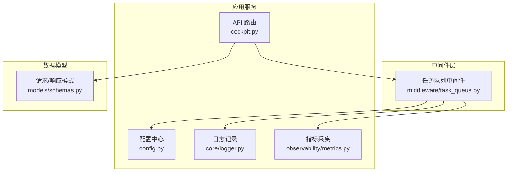
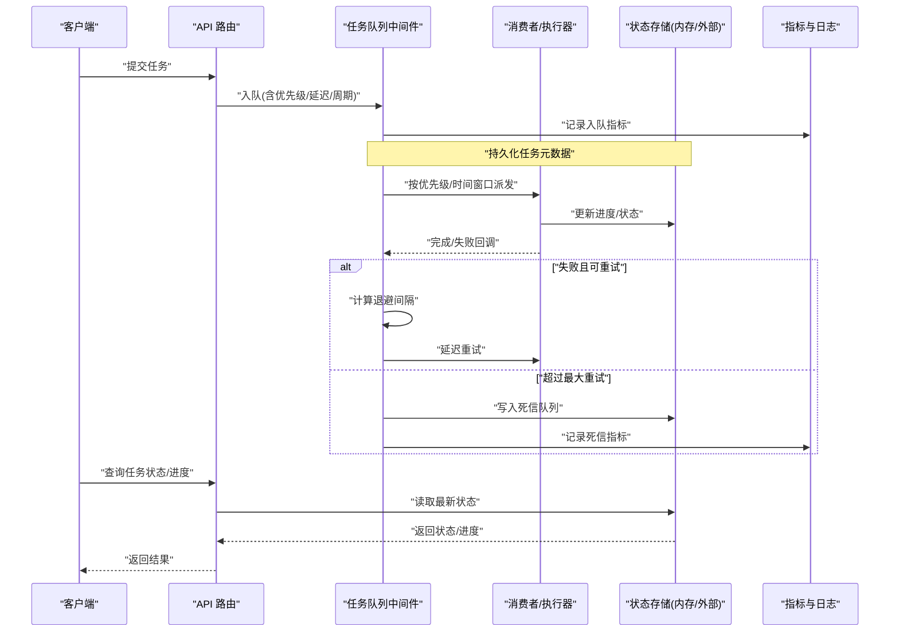
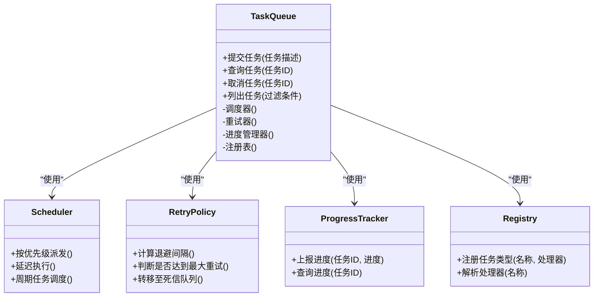
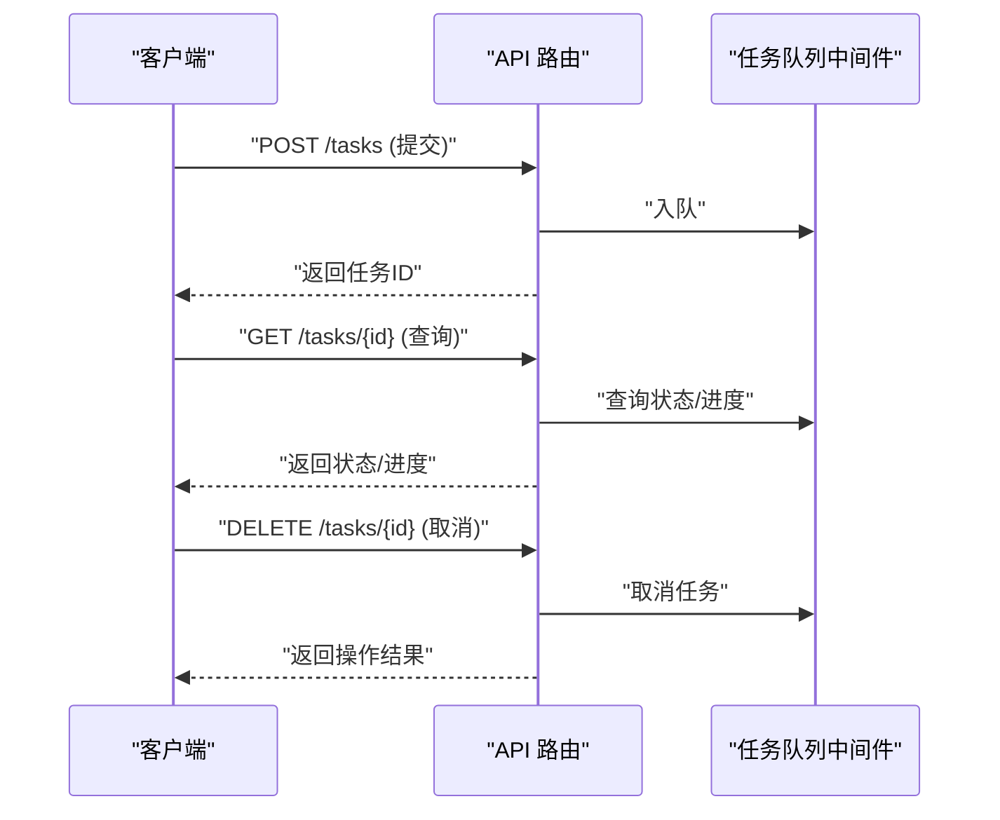
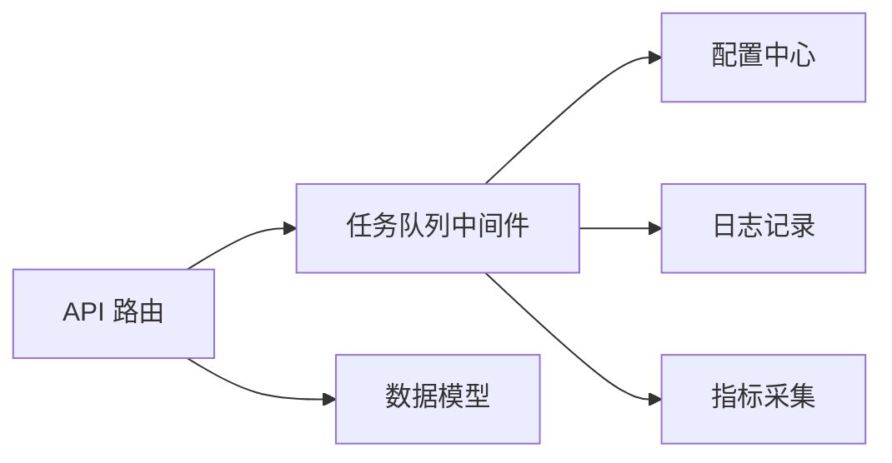

# 异步任务队列

<cite>
**本文引用的文件**   
- [backend_design/nexus/middleware/task_queue.py](file://backend_design/nexus/middleware/task_queue.py)
- [backend_design/nexus/api/routes/cockpit.py](file://backend_design/nexus/api/routes/cockpit.py)
- [backend_design/nexus/core/logger.py](file://backend_design/nexus/core/logger.py)
- [backend_design/nexus/config.py](file://backend_design/nexus/config.py)
- [backend_design/nexus/observability/metrics.py](file://backend_design/nexus/observability/metrics.py)
- [backend_design/nexus/models/schemas.py](file://backend_design/nexus/models/schemas.py)
</cite>

## 目录
1. [简介](#简介)
2. [项目结构](#项目结构)
3. [核心组件](#核心组件)
4. [架构总览](#架构总览)
5. [详细组件分析](#详细组件分析)
6. [依赖关系分析](#依赖关系分析)
7. [性能考虑](#性能考虑)
8. [故障排查指南](#故障排查指南)
9. [结论](#结论)
10. [附录：API 规范与最佳实践](#附录api-规范与最佳实践)

## 简介
本技术文档围绕“异步任务队列中间件”展开，聚焦以下目标：
- 任务调度机制：优先级、延迟执行、周期性任务
- 失败重试策略：指数退避、最大重试次数、死信队列
- 进度跟踪：实时状态查询与进度回调
- 生产者-消费者模型：消息序列化、负载均衡、水平扩展
- 任务类型注册：动态发现与插件式扩展
- 监控指标、性能调优参数、故障排查
- 任务提交、查询、管理的 API 接口规范与最佳实践

## 项目结构
本项目在 Python 后端中提供中间件层，其中任务队列相关实现位于 middleware 目录；API 路由通过 api/routes 暴露；配置与可观测性分别由 config 与 observability 模块提供。

图表来源
- [backend_design/nexus/api/routes/cockpit.py](file://backend_design/nexus/api/routes/cockpit.py)
- [backend_design/nexus/middleware/task_queue.py](file://backend_design/nexus/middleware/task_queue.py)
- [backend_design/nexus/core/logger.py](file://backend_design/nexus/core/logger.py)
- [backend_design/nexus/observability/metrics.py](file://backend_design/nexus/observability/metrics.py)
- [backend_design/nexus/config.py](file://backend_design/nexus/config.py)
- [backend_design/nexus/models/schemas.py](file://backend_design/nexus/models/schemas.py)

章节来源
- [backend_design/nexus/middleware/task_queue.py](file://backend_design/nexus/middleware/task_queue.py)
- [backend_design/nexus/api/routes/cockpit.py](file://backend_design/nexus/api/routes/cockpit.py)
- [backend_design/nexus/core/logger.py](file://backend_design/nexus/core/logger.py)
- [backend_design/nexus/config.py](file://backend_design/nexus/config.py)
- [backend_design/nexus/observability/metrics.py](file://backend_design/nexus/observability/metrics.py)
- [backend_design/nexus/models/schemas.py](file://backend_design/nexus/models/schemas.py)

## 核心组件
- 任务队列中间件：负责任务的入队、出队、调度、重试、进度上报与持久化（或内存）管理。
- API 路由：提供任务提交、查询、管理等 HTTP 接口。
- 配置中心：集中管理队列容量、并发度、重试策略等参数。
- 日志与指标：记录关键事件并暴露 Prometheus 兼容指标。
- 数据模型：定义任务提交与查询的请求/响应结构。

章节来源
- [backend_design/nexus/middleware/task_queue.py](file://backend_design/nexus/middleware/task_queue.py)
- [backend_design/nexus/api/routes/cockpit.py](file://backend_design/nexus/api/routes/cockpit.py)
- [backend_design/nexus/config.py](file://backend_design/nexus/config.py)
- [backend_design/nexus/observability/metrics.py](file://backend_design/nexus/observability/metrics.py)
- [backend_design/nexus/models/schemas.py](file://backend_design/nexus/models/schemas.py)

## 架构总览
下图展示了从 API 到任务队列的端到端流程，包括生产者-消费者、重试与死信、进度上报与指标采集。

图表来源
- [backend_design/nexus/api/routes/cockpit.py](file://backend_design/nexus/api/routes/cockpit.py)
- [backend_design/nexus/middleware/task_queue.py](file://backend_design/nexus/middleware/task_queue.py)
- [backend_design/nexus/observability/metrics.py](file://backend_design/nexus/observability/metrics.py)

## 详细组件分析

### 任务队列中间件（调度、重试、进度、注册表）
- 调度机制
  - 优先级：支持高优先任务先执行，避免长尾阻塞。
  - 延迟执行：支持指定未来时间点执行。
  - 周期性任务：支持固定间隔或 Cron 表达式触发。
- 失败重试策略
  - 指数退避：每次失败后等待时间按指数增长，降低瞬时压力。
  - 最大重试次数：超过阈值转入死信队列，避免无限重试。
  - 死信队列：用于人工介入与离线分析。
- 进度跟踪
  - 实时状态：支持查询任务当前阶段与百分比。
  - 进度回调：消费者主动上报进度，便于前端轮询或推送。
- 生产者-消费者模型
  - 消息序列化：统一的任务描述与上下文封装。
  - 负载均衡：多消费者实例共享队列，自动分配任务。
  - 水平扩展：增加消费者实例提升吞吐。
- 任务类型注册
  - 动态发现：基于装饰器或显式注册表加载处理器。
  - 插件式扩展：新增任务类型无需修改核心逻辑。

图表来源
- [backend_design/nexus/middleware/task_queue.py](file://backend_design/nexus/middleware/task_queue.py)

章节来源
- [backend_design/nexus/middleware/task_queue.py](file://backend_design/nexus/middleware/task_queue.py)

### API 路由（任务提交、查询、管理）
- 任务提交：接收任务描述、优先级、延迟/周期参数，调用中间件入队。
- 任务查询：根据任务 ID 或过滤条件返回状态与进度。
- 任务管理：支持取消、重放、查看死信列表等操作。

图表来源
- [backend_design/nexus/api/routes/cockpit.py](file://backend_design/nexus/api/routes/cockpit.py)
- [backend_design/nexus/middleware/task_queue.py](file://backend_design/nexus/middleware/task_queue.py)

章节来源
- [backend_design/nexus/api/routes/cockpit.py](file://backend_design/nexus/api/routes/cockpit.py)

### 配置与可观测性
- 配置项
  - 队列容量、消费者并发度、重试次数上限、退避基数与上限、死信保留策略等。
- 指标与日志
  - 入队/出队速率、失败率、重试次数、延迟分布、死信计数等。
  - 结构化日志包含任务 ID、类型、阶段、错误码等上下文。

章节来源
- [backend_design/nexus/config.py](file://backend_design/nexus/config.py)
- [backend_design/nexus/observability/metrics.py](file://backend_design/nexus/observability/metrics.py)
- [backend_design/nexus/core/logger.py](file://backend_design/nexus/core/logger.py)

### 数据模型（请求/响应）
- 任务提交请求：包含任务类型、参数、优先级、延迟/周期、回调地址等。
- 任务查询响应：包含任务 ID、状态、进度、错误信息、创建/更新时间等。
- 管理操作响应：包含操作结果与后续建议（如进入死信）。

章节来源
- [backend_design/nexus/models/schemas.py](file://backend_design/nexus/models/schemas.py)

## 依赖关系分析
- 低耦合：API 路由仅依赖中间件提供的稳定接口，不感知内部调度细节。
- 可观测性解耦：指标与日志通过独立模块注入，不影响核心流程。
- 配置驱动：所有可调参数集中在配置中心，便于环境差异化管理。

图表来源
- [backend_design/nexus/api/routes/cockpit.py](file://backend_design/nexus/api/routes/cockpit.py)
- [backend_design/nexus/middleware/task_queue.py](file://backend_design/nexus/middleware/task_queue.py)
- [backend_design/nexus/config.py](file://backend_design/nexus/config.py)
- [backend_design/nexus/core/logger.py](file://backend_design/nexus/core/logger.py)
- [backend_design/nexus/observability/metrics.py](file://backend_design/nexus/observability/metrics.py)
- [backend_design/nexus/models/schemas.py](file://backend_design/nexus/models/schemas.py)

章节来源
- [backend_design/nexus/api/routes/cockpit.py](file://backend_design/nexus/api/routes/cockpit.py)
- [backend_design/nexus/middleware/task_queue.py](file://backend_design/nexus/middleware/task_queue.py)
- [backend_design/nexus/config.py](file://backend_design/nexus/config.py)
- [backend_design/nexus/core/logger.py](file://backend_design/nexus/core/logger.py)
- [backend_design/nexus/observability/metrics.py](file://backend_design/nexus/observability/metrics.py)
- [backend_design/nexus/models/schemas.py](file://backend_design/nexus/models/schemas.py)

## 性能考虑
- 并发与吞吐
  - 调整消费者并发度以匹配 CPU/IO 特性，避免过度竞争导致抖动。
- 队列容量与背压
  - 合理设置队列容量，结合上游限流与降级策略，防止雪崩。
- 重试与退避
  - 指数退避需设置上限，避免长时间占用资源；对幂等任务启用去重。
- 进度上报频率
  - 控制上报粒度，平衡实时性与开销。
- 水平扩展
  - 多消费者实例共享队列，注意任务幂等与顺序要求。

[本节为通用指导，不涉及具体文件分析]

## 故障排查指南
- 常见问题定位
  - 任务堆积：检查消费者健康、队列容量、重试风暴。
  - 频繁失败：查看错误码与日志上下文，确认依赖服务可用性。
  - 进度不更新：核对进度上报路径与消费者实现。
- 诊断手段
  - 指标看板：关注入队/出队速率、失败率、重试次数、死信计数。
  - 日志检索：按任务 ID 追踪全链路日志。
  - 死信分析：导出死信任务进行离线复现。

章节来源
- [backend_design/nexus/core/logger.py](file://backend_design/nexus/core/logger.py)
- [backend_design/nexus/observability/metrics.py](file://backend_design/nexus/observability/metrics.py)

## 结论
该异步任务队列中间件通过清晰的调度、重试与进度跟踪机制，结合可观测性与配置驱动，提供了可扩展、易运维的异步处理能力。配合规范的 API 接口与最佳实践，可在复杂业务场景中稳定支撑高吞吐与高可靠需求。

[本节为总结性内容，不涉及具体文件分析]

## 附录：API 规范与最佳实践

### 接口规范
- 提交任务
  - 方法：POST
  - 路径：/tasks
  - 请求体：任务类型、参数、优先级、延迟/周期、回调地址等
  - 响应：任务 ID、入队状态
- 查询任务
  - 方法：GET
  - 路径：/tasks/{id}
  - 响应：任务状态、进度、错误信息、时间戳
- 取消任务
  - 方法：DELETE
  - 路径：/tasks/{id}
  - 响应：操作结果
- 管理接口（可选）
  - 列出任务、重放任务、查看死信列表等

章节来源
- [backend_design/nexus/api/routes/cockpit.py](file://backend_design/nexus/api/routes/cockpit.py)
- [backend_design/nexus/models/schemas.py](file://backend_design/nexus/models/schemas.py)

### 最佳实践
- 幂等设计：确保任务可重复执行而不产生副作用。
- 超时与熔断：对外部依赖设置超时与熔断，避免级联失败。
- 分级优先级：区分关键任务与普通任务，保障 SLA。
- 渐进式重试：结合指数退避与抖动，降低热点冲突。
- 进度上报：高频场景采用批量上报或增量上报。
- 监控告警：对失败率、延迟、死信数量设置阈值告警。

[本节为通用指导，不涉及具体文件分析]