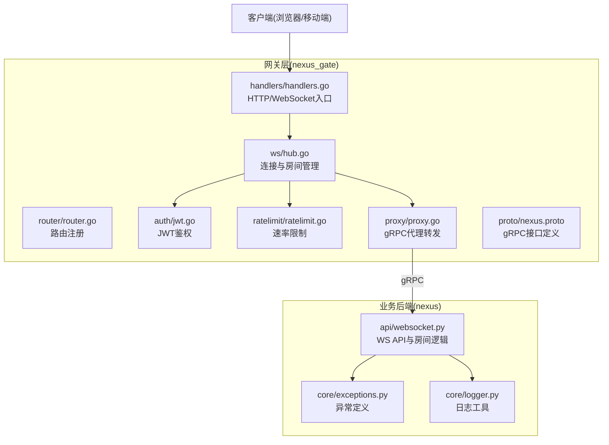
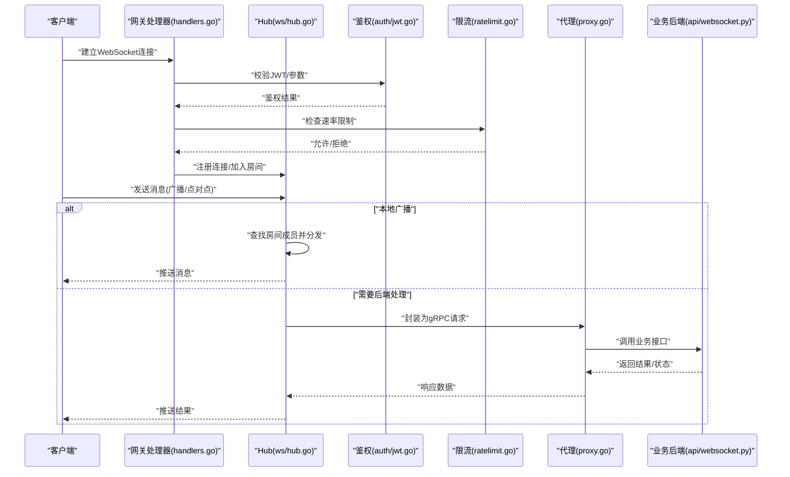
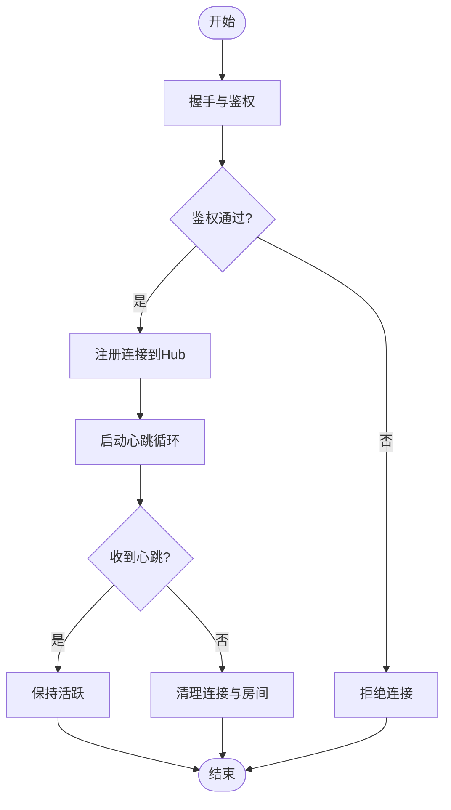
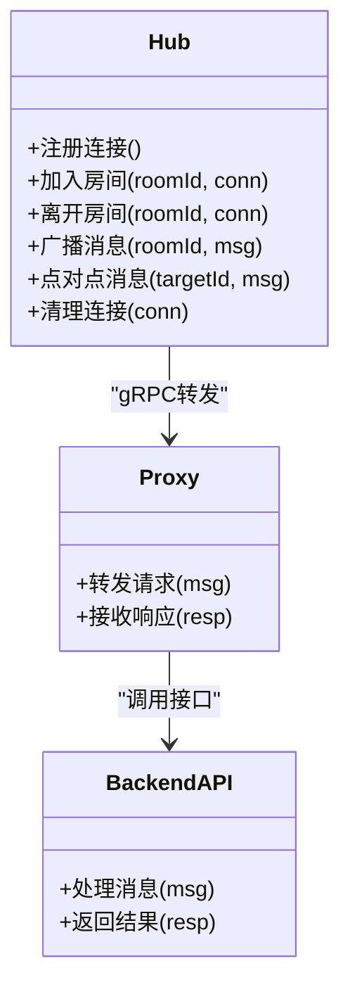
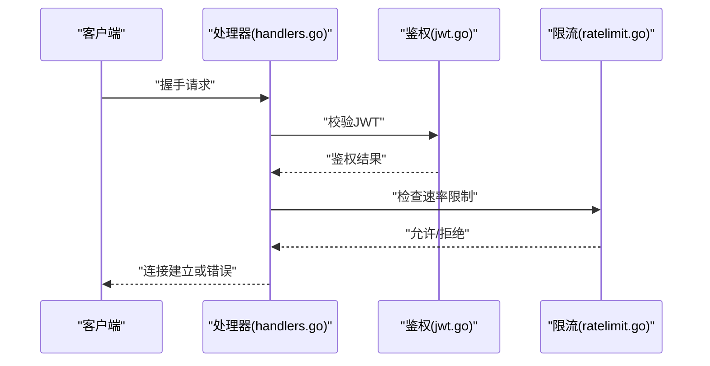
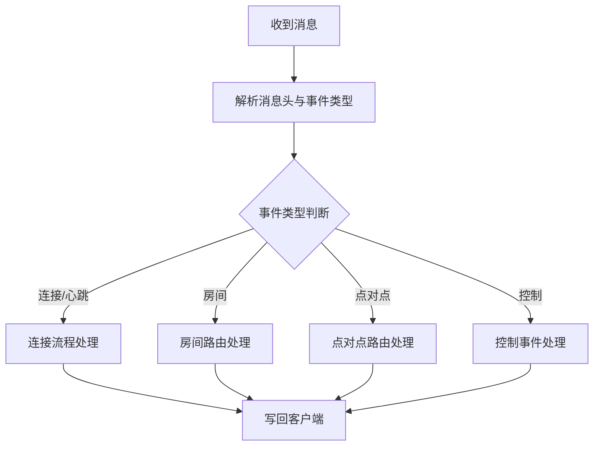
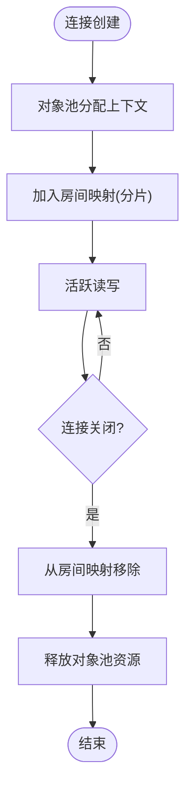
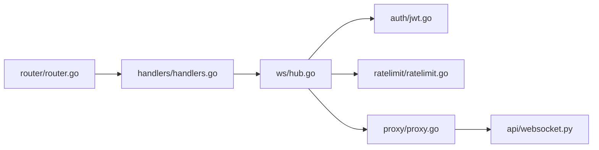

# WebSocket Hub

<cite>
**本文引用的文件**   
- [backend_design/nexus/api/websocket.py](file://backend_design/nexus/api/websocket.py)
- [backend_design/nexus_gate/internal/ws/hub.go](file://backend_design/nexus_gate/internal/ws/hub.go)
- [backend_design/nexus_gate/internal/handlers/handlers.go](file://backend_design/nexus_gate/internal/handlers/handlers.go)
- [backend_design/nexus_gate/internal/proxy/proxy.go](file://backend_design/nexus_gate/internal/proxy/proxy.go)
- [backend_design/nexus_gate/internal/auth/jwt.go](file://backend_design/nexus_gate/internal/auth/jwt.go)
- [backend_design/nexus_gate/internal/ratelimit/ratelimit.go](file://backend_design/nexus_gate/internal/ratelimit/ratelimit.go)
- [backend_design/nexus_gate/internal/router/router.go](file://backend_design/nexus_gate/internal/router/router.go)
- [backend_design/nexus_gate/proto/nexus.proto](file://backend_design/nexus_gate/proto/nexus.proto)
- [backend_design/nexus/core/exceptions.py](file://backend_design/nexus/core/exceptions.py)
- [backend_design/nexus/core/logger.py](file://backend_design/nexus/core/logger.py)
</cite>

## 目录
1. [简介](#简介)
2. [项目结构](#项目结构)
3. [核心组件](#核心组件)
4. [架构总览](#架构总览)
5. [详细组件分析](#详细组件分析)
6. [依赖关系分析](#依赖关系分析)
7. [性能考量](#性能考量)
8. [故障排查指南](#故障排查指南)
9. [结论](#结论)
10. [附录](#附录)

## 简介
本技术文档围绕WebSocket Hub系统，系统性阐述连接建立与维护、消息广播与点对点通信、房间管理与路由、状态同步、千级连接管理策略（内存优化、连接池复用、资源清理）、前后端通信协议（消息格式、事件类型、错误处理），以及实时通信的性能优化与故障排查方法。系统由网关层（Go）与业务后端（Python）组成：网关负责WebSocket接入、鉴权、限流、路由与跨进程转发；业务后端提供房间管理、消息分发、状态同步等能力。

## 项目结构
本项目采用分层与按功能域组织的方式：
- 网关层（nexus_gate）：实现WebSocket接入、鉴权、限流、路由、Redis桥接与gRPC转发。
- 业务后端（nexus）：提供WebSocket API、异常与日志基础设施、领域模型与中间件。
- 前端设计：Next.js应用，通过WebSocket与网关交互。

图表来源
- [backend_design/nexus_gate/internal/ws/hub.go](file://backend_design/nexus_gate/internal/ws/hub.go)
- [backend_design/nexus_gate/internal/handlers/handlers.go](file://backend_design/nexus_gate/internal/handlers/handlers.go)
- [backend_design/nexus_gate/internal/router/router.go](file://backend_design/nexus_gate/internal/router/router.go)
- [backend_design/nexus_gate/internal/auth/jwt.go](file://backend_design/nexus_gate/internal/auth/jwt.go)
- [backend_design/nexus_gate/internal/ratelimit/ratelimit.go](file://backend_design/nexus_gate/internal/ratelimit/ratelimit.go)
- [backend_design/nexus_gate/internal/proxy/proxy.go](file://backend_design/nexus_gate/internal/proxy/proxy.go)
- [backend_design/nexus_gate/proto/nexus.proto](file://backend_design/nexus_gate/proto/nexus.proto)
- [backend_design/nexus/api/websocket.py](file://backend_design/nexus/api/websocket.py)
- [backend_design/nexus/core/exceptions.py](file://backend_design/nexus/core/exceptions.py)
- [backend_design/nexus/core/logger.py](file://backend_design/nexus/core/logger.py)

章节来源
- [backend_design/nexus_gate/internal/ws/hub.go](file://backend_design/nexus_gate/internal/ws/hub.go)
- [backend_design/nexus_gate/internal/handlers/handlers.go](file://backend_design/nexus_gate/internal/handlers/handlers.go)
- [backend_design/nexus_gate/internal/router/router.go](file://backend_design/nexus_gate/internal/router/router.go)
- [backend_design/nexus_gate/internal/auth/jwt.go](file://backend_design/nexus_gate/internal/auth/jwt.go)
- [backend_design/nexus_gate/internal/ratelimit/ratelimit.go](file://backend_design/nexus_gate/internal/ratelimit/ratelimit.go)
- [backend_design/nexus_gate/internal/proxy/proxy.go](file://backend_design/nexus_gate/internal/proxy/proxy.go)
- [backend_design/nexus_gate/proto/nexus.proto](file://backend_design/nexus_gate/proto/nexus.proto)
- [backend_design/nexus/api/websocket.py](file://backend_design/nexus/api/websocket.py)
- [backend_design/nexus/core/exceptions.py](file://backend_design/nexus/core/exceptions.py)
- [backend_design/nexus/core/logger.py](file://backend_design/nexus/core/logger.py)

## 核心组件
- WebSocket Hub（网关层）
  - 职责：维护连接集合、房间映射、心跳检测、断线重连引导、消息广播与点对点路由、与业务后端的gRPC转发。
  - 关键能力：连接生命周期管理、房间加入/离开、消息分发、资源回收。
- 鉴权与限流
  - JWT鉴权：在握手阶段校验令牌，拒绝非法连接。
  - 速率限制：基于IP或用户维度限制消息频率，防止滥用。
- gRPC代理
  - 将WebSocket消息转换为gRPC请求，转发至业务后端；接收响应后写回客户端。
- 业务后端WebSocket API
  - 房间管理、消息路由、状态同步、错误码与日志输出。

章节来源
- [backend_design/nexus_gate/internal/ws/hub.go](file://backend_design/nexus_gate/internal/ws/hub.go)
- [backend_design/nexus_gate/internal/auth/jwt.go](file://backend_design/nexus_gate/internal/auth/jwt.go)
- [backend_design/nexus_gate/internal/ratelimit/ratelimit.go](file://backend_design/nexus_gate/internal/ratelimit/ratelimit.go)
- [backend_design/nexus_gate/internal/proxy/proxy.go](file://backend_design/nexus_gate/internal/proxy/proxy.go)
- [backend_design/nexus/api/websocket.py](file://backend_design/nexus/api/websocket.py)

## 架构总览
整体流程：客户端通过WebSocket连接到网关，完成握手与鉴权；随后进入房间或发起点对点通信；网关根据消息类型进行本地广播或经gRPC转发到业务后端；业务后端返回结果，网关再推送给目标客户端。

图表来源
- [backend_design/nexus_gate/internal/handlers/handlers.go](file://backend_design/nexus_gate/internal/handlers/handlers.go)
- [backend_design/nexus_gate/internal/ws/hub.go](file://backend_design/nexus_gate/internal/ws/hub.go)
- [backend_design/nexus_gate/internal/auth/jwt.go](file://backend_design/nexus_gate/internal/auth/jwt.go)
- [backend_design/nexus_gate/internal/ratelimit/ratelimit.go](file://backend_design/nexus_gate/internal/ratelimit/ratelimit.go)
- [backend_design/nexus_gate/internal/proxy/proxy.go](file://backend_design/nexus_gate/internal/proxy/proxy.go)
- [backend_design/nexus/api/websocket.py](file://backend_design/nexus/api/websocket.py)

## 详细组件分析

### 连接建立与维护机制
- 握手协议
  - 客户端发起WebSocket升级请求，携带认证信息（如JWT）。
  - 网关处理器解析请求，调用鉴权模块验证令牌有效性。
  - 鉴权通过后，创建连接上下文并注册到Hub。
- 心跳检测
  - 网关侧周期性发送心跳帧，客户端需回复心跳确认。
  - 若超时未收到心跳，视为连接失效，触发清理流程。
- 断线重连
  - 客户端检测到断开后，按指数退避策略重试连接。
  - 重连时携带上次会话标识，以便恢复房间与状态。

图表来源
- [backend_design/nexus_gate/internal/handlers/handlers.go](file://backend_design/nexus_gate/internal/handlers/handlers.go)
- [backend_design/nexus_gate/internal/ws/hub.go](file://backend_design/nexus_gate/internal/ws/hub.go)
- [backend_design/nexus_gate/internal/auth/jwt.go](file://backend_design/nexus_gate/internal/auth/jwt.go)

章节来源
- [backend_design/nexus_gate/internal/handlers/handlers.go](file://backend_design/nexus_gate/internal/handlers/handlers.go)
- [backend_design/nexus_gate/internal/ws/hub.go](file://backend_design/nexus_gate/internal/ws/hub.go)
- [backend_design/nexus_gate/internal/auth/jwt.go](file://backend_design/nexus_gate/internal/auth/jwt.go)

### 消息广播与点对点通信
- 房间管理
  - 连接加入房间时，Hub维护房间到连接的映射。
  - 离开房间时从映射中移除，避免无效投递。
- 消息路由
  - 广播消息：根据房间ID定位所有成员，逐条写入。
  - 点对点消息：根据目标连接ID直接投递。
- 状态同步
  - 对需要一致性的状态变更，经gRPC转发到业务后端，由后端计算并广播最新状态。

图表来源
- [backend_design/nexus_gate/internal/ws/hub.go](file://backend_design/nexus_gate/internal/ws/hub.go)
- [backend_design/nexus_gate/internal/proxy/proxy.go](file://backend_design/nexus_gate/internal/proxy/proxy.go)
- [backend_design/nexus/api/websocket.py](file://backend_design/nexus/api/websocket.py)

章节来源
- [backend_design/nexus_gate/internal/ws/hub.go](file://backend_design/nexus_gate/internal/ws/hub.go)
- [backend_design/nexus_gate/internal/proxy/proxy.go](file://backend_design/nexus_gate/internal/proxy/proxy.go)
- [backend_design/nexus/api/websocket.py](file://backend_design/nexus/api/websocket.py)

### 鉴权与限流
- JWT鉴权
  - 在握手阶段解析令牌，校验签名与过期时间。
  - 失败则拒绝连接并记录日志。
- 速率限制
  - 基于IP或用户维度统计单位时间内消息数量。
  - 超过阈值则拒绝或延迟处理，保护后端稳定性。

图表来源
- [backend_design/nexus_gate/internal/handlers/handlers.go](file://backend_design/nexus_gate/internal/handlers/handlers.go)
- [backend_design/nexus_gate/internal/auth/jwt.go](file://backend_design/nexus_gate/internal/auth/jwt.go)
- [backend_design/nexus_gate/internal/ratelimit/ratelimit.go](file://backend_design/nexus_gate/internal/ratelimit/ratelimit.go)

章节来源
- [backend_design/nexus_gate/internal/auth/jwt.go](file://backend_design/nexus_gate/internal/auth/jwt.go)
- [backend_design/nexus_gate/internal/ratelimit/ratelimit.go](file://backend_design/nexus_gate/internal/ratelimit/ratelimit.go)
- [backend_design/nexus_gate/internal/handlers/handlers.go](file://backend_design/nexus_gate/internal/handlers/handlers.go)

### 前后端WebSocket通信协议
- 消息格式
  - 统一JSON结构，包含事件类型、载荷、目标标识（房间或用户）、时间戳等字段。
- 事件类型
  - 连接事件：握手、心跳、重连。
  - 房间事件：加入、离开、广播。
  - 点对点事件：私聊、状态同步。
  - 控制事件：错误、告警、配置更新。
- 错误处理
  - 网关层返回标准错误码与简要描述。
  - 业务后端通过gRPC返回结构化错误，网关转换为WebSocket错误事件。

图表来源
- [backend_design/nexus_gate/internal/ws/hub.go](file://backend_design/nexus_gate/internal/ws/hub.go)
- [backend_design/nexus_gate/internal/proxy/proxy.go](file://backend_design/nexus_gate/internal/proxy/proxy.go)
- [backend_design/nexus/api/websocket.py](file://backend_design/nexus/api/websocket.py)

章节来源
- [backend_design/nexus_gate/internal/ws/hub.go](file://backend_design/nexus_gate/internal/ws/hub.go)
- [backend_design/nexus_gate/internal/proxy/proxy.go](file://backend_design/nexus_gate/internal/proxy/proxy.go)
- [backend_design/nexus/api/websocket.py](file://backend_design/nexus/api/websocket.py)

### 千级连接管理策略
- 内存优化
  - 使用对象池复用连接上下文与消息缓冲区，减少GC压力。
  - 房间映射采用分片哈希，降低锁竞争。
- 连接池复用
  - 对短连接场景，复用底层TCP连接与goroutine。
- 资源清理
  - 连接关闭时，立即从房间映射中移除，释放缓冲区与定时器。
  - 定期扫描僵尸连接，强制清理。

图表来源
- [backend_design/nexus_gate/internal/ws/hub.go](file://backend_design/nexus_gate/internal/ws/hub.go)

章节来源
- [backend_design/nexus_gate/internal/ws/hub.go](file://backend_design/nexus_gate/internal/ws/hub.go)

## 依赖关系分析
- 组件耦合
  - Hub依赖鉴权与限流模块，确保接入安全与稳定。
  - Hub通过Proxy与业务后端解耦，便于横向扩展。
- 外部依赖
  - Redis用于分布式限流与会话共享（可选）。
  - gRPC用于网关与后端的高效通信。
- 潜在循环依赖
  - 当前设计无循环依赖，Hub仅单向调用鉴权、限流与代理。

图表来源
- [backend_design/nexus_gate/internal/ws/hub.go](file://backend_design/nexus_gate/internal/ws/hub.go)
- [backend_design/nexus_gate/internal/auth/jwt.go](file://backend_design/nexus_gate/internal/auth/jwt.go)
- [backend_design/nexus_gate/internal/ratelimit/ratelimit.go](file://backend_design/nexus_gate/internal/ratelimit/ratelimit.go)
- [backend_design/nexus_gate/internal/proxy/proxy.go](file://backend_design/nexus_gate/internal/proxy/proxy.go)
- [backend_design/nexus/api/websocket.py](file://backend_design/nexus/api/websocket.py)
- [backend_design/nexus_gate/internal/router/router.go](file://backend_design/nexus_gate/internal/router/router.go)
- [backend_design/nexus_gate/internal/handlers/handlers.go](file://backend_design/nexus_gate/internal/handlers/handlers.go)

章节来源
- [backend_design/nexus_gate/internal/ws/hub.go](file://backend_design/nexus_gate/internal/ws/hub.go)
- [backend_design/nexus_gate/internal/auth/jwt.go](file://backend_design/nexus_gate/internal/auth/jwt.go)
- [backend_design/nexus_gate/internal/ratelimit/ratelimit.go](file://backend_design/nexus_gate/internal/ratelimit/ratelimit.go)
- [backend_design/nexus_gate/internal/proxy/proxy.go](file://backend_design/nexus_gate/internal/proxy/proxy.go)
- [backend_design/nexus/api/websocket.py](file://backend_design/nexus/api/websocket.py)
- [backend_design/nexus_gate/internal/router/router.go](file://backend_design/nexus_gate/internal/router/router.go)
- [backend_design/nexus_gate/internal/handlers/handlers.go](file://backend_design/nexus_gate/internal/handlers/handlers.go)

## 性能考量
- 连接与消息路径优化
  - 批量写入与零拷贝缓冲，减少系统调用开销。
  - 房间广播采用并行扇出，结合背压控制避免拥塞。
- 鉴权与限流
  - 缓存鉴权结果，降低重复校验成本。
  - 滑动窗口限流，平滑突发流量。
- 资源管理
  - 对象池与内存池复用，降低GC频率。
  - 定时任务清理空闲连接与过期房间。
- 可观测性
  - 指标采集：连接数、消息吞吐、延迟分布、错误率。
  - 日志聚合：关键路径打点，便于问题定位。

[本节为通用性能指导，不直接分析具体文件]

## 故障排查指南
- 常见问题
  - 握手失败：检查JWT签名与过期时间、网络可达性与证书配置。
  - 心跳超时：确认客户端心跳实现与网关超时阈值匹配。
  - 消息丢失：检查房间映射一致性、gRPC链路健康与后端负载。
- 诊断步骤
  - 查看网关日志与指标，定位异常连接与高延迟节点。
  - 复现问题并抓取WebSocket抓包，分析消息序列与错误事件。
  - 检查限流策略是否误伤正常流量。
- 错误处理
  - 网关层统一错误码与描述，便于前端展示与重试策略。
  - 业务后端抛出结构化异常，网关转换为WebSocket错误事件。

章节来源
- [backend_design/nexus/core/exceptions.py](file://backend_design/nexus/core/exceptions.py)
- [backend_design/nexus/core/logger.py](file://backend_design/nexus/core/logger.py)

## 结论
WebSocket Hub通过网关与业务后端的清晰分层，实现了高并发、可扩展的实时通信能力。鉴权与限流保障接入安全，房间管理与消息路由支撑广播与点对点场景，对象池与资源清理策略满足千级连接需求。配合完善的错误处理与可观测性，系统具备良好的稳定性与可维护性。

[本节为总结性内容，不直接分析具体文件]

## 附录
- gRPC接口定义参考
  - 接口契约与消息结构详见proto文件，用于网关与后端之间的标准化通信。

章节来源
- [backend_design/nexus_gate/proto/nexus.proto](file://backend_design/nexus_gate/proto/nexus.proto)