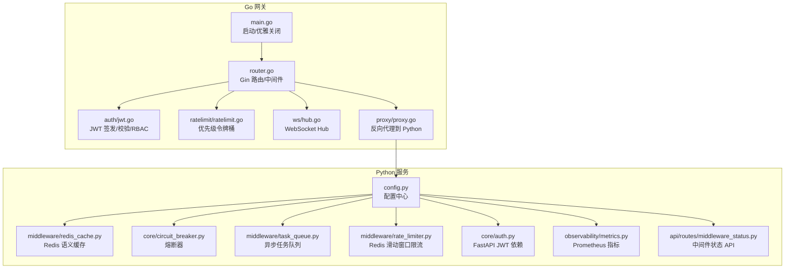
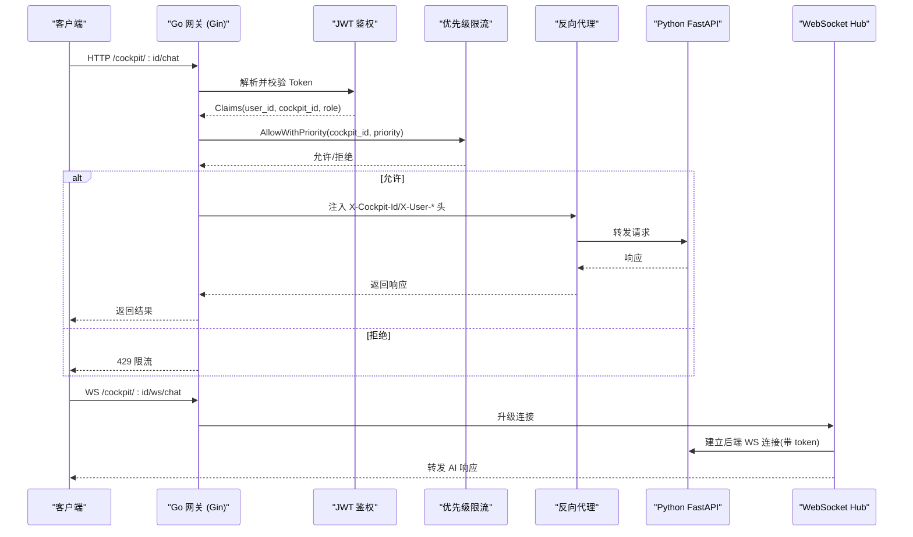
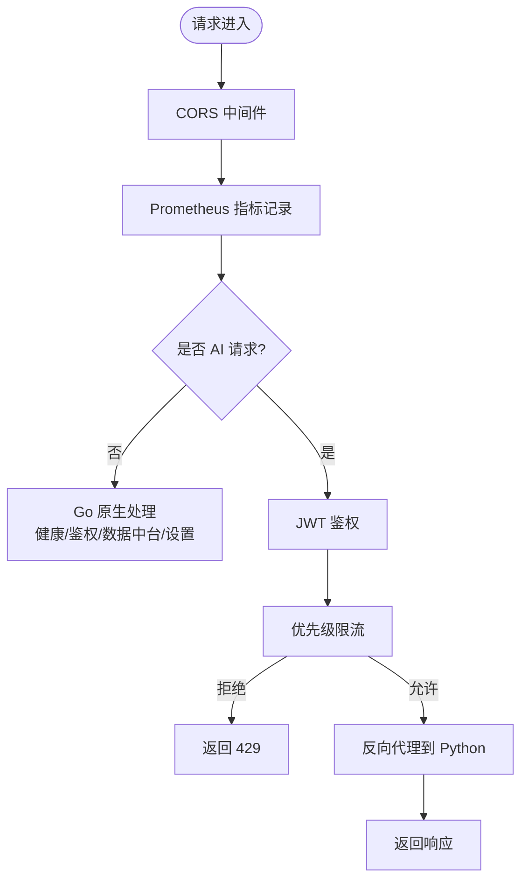
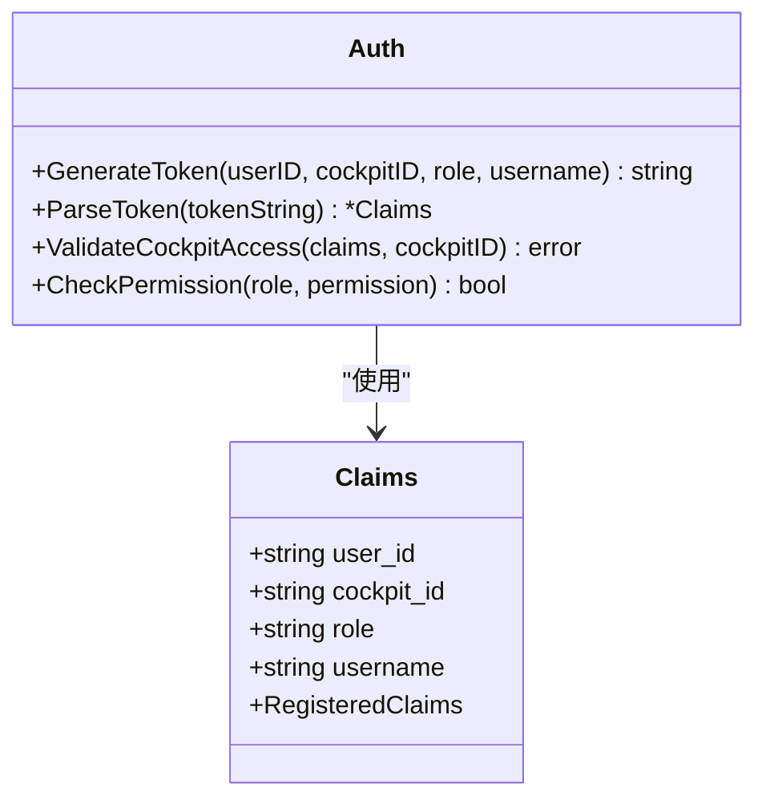
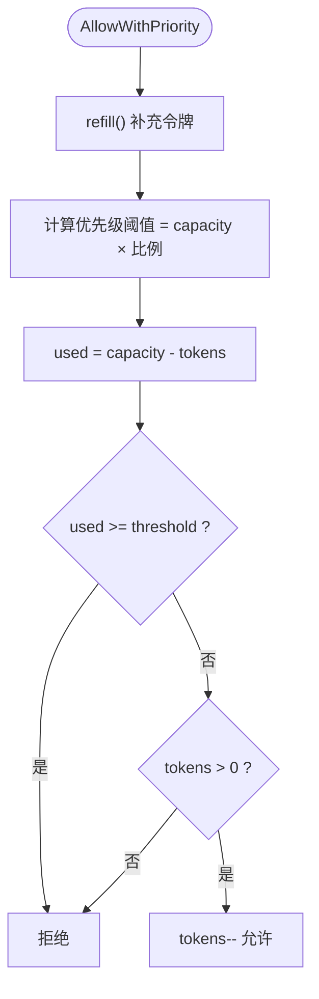
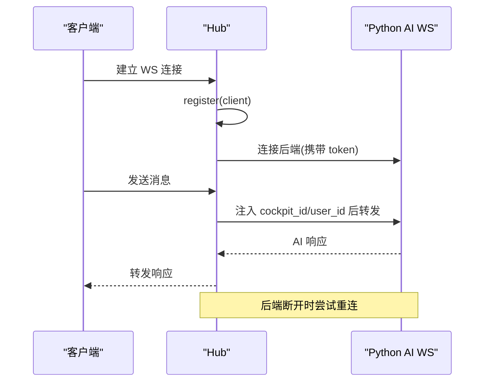
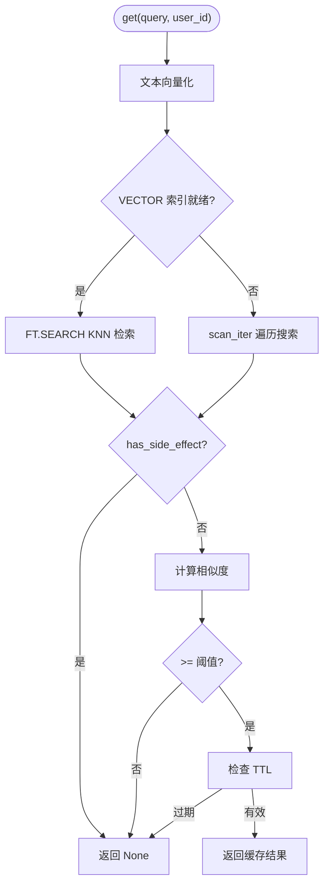
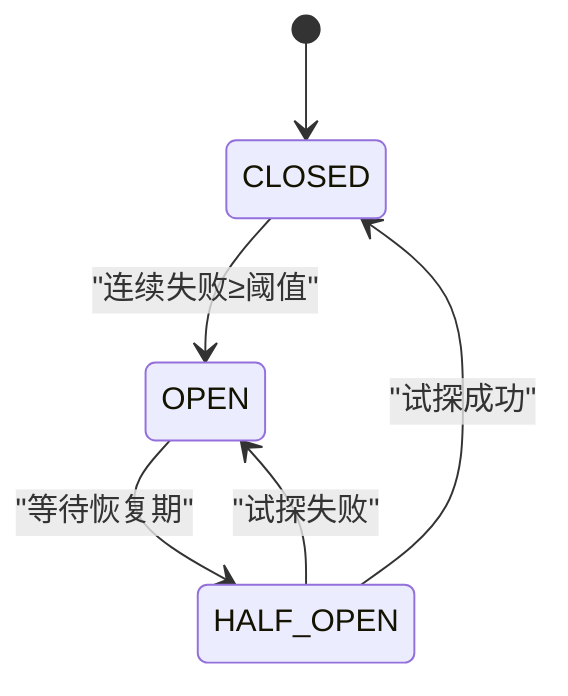
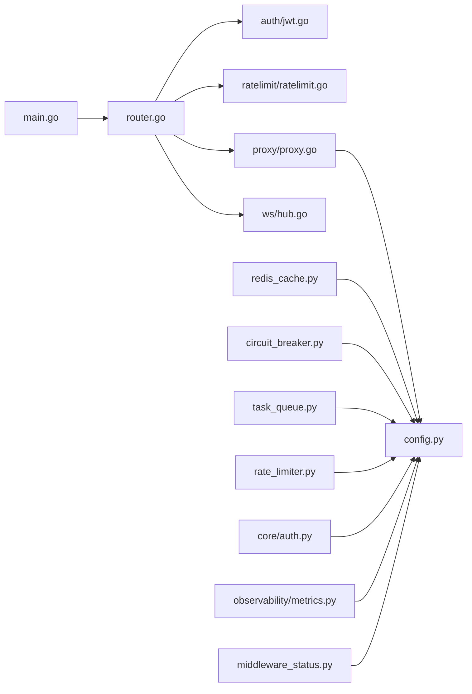

# 网关与中间件

<cite>
**本文引用的文件列表**
- [backend_design/nexus_gate/cmd/main.go](file://backend_design/nexus_gate/cmd/main.go)
- [backend_design/nexus_gate/internal/router/router.go](file://backend_design/nexus_gate/internal/router/router.go)
- [backend_design/nexus_gate/internal/auth/jwt.go](file://backend_design/nexus_gate/internal/auth/jwt.go)
- [backend_design/nexus_gate/internal/ratelimit/ratelimit.go](file://backend_design/nexus_gate/internal/ratelimit/ratelimit.go)
- [backend_design/nexus_gate/internal/ws/hub.go](file://backend_design/nexus_gate/internal/ws/hub.go)
- [backend_design/nexus_gate/internal/proxy/proxy.go](file://backend_design/nexus_gate/internal/proxy/proxy.go)
- [backend_design/nexus/middleware/redis_cache.py](file://backend_design/nexus/middleware/redis_cache.py)
- [backend_design/nexus/core/circuit_breaker.py](file://backend_design/nexus/core/circuit_breaker.py)
- [backend_design/nexus/middleware/task_queue.py](file://backend_design/nexus/middleware/task_queue.py)
- [backend_design/nexus/config.py](file://backend_design/nexus/config.py)
- [backend_design/nexus/middleware/rate_limiter.py](file://backend_design/nexus/middleware/rate_limiter.py)
- [backend_design/nexus/core/auth.py](file://backend_design/nexus/core/auth.py)
- [backend_design/nexus/observability/metrics.py](file://backend_design/nexus/observability/metrics.py)
- [backend_design/nexus/api/routes/middleware_status.py](file://backend_design/nexus/api/routes/middleware_status.py)
</cite>

## 目录
1. [简介](#简介)
2. [项目结构](#项目结构)
3. [核心组件](#核心组件)
4. [架构总览](#架构总览)
5. [详细组件分析](#详细组件分析)
6. [依赖关系分析](#依赖关系分析)
7. [性能考量](#性能考量)
8. [故障排查指南](#故障排查指南)
9. [结论](#结论)
10. [附录](#附录)

## 简介
本技术文档聚焦于 NexusCockpit 的 Go 网关与 Python 侧中间件系统，覆盖以下关键主题：
- Go 网关的高并发处理、请求路由与负载均衡机制
- JWT 鉴权（令牌签发、验证、座舱访问控制）
- 优先级限流算法（滑动窗口与令牌桶）
- WebSocket Hub 的连接管理与消息广播
- Python 侧中间件：Redis 语义缓存、熔断器、异步任务队列
- 网关与服务的可观测性与故障排查

## 项目结构
NexusCockpit 采用“Go 网关 + Python FastAPI 服务”的双语言架构。Go 网关负责高并发接入、鉴权、限流、WebSocket 转发；Python 服务承载 AI 能力、RAG、记忆、车控等复杂业务逻辑。

图表来源
- [backend_design/nexus_gate/cmd/main.go:30-87](file://backend_design/nexus_gate/cmd/main.go#L30-L87)
- [backend_design/nexus_gate/internal/router/router.go:56-200](file://backend_design/nexus_gate/internal/router/router.go#L56-L200)
- [backend_design/nexus_gate/internal/auth/jwt.go:28-85](file://backend_design/nexus_gate/internal/auth/jwt.go#L28-L85)
- [backend_design/nexus_gate/internal/ratelimit/ratelimit.go:111-178](file://backend_design/nexus_gate/internal/ratelimit/ratelimit.go#L111-L178)
- [backend_design/nexus_gate/internal/ws/hub.go:54-136](file://backend_design/nexus_gate/internal/ws/hub.go#L54-L136)
- [backend_design/nexus_gate/internal/proxy/proxy.go:21-53](file://backend_design/nexus_gate/internal/proxy/proxy.go#L21-L53)
- [backend_design/nexus/config.py:601-673](file://backend_design/nexus/config.py#L601-L673)
- [backend_design/nexus/middleware/redis_cache.py:55-111](file://backend_design/nexus/middleware/redis_cache.py#L55-L111)
- [backend_design/nexus/core/circuit_breaker.py:47-95](file://backend_design/nexus/core/circuit_breaker.py#L47-L95)
- [backend_design/nexus/middleware/task_queue.py:37-80](file://backend_design/nexus/middleware/task_queue.py#L37-L80)
- [backend_design/nexus/middleware/rate_limiter.py:63-110](file://backend_design/nexus/middleware/rate_limiter.py#L63-L110)
- [backend_design/nexus/core/auth.py:36-84](file://backend_design/nexus/core/auth.py#L36-L84)
- [backend_design/nexus/observability/metrics.py:14-113](file://backend_design/nexus/observability/metrics.py#L14-L113)
- [backend_design/nexus/api/routes/middleware_status.py:26-41](file://backend_design/nexus/api/routes/middleware_status.py#L26-L41)

章节来源
- [backend_design/nexus_gate/cmd/main.go:30-87](file://backend_design/nexus_gate/cmd/main.go#L30-L87)
- [backend_design/nexus_gate/internal/router/router.go:56-200](file://backend_design/nexus_gate/internal/router/router.go#L56-L200)

## 核心组件
- Go 网关入口与生命周期管理：解析参数、加载配置、初始化代理、启动 Hub、创建限流器、注册路由、监听端口、优雅关闭。
- Gin 路由与中间件：CORS、Prometheus 指标、可选/强制鉴权、角色校验、优先级限流、反向代理。
- JWT 鉴权：Claims 模型、签发、解析、座舱访问校验、RBAC 权限映射。
- 优先级限流：按座舱独立令牌桶 + 全局限流，支持高/普通/低三级优先级配额。
- WebSocket Hub：连接注册/注销、按座舱广播、后端连接转发、心跳保活、错误回退。
- Python 中间件：Redis 语义缓存（向量检索）、熔断器、异步任务队列、Redis 滑动窗口限流、FastAPI JWT 依赖、Prometheus 指标、中间件状态 API。

章节来源
- [backend_design/nexus_gate/cmd/main.go:30-87](file://backend_design/nexus_gate/cmd/main.go#L30-L87)
- [backend_design/nexus_gate/internal/router/router.go:56-200](file://backend_design/nexus_gate/internal/router/router.go#L56-L200)
- [backend_design/nexus_gate/internal/auth/jwt.go:28-85](file://backend_design/nexus_gate/internal/auth/jwt.go#L28-L85)
- [backend_design/nexus_gate/internal/ratelimit/ratelimit.go:111-178](file://backend_design/nexus_gate/internal/ratelimit/ratelimit.go#L111-L178)
- [backend_design/nexus_gate/internal/ws/hub.go:54-136](file://backend_design/nexus_gate/internal/ws/hub.go#L54-L136)
- [backend_design/nexus/middleware/redis_cache.py:55-111](file://backend_design/nexus/middleware/redis_cache.py#L55-L111)
- [backend_design/nexus/core/circuit_breaker.py:47-95](file://backend_design/nexus/core/circuit_breaker.py#L47-L95)
- [backend_design/nexus/middleware/task_queue.py:37-80](file://backend_design/nexus/middleware/task_queue.py#L37-L80)
- [backend_design/nexus/middleware/rate_limiter.py:63-110](file://backend_design/nexus/middleware/rate_limiter.py#L63-L110)
- [backend_design/nexus/core/auth.py:36-84](file://backend_design/nexus/core/auth.py#L36-L84)
- [backend_design/nexus/observability/metrics.py:14-113](file://backend_design/nexus/observability/metrics.py#L14-L113)
- [backend_design/nexus/api/routes/middleware_status.py:26-41](file://backend_design/nexus/api/routes/middleware_status.py#L26-L41)

## 架构总览
Go 网关作为统一入口，承担安全与流量治理职责；Python 服务提供 AI 与数据能力。两者通过 HTTP 反向代理与 WebSocket 双向通道协作。

图表来源
- [backend_design/nexus_gate/internal/router/router.go:160-198](file://backend_design/nexus_gate/internal/router/router.go#L160-L198)
- [backend_design/nexus_gate/internal/auth/jwt.go:49-85](file://backend_design/nexus_gate/internal/auth/jwt.go#L49-L85)
- [backend_design/nexus_gate/internal/ratelimit/ratelimit.go:130-157](file://backend_design/nexus_gate/internal/ratelimit/ratelimit.go#L130-L157)
- [backend_design/nexus_gate/internal/proxy/proxy.go:31-52](file://backend_design/nexus_gate/internal/proxy/proxy.go#L31-L52)
- [backend_design/nexus_gate/internal/ws/hub.go:137-177](file://backend_design/nexus_gate/internal/ws/hub.go#L137-L177)

## 详细组件分析

### Go 网关：高并发与请求路由
- 高并发处理：基于 Gin 框架，配合协程与 channel 实现非阻塞 I/O；WebSocket Hub 使用 goroutine 管理读写泵与广播。
- 请求路由：按路径区分 Go 原生处理与 AI 转发；对需要 AI 的路由统一经反向代理转发至 Python。
- 负载均衡：当前为单主机反向代理，未实现多实例轮询；可通过外部 LB 或上游多实例扩展。

图表来源
- [backend_design/nexus_gate/internal/router/router.go:68-127](file://backend_design/nexus_gate/internal/router/router.go#L68-L127)
- [backend_design/nexus_gate/internal/router/router.go:158-198](file://backend_design/nexus_gate/internal/router/router.go#L158-L198)
- [backend_design/nexus_gate/internal/proxy/proxy.go:21-53](file://backend_design/nexus_gate/internal/proxy/proxy.go#L21-L53)

章节来源
- [backend_design/nexus_gate/cmd/main.go:30-87](file://backend_design/nexus_gate/cmd/main.go#L30-L87)
- [backend_design/nexus_gate/internal/router/router.go:56-200](file://backend_design/nexus_gate/internal/router/router.go#L56-L200)
- [backend_design/nexus_gate/internal/proxy/proxy.go:21-53](file://backend_design/nexus_gate/internal/proxy/proxy.go#L21-L53)

### JWT 鉴权机制（Go 侧）
- 令牌签发：根据用户 ID、座舱 ID、角色与用户名生成 HS256 签名令牌，包含过期时间与签发者信息。
- 令牌验证：从 Authorization 头提取 Bearer Token，校验签名与有效期，解析 Claims。
- 座舱访问控制：super_admin 可访问所有座舱，其他角色仅能访问绑定的座舱。
- RBAC 权限：内置角色与权限映射，用于接口级权限控制。

图表来源
- [backend_design/nexus_gate/internal/auth/jwt.go:19-85](file://backend_design/nexus_gate/internal/auth/jwt.go#L19-L85)
- [backend_design/nexus_gate/internal/auth/jwt.go:87-124](file://backend_design/nexus_gate/internal/auth/jwt.go#L87-L124)

章节来源
- [backend_design/nexus_gate/internal/auth/jwt.go:28-85](file://backend_design/nexus_gate/internal/auth/jwt.go#L28-L85)
- [backend_design/nexus_gate/internal/auth/jwt.go:87-124](file://backend_design/nexus_gate/internal/auth/jwt.go#L87-L124)
- [backend_design/nexus_gate/internal/router/router.go:238-288](file://backend_design/nexus_gate/internal/router/router.go#L238-L288)

### 优先级限流算法（Go 侧：令牌桶）
- 设计要点：每个座舱独立令牌桶，全局桶容量为座舱上限的三倍；按优先级限制可用令牌比例（高=100%，普通=80%，低=50%）。
- 算法流程：每次请求先补充令牌，再检查该优先级是否超过配额阈值，最后尝试扣减令牌。
- 监控：暴露各座舱与全局可用令牌数，便于数据中台展示。

图表来源
- [backend_design/nexus_gate/internal/ratelimit/ratelimit.go:61-101](file://backend_design/nexus_gate/internal/ratelimit/ratelimit.go#L61-L101)
- [backend_design/nexus_gate/internal/ratelimit/ratelimit.go:130-157](file://backend_design/nexus_gate/internal/ratelimit/ratelimit.go#L130-L157)
- [backend_design/nexus_gate/internal/ratelimit/ratelimit.go:159-178](file://backend_design/nexus_gate/internal/ratelimit/ratelimit.go#L159-L178)

章节来源
- [backend_design/nexus_gate/internal/ratelimit/ratelimit.go:111-178](file://backend_design/nexus_gate/internal/ratelimit/ratelimit.go#L111-L178)
- [backend_design/nexus_gate/internal/router/router.go:388-424](file://backend_design/nexus_gate/internal/router/router.go#L388-L424)

### WebSocket Hub 连接管理与消息广播
- 连接管理：Hub 维护按座舱分组的客户端集合，支持注册/注销与统计查询。
- 消息广播：向指定座舱的所有客户端广播消息；发送失败时自动清理连接。
- 后端转发：将客户端消息注入上下文后转发到 Python AI WebSocket，并将 AI 响应回传客户端；具备重连与错误提示。

图表来源
- [backend_design/nexus_gate/internal/ws/hub.go:64-108](file://backend_design/nexus_gate/internal/ws/hub.go#L64-L108)
- [backend_design/nexus_gate/internal/ws/hub.go:137-177](file://backend_design/nexus_gate/internal/ws/hub.go#L137-L177)
- [backend_design/nexus_gate/internal/ws/hub.go:205-232](file://backend_design/nexus_gate/internal/ws/hub.go#L205-L232)
- [backend_design/nexus_gate/internal/ws/hub.go:260-310](file://backend_design/nexus_gate/internal/ws/hub.go#L260-L310)

章节来源
- [backend_design/nexus_gate/internal/ws/hub.go:54-136](file://backend_design/nexus_gate/internal/ws/hub.go#L54-L136)
- [backend_design/nexus_gate/internal/ws/hub.go:137-177](file://backend_design/nexus_gate/internal/ws/hub.go#L137-L177)
- [backend_design/nexus_gate/internal/ws/hub.go:205-232](file://backend_design/nexus_gate/internal/ws/hub.go#L205-L232)
- [backend_design/nexus_gate/internal/ws/hub.go:260-310](file://backend_design/nexus_gate/internal/ws/hub.go#L260-L310)

### Python 侧中间件：Redis 语义缓存
- 目标：基于向量相似度复用历史回答，降低 LLM 调用成本。
- 索引策略：优先使用 Redis Stack RediSearch VECTOR 索引进行 KNN 检索；若无 RediSearch 则降级为 scan 遍历。
- 安全设计：有副作用的响应（如车控指令）永不写入缓存，避免误命中导致不执行。
- TTL 分级：按场景设置不同过期时间；支持相似度阈值与用户隔离。

图表来源
- [backend_design/nexus/middleware/redis_cache.py:160-181](file://backend_design/nexus/middleware/redis_cache.py#L160-L181)
- [backend_design/nexus/middleware/redis_cache.py:182-250](file://backend_design/nexus/middleware/redis_cache.py#L182-L250)
- [backend_design/nexus/middleware/redis_cache.py:251-313](file://backend_design/nexus/middleware/redis_cache.py#L251-L313)
- [backend_design/nexus/middleware/redis_cache.py:315-380](file://backend_design/nexus/middleware/redis_cache.py#L315-L380)

章节来源
- [backend_design/nexus/middleware/redis_cache.py:55-111](file://backend_design/nexus/middleware/redis_cache.py#L55-L111)
- [backend_design/nexus/middleware/redis_cache.py:160-181](file://backend_design/nexus/middleware/redis_cache.py#L160-L181)
- [backend_design/nexus/middleware/redis_cache.py:182-250](file://backend_design/nexus/middleware/redis_cache.py#L182-L250)
- [backend_design/nexus/middleware/redis_cache.py:251-313](file://backend_design/nexus/middleware/redis_cache.py#L251-L313)
- [backend_design/nexus/middleware/redis_cache.py:315-380](file://backend_design/nexus/middleware/redis_cache.py#L315-L380)

### Python 侧中间件：熔断器
- 三态转换：CLOSED → OPEN（连续失败达到阈值），OPEN → HALF_OPEN（等待恢复期），HALF_OPEN → CLOSED（试探成功）或 OPEN（试探失败）。
- 应用场景：云端 LLM 不可用降级本地模型、Milvus 不可用降级无向量检索、车控服务超时降级 Mock。

图表来源
- [backend_design/nexus/core/circuit_breaker.py:47-95](file://backend_design/nexus/core/circuit_breaker.py#L47-L95)
- [backend_design/nexus/core/circuit_breaker.py:134-176](file://backend_design/nexus/core/circuit_breaker.py#L134-L176)

章节来源
- [backend_design/nexus/core/circuit_breaker.py:47-95](file://backend_design/nexus/core/circuit_breaker.py#L47-L95)
- [backend_design/nexus/core/circuit_breaker.py:134-176](file://backend_design/nexus/core/circuit_breaker.py#L134-L176)

### Python 侧中间件：异步任务队列
- 简化方案：移除 Celery/RabbitMQ，改用 asyncio.create_task 进程内异步执行，适合车载单机部署。
- 典型用途：异步记忆存储，避免阻塞主请求链路。

章节来源
- [backend_design/nexus/middleware/task_queue.py:37-80](file://backend_design/nexus/middleware/task_queue.py#L37-L80)

### Python 侧中间件：Redis 滑动窗口限流
- 原子性保证：使用 Lua 脚本在 Redis 中完成 ZREMRANGEBYSCORE + ZCARD + ZADD 的原子操作，超限不污染计数器。
- 分布式安全：多实例并发下不会出现竞态条件。
- 默认限制：60 次/分钟，超出返回 429。

章节来源
- [backend_design/nexus/middleware/rate_limiter.py:30-61](file://backend_design/nexus/middleware/rate_limiter.py#L30-61)
- [backend_design/nexus/middleware/rate_limiter.py:63-110](file://backend_design/nexus/middleware/rate_limiter.py#L63-L110)
- [backend_design/nexus/middleware/rate_limiter.py:100-147](file://backend_design/nexus/middleware/rate_limiter.py#L100-L147)

### Python 侧中间件：FastAPI JWT 依赖
- 认证流程：客户端通过 POST /auth/token 获取 Token，后续请求在 Authorization 头携带 Bearer Token。
- 依赖注入：get_current_user 自动从请求头解析并验证 Token，返回 user_id。

章节来源
- [backend_design/nexus/core/auth.py:36-84](file://backend_design/nexus/core/auth.py#L36-L84)
- [backend_design/nexus/core/auth.py:86-124](file://backend_design/nexus/core/auth.py#L86-L124)

### 配置中心（Python）
- 集中管理：LLM、Milvus、Neo4j、Redis、MySQL、JWT、车控、ASR/TTS、Langfuse、可观测性等配置。
- 环境切换：APP_ENV 控制 .env.local/.env.prod 加载；生产环境弱密钥与安全项告警。

章节来源
- [backend_design/nexus/config.py:601-673](file://backend_design/nexus/config.py#L601-L673)
- [backend_design/nexus/config.py:214-247](file://backend_design/nexus/config.py#L214-L247)
- [backend_design/nexus/config.py:277-293](file://backend_design/nexus/config.py#L277-L293)

## 依赖关系分析
- Go 网关内部依赖：router 依赖 auth、ratelimit、proxy、ws；main 负责组装与启动。
- Python 中间件依赖：语义缓存依赖 embedding 与 redis；熔断器依赖异常与日志；任务队列依赖 memory manager；限流依赖 redis Lua。
- 跨语言集成：Go 网关通过反向代理与 WebSocket 与 Python 服务交互。

图表来源
- [backend_design/nexus_gate/internal/router/router.go:12-28](file://backend_design/nexus_gate/internal/router/router.go#L12-L28)
- [backend_design/nexus_gate/cmd/main.go:15-28](file://backend_design/nexus_gate/cmd/main.go#L15-L28)
- [backend_design/nexus/middleware/redis_cache.py:34-40](file://backend_design/nexus/middleware/redis_cache.py#L34-L40)
- [backend_design/nexus/core/circuit_breaker.py:25-28](file://backend_design/nexus/core/circuit_breaker.py#L25-28)
- [backend_design/nexus/middleware/task_queue.py:29-31](file://backend_design/nexus/middleware/task_queue.py#L29-31)
- [backend_design/nexus/middleware/rate_limiter.py:23-27](file://backend_design/nexus/middleware/rate_limiter.py#L23-27)
- [backend_design/nexus/core/auth.py:26-29](file://backend_design/nexus/core/auth.py#L26-29)
- [backend_design/nexus/observability/metrics.py:14-18](file://backend_design/nexus/observability/metrics.py#L14-L18)
- [backend_design/nexus/api/routes/middleware_status.py:18-21](file://backend_design/nexus/api/routes/middleware_status.py#L18-L21)

章节来源
- [backend_design/nexus_gate/internal/router/router.go:12-28](file://backend_design/nexus_gate/internal/router/router.go#L12-L28)
- [backend_design/nexus_gate/cmd/main.go:15-28](file://backend_design/nexus_gate/cmd/main.go#L15-L28)
- [backend_design/nexus/middleware/redis_cache.py:34-40](file://backend_design/nexus/middleware/redis_cache.py#L34-L40)
- [backend_design/nexus/core/circuit_breaker.py:25-28](file://backend_design/nexus/core/circuit_breaker.py#L25-28)
- [backend_design/nexus/middleware/task_queue.py:29-31](file://backend_design/nexus/middleware/task_queue.py#L29-31)
- [backend_design/nexus/middleware/rate_limiter.py:23-27](file://backend_design/nexus/middleware/rate_limiter.py#L23-27)
- [backend_design/nexus/core/auth.py:26-29](file://backend_design/nexus/core/auth.py#L26-29)
- [backend_design/nexus/observability/metrics.py:14-18](file://backend_design/nexus/observability/metrics.py#L14-L18)
- [backend_design/nexus/api/routes/middleware_status.py:18-21](file://backend_design/nexus/api/routes/middleware_status.py#L18-L21)

## 性能考量
- Go 网关：
  - 高并发：Gin 事件循环 + goroutine 读写泵，channel 缓冲减少阻塞。
  - 限流：令牌桶 O(1) 操作，按优先级配额控制突发流量。
  - 指标：Prometheus 计数与直方图，避免高基数标签。
- Python 中间件：
  - 语义缓存：KNN 向量检索 O(log n)，fallback 模式 O(n)；相似度阈值与 TTL 控制命中率与一致性。
  - 熔断器：快速失败与半开试探，防止雪崩。
  - 限流：Lua 原子脚本保证分布式安全。
- 建议：
  - 合理设置令牌桶容量与速率，结合 Prometheus 观察 P95/P99 延迟。
  - 调整语义缓存相似度阈值与 TTL，平衡命中率与新鲜度。
  - 针对热点端点启用更严格的限流与熔断保护。

[本节为通用指导，无需具体文件引用]

## 故障排查指南
- 网关层：
  - 查看 /metrics 端点，关注 http_requests_total、http_request_duration_seconds、ws_active_connections。
  - 检查 /health 与 /middleware/* 状态，确认 Redis/Milvus/Neo4j/MySQL 连通性。
  - 若出现 502，检查 Python 服务可用性；若出现 429，检查限流配置与优先级。
- WebSocket：
  - 观察 Hub 的注册/注销日志，确认后端连接与重连行为。
  - 检查客户端心跳与写超时，必要时调整 write/read 超时。
- Python 中间件：
  - 语义缓存：确认 RediSearch 模块是否可用；若云 Redis 无 RediSearch，会降级 scan 模式。
  - 熔断器：关注状态转换日志，判断是否需要调整 failure_threshold 与 recovery_period。
  - 限流：检查 Redis Lua 脚本加载与 EVALSHA/EVAL 调用情况。

章节来源
- [backend_design/nexus_gate/internal/router/router.go:30-54](file://backend_design/nexus_gate/internal/router/router.go#L30-54)
- [backend_design/nexus_gate/internal/router/router.go:104-108](file://backend_design/nexus_gate/internal/router/router.go#L104-L108)
- [backend_design/nexus_gate/internal/proxy/proxy.go:46-52](file://backend_design/nexus_gate/internal/proxy/proxy.go#L46-L52)
- [backend_design/nexus_gate/internal/ws/hub.go:64-108](file://backend_design/nexus_gate/internal/ws/hub.go#L64-L108)
- [backend_design/nexus/middleware/redis_cache.py:97-111](file://backend_design/nexus/middleware/redis_cache.py#L97-L111)
- [backend_design/nexus/core/circuit_breaker.py:134-176](file://backend_design/nexus/core/circuit_breaker.py#L134-L176)
- [backend_design/nexus/middleware/rate_limiter.py:87-99](file://backend_design/nexus/middleware/rate_limiter.py#L87-99)
- [backend_design/nexus/api/routes/middleware_status.py:26-41](file://backend_design/nexus/api/routes/middleware_status.py#L26-L41)

## 结论
NexusCockpit 的网关与中间件体系以 Go 网关为核心，结合 Python 中间件实现了高并发、强安全、可观测的语音智能座舱平台。Go 侧的优先级令牌桶与 WebSocket Hub 保障了实时性与可扩展性；Python 侧的语义缓存、熔断器与异步任务队列提升了稳定性与效率。通过 Prometheus 与中间件状态 API，运维团队可快速定位问题并进行调优。

[本节为总结，无需具体文件引用]

## 附录
- 配置与环境：
  - APP_ENV 控制 .env.local/.env.prod 加载；生产环境需修改默认密钥与密码。
  - Redis 语义缓存支持 local/cloud 双模式，cloud 模式下自动降级 scan。
- 扩展建议：
  - 网关层增加多实例反向代理与负载均衡策略。
  - 引入分布式锁与持久化会话，提升跨实例一致性。
  - 完善 Langfuse 追踪，增强端到端可观测性。

[本节为补充说明，无需具体文件引用]