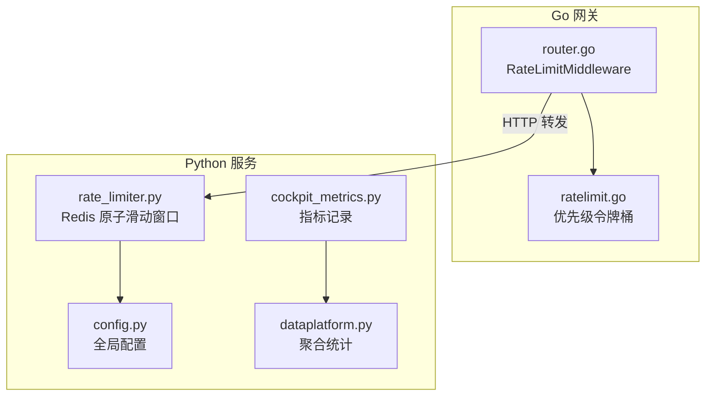
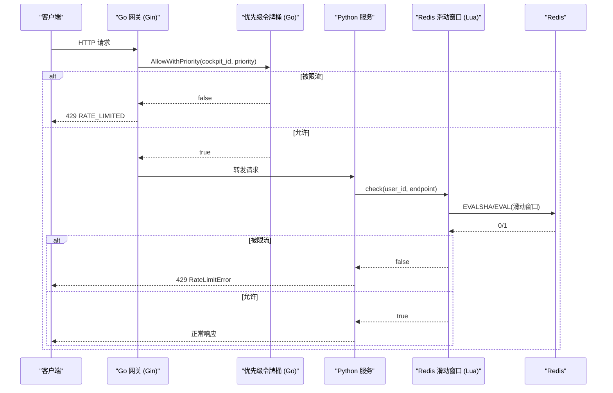
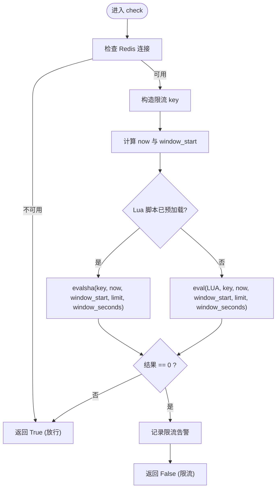
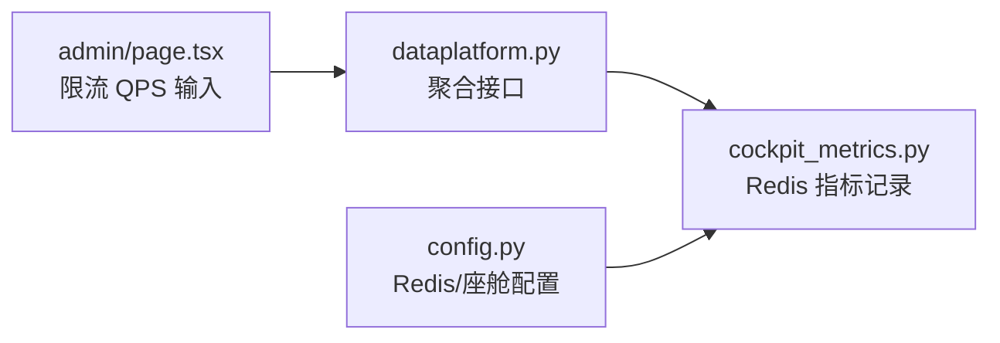
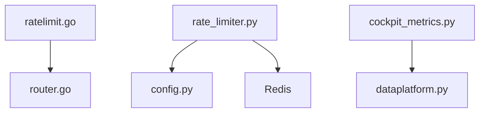

# 限流控制

<cite>
**本文引用的文件列表**
- [backend_design/nexus/middleware/rate_limiter.py](file://backend_design/nexus/middleware/rate_limiter.py)
- [backend_design/nexus_gate/internal/ratelimit/ratelimit.go](file://backend_design/nexus_gate/internal/ratelimit/ratelimit.go)
- [backend_design/nexus_gate/internal/router/router.go](file://backend_design/nexus_gate/internal/router/router.go)
- [backend_design/nexus/config.py](file://backend_design/nexus/config.py)
- [backend_design/nexus/observability/cockpit_metrics.py](file://backend_design/nexus/observability/cockpit_metrics.py)
- [backend_design/nexus/api/routes/dataplatform.py](file://backend_design/nexus/api/routes/dataplatform.py)
- [frontend_design/src/app/admin/page.tsx](file://frontend_design/src/app/admin/page.tsx)
- [docs/architecture/L5-middleware.md](file://docs/architecture/L5-middleware.md)
</cite>

## 目录
1. [简介](#简介)
2. [项目结构](#项目结构)
3. [核心组件](#核心组件)
4. [架构总览](#架构总览)
5. [详细组件分析](#详细组件分析)
6. [依赖关系分析](#依赖关系分析)
7. [性能与调优](#性能与调优)
8. [故障排查指南](#故障排查指南)
9. [结论](#结论)

## 简介
本技术文档聚焦于 NexusCockpit 的限流控制系统，覆盖以下关键主题：
- 优先级限流算法：滑动窗口（Python 侧）与令牌桶（Go 网关侧）的工作原理与实现细节
- 座舱级限流配置与管理：QPS、并发连接数控制策略
- Redis 分布式限流：原子操作与数据一致性保证
- Python 侧限流中间件设计：装饰器模式与异步限流
- 限流策略调优与性能监控指南

## 项目结构
限流相关代码分布在两个层次：
- Go 网关层：基于本地内存的优先级令牌桶，提供座舱级与全局限流能力，并通过 Gin 中间件接入请求链路
- Python 服务层：基于 Redis Lua 脚本的原子滑动窗口限流，用于分布式场景下的细粒度限流



图表来源
- [backend_design/nexus_gate/internal/router/router.go:393-424](file://backend_design/nexus_gate/internal/router/router.go#L393-L424)
- [backend_design/nexus_gate/internal/ratelimit/ratelimit.go:1-177](file://backend_design/nexus_gate/internal/ratelimit/ratelimit.go#L1-L177)
- [backend_design/nexus/middleware/rate_limiter.py:1-174](file://backend_design/nexus/middleware/rate_limiter.py#L1-L174)
- [backend_design/nexus/config.py:214-247](file://backend_design/nexus/config.py#L214-L247)
- [backend_design/nexus/observability/cockpit_metrics.py:43-82](file://backend_design/nexus/observability/cockpit_metrics.py#L43-L82)
- [backend_design/nexus/api/routes/dataplatform.py:42-66](file://backend_design/nexus/api/routes/dataplatform.py#L42-L66)

章节来源
- [backend_design/nexus_gate/internal/router/router.go:393-424](file://backend_design/nexus_gate/internal/router/router.go#L393-L424)
- [backend_design/nexus_gate/internal/ratelimit/ratelimit.go:1-177](file://backend_design/nexus_gate/internal/ratelimit/ratelimit.go#L1-L177)
- [backend_design/nexus/middleware/rate_limiter.py:1-174](file://backend_design/nexus/middleware/rate_limiter.py#L1-L174)
- [backend_design/nexus/config.py:214-247](file://backend_design/nexus/config.py#L214-L247)
- [backend_design/nexus/observability/cockpit_metrics.py:43-82](file://backend_design/nexus/observability/cockpit_metrics.py#L43-L82)
- [backend_design/nexus/api/routes/dataplatform.py:42-66](file://backend_design/nexus/api/routes/dataplatform.py#L42-L66)

## 核心组件
- Go 网关优先级令牌桶限流器
  - 支持高、普通、低三级优先级
  - 每个座舱独立令牌桶，同时存在一个全局桶限制整体流量
  - 通过 Gin 中间件在路由层拦截并判定是否放行
- Python 分布式滑动窗口限流器
  - 使用 Redis Lua 脚本实现原子性滑动窗口计数
  - 支持异步调用、Lua 脚本预加载（EVALSHA）、异常降级直通
- 配置中心
  - 集中管理 Redis、服务器、座舱等配置项
- 可观测性与指标
  - 记录对话、车控指令、缓存命中等指标，供前端与数据中台展示

章节来源
- [backend_design/nexus_gate/internal/ratelimit/ratelimit.go:1-177](file://backend_design/nexus_gate/internal/ratelimit/ratelimit.go#L1-L177)
- [backend_design/nexus/middleware/rate_limiter.py:1-174](file://backend_design/nexus/middleware/rate_limiter.py#L1-L174)
- [backend_design/nexus/config.py:214-247](file://backend_design/nexus/config.py#L214-L247)
- [backend_design/nexus/observability/cockpit_metrics.py:43-82](file://backend_design/nexus/observability/cockpit_metrics.py#L43-L82)

## 架构总览
系统采用“网关层 + 服务层”双层限流：
- 网关层（Go）：基于本地内存的优先级令牌桶，快速拒绝超限请求，保护后端服务
- 服务层（Python）：基于 Redis 的分布式滑动窗口，确保多实例一致性与公平性



图表来源
- [backend_design/nexus_gate/internal/router/router.go:393-424](file://backend_design/nexus_gate/internal/router/router.go#L393-L424)
- [backend_design/nexus_gate/internal/ratelimit/ratelimit.go:135-157](file://backend_design/nexus_gate/internal/ratelimit/ratelimit.go#L135-L157)
- [backend_design/nexus/middleware/rate_limiter.py:100-146](file://backend_design/nexus/middleware/rate_limiter.py#L100-L146)

## 详细组件分析

### Go 网关：优先级令牌桶限流
- 优先级定义
  - 高优先级：车控指令、ASR/TTS 等实时性要求高的请求
  - 普通优先级：对话请求（默认）
  - 低优先级：状态查询、数据中台等非实时请求
- 令牌桶策略
  - 每个座舱独立令牌桶，容量为 capacity，生成速率为 ratePerSecond
  - 各优先级可用令牌比例不同：高=100%，普通=80%，低=50%
  - 全局限流桶容量 = capacity × 3，速率 = ratePerSecond × 3
- 并发安全
  - 使用互斥锁保护令牌补充与扣减
  - 座舱桶映射表使用读写锁保护
- 中间件集成
  - 从 URL 路径推断优先级，未命中规则则按普通优先级处理
  - 被限流时返回 429 并中止后续处理

```mermaid
classDiagram
class TokenBucket {
-int capacity
-int tokens
-time.Duration rate
-time.Time lastRefill
+Allow() bool
+AllowWithPriority(p Priority) bool
+AvailableTokens() int
-refill() void
}
class RateLimiter {
-map[string]*TokenBucket buckets
-TokenBucket globalBucket
-sync.RWMutex mu
-int capacity
-int rate
+NewRateLimiter(capacity, ratePerSecond) *RateLimiter
+Allow(cockpitID string) bool
+AllowWithPriority(cockpitID string, p Priority) bool
+GetStats() map[string]interface{}
}
class Router {
+RateLimitMiddleware(limiter *RateLimiter) gin.HandlerFunc
}
Router --> RateLimiter : "使用"
RateLimiter --> TokenBucket : "维护多个"
```

图表来源
- [backend_design/nexus_gate/internal/ratelimit/ratelimit.go:42-109](file://backend_design/nexus_gate/internal/ratelimit/ratelimit.go#L42-L109)
- [backend_design/nexus_gate/internal/ratelimit/ratelimit.go:111-177](file://backend_design/nexus_gate/internal/ratelimit/ratelimit.go#L111-L177)
- [backend_design/nexus_gate/internal/router/router.go:393-424](file://backend_design/nexus_gate/internal/router/router.go#L393-L424)

章节来源
- [backend_design/nexus_gate/internal/ratelimit/ratelimit.go:1-177](file://backend_design/nexus_gate/internal/ratelimit/ratelimit.go#L1-L177)
- [backend_design/nexus_gate/internal/router/router.go:393-424](file://backend_design/nexus_gate/internal/router/router.go#L393-L424)

### Python 服务：Redis 原子滑动窗口限流
- 滑动窗口算法
  - 使用 Redis 有序集合存储时间戳作为分数
  - Lua 脚本原子执行：清理窗口外旧条目 → 统计当前窗口内数量 → 若未超限则添加当前请求 → 设置过期时间
- 原子性与一致性
  - 通过 EVALSHA/EVAL 将多条命令打包为一次原子操作，避免竞态条件
  - 超限请求不写入计数器，防止污染合法请求判断
- 异步与降级
  - 使用 redis.asyncio 进行非阻塞 I/O
  - Redis 不可用时直接放行（降级策略），异常时亦放行以保证可用性
- 剩余次数查询
  - 通过 zcount 计算窗口内请求数，返回 max(0, limit - count)



图表来源
- [backend_design/nexus/middleware/rate_limiter.py:41-60](file://backend_design/nexus/middleware/rate_limiter.py#L41-L60)
- [backend_design/nexus/middleware/rate_limiter.py:100-146](file://backend_design/nexus/middleware/rate_limiter.py#L100-L146)

章节来源
- [backend_design/nexus/middleware/rate_limiter.py:1-174](file://backend_design/nexus/middleware/rate_limiter.py#L1-L174)

### 座舱级限流配置与管理
- 配置项
  - Redis 连接参数、语义缓存开关与阈值、TTL 等由配置中心统一管理
  - 座舱相关配置包括默认座舱数量、网关地址与端口、RBAC 角色等
- 前端管理界面
  - 管理员页面提供限流 QPS 输入框，便于动态调整中间件限流参数
- 指标采集
  - 对话与车控指令计数、缓存命中率、平均延迟等指标通过 Redis Hash 记录
  - 数据中台聚合这些指标，形成仪表盘展示



图表来源
- [frontend_design/src/app/admin/page.tsx:448-480](file://frontend_design/src/app/admin/page.tsx#L448-L480)
- [backend_design/nexus/api/routes/dataplatform.py:42-66](file://backend_design/nexus/api/routes/dataplatform.py#L42-L66)
- [backend_design/nexus/observability/cockpit_metrics.py:43-82](file://backend_design/nexus/observability/cockpit_metrics.py#L43-L82)
- [backend_design/nexus/config.py:214-247](file://backend_design/nexus/config.py#L214-L247)

章节来源
- [backend_design/nexus/config.py:557-581](file://backend_design/nexus/config.py#L557-L581)
- [frontend_design/src/app/admin/page.tsx:448-480](file://frontend_design/src/app/admin/page.tsx#L448-L480)
- [backend_design/nexus/observability/cockpit_metrics.py:43-82](file://backend_design/nexus/observability/cockpit_metrics.py#L43-L82)
- [backend_design/nexus/api/routes/dataplatform.py:42-66](file://backend_design/nexus/api/routes/dataplatform.py#L42-L66)

### Python 侧限流中间件设计与异步限流
- 中间件职责
  - 在业务逻辑前调用 RateLimiter.check_or_raise，超出限制抛出 RateLimitError，统一映射为 429
- 装饰器模式
  - 可通过装饰器包装异步函数，实现非侵入式限流
- 异步限流
  - 使用 async/await 与 aioredis 配合，避免阻塞事件循环
- 文档参考
  - 架构文档 L5 描述了限流器的使用方式与设计原则

章节来源
- [backend_design/nexus/middleware/rate_limiter.py:148-154](file://backend_design/nexus/middleware/rate_limiter.py#L148-L154)
- [docs/architecture/L5-middleware.md:67-86](file://docs/architecture/L5-middleware.md#L67-L86)

## 依赖关系分析
- Go 网关限流器依赖 Gin 中间件进行请求拦截，内部维护座舱级与全局限流桶
- Python 限流器依赖 Redis 与 Lua 脚本，通过 EVALSHA 提升性能
- 配置中心为限流器提供连接参数与行为开关
- 可观测性模块记录指标，数据中台聚合后对外暴露



图表来源
- [backend_design/nexus_gate/internal/ratelimit/ratelimit.go:1-177](file://backend_design/nexus_gate/internal/ratelimit/ratelimit.go#L1-L177)
- [backend_design/nexus_gate/internal/router/router.go:393-424](file://backend_design/nexus_gate/internal/router/router.go#L393-L424)
- [backend_design/nexus/middleware/rate_limiter.py:1-174](file://backend_design/nexus/middleware/rate_limiter.py#L1-L174)
- [backend_design/nexus/config.py:214-247](file://backend_design/nexus/config.py#L214-L247)
- [backend_design/nexus/observability/cockpit_metrics.py:43-82](file://backend_design/nexus/observability/cockpit_metrics.py#L43-L82)
- [backend_design/nexus/api/routes/dataplatform.py:42-66](file://backend_design/nexus/api/routes/dataplatform.py#L42-L66)

章节来源
- [backend_design/nexus_gate/internal/ratelimit/ratelimit.go:1-177](file://backend_design/nexus_gate/internal/ratelimit/ratelimit.go#L1-L177)
- [backend_design/nexus/middleware/rate_limiter.py:1-174](file://backend_design/nexus/middleware/rate_limiter.py#L1-L174)
- [backend_design/nexus/config.py:214-247](file://backend_design/nexus/config.py#L214-L247)
- [backend_design/nexus/observability/cockpit_metrics.py:43-82](file://backend_design/nexus/observability/cockpit_metrics.py#L43-L82)
- [backend_design/nexus/api/routes/dataplatform.py:42-66](file://backend_design/nexus/api/routes/dataplatform.py#L42-L66)

## 性能与调优
- 令牌桶参数调优
  - capacity 决定突发容量，ratePerSecond 决定稳态吞吐；建议根据业务峰值与 SLA 设定
  - 优先级比例可根据实时性需求调整，例如提高高优先级配额以保障车控指令
- 滑动窗口参数调优
  - max_requests 与 window_seconds 共同决定 QPS；短窗口更平滑但开销更高
  - 合理设置 EXPIRE 时间，避免键膨胀
- Lua 脚本优化
  - 使用 EVALSHA 预加载脚本，减少网络传输与解析开销
- 并发与锁竞争
  - Go 侧使用细粒度锁，尽量降低临界区范围
  - Python 侧通过异步 I/O 避免阻塞
- 监控与反馈
  - 关注限流拒绝率、剩余令牌、窗口计数等指标，结合业务负载动态调整

[本节为通用指导，无需具体文件引用]

## 故障排查指南
- 限流误判或漏判
  - 检查 Lua 脚本是否正确执行，确认 EVALSHA 是否成功加载
  - 核对 Redis 连接与权限，确认键空间未被外部清理
- 性能问题
  - 评估 EVALSHA 命中率，必要时增加脚本缓存
  - 观察 Redis 慢查询日志，定位热点键
- 指标缺失
  - 确认 cockpit_metrics 写入流程是否正常，检查 Redis Pipeline 执行结果
  - 校验数据中台聚合接口是否获取到最新指标

章节来源
- [backend_design/nexus/middleware/rate_limiter.py:87-99](file://backend_design/nexus/middleware/rate_limiter.py#L87-L99)
- [backend_design/nexus/middleware/rate_limiter.py:114-146](file://backend_design/nexus/middleware/rate_limiter.py#L114-L146)
- [backend_design/nexus/observability/cockpit_metrics.py:43-82](file://backend_design/nexus/observability/cockpit_metrics.py#L43-L82)
- [backend_design/nexus/api/routes/dataplatform.py:42-66](file://backend_design/nexus/api/routes/dataplatform.py#L42-L66)

## 结论
NexusCockpit 的限流体系通过“网关层优先级令牌桶 + 服务层 Redis 原子滑动窗口”的双层设计，兼顾了高性能与分布式一致性。Go 网关的快速拒绝有效保护后端，Python 服务的原子滑动窗口在多实例环境下保证了公平与准确。配合配置中心与可观测性模块，系统具备良好的可运维性与可扩展性。建议在生产环境中持续监控限流指标，结合业务特征动态调优参数，以实现稳定与高效的限流控制。