# 个性化学习引擎

<cite>
**本文引用的文件**   
- [backend_design/nexus/core/personalization.py](file://backend_design/nexus/core/personalization.py)
- [backend_design/nexus/skills/habit.py](file://backend_design/nexus/skills/habit.py)
- [backend_design/nexus/memory/manager.py](file://backend_design/nexus/memory/manager.py)
- [backend_design/nexus/middleware/session_store.py](file://backend_design/nexus/middleware/session_store.py)
- [backend_design/nexus/models/state.py](file://backend_design/nexus/models/state.py)
- [backend_design/nexus/api/routes/chat.py](file://backend_design/nexus/api/routes/chat.py)
- [backend_design/nexus/rag/unified_retriever.py](file://backend_design/nexus/rag/unified_retriever.py)
- [backend_design/nexus/rag/vector_store.py](file://backend_design/nexus/rag/vector_store.py)
- [backend_design/nexus/observability/cockpit_metrics.py](file://backend_design/nexus/observability/cockpit_metrics.py)
- [backend_design/nexus/config.py](file://backend_design/nexus/config.py)
- [data/preferences/default_user.json](file://data/preferences/default_user.json)
</cite>

## 目录
1. [简介](#简介)
2. [项目结构](#项目结构)
3. [核心组件](#核心组件)
4. [架构总览](#架构总览)
5. [详细组件分析](#详细组件分析)
6. [依赖关系分析](#依赖关系分析)
7. [性能考量](#性能考量)
8. [故障排查指南](#故障排查指南)
9. [结论](#结论)
10. [附录](#附录)

## 简介
本技术文档围绕“个性化学习引擎”展开，聚焦以下目标：
- 用户画像构建算法：特征提取、权重计算与模型更新策略
- 偏好自动学习与调整机制：显式反馈与隐式行为分析
- 个性化推荐实现：协同过滤与内容基推荐
- 学习率控制与模型收敛策略
- 模型版本管理与回滚机制
- 效果评估指标与A/B测试框架
- 隐私保护与个人数据脱敏方案

该引擎以会话记忆、技能习惯、向量检索与可观测性为核心支撑，结合配置化参数与默认用户偏好，形成闭环的个性化学习体系。

## 项目结构
从工程视角看，个性化相关能力分布在如下模块：
- 核心个性化逻辑：用户画像、偏好管理、更新策略
- 技能与习惯：将长期偏好沉淀为可执行技能
- 记忆与会话：短期上下文与长期记忆的读写
- 检索增强：基于向量的召回与重排，支持内容基推荐
- 可观测性与度量：用于评估与监控
- 配置与默认偏好：提供系统级开关与初始值

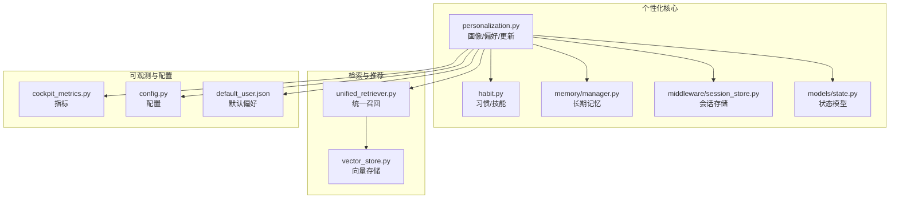

图表来源
- [backend_design/nexus/core/personalization.py](file://backend_design/nexus/core/personalization.py)
- [backend_design/nexus/skills/habit.py](file://backend_design/nexus/skills/habit.py)
- [backend_design/nexus/memory/manager.py](file://backend_design/nexus/memory/manager.py)
- [backend_design/nexus/middleware/session_store.py](file://backend_design/nexus/middleware/session_store.py)
- [backend_design/nexus/models/state.py](file://backend_design/nexus/models/state.py)
- [backend_design/nexus/rag/unified_retriever.py](file://backend_design/nexus/rag/unified_retriever.py)
- [backend_design/nexus/rag/vector_store.py](file://backend_design/nexus/rag/vector_store.py)
- [backend_design/nexus/observability/cockpit_metrics.py](file://backend_design/nexus/observability/cockpit_metrics.py)
- [backend_design/nexus/config.py](file://backend_design/nexus/config.py)
- [data/preferences/default_user.json](file://data/preferences/default_user.json)

章节来源
- [backend_design/nexus/core/personalization.py](file://backend_design/nexus/core/personalization.py)
- [backend_design/nexus/skills/habit.py](file://backend_design/nexus/skills/habit.py)
- [backend_design/nexus/memory/manager.py](file://backend_design/nexus/memory/manager.py)
- [backend_design/nexus/middleware/session_store.py](file://backend_design/nexus/middleware/session_store.py)
- [backend_design/nexus/models/state.py](file://backend_design/nexus/models/state.py)
- [backend_design/nexus/rag/unified_retriever.py](file://backend_design/nexus/rag/unified_retriever.py)
- [backend_design/nexus/rag/vector_store.py](file://backend_design/nexus/rag/vector_store.py)
- [backend_design/nexus/observability/cockpit_metrics.py](file://backend_design/nexus/observability/cockpit_metrics.py)
- [backend_design/nexus/config.py](file://backend_design/nexus/config.py)
- [data/preferences/default_user.json](file://data/preferences/default_user.json)

## 核心组件
- 个性化核心（personalization）：负责用户画像构建、偏好聚合、权重计算、模型更新与版本管理；对外暴露画像查询与更新接口。
- 习惯与技能（habit）：将稳定的偏好转化为可复用的技能，驱动后续推荐与交互策略。
- 记忆管理（memory/manager）：维护长期记忆，支持增量写入与一致性校验。
- 会话存储（session_store）：承载短期上下文，辅助隐式行为推断与快速冷启动。
- 统一召回（unified_retriever）：融合多路召回（协同过滤、内容基），输出候选集。
- 向量存储（vector_store）：提供向量索引与相似度检索，支撑内容基推荐。
- 可观测性（cockpit_metrics）：记录关键指标，支撑评估与A/B实验。
- 配置与默认偏好（config, default_user.json）：提供系统级参数与初始画像。

章节来源
- [backend_design/nexus/core/personalization.py](file://backend_design/nexus/core/personalization.py)
- [backend_design/nexus/skills/habit.py](file://backend_design/nexus/skills/habit.py)
- [backend_design/nexus/memory/manager.py](file://backend_design/nexus/memory/manager.py)
- [backend_design/nexus/middleware/session_store.py](file://backend_design/nexus/middleware/session_store.py)
- [backend_design/nexus/rag/unified_retriever.py](file://backend_design/nexus/rag/unified_retriever.py)
- [backend_design/nexus/rag/vector_store.py](file://backend_design/nexus/rag/vector_store.py)
- [backend_design/nexus/observability/cockpit_metrics.py](file://backend_design/nexus/observability/cockpit_metrics.py)
- [backend_design/nexus/config.py](file://backend_design/nexus/config.py)
- [data/preferences/default_user.json](file://data/preferences/default_user.json)

## 架构总览
个性化学习引擎的整体流程包括：输入事件采集（显式反馈/隐式行为）、画像构建与更新、召回与排序、结果返回与埋点评估、模型版本管理与回滚。

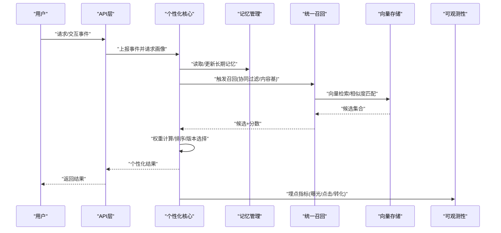

图表来源
- [backend_design/nexus/core/personalization.py](file://backend_design/nexus/core/personalization.py)
- [backend_design/nexus/memory/manager.py](file://backend_design/nexus/memory/manager.py)
- [backend_design/nexus/rag/unified_retriever.py](file://backend_design/nexus/rag/unified_retriever.py)
- [backend_design/nexus/rag/vector_store.py](file://backend_design/nexus/rag/vector_store.py)
- [backend_design/nexus/observability/cockpit_metrics.py](file://backend_design/nexus/observability/cockpit_metrics.py)

## 详细组件分析

### 用户画像构建算法
- 特征提取
  - 显式特征：来自用户设置、评分、标签等结构化输入。
  - 隐式特征：来自会话时长、点击、跳过、重复访问等行为序列。
  - 上下文特征：时间、设备、场景、任务类型等元信息。
- 权重计算
  - 基于近期行为衰减与重要性加权，动态调整各特征维度权重。
  - 引入置信度估计，对稀疏或噪声行为降权。
- 模型更新策略
  - 增量更新：按事件流进行小步更新，避免全量重算。
  - 批处理更新：周期性合并增量，保证一致性与稳定性。
  - 平滑与正则：防止过拟合，保持画像稳定演进。

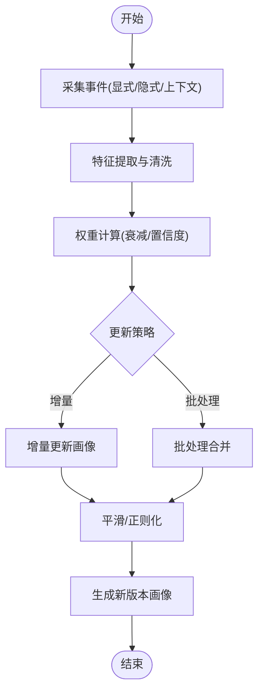

图表来源
- [backend_design/nexus/core/personalization.py](file://backend_design/nexus/core/personalization.py)
- [backend_design/nexus/middleware/session_store.py](file://backend_design/nexus/middleware/session_store.py)
- [backend_design/nexus/models/state.py](file://backend_design/nexus/models/state.py)

章节来源
- [backend_design/nexus/core/personalization.py](file://backend_design/nexus/core/personalization.py)
- [backend_design/nexus/middleware/session_store.py](file://backend_design/nexus/middleware/session_store.py)
- [backend_design/nexus/models/state.py](file://backend_design/nexus/models/state.py)

### 偏好自动学习与调整机制
- 显式反馈
  - 直接评分、收藏、订阅、标签设定等明确信号。
  - 高置信度，优先纳入权重提升与画像强化。
- 隐式行为
  - 点击、停留时长、滑动、重复播放、搜索词等间接信号。
  - 通过时序建模与频率统计，识别稳定偏好与短期兴趣。
- 调整机制
  - 正负反馈平衡：对负面信号（如跳过、取消关注）进行降权。
  - 自适应学习率：根据反馈密度与波动性调节更新步长。
  - 去噪与鲁棒性：异常行为检测与滤波，避免污染画像。

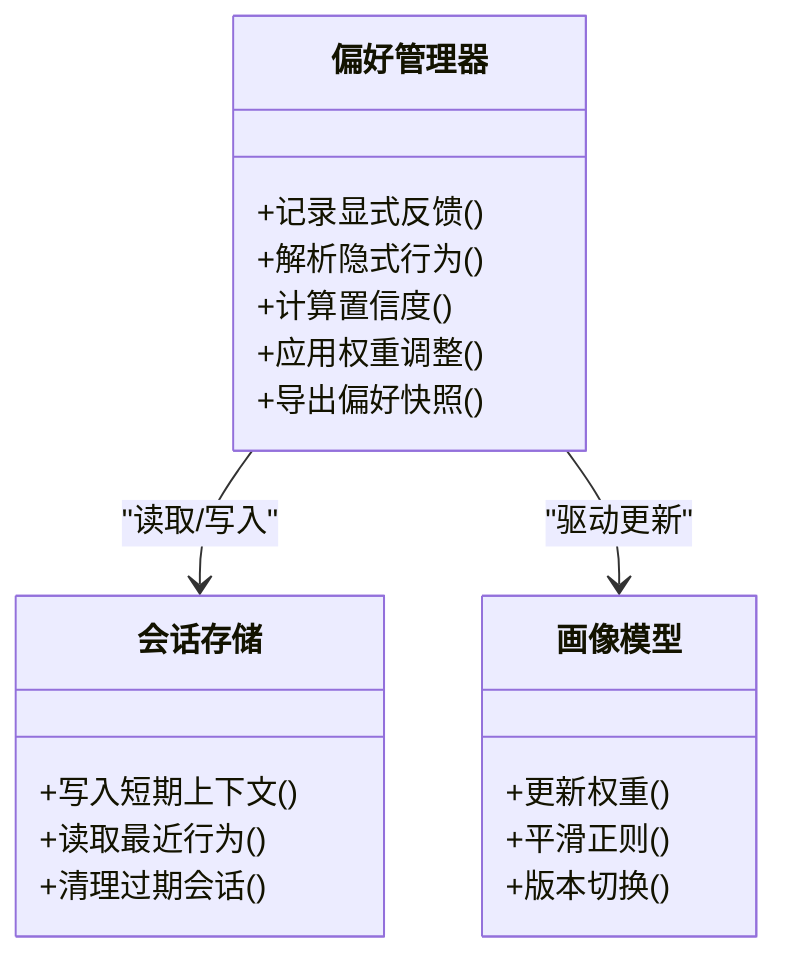

图表来源
- [backend_design/nexus/core/personalization.py](file://backend_design/nexus/core/personalization.py)
- [backend_design/nexus/middleware/session_store.py](file://backend_design/nexus/middleware/session_store.py)

章节来源
- [backend_design/nexus/core/personalization.py](file://backend_design/nexus/core/personalization.py)
- [backend_design/nexus/middleware/session_store.py](file://backend_design/nexus/middleware/session_store.py)

### 个性化推荐算法（协同过滤与内容基）
- 协同过滤
  - 基于用户-物品交互矩阵，挖掘相似用户或相似物品。
  - 利用历史行为与群体模式生成候选集。
- 内容基推荐
  - 基于物品属性与用户画像的语义匹配。
  - 借助向量检索与相似度打分，提高可解释性与冷启动效果。
- 融合策略
  - 多路召回融合：CF与内容基并行，按权重或学习到的门控融合。
  - 排序阶段：结合画像权重、业务规则与实时上下文进行最终排序。

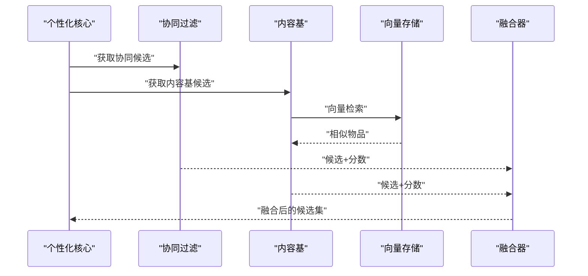

图表来源
- [backend_design/nexus/core/personalization.py](file://backend_design/nexus/core/personalization.py)
- [backend_design/nexus/rag/unified_retriever.py](file://backend_design/nexus/rag/unified_retriever.py)
- [backend_design/nexus/rag/vector_store.py](file://backend_design/nexus/rag/vector_store.py)

章节来源
- [backend_design/nexus/core/personalization.py](file://backend_design/nexus/core/personalization.py)
- [backend_design/nexus/rag/unified_retriever.py](file://backend_design/nexus/rag/unified_retriever.py)
- [backend_design/nexus/rag/vector_store.py](file://backend_design/nexus/rag/vector_store.py)

### 学习率控制与模型收敛策略
- 学习率控制
  - 自适应学习率：依据反馈密度、方差与置信度动态缩放。
  - 衰减策略：随时间或迭代次数逐步降低，促进收敛。
  - 早停与阈值：当指标改善低于阈值时停止更新，避免震荡。
- 收敛策略
  - 平滑与正则：L2/L1正则与指数移动平均，抑制过拟合。
  - 批次大小与采样：合理批次与采样策略，提升稳定性。
  - 监控与诊断：跟踪损失、权重分布与指标趋势，定位问题。

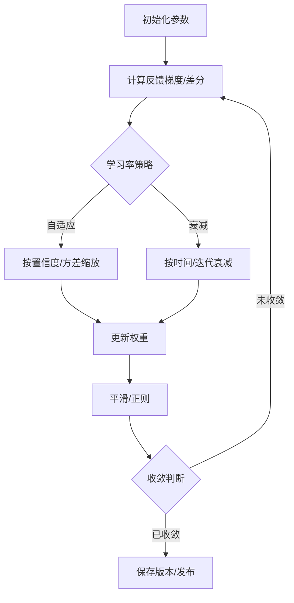

图表来源
- [backend_design/nexus/core/personalization.py](file://backend_design/nexus/core/personalization.py)
- [backend_design/nexus/config.py](file://backend_design/nexus/config.py)

章节来源
- [backend_design/nexus/core/personalization.py](file://backend_design/nexus/core/personalization.py)
- [backend_design/nexus/config.py](file://backend_design/nexus/config.py)

### 模型版本管理与回滚机制
- 版本管理
  - 每次重要更新生成新版本的画像/模型快照，附带元数据（时间、指标、变更摘要）。
  - 支持灰度发布与流量切分，逐步验证效果。
- 回滚机制
  - 一键回滚至上一稳定版本，确保服务可用性。
  - 回滚后继续收集反馈，准备下一轮优化。
- 一致性保障
  - 原子切换：新旧版本切换具备原子性，避免中间态。
  - 幂等更新：同一事件多次上报不导致重复累积。

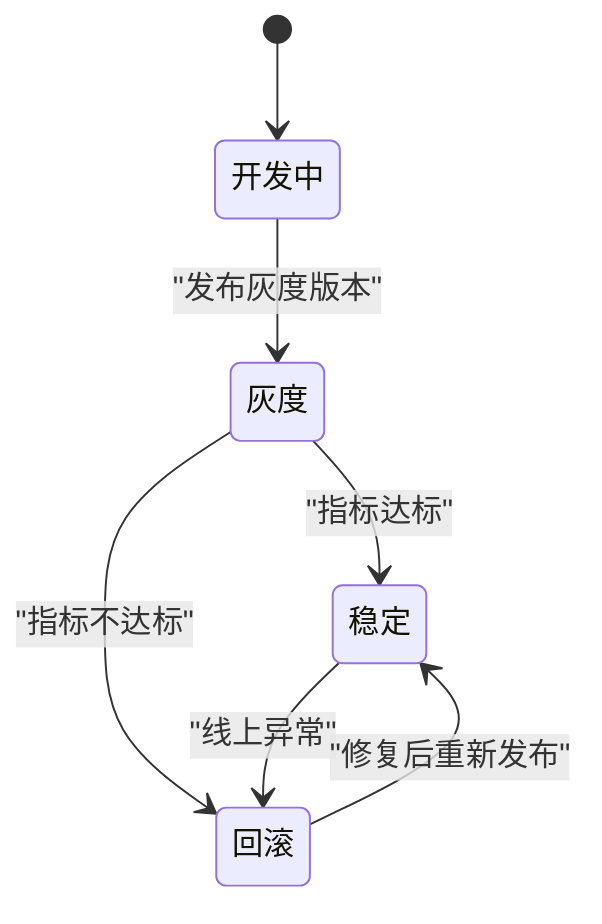

图表来源
- [backend_design/nexus/core/personalization.py](file://backend_design/nexus/core/personalization.py)

章节来源
- [backend_design/nexus/core/personalization.py](file://backend_design/nexus/core/personalization.py)

### 效果评估指标与A/B测试框架
- 评估指标
  - 曝光/点击/转化率、停留时长、跳出率、NDCG、覆盖率、多样性。
  - 画像质量：预测准确率、稳定性、漂移检测。
- A/B测试
  - 分流策略：按用户ID哈希或会话ID分配实验组/对照组。
  - 指标对比：显著性检验与置信区间，避免误判。
  - 持续监控：在线指标看板与告警，快速发现问题。

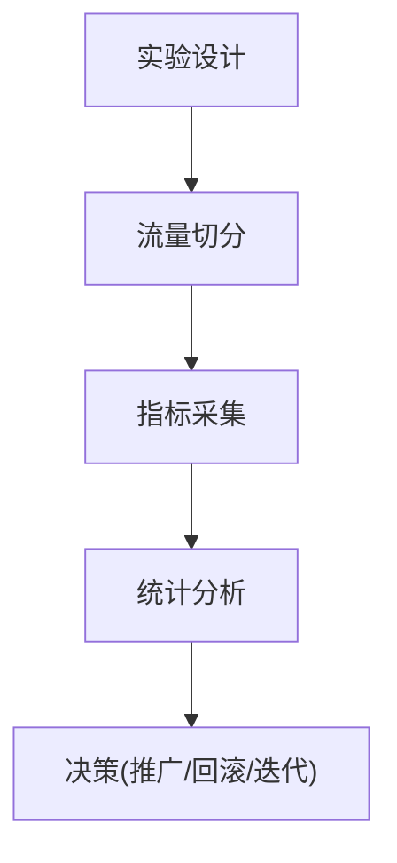

图表来源
- [backend_design/nexus/observability/cockpit_metrics.py](file://backend_design/nexus/observability/cockpit_metrics.py)
- [backend_design/nexus/core/personalization.py](file://backend_design/nexus/core/personalization.py)

章节来源
- [backend_design/nexus/observability/cockpit_metrics.py](file://backend_design/nexus/observability/cockpit_metrics.py)
- [backend_design/nexus/core/personalization.py](file://backend_design/nexus/core/personalization.py)

### 隐私保护与个人数据脱敏
- 数据最小化
  - 仅采集必要字段，避免过度收集。
- 匿名化与脱敏
  - 对用户标识进行哈希或令牌化，去除可直接识别信息。
- 安全存储与传输
  - 加密存储敏感字段，传输使用TLS。
- 权限与审计
  - 细粒度访问控制，操作日志与审计追踪。
- 合规与生命周期
  - 数据保留策略与删除机制，满足法规要求。

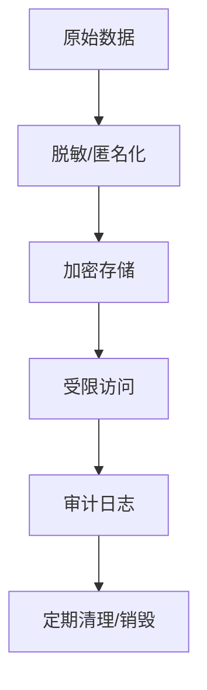

图表来源
- [backend_design/nexus/core/personalization.py](file://backend_design/nexus/core/personalization.py)
- [backend_design/nexus/config.py](file://backend_design/nexus/config.py)

章节来源
- [backend_design/nexus/core/personalization.py](file://backend_design/nexus/core/personalization.py)
- [backend_design/nexus/config.py](file://backend_design/nexus/config.py)

### 技能与习惯（长期偏好的可执行化）
- 习惯抽取
  - 从长期记忆中识别稳定偏好，抽象为可复用技能。
- 技能编排
  - 将多个技能组合成工作流，驱动个性化交互与服务。
- 演化与治理
  - 技能有效性评估与淘汰，避免技能膨胀与冲突。

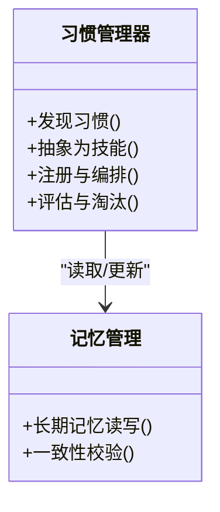

图表来源
- [backend_design/nexus/skills/habit.py](file://backend_design/nexus/skills/habit.py)
- [backend_design/nexus/memory/manager.py](file://backend_design/nexus/memory/manager.py)

章节来源
- [backend_design/nexus/skills/habit.py](file://backend_design/nexus/skills/habit.py)
- [backend_design/nexus/memory/manager.py](file://backend_design/nexus/memory/manager.py)

## 依赖关系分析
- 内聚与耦合
  - 个性化核心与记忆、会话、召回、可观测性存在强依赖，但通过清晰接口解耦。
  - 向量存储作为基础设施，被召回模块复用，降低耦合度。
- 外部依赖
  - 向量数据库、缓存、消息队列等可通过配置替换，便于扩展。
- 潜在循环依赖
  - 通过分层与接口隔离避免循环引用，确保模块边界清晰。

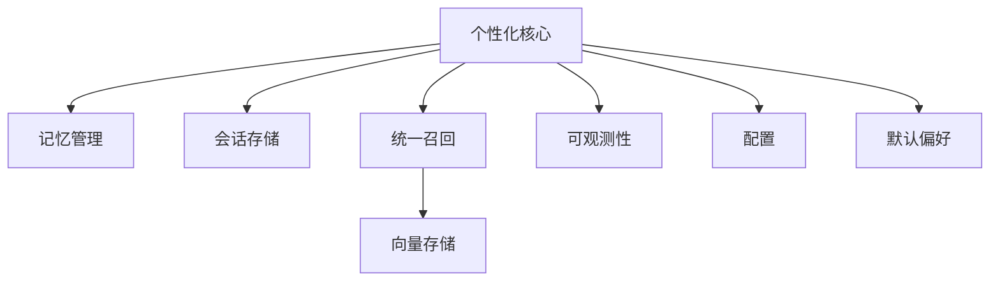

图表来源
- [backend_design/nexus/core/personalization.py](file://backend_design/nexus/core/personalization.py)
- [backend_design/nexus/memory/manager.py](file://backend_design/nexus/memory/manager.py)
- [backend_design/nexus/middleware/session_store.py](file://backend_design/nexus/middleware/session_store.py)
- [backend_design/nexus/rag/unified_retriever.py](file://backend_design/nexus/rag/unified_retriever.py)
- [backend_design/nexus/rag/vector_store.py](file://backend_design/nexus/rag/vector_store.py)
- [backend_design/nexus/observability/cockpit_metrics.py](file://backend_design/nexus/observability/cockpit_metrics.py)
- [backend_design/nexus/config.py](file://backend_design/nexus/config.py)
- [data/preferences/default_user.json](file://data/preferences/default_user.json)

章节来源
- [backend_design/nexus/core/personalization.py](file://backend_design/nexus/core/personalization.py)
- [backend_design/nexus/memory/manager.py](file://backend_design/nexus/memory/manager.py)
- [backend_design/nexus/middleware/session_store.py](file://backend_design/nexus/middleware/session_store.py)
- [backend_design/nexus/rag/unified_retriever.py](file://backend_design/nexus/rag/unified_retriever.py)
- [backend_design/nexus/rag/vector_store.py](file://backend_design/nexus/rag/vector_store.py)
- [backend_design/nexus/observability/cockpit_metrics.py](file://backend_design/nexus/observability/cockpit_metrics.py)
- [backend_design/nexus/config.py](file://backend_design/nexus/config.py)
- [data/preferences/default_user.json](file://data/preferences/default_user.json)

## 性能考量
- 增量更新与批处理结合，降低CPU与IO压力。
- 向量检索采用近似最近邻与索引优化，提升召回速度。
- 缓存热点画像与常用候选集，减少重复计算。
- 异步埋点与批量上报，避免阻塞主链路。
- 资源隔离与限流，保障高并发下的稳定性。

[本节为通用指导，无需特定文件来源]

## 故障排查指南
- 常见问题
  - 画像更新延迟：检查增量队列与批处理调度。
  - 召回质量下降：核对向量索引健康与相似度阈值。
  - 指标异常：查看埋点完整性与统计口径。
- 诊断工具
  - 日志与追踪：关联事件ID与画像版本，定位根因。
  - 指标看板：观察关键指标趋势与异常点。
  - 回滚与降级：快速恢复服务，再逐步修复。

章节来源
- [backend_design/nexus/observability/cockpit_metrics.py](file://backend_design/nexus/observability/cockpit_metrics.py)
- [backend_design/nexus/core/personalization.py](file://backend_design/nexus/core/personalization.py)

## 结论
个性化学习引擎通过特征提取、权重计算、增量更新与版本管理，构建了稳健的用户画像与偏好体系；结合协同过滤与内容基召回，实现了高质量的个性化推荐；辅以完善的评估与A/B测试框架，以及严格的隐私保护措施，形成了端到端的闭环能力。建议在生产环境中持续监控指标、优化学习率与收敛策略，并加强数据治理与合规实践。

[本节为总结，无需特定文件来源]

## 附录
- 默认用户偏好示例路径：[data/preferences/default_user.json](file://data/preferences/default_user.json)
- 配置项参考：[backend_design/nexus/config.py](file://backend_design/nexus/config.py)
- 会话与状态模型：[backend_design/nexus/middleware/session_store.py](file://backend_design/nexus/middleware/session_store.py)、[backend_design/nexus/models/state.py](file://backend_design/nexus/models/state.py)
- 聊天入口与事件上报：[backend_design/nexus/api/routes/chat.py](file://backend_design/nexus/api/routes/chat.py)

章节来源
- [data/preferences/default_user.json](file://data/preferences/default_user.json)
- [backend_design/nexus/config.py](file://backend_design/nexus/config.py)
- [backend_design/nexus/middleware/session_store.py](file://backend_design/nexus/middleware/session_store.py)
- [backend_design/nexus/models/state.py](file://backend_design/nexus/models/state.py)
- [backend_design/nexus/api/routes/chat.py](file://backend_design/nexus/api/routes/chat.py)