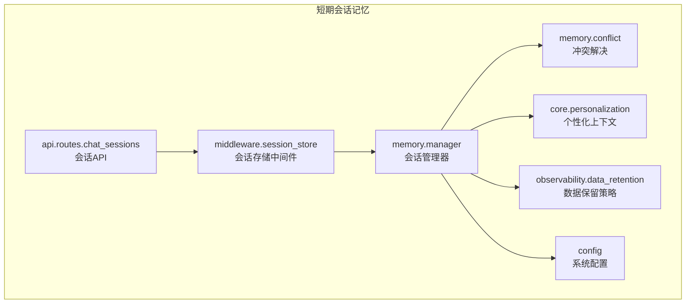
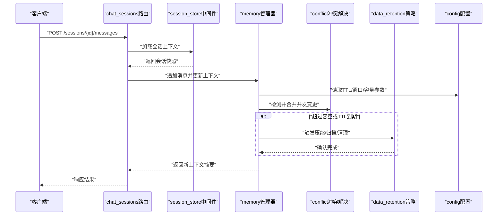
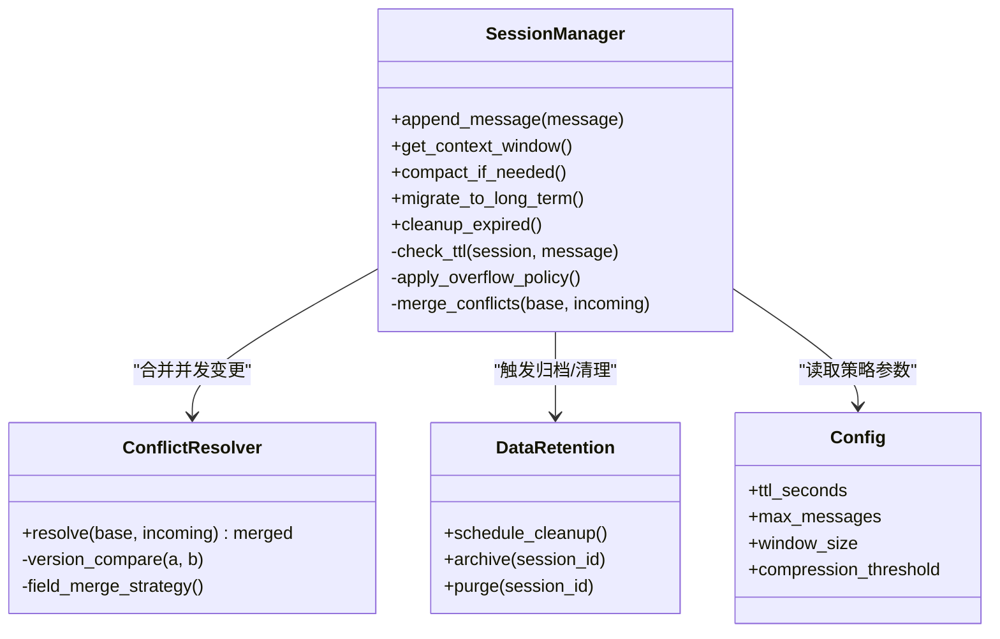
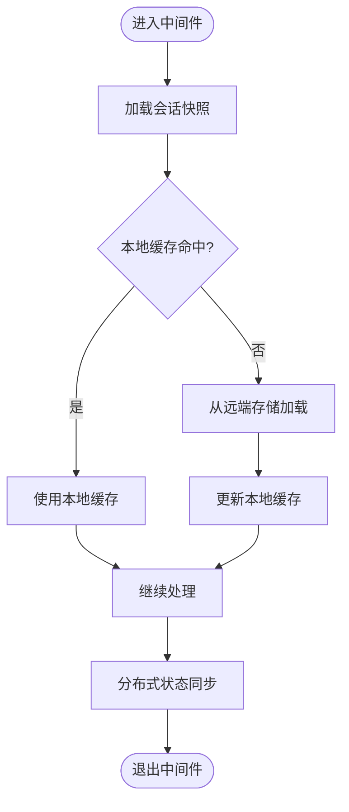
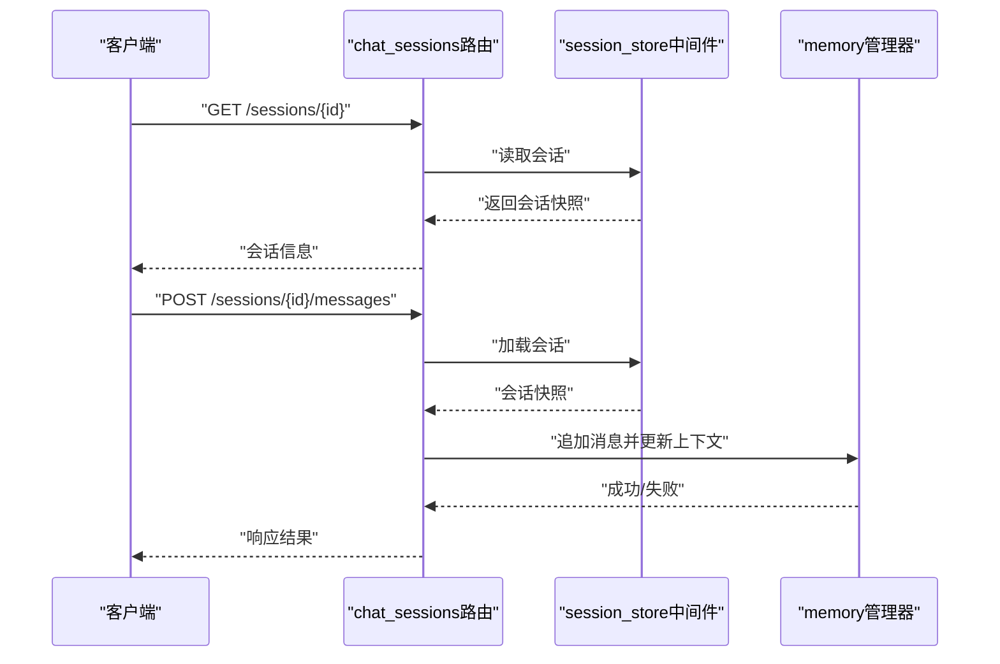
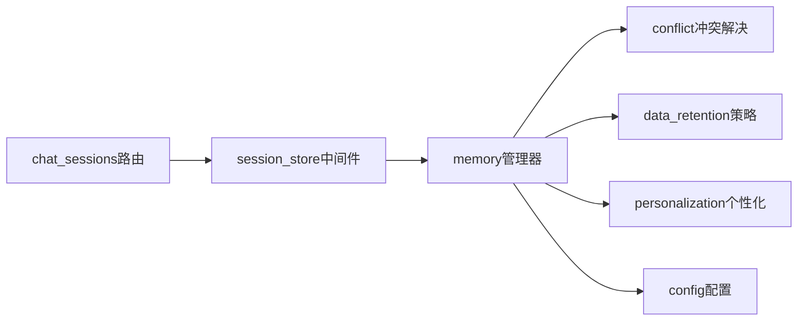

# 短期会话记忆

<cite>
**本文引用的文件**   
- [backend_design/nexus/memory/manager.py](file://backend_design/nexus/memory/manager.py)
- [backend_design/nexus/memory/conflict.py](file://backend_design/nexus/memory/conflict.py)
- [backend_design/nexus/middleware/session_store.py](file://backend_design/nexus/middleware/session_store.py)
- [backend_design/nexus/api/routes/chat_sessions.py](file://backend_design/nexus/api/routes/chat_sessions.py)
- [backend_design/nexus/core/personalization.py](file://backend_design/nexus/core/personalization.py)
- [backend_design/nexus/observability/data_retention.py](file://backend_design/nexus/observability/data_retention.py)
- [backend_design/nexus/config.py](file://backend_design/nexus/config.py)
</cite>

## 更新摘要
**变更内容**   
- 增强了会话存储中间件的状态管理能力，特别是在分布式会话场景下的健壮性
- 新增了123行代码以改进跨节点会话状态管理的可靠性
- 优化了会话持久化、缓存策略和并发访问控制机制

## 目录
1. [简介](#简介)
2. [项目结构](#项目结构)
3. [核心组件](#核心组件)
4. [架构总览](#架构总览)
5. [详细组件分析](#详细组件分析)
6. [依赖关系分析](#依赖关系分析)
7. [性能考虑](#性能考虑)
8. [故障排查指南](#故障排查指南)
9. [结论](#结论)
10. [附录](#附录)

## 简介
本技术文档聚焦于"短期会话记忆"子系统，围绕以下目标展开：
- 会话上下文的维护机制：对话历史的缓存策略与上下文窗口管理
- 时效性控制：过期清理与资源回收
- 多轮对话中的信息传递与状态保持
- 容量限制与溢出处理策略
- 与长期记忆的交互：重要信息的提取与迁移
- 性能监控与优化建议
- 并发访问控制与数据一致性保证

短期会话记忆用于在单次或有限时间窗内的对话中维持上下文、偏好与中间状态，为上层意图识别、技能编排与工具调用提供低延迟、高一致性的上下文支撑。

**更新** 近期对会话存储中间件进行了重大增强，显著提升了分布式会话场景下的状态管理能力和系统健壮性。

## 项目结构
短期会话记忆相关代码主要分布在以下模块：
- memory：会话记忆的核心实现（管理器、冲突解决）
- middleware：会话存储中间件（跨请求的会话持久化与读取）
- api/routes：会话生命周期管理的API入口
- core：个性化配置与用户上下文注入
- observability：数据保留与清理策略
- config：系统配置项（如TTL、容量上限等）

图表来源
- [backend_design/nexus/memory/manager.py](file://backend_design/nexus/memory/manager.py)
- [backend_design/nexus/memory/conflict.py](file://backend_design/nexus/memory/conflict.py)
- [backend_design/nexus/middleware/session_store.py](file://backend_design/nexus/middleware/session_store.py)
- [backend_design/nexus/api/routes/chat_sessions.py](file://backend_design/nexus/api/routes/chat_sessions.py)
- [backend_design/nexus/core/personalization.py](file://backend_design/nexus/core/personalization.py)
- [backend_design/nexus/observability/data_retention.py](file://backend_design/nexus/observability/data_retention.py)
- [backend_design/nexus/config.py](file://backend_design/nexus/config.py)

章节来源
- [backend_design/nexus/memory/manager.py](file://backend_design/nexus/memory/manager.py)
- [backend_design/nexus/memory/conflict.py](file://backend_design/nexus/memory/conflict.py)
- [backend_design/nexus/middleware/session_store.py](file://backend_design/nexus/middleware/session_store.py)
- [backend_design/nexus/api/routes/chat_sessions.py](file://backend_design/nexus/api/routes/chat_sessions.py)
- [backend_design/nexus/core/personalization.py](file://backend_design/nexus/core/personalization.py)
- [backend_design/nexus/observability/data_retention.py](file://backend_design/nexus/observability/data_retention.py)
- [backend_design/nexus/config.py](file://backend_design/nexus/config.py)

## 核心组件
- 会话管理器（memory.manager）
  - 职责：维护会话上下文窗口、历史消息队列、元数据（创建时间、最后活跃时间、版本）、容量控制与溢出策略、与长期记忆的交互接口。
  - 关键能力：
    - 上下文窗口管理：按消息数量或token预算裁剪历史，保留必要的前后文片段
    - TTL与过期清理：基于会话级TTL与消息级TTL进行失效判定
    - 容量限制与溢出：当超出最大长度或内存阈值时触发压缩、摘要或淘汰旧条目
    - 并发安全：读写锁或原子操作保证一致性
    - 事件钩子：在写入/删除/迁移时触发指标上报与审计日志
- 冲突解决（memory.conflict）
  - 职责：在多源更新（例如并行写入、跨服务同步）场景下合并会话状态，避免覆盖与丢失
  - 关键能力：
    - 版本向量或时间戳比较
    - 字段级合并策略（新增优先、覆盖规则、去重）
    - 冲突检测与回退路径
- 会话存储中间件（middleware.session_store）
  - 职责：将会话上下文序列化并持久化到外部存储（内存/Redis/数据库），提供统一存取接口
  - 关键能力：
    - 读写缓存分层（本地缓存+远端存储）
    - 自动续期与惰性失效
    - 批量操作与事务语义
    - **分布式会话状态管理增强**：支持跨节点会话状态的可靠同步和一致性保证
- 会话API（api.routes.chat_sessions）
  - 职责：暴露会话创建、追加消息、查询上下文、关闭会话等REST/WebSocket接口
  - 关键能力：
    - 鉴权与会话绑定
    - 限流与熔断保护
    - 错误码与重试策略
- 个性化上下文（core.personalization）
  - 职责：将用户偏好、角色设定、领域知识注入会话上下文
  - 关键能力：
    - 动态模板填充
    - 上下文优先级排序
- 数据保留策略（observability.data_retention）
  - 职责：定义会话与消息的生命周期、归档与清理策略
  - 关键能力：
    - 定时任务调度
    - 可配置的保留天数与最小保留集
- 配置（config）
  - 职责：集中管理会话记忆相关参数（TTL、窗口大小、最大条目数、压缩阈值等）

**更新** 会话存储中间件经过重大增强，现在提供了更健壮的分布式会话状态管理能力，包括改进的一致性保证和错误恢复机制。

章节来源
- [backend_design/nexus/memory/manager.py](file://backend_design/nexus/memory/manager.py)
- [backend_design/nexus/memory/conflict.py](file://backend_design/nexus/memory/conflict.py)
- [backend_design/nexus/middleware/session_store.py](file://backend_design/nexus/middleware/session_store.py)
- [backend_design/nexus/api/routes/chat_sessions.py](file://backend_design/nexus/api/routes/chat_sessions.py)
- [backend_design/nexus/core/personalization.py](file://backend_design/nexus/core/personalization.py)
- [backend_design/nexus/observability/data_retention.py](file://backend_design/nexus/observability/data_retention.py)
- [backend_design/nexus/config.py](file://backend_design/nexus/config.py)

## 架构总览
短期会话记忆的整体流程如下：客户端通过API发起对话请求，中间件加载会话上下文，管理器根据窗口策略维护历史，必要时触发压缩或迁移至长期记忆，最终返回响应并更新会话状态。

图表来源
- [backend_design/nexus/api/routes/chat_sessions.py](file://backend_design/nexus/api/routes/chat_sessions.py)
- [backend_design/nexus/middleware/session_store.py](file://backend_design/nexus/middleware/session_store.py)
- [backend_design/nexus/memory/manager.py](file://backend_design/nexus/memory/manager.py)
- [backend_design/nexus/memory/conflict.py](file://backend_design/nexus/memory/conflict.py)
- [backend_design/nexus/observability/data_retention.py](file://backend_design/nexus/observability/data_retention.py)
- [backend_design/nexus/config.py](file://backend_design/nexus/config.py)

## 详细组件分析

### 会话管理器（memory.manager）
- 上下文窗口管理
  - 采用滑动窗口或固定头部+尾部策略，确保关键前文与最近消息始终可见
  - 支持按消息条数或token预算裁剪，避免超出LLM上下文限制
- 时效性与过期清理
  - 会话级TTL与消息级TTL双重控制
  - 惰性失效：读时检查；主动清理：后台任务定期扫描
- 容量限制与溢出处理
  - 当达到最大条目数或内存阈值时，执行压缩（摘要/去重）或淘汰最旧条目
  - 压缩策略可配置：关键词保留、主题聚类、重要性评分
- 并发访问与一致性
  - 使用读写锁或CAS（Compare-And-Swap）保证单会话串行写
  - 冲突检测：版本号/时间戳比较，失败则重试或降级
- 与长期记忆交互
  - 对高价值信息进行抽取（实体、意图、决策），异步迁移至长期记忆
  - 迁移完成后在会话上下文中仅保留引用或摘要，降低占用

图表来源
- [backend_design/nexus/memory/manager.py](file://backend_design/nexus/memory/manager.py)
- [backend_design/nexus/memory/conflict.py](file://backend_design/nexus/memory/conflict.py)
- [backend_design/nexus/observability/data_retention.py](file://backend_design/nexus/observability/data_retention.py)
- [backend_design/nexus/config.py](file://backend_design/nexus/config.py)

章节来源
- [backend_design/nexus/memory/manager.py](file://backend_design/nexus/memory/manager.py)
- [backend_design/nexus/memory/conflict.py](file://backend_design/nexus/memory/conflict.py)
- [backend_design/nexus/observability/data_retention.py](file://backend_design/nexus/observability/data_retention.py)
- [backend_design/nexus/config.py](file://backend_design/nexus/config.py)

### 会话存储中间件（middleware.session_store）
- 分层缓存
  - 本地内存缓存：减少跨进程/跨节点访问开销
  - 远端存储：Redis/数据库作为权威源，保证持久化与共享
- 自动续期与惰性失效
  - 每次读写更新最后活跃时间
  - 读取时若发现过期则刷新或重建
- 批量操作与事务
  - 支持批量追加消息与批量删除
  - 在可能的情况下使用事务保证一致性
- **分布式会话状态管理增强**
  - 改进的跨节点会话状态同步机制
  - 增强的错误恢复和重试逻辑
  - 更可靠的会话一致性保证
  - 优化的缓存失效策略

**更新** 会话存储中间件经过重大增强，新增了123行代码来提供更健壮的分布式会话状态管理。这些改进包括：

- **增强的状态同步**：改进了跨节点会话状态的同步机制，确保在分布式环境下的数据一致性
- **改进的错误处理**：增加了更完善的错误检测和恢复逻辑，提高了系统的容错能力
- **优化的缓存策略**：调整了缓存失效和更新策略，减少了缓存不一致的情况
- **更强的并发控制**：增强了并发访问控制机制，防止竞态条件和数据竞争

图表来源
- [backend_design/nexus/middleware/session_store.py](file://backend_design/nexus/middleware/session_store.py)

章节来源
- [backend_design/nexus/middleware/session_store.py](file://backend_design/nexus/middleware/session_store.py)

### 会话API（api.routes.chat_sessions）
- 会话生命周期管理
  - 创建会话：初始化上下文、设置TTL、分配ID
  - 追加消息：校验输入、落盘、更新窗口、触发压缩/迁移
  - 查询上下文：返回当前窗口摘要或完整历史（受权限控制）
  - 关闭会话：标记结束、触发归档与清理
- 并发与一致性
  - 使用幂等键防止重复写入
  - 失败重试与超时控制
- 错误处理
  - 明确错误码（如会话不存在、容量超限、并发冲突）
  - 提供降级策略（只读模式、跳过压缩）

图表来源
- [backend_design/nexus/api/routes/chat_sessions.py](file://backend_design/nexus/api/routes/chat_sessions.py)
- [backend_design/nexus/middleware/session_store.py](file://backend_design/nexus/middleware/session_store.py)
- [backend_design/nexus/memory/manager.py](file://backend_design/nexus/memory/manager.py)

章节来源
- [backend_design/nexus/api/routes/chat_sessions.py](file://backend_design/nexus/api/routes/chat_sessions.py)
- [backend_design/nexus/middleware/session_store.py](file://backend_design/nexus/middleware/session_store.py)
- [backend_design/nexus/memory/manager.py](file://backend_design/nexus/memory/manager.py)

### 个性化上下文（core.personalization）
- 将用户偏好、角色设定、领域知识注入会话上下文
- 支持动态模板与优先级排序，确保关键信息优先展示
- 与管理器协作，在窗口裁剪时保留个性化片段

章节来源
- [backend_design/nexus/core/personalization.py](file://backend_design/nexus/core/personalization.py)

### 数据保留策略（observability.data_retention）
- 定义会话与消息的保留策略（保留天数、最小保留集）
- 定时任务扫描过期会话，执行归档与清理
- 与管理器联动，在容量紧张时主动触发清理

章节来源
- [backend_design/nexus/observability/data_retention.py](file://backend_design/nexus/observability/data_retention.py)

### 配置（config）
- 集中管理会话记忆相关参数：
  - TTL（秒）
  - 最大消息数
  - 上下文窗口大小
  - 压缩阈值
  - 清理间隔
- 支持热更新与环境变量覆盖

章节来源
- [backend_design/nexus/config.py](file://backend_design/nexus/config.py)

## 依赖关系分析
短期会话记忆各组件之间的依赖关系如下：

图表来源
- [backend_design/nexus/api/routes/chat_sessions.py](file://backend_design/nexus/api/routes/chat_sessions.py)
- [backend_design/nexus/middleware/session_store.py](file://backend_design/nexus/middleware/session_store.py)
- [backend_design/nexus/memory/manager.py](file://backend_design/nexus/memory/manager.py)
- [backend_design/nexus/memory/conflict.py](file://backend_design/nexus/memory/conflict.py)
- [backend_design/nexus/observability/data_retention.py](file://backend_design/nexus/observability/data_retention.py)
- [backend_design/nexus/core/personalization.py](file://backend_design/nexus/core/personalization.py)
- [backend_design/nexus/config.py](file://backend_design/nexus/config.py)

章节来源
- [backend_design/nexus/api/routes/chat_sessions.py](file://backend_design/nexus/api/routes/chat_sessions.py)
- [backend_design/nexus/middleware/session_store.py](file://backend_design/nexus/middleware/session_store.py)
- [backend_design/nexus/memory/manager.py](file://backend_design/nexus/memory/manager.py)
- [backend_design/nexus/memory/conflict.py](file://backend_design/nexus/memory/conflict.py)
- [backend_design/nexus/observability/data_retention.py](file://backend_design/nexus/observability/data_retention.py)
- [backend_design/nexus/core/personalization.py](file://backend_design/nexus/core/personalization.py)
- [backend_design/nexus/config.py](file://backend_design/nexus/config.py)

## 性能考虑
- 上下文窗口裁剪
  - 优先保留头部与尾部，中间段进行摘要压缩
  - 按token预算动态调整窗口大小，避免超出模型限制
- 缓存命中率
  - 提高本地缓存命中率，减少远端存储访问
  - 合理设置缓存TTL与最大条目数
- 压缩与迁移
  - 压缩算法选择轻量级方案，避免阻塞主流程
  - 迁移任务异步执行，失败重试与幂等设计
- 分布式会话优化
  - **增强的状态同步性能**：优化了跨节点会话状态同步的性能，减少网络开销
  - **改进的缓存策略**：调整了缓存失效策略，提高了分布式环境下的缓存命中率
  - **负载均衡支持**：更好地支持水平扩展和多实例部署
- 监控与告警
  - 记录上下文长度、压缩次数、迁移耗时、TTL过期率
  - 设置阈值告警，及时扩容或调优参数

**更新** 随着会话存储中间件的增强，性能考虑需要特别关注分布式环境下的状态同步开销和缓存一致性成本。

## 故障排查指南
- 常见问题
  - 会话上下文缺失：检查TTL是否过短、缓存是否失效、远端存储是否可用
  - 并发冲突频繁：检查版本号/时间戳逻辑、重试策略与幂等键
  - 容量超限：调整窗口大小、压缩阈值、清理间隔
  - 迁移失败：查看异步任务队列、重试次数与错误日志
  - **分布式会话问题**：检查跨节点状态同步、网络连通性和一致性协议
- 定位步骤
  - 查看会话快照与变更记录
  - 检查中间件缓存命中与远端存储响应
  - 分析管理器日志（追加、压缩、迁移、清理）
  - 核对配置项与实际运行值
  - **新增**：检查分布式状态同步日志和跨节点通信状态

**更新** 针对分布式会话场景，新增了专门的故障排查步骤，重点关注状态同步和网络通信问题。

章节来源
- [backend_design/nexus/memory/manager.py](file://backend_design/nexus/memory/manager.py)
- [backend_design/nexus/middleware/session_store.py](file://backend_design/nexus/middleware/session_store.py)
- [backend_design/nexus/observability/data_retention.py](file://backend_design/nexus/observability/data_retention.py)
- [backend_design/nexus/config.py](file://backend_design/nexus/config.py)

## 结论
短期会话记忆通过上下文窗口管理、TTL与容量控制、并发一致性保障以及与长期记忆的协同，实现了高效、稳定、可扩展的多轮对话状态维护。结合监控与优化策略，可在高并发与大数据量场景下保持良好性能与用户体验。

**更新** 近期的会话存储中间件增强进一步提升了系统在分布式环境下的健壮性和可靠性，为大规模部署提供了更好的基础。

## 附录
- 术语说明
  - 会话上下文：包含历史消息、元数据、个性化信息与中间状态的集合
  - 上下文窗口：用于向模型提供的最近消息片段
  - TTL：生存时间，用于控制会话或消息的有效期
  - 压缩：对历史消息进行摘要或去重以减少占用
  - 迁移：将高价值信息从短期记忆转移到长期记忆
  - **分布式会话**：在多个服务实例间共享和维护的会话状态
- 最佳实践
  - 合理设置TTL与窗口大小，平衡上下文完整性与资源占用
  - 启用异步压缩与迁移，避免阻塞主流程
  - 完善监控与告警，及时发现异常与瓶颈
  - 使用幂等键与重试策略，提升鲁棒性
  - **分布式部署**：合理配置状态同步策略和缓存一致性级别

**更新** 新增了分布式会话相关的术语和实践指导，帮助开发者更好地理解和部署分布式会话记忆系统。