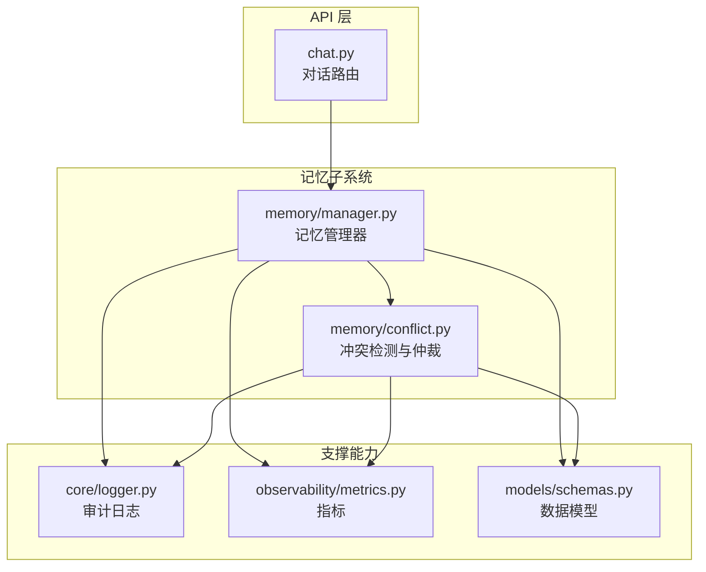
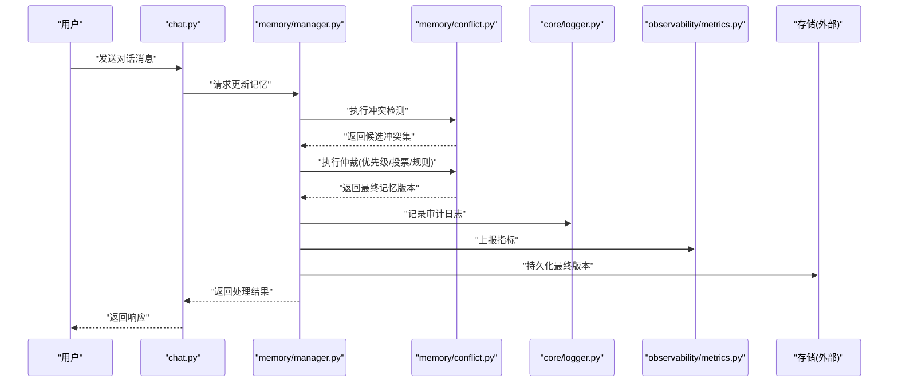
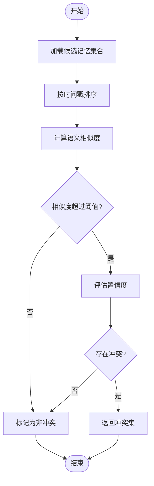
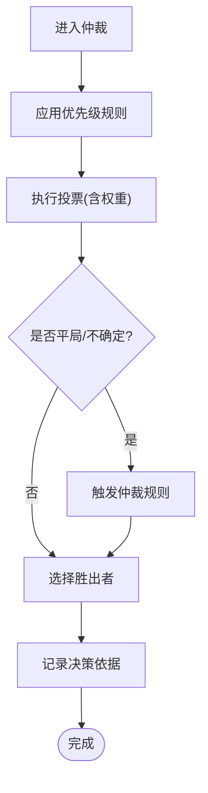
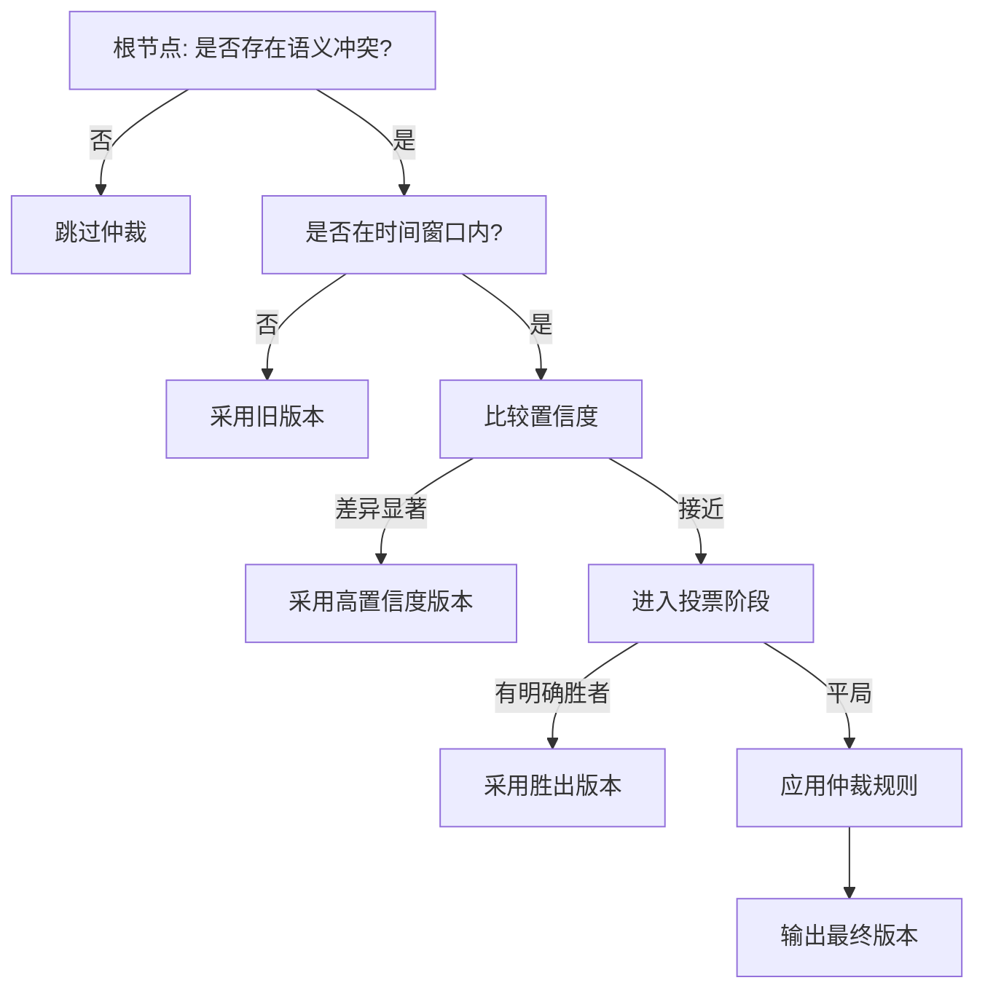
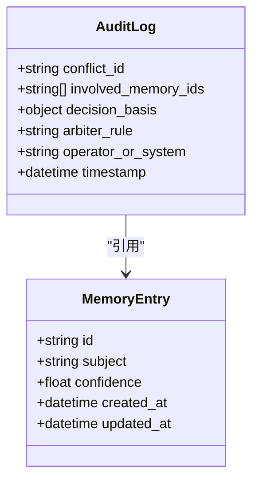
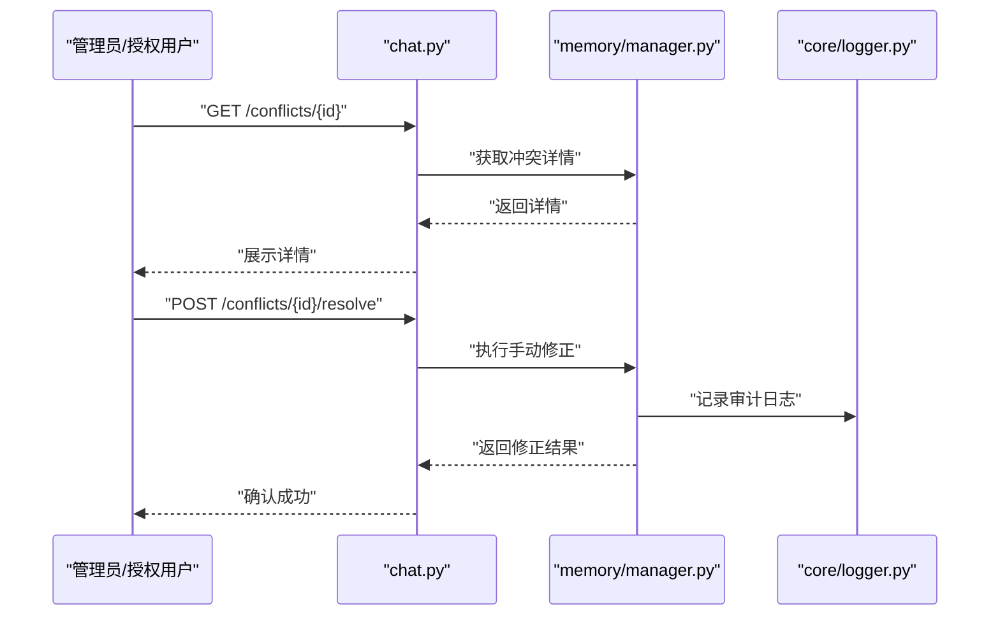
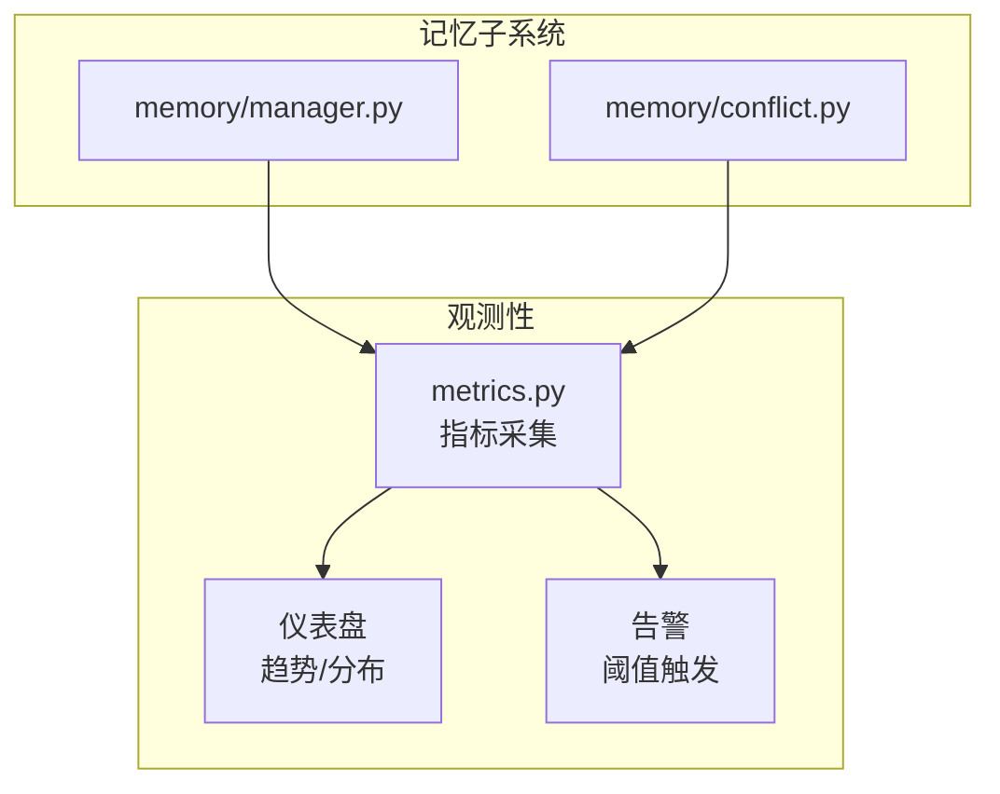
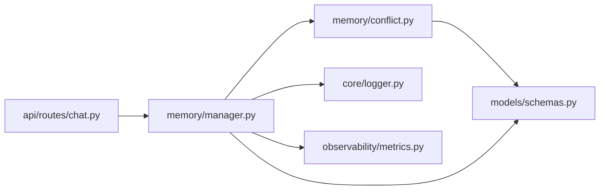

# 记忆冲突解决

<cite>
**本文引用的文件**   
- [backend_design/nexus/memory/conflict.py](file://backend_design/nexus/memory/conflict.py)
- [backend_design/nexus/memory/manager.py](file://backend_design/nexus/memory/manager.py)
- [backend_design/nexus/core/logger.py](file://backend_design/nexus/core/logger.py)
- [backend_design/nexus/observability/metrics.py](file://backend_design/nexus/observability/metrics.py)
- [backend_design/nexus/api/routes/chat.py](file://backend_design/nexus/api/routes/chat.py)
- [backend_design/nexus/models/schemas.py](file://backend_design/nexus/models/schemas.py)
</cite>

## 目录
1. [简介](#简介)
2. [项目结构](#项目结构)
3. [核心组件](#核心组件)
4. [架构总览](#架构总览)
5. [详细组件分析](#详细组件分析)
6. [依赖分析](#依赖分析)
7. [性能考虑](#性能考虑)
8. [故障排查指南](#故障排查指南)
9. [结论](#结论)
10. [附录](#附录) 

## 简介
本文件围绕“记忆冲突解决”机制，系统化阐述冲突检测与解决的算法、策略、规则引擎、可追溯性与审计日志、用户干预接口以及监控与分析工具。目标读者包括后端工程师、数据工程师、产品与运营人员，力求在保持技术深度的同时提供易于理解的说明。

## 项目结构
记忆冲突相关代码位于后端模块的 memory 子系统中，并与 API 层、模型定义、日志与观测性模块协作：
- memory/conflict.py：冲突检测与仲裁的核心实现（时间戳比较、置信度评估、语义相似度计算、投票与仲裁）。
- memory/manager.py：记忆生命周期管理，协调写入、检索与冲突处理流程。
- api/routes/chat.py：对话入口，触发记忆提取与冲突解决流程。
- models/schemas.py：记忆条目、冲突事件等数据结构定义。
- core/logger.py：结构化审计日志记录。
- observability/metrics.py：指标采集与上报。

图表来源
- [backend_design/nexus/api/routes/chat.py](file://backend_design/nexus/api/routes/chat.py)
- [backend_design/nexus/memory/manager.py](file://backend_design/nexus/memory/manager.py)
- [backend_design/nexus/memory/conflict.py](file://backend_design/nexus/memory/conflict.py)
- [backend_design/nexus/core/logger.py](file://backend_design/nexus/core/logger.py)
- [backend_design/nexus/observability/metrics.py](file://backend_design/nexus/observability/metrics.py)
- [backend_design/nexus/models/schemas.py](file://backend_design/nexus/models/schemas.py)

章节来源
- [backend_design/nexus/memory/conflict.py](file://backend_design/nexus/memory/conflict.py)
- [backend_design/nexus/memory/manager.py](file://backend_design/nexus/memory/manager.py)
- [backend_design/nexus/api/routes/chat.py](file://backend_design/nexus/api/routes/chat.py)
- [backend_design/nexus/models/schemas.py](file://backend_design/nexus/models/schemas.py)
- [backend_design/nexus/core/logger.py](file://backend_design/nexus/core/logger.py)
- [backend_design/nexus/observability/metrics.py](file://backend_design/nexus/observability/metrics.py)

## 核心组件
- 冲突检测器：负责识别同一主题或实体的多条记忆之间的冲突，基于时间戳、置信度与语义相似度进行判定。
- 仲裁器：根据优先级、投票与仲裁规则选择最终保留的记忆版本，并生成决策记录。
- 记忆管理器：编排写入、检索、冲突检测与仲裁流程，确保一致性。
- 审计与观测：记录冲突事件、决策依据与结果；暴露指标用于监控与告警。

章节来源
- [backend_design/nexus/memory/conflict.py](file://backend_design/nexus/memory/conflict.py)
- [backend_design/nexus/memory/manager.py](file://backend_design/nexus/memory/manager.py)

## 架构总览
下图展示了从对话输入到记忆落库的全链路，突出冲突检测与仲裁的关键节点。

图表来源
- [backend_design/nexus/api/routes/chat.py](file://backend_design/nexus/api/routes/chat.py)
- [backend_design/nexus/memory/manager.py](file://backend_design/nexus/memory/manager.py)
- [backend_design/nexus/memory/conflict.py](file://backend_design/nexus/memory/conflict.py)
- [backend_design/nexus/core/logger.py](file://backend_design/nexus/core/logger.py)
- [backend_design/nexus/observability/metrics.py](file://backend_design/nexus/observability/metrics.py)

## 详细组件分析

### 冲突检测算法
- 时间戳比较：对候选记忆按时间顺序排序，结合过期策略与版本演进，确定新旧关系。
- 置信度评估：综合来源可信度、上下文质量、抽取稳定性等维度，量化每条记忆的置信分数。
- 语义相似度计算：通过向量表示与相似度度量，判断两条记忆是否表达相同或相近事实，从而判定潜在冲突。

图表来源
- [backend_design/nexus/memory/conflict.py](file://backend_design/nexus/memory/conflict.py)

章节来源
- [backend_design/nexus/memory/conflict.py](file://backend_design/nexus/memory/conflict.py)

### 冲突解决策略
- 优先级判断：基于来源权重、领域专家等级、业务重要性等设定优先级。
- 投票机制：多源证据对同一事实进行投票，支持加权投票与动态权重调整。
- 仲裁规则：当投票平局或出现复杂情形时，启用仲裁规则（如最近有效优先、高置信度优先、人工介入优先）以做出最终决定。

图表来源
- [backend_design/nexus/memory/conflict.py](file://backend_design/nexus/memory/conflict.py)

章节来源
- [backend_design/nexus/memory/conflict.py](file://backend_design/nexus/memory/conflict.py)

### 决策树与规则引擎
- 决策树：将冲突类型、证据强度、时间窗口、领域约束等条件组织为分支路径，快速定位解决方案。
- 规则引擎：将优先级、投票、仲裁等策略配置化为可维护的规则，支持热更新与灰度发布。

图表来源
- [backend_design/nexus/memory/conflict.py](file://backend_design/nexus/memory/conflict.py)

章节来源
- [backend_design/nexus/memory/conflict.py](file://backend_design/nexus/memory/conflict.py)

### 可追溯性与审计日志
- 审计字段：包含冲突ID、涉及记忆ID、决策依据（时间戳、置信度、相似度）、仲裁规则、操作人/系统、时间戳等。
- 日志格式：结构化JSON，便于查询与聚合分析。
- 关联追踪：通过会话ID、用户ID、租户ID等上下文键，串联端到端调用链。

图表来源
- [backend_design/nexus/core/logger.py](file://backend_design/nexus/core/logger.py)
- [backend_design/nexus/models/schemas.py](file://backend_design/nexus/models/schemas.py)

章节来源
- [backend_design/nexus/core/logger.py](file://backend_design/nexus/core/logger.py)
- [backend_design/nexus/models/schemas.py](file://backend_design/nexus/models/schemas.py)

### 用户干预接口与手动修正
- 查询接口：提供按冲突ID或记忆ID查询冲突详情与决策历史的能力。
- 修正接口：允许授权用户对特定冲突进行手动覆盖，记录操作人与原因。
- 权限控制：基于角色与资源隔离，确保仅授权主体可修改关键记忆。

图表来源
- [backend_design/nexus/api/routes/chat.py](file://backend_design/nexus/api/routes/chat.py)
- [backend_design/nexus/memory/manager.py](file://backend_design/nexus/memory/manager.py)
- [backend_design/nexus/core/logger.py](file://backend_design/nexus/core/logger.py)

章节来源
- [backend_design/nexus/api/routes/chat.py](file://backend_design/nexus/api/routes/chat.py)
- [backend_design/nexus/memory/manager.py](file://backend_design/nexus/memory/manager.py)
- [backend_design/nexus/core/logger.py](file://backend_design/nexus/core/logger.py)

### 监控与分析工具
- 指标项：冲突数量、仲裁耗时、不同仲裁规则使用占比、误判率、回滚次数等。
- 可视化：仪表盘展示趋势与分布，支持按租户、领域、来源维度下钻。
- 告警：当冲突率或仲裁失败率超阈时触发告警，辅助运维快速定位问题。

图表来源
- [backend_design/nexus/observability/metrics.py](file://backend_design/nexus/observability/metrics.py)
- [backend_design/nexus/memory/manager.py](file://backend_design/nexus/memory/manager.py)
- [backend_design/nexus/memory/conflict.py](file://backend_design/nexus/memory/conflict.py)

章节来源
- [backend_design/nexus/observability/metrics.py](file://backend_design/nexus/observability/metrics.py)
- [backend_design/nexus/memory/manager.py](file://backend_design/nexus/memory/manager.py)
- [backend_design/nexus/memory/conflict.py](file://backend_design/nexus/memory/conflict.py)

## 依赖分析
- 低耦合设计：冲突检测与仲裁逻辑集中在 conflict.py，manager.py 作为编排层，避免强耦合。
- 外部依赖：存储层通过 manager 抽象，屏蔽具体数据库细节；日志与指标通过独立模块注入。
- 循环依赖检查：当前结构未见循环导入风险，API 层仅依赖 manager 提供的稳定接口。

图表来源
- [backend_design/nexus/api/routes/chat.py](file://backend_design/nexus/api/routes/chat.py)
- [backend_design/nexus/memory/manager.py](file://backend_design/nexus/memory/manager.py)
- [backend_design/nexus/memory/conflict.py](file://backend_design/nexus/memory/conflict.py)
- [backend_design/nexus/core/logger.py](file://backend_design/nexus/core/logger.py)
- [backend_design/nexus/observability/metrics.py](file://backend_design/nexus/observability/metrics.py)
- [backend_design/nexus/models/schemas.py](file://backend_design/nexus/models/schemas.py)

章节来源
- [backend_design/nexus/api/routes/chat.py](file://backend_design/nexus/api/routes/chat.py)
- [backend_design/nexus/memory/manager.py](file://backend_design/nexus/memory/manager.py)
- [backend_design/nexus/memory/conflict.py](file://backend_design/nexus/memory/conflict.py)
- [backend_design/nexus/core/logger.py](file://backend_design/nexus/core/logger.py)
- [backend_design/nexus/observability/metrics.py](file://backend_design/nexus/observability/metrics.py)
- [backend_design/nexus/models/schemas.py](file://backend_design/nexus/models/schemas.py)

## 性能考虑
- 相似度计算优化：对大规模候选集采用近似最近邻检索与分桶策略，降低全量比对开销。
- 增量仲裁：仅对新增或变更的记忆参与冲突检测，减少不必要的计算。
- 缓存策略：对高频主题的相似度与置信度结果进行短期缓存，提升吞吐。
- 异步批处理：非实时场景可将冲突检测与仲裁放入队列，削峰填谷。

[本节为通用指导，不直接分析具体文件]

## 故障排查指南
- 常见症状：
  - 冲突率异常升高：检查相似度阈值与置信度校准参数。
  - 仲裁耗时过长：关注候选集规模与相似度计算瓶颈。
  - 决策不一致：核对规则版本与权重配置变更。
- 定位步骤：
  - 通过审计日志检索冲突ID，查看决策依据与仲裁规则。
  - 对比指标中的冲突分布与耗时趋势，定位热点主题或来源。
  - 复现实例：使用相同上下文与输入重放，验证规则生效情况。
- 修复建议：
  - 调整阈值与权重，必要时引入人工复核通道。
  - 对异常来源进行降级或限流，防止污染整体置信度。

章节来源
- [backend_design/nexus/core/logger.py](file://backend_design/nexus/core/logger.py)
- [backend_design/nexus/observability/metrics.py](file://backend_design/nexus/observability/metrics.py)

## 结论
本方案通过时间戳、置信度与语义相似度三位一体的冲突检测，配合优先级、投票与仲裁的策略组合，实现了高可用、可追溯、可观测的记忆冲突解决机制。借助审计日志与指标体系，可在生产环境中持续优化规则与参数，保障记忆的一致性与准确性。

[本节为总结性内容，不直接分析具体文件]

## 附录
- 最佳实践：
  - 定期回顾仲裁规则与权重，结合业务反馈迭代。
  - 对高风险领域启用更严格的相似度阈值与人工复核。
  - 建立灰度发布流程，逐步扩大新规则覆盖范围。
- 参考实现路径：
  - 冲突检测与仲裁：[backend_design/nexus/memory/conflict.py](file://backend_design/nexus/memory/conflict.py)
  - 记忆编排：[backend_design/nexus/memory/manager.py](file://backend_design/nexus/memory/manager.py)
  - 审计日志：[backend_design/nexus/core/logger.py](file://backend_design/nexus/core/logger.py)
  - 指标采集：[backend_design/nexus/observability/metrics.py](file://backend_design/nexus/observability/metrics.py)
  - 数据模型：[backend_design/nexus/models/schemas.py](file://backend_design/nexus/models/schemas.py)
  - 对话入口：[backend_design/nexus/api/routes/chat.py](file://backend_design/nexus/api/routes/chat.py)