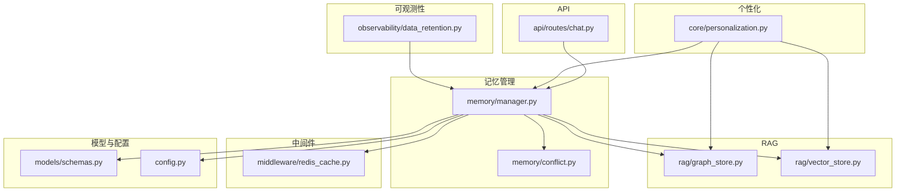
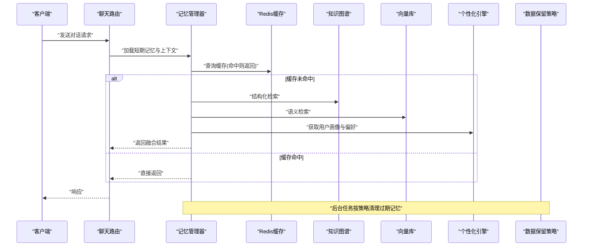
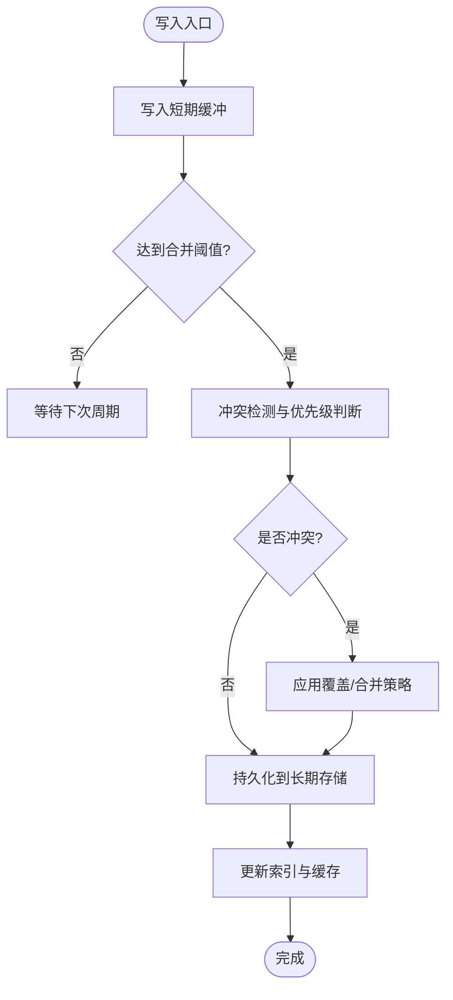
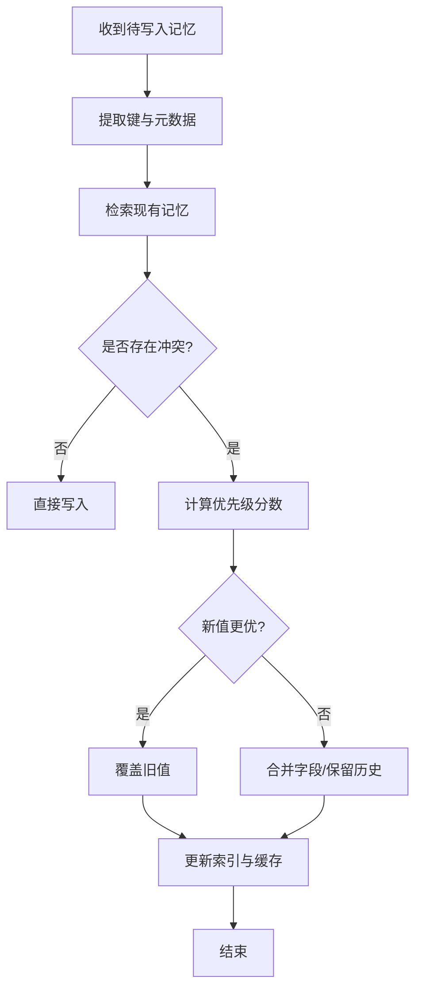
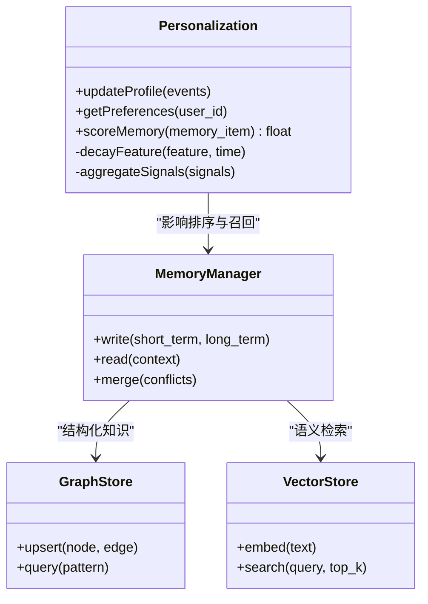
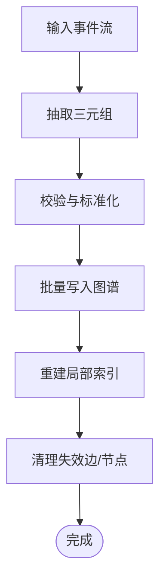
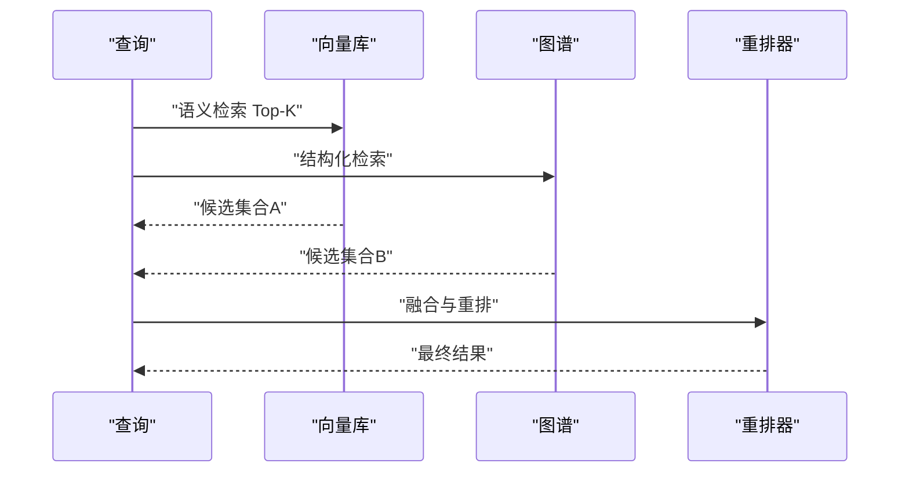
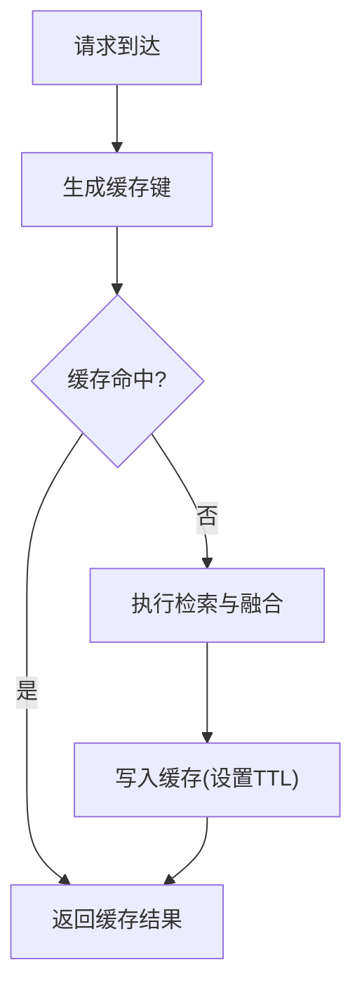
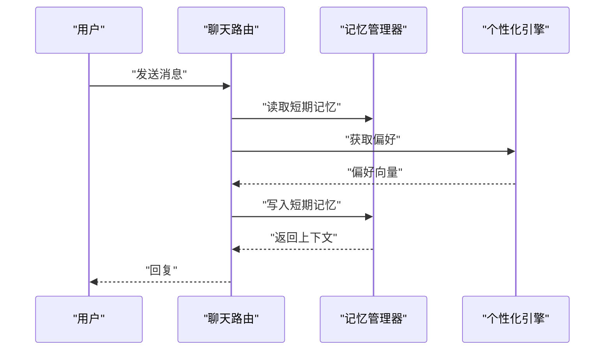
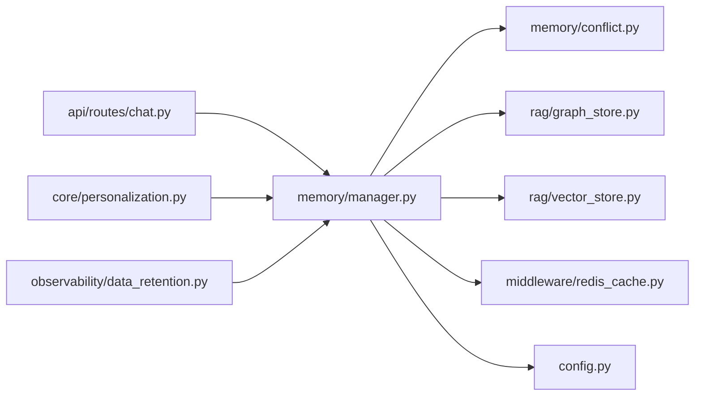

# 记忆管理系统

<cite>
**本文引用的文件**   
- [backend_design/nexus/memory/manager.py](file://backend_design/nexus/memory/manager.py)
- [backend_design/nexus/memory/conflict.py](file://backend_design/nexus/memory/conflict.py)
- [backend_design/nexus/core/personalization.py](file://backend_design/nexus/core/personalization.py)
- [backend_design/nexus/rag/graph_store.py](file://backend_design/nexus/rag/graph_store.py)
- [backend_design/nexus/rag/vector_store.py](file://backend_design/nexus/rag/vector_store.py)
- [backend_design/nexus/middleware/redis_cache.py](file://backend_design/nexus/middleware/redis_cache.py)
- [backend_design/nexus/api/routes/chat.py](file://backend_design/nexus/api/routes/chat.py)
- [backend_design/nexus/models/schemas.py](file://backend_design/nexus/models/schemas.py)
- [backend_design/nexus/config.py](file://backend_design/nexus/config.py)
- [backend_design/nexus/observability/data_retention.py](file://backend_design/nexus/observability/data_retention.py)
</cite>

## 目录
1. [简介](#简介)
2. [项目结构](#项目结构)
3. [核心组件](#核心组件)
4. [架构总览](#架构总览)
5. [详细组件分析](#详细组件分析)
6. [依赖关系分析](#依赖关系分析)
7. [性能考虑](#性能考虑)
8. [故障排查指南](#故障排查指南)
9. [结论](#结论)
10. [附录](#附录)

## 简介
本技术文档围绕记忆管理系统的长期记忆与短期记忆存储策略、访问模式、用户画像构建与偏好学习机制、记忆冲突检测与处理（含优先级与一致性维护）、知识图谱的构建与维护、隐私保护与数据安全策略，以及数据导入导出与迁移工具的使用进行系统化说明。同时提供性能优化与缓存策略的实现细节，帮助读者快速理解并高效使用该系统。

## 项目结构
记忆管理相关代码主要分布在以下模块：
- memory：记忆生命周期管理与冲突处理
- core/personalization：用户画像与偏好学习
- rag/graph_store、vector_store：知识图谱与向量检索
- middleware/redis_cache：缓存层
- api/routes/chat：对话入口中的记忆读写调用点
- models/schemas：记忆相关的数据模型定义
- config：系统配置项
- observability/data_retention：数据保留与清理策略

图表来源
- [backend_design/nexus/memory/manager.py](file://backend_design/nexus/memory/manager.py)
- [backend_design/nexus/memory/conflict.py](file://backend_design/nexus/memory/conflict.py)
- [backend_design/nexus/core/personalization.py](file://backend_design/nexus/core/personalization.py)
- [backend_design/nexus/rag/graph_store.py](file://backend_design/nexus/rag/graph_store.py)
- [backend_design/nexus/rag/vector_store.py](file://backend_design/nexus/rag/vector_store.py)
- [backend_design/nexus/middleware/redis_cache.py](file://backend_design/nexus/middleware/redis_cache.py)
- [backend_design/nexus/api/routes/chat.py](file://backend_design/nexus/api/routes/chat.py)
- [backend_design/nexus/models/schemas.py](file://backend_design/nexus/models/schemas.py)
- [backend_design/nexus/config.py](file://backend_design/nexus/config.py)
- [backend_design/nexus/observability/data_retention.py](file://backend_design/nexus/observability/data_retention.py)

章节来源
- [backend_design/nexus/memory/manager.py](file://backend_design/nexus/memory/manager.py)
- [backend_design/nexus/memory/conflict.py](file://backend_design/nexus/memory/conflict.py)
- [backend_design/nexus/core/personalization.py](file://backend_design/nexus/core/personalization.py)
- [backend_design/nexus/rag/graph_store.py](file://backend_design/nexus/rag/graph_store.py)
- [backend_design/nexus/rag/vector_store.py](file://backend_design/nexus/rag/vector_store.py)
- [backend_design/nexus/middleware/redis_cache.py](file://backend_design/nexus/middleware/redis_cache.py)
- [backend_design/nexus/api/routes/chat.py](file://backend_design/nexus/api/routes/chat.py)
- [backend_design/nexus/models/schemas.py](file://backend_design/nexus/models/schemas.py)
- [backend_design/nexus/config.py](file://backend_design/nexus/config.py)
- [backend_design/nexus/observability/data_retention.py](file://backend_design/nexus/observability/data_retention.py)

## 核心组件
- 记忆管理器：负责短期记忆与长期记忆的写入、读取、合并与淘汰；协调冲突检测与解决；与知识图谱和向量库交互；受配置与数据保留策略约束。
- 冲突处理器：基于时间戳、来源可信度、领域权重等维度判定优先级，执行合并或覆盖策略，保证一致性。
- 个性化引擎：从对话与行为中抽取偏好特征，更新用户画像，驱动记忆检索与推荐。
- 知识图谱与向量存储：分别承载结构化知识与语义相似度检索，支持联合召回与重排。
- 缓存层：Redis 缓存热点记忆片段与画像摘要，降低后端压力。
- API 路由：在对话流程中触发记忆读写与个性化增强。
- 数据模型与配置：统一数据结构与系统参数，确保跨模块一致。
- 数据保留：按策略清理过期记忆，保障隐私与合规。

章节来源
- [backend_design/nexus/memory/manager.py](file://backend_design/nexus/memory/manager.py)
- [backend_design/nexus/memory/conflict.py](file://backend_design/nexus/memory/conflict.py)
- [backend_design/nexus/core/personalization.py](file://backend_design/nexus/core/personalization.py)
- [backend_design/nexus/rag/graph_store.py](file://backend_design/nexus/rag/graph_store.py)
- [backend_design/nexus/rag/vector_store.py](file://backend_design/nexus/rag/vector_store.py)
- [backend_design/nexus/middleware/redis_cache.py](file://backend_design/nexus/middleware/redis_cache.py)
- [backend_design/nexus/api/routes/chat.py](file://backend_design/nexus/api/routes/chat.py)
- [backend_design/nexus/models/schemas.py](file://backend_design/nexus/models/schemas.py)
- [backend_design/nexus/config.py](file://backend_design/nexus/config.py)
- [backend_design/nexus/observability/data_retention.py](file://backend_design/nexus/observability/data_retention.py)

## 架构总览
记忆管理采用“短期记忆缓冲 + 长期记忆持久化”的双层结构，结合知识图谱与向量检索实现精准召回。个性化引擎持续学习用户偏好，提升记忆相关性。缓存层加速热点访问，数据保留策略保障隐私合规。

图表来源
- [backend_design/nexus/api/routes/chat.py](file://backend_design/nexus/api/routes/chat.py)
- [backend_design/nexus/memory/manager.py](file://backend_design/nexus/memory/manager.py)
- [backend_design/nexus/middleware/redis_cache.py](file://backend_design/nexus/middleware/redis_cache.py)
- [backend_design/nexus/rag/graph_store.py](file://backend_design/nexus/rag/graph_store.py)
- [backend_design/nexus/rag/vector_store.py](file://backend_design/nexus/rag/vector_store.py)
- [backend_design/nexus/core/personalization.py](file://backend_design/nexus/core/personalization.py)
- [backend_design/nexus/observability/data_retention.py](file://backend_design/nexus/observability/data_retention.py)

## 详细组件分析

### 记忆管理器（短期与长期记忆）
- 短期记忆：会话级缓冲，记录最近N条关键片段，用于即时上下文拼接与快速响应。
- 长期记忆：跨会话持久化，包含事实、偏好、习惯与事件摘要，支持结构化与非结构化存储。
- 访问模式：读路径优先走缓存，未命中时并行检索图谱与向量库，再回写缓存；写路径先入短期缓冲，周期性合并至长期存储。
- 合并策略：基于时间窗口、去重键、领域标签与置信度进行聚合，避免重复与膨胀。
- 淘汰策略：按活跃度、时效性与重要性评分决定保留与归档。

图表来源
- [backend_design/nexus/memory/manager.py](file://backend_design/nexus/memory/manager.py)
- [backend_design/nexus/memory/conflict.py](file://backend_design/nexus/memory/conflict.py)

章节来源
- [backend_design/nexus/memory/manager.py](file://backend_design/nexus/memory/manager.py)
- [backend_design/nexus/memory/conflict.py](file://backend_design/nexus/memory/conflict.py)

### 冲突检测与处理策略
- 冲突类型：同键不同值、时间倒挂、领域权重不一致、来源可信度差异。
- 优先级维度：时间戳新近性、来源可信度、领域权重、用户显式反馈、业务重要性。
- 一致性维护：原子写入、版本控制、幂等键、事务性合并；失败重试与补偿。
- 决策流程：计算综合得分，选择覆盖或合并；必要时进入人工审核队列。

图表来源
- [backend_design/nexus/memory/conflict.py](file://backend_design/nexus/memory/conflict.py)

章节来源
- [backend_design/nexus/memory/conflict.py](file://backend_design/nexus/memory/conflict.py)

### 用户画像构建与个人偏好学习
- 特征抽取：从对话意图、技能调用、车辆操作与健康指标中提取偏好信号。
- 画像结构：兴趣域、频率、强度、时效衰减、场景条件与置信度。
- 学习机制：增量更新、滑动窗口统计、异常抑制与冷启动策略。
- 应用方式：影响记忆检索排序、推荐内容与主动提示。

图表来源
- [backend_design/nexus/core/personalization.py](file://backend_design/nexus/core/personalization.py)
- [backend_design/nexus/memory/manager.py](file://backend_design/nexus/memory/manager.py)
- [backend_design/nexus/rag/graph_store.py](file://backend_design/nexus/rag/graph_store.py)
- [backend_design/nexus/rag/vector_store.py](file://backend_design/nexus/rag/vector_store.py)

章节来源
- [backend_design/nexus/core/personalization.py](file://backend_design/nexus/core/personalization.py)
- [backend_design/nexus/memory/manager.py](file://backend_design/nexus/memory/manager.py)
- [backend_design/nexus/rag/graph_store.py](file://backend_design/nexus/rag/graph_store.py)
- [backend_design/nexus/rag/vector_store.py](file://backend_design/nexus/rag/vector_store.py)

### 知识图谱的构建与维护
- 节点与边：实体（人、车、地点、事件）、属性与关系（偏好、位置、状态）。
- 构建过程：从对话与技能调用中抽取三元组，校验后批量写入；支持增量更新与冲突合并。
- 查询模式：路径匹配、子图检索、属性过滤与时间窗口限定。
- 维护策略：定期重构、冗余清理、失效边回收与一致性校验。

图表来源
- [backend_design/nexus/rag/graph_store.py](file://backend_design/nexus/rag/graph_store.py)

章节来源
- [backend_design/nexus/rag/graph_store.py](file://backend_design/nexus/rag/graph_store.py)

### 向量检索与混合召回
- 嵌入生成：文本/语音转向量，支持领域微调与动态更新。
- 检索策略：Top-K 近似搜索，结合时间衰减与用户偏好加权。
- 混合召回：与图谱结果融合，通过重排器输出最终候选集。
- 缓存策略：热门查询向量与结果缓存，减少重复计算。

图表来源
- [backend_design/nexus/rag/vector_store.py](file://backend_design/nexus/rag/vector_store.py)
- [backend_design/nexus/rag/graph_store.py](file://backend_design/nexus/rag/graph_store.py)

章节来源
- [backend_design/nexus/rag/vector_store.py](file://backend_design/nexus/rag/vector_store.py)
- [backend_design/nexus/rag/graph_store.py](file://backend_design/nexus/rag/graph_store.py)

### 缓存策略与性能优化
- 缓存粒度：会话上下文、画像摘要、高频记忆片段与检索结果。
- 失效策略：TTL、LRU、事件驱动失效（如用户偏好变更）。
- 并发控制：读写锁、分片缓存、降级回源。
- 监控指标：命中率、延迟分布、内存占用与错误率。

图表来源
- [backend_design/nexus/middleware/redis_cache.py](file://backend_design/nexus/middleware/redis_cache.py)

章节来源
- [backend_design/nexus/middleware/redis_cache.py](file://backend_design/nexus/middleware/redis_cache.py)

### API 集成与调用链路
- 入口：聊天路由在每次对话前后触发记忆读写与个性化增强。
- 上下文：携带用户标识、会话ID、设备与环境信息，用于画像与权限控制。
- 响应：返回融合后的记忆片段与推荐内容，供前端展示或进一步处理。

图表来源
- [backend_design/nexus/api/routes/chat.py](file://backend_design/nexus/api/routes/chat.py)
- [backend_design/nexus/memory/manager.py](file://backend_design/nexus/memory/manager.py)
- [backend_design/nexus/core/personalization.py](file://backend_design/nexus/core/personalization.py)

章节来源
- [backend_design/nexus/api/routes/chat.py](file://backend_design/nexus/api/routes/chat.py)
- [backend_design/nexus/memory/manager.py](file://backend_design/nexus/memory/manager.py)
- [backend_design/nexus/core/personalization.py](file://backend_design/nexus/core/personalization.py)

### 数据模型与配置
- 数据模型：统一记忆条目、画像字段、图谱节点与向量元数据定义，确保跨模块一致。
- 配置项：缓存TTL、合并阈值、冲突优先级权重、数据保留周期、向量维度与Top-K等。

章节来源
- [backend_design/nexus/models/schemas.py](file://backend_design/nexus/models/schemas.py)
- [backend_design/nexus/config.py](file://backend_design/nexus/config.py)

### 隐私保护与数据安全
- 数据最小化：仅收集必要字段，敏感信息脱敏与加密存储。
- 访问控制：基于租户与角色的鉴权，细粒度权限控制。
- 数据保留：按策略自动清理过期记忆，支持用户撤回与删除。
- 审计与追踪：记录关键操作日志，便于追溯与合规检查。

章节来源
- [backend_design/nexus/observability/data_retention.py](file://backend_design/nexus/observability/data_retention.py)

## 依赖关系分析
记忆管理器作为中枢，依赖冲突处理器、知识图谱与向量库、缓存层与配置；个性化引擎影响记忆排序与召回；API路由在对话流程中触发记忆读写；数据保留策略对长期记忆进行清理。

图表来源
- [backend_design/nexus/api/routes/chat.py](file://backend_design/nexus/api/routes/chat.py)
- [backend_design/nexus/memory/manager.py](file://backend_design/nexus/memory/manager.py)
- [backend_design/nexus/memory/conflict.py](file://backend_design/nexus/memory/conflict.py)
- [backend_design/nexus/rag/graph_store.py](file://backend_design/nexus/rag/graph_store.py)
- [backend_design/nexus/rag/vector_store.py](file://backend_design/nexus/rag/vector_store.py)
- [backend_design/nexus/middleware/redis_cache.py](file://backend_design/nexus/middleware/redis_cache.py)
- [backend_design/nexus/config.py](file://backend_design/nexus/config.py)
- [backend_design/nexus/core/personalization.py](file://backend_design/nexus/core/personalization.py)
- [backend_design/nexus/observability/data_retention.py](file://backend_design/nexus/observability/data_retention.py)

章节来源
- [backend_design/nexus/api/routes/chat.py](file://backend_design/nexus/api/routes/chat.py)
- [backend_design/nexus/memory/manager.py](file://backend_design/nexus/memory/manager.py)
- [backend_design/nexus/memory/conflict.py](file://backend_design/nexus/memory/conflict.py)
- [backend_design/nexus/rag/graph_store.py](file://backend_design/nexus/rag/graph_store.py)
- [backend_design/nexus/rag/vector_store.py](file://backend_design/nexus/rag/vector_store.py)
- [backend_design/nexus/middleware/redis_cache.py](file://backend_design/nexus/middleware/redis_cache.py)
- [backend_design/nexus/config.py](file://backend_design/nexus/config.py)
- [backend_design/nexus/core/personalization.py](file://backend_design/nexus/core/personalization.py)
- [backend_design/nexus/observability/data_retention.py](file://backend_design/nexus/observability/data_retention.py)

## 性能考虑
- 缓存命中率优化：合理设置TTL与LRU阈值，热点键分片存储。
- 检索并行化：图谱与向量检索并行执行，缩短端到端延迟。
- 增量更新：小批量写入与局部索引重建，避免全量重构。
- 降级策略：外部服务不可用时回退到本地缓存或默认规则。
- 监控告警：关注缓存命中率、检索延迟、错误率与资源占用。

[本节为通用性能建议，不直接分析具体文件]

## 故障排查指南
- 常见问题
  - 缓存未命中导致延迟升高：检查缓存键生成逻辑与TTL设置。
  - 冲突频繁：调整优先级权重与合并阈值，审查来源可信度。
  - 图谱不一致：执行一致性校验与失效边回收任务。
  - 向量检索质量下降：检查嵌入模型版本与Top-K参数。
- 定位方法
  - 查看日志与指标，确认各阶段耗时与错误码。
  - 回放关键请求，复现问题并对比正常路径。
  - 逐步禁用缓存或外部依赖，隔离问题范围。

章节来源
- [backend_design/nexus/middleware/redis_cache.py](file://backend_design/nexus/middleware/redis_cache.py)
- [backend_design/nexus/memory/conflict.py](file://backend_design/nexus/memory/conflict.py)
- [backend_design/nexus/rag/graph_store.py](file://backend_design/nexus/rag/graph_store.py)
- [backend_design/nexus/rag/vector_store.py](file://backend_design/nexus/rag/vector_store.py)

## 结论
记忆管理系统通过短期与长期记忆分层、冲突检测与优先级策略、知识图谱与向量检索的混合召回、个性化学习与缓存优化，实现了高可用、低延迟且可扩展的记忆能力。配合严格的数据保留与隐私保护策略，系统在用户体验与合规之间取得平衡。

[本节为总结性内容，不直接分析具体文件]

## 附录

### 记忆数据导入导出与迁移
- 导出
  - 按用户或会话范围导出短期与长期记忆，支持JSON与CSV格式。
  - 包含元数据（时间戳、来源、置信度）以便后续分析。
- 导入
  - 校验数据完整性与格式，批量写入短期缓冲并触发合并流程。
  - 冲突处理遵循既定优先级策略，必要时进入审核队列。
- 迁移
  - 版本升级时执行数据迁移脚本，确保新旧结构兼容。
  - 迁移前备份，迁移后校验一致性与索引正确性。

章节来源
- [backend_design/nexus/memory/manager.py](file://backend_design/nexus/memory/manager.py)
- [backend_design/nexus/models/schemas.py](file://backend_design/nexus/models/schemas.py)
- [backend_design/nexus/config.py](file://backend_design/nexus/config.py)