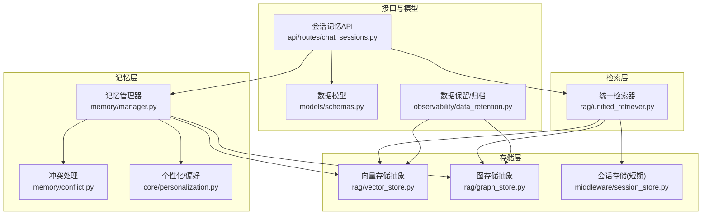
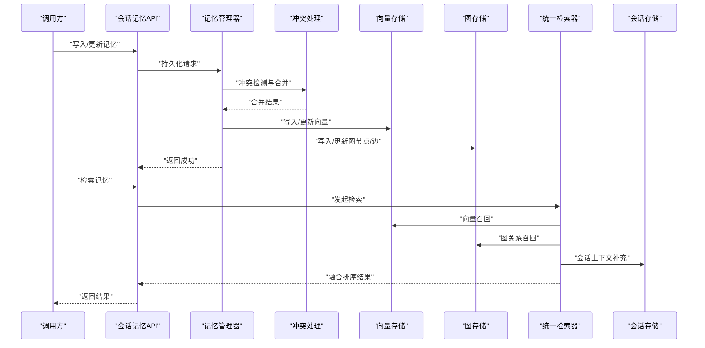
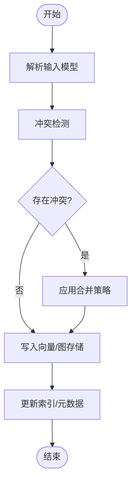
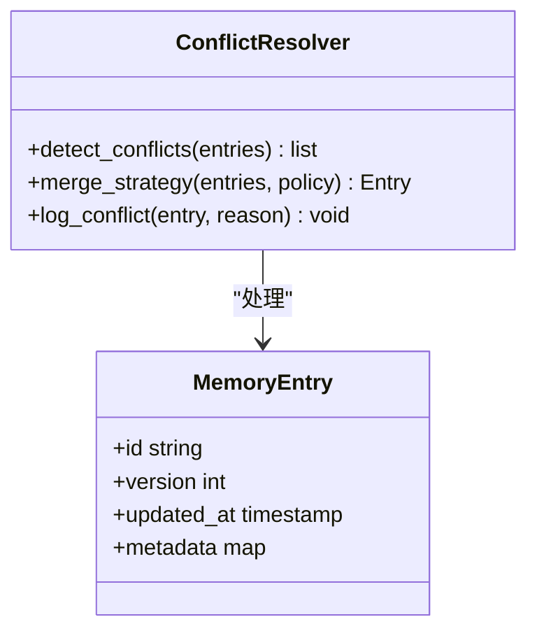
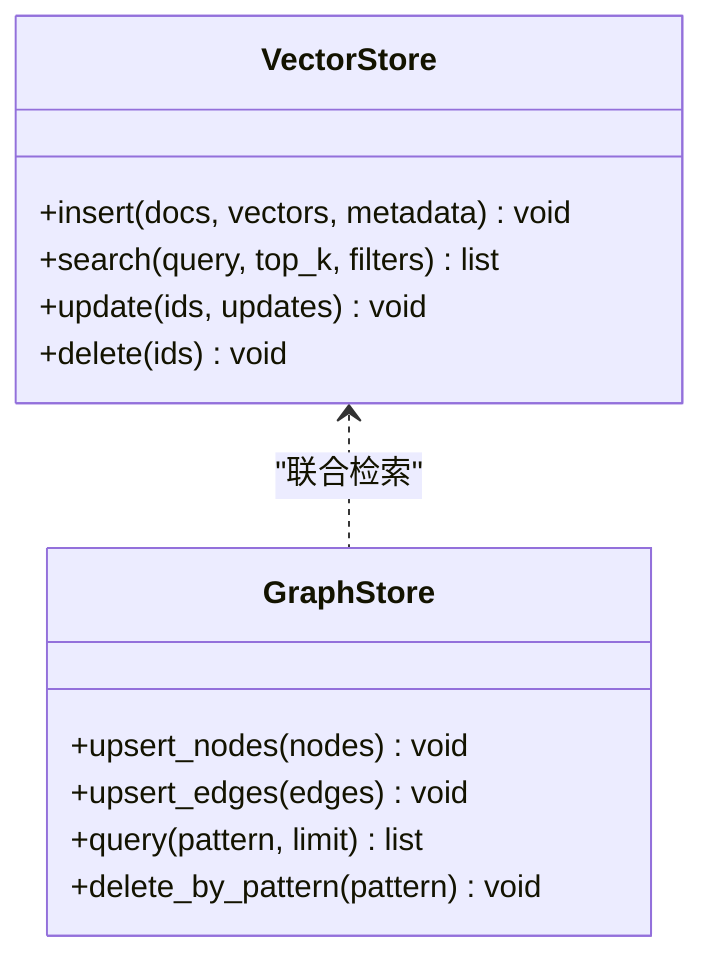
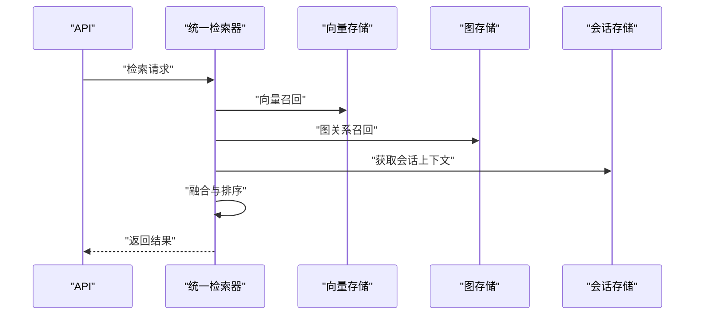
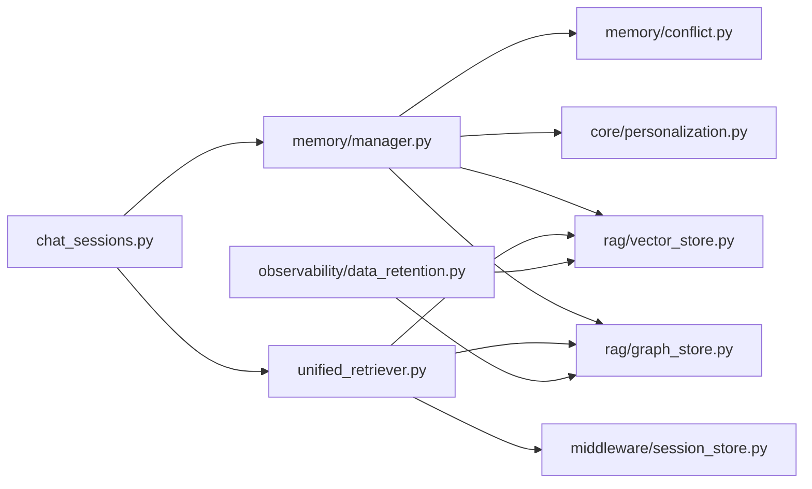

# 长期记忆存储

<cite>
**本文引用的文件**   
- [backend_design/nexus/memory/manager.py](file://backend_design/nexus/memory/manager.py)
- [backend_design/nexus/memory/conflict.py](file://backend_design/nexus/memory/conflict.py)
- [backend_design/nexus/core/personalization.py](file://backend_design/nexus/core/personalization.py)
- [backend_design/nexus/rag/vector_store.py](file://backend_design/nexus/rag/vector_store.py)
- [backend_design/nexus/rag/graph_store.py](file://backend_design/nexus/rag/graph_store.py)
- [backend_design/nexus/rag/unified_retriever.py](file://backend_design/nexus/rag/unified_retriever.py)
- [backend_design/nexus/middleware/session_store.py](file://backend_design/nexus/middleware/session_store.py)
- [backend_design/nexus/models/schemas.py](file://backend_design/nexus/models/schemas.py)
- [backend_design/nexus/api/routes/chat_sessions.py](file://backend_design/nexus/api/routes/chat_sessions.py)
- [backend_design/nexus/observability/data_retention.py](file://backend_design/nexus/observability/data_retention.py)
</cite>

## 目录
1. [简介](#简介)
2. [项目结构](#项目结构)
3. [核心组件](#核心组件)
4. [架构总览](#架构总览)
5. [详细组件分析](#详细组件分析)
6. [依赖分析](#依赖分析)
7. [性能考虑](#性能考虑)
8. [故障排查指南](#故障排查指南)
9. [结论](#结论)
10. [附录](#附录)

## 简介
本技术文档围绕“长期记忆存储系统”展开，聚焦于用户偏好、历史对话、行为习惯等数据的持久化策略、索引与检索优化、生命周期管理（创建/更新/删除/归档）、压缩与去重机制、备份与恢复流程、查询API使用与性能调优，以及内存与磁盘空间管理的实现细节。文档基于仓库中记忆与RAG相关模块进行系统化梳理，旨在为开发者与运维人员提供可落地的设计与实践指导。

## 项目结构
长期记忆相关能力主要分布在以下模块：
- 记忆管理与冲突处理：memory/manager.py、memory/conflict.py
- 个性化配置与偏好：core/personalization.py
- 向量与图存储抽象及实现：rag/vector_store.py、rag/graph_store.py
- 统一检索编排：rag/unified_retriever.py
- 会话级短期记忆与中间态：middleware/session_store.py
- 数据模型与接口契约：models/schemas.py
- 会话记忆读写API：api/routes/chat_sessions.py
- 数据保留与归档策略：observability/data_retention.py

图表来源
- [backend_design/nexus/memory/manager.py](file://backend_design/nexus/memory/manager.py)
- [backend_design/nexus/memory/conflict.py](file://backend_design/nexus/memory/conflict.py)
- [backend_design/nexus/core/personalization.py](file://backend_design/nexus/core/personalization.py)
- [backend_design/nexus/rag/vector_store.py](file://backend_design/nexus/rag/vector_store.py)
- [backend_design/nexus/rag/graph_store.py](file://backend_design/nexus/rag/graph_store.py)
- [backend_design/nexus/rag/unified_retriever.py](file://backend_design/nexus/rag/unified_retriever.py)
- [backend_design/nexus/middleware/session_store.py](file://backend_design/nexus/middleware/session_store.py)
- [backend_design/nexus/models/schemas.py](file://backend_design/nexus/models/schemas.py)
- [backend_design/nexus/api/routes/chat_sessions.py](file://backend_design/nexus/api/routes/chat_sessions.py)
- [backend_design/nexus/observability/data_retention.py](file://backend_design/nexus/observability/data_retention.py)

章节来源
- [backend_design/nexus/memory/manager.py](file://backend_design/nexus/memory/manager.py)
- [backend_design/nexus/memory/conflict.py](file://backend_design/nexus/memory/conflict.py)
- [backend_design/nexus/core/personalization.py](file://backend_design/nexus/core/personalization.py)
- [backend_design/nexus/rag/vector_store.py](file://backend_design/nexus/rag/vector_store.py)
- [backend_design/nexus/rag/graph_store.py](file://backend_design/nexus/rag/graph_store.py)
- [backend_design/nexus/rag/unified_retriever.py](file://backend_design/nexus/rag/unified_retriever.py)
- [backend_design/nexus/middleware/session_store.py](file://backend_design/nexus/middleware/session_store.py)
- [backend_design/nexus/models/schemas.py](file://backend_design/nexus/models/schemas.py)
- [backend_design/nexus/api/routes/chat_sessions.py](file://backend_design/nexus/api/routes/chat_sessions.py)
- [backend_design/nexus/observability/data_retention.py](file://backend_design/nexus/observability/data_retention.py)

## 核心组件
- 记忆管理器：负责将用户偏好、历史对话、行为习惯等结构化或半结构化数据写入向量/图存储，并协调冲突合并与版本控制。
- 冲突处理：在并发更新或多源输入场景下，对记忆条目进行一致性校验、冲突检测与合并策略执行。
- 个性化/偏好：维护用户偏好与画像的轻量配置，作为长期记忆的元数据与过滤条件。
- 向量/图存储抽象：定义统一的插入、检索、更新、删除接口；具体后端由工厂或配置注入。
- 统一检索器：聚合多路召回（向量相似度、图关系、会话上下文），并提供排序与融合策略。
- 会话存储：面向短时会话的缓存与中间态，降低频繁持久化带来的IO压力。
- 数据模型：定义记忆实体、字段约束与序列化格式，确保跨层一致。
- 数据保留与归档：按时间窗口、大小阈值、冷热分层策略执行清理与归档。

章节来源
- [backend_design/nexus/memory/manager.py](file://backend_design/nexus/memory/manager.py)
- [backend_design/nexus/memory/conflict.py](file://backend_design/nexus/memory/conflict.py)
- [backend_design/nexus/core/personalization.py](file://backend_design/nexus/core/personalization.py)
- [backend_design/nexus/rag/vector_store.py](file://backend_design/nexus/rag/vector_store.py)
- [backend_design/nexus/rag/graph_store.py](file://backend_design/nexus/rag/graph_store.py)
- [backend_design/nexus/rag/unified_retriever.py](file://backend_design/nexus/rag/unified_retriever.py)
- [backend_design/nexus/middleware/session_store.py](file://backend_design/nexus/middleware/session_store.py)
- [backend_design/nexus/models/schemas.py](file://backend_design/nexus/models/schemas.py)
- [backend_design/nexus/observability/data_retention.py](file://backend_design/nexus/observability/data_retention.py)

## 架构总览
长期记忆系统采用“应用层记忆管理 + 多模态存储抽象 + 统一检索编排 + 数据治理”的分层架构。上层通过记忆管理器暴露一致的CRUD与检索能力；中层以向量与图存储承载语义与关系型知识；下层由数据保留策略驱动生命周期与归档。

图表来源
- [backend_design/nexus/api/routes/chat_sessions.py](file://backend_design/nexus/api/routes/chat_sessions.py)
- [backend_design/nexus/memory/manager.py](file://backend_design/nexus/memory/manager.py)
- [backend_design/nexus/memory/conflict.py](file://backend_design/nexus/memory/conflict.py)
- [backend_design/nexus/rag/vector_store.py](file://backend_design/nexus/rag/vector_store.py)
- [backend_design/nexus/rag/graph_store.py](file://backend_design/nexus/rag/graph_store.py)
- [backend_design/nexus/rag/unified_retriever.py](file://backend_design/nexus/rag/unified_retriever.py)
- [backend_design/nexus/middleware/session_store.py](file://backend_design/nexus/middleware/session_store.py)

## 详细组件分析

### 记忆管理器（Memory Manager）
职责与要点
- 统一封装记忆条目的创建、更新、删除与批量操作。
- 协调冲突处理模块，保证并发安全与最终一致性。
- 根据数据类型选择向量或图存储路径，并维护元数据与版本信息。
- 触发数据保留策略的定时任务或事件钩子。

关键流程
- 写入路径：接收请求 -> 解析模型 -> 冲突检测 -> 合并策略 -> 写入向量/图 -> 返回结果。
- 读取路径：构建检索条件 -> 调用统一检索器 -> 融合排序 -> 返回结果。

图表来源
- [backend_design/nexus/memory/manager.py](file://backend_design/nexus/memory/manager.py)
- [backend_design/nexus/memory/conflict.py](file://backend_design/nexus/memory/conflict.py)
- [backend_design/nexus/rag/vector_store.py](file://backend_design/nexus/rag/vector_store.py)
- [backend_design/nexus/rag/graph_store.py](file://backend_design/nexus/rag/graph_store.py)

章节来源
- [backend_design/nexus/memory/manager.py](file://backend_design/nexus/memory/manager.py)
- [backend_design/nexus/memory/conflict.py](file://backend_design/nexus/memory/conflict.py)

### 冲突处理（Conflict Resolution）
目标
- 在多源更新、并发写入、增量合并场景下，确保记忆数据的一致性与可追溯性。

策略
- 基于时间戳与版本号的选择策略。
- 字段级差异比较与最小变更合并。
- 冲突日志记录与告警上报。

图表来源
- [backend_design/nexus/memory/conflict.py](file://backend_design/nexus/memory/conflict.py)

章节来源
- [backend_design/nexus/memory/conflict.py](file://backend_design/nexus/memory/conflict.py)

### 个性化与偏好（Personalization）
作用
- 维护用户偏好、画像标签、行为权重等元数据，作为记忆检索的过滤与排序依据。
- 与记忆管理器协作，在写入时附加偏好上下文，在检索时用于相关性提升。

章节来源
- [backend_design/nexus/core/personalization.py](file://backend_design/nexus/core/personalization.py)

### 向量与图存储抽象（Vector & Graph Store）
设计
- 定义统一的插入、检索、更新、删除接口，屏蔽底层实现差异。
- 支持批量操作、分页、过滤与高亮片段返回。
- 图存储侧重实体关系与路径推理；向量存储侧重语义相似度召回。

图表来源
- [backend_design/nexus/rag/vector_store.py](file://backend_design/nexus/rag/vector_store.py)
- [backend_design/nexus/rag/graph_store.py](file://backend_design/nexus/rag/graph_store.py)

章节来源
- [backend_design/nexus/rag/vector_store.py](file://backend_design/nexus/rag/vector_store.py)
- [backend_design/nexus/rag/graph_store.py](file://backend_design/nexus/rag/graph_store.py)

### 统一检索器（Unified Retriever）
功能
- 聚合向量相似度召回与图关系召回，结合会话上下文进行二次排序与融合。
- 支持多路召回权重调节、去重与截断策略。

图表来源
- [backend_design/nexus/rag/unified_retriever.py](file://backend_design/nexus/rag/unified_retriever.py)
- [backend_design/nexus/rag/vector_store.py](file://backend_design/nexus/rag/vector_store.py)
- [backend_design/nexus/rag/graph_store.py](file://backend_design/nexus/rag/graph_store.py)
- [backend_design/nexus/middleware/session_store.py](file://backend_design/nexus/middleware/session_store.py)

章节来源
- [backend_design/nexus/rag/unified_retriever.py](file://backend_design/nexus/rag/unified_retriever.py)
- [backend_design/nexus/middleware/session_store.py](file://backend_design/nexus/middleware/session_store.py)

### 会话存储（Session Store）
定位
- 提供短时会话的缓存与中间态存储，减少高频持久化带来的IO压力。
- 支持过期策略、容量上限与快速读写。

章节来源
- [backend_design/nexus/middleware/session_store.py](file://backend_design/nexus/middleware/session_store.py)

### 数据模型（Schemas）
职责
- 定义记忆实体、字段类型、约束与序列化格式。
- 为API与存储层提供一致的契约。

章节来源
- [backend_design/nexus/models/schemas.py](file://backend_design/nexus/models/schemas.py)

### 会话记忆API（Chat Sessions API）
职责
- 对外暴露记忆写入、更新、删除与检索接口。
- 负责参数校验、权限检查与响应格式化。

章节来源
- [backend_design/nexus/api/routes/chat_sessions.py](file://backend_design/nexus/api/routes/chat_sessions.py)

### 数据保留与归档（Data Retention）
职责
- 按时间窗口、大小阈值、冷热分层策略执行清理与归档。
- 与记忆管理器集成，触发周期性任务。

章节来源
- [backend_design/nexus/observability/data_retention.py](file://backend_design/nexus/observability/data_retention.py)

## 依赖分析
组件间依赖关系如下：
- API层依赖记忆管理器与统一检索器。
- 记忆管理器依赖冲突处理、个性化配置与存储抽象。
- 统一检索器依赖向量/图存储与会话存储。
- 数据保留策略作用于向量/图存储，并与记忆管理器联动。

图表来源
- [backend_design/nexus/api/routes/chat_sessions.py](file://backend_design/nexus/api/routes/chat_sessions.py)
- [backend_design/nexus/memory/manager.py](file://backend_design/nexus/memory/manager.py)
- [backend_design/nexus/memory/conflict.py](file://backend_design/nexus/memory/conflict.py)
- [backend_design/nexus/core/personalization.py](file://backend_design/nexus/core/personalization.py)
- [backend_design/nexus/rag/vector_store.py](file://backend_design/nexus/rag/vector_store.py)
- [backend_design/nexus/rag/graph_store.py](file://backend_design/nexus/rag/graph_store.py)
- [backend_design/nexus/rag/unified_retriever.py](file://backend_design/nexus/rag/unified_retriever.py)
- [backend_design/nexus/middleware/session_store.py](file://backend_design/nexus/middleware/session_store.py)
- [backend_design/nexus/observability/data_retention.py](file://backend_design/nexus/observability/data_retention.py)

章节来源
- [backend_design/nexus/api/routes/chat_sessions.py](file://backend_design/nexus/api/routes/chat_sessions.py)
- [backend_design/nexus/memory/manager.py](file://backend_design/nexus/memory/manager.py)
- [backend_design/nexus/rag/unified_retriever.py](file://backend_design/nexus/rag/unified_retriever.py)
- [backend_design/nexus/observability/data_retention.py](file://backend_design/nexus/observability/data_retention.py)

## 性能考虑
- 索引与检索优化
  - 向量维度与量化：合理设置向量维度与量化级别，平衡精度与吞吐。
  - 批量写入与批检索：提高I/O效率，降低网络往返。
  - 过滤与预筛选：在检索前利用元数据与标签缩小候选集。
  - 多路召回融合权重可调：根据业务场景动态调整相似度与关系权重。
- 内存使用优化
  - 会话存储设置容量上限与TTL，避免内存膨胀。
  - 大对象分块与懒加载，减少一次性加载开销。
  - 缓存热点键值，降低重复计算与IO。
- 磁盘空间管理
  - 冷热分层：热数据驻留高性能存储，冷数据归档至低成本介质。
  - 定期清理与压缩：按保留策略清理过期数据，并对历史数据进行压缩。
  - 监控与告警：跟踪存储使用率与增长趋势，及时扩容或调整策略。

[本节为通用性能建议，不直接分析具体文件]

## 故障排查指南
常见问题与定位思路
- 写入失败或超时
  - 检查向量/图存储连接与健康状态。
  - 查看冲突日志与合并策略是否导致阻塞。
- 检索结果不准确
  - 调整多路召回权重与排序策略。
  - 检查嵌入质量与图关系完整性。
- 内存或磁盘告警
  - 审查会话存储TTL与容量上限。
  - 确认数据保留与归档任务是否正常执行。

章节来源
- [backend_design/nexus/memory/conflict.py](file://backend_design/nexus/memory/conflict.py)
- [backend_design/nexus/rag/unified_retriever.py](file://backend_design/nexus/rag/unified_retriever.py)
- [backend_design/nexus/middleware/session_store.py](file://backend_design/nexus/middleware/session_store.py)
- [backend_design/nexus/observability/data_retention.py](file://backend_design/nexus/observability/data_retention.py)

## 结论
长期记忆存储系统通过清晰的分层与抽象，实现了用户偏好、历史对话与行为习惯的统一管理与高效检索。借助冲突处理、统一检索编排与数据保留策略，系统在一致性、可用性与可维护性方面具备良好基础。后续可在索引优化、检索融合与资源治理方面持续演进，以满足更高吞吐与更低延迟的业务需求。

[本节为总结性内容，不直接分析具体文件]

## 附录
- 查询API使用方法
  - 写入/更新：提交结构化记忆实体，系统将自动进行冲突检测与合并，并写入向量/图存储。
  - 检索：提供查询条件与过滤参数，系统将返回融合排序后的结果。
  - 删除：按ID或模式批量删除，并同步更新索引与元数据。
- 性能调优建议
  - 调整批量大小与并发度。
  - 优化嵌入模型与图关系构建策略。
  - 配置合适的TTL与容量上限，避免资源耗尽。

[本节为概念性说明，不直接分析具体文件]