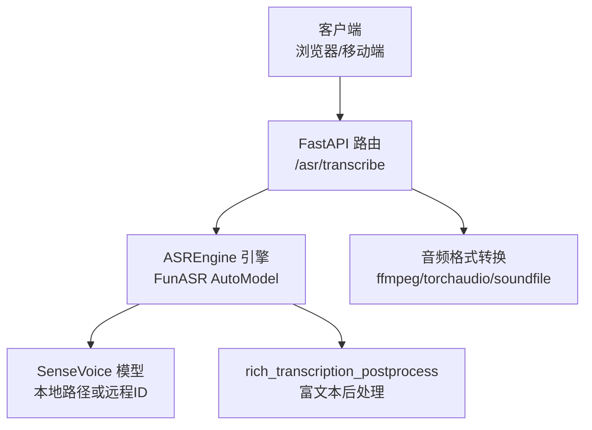
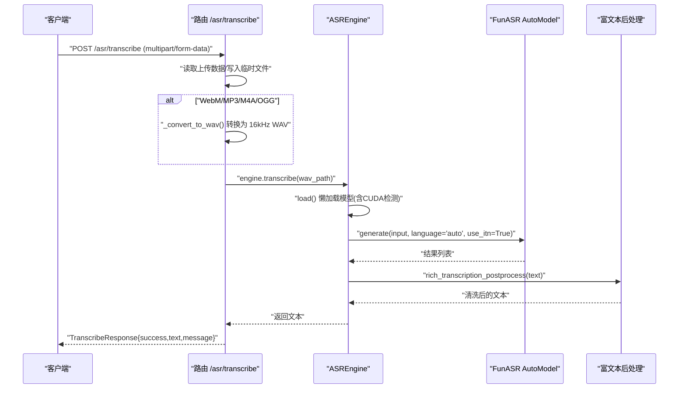
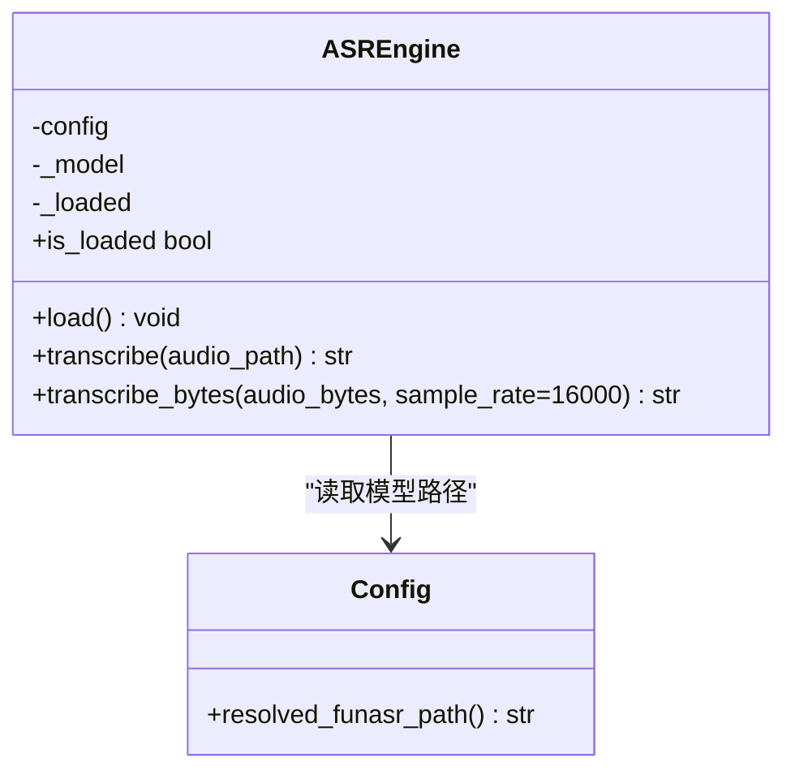
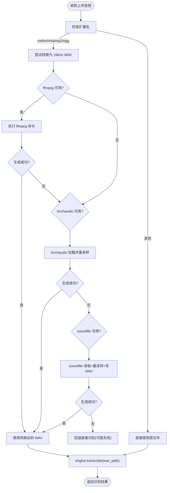
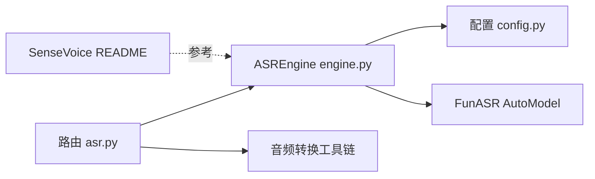

# ASR语音识别

<cite>
**本文引用的文件**
- [backend_design/nexus/asr/engine.py](file://backend_design/nexus/asr/engine.py)
- [backend_design/nexus/api/routes/asr.py](file://backend_design/nexus/api/routes/asr.py)
- [backend_design/nexus/config.py](file://backend_design/nexus/config.py)
- [models/asr/sensevoice/README.md](file://models/asr/sensevoice/README.md)
</cite>

## 目录
1. [简介](#简介)
2. [项目结构](#项目结构)
3. [核心组件](#核心组件)
4. [架构总览](#架构总览)
5. [详细组件分析](#详细组件分析)
6. [依赖关系分析](#依赖关系分析)
7. [性能与调优建议](#性能与调优建议)
8. [故障排查指南](#故障排查指南)
9. [结论](#结论)

## 简介
本模块基于 FunASR SenseVoice 模型实现本地语音转文字（ASR）能力，提供统一的引擎封装与 FastAPI 路由接口。支持自动语言检测、富文本后处理、WAV 标准输入（16kHz 单声道），并兼容 WebM/MP3/M4A 等常见录音格式（通过内置转换流程）。同时提供 CUDA/GPU 加速配置、错误处理策略以及面向生产环境的性能优化建议。

## 项目结构
ASR 相关代码主要分布在以下位置：
- 引擎层：封装 FunASR AutoModel 的加载与推理
- API 层：暴露 /asr/transcribe 接口，负责上传音频、格式转换与调用引擎
- 配置层：集中管理模型路径、设备选择等参数
- 模型说明：SenseVoice 模型 README 包含用法、参数与部署参考

图表来源
- [backend_design/nexus/api/routes/asr.py:49-122](file://backend_design/nexus/api/routes/asr.py#L49-L122)
- [backend_design/nexus/asr/engine.py:32-83](file://backend_design/nexus/asr/engine.py#L32-L83)
- [backend_design/nexus/config.py:332-393](file://backend_design/nexus/config.py#L332-L393)
- [models/asr/sensevoice/README.md:94-145](file://models/asr/sensevoice/README.md#L94-L145)

章节来源
- [backend_design/nexus/asr/engine.py:1-116](file://backend_design/nexus/asr/engine.py#L1-L116)
- [backend_design/nexus/api/routes/asr.py:1-250](file://backend_design/nexus/api/routes/asr.py#L1-L250)
- [backend_design/nexus/config.py:332-393](file://backend_design/nexus/config.py#L332-L393)
- [models/asr/sensevoice/README.md:94-145](file://models/asr/sensevoice/README.md#L94-L145)

## 核心组件
- ASREngine：封装 FunASR AutoModel 的加载、设备选择、推理与结果后处理
- ASR 路由：接收上传音频、执行格式转换、调用引擎并返回结构化响应
- 配置中心：集中管理 FunASR 模型路径、声纹/TTS 路径及解析方法
- 模型文档：SenseVoice 官方 README 提供推理示例、参数说明与服务化部署参考

章节来源
- [backend_design/nexus/asr/engine.py:21-116](file://backend_design/nexus/asr/engine.py#L21-L116)
- [backend_design/nexus/api/routes/asr.py:26-141](file://backend_design/nexus/api/routes/asr.py#L26-L141)
- [backend_design/nexus/config.py:332-393](file://backend_design/nexus/config.py#L332-L393)
- [models/asr/sensevoice/README.md:94-145](file://models/asr/sensevoice/README.md#L94-L145)

## 架构总览
下图展示了从请求到识别结果的完整链路，包括模型加载、设备选择、音频预处理、推理与后处理。

图表来源
- [backend_design/nexus/api/routes/asr.py:49-122](file://backend_design/nexus/api/routes/asr.py#L49-L122)
- [backend_design/nexus/asr/engine.py:32-83](file://backend_design/nexus/asr/engine.py#L32-L83)
- [models/asr/sensevoice/README.md:113-145](file://models/asr/sensevoice/README.md#L113-L145)

## 详细组件分析

### ASREngine 类
职责：
- 懒加载 FunASR AutoModel，优先使用 CUDA，否则回退 CPU
- 调用 generate 进行识别，启用自动语言检测与逆文本正则化
- 对输出文本执行 rich_transcription_postprocess 后处理
- 提供 transcribe_bytes 便捷方法，将字节流保存为临时 WAV 再识别

关键行为与要点：
- 模型路径来自配置解析函数 resolved_funasr_path()
- 设备选择逻辑：若检测到 CUDA 可用则使用 cuda:0，否则使用 cpu
- 语言设置 language="auto"，支持多语言自动识别
- 使用 cache={} 以复用内部缓存（按 FunASR 文档建议）
- 异常捕获与日志记录，失败时返回空字符串避免崩溃

图表来源
- [backend_design/nexus/asr/engine.py:21-116](file://backend_design/nexus/asr/engine.py#L21-L116)
- [backend_design/nexus/config.py:372-374](file://backend_design/nexus/config.py#L372-L374)

章节来源
- [backend_design/nexus/asr/engine.py:21-116](file://backend_design/nexus/asr/engine.py#L21-L116)
- [backend_design/nexus/config.py:332-393](file://backend_design/nexus/config.py#L332-L393)

### ASR 路由与音频预处理
职责：
- 接收 multipart/form-data 上传的音频文件
- 根据扩展名判断是否需要转换为 16kHz 单声道 WAV
- 调用 ASREngine 完成识别并返回结构化响应
- 提供 /asr/status 查询引擎状态与模型路径

音频转换策略（优先级从高到低）：
1. 系统 ffmpeg（功能最全，支持所有格式）
2. imageio_ffmpeg 包（pip 安装的 ffmpeg 二进制）
3. torchaudio（支持 WAV/FLAC，不支持 WebM；可重采样至 16kHz）
4. soundfile/librosa（通过 libsndfile 支持 OGG/FLAC/WAV；线性插值重采样）

图表来源
- [backend_design/nexus/api/routes/asr.py:143-249](file://backend_design/nexus/api/routes/asr.py#L143-L249)

章节来源
- [backend_design/nexus/api/routes/asr.py:49-122](file://backend_design/nexus/api/routes/asr.py#L49-L122)
- [backend_design/nexus/api/routes/asr.py:143-249](file://backend_design/nexus/api/routes/asr.py#L143-L249)

### 配置与模型路径
- ASRConfig 提供 funasr_model_path 字段，默认指向 ./models/asr/sensevoice
- resolved_funasr_path() 将相对路径解析为绝对路径，确保跨工作目录稳定运行
- 引擎在 load() 中调用该解析方法获取模型路径，并在不存在时发出警告

章节来源
- [backend_design/nexus/config.py:332-393](file://backend_design/nexus/config.py#L332-L393)
- [backend_design/nexus/asr/engine.py:32-56](file://backend_design/nexus/asr/engine.py#L32-L56)

### 模型说明与推理参数
- SenseVoice README 提供了 AutoModel 初始化与 generate 调用示例
- 常用参数：language="auto"、use_itn=True、batch_size_s 控制动态批时长
- 富文本后处理：rich_transcription_postprocess 用于清理标点与规范化输出

章节来源
- [models/asr/sensevoice/README.md:94-145](file://models/asr/sensevoice/README.md#L94-L145)
- [models/asr/sensevoice/README.md:113-145](file://models/asr/sensevoice/README.md#L113-L145)

## 依赖关系分析
- 路由依赖 ASREngine 与日志工具
- ASREngine 依赖配置中心与 FunASR AutoModel
- 音频转换依赖外部工具链（ffmpeg/imageio_ffmpeg/torchaudio/soundfile）
- 模型说明文档作为参考依据，不直接参与运行时依赖

图表来源
- [backend_design/nexus/api/routes/asr.py:1-250](file://backend_design/nexus/api/routes/asr.py#L1-L250)
- [backend_design/nexus/asr/engine.py:1-116](file://backend_design/nexus/asr/engine.py#L1-L116)
- [backend_design/nexus/config.py:332-393](file://backend_design/nexus/config.py#L332-L393)
- [models/asr/sensevoice/README.md:94-145](file://models/asr/sensevoice/README.md#L94-L145)

章节来源
- [backend_design/nexus/api/routes/asr.py:1-250](file://backend_design/nexus/api/routes/asr.py#L1-L250)
- [backend_design/nexus/asr/engine.py:1-116](file://backend_design/nexus/asr/engine.py#L1-L116)
- [backend_design/nexus/config.py:332-393](file://backend_design/nexus/config.py#L332-L393)

## 性能与调优建议
- 模型缓存
  - 使用 cache={} 传入 generate，有助于复用中间状态，减少重复计算
  - 参考：[models/asr/sensevoice/README.md:113-145](file://models/asr/sensevoice/README.md#L113-L145)
- 批量处理
  - 通过 batch_size_s 控制动态批时长，平衡吞吐与延迟
  - 参考：[models/asr/sensevoice/README.md:113-145](file://models/asr/sensevoice/README.md#L113-L145)
- GPU/CUDA 加速
  - 自动检测 torch.cuda.is_available()，优先使用 cuda:0
  - 参考：[backend_design/nexus/asr/engine.py:109-116](file://backend_design/nexus/asr/engine.py#L109-L116)
- 内存管理
  - 使用临时文件处理上传音频，及时删除以避免磁盘占用
  - 参考：[backend_design/nexus/api/routes/asr.py:77-116](file://backend_design/nexus/api/routes/asr.py#L77-L116)
- 音频预处理优化
  - 优先使用 ffmpeg 转换，具备最佳兼容性与速度
  - 当 ffmpeg 不可用时，依次尝试 torchaudio 与 soundfile
  - 参考：[backend_design/nexus/api/routes/asr.py:143-249](file://backend_design/nexus/api/routes/asr.py#L143-L249)
- 服务化部署
  - 可使用 FunASR 提供的 OpenAI 兼容服务或 WebSocket 实时服务
  - 参考：[models/asr/sensevoice/README.md:193-217](file://models/asr/sensevoice/README.md#L193-L217)

章节来源
- [backend_design/nexus/asr/engine.py:109-116](file://backend_design/nexus/asr/engine.py#L109-L116)
- [backend_design/nexus/api/routes/asr.py:77-116](file://backend_design/nexus/api/routes/asr.py#L77-L116)
- [backend_design/nexus/api/routes/asr.py:143-249](file://backend_design/nexus/api/routes/asr.py#L143-L249)
- [models/asr/sensevoice/README.md:113-145](file://models/asr/sensevoice/README.md#L113-L145)
- [models/asr/sensevoice/README.md:193-217](file://models/asr/sensevoice/README.md#L193-L217)

## 故障排查指南
- 模型未加载
  - 现象：返回 success=False，message 提示“ASR 模型未加载”
  - 排查：确认 FUNASR_MODEL_PATH 指向有效目录，且模型文件存在
  - 参考：[backend_design/nexus/api/routes/asr.py:84-89](file://backend_design/nexus/api/routes/asr.py#L84-L89)
- 模型路径不存在
  - 现象：日志警告“ASR model path not found”
  - 排查：检查配置 funasr_model_path 与 resolved_funasr_path() 解析结果
  - 参考：[backend_design/nexus/asr/engine.py:40-43](file://backend_design/nexus/asr/engine.py#L40-L43)
- 依赖缺失
  - 现象：日志警告“funasr not installed, ASR disabled”
  - 排查：安装 funasr 与 modelscope，并确保版本匹配
  - 参考：[backend_design/nexus/asr/engine.py:52-54](file://backend_design/nexus/asr/engine.py#L52-L54)
- 音频转换失败
  - 现象：日志警告“All audio conversion strategies failed”
  - 排查：安装 ffmpeg 或 imageio_ffmpeg；若无，尝试 torchaudio/soundfile
  - 参考：[backend_design/nexus/api/routes/asr.py:248-249](file://backend_design/nexus/api/routes/asr.py#L248-L249)
- 识别结果为空
  - 现象：text 为空，success=False，message 提示“未识别到语音内容”
  - 排查：检查音频质量、静音段、噪声；确认语言自动检测是否生效
  - 参考：[backend_design/nexus/api/routes/asr.py:107-111](file://backend_design/nexus/api/routes/asr.py#L107-L111)

章节来源
- [backend_design/nexus/api/routes/asr.py:84-89](file://backend_design/nexus/api/routes/asr.py#L84-L89)
- [backend_design/nexus/asr/engine.py:40-56](file://backend_design/nexus/asr/engine.py#L40-L56)
- [backend_design/nexus/api/routes/asr.py:248-249](file://backend_design/nexus/api/routes/asr.py#L248-L249)
- [backend_design/nexus/api/routes/asr.py:107-111](file://backend_design/nexus/api/routes/asr.py#L107-L111)

## 结论
本 ASR 模块以 FunASR SenseVoice 为核心，结合统一的路由封装与灵活的音频预处理策略，实现了高可用的本地语音转文字服务。通过自动语言检测、富文本后处理与 CUDA 加速，兼顾了易用性与性能。在生产环境中，建议结合模型缓存、批量处理与完善的错误处理策略，以获得更稳定的识别效果与更高的吞吐能力。