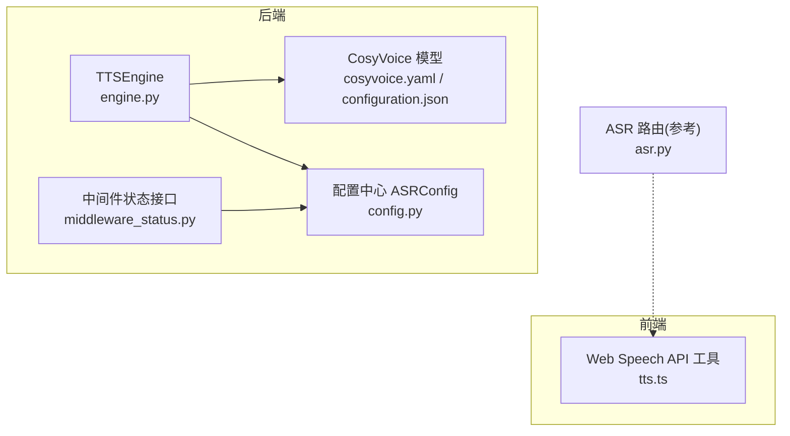
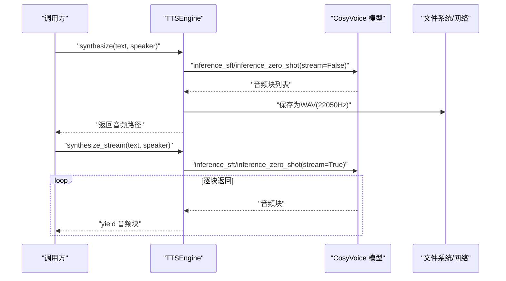
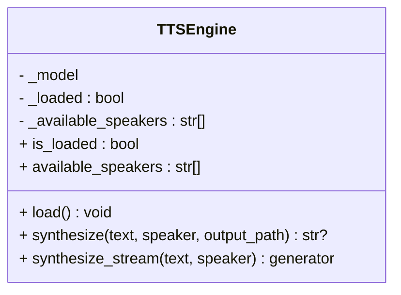
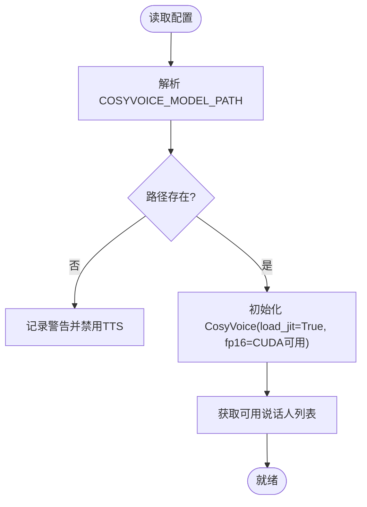
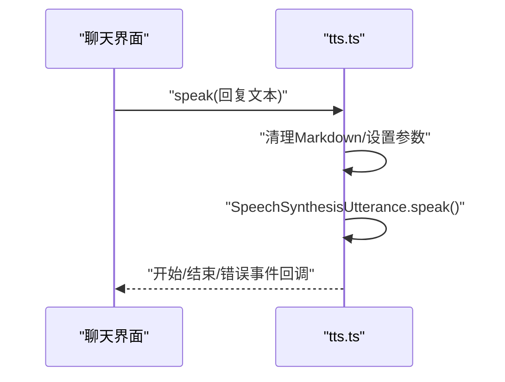
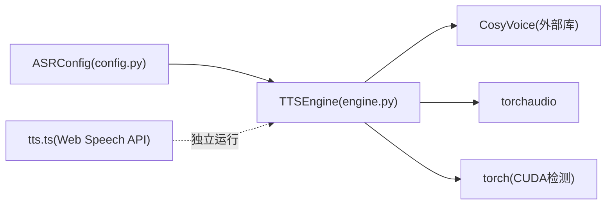

# TTS语音合成

<cite>
**本文引用的文件**   
- [backend_design/nexus/tts/engine.py](file://backend_design/nexus/tts/engine.py)
- [backend_design/nexus/config.py](file://backend_design/nexus/config.py)
- [models/tts/cosyvoice/configuration.json](file://models/tts/cosyvoice/configuration.json)
- [models/tts/cosyvoice/cosyvoice.yaml](file://models/tts/cosyvoice/cosyvoice.yaml)
- [docs/voice/tts-guide.md](file://docs/voice/tts-guide.md)
- [frontend_design/src/lib/tts.ts](file://frontend_design/src/lib/tts.ts)
- [backend_design/nexus/api/routes/asr.py](file://backend_design/nexus/api/routes/asr.py)
- [backend_design/nexus/api/routes/middleware_status.py](file://backend_design/nexus/api/routes/middleware_status.py)
</cite>

## 目录
1. [简介](#简介)
2. [项目结构](#项目结构)
3. [核心组件](#核心组件)
4. [架构总览](#架构总览)
5. [详细组件分析](#详细组件分析)
6. [依赖关系分析](#依赖关系分析)
7. [性能与音质优化](#性能与音质优化)
8. [故障排查指南](#故障排查指南)
9. [结论](#结论)
10. [附录](#附录)

## 简介
本技术文档聚焦于基于 CosyVoice 的 TTS（文本转语音）模块，覆盖以下关键主题：
- 音色克隆与说话人选择
- 流式输出优化
- 配置项与参数控制（采样率、模型路径等）
- 音频编码格式支持（WAV/MP3）、采样率与网络传输优化
- 多语言与方言能力现状说明
- 个性化音色定制思路
- 音质优化建议与性能调优指南

该模块在后端通过 TTSEngine 封装 CosyVoice 推理，在前端提供浏览器内置 Web Speech API 作为轻量朗读补充。

## 项目结构
TTS 相关代码与配置主要分布在如下位置：
- 后端引擎：backend_design/nexus/tts/engine.py
- 配置中心：backend_design/nexus/config.py（ASRConfig 包含 CosyVoice 模型路径）
- 模型配置：models/tts/cosyvoice/cosyvoice.yaml、configuration.json
- 前端工具：frontend_design/src/lib/tts.ts（浏览器端 Web Speech API）
- 辅助文档：docs/voice/tts-guide.md
- 状态接口：backend_design/nexus/api/routes/middleware_status.py（暴露 TTS 配置摘要）

图表来源
- [backend_design/nexus/tts/engine.py:21-150](file://backend_design/nexus/tts/engine.py#L21-L150)
- [backend_design/nexus/config.py:332-393](file://backend_design/nexus/config.py#L332-L393)
- [models/tts/cosyvoice/cosyvoice.yaml:1-202](file://models/tts/cosyvoice/cosyvoice.yaml#L1-L202)
- [models/tts/cosyvoice/configuration.json:1-1](file://models/tts/cosyvoice/configuration.json#L1-L1)
- [frontend_design/src/lib/tts.ts:1-75](file://frontend_design/src/lib/tts.ts#L1-L75)
- [backend_design/nexus/api/routes/middleware_status.py:225-235](file://backend_design/nexus/api/routes/middleware_status.py#L225-L235)

章节来源
- [backend_design/nexus/tts/engine.py:21-150](file://backend_design/nexus/tts/engine.py#L21-L150)
- [backend_design/nexus/config.py:332-393](file://backend_design/nexus/config.py#L332-L393)
- [models/tts/cosyvoice/cosyvoice.yaml:1-202](file://models/tts/cosyvoice/cosyvoice.yaml#L1-L202)
- [models/tts/cosyvoice/configuration.json:1-1](file://models/tts/cosyvoice/configuration.json#L1-L1)
- [frontend_design/src/lib/tts.ts:1-75](file://frontend_design/src/lib/tts.ts#L1-L75)
- [docs/voice/tts-guide.md:1-39](file://docs/voice/tts-guide.md#L1-L39)
- [backend_design/nexus/api/routes/middleware_status.py:225-235](file://backend_design/nexus/api/routes/middleware_status.py#L225-L235)

## 核心组件
- TTSEngine：封装 CosyVoice 推理，提供同步合成、流式合成、可用说话人查询、加载状态检查等能力。
- ASRConfig：集中管理模型路径与环境变量解析，包括 CosyVoice 模型路径。
- 模型配置：cosyvoice.yaml 定义采样率、声学特征、解码器、声码器等；configuration.json 标注框架与任务类型。
- 前端 tts.ts：使用浏览器 Web Speech API 进行即时朗读，适合提示音与简短播报。

章节来源
- [backend_design/nexus/tts/engine.py:21-150](file://backend_design/nexus/tts/engine.py#L21-L150)
- [backend_design/nexus/config.py:332-393](file://backend_design/nexus/config.py#L332-L393)
- [models/tts/cosyvoice/cosyvoice.yaml:1-202](file://models/tts/cosyvoice/cosyvoice.yaml#L1-L202)
- [models/tts/cosyvoice/configuration.json:1-1](file://models/tts/cosyvoice/configuration.json#L1-L1)
- [frontend_design/src/lib/tts.ts:1-75](file://frontend_design/src/lib/tts.ts#L1-L75)

## 架构总览
整体流程：
- 调用方（服务或前端）请求 TTS 合成
- TTSEngine 根据配置加载 CosyVoice 模型
- 选择说话人或零样本模式生成音频块
- 同步模式保存为 WAV；流式模式逐块返回
- 前端可结合 Web Speech API 做即时播报

图表来源
- [backend_design/nexus/tts/engine.py:63-134](file://backend_design/nexus/tts/engine.py#L63-L134)

## 详细组件分析

### TTSEngine 类分析
职责与要点：
- 懒加载 CosyVoice 模型，自动检测 CUDA 可用性以启用半精度推理
- 支持指定说话人的 SFT 推理与零样本推理
- 同步合成：将全部音频块保存为 WAV（固定采样率 22050）
- 流式合成：按块 yield 音频数据，便于低延迟播放
- 暴露 is_loaded、available_speakers 属性用于状态与能力探测

图表来源
- [backend_design/nexus/tts/engine.py:21-150](file://backend_design/nexus/tts/engine.py#L21-L150)

章节来源
- [backend_design/nexus/tts/engine.py:21-150](file://backend_design/nexus/tts/engine.py#L21-L150)

### 配置与模型参数
- 模型路径：由 ASRConfig.cosyvoice_model_path 提供，默认指向 models/tts/cosyvoice
- 采样率：cosyvoice.yaml 中 sample_rate=22050，与 TTSEngine 保存采样率一致
- 任务与框架：configuration.json 声明 Pytorch 与 text-to-speech 任务
- 环境变量：COSYVOICE_MODEL_PATH 可覆盖默认路径

图表来源
- [backend_design/nexus/config.py:332-393](file://backend_design/nexus/config.py#L332-L393)
- [backend_design/nexus/tts/engine.py:33-57](file://backend_design/nexus/tts/engine.py#L33-L57)
- [models/tts/cosyvoice/cosyvoice.yaml:8](file://models/tts/cosyvoice/cosyvoice.yaml#L8)
- [models/tts/cosyvoice/configuration.json:1-1](file://models/tts/cosyvoice/configuration.json#L1-L1)

章节来源
- [backend_design/nexus/config.py:332-393](file://backend_design/nexus/config.py#L332-L393)
- [backend_design/nexus/tts/engine.py:33-57](file://backend_design/nexus/tts/engine.py#L33-L57)
- [models/tts/cosyvoice/cosyvoice.yaml:1-202](file://models/tts/cosyvoice/cosyvoice.yaml#L1-L202)
- [models/tts/cosyvoice/configuration.json:1-1](file://models/tts/cosyvoice/configuration.json#L1-L1)

### 前端 Web Speech API 集成
- 提供 speak/stopSpeaking/isSpeaking 等方法
- 自动清理 Markdown 标记，设置中文语言、语速、音调、音量
- 适用于短提示音与快速反馈，无需服务端模型

图表来源
- [frontend_design/src/lib/tts.ts:22-61](file://frontend_design/src/lib/tts.ts#L22-L61)

章节来源
- [frontend_design/src/lib/tts.ts:1-75](file://frontend_design/src/lib/tts.ts#L1-L75)

### 中间件状态接口中的 TTS 信息
- middleware_status.py 暴露 TTS 配置摘要，便于运维监控与诊断

章节来源
- [backend_design/nexus/api/routes/middleware_status.py:225-235](file://backend_design/nexus/api/routes/middleware_status.py#L225-L235)

## 依赖关系分析
- TTSEngine 依赖：
  - 配置中心 ASRConfig（模型路径解析）
  - CosyVoice 运行时（动态导入）
  - torchaudio（WAV 保存）
  - torch（CUDA 检测）
- 前端 tts.ts 不依赖后端，直接调用浏览器 API

图表来源
- [backend_design/nexus/tts/engine.py:15-18](file://backend_design/nexus/tts/engine.py#L15-L18)
- [backend_design/nexus/config.py:332-393](file://backend_design/nexus/config.py#L332-L393)
- [frontend_design/src/lib/tts.ts:1-75](file://frontend_design/src/lib/tts.ts#L1-L75)

章节来源
- [backend_design/nexus/tts/engine.py:15-18](file://backend_design/nexus/tts/engine.py#L15-L18)
- [backend_design/nexus/config.py:332-393](file://backend_design/nexus/config.py#L332-L393)
- [frontend_design/src/lib/tts.ts:1-75](file://frontend_design/src/lib/tts.ts#L1-L75)

## 性能与音质优化
- 推理加速
  - 启用 JIT 与半精度（fp16）：在 CUDA 可用时自动开启，降低显存占用并提升吞吐
  - 避免重复加载：TTSEngine 内部维护加载状态，确保单例化
- 流式输出
  - 使用 synthesize_stream 逐块返回音频，减少首包延迟，适合实时播报
- 采样率与编码
  - 默认采样率 22050Hz，输出 WAV PCM 16-bit；如需 MP3，可在保存后使用 ffmpeg 转换
- 网络传输优化
  - 流式场景优先使用音频块直传，避免整段落盘再上传
  - 若需持久化，合理命名分段文件并合并策略
- 音质优化建议
  - 保持输入文本规范化（去除多余标点、控制停顿）
  - 选择合适的说话人（SFT）以获得更稳定音色
  - 对长文本分句合成，避免过长上下文导致失真
- 资源与并发
  - 限制并发合成任务数，避免 GPU 显存峰值过高
  - 结合系统级缓存（如 Redis）复用高频短句合成结果（注意副作用隔离）

章节来源
- [backend_design/nexus/tts/engine.py:33-57](file://backend_design/nexus/tts/engine.py#L33-L57)
- [backend_design/nexus/tts/engine.py:63-134](file://backend_design/nexus/tts/engine.py#L63-L134)
- [models/tts/cosyvoice/cosyvoice.yaml:8](file://models/tts/cosyvoice/cosyvoice.yaml#L8)
- [docs/voice/tts-guide.md:12-18](file://docs/voice/tts-guide.md#L12-L18)

## 故障排查指南
- 模型未加载
  - 现象：is_loaded 为 False，synthesize 返回 None
  - 排查：确认 COSYVOICE_MODEL_PATH 指向有效目录；检查日志中“模型路径不存在”警告
- 依赖缺失
  - 现象：ImportError（cosyvoice/torch/torchaudio）
  - 排查：安装必要依赖；确认 Python 环境与 CUDA 驱动匹配
- 音频保存失败
  - 现象：合成成功但无输出文件
  - 排查：检查磁盘空间与写入权限；确认输出路径后缀为 .wav
- 前端无法朗读
  - 现象：tts.ts 检测到不支持 speechSynthesis
  - 排查：更换浏览器或更新版本；确认用户交互触发（部分浏览器要求用户手势）

章节来源
- [backend_design/nexus/tts/engine.py:33-61](file://backend_design/nexus/tts/engine.py#L33-L61)
- [backend_design/nexus/tts/engine.py:63-111](file://backend_design/nexus/tts/engine.py#L63-L111)
- [frontend_design/src/lib/tts.ts:17-23](file://frontend_design/src/lib/tts.ts#L17-L23)

## 结论
本 TTS 模块以 TTSEngine 为核心，封装 CosyVoice 推理，提供同步与流式两种合成方式，并通过 ASRConfig 统一管理模型路径与环境。配合前端 Web Speech API，可实现从端到端的语音播报链路。建议在车载或低延迟场景中优先采用流式输出与半精度推理，并结合合适的说话人与文本预处理策略以提升自然度与稳定性。

## 附录

### 配置选项清单
- COSYVOICE_MODEL_PATH：CosyVoice 模型根目录（默认 ./models/tts/cosyvoice）
- VOICEPRINT_THRESHOLD、VOICEPRINT_ENROLL_COUNT：声纹相关（与本模块间接相关）
- 其他服务器与中间件配置：见 config.py 各子配置类

章节来源
- [backend_design/nexus/config.py:332-393](file://backend_design/nexus/config.py#L332-L393)
- [docs/voice/tts-guide.md:28-33](file://docs/voice/tts-guide.md#L28-L33)

### 音频格式与采样率
- 默认输出：WAV PCM 16-bit，采样率 22050Hz
- 如需 MP3：可在保存后通过 ffmpeg 转换（参考 ASR 路由中的转换策略）

章节来源
- [models/tts/cosyvoice/cosyvoice.yaml:8](file://models/tts/cosyvoice/cosyvoice.yaml#L8)
- [backend_design/nexus/api/routes/asr.py:143-249](file://backend_design/nexus/api/routes/asr.py#L143-L249)
- [docs/voice/tts-guide.md:12-18](file://docs/voice/tts-guide.md#L12-L18)

### 多语言与方言
- 当前实现未显式暴露语言/方言参数；可通过 CosyVoice 提供的多语言 tokenizer 配置影响行为
- 建议：在文本预处理阶段进行语言检测与归一化，必要时切换不同说话人以适配口音风格

章节来源
- [models/tts/cosyvoice/cosyvoice.yaml:138-143](file://models/tts/cosyvoice/cosyvoice.yaml#L138-L143)

### 个性化音色定制
- 现有能力：支持指定说话人（SFT）与零样本推理
- 扩展建议：
  - 引入用户自定义音色样本（注册/验证流程可复用声纹体系）
  - 在 TTSEngine 增加音色注册与选择接口，结合向量检索匹配最佳音色
  - 结合前端偏好存储，实现千人千面音色体验

章节来源
- [backend_design/nexus/tts/engine.py:87-94](file://backend_design/nexus/tts/engine.py#L87-L94)
- [backend_design/nexus/tts/engine.py:126-129](file://backend_design/nexus/tts/engine.py#L126-L129)