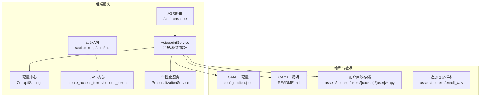
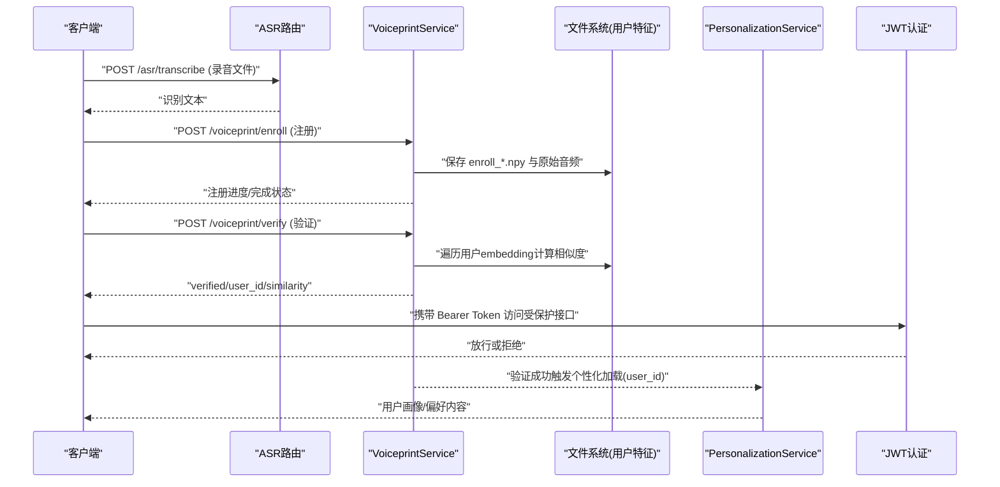
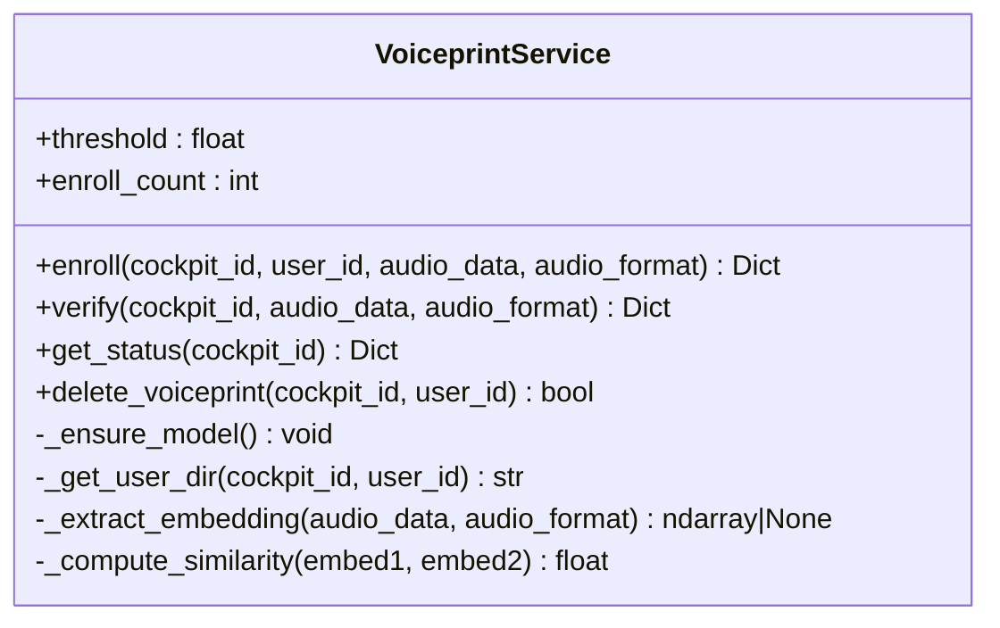
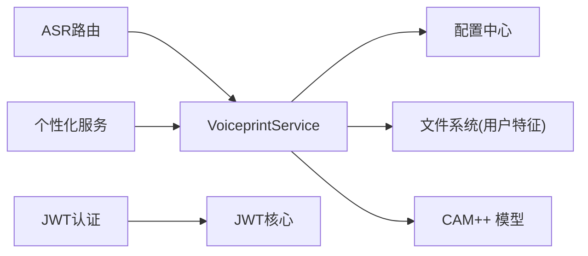
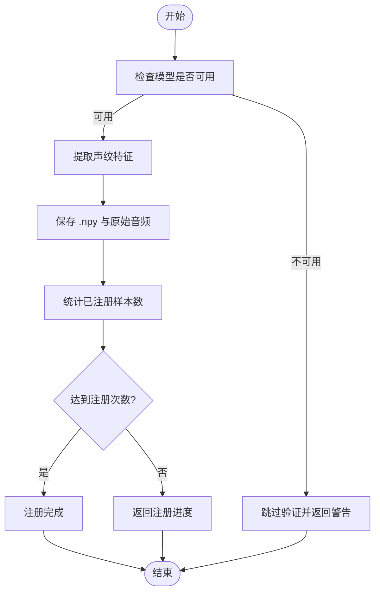

# 声纹识别认证

<cite>
**本文引用的文件列表**
- [voiceprint.py](file://backend_design/nexus/core/voiceprint.py)
- [config.py](file://backend_design/nexus/config.py)
- [auth.py](file://backend_design/nexus/api/routes/auth.py)
- [auth_core.py](file://backend_design/nexus/core/auth.py)
- [asr.py](file://backend_design/nexus/api/routes/asr.py)
- [personalization.py](file://backend_design/nexus/core/personalization.py)
- [voiceprint-guide.md](file://docs/voice/voiceprint-guide.md)
- [configuration.json](file://models/sv/cam_plus/configuration.json)
- [cam_plus_readme.md](file://models/sv/cam_plus/README.md)
- [assets_README.md](file://assets/README.md)
</cite>

## 目录
1. [简介](#简介)
2. [项目结构](#项目结构)
3. [核心组件](#核心组件)
4. [架构总览](#架构总览)
5. [详细组件分析](#详细组件分析)
6. [依赖关系分析](#依赖关系分析)
7. [性能与优化建议](#性能与优化建议)
8. [故障排查指南](#故障排查指南)
9. [结论](#结论)
10. [附录](#附录)

## 简介
本技术文档围绕基于 CAM++ 模型的声纹识别认证系统，系统性阐述用户声纹注册、特征提取、相似度匹配算法、数据库管理、身份验证流程、防欺诈机制、隐私保护、质量评估、误识率控制、性能优化以及采集最佳实践与常见问题解决方案。系统采用本地部署的 CAM++（3D-Speaker）模型进行说话人验证，按座舱隔离存储用户声纹特征，结合 JWT 鉴权与个性化服务，形成端到端的车载声纹认证闭环。

## 项目结构
与声纹识别相关的核心代码与资源分布如下：
- 后端核心服务
  - 声纹服务：VoiceprintService（注册、验证、状态查询、删除）
  - 配置中心：CockpitSettings 中的声纹阈值与注册次数等参数
  - 认证模块：JWT Token 签发与校验
  - ASR 路由：语音转文本（为声纹采集提供前置能力）
  - 个性化服务：根据 user_id 加载用户偏好
- 模型与数据
  - CAM++ 模型配置与说明
  - 声纹音频与用户特征存储目录

图表来源
- [voiceprint.py:42-364](file://backend_design/nexus/core/voiceprint.py#L42-L364)
- [config.py:557-580](file://backend_design/nexus/config.py#L557-L580)
- [auth.py:46-82](file://backend_design/nexus/api/routes/auth.py#L46-L82)
- [auth_core.py:36-123](file://backend_design/nexus/core/auth.py#L36-L123)
- [asr.py:49-141](file://backend_design/nexus/api/routes/asr.py#L49-L141)
- [personalization.py:34-75](file://backend_design/nexus/core/personalization.py#L34-L75)
- [configuration.json:1-17](file://models/sv/cam_plus/configuration.json#L1-L17)
- [cam_plus_readme.md:48-70](file://models/sv/cam_plus/README.md#L48-L70)
- [assets_README.md:1-23](file://assets/README.md#L1-L23)

章节来源
- [voiceprint.py:42-364](file://backend_design/nexus/core/voiceprint.py#L42-L364)
- [config.py:557-580](file://backend_design/nexus/config.py#L557-L580)
- [auth.py:46-82](file://backend_design/nexus/api/routes/auth.py#L46-L82)
- [auth_core.py:36-123](file://backend_design/nexus/core/auth.py#L36-L123)
- [asr.py:49-141](file://backend_design/nexus/api/routes/asr.py#L49-L141)
- [personalization.py:34-75](file://backend_design/nexus/core/personalization.py#L34-L75)
- [configuration.json:1-17](file://models/sv/cam_plus/configuration.json#L1-L17)
- [cam_plus_readme.md:48-70](file://models/sv/cam_plus/README.md#L48-L70)
- [assets_README.md:1-23](file://assets/README.md#L1-L23)

## 核心组件
- VoiceprintService
  - 功能：延迟加载 CAM++ 模型；按座舱和用户隔离存储 .npy 特征；支持注册、验证、状态查询、删除；余弦相似度比对；模型不可用时安全降级返回 None。
  - 关键方法：enroll、verify、get_status、delete_voiceprint、_extract_embedding、_compute_similarity。
- CockpitSettings（配置）
  - 声纹相关：voiceprint_threshold、voiceprint_enroll_count、voiceprint_model。
- JWT 认证
  - create_access_token、decode_token、get_current_user、get_optional_user。
- ASR 路由
  - 提供 /asr/transcribe，用于将上传音频转为文本，辅助声纹采集前的语音指令解析。
- PersonalizationService
  - 根据 user_id 读取 JSON 偏好与 MySQL 习惯记录，构建画像注入 Prompt，并支持音乐匹配。

章节来源
- [voiceprint.py:42-364](file://backend_design/nexus/core/voiceprint.py#L42-L364)
- [config.py:557-580](file://backend_design/nexus/config.py#L557-L580)
- [auth_core.py:36-123](file://backend_design/nexus/core/auth.py#L36-L123)
- [asr.py:49-141](file://backend_design/nexus/api/routes/asr.py#L49-L141)
- [personalization.py:34-75](file://backend_design/nexus/core/personalization.py#L34-L75)

## 架构总览
系统以 FastAPI 为入口，ASR 路由负责语音转文本，VoiceprintService 负责声纹注册与验证，PersonalizationService 在验证成功后加载用户偏好，JWT 模块保障接口访问安全。

图表来源
- [asr.py:49-141](file://backend_design/nexus/api/routes/asr.py#L49-L141)
- [voiceprint.py:99-246](file://backend_design/nexus/core/voiceprint.py#L99-L246)
- [personalization.py:51-75](file://backend_design/nexus/core/personalization.py#L51-L75)
- [auth.py:46-82](file://backend_design/nexus/api/routes/auth.py#L46-L82)
- [auth_core.py:36-123](file://backend_design/nexus/core/auth.py#L36-L123)

## 详细组件分析

### 声纹服务（VoiceprintService）
- 设计要点
  - 延迟加载 CAM++ 模型，避免启动阻塞；模型不可用时返回 None，调用方跳过验证，防止“假验证成功”。
  - 存储路径按 cockpit_id/user_id 隔离，每个用户的嵌入向量以 enroll_01.npy、enroll_02.npy 命名，同时保留原始音频。
  - 验证时遍历该座舱下所有用户的所有已注册 embedding，取最大相似度并与阈值比较。
  - 相似度计算使用归一化点积（等价于余弦相似度）。
- 复杂度分析
  - 注册：一次模型推理 + 一次磁盘写入，时间主要取决于模型推理。
  - 验证：K 个用户 × N 条注册样本的余弦相似度计算，时间复杂度 O(K×N×D)，D 为 embedding 维度。
- 错误处理
  - 模型不可用：返回 None，上层逻辑应跳过声纹验证。
  - 文件读取异常：记录错误日志并忽略该样本继续比对。
- 可优化点
  - 引入缓存层（如 Redis）存储最近验证结果或热门用户 embedding，减少 IO 与重复计算。
  - 对 K×N 的比对进行向量化加速（NumPy 批量计算），降低 Python 循环开销。
  - 异步 I/O 并发读取多个用户 embedding，缩短长尾响应。

图表来源
- [voiceprint.py:42-364](file://backend_design/nexus/core/voiceprint.py#L42-L364)

章节来源
- [voiceprint.py:99-246](file://backend_design/nexus/core/voiceprint.py#L99-L246)
- [voiceprint.py:296-351](file://backend_design/nexus/core/voiceprint.py#L296-L351)

### 配置中心（CockpitSettings）
- 声纹相关字段
  - voiceprint_model：默认 cam_plus
  - voiceprint_threshold：默认 0.7
  - voiceprint_enroll_count：默认 3
- 作用
  - 控制验证阈值与注册所需样本数，影响误识率与用户体验平衡。

章节来源
- [config.py:557-580](file://backend_design/nexus/config.py#L557-L580)

### 认证模块（JWT）
- 功能
  - 签发 Access Token，包含用户标识与可选角色/座舱信息。
  - 校验 Token 有效性，失败返回 401。
- 集成点
  - 受保护 API 通过 Depends(get_current_user) 获取当前用户 ID。
  - 开发环境直接签发 Token，生产环境需接入用户库校验密码。

章节来源
- [auth.py:46-82](file://backend_design/nexus/api/routes/auth.py#L46-L82)
- [auth_core.py:36-123](file://backend_design/nexus/core/auth.py#L36-L123)

### ASR 路由（语音转文本）
- 功能
  - 接收前端录音（webm/wav/mp3/m4a），转换为 16kHz 单声道 WAV 后由 SenseVoice 引擎识别。
- 与声纹的关系
  - 为声纹采集提供语音指令解析能力，便于引导用户完成“注册声纹”流程。

章节来源
- [asr.py:49-141](file://backend_design/nexus/api/routes/asr.py#L49-L141)

### 个性化服务（PersonalizationService）
- 功能
  - 根据 user_id 读取 JSON 偏好与 MySQL 习惯记录，构建画像文本注入 Prompt，并支持音乐匹配。
- 与声纹的关系
  - 在声纹验证成功后，根据 user_id 加载用户偏好，实现个性化体验。

章节来源
- [personalization.py:51-75](file://backend_design/nexus/core/personalization.py#L51-L75)
- [personalization.py:204-241](file://backend_design/nexus/core/personalization.py#L204-L241)

### CAM++ 模型与配置
- 模型信息
  - 任务：说话人验证（speaker-verification）
  - 框架：PyTorch
  - 输出：embedding（配置中 emb_size=512，文档说明 192 维，实际以模型权重为准）
  - 阈值：yesOrno_thr=0.5（模型侧），系统侧使用 voiceprint_threshold=0.7
- 说明
  - README 强调 CAM++ 兼顾性能与速度，适合车载场景。

章节来源
- [configuration.json:1-17](file://models/sv/cam_plus/configuration.json#L1-L17)
- [cam_plus_readme.md:48-70](file://models/sv/cam_plus/README.md#L48-L70)
- [voiceprint-guide.md:13-19](file://docs/voice/voiceprint-guide.md#L13-L19)

### 数据存储与目录结构
- 用户声纹存储
  - 路径：assets/speaker/users/{cockpit_id}/{user_id}/enroll_XX.npy
  - 同时保存原始音频样本，便于审计与重算。
- 注册音频示例
  - assets/speaker/enroll_wav 存放示例注册音频。

章节来源
- [assets_README.md:1-23](file://assets/README.md#L1-L23)
- [voiceprint.py:85-97](file://backend_design/nexus/core/voiceprint.py#L85-L97)
- [voiceprint.py:138-167](file://backend_design/nexus/core/voiceprint.py#L138-L167)

## 依赖关系分析
- 组件耦合
  - VoiceprintService 依赖配置中心（阈值、注册次数）、文件系统（用户特征）、CAM++ 模型（可选，未安装则降级）。
  - ASR 路由独立于声纹服务，但可与声纹流程组合使用。
  - JWT 认证与业务解耦，通过依赖注入方式保护接口。
  - PersonalizationService 依赖用户 ID（来自声纹验证结果）与数据源（JSON/MySQL）。
- 外部依赖
  - modelzipper.llmutils.load_model：加载 CAM++ 模型（可选）。
  - torchaudio：音频加载与预处理（可选）。
  - numpy：向量运算与相似度计算。

图表来源
- [voiceprint.py:61-84](file://backend_design/nexus/core/voiceprint.py#L61-L84)
- [config.py:557-580](file://backend_design/nexus/config.py#L557-L580)
- [auth.py:46-82](file://backend_design/nexus/api/routes/auth.py#L46-L82)
- [auth_core.py:36-123](file://backend_design/nexus/core/auth.py#L36-L123)
- [asr.py:49-141](file://backend_design/nexus/api/routes/asr.py#L49-L141)
- [personalization.py:34-75](file://backend_design/nexus/core/personalization.py#L34-L75)

章节来源
- [voiceprint.py:61-84](file://backend_design/nexus/core/voiceprint.py#L61-L84)
- [config.py:557-580](file://backend_design/nexus/config.py#L557-L580)
- [auth.py:46-82](file://backend_design/nexus/api/routes/auth.py#L46-L82)
- [auth_core.py:36-123](file://backend_design/nexus/core/auth.py#L36-L123)
- [asr.py:49-141](file://backend_design/nexus/api/routes/asr.py#L49-L141)
- [personalization.py:34-75](file://backend_design/nexus/core/personalization.py#L34-L75)

## 性能与优化建议
- 模型加载与推理
  - 延迟加载避免冷启动耗时；首次推理前预热模型。
  - 若具备 GPU，启用 CUDA 加速；CPU 环境下合理批处理。
- 相似度计算
  - 使用 NumPy 向量化批量计算，减少 Python 循环。
  - 对热门用户 embedding 做内存缓存，减少磁盘 IO。
- 存储与检索
  - 考虑引入向量数据库（如 Milvus）替代文件系统，提升大规模用户检索效率。
  - 定期归档历史注册音频，仅保留必要样本。
- 并发与异步
  - 验证阶段并发读取多用户 embedding，结合 asyncio 提升吞吐。
- 监控与指标
  - 记录注册/验证耗时、相似度分布、失败率，设置告警阈值。

[本节为通用指导，不直接分析具体文件]

## 故障排查指南
- 模型未加载导致验证失败
  - 现象：verify 返回未验证且 message 提示服务不可用。
  - 原因：CAM++ 模型缺失或导入失败，进入 mock 模式返回 None。
  - 处理：确认 models/sv/cam_plus 路径存在且可加载；检查依赖是否安装。
- 注册未完成
  - 现象：completed=False，enroll_count < required_count。
  - 处理：按提示继续录制足够数量的音频样本。
- 无匹配用户
  - 现象：verified=False，similarity 低于阈值。
  - 处理：检查阈值配置、录音质量、背景噪声；必要时重新注册。
- 文件读取异常
  - 现象：加载某用户 embedding 报错。
  - 处理：检查文件完整性与权限，清理损坏样本后重试。

章节来源
- [voiceprint.py:119-167](file://backend_design/nexus/core/voiceprint.py#L119-L167)
- [voiceprint.py:187-246](file://backend_design/nexus/core/voiceprint.py#L187-L246)
- [voiceprint.py:296-333](file://backend_design/nexus/core/voiceprint.py#L296-L333)

## 结论
本系统以 CAM++ 为核心，结合本地部署与座舱隔离存储，实现了安全的声纹注册与验证流程。通过 JWT 鉴权与个性化服务，系统在车载场景中提供了良好的用户体验与安全边界。针对性能与可扩展性，建议引入向量数据库与缓存策略，并完善监控与告警体系。

[本节为总结性内容，不直接分析具体文件]

## 附录

### 工作流程图（注册与验证）

图表来源
- [voiceprint.py:119-167](file://backend_design/nexus/core/voiceprint.py#L119-L167)
- [voiceprint.py:296-333](file://backend_design/nexus/core/voiceprint.py#L296-L333)

### 声纹质量评估与误识率控制
- 质量评估
  - 录音时长：建议 3-5 秒，确保足够上下文。
  - 信噪比：尽量在安静环境中录制，避免强噪声。
  - 采样率：16kHz 单声道，符合模型输入要求。
- 误识率控制
  - 调整阈值：提高阈值降低误识率，但可能增加拒识率；需权衡。
  - 多样本融合：注册多条样本，验证时取最大相似度，提升鲁棒性。
  - 动态阈值：根据环境噪声与用户历史表现自适应调整。

章节来源
- [voiceprint-guide.md:29-42](file://docs/voice/voiceprint-guide.md#L29-L42)
- [config.py:576-578](file://backend_design/nexus/config.py#L576-L578)

### 隐私保护措施
- 本地存储：用户特征与音频保存在本地文件系统，避免云端泄露。
- 座舱隔离：按 cockpit_id/user_id 隔离存储，防止跨座舱越权访问。
- 最小化保留：仅保留必要样本，定期清理过期数据。
- 访问控制：结合 JWT 鉴权限制敏感接口访问。

章节来源
- [voiceprint.py:85-97](file://backend_design/nexus/core/voiceprint.py#L85-L97)
- [auth.py:46-82](file://backend_design/nexus/api/routes/auth.py#L46-L82)
- [auth_core.py:36-123](file://backend_design/nexus/core/auth.py#L36-L123)

### 声纹采集最佳实践
- 录制环境：安静、无回声，距离麦克风适中。
- 录制内容：自然语句，避免刻意模仿或夸张发音。
- 多次注册：至少 3 次不同语句，覆盖不同语境。
- 格式规范：WAV 16kHz 单声道优先，其他格式自动转换。

章节来源
- [asr.py:143-249](file://backend_design/nexus/api/routes/asr.py#L143-L249)
- [voiceprint-guide.md:31-42](file://docs/voice/voiceprint-guide.md#L31-L42)