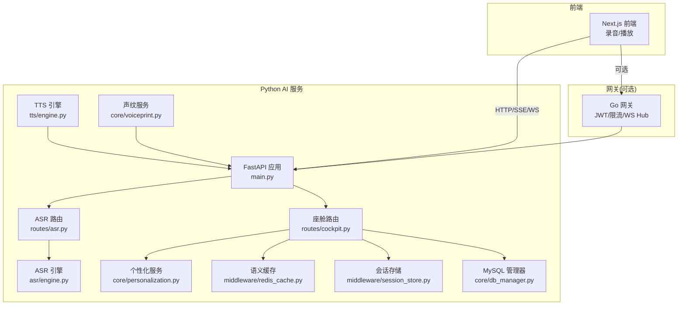
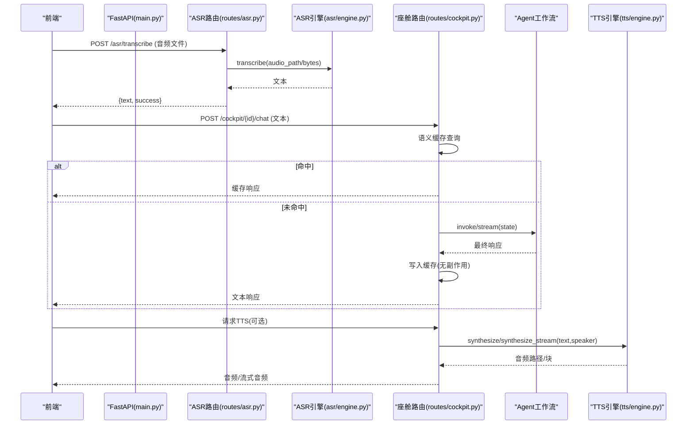
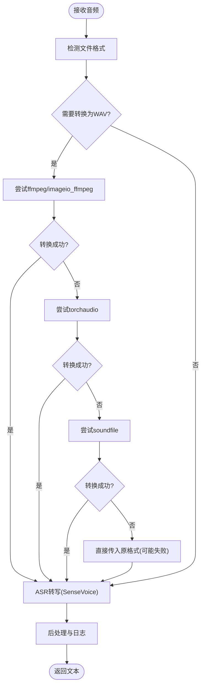
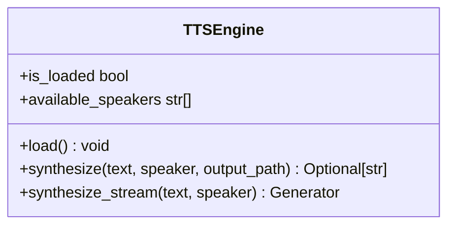
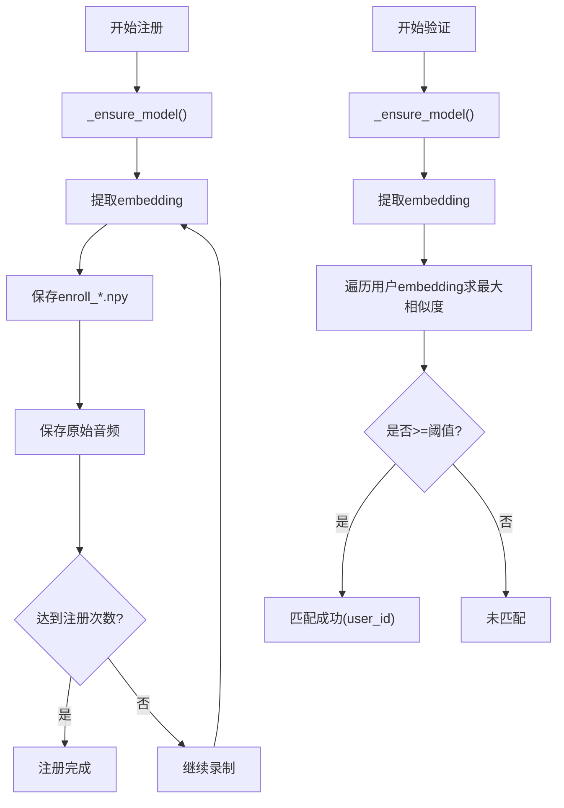
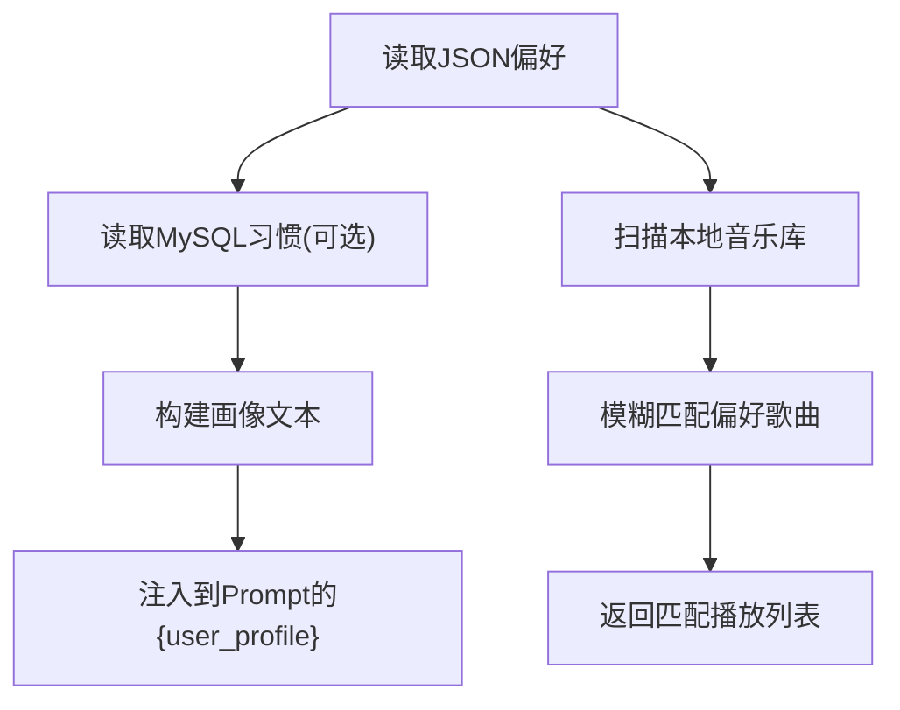
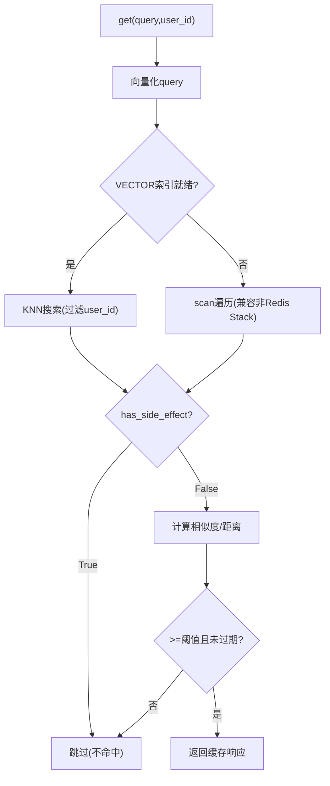
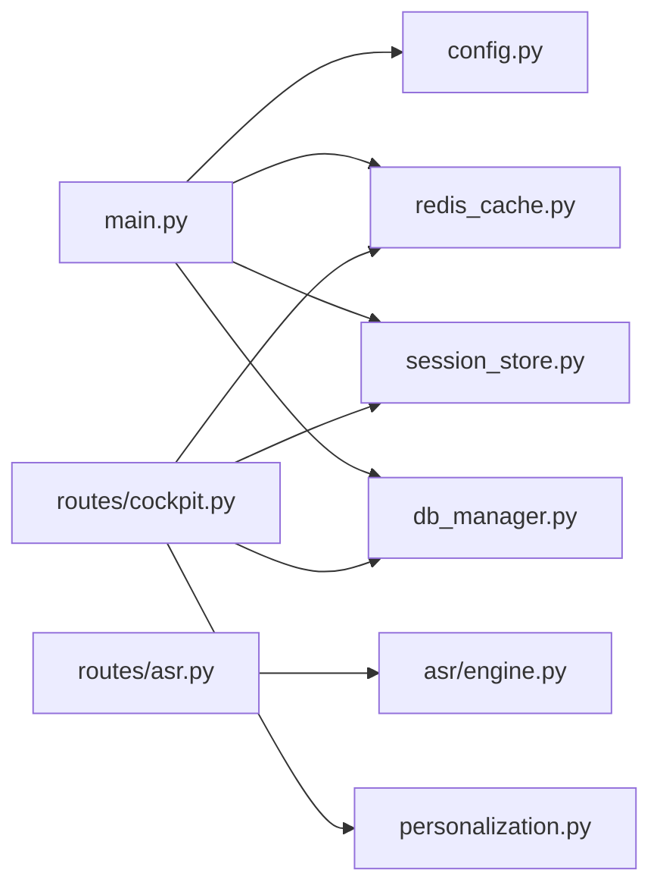

# 语音交互引擎

<cite>
**本文引用的文件**   
- [README.md](file://README.md)
- [backend_design/nexus/main.py](file://backend_design/nexus/main.py)
- [backend_design/nexus/config.py](file://backend_design/nexus/config.py)
- [backend_design/nexus/asr/engine.py](file://backend_design/nexus/asr/engine.py)
- [backend_design/nexus/tts/engine.py](file://backend_design/nexus/tts/engine.py)
- [backend_design/nexus/core/voiceprint.py](file://backend_design/nexus/core/voiceprint.py)
- [backend_design/nexus/api/routes/asr.py](file://backend_design/nexus/api/routes/asr.py)
- [backend_design/nexus/api/routes/cockpit.py](file://backend_design/nexus/api/routes/cockpit.py)
- [backend_design/nexus/core/personalization.py](file://backend_design/nexus/core/personalization.py)
- [backend_design/nexus/middleware/redis_cache.py](file://backend_design/nexus/middleware/redis_cache.py)
- [backend_design/nexus/middleware/session_store.py](file://backend_design/nexus/middleware/session_store.py)
- [backend_design/nexus/core/db_manager.py](file://backend_design/nexus/core/db_manager.py)
- [docs/voice/README.md](file://docs/voice/README.md)
- [docs/voice/audio-pipeline-guide.md](file://docs/voice/audio-pipeline-guide.md)
- [docs/voice/tts-guide.md](file://docs/voice/tts-guide.md)
- [docs/voice/voiceprint-guide.md](file://docs/voice/voiceprint-guide.md)
</cite>

## 目录
1. [简介](#简介)
2. [项目结构](#项目结构)
3. [核心组件](#核心组件)
4. [架构总览](#架构总览)
5. [详细组件分析](#详细组件分析)
6. [依赖关系分析](#依赖关系分析)
7. [性能与优化](#性能与优化)
8. [故障排查指南](#故障排查指南)
9. [结论](#结论)
10. [附录](#附录)

## 简介
本技术文档聚焦 NexusCockpit 的语音交互引擎，覆盖 ASR（SenseVoice）、TTS（CosyVoice）、声纹识别（CAM++）以及端到端语音处理流水线。内容包含：
- ASR 集成与配置：音频预处理、实时识别、多语言支持
- TTS 实现：音色克隆、情感控制、流式输出
- 声纹识别：用户身份验证机制
- 完整语音处理流水线：音频采集 → ASR 识别 → 文本处理 → LLM 生成 → TTS 合成 → 音频输出
- 音频格式支持、采样率配置、网络传输优化
- 最佳实践与性能调优建议

## 项目结构
NexusCockpit 采用分层架构，语音相关能力集中在后端 Python 服务中，并通过 FastAPI 暴露 REST/SSE/WebSocket 接口；前端通过 Next.js 进行录音与播放。关键目录与职责如下：
- backend_design/nexus/asr: ASR 引擎封装（SenseVoice）
- backend_design/nexus/tts: TTS 引擎封装（CosyVoice）
- backend_design/nexus/core/voiceprint.py: 声纹注册与验证（CAM++）
- backend_design/nexus/api/routes/asr.py: ASR REST 路由
- backend_design/nexus/api/routes/cockpit.py: 座舱对话与车控路由（含流式）
- backend_design/nexus/core/personalization.py: 个性化服务（基于声纹匹配偏好）
- backend_design/nexus/middleware/redis_cache.py: 语义缓存（Redis Stack VECTOR）
- backend_design/nexus/middleware/session_store.py: 会话历史持久化（Redis 降级内存）
- backend_design/nexus/core/db_manager.py: MySQL 统一访问层（习惯记录等）
- docs/voice/*: 语音系统文档与管线说明

图表来源
- [backend_design/nexus/main.py:294-340](file://backend_design/nexus/main.py#L294-L340)
- [backend_design/nexus/api/routes/asr.py:26-39](file://backend_design/nexus/api/routes/asr.py#L26-L39)
- [backend_design/nexus/api/routes/cockpit.py:30-95](file://backend_design/nexus/api/routes/cockpit.py#L30-L95)
- [backend_design/nexus/asr/engine.py:21-56](file://backend_design/nexus/asr/engine.py#L21-L56)
- [backend_design/nexus/tts/engine.py:21-62](file://backend_design/nexus/tts/engine.py#L21-L62)
- [backend_design/nexus/core/voiceprint.py:42-84](file://backend_design/nexus/core/voiceprint.py#L42-L84)
- [backend_design/nexus/core/personalization.py:34-76](file://backend_design/nexus/core/personalization.py#L34-L76)
- [backend_design/nexus/middleware/redis_cache.py:55-111](file://backend_design/nexus/middleware/redis_cache.py#L55-L111)
- [backend_design/nexus/middleware/session_store.py:35-62](file://backend_design/nexus/middleware/session_store.py#L35-L62)
- [backend_design/nexus/core/db_manager.py:33-78](file://backend_design/nexus/core/db_manager.py#L33-L78)

章节来源
- [README.md:1-140](file://README.md#L1-L140)
- [docs/voice/README.md:1-35](file://docs/voice/README.md#L1-L35)

## 核心组件
- ASR 引擎（SenseVoice）
  - 负责加载 FunASR SenseVoice 模型，提供文件与字节流的转写能力，自动选择 CUDA/CPU。
- TTS 引擎（CosyVoice）
  - 负责加载 CosyVoice 模型，提供同步与流式合成，支持说话人选择与零样本推理。
- 声纹服务（CAM++）
  - 负责注册与验证用户声纹，按座舱隔离存储 embedding，计算余弦相似度并判定阈值。
- 个性化服务
  - 根据声纹识别结果加载用户偏好（JSON + MySQL），构建画像注入 Prompt，并匹配本地音乐。
- 语义缓存与会话存储
  - Redis Stack KNN 向量检索用于语义缓存；会话历史持久化到 Redis（可降级内存）。
- 数据库管理
  - MySQL 连接池与表迁移，支撑用户习惯记录、对话历史等。

章节来源
- [backend_design/nexus/asr/engine.py:21-116](file://backend_design/nexus/asr/engine.py#L21-L116)
- [backend_design/nexus/tts/engine.py:21-151](file://backend_design/nexus/tts/engine.py#L21-L151)
- [backend_design/nexus/core/voiceprint.py:42-364](file://backend_design/nexus/core/voiceprint.py#L42-L364)
- [backend_design/nexus/core/personalization.py:34-354](file://backend_design/nexus/core/personalization.py#L34-L354)
- [backend_design/nexus/middleware/redis_cache.py:55-449](file://backend_design/nexus/middleware/redis_cache.py#L55-L449)
- [backend_design/nexus/middleware/session_store.py:35-154](file://backend_design/nexus/middleware/session_store.py#L35-L154)
- [backend_design/nexus/core/db_manager.py:33-750](file://backend_design/nexus/core/db_manager.py#L33-L750)

## 架构总览
语音交互端到端流程：
- 前端采集音频（WebRTC/媒体捕获）→ 上传至 ASR 路由
- ASR 将音频转为文本（SenseVoice）
- 文本进入座舱对话路由（可走语义缓存）→ Agent 工作流（Supervisor+专家）→ LLM 生成
- 如需语音回复，调用 TTS 引擎（CosyVoice）合成音频
- 返回音频或流式数据给前端播放

图表来源
- [backend_design/nexus/api/routes/asr.py:49-122](file://backend_design/nexus/api/routes/asr.py#L49-L122)
- [backend_design/nexus/asr/engine.py:57-103](file://backend_design/nexus/asr/engine.py#L57-L103)
- [backend_design/nexus/api/routes/cockpit.py:77-198](file://backend_design/nexus/api/routes/cockpit.py#L77-L198)
- [backend_design/nexus/tts/engine.py:63-134](file://backend_design/nexus/tts/engine.py#L63-L134)

章节来源
- [backend_design/nexus/main.py:294-340](file://backend_design/nexus/main.py#L294-L340)
- [docs/voice/README.md:1-35](file://docs/voice/README.md#L1-L35)

## 详细组件分析

### ASR 语音识别（SenseVoice）
- 模型加载与设备选择
  - 延迟加载 FunASR AutoModel，优先使用 CUDA，否则回退 CPU。
- 转写接口
  - 支持文件路径与字节流两种输入；字节流会写入临时 WAV 再转写。
- 音频预处理与格式转换
  - 路由层对 WebM/M4A/MP3/OGG 等格式进行转换，目标为 16kHz 单声道 PCM WAV。
  - 转换策略优先级：系统 ffmpeg → imageio_ffmpeg → torchaudio → soundfile。
- 多语言支持
  - SenseVoice 设置 language="auto"，自动识别语种。
- 错误处理
  - 模型未加载、导入失败、异常均记录日志并返回空文本或错误信息。

图表来源
- [backend_design/nexus/api/routes/asr.py:143-249](file://backend_design/nexus/api/routes/asr.py#L143-L249)
- [backend_design/nexus/asr/engine.py:57-103](file://backend_design/nexus/asr/engine.py#L57-L103)

章节来源
- [backend_design/nexus/asr/engine.py:21-116](file://backend_design/nexus/asr/engine.py#L21-L116)
- [backend_design/nexus/api/routes/asr.py:26-122](file://backend_design/nexus/api/routes/asr.py#L26-L122)
- [docs/voice/voiceprint-guide.md:1-62](file://docs/voice/voiceprint-guide.md#L1-L62)

### TTS 语音合成（CosyVoice）
- 模型加载与说话人
  - 延迟加载 CosyVoice，启用 JIT 加速；列出可用说话人列表。
- 合成模式
  - 同步合成：保存为 WAV 文件路径返回。
  - 流式合成：yield 音频块，适合低延迟播放。
- 音色克隆与零样本
  - 若指定说话人则使用 SFT 推理；否则使用 zero-shot 推理。
- 采样率与格式
  - 默认 22050Hz，WAV PCM 16-bit。
- 错误处理
  - 模型未加载、导入失败、异常均记录日志并返回 None 或跳过。

图表来源
- [backend_design/nexus/tts/engine.py:21-151](file://backend_design/nexus/tts/engine.py#L21-L151)

章节来源
- [backend_design/nexus/tts/engine.py:21-151](file://backend_design/nexus/tts/engine.py#L21-L151)
- [docs/voice/tts-guide.md:1-39](file://docs/voice/tts-guide.md#L1-L39)

### 声纹识别（CAM++）
- 注册流程
  - 提取 CAM++ embedding，保存到 assets/speaker/users/{cockpit_id}/{user_id}/enroll_*.npy。
  - 同时保存原始音频便于审计。
- 验证流程
  - 提取当前音频 embedding，与同座舱下所有用户已注册 embedding 做余弦相似度比较，超过阈值即匹配成功。
- 降级与健壮性
  - 模型不可用时返回 None 并记 warn，调用方应跳过验证步骤。
- 配置项
  - 阈值、注册次数可通过 CockpitSettings 配置。

图表来源
- [backend_design/nexus/core/voiceprint.py:99-246](file://backend_design/nexus/core/voiceprint.py#L99-L246)

章节来源
- [backend_design/nexus/core/voiceprint.py:42-364](file://backend_design/nexus/core/voiceprint.py#L42-L364)
- [docs/voice/voiceprint-guide.md:1-62](file://docs/voice/voiceprint-guide.md#L1-L62)

### 个性化服务（基于声纹的用户画像）
- 数据来源
  - JSON 偏好文件 data/preferences/{user_id}.json
  - MySQL user_habits 表（频次加权）
- 画像构建
  - 合并音乐、美食、位置、空调偏好与高频习惯，生成 profile_text 注入 Prompt。
- 音乐匹配
  - 扫描 assets/audio/music/ 目录，按用户偏好模糊匹配歌曲标题/文件名。

图表来源
- [backend_design/nexus/core/personalization.py:51-241](file://backend_design/nexus/core/personalization.py#L51-L241)

章节来源
- [backend_design/nexus/core/personalization.py:34-354](file://backend_design/nexus/core/personalization.py#L34-L354)
- [docs/voice/audio-pipeline-guide.md:1-62](file://docs/voice/audio-pipeline-guide.md#L1-L62)

### 语义缓存与会话存储
- 语义缓存（Redis Stack）
  - 使用 RediSearch VECTOR 索引进行 KNN 检索，按 user_id 分片，支持 TTL 分级。
  - 安全设计：has_side_effect=True 的响应永不写入缓存，避免车控指令被缓存后不执行。
  - 云 Redis 无 RediSearch 时自动降级为 scan 遍历。
- 会话存储
  - 优先 Redis 持久化，失败降级内存 dict；保留最近 N 条消息，设置过期时间。

图表来源
- [backend_design/nexus/middleware/redis_cache.py:160-313](file://backend_design/nexus/middleware/redis_cache.py#L160-L313)

章节来源
- [backend_design/nexus/middleware/redis_cache.py:55-449](file://backend_design/nexus/middleware/redis_cache.py#L55-L449)
- [backend_design/nexus/middleware/session_store.py:35-154](file://backend_design/nexus/middleware/session_store.py#L35-L154)

### 数据库管理（MySQL）
- 连接池与自动迁移
  - 启动时创建连接池，自动确保 chat_sessions、user_habits 等表存在，并为 chat_logs 添加 session_id 列。
- 用户习惯记录
  - UPSERT 记录 habit_key/habit_value 及 hit_count，供个性化服务读取。
- 对话历史
  - 支持插入与查询，附带 session_id、意图、专家参与、延迟、缓存命中等字段。

章节来源
- [backend_design/nexus/core/db_manager.py:33-750](file://backend_design/nexus/core/db_manager.py#L33-L750)

## 依赖关系分析
- 入口与生命周期
  - main.py 在 lifespan 中初始化嵌入服务、向量/图谱存储、车控适配器、语义缓存、限流器、会话存储、Langfuse、Agent 图、数据保留策略、MySQL 等。
- 路由与引擎
  - routes/asr.py 提供 /asr/transcribe 接口，内部调用 asr/engine.py 的 ASREngine。
  - routes/cockpit.py 提供 /cockpit/{id}/chat 与流式接口，结合语义缓存与会话存储，必要时触发个性化服务。
- 配置中心
  - config.py 集中管理 ASR/TTS/声纹模型路径、Redis/MySQL/LLM 等参数，并提供路径解析函数。

图表来源
- [backend_design/nexus/main.py:61-291](file://backend_design/nexus/main.py#L61-L291)
- [backend_design/nexus/config.py:601-673](file://backend_design/nexus/config.py#L601-L673)
- [backend_design/nexus/api/routes/asr.py:26-39](file://backend_design/nexus/api/routes/asr.py#L26-L39)
- [backend_design/nexus/api/routes/cockpit.py:77-198](file://backend_design/nexus/api/routes/cockpit.py#L77-L198)

章节来源
- [backend_design/nexus/main.py:294-340](file://backend_design/nexus/main.py#L294-L340)
- [backend_design/nexus/config.py:332-393](file://backend_design/nexus/config.py#L332-L393)

## 性能与优化
- 音频格式与采样率
  - ASR 推荐 16kHz 单声道 PCM WAV；路由层自动转换多种格式为目标 WAV。
  - TTS 输出 22050Hz WAV PCM 16-bit，适合车载播放。
- 设备与推理加速
  - ASR/TTS 自动检测 CUDA，优先 GPU；TTS 启用 JIT 加速。
- 语义缓存
  - 使用 RediSearch KNN 向量检索 O(log n)，显著降低重复问答延迟；云环境自动降级 scan。
- 会话持久化
  - Redis 持久化会话历史，失败降级内存，保障可用性。
- 网络传输优化
  - 使用 SSE 流式返回文本；TTS 支持流式音频块，减少首包延迟。
- 并发与限流
  - Go 网关提供 JWT 鉴权与限流；Python 侧通过中间件与异步 IO 提升吞吐。

章节来源
- [backend_design/nexus/api/routes/asr.py:143-249](file://backend_design/nexus/api/routes/asr.py#L143-L249)
- [backend_design/nexus/tts/engine.py:33-62](file://backend_design/nexus/tts/engine.py#L33-L62)
- [backend_design/nexus/middleware/redis_cache.py:83-111](file://backend_design/nexus/middleware/redis_cache.py#L83-L111)
- [backend_design/nexus/middleware/session_store.py:50-62](file://backend_design/nexus/middleware/session_store.py#L50-L62)
- [docs/voice/tts-guide.md:1-39](file://docs/voice/tts-guide.md#L1-L39)

## 故障排查指南
- ASR 无法识别
  - 检查模型路径是否存在、funasr 是否安装、CUDA 是否可用；查看路由层转换日志。
- TTS 无声音
  - 确认 cosyvoice 模型路径、可用说话人列表；检查输出路径权限与磁盘空间。
- 声纹验证失败
  - 模型不可用时会返回 None，需跳过验证；检查注册音频数量与阈值配置。
- 语义缓存命中率低
  - 调整相似度阈值与 TTL；确认 RediSearch 索引是否创建成功；云环境注意降级行为。
- 会话丢失
  - 检查 Redis 连通性与键前缀；确认降级内存模式是否正常。
- 数据库异常
  - 检查连接池状态与自动迁移是否成功；关注中文用户名修复与表结构变更。

章节来源
- [backend_design/nexus/asr/engine.py:32-56](file://backend_design/nexus/asr/engine.py#L32-L56)
- [backend_design/nexus/tts/engine.py:33-62](file://backend_design/nexus/tts/engine.py#L33-L62)
- [backend_design/nexus/core/voiceprint.py:61-84](file://backend_design/nexus/core/voiceprint.py#L61-L84)
- [backend_design/nexus/middleware/redis_cache.py:112-158](file://backend_design/nexus/middleware/redis_cache.py#L112-L158)
- [backend_design/nexus/middleware/session_store.py:50-62](file://backend_design/nexus/middleware/session_store.py#L50-L62)
- [backend_design/nexus/core/db_manager.py:79-143](file://backend_design/nexus/core/db_manager.py#L79-L143)

## 结论
NexusCockpit 的语音交互引擎以模块化方式整合了 SenseVoice、CosyVoice 与 CAM++，并通过语义缓存与会话持久化提升了整体性能与稳定性。配合个性化服务与多座舱上下文，可实现高质量、低延迟的车载语音体验。生产部署建议关注模型路径、设备加速、缓存策略与网络传输优化，并结合监控指标持续调优。

## 附录
- 环境变量与配置要点
  - ASR/TTS/声纹模型路径：ASRConfig
  - 语义缓存开关与阈值：RedisConfig
  - 声纹阈值与注册次数：CockpitSettings
  - MySQL 连接与字符集：MySQLConfig
- 参考文档
  - 语音系统概览与模块清单见 docs/voice/README.md
  - 音频管线与音乐播放链路见 docs/voice/audio-pipeline-guide.md
  - TTS 技术选型与降级策略见 docs/voice/tts-guide.md
  - 声纹识别工作流程与 v2.2 修复见 docs/voice/voiceprint-guide.md

章节来源
- [backend_design/nexus/config.py:332-393](file://backend_design/nexus/config.py#L332-L393)
- [docs/voice/README.md:1-35](file://docs/voice/README.md#L1-L35)
- [docs/voice/audio-pipeline-guide.md:1-62](file://docs/voice/audio-pipeline-guide.md#L1-L62)
- [docs/voice/tts-guide.md:1-39](file://docs/voice/tts-guide.md#L1-L39)
- [docs/voice/voiceprint-guide.md:1-62](file://docs/voice/voiceprint-guide.md#L1-L62)