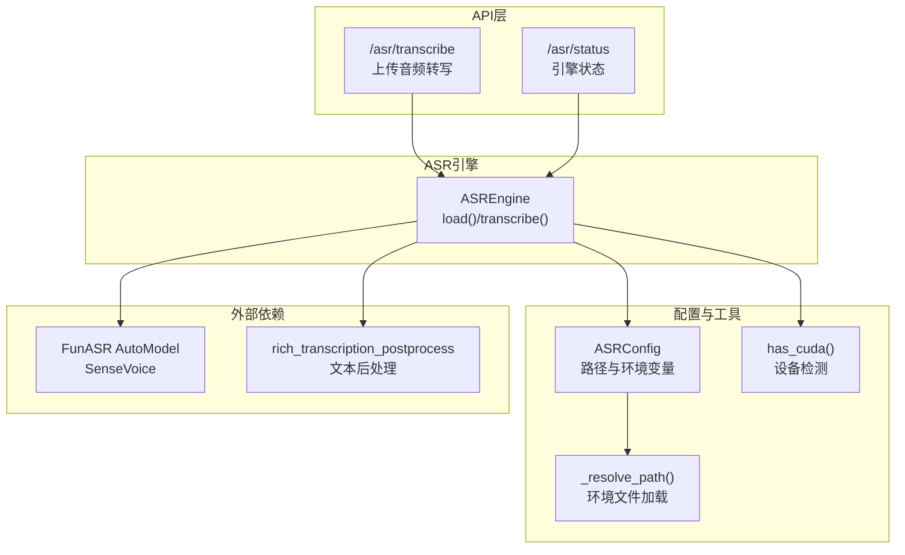
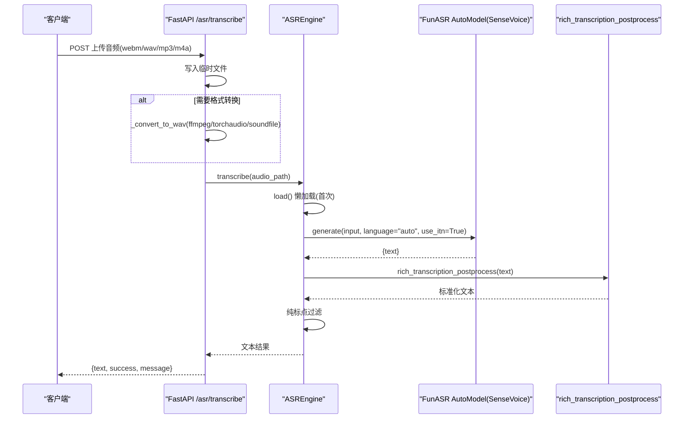
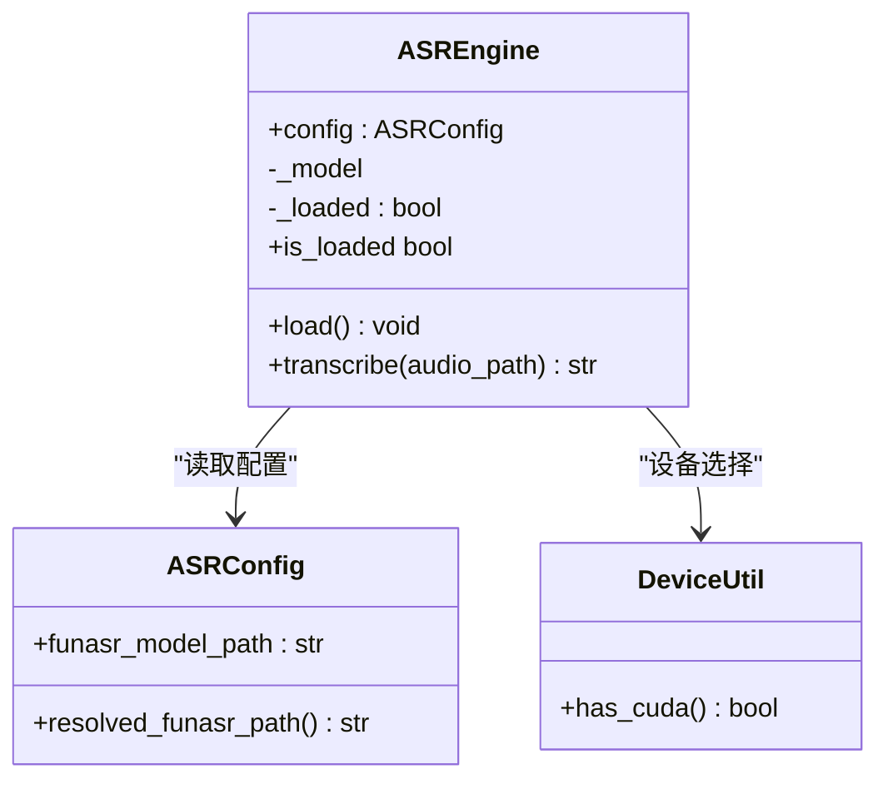
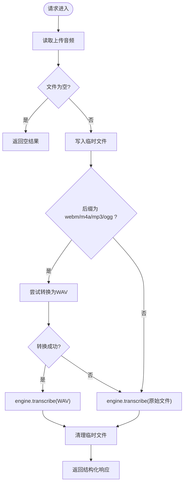
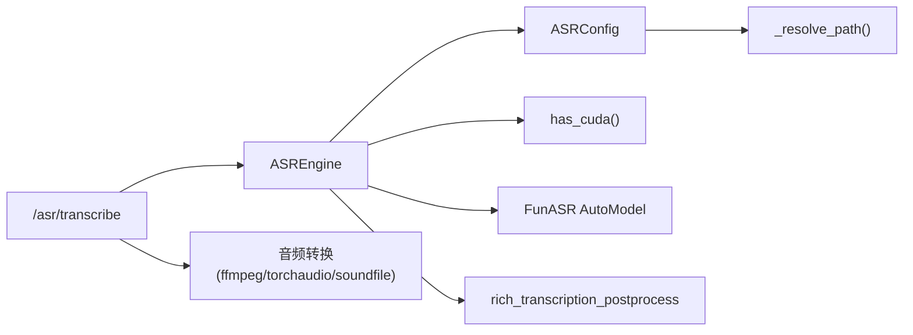

# ASR语音识别

<cite>
**本文引用的文件**   
- [engine.py](file://backend_design/nexus/asr/engine.py)
- [asr.py](file://backend_design/nexus/api/routes/asr.py)
- [asr_config.py](file://backend_design/nexus/config/asr.py)
- [device.py](file://backend_design/nexus/core/device.py)
- [_common.py](file://backend_design/nexus/config/_common.py)
- [config_init.py](file://backend_design/nexus/config/__init__.py)
- [main.py](file://backend_design/nexus/main.py)
- [logger.py](file://backend_design/nexus/core/logger.py)
- [sensevoice_readme.md](file://models/asr/sensevoice/README.md)
</cite>

## 目录
1. [简介](#简介)
2. [项目结构](#项目结构)
3. [核心组件](#核心组件)
4. [架构总览](#架构总览)
5. [详细组件分析](#详细组件分析)
6. [依赖关系分析](#依赖关系分析)
7. [性能与优化](#性能与优化)
8. [故障排查指南](#故障排查指南)
9. [结论](#结论)
10. [附录：集成新模型与音频格式处理](#附录：集成新模型与音频格式处理)

## 简介
本技术文档聚焦 NexusCockpit 的 ASR（自动语音识别）模块，基于 FunASR SenseVoice 实现本地离线语音识别。内容涵盖模型加载机制、音频预处理流程、实时识别优化、错误处理策略，以及 SenseVoice 的配置参数、设备选择（CPU/CUDA）、语言自动检测、文本后处理、纯标点过滤、静音检测与噪声抑制等关键能力。同时提供扩展新模型、提升识别精度与适配不同音频格式的实践指导，并给出性能调优、内存管理与并发处理的建议。

## 项目结构
ASR 相关代码主要分布在以下位置：
- 引擎封装：backend_design/nexus/asr/engine.py
- API 路由：backend_design/nexus/api/routes/asr.py
- 配置中心：backend_design/nexus/config/asr.py、backend_design/nexus/config/__init__.py、backend_design/nexus/config/_common.py
- 设备检测：backend_design/nexus/core/device.py
- 应用启动与后台预加载：backend_design/nexus/main.py
- 日志系统：backend_design/nexus/core/logger.py
- SenseVoice 模型说明：models/asr/sensevoice/README.md

图表来源 
- [asr.py:48-140](file://backend_design/nexus/api/routes/asr.py#L48-L140)
- [engine.py:78-178](file://backend_design/nexus/asr/engine.py#L78-L178)
- [asr_config.py:15-66](file://backend_design/nexus/config/asr.py#L15-L66)
- [_common.py:56-75](file://backend_design/nexus/config/_common.py#L56-L75)
- [device.py:10-21](file://backend_design/nexus/core/device.py#L10-L21)

章节来源
- [asr.py:1-248](file://backend_design/nexus/api/routes/asr.py#L1-L248)
- [engine.py:1-178](file://backend_design/nexus/asr/engine.py#L1-L178)
- [asr_config.py:1-66](file://backend_design/nexus/config/asr.py#L1-L66)
- [_common.py:1-75](file://backend_design/nexus/config/_common.py#L1-L75)
- [device.py:1-21](file://backend_design/nexus/core/device.py#L1-L21)
- [config_init.py:84-167](file://backend_design/nexus/config/__init__.py#L84-L167)
- [main.py:360-382](file://backend_design/nexus/main.py#L360-L382)
- [logger.py:83-200](file://backend_design/nexus/core/logger.py#L83-L200)
- [sensevoice_readme.md:92-170](file://models/asr/sensevoice/README.md#L92-L170)

## 核心组件
- ASREngine：封装 FunASR SenseVoice 的模型加载、推理与结果后处理；支持语言自动检测、ITN（逆文本正则化）、纯标点过滤、设备自动选择（CUDA/CPU）。
- ASRConfig：集中管理 ASR/TTS/声纹模型路径与环境变量，解析相对路径为绝对路径，提供 resolved_* 方法。
- API 路由 /asr/transcribe：接收前端上传的音频（webm/wav/mp3/m4a），进行格式转换或直读，调用 ASREngine 完成转写，返回结构化响应。
- 设备检测 has_cuda：检测 CUDA 或 Apple MPS 后端可用性，决定运行设备。
- 应用启动与后台预加载：在 FastAPI 启动时异步后台预加载 ASR 模型，避免阻塞服务就绪。

章节来源
- [engine.py:78-178](file://backend_design/nexus/asr/engine.py#L78-L178)
- [asr_config.py:15-66](file://backend_design/nexus/config/asr.py#L15-L66)
- [asr.py:48-140](file://backend_design/nexus/api/routes/asr.py#L48-L140)
- [device.py:10-21](file://backend_design/nexus/core/device.py#L10-L21)
- [main.py:360-382](file://backend_design/nexus/main.py#L360-L382)

## 架构总览
下图展示从请求到识别结果的端到端流程，包括音频格式转换、引擎懒加载、模型推理与文本后处理。

图表来源 
- [asr.py:48-140](file://backend_design/nexus/api/routes/asr.py#L48-L140)
- [asr.py:142-248](file://backend_design/nexus/api/routes/asr.py#L142-L248)
- [engine.py:138-178](file://backend_design/nexus/asr/engine.py#L138-L178)
- [sensevoice_readme.md:92-170](file://models/asr/sensevoice/README.md#L92-L170)

章节来源
- [asr.py:48-140](file://backend_design/nexus/api/routes/asr.py#L48-L140)
- [asr.py:142-248](file://backend_design/nexus/api/routes/asr.py#L142-L248)
- [engine.py:138-178](file://backend_design/nexus/asr/engine.py#L138-L178)
- [sensevoice_readme.md:92-170](file://models/asr/sensevoice/README.md#L92-L170)

## 详细组件分析

### ASREngine 类
- 职责：封装 FunASR SenseVoice 模型的加载、推理与结果后处理；提供 is_loaded 属性用于状态检查。
- 模型加载：
  - 使用 AutoModel(model=model_path, trust_remote_code=True, disable_update=True, device=...) 初始化。
  - 通过 has_cuda() 自动选择 "cuda:0" 或 "cpu"。
  - 在加载期间抑制 FunASR/PyTorch 噪音日志（warnings.filterwarnings、logging.getLogger 级别调整、redirect_stdout）。
- 推理流程：
  - 调用 model.generate(input=audio_path, cache={}, language="auto", use_itn=True)。
  - 使用 rich_transcription_postprocess 对文本进行标准化。
  - 纯标点过滤：匹配仅包含空白/标点的结果，返回空字符串以避免无意义输出。
- 错误处理：
  - ImportError（funasr未安装）与异常捕获记录警告/错误日志。
  - 未加载模型时直接返回空字符串并记录错误。

图表来源 
- [engine.py:78-178](file://backend_design/nexus/asr/engine.py#L78-L178)
- [asr_config.py:15-66](file://backend_design/nexus/config/asr.py#L15-L66)
- [device.py:10-21](file://backend_design/nexus/core/device.py#L10-L21)

章节来源
- [engine.py:78-178](file://backend_design/nexus/asr/engine.py#L78-L178)
- [asr_config.py:15-66](file://backend_design/nexus/config/asr.py#L15-L66)
- [device.py:10-21](file://backend_design/nexus/core/device.py#L10-L21)

### API 路由 /asr/transcribe
- 输入：multipart/form-data 上传音频文件（webm/wav/mp3/m4a）。
- 处理流程：
  - 读取音频数据并写入临时文件。
  - 若后缀为 webm/m4a/mp3/ogg，优先尝试转换为 16kHz 单声道 WAV（ffmpeg/imageio_ffmpeg/torchaudio/soundfile 多策略）。
  - 获取 ASREngine 单例（懒加载），检查是否已加载。
  - 调用 engine.transcribe(wav_path) 得到文本。
  - 清理临时文件，返回结构化响应。
- 错误处理：
  - 空文件、转换失败、引擎未加载等情况均有明确返回与日志。

图表来源 
- [asr.py:48-140](file://backend_design/nexus/api/routes/asr.py#L48-L140)
- [asr.py:142-248](file://backend_design/nexus/api/routes/asr.py#L142-L248)

章节来源
- [asr.py:48-140](file://backend_design/nexus/api/routes/asr.py#L48-L140)
- [asr.py:142-248](file://backend_design/nexus/api/routes/asr.py#L142-L248)

### 配置与路径解析
- ASRConfig：
  - funasr_model_path：默认 "./models/asr/sensevoice"，可通过环境变量 FUNASR_MODEL_PATH 覆盖。
  - model_post_init：将相对路径解析为绝对路径（基于项目根目录）。
  - resolved_funasr_path：返回已解析的绝对路径。
- _common._resolve_path：
  - 根据 _PROJECT_ROOT 计算绝对路径，确保在不同工作目录下稳定可用。
  - 支持 .env.local 优先于 .env 的环境变量加载策略。

章节来源
- [asr_config.py:15-66](file://backend_design/nexus/config/asr.py#L15-L66)
- [_common.py:56-75](file://backend_design/nexus/config/_common.py#L56-L75)
- [config_init.py:84-167](file://backend_design/nexus/config/__init__.py#L84-L167)

### 设备选择与后台预加载
- has_cuda：检测 CUDA 或 Apple MPS 后端可用性，返回布尔值。
- main.py 后台预加载：
  - 使用 asyncio.create_task 在后台线程池执行 ASREngine.load()，不阻塞 FastAPI 启动。
  - 将加载完成的引擎实例挂载到 app.state.asr_engine，供后续请求复用。

章节来源
- [device.py:10-21](file://backend_design/nexus/core/device.py#L10-L21)
- [main.py:360-382](file://backend_design/nexus/main.py#L360-L382)

### 日志与噪音抑制
- logger.py：基于 structlog 的结构化日志，支持 JSON 输出、敏感字段脱敏、控制台彩色输出。
- engine.py 噪音抑制：
  - 持久抑制：warnings.filterwarnings 忽略 FutureWarning；降低 funasr/torchaudio/markdown_it 日志级别。
  - 临时抑制：logging.disable(INFO) 与 redirect_stdout 屏蔽 FunASR 内部 INFO 日志与 print 输出，仅在模型加载期间生效。

章节来源
- [logger.py:83-200](file://backend_design/nexus/core/logger.py#L83-L200)
- [engine.py:30-76](file://backend_design/nexus/asr/engine.py#L30-L76)

## 依赖关系分析
- ASREngine 依赖：
  - ASRConfig：模型路径与环境变量。
  - DeviceUtil.has_cuda：设备选择。
  - FunASR AutoModel：SenseVoice 模型加载与推理。
  - rich_transcription_postprocess：文本后处理。
- API 路由依赖：
  - ASREngine：转写逻辑。
  - 音频转换库：ffmpeg、imageio_ffmpeg、torchaudio、soundfile（按优先级尝试）。
- 配置依赖：
  - _common._resolve_path：路径解析与环境文件加载。
  - config.__init__：全局 AppConfig 单例与子配置聚合。

图表来源 
- [asr.py:48-140](file://backend_design/nexus/api/routes/asr.py#L48-L140)
- [asr.py:142-248](file://backend_design/nexus/api/routes/asr.py#L142-L248)
- [engine.py:78-178](file://backend_design/nexus/asr/engine.py#L78-L178)
- [asr_config.py:15-66](file://backend_design/nexus/config/asr.py#L15-L66)
- [_common.py:56-75](file://backend_design/nexus/config/_common.py#L56-L75)

章节来源
- [asr.py:48-140](file://backend_design/nexus/api/routes/asr.py#L48-L140)
- [asr.py:142-248](file://backend_design/nexus/api/routes/asr.py#L142-L248)
- [engine.py:78-178](file://backend_design/nexus/asr/engine.py#L78-L178)
- [asr_config.py:15-66](file://backend_design/nexus/config/asr.py#L15-L66)
- [_common.py:56-75](file://backend_design/nexus/config/_common.py#L56-L75)

## 性能与优化
- 模型加载优化：
  - 后台预加载：在应用启动时异步加载模型，避免阻塞服务就绪。
  - 禁用更新检查：disable_update=True 减少启动耗时。
  - 噪音抑制：降低无关日志输出，提高可观测性。
- 推理优化：
  - 语言自动检测：language="auto" 提升多语言场景适应性。
  - ITN 启用：use_itn=True 改善数字与符号规范化。
  - 文本后处理：rich_transcription_postprocess 统一标点与格式。
- 音频预处理：
  - 多策略转换：优先 ffmpeg，其次 imageio_ffmpeg、torchaudio、soundfile，保证兼容性。
  - 目标格式：16kHz、单声道、PCM_16，符合 SenseVoice 推荐输入。
- 内存与并发：
  - 单例引擎：进程内共享模型实例，减少重复加载开销。
  - 临时文件清理：finally 块确保资源释放。
  - 事件循环非阻塞：后台任务与线程池执行重型操作。

[本节为通用性能讨论，不直接分析具体文件]

## 故障排查指南
- 模型路径不存在：
  - 现象：加载失败，记录警告日志。
  - 解决：检查 FUNASR_MODEL_PATH 环境变量或配置文件中的路径是否正确。
- funasr 未安装：
  - 现象：ImportError，记录警告日志。
  - 解决：安装 funasr 与 modelscope。
- 音频格式不支持：
  - 现象：转换失败，回退到直接识别或返回空结果。
  - 解决：确保系统安装 ffmpeg 或依赖包 imageio_ffmpeg/torchaudio/soundfile。
- 引擎未加载：
  - 现象：/asr/status 返回 loaded=False。
  - 解决：检查后台预加载任务是否成功，查看日志。
- 纯标点结果：
  - 现象：识别结果为标点或空白，被过滤为空字符串。
  - 解决：检查录音质量与静音段，必要时调整 VAD 或降噪策略。

章节来源
- [engine.py:124-137](file://backend_design/nexus/asr/engine.py#L124-L137)
- [asr.py:82-121](file://backend_design/nexus/api/routes/asr.py#L82-L121)
- [asr.py:142-248](file://backend_design/nexus/api/routes/asr.py#L142-L248)

## 结论
NexusCockpit 的 ASR 模块以 FunASR SenseVoice 为核心，提供了完整的本地离线语音识别能力。通过模块化设计、配置驱动、设备自适应与健壮的错误处理，实现了高可用与易扩展的语音识别服务。结合后台预加载、多策略音频转换与文本后处理，系统在性能与稳定性方面具备良好表现。未来可进一步引入 VAD、噪声抑制与流式识别以提升实时性与鲁棒性。

[本节为总结性内容，不直接分析具体文件]

## 附录：集成新模型与音频格式处理
- 集成新语音模型：
  - 在 ASRConfig 中新增模型路径字段与环境变量映射。
  - 在 ASREngine.load() 中增加模型类型判断与初始化分支。
  - 在 API 路由中扩展支持的模型标识与响应字段。
- 音频格式扩展：
  - 在 _convert_to_wav 中增加新的解码器或转换器（如 librosa、pydub）。
  - 针对特定格式优化重采样与声道合并策略。
- 识别精度优化：
  - 调整 SenseVoice 参数（如 batch_size_s、merge_vad、merge_length_s）以提升长音频效果。
  - 引入 VAD（如 fsmn-vad）进行静音检测与分段推理。
  - 自定义文本后处理规则，增强领域术语与标点规范化。

章节来源
- [asr_config.py:15-66](file://backend_design/nexus/config/asr.py#L15-L66)
- [engine.py:115-123](file://backend_design/nexus/asr/engine.py#L115-L123)
- [asr.py:142-248](file://backend_design/nexus/api/routes/asr.py#L142-L248)
- [sensevoice_readme.md:113-170](file://models/asr/sensevoice/README.md#L113-L170)