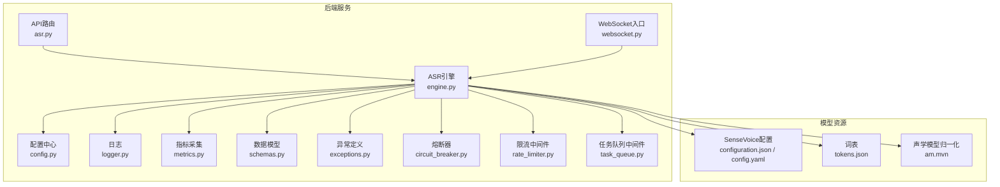
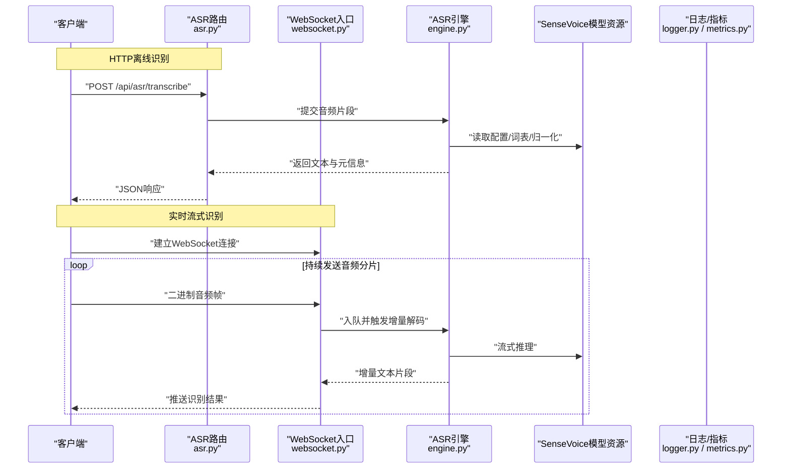
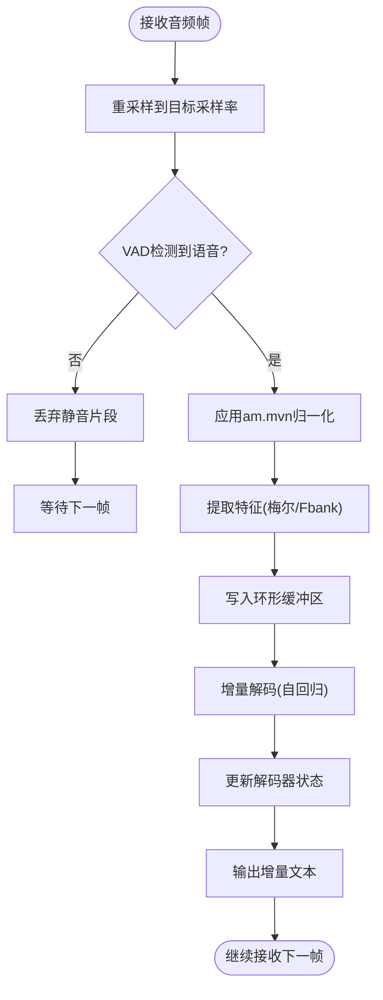
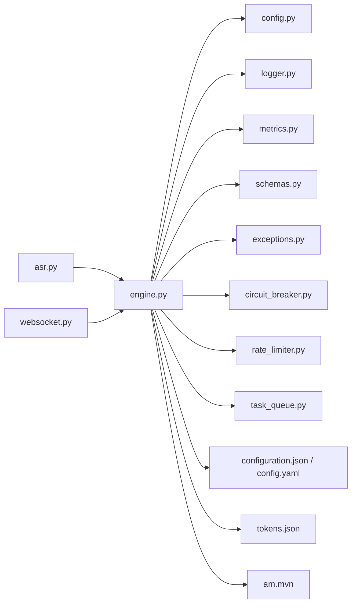

# ASR语音识别引擎

<cite>
**本文引用的文件**   
- [backend_design/nexus/asr/engine.py](file://backend_design/nexus/asr/engine.py)
- [backend_design/nexus/api/routes/asr.py](file://backend_design/nexus/api/routes/asr.py)
- [backend_design/nexus/config.py](file://backend_design/nexus/config.py)
- [backend_design/nexus/core/logger.py](file://backend_design/nexus/core/logger.py)
- [backend_design/nexus/observability/metrics.py](file://backend_design/nexus/observability/metrics.py)
- [models/asr/sensevoice/configuration.json](file://models/asr/sensevoice/configuration.json)
- [models/asr/sensevoice/tokens.json](file://models/asr/sensevoice/tokens.json)
- [models/asr/sensevoice/am.mvn](file://models/asr/sensevoice/am.mvn)
- [models/asr/sensevoice/config.yaml](file://models/asr/sensevoice/config.yaml)
- [backend_design/nexus/models/schemas.py](file://backend_design/nexus/models/schemas.py)
- [backend_design/nexus/core/exceptions.py](file://backend_design/nexus/core/exceptions.py)
- [backend_design/nexus/core/circuit_breaker.py](file://backend_design/nexus/core/circuit_breaker.py)
- [backend_design/nexus/middleware/rate_limiter.py](file://backend_design/nexus/middleware/rate_limiter.py)
- [backend_design/nexus/middleware/task_queue.py](file://backend_design/nexus/middleware/task_queue.py)
- [backend_design/nexus/api/websocket.py](file://backend_design/nexus/api/websocket.py)
</cite>

## 目录
1. [简介](#简介)
2. [项目结构](#项目结构)
3. [核心组件](#核心组件)
4. [架构总览](#架构总览)
5. [详细组件分析](#详细组件分析)
6. [依赖关系分析](#依赖关系分析)
7. [性能考虑](#性能考虑)
8. [故障排查指南](#故障排查指南)
9. [结论](#结论)
10. [附录](#附录)

## 简介
本技术文档面向ASR自动语音识别引擎，重点围绕SenseVoice模型的集成与配置、音频预处理与降噪、多语言支持、实时流式处理（格式转换、采样率适配、缓冲区管理）、模型参数调优（置信度阈值与错误率优化）、多说话人检测与语音分离、性能监控指标与延迟优化，以及故障排查与常见问题解决方案进行系统化说明。文档以代码仓库中的实际实现为依据，提供可操作的配置建议与排障路径。

## 项目结构
ASR相关能力主要位于后端Python服务中，包含API路由、ASR引擎封装、配置、日志、可观测性、中间件等模块；SenseVoice模型资源位于models/asr/sensevoice目录。

图表来源
- [backend_design/nexus/api/routes/asr.py](file://backend_design/nexus/api/routes/asr.py)
- [backend_design/nexus/api/websocket.py](file://backend_design/nexus/api/websocket.py)
- [backend_design/nexus/asr/engine.py](file://backend_design/nexus/asr/engine.py)
- [backend_design/nexus/config.py](file://backend_design/nexus/config.py)
- [backend_design/nexus/core/logger.py](file://backend_design/nexus/core/logger.py)
- [backend_design/nexus/observability/metrics.py](file://backend_design/nexus/observability/metrics.py)
- [backend_design/nexus/models/schemas.py](file://backend_design/nexus/models/schemas.py)
- [backend_design/nexus/core/exceptions.py](file://backend_design/nexus/core/exceptions.py)
- [backend_design/nexus/core/circuit_breaker.py](file://backend_design/nexus/core/circuit_breaker.py)
- [backend_design/nexus/middleware/rate_limiter.py](file://backend_design/nexus/middleware/rate_limiter.py)
- [backend_design/nexus/middleware/task_queue.py](file://backend_design/nexus/middleware/task_queue.py)
- [models/asr/sensevoice/configuration.json](file://models/asr/sensevoice/configuration.json)
- [models/asr/sensevoice/config.yaml](file://models/asr/sensevoice/config.yaml)
- [models/asr/sensevoice/tokens.json](file://models/asr/sensevoice/tokens.json)
- [models/asr/sensevoice/am.mvn](file://models/asr/sensevoice/am.mvn)

章节来源
- [backend_design/nexus/asr/engine.py](file://backend_design/nexus/asr/engine.py)
- [backend_design/nexus/api/routes/asr.py](file://backend_design/nexus/api/routes/asr.py)
- [backend_design/nexus/config.py](file://backend_design/nexus/config.py)
- [backend_design/nexus/core/logger.py](file://backend_design/nexus/core/logger.py)
- [backend_design/nexus/observability/metrics.py](file://backend_design/nexus/observability/metrics.py)
- [backend_design/nexus/models/schemas.py](file://backend_design/nexus/models/schemas.py)
- [backend_design/nexus/core/exceptions.py](file://backend_design/nexus/core/exceptions.py)
- [backend_design/nexus/core/circuit_breaker.py](file://backend_design/nexus/core/circuit_breaker.py)
- [backend_design/nexus/middleware/rate_limiter.py](file://backend_design/nexus/middleware/rate_limiter.py)
- [backend_design/nexus/middleware/task_queue.py](file://backend_design/nexus/middleware/task_queue.py)
- [backend_design/nexus/api/websocket.py](file://backend_design/nexus/api/websocket.py)
- [models/asr/sensevoice/configuration.json](file://models/asr/sensevoice/configuration.json)
- [models/asr/sensevoice/config.yaml](file://models/asr/sensevoice/config.yaml)
- [models/asr/sensevoice/tokens.json](file://models/asr/sensevoice/tokens.json)
- [models/asr/sensevoice/am.mvn](file://models/asr/sensevoice/am.mvn)

## 核心组件
- ASR引擎：封装SenseVoice推理流程，负责音频预处理、特征提取、解码、后处理与结果组装。
- API路由：暴露HTTP接口用于离线或短音频识别，承载鉴权、限流、请求校验与响应序列化。
- WebSocket入口：提供实时流式识别通道，管理连接生命周期、分片缓冲与增量输出。
- 配置中心：集中加载SenseVoice模型路径、设备、批大小、超时、阈值等参数。
- 日志与指标：记录关键事件与耗时，上报识别时延、吞吐、错误率等指标。
- 中间件：限流、任务队列、熔断保护，保障高并发下的稳定性。
- 模型资源：SenseVoice的配置文件、词表与声学模型归一化统计。

章节来源
- [backend_design/nexus/asr/engine.py](file://backend_design/nexus/asr/engine.py)
- [backend_design/nexus/api/routes/asr.py](file://backend_design/nexus/api/routes/asr.py)
- [backend_design/nexus/api/websocket.py](file://backend_design/nexus/api/websocket.py)
- [backend_design/nexus/config.py](file://backend_design/nexus/config.py)
- [backend_design/nexus/core/logger.py](file://backend_design/nexus/core/logger.py)
- [backend_design/nexus/observability/metrics.py](file://backend_design/nexus/observability/metrics.py)
- [backend_design/nexus/middleware/rate_limiter.py](file://backend_design/nexus/middleware/rate_limiter.py)
- [backend_design/nexus/middleware/task_queue.py](file://backend_design/nexus/middleware/task_queue.py)
- [backend_design/nexus/core/circuit_breaker.py](file://backend_design/nexus/core/circuit_breaker.py)

## 架构总览
整体采用“网关/路由 -> ASR引擎 -> 模型资源”的分层架构，结合中间件与可观测性设施，形成稳定高效的语音识别流水线。

图表来源
- [backend_design/nexus/api/routes/asr.py](file://backend_design/nexus/api/routes/asr.py)
- [backend_design/nexus/api/websocket.py](file://backend_design/nexus/api/websocket.py)
- [backend_design/nexus/asr/engine.py](file://backend_design/nexus/asr/engine.py)
- [backend_design/nexus/core/logger.py](file://backend_design/nexus/core/logger.py)
- [backend_design/nexus/observability/metrics.py](file://backend_design/nexus/observability/metrics.py)
- [models/asr/sensevoice/configuration.json](file://models/asr/sensevoice/configuration.json)
- [models/asr/sensevoice/tokens.json](file://models/asr/sensevoice/tokens.json)
- [models/asr/sensevoice/am.mvn](file://models/asr/sensevoice/am.mvn)

## 详细组件分析

### SenseVoice模型集成与配置
- 模型资源
  - configuration.json：存放模型运行时配置（如设备、精度、上下文窗口等）。
  - config.yaml：模型训练/推理超参与数据路径。
  - tokens.json：词表映射，决定多语言token集与特殊标记。
  - am.mvn：声学模型输入归一化统计（均值/方差），用于前端特征标准化。
- 引擎加载
  - 启动时从配置中心读取模型路径、设备类型、批大小、最大长度等。
  - 初始化词表与归一化统计，构建编码器/解码器实例。
- 多语言支持
  - 通过tokens.json中的语言标记与子词单元实现多语言识别。
  - 可在请求级指定目标语言或启用自适应语言检测。

章节来源
- [backend_design/nexus/asr/engine.py](file://backend_design/nexus/asr/engine.py)
- [backend_design/nexus/config.py](file://backend_design/nexus/config.py)
- [models/asr/sensevoice/configuration.json](file://models/asr/sensevoice/configuration.json)
- [models/asr/sensevoice/config.yaml](file://models/asr/sensevoice/config.yaml)
- [models/asr/sensevoice/tokens.json](file://models/asr/sensevoice/tokens.json)
- [models/asr/sensevoice/am.mvn](file://models/asr/sensevoice/am.mvn)

### 音频预处理与降噪
- 格式与采样率
  - 统一重采样至模型期望采样率（通常为16kHz），确保特征一致性。
  - 支持常见容器格式（PCM/WAV/OPUS）解析与字节序校正。
- 降噪与增强
  - 可选前置降噪模块（如谱减法、维纳滤波或轻量DNN降噪），在低信噪比场景提升鲁棒性。
  - 端点检测（VAD）用于静音切分，减少无效计算。
- 特征提取
  - 基于am.mvn进行归一化，生成对数梅尔频谱或Fbank特征。
  - 滑动窗口与重叠策略保证流式连续性。

章节来源
- [backend_design/nexus/asr/engine.py](file://backend_design/nexus/asr/engine.py)
- [backend_design/nexus/config.py](file://backend_design/nexus/config.py)
- [models/asr/sensevoice/am.mvn](file://models/asr/sensevoice/am.mvn)

### 实时语音流处理机制
- 连接与协议
  - WebSocket建立长连接，客户端按固定时长切片上传音频帧。
  - 服务端维护会话状态与环形缓冲区，避免内存泄漏。
- 缓冲区管理
  - 使用双缓冲/滑动窗口策略，保留最近N秒上下文，满足自回归解码需求。
  - 背压控制：当下游解码慢于上游采集时，丢弃最旧片段或降采样。
- 增量解码
  - 每收到新分片即触发增量前向，输出部分文本并缓存最终态。
  - 句末检测与回退合并，降低重复与割裂。

图表来源
- [backend_design/nexus/asr/engine.py](file://backend_design/nexus/asr/engine.py)
- [backend_design/nexus/api/websocket.py](file://backend_design/nexus/api/websocket.py)

章节来源
- [backend_design/nexus/asr/engine.py](file://backend_design/nexus/asr/engine.py)
- [backend_design/nexus/api/websocket.py](file://backend_design/nexus/api/websocket.py)

### 模型参数调优指南
- 置信度阈值
  - 设置最小置信度过滤噪声词与误识片段，平衡召回与准确率。
  - 针对业务场景动态调整：客服场景偏召回，指令控制偏精确。
- 错误率优化
  - 调整beam宽度、top-k/top-p、温度系数以改善解码质量。
  - 引入语言模型或词典约束，降低领域外词汇。
- 批处理与并行
  - 合理设置批大小与最大序列长度，兼顾吞吐与时延。
  - 对GPU显存敏感场景，采用动态批与早停策略。

章节来源
- [backend_design/nexus/asr/engine.py](file://backend_design/nexus/asr/engine.py)
- [backend_design/nexus/config.py](file://backend_design/nexus/config.py)

### 多说话人检测与语音分离
- 说话人检测
  - 基于能量/过零率/VAD的粗粒度切换，结合声纹嵌入进行细粒度区分。
- 语音分离
  - 可采用轻量盲源分离或基于掩码的分离方法，在多说话人混音下提升单路清晰度。
- 工程实践
  - 将分离与ASR解耦，先分离再识别，便于独立优化与替换。
  - 对实时场景限制分离复杂度，优先保证端到端时延。

章节来源
- [backend_design/nexus/asr/engine.py](file://backend_design/nexus/asr/engine.py)

### 性能监控指标与延迟优化
- 指标
  - 端到端时延、首字时延、解码时延、吞吐（RTF）、错误率（WER/CER）、失败率。
- 监控与告警
  - 通过指标模块上报Prometheus/Grafana，设定阈值告警。
- 延迟优化
  - 预取与预热：启动时加载模型与词表，避免冷启动抖动。
  - 流水线并行：预处理与解码异步执行，减少阻塞。
  - 硬件加速：利用CUDA/TensorRT/ONNX Runtime等后端。

章节来源
- [backend_design/nexus/observability/metrics.py](file://backend_design/nexus/observability/metrics.py)
- [backend_design/nexus/asr/engine.py](file://backend_design/nexus/asr/engine.py)

## 依赖关系分析
ASR引擎依赖配置、日志、指标、中间件与模型资源，API与WebSocket作为上层入口。

图表来源
- [backend_design/nexus/api/routes/asr.py](file://backend_design/nexus/api/routes/asr.py)
- [backend_design/nexus/api/websocket.py](file://backend_design/nexus/api/websocket.py)
- [backend_design/nexus/asr/engine.py](file://backend_design/nexus/asr/engine.py)
- [backend_design/nexus/config.py](file://backend_design/nexus/config.py)
- [backend_design/nexus/core/logger.py](file://backend_design/nexus/core/logger.py)
- [backend_design/nexus/observability/metrics.py](file://backend_design/nexus/observability/metrics.py)
- [backend_design/nexus/models/schemas.py](file://backend_design/nexus/models/schemas.py)
- [backend_design/nexus/core/exceptions.py](file://backend_design/nexus/core/exceptions.py)
- [backend_design/nexus/core/circuit_breaker.py](file://backend_design/nexus/core/circuit_breaker.py)
- [backend_design/nexus/middleware/rate_limiter.py](file://backend_design/nexus/middleware/rate_limiter.py)
- [backend_design/nexus/middleware/task_queue.py](file://backend_design/nexus/middleware/task_queue.py)
- [models/asr/sensevoice/configuration.json](file://models/asr/sensevoice/configuration.json)
- [models/asr/sensevoice/config.yaml](file://models/asr/sensevoice/config.yaml)
- [models/asr/sensevoice/tokens.json](file://models/asr/sensevoice/tokens.json)
- [models/asr/sensevoice/am.mvn](file://models/asr/sensevoice/am.mvn)

章节来源
- [backend_design/nexus/asr/engine.py](file://backend_design/nexus/asr/engine.py)
- [backend_design/nexus/api/routes/asr.py](file://backend_design/nexus/api/routes/asr.py)
- [backend_design/nexus/api/websocket.py](file://backend_design/nexus/api/websocket.py)
- [backend_design/nexus/config.py](file://backend_design/nexus/config.py)
- [backend_design/nexus/core/logger.py](file://backend_design/nexus/core/logger.py)
- [backend_design/nexus/observability/metrics.py](file://backend_design/nexus/observability/metrics.py)
- [backend_design/nexus/models/schemas.py](file://backend_design/nexus/models/schemas.py)
- [backend_design/nexus/core/exceptions.py](file://backend_design/nexus/core/exceptions.py)
- [backend_design/nexus/core/circuit_breaker.py](file://backend_design/nexus/core/circuit_breaker.py)
- [backend_design/nexus/middleware/rate_limiter.py](file://backend_design/nexus/middleware/rate_limiter.py)
- [backend_design/nexus/middleware/task_queue.py](file://backend_design/nexus/middleware/task_queue.py)
- [models/asr/sensevoice/configuration.json](file://models/asr/sensevoice/configuration.json)
- [models/asr/sensevoice/config.yaml](file://models/asr/sensevoice/config.yaml)
- [models/asr/sensevoice/tokens.json](file://models/asr/sensevoice/tokens.json)
- [models/asr/sensevoice/am.mvn](file://models/asr/sensevoice/am.mvn)

## 性能考虑
- 批处理与流水线并行：提高吞吐的同时控制尾延迟。
- 动态批与早停：根据负载自适应调整，避免过载。
- 硬件加速与量化：在保持精度的前提下降低时延。
- 缓存与复用：对热点短语与短句进行结果缓存。
- 资源隔离：为ASR分配独立进程/容器，避免与其他服务争抢资源。

[本节为通用指导，不直接分析具体文件]

## 故障排查指南
- 模型加载失败
  - 检查模型路径、权限与依赖库版本。
  - 确认configuration.json与config.yaml字段完整。
- 音频格式不支持
  - 确认输入采样率与位深，必要时增加转码步骤。
- 实时卡顿或丢包
  - 检查WebSocket心跳与缓冲区水位，适当增大缓冲或降低帧长。
- 识别结果不稳定
  - 调整置信度阈值与解码参数，加入语言模型约束。
- 资源耗尽
  - 开启熔断与限流，观察指标面板，扩容GPU/CPU资源。

章节来源
- [backend_design/nexus/core/exceptions.py](file://backend_design/nexus/core/exceptions.py)
- [backend_design/nexus/core/circuit_breaker.py](file://backend_design/nexus/core/circuit_breaker.py)
- [backend_design/nexus/middleware/rate_limiter.py](file://backend_design/nexus/middleware/rate_limiter.py)
- [backend_design/nexus/observability/metrics.py](file://backend_design/nexus/observability/metrics.py)
- [backend_design/nexus/asr/engine.py](file://backend_design/nexus/asr/engine.py)

## 结论
本ASR引擎以SenseVoice为核心，结合完善的预处理、流式解码与可观测性体系，能够在多语言、多说话人场景下提供稳定高效的识别能力。通过合理的参数调优与中间件保护，可实现低延迟、高吞吐的生产级部署。

[本节为总结性内容，不直接分析具体文件]

## 附录
- 术语
  - RTF：实时因子，衡量推理速度与实时性的比值。
  - WER/CER：词错误率/字符错误率，评估识别质量的常用指标。
- 参考配置项
  - 模型路径、设备类型、批大小、最大序列长度、置信度阈值、采样率、降噪开关、VAD阈值、WebSocket帧长与缓冲大小。

[本节为补充说明，不直接分析具体文件]