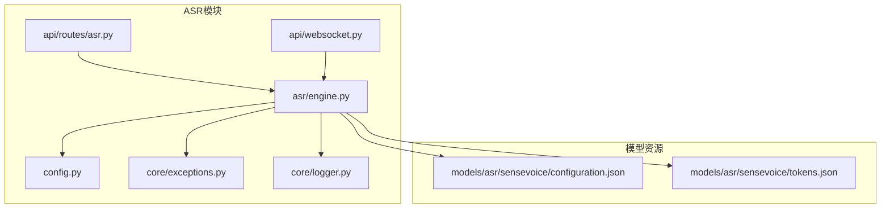
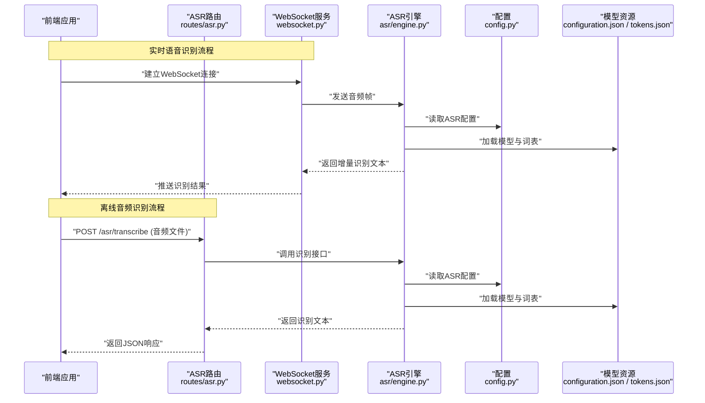
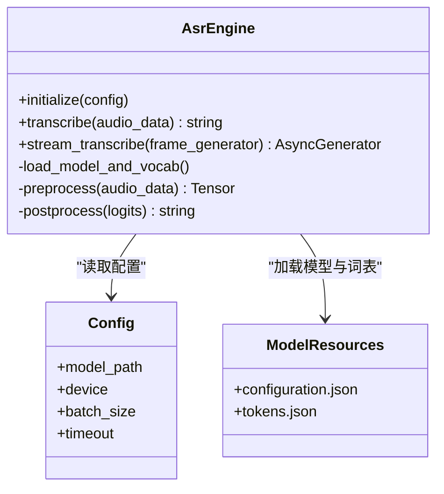
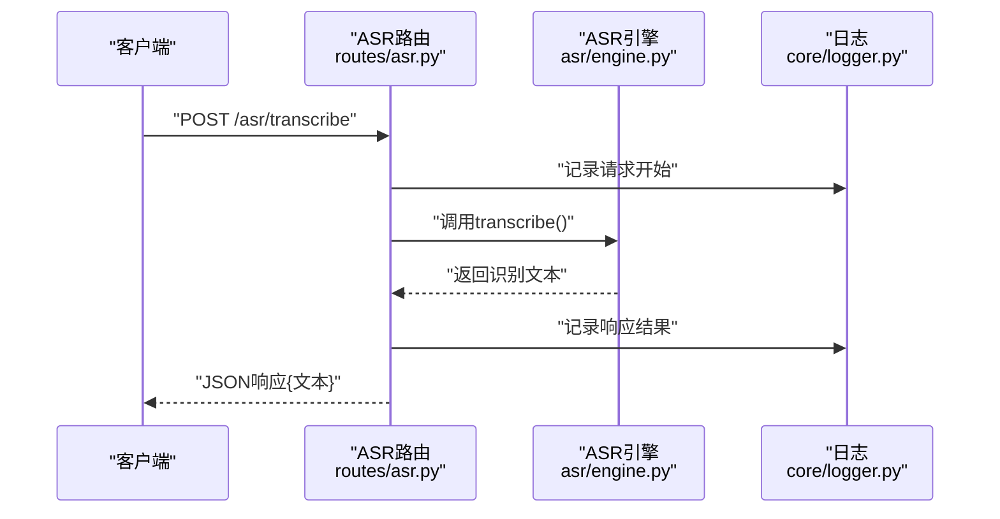
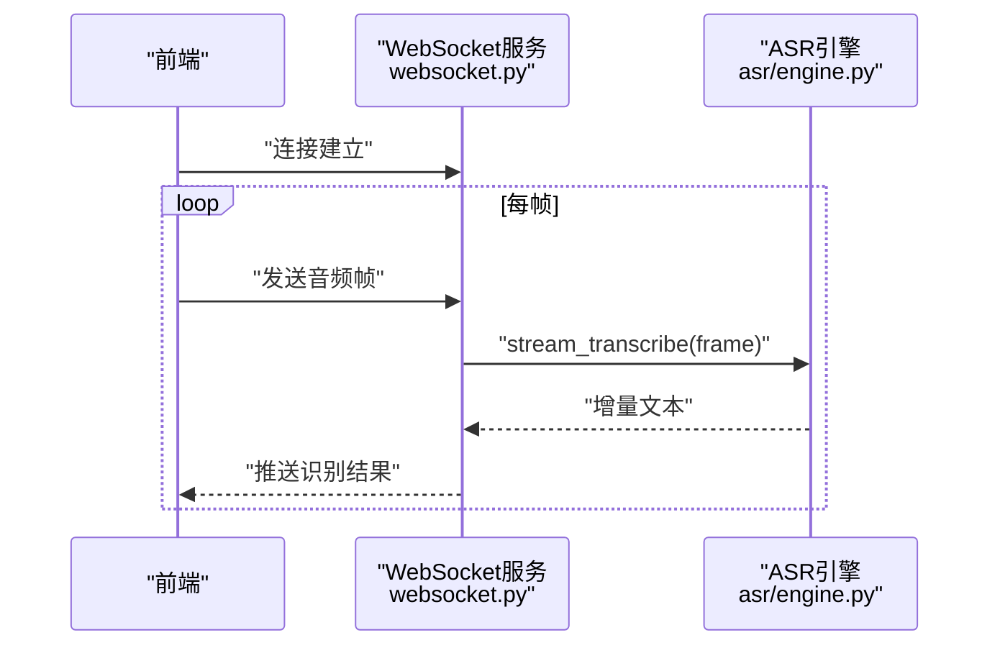
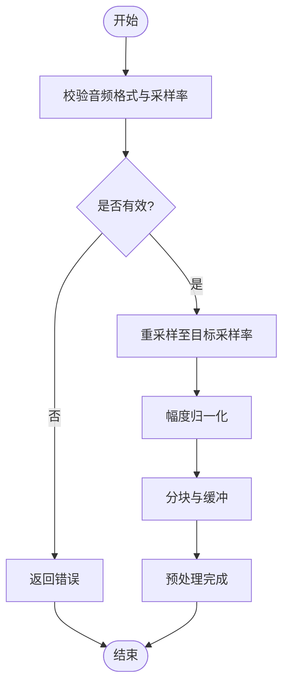
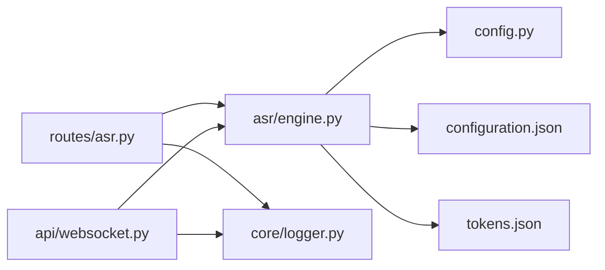

# ASR语音识别引擎

<cite>
**本文引用的文件**   
- [backend_design/nexus/asr/engine.py](file://backend_design/nexus/asr/engine.py)
- [backend_design/nexus/api/routes/asr.py](file://backend_design/nexus/api/routes/asr.py)
- [backend_design/nexus/api/websocket.py](file://backend_design/nexus/api/websocket.py)
- [backend_design/nexus/config.py](file://backend_design/nexus/config.py)
- [backend_design/nexus/core/exceptions.py](file://backend_design/nexus/core/exceptions.py)
- [backend_design/nexus/core/logger.py](file://backend_design/nexus/core/logger.py)
- [models/asr/sensevoice/configuration.json](file://models/asr/sensevoice/configuration.json)
- [models/asr/sensevoice/tokens.json](file://models/asr/sensevoice/tokens.json)
</cite>

## 目录
1. [简介](#简介)
2. [项目结构](#项目结构)
3. [核心组件](#核心组件)
4. [架构总览](#架构总览)
5. [详细组件分析](#详细组件分析)
6. [依赖关系分析](#依赖关系分析)
7. [性能考虑](#性能考虑)
8. [故障排除指南](#故障排除指南)
9. [结论](#结论)
10. [附录](#附录)

## 简介
本技术文档聚焦于NexusCockpit的ASR（自动语音识别）引擎，围绕SenseVoice模型的集成实现、音频预处理流程、实时语音识别算法与错误处理机制展开。文档同时说明支持的音频格式、采样率要求、语言模型配置，并提供API调用示例与WebSocket实时通信集成方式，以及性能优化策略和常见问题排查方法。

## 项目结构
ASR相关代码主要位于后端模块中：
- ASR引擎实现：backend_design/nexus/asr/engine.py
- REST API路由：backend_design/nexus/api/routes/asr.py
- WebSocket服务：backend_design/nexus/api/websocket.py
- 配置管理：backend_design/nexus/config.py
- 异常与日志：backend_design/nexus/core/exceptions.py、backend_design/nexus/core/logger.py
- SenseVoice模型配置与词表：models/asr/sensevoice/configuration.json、models/asr/sensevoice/tokens.json

图表来源
- [backend_design/nexus/asr/engine.py](file://backend_design/nexus/asr/engine.py)
- [backend_design/nexus/api/routes/asr.py](file://backend_design/nexus/api/routes/asr.py)
- [backend_design/nexus/api/websocket.py](file://backend_design/nexus/api/websocket.py)
- [backend_design/nexus/config.py](file://backend_design/nexus/config.py)
- [backend_design/nexus/core/exceptions.py](file://backend_design/nexus/core/exceptions.py)
- [backend_design/nexus/core/logger.py](file://backend_design/nexus/core/logger.py)
- [models/asr/sensevoice/configuration.json](file://models/asr/sensevoice/configuration.json)
- [models/asr/sensevoice/tokens.json](file://models/asr/sensevoice/tokens.json)

章节来源
- [backend_design/nexus/asr/engine.py](file://backend_design/nexus/asr/engine.py)
- [backend_design/nexus/api/routes/asr.py](file://backend_design/nexus/api/routes/asr.py)
- [backend_design/nexus/api/websocket.py](file://backend_design/nexus/api/websocket.py)
- [backend_design/nexus/config.py](file://backend_design/nexus/config.py)
- [backend_design/nexus/core/exceptions.py](file://backend_design/nexus/core/exceptions.py)
- [backend_design/nexus/core/logger.py](file://backend_design/nexus/core/logger.py)
- [models/asr/sensevoice/configuration.json](file://models/asr/sensevoice/configuration.json)
- [models/asr/sensevoice/tokens.json](file://models/asr/sensevoice/tokens.json)

## 核心组件
- ASR引擎（engine.py）
  - 负责加载SenseVoice模型与配置，执行音频预处理、推理与后处理，输出文本结果。
  - 提供同步与流式接口，支持批量与单条音频识别。
- ASR路由（routes/asr.py）
  - 暴露REST API端点，接收音频文件或流数据，调用ASR引擎进行识别并返回文本。
- WebSocket服务（websocket.py）
  - 维护长连接，转发前端音频帧至ASR引擎，实时推送识别结果。
- 配置（config.py）
  - 集中管理ASR相关参数（如模型路径、设备、批大小、超时等）。
- 异常与日志（core/exceptions.py、core/logger.py）
  - 定义统一异常类型与日志记录器，用于错误上报与可观测性。
- 模型资源（configuration.json、tokens.json）
  - 包含SenseVoice模型配置与词表信息，供引擎初始化使用。

章节来源
- [backend_design/nexus/asr/engine.py](file://backend_design/nexus/asr/engine.py)
- [backend_design/nexus/api/routes/asr.py](file://backend_design/nexus/api/routes/asr.py)
- [backend_design/nexus/api/websocket.py](file://backend_design/nexus/api/websocket.py)
- [backend_design/nexus/config.py](file://backend_design/nexus/config.py)
- [backend_design/nexus/core/exceptions.py](file://backend_design/nexus/core/exceptions.py)
- [backend_design/nexus/core/logger.py](file://backend_design/nexus/core/logger.py)
- [models/asr/sensevoice/configuration.json](file://models/asr/sensevoice/configuration.json)
- [models/asr/sensevoice/tokens.json](file://models/asr/sensevoice/tokens.json)

## 架构总览
整体架构由前端采集音频，通过REST或WebSocket传输到后端；后端路由将请求分发至ASR引擎；引擎加载SenseVoice模型并进行预处理与推理；最终返回识别文本。

图表来源
- [backend_design/nexus/api/routes/asr.py](file://backend_design/nexus/api/routes/asr.py)
- [backend_design/nexus/api/websocket.py](file://backend_design/nexus/api/websocket.py)
- [backend_design/nexus/asr/engine.py](file://backend_design/nexus/asr/engine.py)
- [backend_design/nexus/config.py](file://backend_design/nexus/config.py)
- [models/asr/sensevoice/configuration.json](file://models/asr/sensevoice/configuration.json)
- [models/asr/sensevoice/tokens.json](file://models/asr/sensevoice/tokens.json)

## 详细组件分析

### ASR引擎（SenseVoice集成）
- 模型加载与初始化
  - 从配置读取模型路径、设备、批大小、超时等参数。
  - 加载SenseVoice模型配置文件与词表，构建推理上下文。
- 音频预处理
  - 校验输入音频格式与采样率，必要时重采样与归一化。
  - 分块与缓冲策略，保证低延迟与高吞吐。
- 推理与后处理
  - 对预处理后的特征进行模型推理，解码为文本。
  - 可选的语言模型与热词增强，提升识别准确率。
- 接口设计
  - 同步接口：一次性识别完整音频。
  - 流式接口：按帧推进，增量返回识别结果。

图表来源
- [backend_design/nexus/asr/engine.py](file://backend_design/nexus/asr/engine.py)
- [backend_design/nexus/config.py](file://backend_design/nexus/config.py)
- [models/asr/sensevoice/configuration.json](file://models/asr/sensevoice/configuration.json)
- [models/asr/sensevoice/tokens.json](file://models/asr/sensevoice/tokens.json)

章节来源
- [backend_design/nexus/asr/engine.py](file://backend_design/nexus/asr/engine.py)
- [backend_design/nexus/config.py](file://backend_design/nexus/config.py)
- [models/asr/sensevoice/configuration.json](file://models/asr/sensevoice/configuration.json)
- [models/asr/sensevoice/tokens.json](file://models/asr/sensevoice/tokens.json)

### REST API（音频转文本）
- 端点设计
  - POST /asr/transcribe：上传音频文件或二进制流，返回识别文本。
- 请求与响应
  - 请求体：音频二进制或表单字段。
  - 响应体：JSON，包含文本字段与状态码。
- 错误处理
  - 非法输入、模型加载失败、推理超时等异常统一封装为HTTP错误响应。

图表来源
- [backend_design/nexus/api/routes/asr.py](file://backend_design/nexus/api/routes/asr.py)
- [backend_design/nexus/asr/engine.py](file://backend_design/nexus/asr/engine.py)
- [backend_design/nexus/core/logger.py](file://backend_design/nexus/core/logger.py)

章节来源
- [backend_design/nexus/api/routes/asr.py](file://backend_design/nexus/api/routes/asr.py)
- [backend_design/nexus/core/logger.py](file://backend_design/nexus/core/logger.py)

### WebSocket实时通信
- 连接管理
  - 前端建立WebSocket连接，服务端维护会话与心跳。
- 数据传输
  - 前端按固定时长切片发送音频帧；服务端累积并送入ASR引擎流式接口。
- 结果推送
  - 引擎返回增量文本，服务端即时推送给前端。

图表来源
- [backend_design/nexus/api/websocket.py](file://backend_design/nexus/api/websocket.py)
- [backend_design/nexus/asr/engine.py](file://backend_design/nexus/asr/engine.py)

章节来源
- [backend_design/nexus/api/websocket.py](file://backend_design/nexus/api/websocket.py)
- [backend_design/nexus/asr/engine.py](file://backend_design/nexus/asr/engine.py)

### 音频预处理流程
- 输入校验
  - 检查音频格式（如PCM/WAV）、采样率是否符合要求。
- 重采样与归一化
  - 将不同采样率的音频统一至模型期望采样率，幅度归一化。
- 分块与缓冲
  - 根据延迟与吞吐需求设置分块大小与缓冲区长度。

图表来源
- [backend_design/nexus/asr/engine.py](file://backend_design/nexus/asr/engine.py)
- [backend_design/nexus/config.py](file://backend_design/nexus/config.py)

章节来源
- [backend_design/nexus/asr/engine.py](file://backend_design/nexus/asr/engine.py)
- [backend_design/nexus/config.py](file://backend_design/nexus/config.py)

### 错误处理机制
- 统一异常类型
  - 定义ASR相关异常（如模型加载失败、推理超时、输入无效）。
- 日志记录
  - 关键路径记录错误堆栈与上下文，便于定位问题。
- 恢复策略
  - 重试、降级与熔断（结合系统级熔断器）保障稳定性。

章节来源
- [backend_design/nexus/core/exceptions.py](file://backend_design/nexus/core/exceptions.py)
- [backend_design/nexus/core/logger.py](file://backend_design/nexus/core/logger.py)

## 依赖关系分析
- 内部依赖
  - ASR路由依赖ASR引擎与日志。
  - WebSocket服务依赖ASR引擎与会话管理。
  - ASR引擎依赖配置与模型资源。
- 外部依赖
  - 模型资源（configuration.json、tokens.json）决定模型行为与词汇表。
  - 运行时环境（GPU/CPU）影响推理性能。

图表来源
- [backend_design/nexus/api/routes/asr.py](file://backend_design/nexus/api/routes/asr.py)
- [backend_design/nexus/api/websocket.py](file://backend_design/nexus/api/websocket.py)
- [backend_design/nexus/asr/engine.py](file://backend_design/nexus/asr/engine.py)
- [backend_design/nexus/config.py](file://backend_design/nexus/config.py)
- [models/asr/sensevoice/configuration.json](file://models/asr/sensevoice/configuration.json)
- [models/asr/sensevoice/tokens.json](file://models/asr/sensevoice/tokens.json)
- [backend_design/nexus/core/logger.py](file://backend_design/nexus/core/logger.py)

章节来源
- [backend_design/nexus/api/routes/asr.py](file://backend_design/nexus/api/routes/asr.py)
- [backend_design/nexus/api/websocket.py](file://backend_design/nexus/api/websocket.py)
- [backend_design/nexus/asr/engine.py](file://backend_design/nexus/asr/engine.py)
- [backend_design/nexus/config.py](file://backend_design/nexus/config.py)
- [models/asr/sensevoice/configuration.json](file://models/asr/sensevoice/configuration.json)
- [models/asr/sensevoice/tokens.json](file://models/asr/sensevoice/tokens.json)
- [backend_design/nexus/core/logger.py](file://backend_design/nexus/core/logger.py)

## 性能考虑
- 批处理与并发
  - 合理设置批大小与并发度，平衡延迟与吞吐。
- 内存与缓存
  - 复用模型实例与预处理缓存，减少重复计算。
- 网络与I/O
  - 使用零拷贝与异步I/O降低开销；WebSocket帧大小与频率需调优。
- 设备利用
  - 在GPU可用时启用加速；CPU模式下限制并发避免过载。
- 监控与度量
  - 记录端到端延迟、吞吐与错误率，持续优化。

[本节为通用指导，不直接分析具体文件]

## 故障排除指南
- 模型加载失败
  - 检查模型路径与权限；确认configuration.json与tokens.json存在且可读。
- 音频格式不支持
  - 确保输入为PCM/WAV，采样率符合配置要求；必要时在前端进行重采样。
- 识别结果为空或乱码
  - 检查噪声环境与音量；调整分块大小与阈值；验证词表与语言模型配置。
- WebSocket断连或延迟高
  - 检查心跳与重连逻辑；减小帧大小或增加带宽；评估服务端负载。
- 超时与错误码
  - 查看日志中的异常堆栈；根据异常类型采取重试或降级策略。

章节来源
- [backend_design/nexus/core/exceptions.py](file://backend_design/nexus/core/exceptions.py)
- [backend_design/nexus/core/logger.py](file://backend_design/nexus/core/logger.py)
- [backend_design/nexus/asr/engine.py](file://backend_design/nexus/asr/engine.py)
- [backend_design/nexus/api/websocket.py](file://backend_design/nexus/api/websocket.py)

## 结论
本ASR引擎以SenseVoice为核心，结合统一的配置管理与完善的错误处理，提供了稳定高效的语音识别能力。通过REST与WebSocket双通道，既满足离线音频转写，也支持实时语音交互。合理的预处理、流式推理与性能调优策略，使其在复杂场景下仍保持良好体验。

[本节为总结，不直接分析具体文件]

## 附录

### 支持的音频格式与采样率
- 常见格式：PCM、WAV（无压缩或无损压缩）
- 采样率：依据SenseVoice模型配置（通常为16kHz或更高），可在配置文件中指定目标采样率
- 声道：建议单声道以降低带宽与计算量

章节来源
- [backend_design/nexus/asr/engine.py](file://backend_design/nexus/asr/engine.py)
- [backend_design/nexus/config.py](file://backend_design/nexus/config.py)
- [models/asr/sensevoice/configuration.json](file://models/asr/sensevoice/configuration.json)

### 语言模型配置
- 词表：tokens.json定义识别词汇与特殊标记
- 模型配置：configuration.json包含模型结构与超参
- 热词与领域定制：可通过配置注入热词以提升特定领域识别效果

章节来源
- [models/asr/sensevoice/tokens.json](file://models/asr/sensevoice/tokens.json)
- [models/asr/sensevoice/configuration.json](file://models/asr/sensevoice/configuration.json)
- [backend_design/nexus/asr/engine.py](file://backend_design/nexus/asr/engine.py)

### API调用示例（概念性）
- REST
  - 请求：POST /asr/transcribe，携带音频二进制
  - 响应：JSON，包含文本字段
- WebSocket
  - 连接：ws://host/asr/stream
  - 消息：前端发送音频帧，服务端推送增量文本

章节来源
- [backend_design/nexus/api/routes/asr.py](file://backend_design/nexus/api/routes/asr.py)
- [backend_design/nexus/api/websocket.py](file://backend_design/nexus/api/websocket.py)