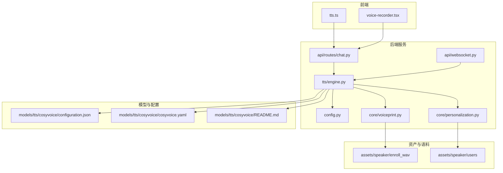
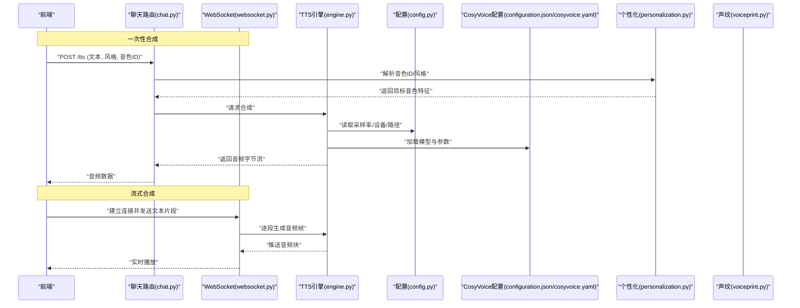
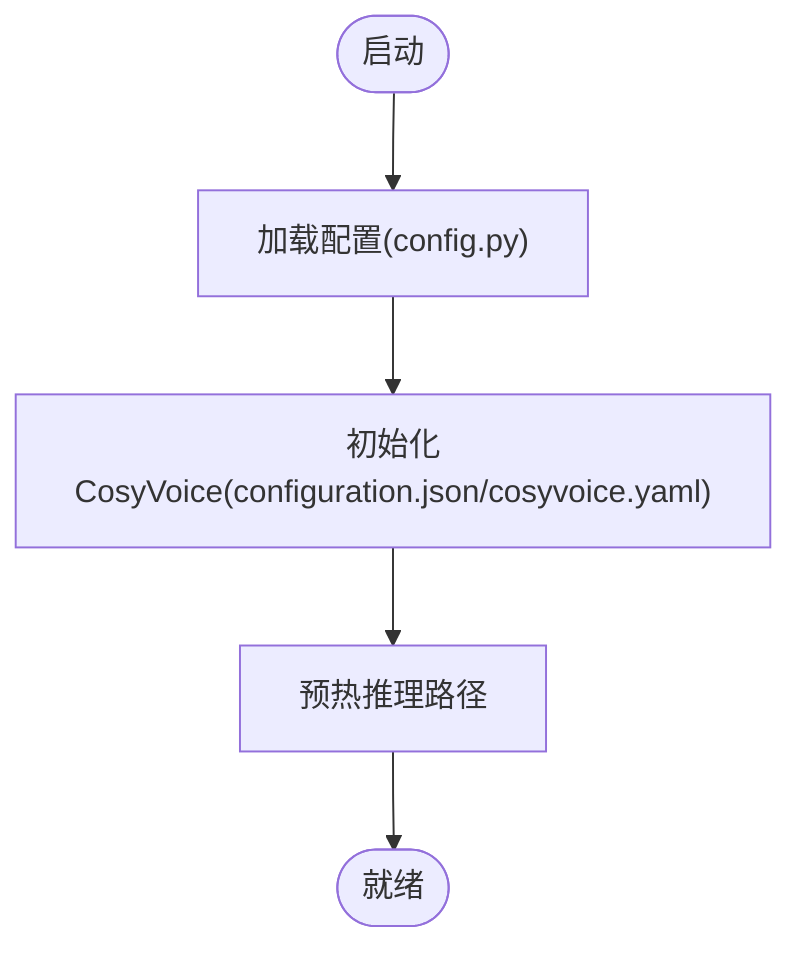
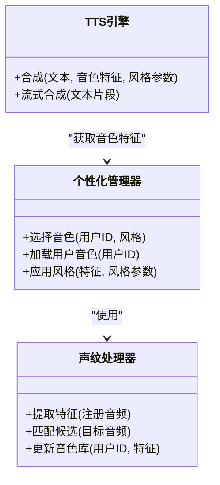
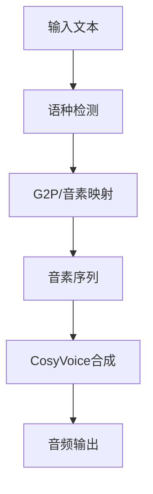
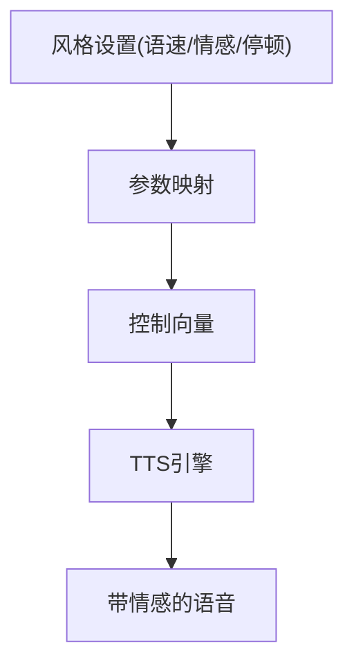
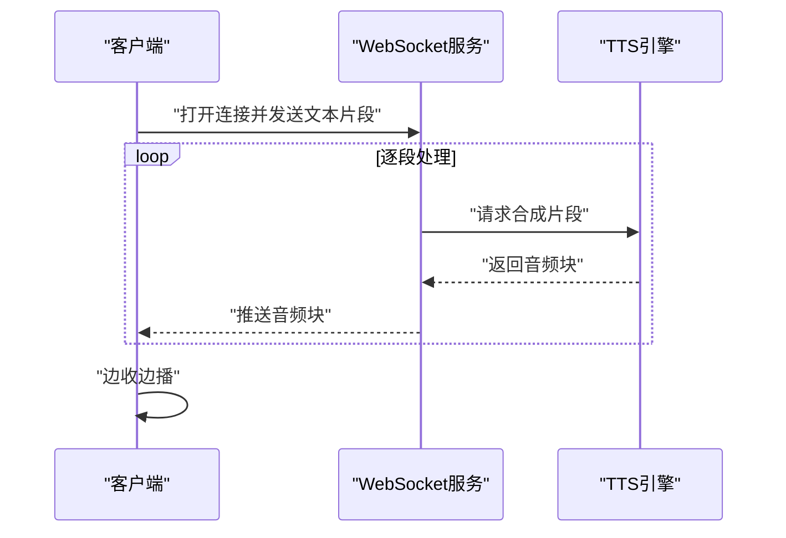
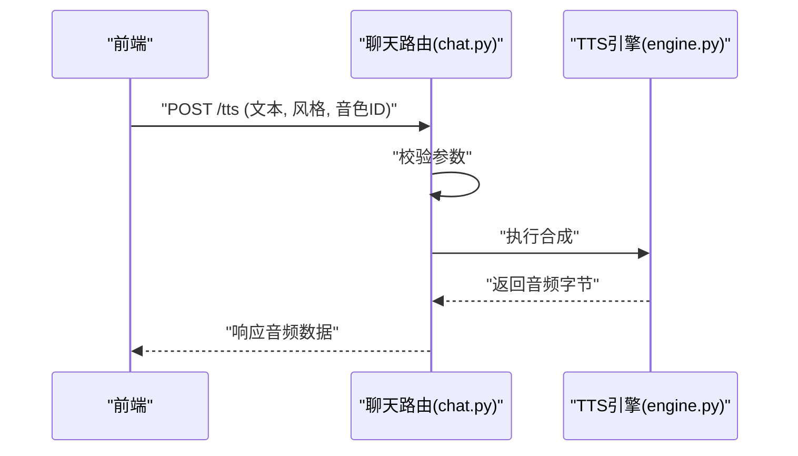
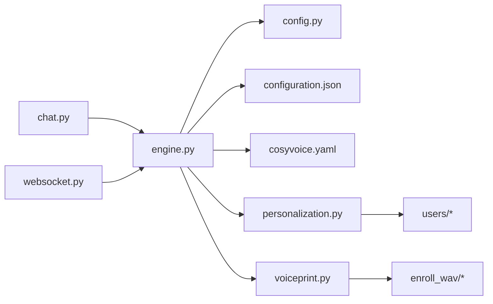

# TTS文本转语音合成

<cite>
**本文引用的文件**   
- [backend_design/nexus/tts/engine.py](file://backend_design/nexus/tts/engine.py)
- [backend_design/nexus/config.py](file://backend_design/nexus/config.py)
- [models/tts/cosyvoice/configuration.json](file://models/tts/cosyvoice/configuration.json)
- [models/tts/cosyvoice/cosyvoice.yaml](file://models/tts/cosyvoice/cosyvoice.yaml)
- [models/tts/cosyvoice/README.md](file://models/tts/cosyvoice/README.md)
- [assets/speaker/enroll_wav/README.md](file://assets/speaker/enroll_wav/README.md)
- [assets/speaker/users/cockpit-01/nexus_dev/README.md](file://assets/speaker/users/cockpit-01/nexus_dev/README.md)
- [assets/speaker/users/cockpit-02/nexus_dev/README.md](file://assets/speaker/users/cockpit-02/nexus_dev/README.md)
- [frontend_design/src/lib/tts.ts](file://frontend_design/src/lib/tts.ts)
- [frontend_design/src/components/voice-recorder.tsx](file://frontend_design/src/components/voice-recorder.tsx)
- [docs/voice/tts-guide.md](file://docs/voice/tts-guide.md)
- [docs/voice/audio-pipeline-guide.md](file://docs/voice/audio-pipeline-guide.md)
- [docs/voice/voiceprint-guide.md](file://docs/voice/voiceprint-guide.md)
- [backend_design/nexus/core/personalization.py](file://backend_design/nexus/core/personalization.py)
- [backend_design/nexus/core/voiceprint.py](file://backend_design/nexus/core/voiceprint.py)
- [backend_design/nexus/api/routes/chat.py](file://backend_design/nexus/api/routes/chat.py)
- [backend_design/nexus/api/websocket.py](file://backend_design/nexus/api/websocket.py)
</cite>

## 目录
1. [简介](#简介)
2. [项目结构](#项目结构)
3. [核心组件](#核心组件)
4. [架构总览](#架构总览)
5. [详细组件分析](#详细组件分析)
6. [依赖关系分析](#依赖关系分析)
7. [性能与质量评估](#性能与质量评估)
8. [故障排查指南](#故障排查指南)
9. [结论](#结论)
10. [附录](#附录)

## 简介
本技术文档面向TTS（文本转语音）系统，重点说明CosyVoice情感化语音合成引擎在本项目中的集成与配置方法，解释个性化音色支持与声音克隆的实现原理，描述多语言语音合成的语料库管理与发音规则配置，提供语音风格控制与情感表达的参数调节指南，并给出流式语音合成与实时播放的实现机制、语音质量评估指标与优化策略，以及音色定制与自定义语音库的创建方法。

## 项目结构
本项目在“后端设计”中实现了TTS引擎封装与API暴露，前端通过HTTP/WebSocket进行交互；模型侧采用CosyVoice的配置与资源；资产侧包含说话人注册音频与用户音色数据；文档侧提供TTS与声纹相关的使用指南。

图表来源
- [backend_design/nexus/tts/engine.py](file://backend_design/nexus/tts/engine.py)
- [backend_design/nexus/config.py](file://backend_design/nexus/config.py)
- [models/tts/cosyvoice/configuration.json](file://models/tts/cosyvoice/configuration.json)
- [models/tts/cosyvoice/cosyvoice.yaml](file://models/tts/cosyvoice/cosyvoice.yaml)
- [models/tts/cosyvoice/README.md](file://models/tts/cosyvoice/README.md)
- [assets/speaker/enroll_wav/README.md](file://assets/speaker/enroll_wav/README.md)
- [assets/speaker/users/cockpit-01/nexus_dev/README.md](file://assets/speaker/users/cockpit-01/nexus_dev/README.md)
- [assets/speaker/users/cockpit-02/nexus_dev/README.md](file://assets/speaker/users/cockpit-02/nexus_dev/README.md)
- [frontend_design/src/lib/tts.ts](file://frontend_design/src/lib/tts.ts)
- [frontend_design/src/components/voice-recorder.tsx](file://frontend_design/src/components/voice-recorder.tsx)
- [backend_design/nexus/api/routes/chat.py](file://backend_design/nexus/api/routes/chat.py)
- [backend_design/nexus/api/websocket.py](file://backend_design/nexus/api/websocket.py)

章节来源
- [backend_design/nexus/tts/engine.py](file://backend_design/nexus/tts/engine.py)
- [backend_design/nexus/config.py](file://backend_design/nexus/config.py)
- [models/tts/cosyvoice/configuration.json](file://models/tts/cosyvoice/configuration.json)
- [models/tts/cosyvoice/cosyvoice.yaml](file://models/tts/cosyvoice/cosyvoice.yaml)
- [models/tts/cosyvoice/README.md](file://models/tts/cosyvoice/README.md)
- [assets/speaker/enroll_wav/README.md](file://assets/speaker/enroll_wav/README.md)
- [assets/speaker/users/cockpit-01/nexus_dev/README.md](file://assets/speaker/users/cockpit-01/nexus_dev/README.md)
- [assets/speaker/users/cockpit-02/nexus_dev/README.md](file://assets/speaker/users/cockpit-02/nexus_dev/README.md)
- [frontend_design/src/lib/tts.ts](file://frontend_design/src/lib/tts.ts)
- [frontend_design/src/components/voice-recorder.tsx](file://frontend_design/src/components/voice-recorder.tsx)
- [backend_design/nexus/api/routes/chat.py](file://backend_design/nexus/api/routes/chat.py)
- [backend_design/nexus/api/websocket.py](file://backend_design/nexus/api/websocket.py)

## 核心组件
- TTS引擎封装：负责加载CosyVoice模型与配置，接收文本与风格参数，输出音频流或完整音频。
- 配置管理：集中管理CosyVoice路径、采样率、设备、并发等运行参数。
- 个性化与声纹：基于用户历史录音与注册音频，选择或合成目标音色，支持声音克隆。
- API层：提供REST接口用于一次性合成，提供WebSocket接口用于流式合成与实时播放。
- 前端交互：调用TTS接口，处理音频流播放与录制。

章节来源
- [backend_design/nexus/tts/engine.py](file://backend_design/nexus/tts/engine.py)
- [backend_design/nexus/config.py](file://backend_design/nexus/config.py)
- [backend_design/nexus/core/personalization.py](file://backend_design/nexus/core/personalization.py)
- [backend_design/nexus/core/voiceprint.py](file://backend_design/nexus/core/voiceprint.py)
- [backend_design/nexus/api/routes/chat.py](file://backend_design/nexus/api/routes/chat.py)
- [backend_design/nexus/api/websocket.py](file://backend_design/nexus/api/websocket.py)
- [frontend_design/src/lib/tts.ts](file://frontend_design/src/lib/tts.ts)
- [frontend_design/src/components/voice-recorder.tsx](file://frontend_design/src/components/voice-recorder.tsx)

## 架构总览
下图展示了从前端到后端的端到端流程，包括一次性合成与流式合成两条路径，以及个性化音色与声音克隆的参与点。

图表来源
- [backend_design/nexus/api/routes/chat.py](file://backend_design/nexus/api/routes/chat.py)
- [backend_design/nexus/api/websocket.py](file://backend_design/nexus/api/websocket.py)
- [backend_design/nexus/tts/engine.py](file://backend_design/nexus/tts/engine.py)
- [backend_design/nexus/config.py](file://backend_design/nexus/config.py)
- [models/tts/cosyvoice/configuration.json](file://models/tts/cosyvoice/configuration.json)
- [models/tts/cosyvoice/cosyvoice.yaml](file://models/tts/cosyvoice/cosyvoice.yaml)
- [backend_design/nexus/core/personalization.py](file://backend_design/nexus/core/personalization.py)
- [backend_design/nexus/core/voiceprint.py](file://backend_design/nexus/core/voiceprint.py)

## 详细组件分析

### CosyVoice集成与配置
- 模型与参数：通过CosyVoice的配置文件与YAML定义加载模型权重、声学参数与推理选项。
- 运行时配置：由统一配置模块提供采样率、设备类型、批大小、缓存策略等。
- 初始化流程：启动时加载配置与模型，预热关键路径以降低首包延迟。

图表来源
- [backend_design/nexus/config.py](file://backend_design/nexus/config.py)
- [models/tts/cosyvoice/configuration.json](file://models/tts/cosyvoice/configuration.json)
- [models/tts/cosyvoice/cosyvoice.yaml](file://models/tts/cosyvoice/cosyvoice.yaml)
- [models/tts/cosyvoice/README.md](file://models/tts/cosyvoice/README.md)

章节来源
- [backend_design/nexus/tts/engine.py](file://backend_design/nexus/tts/engine.py)
- [backend_design/nexus/config.py](file://backend_design/nexus/config.py)
- [models/tts/cosyvoice/configuration.json](file://models/tts/cosyvoice/configuration.json)
- [models/tts/cosyvoice/cosyvoice.yaml](file://models/tts/cosyvoice/cosyvoice.yaml)
- [models/tts/cosyvoice/README.md](file://models/tts/cosyvoice/README.md)

### 个性化音色与声音克隆
- 个性化音色：根据用户ID或偏好选择预置或已注册的音色，结合风格参数生成自然语音。
- 声音克隆：使用注册音频提取说话人特征，作为条件输入驱动CosyVoice合成目标音色。
- 数据组织：注册音频存放于enroll_wav目录，用户音色数据按租户/用户维度组织。

图表来源
- [backend_design/nexus/core/personalization.py](file://backend_design/nexus/core/personalization.py)
- [backend_design/nexus/core/voiceprint.py](file://backend_design/nexus/core/voiceprint.py)
- [assets/speaker/enroll_wav/README.md](file://assets/speaker/enroll_wav/README.md)
- [assets/speaker/users/cockpit-01/nexus_dev/README.md](file://assets/speaker/users/cockpit-01/nexus_dev/README.md)
- [assets/speaker/users/cockpit-02/nexus_dev/README.md](file://assets/speaker/users/cockpit-02/nexus_dev/README.md)

章节来源
- [backend_design/nexus/core/personalization.py](file://backend_design/nexus/core/personalization.py)
- [backend_design/nexus/core/voiceprint.py](file://backend_design/nexus/core/voiceprint.py)
- [assets/speaker/enroll_wav/README.md](file://assets/speaker/enroll_wav/README.md)
- [assets/speaker/users/cockpit-01/nexus_dev/README.md](file://assets/speaker/users/cockpit-01/nexus_dev/README.md)
- [assets/speaker/users/cockpit-02/nexus_dev/README.md](file://assets/speaker/users/cockpit-02/nexus_dev/README.md)

### 多语言语料与发音规则
- 语料管理：在多语言场景下，按语种划分语料与词典，确保训练与推理阶段的一致性。
- 发音规则：通过G2P或音素映射表将文本转为音素序列，提升跨语言可读性与稳定性。
- 配置项：在CosyVoice配置中指定多语言开关、词典路径与回退策略。

[此图为概念性流程图，不直接映射具体源文件]

章节来源
- [models/tts/cosyvoice/configuration.json](file://models/tts/cosyvoice/configuration.json)
- [models/tts/cosyvoice/cosyvoice.yaml](file://models/tts/cosyvoice/cosyvoice.yaml)
- [docs/voice/tts-guide.md](file://docs/voice/tts-guide.md)

### 语音风格控制与情感表达
- 风格参数：包括语速、语调、情感强度、停顿长度等，影响合成结果的自然度与表现力。
- 参数映射：将高层风格语义映射为底层声学控制向量，注入到CosyVoice推理过程。
- 动态调整：支持运行时修改风格参数，实现对话中的即时情感切换。

[此图为概念性流程图，不直接映射具体源文件]

章节来源
- [backend_design/nexus/tts/engine.py](file://backend_design/nexus/tts/engine.py)
- [docs/voice/tts-guide.md](file://docs/voice/tts-guide.md)

### 流式语音合成与实时播放
- 流式合成：将长文本切分为片段，逐段生成音频块，降低首包延迟。
- WebSocket传输：服务端以音频块为单位推送，客户端边收边播。
- 缓冲策略：合理设置缓冲区大小与丢弃策略，平衡流畅度与延迟。

图表来源
- [backend_design/nexus/api/websocket.py](file://backend_design/nexus/api/websocket.py)
- [backend_design/nexus/tts/engine.py](file://backend_design/nexus/tts/engine.py)
- [frontend_design/src/lib/tts.ts](file://frontend_design/src/lib/tts.ts)

章节来源
- [backend_design/nexus/api/websocket.py](file://backend_design/nexus/api/websocket.py)
- [backend_design/nexus/tts/engine.py](file://backend_design/nexus/tts/engine.py)
- [frontend_design/src/lib/tts.ts](file://frontend_design/src/lib/tts.ts)

### 一次性合成API流程
- REST接口：接收文本、风格与音色ID，返回完整音频。
- 错误处理：对无效输入、模型未就绪、资源不足等情况返回明确状态码与消息。
- 缓存策略：对相同请求可启用短时缓存以提升吞吐。

图表来源
- [backend_design/nexus/api/routes/chat.py](file://backend_design/nexus/api/routes/chat.py)
- [backend_design/nexus/tts/engine.py](file://backend_design/nexus/tts/engine.py)

章节来源
- [backend_design/nexus/api/routes/chat.py](file://backend_design/nexus/api/routes/chat.py)
- [backend_design/nexus/tts/engine.py](file://backend_design/nexus/tts/engine.py)

## 依赖关系分析
- 组件耦合：TTS引擎依赖配置与CosyVoice模型；个性化与声纹模块为TTS提供音色特征；API层编排调用。
- 外部依赖：前端通过HTTP/WebSocket与后端交互；模型侧依赖CosyVoice配置与权重。
- 潜在循环：当前结构无直接循环依赖，但需注意在扩展功能时避免引入循环引用。

图表来源
- [backend_design/nexus/api/routes/chat.py](file://backend_design/nexus/api/routes/chat.py)
- [backend_design/nexus/api/websocket.py](file://backend_design/nexus/api/websocket.py)
- [backend_design/nexus/tts/engine.py](file://backend_design/nexus/tts/engine.py)
- [backend_design/nexus/config.py](file://backend_design/nexus/config.py)
- [models/tts/cosyvoice/configuration.json](file://models/tts/cosyvoice/configuration.json)
- [models/tts/cosyvoice/cosyvoice.yaml](file://models/tts/cosyvoice/cosyvoice.yaml)
- [backend_design/nexus/core/personalization.py](file://backend_design/nexus/core/personalization.py)
- [backend_design/nexus/core/voiceprint.py](file://backend_design/nexus/core/voiceprint.py)
- [assets/speaker/users/cockpit-01/nexus_dev/README.md](file://assets/speaker/users/cockpit-01/nexus_dev/README.md)
- [assets/speaker/enroll_wav/README.md](file://assets/speaker/enroll_wav/README.md)

章节来源
- [backend_design/nexus/api/routes/chat.py](file://backend_design/nexus/api/routes/chat.py)
- [backend_design/nexus/api/websocket.py](file://backend_design/nexus/api/websocket.py)
- [backend_design/nexus/tts/engine.py](file://backend_design/nexus/tts/engine.py)
- [backend_design/nexus/config.py](file://backend_design/nexus/config.py)
- [models/tts/cosyvoice/configuration.json](file://models/tts/cosyvoice/configuration.json)
- [models/tts/cosyvoice/cosyvoice.yaml](file://models/tts/cosyvoice/cosyvoice.yaml)
- [backend_design/nexus/core/personalization.py](file://backend_design/nexus/core/personalization.py)
- [backend_design/nexus/core/voiceprint.py](file://backend_design/nexus/core/voiceprint.py)
- [assets/speaker/users/cockpit-01/nexus_dev/README.md](file://assets/speaker/users/cockpit-01/nexus_dev/README.md)
- [assets/speaker/enroll_wav/README.md](file://assets/speaker/enroll_wav/README.md)

## 性能与质量评估
- 首包延迟：流式合成应控制在毫秒级，可通过预热与分片策略优化。
- 吞吐能力：批量合成与异步队列提升整体吞吐，注意内存与GPU占用。
- 音质指标：MOS（主观平均意见得分）、PESQ、STOI等客观指标用于评估清晰度与自然度。
- 资源监控：CPU/GPU利用率、显存峰值、I/O等待时间纳入观测。
- 优化策略：
  - 模型侧：量化、剪枝、算子融合。
  - 推理侧：批处理、流式分片、缓存热点请求。
  - 系统侧：连接复用、背压控制、降级策略。

[本节为通用指导，不直接分析具体文件]

## 故障排查指南
- 常见问题：
  - 模型未就绪：检查CosyVoice配置路径与权重完整性。
  - 音色缺失：确认用户音色库与注册音频存在且格式正确。
  - 流式卡顿：调整缓冲区大小与丢弃策略，检查网络抖动。
  - 音质异常：核对采样率与重采样逻辑，验证G2P与音素映射。
- 诊断步骤：
  - 查看日志与指标，定位瓶颈环节。
  - 回放失败样本，对比不同风格与音色组合。
  - 逐步隔离问题（仅文本、仅音色、仅风格）。

章节来源
- [backend_design/nexus/tts/engine.py](file://backend_design/nexus/tts/engine.py)
- [backend_design/nexus/config.py](file://backend_design/nexus/config.py)
- [docs/voice/tts-guide.md](file://docs/voice/tts-guide.md)
- [docs/voice/audio-pipeline-guide.md](file://docs/voice/audio-pipeline-guide.md)
- [docs/voice/voiceprint-guide.md](file://docs/voice/voiceprint-guide.md)

## 结论
本系统以CosyVoice为核心，结合个性化与声纹技术，提供了情感化、多语言、可定制的TTS能力。通过流式合成与实时播放机制，满足低延迟交互需求；借助完善的配置与评估体系，保障音质与性能。建议在生产环境持续优化模型与推理路径，完善监控与降级策略，提升用户体验与系统稳定性。

## 附录
- 音色定制与自定义语音库创建：
  - 准备高质量注册音频，遵循格式与时长要求。
  - 使用声纹处理器提取特征并入库，关联用户ID。
  - 在个性化管理器中绑定音色与风格，进行小样本微调与评测。
- 语料与发音规则：
  - 维护多语言词典与G2P映射，定期更新与校验。
  - 在CosyVoice配置中启用相应语言与规则，确保一致性。

章节来源
- [assets/speaker/enroll_wav/README.md](file://assets/speaker/enroll_wav/README.md)
- [assets/speaker/users/cockpit-01/nexus_dev/README.md](file://assets/speaker/users/cockpit-01/nexus_dev/README.md)
- [assets/speaker/users/cockpit-02/nexus_dev/README.md](file://assets/speaker/users/cockpit-02/nexus_dev/README.md)
- [models/tts/cosyvoice/configuration.json](file://models/tts/cosyvoice/configuration.json)
- [models/tts/cosyvoice/cosyvoice.yaml](file://models/tts/cosyvoice/cosyvoice.yaml)
- [docs/voice/voiceprint-guide.md](file://docs/voice/voiceprint-guide.md)
- [docs/voice/tts-guide.md](file://docs/voice/tts-guide.md)